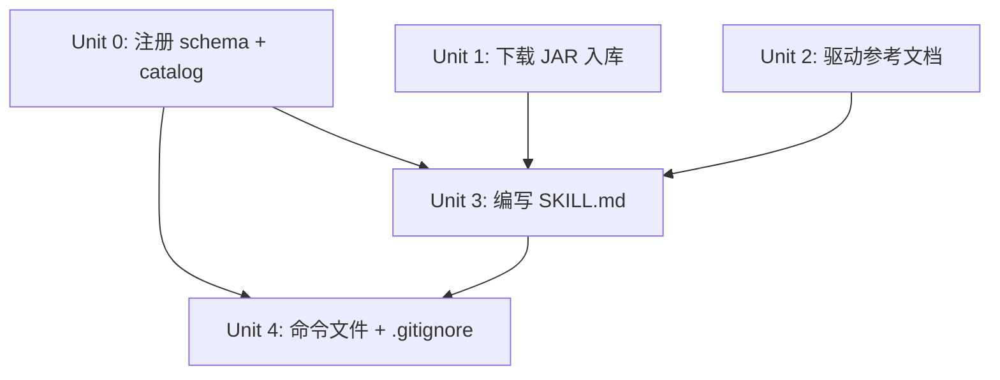

# ae-sql 全局数据库操作技能

## Overview

创建 `ae:sql` 全局数据库操作技能，通过 JDBC 连接任意数据库并执行 SQL。将 [sql-tool](https://gitee.com/jiangqiang1996/sql-tool) 的预编译 JAR（19KB）直接入库，配合自动下载的 Adoptium JRE 17 运行时实现跨平台支持。支持 MySQL、PostgreSQL、Oracle、SQL Server、SQLite 以及达梦、人大金仓、openGauss 等国产数据库。技能随本项目其他技能一起注册和分发。

## Problem Frame

ai-agent-engine 项目缺少数据库操作能力。通过集成 sql-tool（一个零依赖的 JDBC CLI 工具），可以让 AI 在任何项目中直接查询和操作数据库，覆盖国产数据库场景。sql-tool 已发布 v1.0.0-jar 版本，提供跨平台 JAR（仅 19KB），可直接用 `java -jar` 运行。

## Requirements Trace

| REQ | 标题 | 依赖 |
|-----|------|------|
| REQ-1 | 注册 ae:sql 资产到 schema 和 catalog | 无 |
| REQ-2 | 下载 sql-tool JAR 并入库 | 无 |
| REQ-3 | 创建 JDBC 驱动下载参考文档 | 无 |
| REQ-4 | 编写 SKILL.md 技能主文件（四步流程） | REQ-1 + REQ-2 + REQ-3 |
| REQ-5 | 创建命令文件并更新 .gitignore | REQ-1 + REQ-4 |

## Scope Boundaries

### In Scope

- 技能注册（schema 枚举 + catalog 条目）
- JAR 入库 + 驱动目录占位
- SKILL.md 完全重写（JRE 自动下载 + Spring Boot 配置解析 + 驱动管理 + SQL 执行）
- 命令文件 + .gitignore 运行时产物排除
- 构建/测试验证

### Out of Scope

- sql-tool Java 源码修改（直接使用 v1.0.0-jar 发布的二进制）
- 自定义 opencode plugin tool（纯 SKILL.md + bash 调用，不新增 TypeScript 工具代码）
- Docker 方式运行 sql-tool
- NoSQL 数据库支持（仅 JDBC 覆盖的关系型数据库）
- jlink 裁剪 JRE（使用标准 Adoptium JRE 17）
- sql-tool 的 DatabaseManagement 类功能（源码中未启用）

## Context & Research

### Relevant Code and Patterns

- **技能注册模式**: `src/schemas/ae-asset-schema.ts` 定义枚举 → `src/services/ae-catalog.ts` 定义条目 → 测试文件更新计数断言
- **技能目录结构**: `skills/<slug>/SKILL.md` + `skills/<slug>/references/` + `skills/<slug>/script/`
- **命令委托模式**: `commands/<name>.md` 标准格式（参见 `commands/ae-setup.md`）
- **构建同步**: `scripts/postbuild.mjs` 通过 `manifest.runtimeCommandFiles` 将命令文件复制到 `.opencode/commands/`
- **技能路径注册**: `src/services/skills-path-service.ts` 将 `skillsDir` 注入 config

### External References

- **sql-tool 仓库**: https://gitee.com/jiangqiang1996/sql-tool
- **JAR 下载**: `https://gitee.com/jiangqiang1996/sql-tool/raw/master/.opencode/skills/sql-tool/script/app/sql-tool-1.0.0.jar`（已验证可下载，19,580 bytes）
- **Adoptium JRE 17**: `https://api.adoptium.net/v3/binary/latest/17/ga/jre/{platform}/{arch}/jdk/hotspot/normal/eclipse`
- **opencode Skills 文档**: https://opencode.ai/docs/skills — 全局 skill 路径 `~/.config/opencode/skills/<name>/SKILL.md`

### Institutional Experience

- 前一个计划 `001-feat-frontend-design-chain-migration-plan.md` 建立了完整的技能/命令注册流程，本次复用相同模式

## Key Technical Decisions

- **JAR 入库而非运行时下载**: sql-tool JAR 仅 19KB，直接提交到仓库避免网络依赖和 Gitee 防盗链问题。JRE（~80MB）和驱动（~5MB）仍运行时按需下载。
- **标准 JRE 而非 jlink 裁剪**: 简化构建流程，JRE 体积可接受（全局只下载一次）。
- **SKILL.md 完全重写**: sql-tool 原版 SKILL.md 面向 jpackage 原生二进制（Windows exe），需改为 JAR + JRE 模式，并增加 Spring Boot 配置解析和跨平台支持。
- **连接信息从 Spring Boot 配置自动解析**: 减少用户每次输入连接信息的负担，覆盖最常见场景。
- **破坏性 SQL 仅靠 SKILL.md 约束**: sql-tool 本身无安全机制，通过 AI 指令约束在执行危险操作前使用 question 工具请求确认。

## Unresolved Questions

### Resolved During Planning

- JRE vs JDK: 确认 JRE 足够，sql-tool 仅使用 java.base / java.sql / java.naming 等标准模块
- 跨平台: JAR + java 命令天然跨平台，只需按平台下载对应 JRE
- JAR 下载源: Gitee 仓库 raw URL 已验证可直接访问（302 → CDN），无需认证

### Deferred to Implementation

- Spring Boot 多 Profile 激活场景（`spring.profiles.active`）的完整覆盖
- 加密密码（`ENC(...)` / `{cipher}...`）的处理策略
- Adoptium 下载在国内网络环境的可用性（可能需要镜像或代理）

---

## Output Structure

```
skills/ae-sql/
├── SKILL.md                          # 技能主文件（完全重写）
├── references/
│   └── db-drivers.md                 # JDBC 驱动下载映射表
└── script/
    ├── sql-tool-1.0.0.jar            # 19KB，从 sql-tool 仓库下载入库
    └── drivers/.gitkeep              # 空目录占位

commands/
└── ae-sql.md                         # 标准委托命令文件
```

---

## Implementation Units



> Unit 0、1、2 无依赖关系，可并行执行。Unit 3 依赖前三者全部完成。

### Unit 0: 注册 ae:sql 资产到 schema 和 catalog

**Goal:** 将 `ae:sql` 技能和 `ae-sql` 命令注册到 schema 枚举和 catalog 数组，使其纳入构建和发现机制。

**Requirements:** REQ-1

**Dependencies:** 无

**Files:**

- [ ] `src/schemas/ae-asset-schema.ts` — `AeSkillNameSchema` 枚举末尾添加 `'ae:sql'`；`AeCommandNameSchema` 枚举末尾添加 `'ae-sql'`
- [ ] `src/services/ae-catalog.ts` — `PHASE_ONE_ENTRIES` 末尾追加条目
- [ ] `src/services/ae-catalog.test.ts` — 条目计数 11 → 12
- [ ] `src/services/argument-contract.test.ts` — 条目计数 11 → 12
- [ ] `src/services/command-registration.test.ts` — 条目计数 11 → 12
- [ ] `tests/integration/runtime-entry-validation.test.ts` — 条目计数 11 → 12

**Approach:**

1. 在 `AeSkillNameSchema` 枚举末尾添加 `'ae:sql'`
2. 在 `AeCommandNameSchema` 枚举末尾添加 `'ae-sql'`
3. 在 `PHASE_ONE_ENTRIES` 追加：
   - skillName: `'ae:sql'`, skillSlug: `'ae-sql'`, commandName: `'ae-sql'`
   - description: `'通过 JDBC 连接任意数据库并执行 SQL'`
   - argumentHint: `'[SQL 语句]'`
   - commandFile: `'commands/ae-sql.md'`
   - skillFile: `'skills/ae-sql/SKILL.md'`
4. 全量搜索断言中的旧计数（当前为 11），更新为 12

**Test scenarios:**

- 正常路径: `npm run test` 全部通过
- 正常路径: `getPhaseOneEntries()` 返回包含 `ae:sql` 的 12 个条目
- 正常路径: `getDefaultEntry()` 仍返回 `ae:lfg`

**Verification:**

- [ ] `npm run build` 无错误
- [ ] `npm run test` 全部通过

---

### Unit 1: 下载 sql-tool JAR 并入库

**Goal:** 从 sql-tool Gitee 仓库下载 `sql-tool-1.0.0.jar`（19KB）到 `skills/ae-sql/script/`，创建驱动占位目录。

**Requirements:** REQ-2

**Dependencies:** 无

**Files:**

- [ ] `skills/ae-sql/script/sql-tool-1.0.0.jar` — 新建（从 Gitee 下载）
- [ ] `skills/ae-sql/script/drivers/.gitkeep` — 新建（空目录占位）

**Approach:**

1. 创建 `skills/ae-sql/script/drivers/` 目录
2. 执行下载命令：
   ```
   Invoke-WebRequest -Uri 'https://gitee.com/jiangqiang1996/sql-tool/raw/master/.opencode/skills/sql-tool/script/app/sql-tool-1.0.0.jar' -OutFile 'skills/ae-sql/script/sql-tool-1.0.0.jar'
   ```
3. 验证文件大小为 19,580 bytes

**Test scenarios:**

- 测试预期: 无 — 纯文件下载和目录创建，无行为变更

**Verification:**

- [ ] `skills/ae-sql/script/sql-tool-1.0.0.jar` 存在且大小为 19,580 bytes
- [ ] `skills/ae-sql/script/drivers/.gitkeep` 存在

---

### Unit 2: 创建 JDBC 驱动下载参考文档

**Goal:** 创建 `references/db-drivers.md`，提供 JDBC 驱动下载映射表和命令模板，供 SKILL.md 通过 `@./references/db-drivers.md` 引用。

**Requirements:** REQ-3

**Dependencies:** 无

**Files:**

- [ ] `skills/ae-sql/references/db-drivers.md` — 新建

**Approach:**

1. 创建包含以下内容的 Markdown 文档：
   - **自动下载表**（Maven Central）: MySQL、PostgreSQL、SQLite、SQL Server、Oracle、MariaDB — 含具体下载 URL
   - **需手动安装表**（国产数据库）: 达梦、人大金仓、openGauss/GaussDB、OceanBase — 含驱动文件名匹配规则和来源说明
   - **下载命令模板**: Windows PowerShell (`Invoke-WebRequest`) 和 Linux/macOS (`curl -L -o`)
   - **JDBC URL 与驱动匹配表**: 从 sql-tool 原版 SKILL.md 中提取

**Test scenarios:**

- 测试预期: 无 — 纯参考文档，无行为变更

**Verification:**

- [ ] `skills/ae-sql/references/db-drivers.md` 存在
- [ ] 包含至少 10 种数据库的驱动映射

---

### Unit 3: 编写 SKILL.md 技能主文件

**Goal:** 完全重写 SKILL.md，实现四步流程：环境准备（JRE）→ 连接信息获取 → 驱动检查 → SQL 执行。面向 AI 代理设计，每步提供具体的 bash 命令模板。

**Requirements:** REQ-4

**Dependencies:** Unit 0 + Unit 1 + Unit 2

**Files:**

- [ ] `skills/ae-sql/SKILL.md` — 新建，完全重写

**Approach:**

YAML frontmatter:
```yaml
name: ae-sql
description: 通过 JDBC 连接任意数据库并执行 SQL（MySQL、PostgreSQL、Oracle、SQL Server、SQLite、达梦、人大金仓、openGauss 等）。自动检测项目中的 Spring Boot 数据库配置，自动管理 JRE 运行时和 JDBC 驱动。
argument-hint: "[SQL 语句]"
```

正文结构（四步流程）:

**第一步：环境准备（JRE 检查与下载）**
- 1.1 平台检测：通过 `uname` / `$COMSPEC` 检测 OS 和 ARCH → 确定 `java` 路径（`script/jre/bin/java[.exe]`）和 Adoptium 下载 URL 中的 platform/arch 参数
- 1.2 JRE 检查：检查 `script/jre/bin/java[.exe]` 是否存在
- 1.3 JRE 下载：从 Adoptium 下载 JRE 17（~45-50MB 压缩包），解压到 `script/jre/`，删除压缩包
  - 下载 URL 模板：`https://api.adoptium.net/v3/binary/latest/17/ga/jre/{platform}/{arch}/jdk/hotspot/normal/eclipse`
  - Windows: PowerShell `Invoke-WebRequest` + `Expand-Archive`
  - Linux/macOS: `curl -L -o` + `tar -xzf`
  - Adoptium 压缩包解压后目录名格式为 `jdk-17.0.X+X-jre/`（版本号动态），需通配符匹配后重命名为 `jre/`（如 `Move-Item .\jdk-*\ jre\` 或 `mv jdk-*/ jre/`）
- 1.4 JRE 验证：`{jre}/bin/java -version`

**第二步：获取连接信息**
- 2.1 用户显式提供：本次对话中用户已告知 JDBC URL、用户名、密码 → 直接使用
- 2.2 Spring Boot 配置自动解析：
  - 扫描文件（按优先级）：`application.yml` > `application.yaml` > `application.properties` > `bootstrap.yml` > `bootstrap.properties`
  - 解析字段：`spring.datasource.url` / `username` / `password`
  - 多数据源：`spring.datasource.*.url` 模式 → 询问用户选择
  - Profile：检查 `spring.profiles.active` → 额外扫描 `application-{profile}.yml`
  - 加密密码：`ENC(...)` / `{cipher}...` → 提示用户手动输入
- 2.3 手动询问：以上均无时使用 `question` 工具询问用户

**第三步：驱动检查与下载**
- 根据 JDBC URL 前缀匹配 `drivers/` 中的 JAR 文件名
- 存在 → 继续
- 缺失 → 按 `@./references/db-drivers.md` 中的映射表下载
- 国产数据库 → 提示用户手动放入 `drivers/` 目录

**第四步：SQL 执行与安全规范**
- 4.1 连通性验证：首次连接执行 `SELECT 1`
- 4.2 安全检查规则（使用 `question` 工具请求确认）：
  - `DROP DATABASE` / `DROP TABLE` / `TRUNCATE` → 必须确认
  - 无 `WHERE` 条件的 `DELETE` / `UPDATE` → 必须确认
  - 大结果集 → 建议添加 `LIMIT`
- 4.3 执行命令模板：
  ```
  {jre_path}/bin/java -jar sql-tool-1.0.0.jar -u "{url}" -user "{user}" -p "{pass}" -d "drivers" -s "{sql}"
  ```
- 4.4 输出格式：查询结果为 ASCII 表格，DML/DDL 为影响行数

**末尾引用：** `@./references/db-drivers.md`

**Test scenarios:**

- 正常路径: `skills/ae-sql/SKILL.md` frontmatter `name` 为 `ae-sql`
- 正常路径: 包含 `adoptium.net` JRE 下载 URL
- 正常路径: 包含 Spring Boot 配置解析逻辑
- 正常路径: 包含安全检查规则（DROP/TRUNCATE 确认）
- 正常路径: 包含 Windows 和 Linux/macOS 双平台命令模板
- 正常路径: 引用 `@./references/db-drivers.md`
- 边界情况: 不包含 `sql-tool.exe` 引用（原版专属，已弃用）

**Verification:**

- [ ] 文件存在且结构完整
- [ ] `npm run build` 无错误

---

### Unit 4: 创建命令文件并更新 .gitignore

**Goal:** 创建 `ae-sql` 命令文件，更新 `.gitignore` 排除运行时产物。

**Requirements:** REQ-5

**Dependencies:** Unit 0 + Unit 3

**Files:**

- [ ] `commands/ae-sql.md` — 新建（标准委托格式）
- [ ] `.gitignore` — 追加 ae-sql 运行时排除规则

**Approach:**

1. 创建 `commands/ae-sql.md`，内容与现有命令文件格式一致：
   ```markdown
   ---
   description: 通过 JDBC 连接任意数据库并执行 SQL
   argument-hint: "[SQL 语句]"
   ---

   使用 `ae:sql` 技能处理这次请求，并沿用参数：`$ARGUMENTS`。
   ```
2. 在 `.gitignore` 末尾追加：
   ```
   # ae-sql 运行时产物
   skills/ae-sql/script/jre/
   skills/ae-sql/script/drivers/*.jar
   ```

**Test scenarios:**

- 正常路径: `commands/ae-sql.md` 存在且为标准委托格式
- 正常路径: `.gitignore` 包含 `skills/ae-sql/script/jre/`
- 正常路径: `.gitignore` 包含 `skills/ae-sql/script/drivers/*.jar`
- 正常路径: `npm run build` 后 `.opencode/commands/ae-sql.md` 存在

**Verification:**

- [ ] `npm run build` 无错误
- [ ] `npm run test` 全部通过
- [ ] `.opencode/commands/ae-sql.md` 存在

---

## System-Wide Impact

- **交互图**: 无回调、中间件或入口点受影响。新增技能是纯增量。
- **错误传播**: 不适用。技能通过 bash 执行外部 CLI，错误由 sql-tool 返回。
- **API 面一致性**: `AeSkillNameSchema` 和 `AeCommandNameSchema` 枚举扩展需与 catalog 条目保持一致。
- **不变的行为**: 现有 11 个技能/命令的注册、构建同步和运行时行为完全不变。

## Risks and Dependencies

| 风险 | 缓解 |
|------|------|
| Adoptium 下载在国内网络慢或不可达 | SKILL.md 中提供手动安装 JRE 的说明作为备选 |
| Gitee raw URL 防盗链导致自动下载失败 | JAR 已入库，不依赖运行时从 Gitee 下载 |
| 国产数据库驱动无法自动获取 | db-drivers.md 中明确标注需手动安装，SKILL.md 提供放入目录的指引 |
| sql-tool JAR 本身存在 bug | 使用官方发布的 v1.0.0-jar 版本，上游维护 |
| 危险 SQL 仅靠 SKILL.md 约束无代码级防护 | 明确在 SKILL.md 中使用"必须确认"措辞，AI 在执行前通过 question 工具请求确认 |
| 测试计数断言需从 11 更新到 12 | Unit 0 中全量搜索所有断言位置并统一更新 |

## Manual Verification

以下验证需在有数据库的环境中通过 opencode 触发 `ae:sql` 技能：

- AI 能自动检测平台并下载 JRE 17 到 `skills/ae-sql/script/jre/`
- AI 能从 Spring Boot 项目中自动解析数据库连接信息
- AI 能自动下载缺失的 JDBC 驱动到 `drivers/` 目录
- AI 能执行 `SELECT 1` 连通性验证
- AI 在执行 `DROP TABLE` 等危险操作前会请求用户确认
- 查询结果以 ASCII 表格格式返回

## Sources & References

- **sql-tool 仓库**: https://gitee.com/jiangqiang1996/sql-tool
- **sql-tool Release v1.0.0-jar**: https://gitee.com/jiangqiang1996/sql-tool/releases/tag/v1.0.0-jar
- **opencode Skills 文档**: https://opencode.ai/docs/skills
- **Adoptium JRE 下载 API**: https://api.adoptium.net/
- 相关代码: `src/schemas/ae-asset-schema.ts`, `src/services/ae-catalog.ts`
- 模式参考: `commands/ae-setup.md`（命令委托格式）
