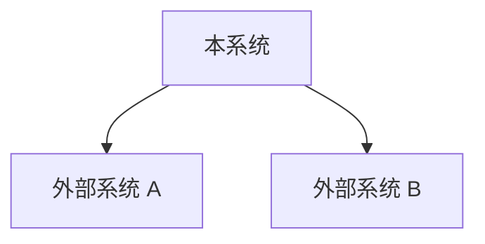
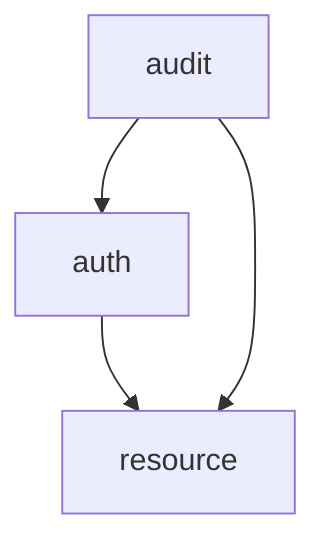
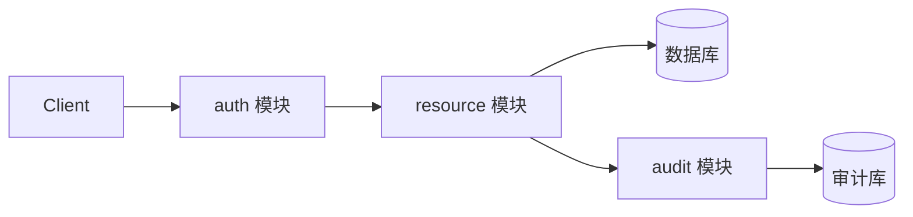

# 全局架构维度契约模板

**触发条件：** prd 标注涉及结构调整/新模块，或风险维度命中"结构性变更"或"不可逆决策"
**产出位置：** `architecture.md`
**产出方：** 通用 omp task 子代理（architecture 设计 persona，prompt 按本模板构建）
**可还原性目标：** 任意 AI 据此理解模块职责和依赖关系，不破坏边界

## 契约元素（MVCE）

- `[核心]` **技术选型**：前端/后端/数据层/基础设施四类决策点
- `[核心]` **ADR 真源**：关键架构决策记录，使用稳定 ID `ADR-XXX`，architecture.md 是 ADR 的唯一真源
- `[核心]` **系统上下文图**：系统与外部系统的边界和交互
- `[核心]` **模块清单与边界**：模块名、职责、对外接口、依赖模块
- `[核心]` **分层规则**：各模块内的分层结构（如 Controller → Service → Repository → Model）和跨层调用约束
- `[核心]` **跨模块依赖关系图**：模块间依赖关系，必须为 DAG
- `[核心]` **全局数据流**：跨模块数据流路径
- `[可选]` **部署拓扑**：服务部署关系
- `[可选]` **错误传播链**：跨模块错误传播路径和转换规则
- `[可选]` **跨层状态同步机制**：多层级状态的同步机制
- `[核心]` **负向设计空间**：禁止的架构模式

## 契约内容

```markdown
## 系统架构

### 技术选型

| 决策点 | 选项 | 选择 | 理由 |
|--------|------|------|------|
| 前端框架 | React 19 / Vue 3 / Svelte 5 | React 19 | 生态成熟、团队熟悉 |
| 后端框架 | Express / Fastify / NestJS | Fastify | 高性能、TypeScript 原生支持 |
| 数据层 | PostgreSQL / MySQL / SQLite | PostgreSQL | 支持 JSONB、全文搜索 |
| 基础设施 | Docker Compose / K8s | Docker Compose | 单机部署满足当前规模 |

**第三方依赖审查要求：**

| 依赖名 | 版本 | 最近发布 | Stars 量级 | 社区活跃度 | 采用理由 |
|--------|------|---------|-----------|-----------|---------|
| [依赖名] | [版本] | [日期] | [量级] | [活跃/稳定] | [理由] |

判定标准：
- **禁止引入**：最近一年无更新或 stars < 100
- **谨慎引入**：stars 100-1000 或最近半年无更新
- **优先选择**：stars > 1000 且最近三个月有更新
- **豁免**：项目已有依赖的版本升级不在此审查范围内

### ADR 真源

（关键架构决策的唯一真源，使用稳定 ID `ADR-XXX`）

#### ADR-001: [决策标题]
- **状态：** 已采纳
- **背景：** [决策背景]
- **决策：** [具体决策]
- **理由：** [选择理由]
- **后果：** [预期后果]

#### ADR-002: [决策标题]
- **状态：** 已采纳
- **背景：** [决策背景]
- **决策：** [具体决策]
- **理由：** [选择理由]
- **后果：** [预期后果]

### 系统上下文图

（优先使用 Mermaid `graph` 绘制系统与外部系统的边界和交互）



### 模块清单与边界

| 模块名 | 职责 | 对外接口 | 依赖模块 |
|--------|------|---------|---------|
| auth | 认证授权 | login, register, verifyToken | — |
| resource | 资源管理 | CRUD /resources | auth |
| audit | 审计日志 | writeLog | — |

### 分层规则

| 模块 | 分层结构 | 跨层调用约束 |
|------|---------|-------------|
| auth | Controller → Service → Repository → Model | Controller 不得直接访问 Model；Service 不得跨模块调用其他模块的 Repository |
| resource | Controller → Service → Repository → Model | 同上 |
| audit | Controller → Service → Repository | 同上 |

**通用分层约束：**
- 上层可调用下层，禁止下层反向调用上层
- 跨模块调用只能通过 Service 层暴露的接口，禁止跨模块直接访问 Repository 或 Model
- 公共工具层可被任意层调用，但不依赖任何业务模块

### 跨模块依赖关系图

（优先使用 Mermaid `graph` 绘制模块间依赖，必须为 DAG）



### 全局数据流

（优先使用 Mermaid `flowchart` 或 `sequenceDiagram` 绘制跨模块数据流）



### 部署拓扑

（优先使用 Mermaid `graph` 绘制服务部署关系）

### 错误传播链

| 错误来源 | 错误类型 | 传播路径 | 转换规则 | 用户可见形式 |
|---------|---------|---------|---------|------------|
| auth | TokenExpired | auth → resource → UI | 转换为 401 | "会话已过期"提示 |
| resource | EntityNotFound | resource → UI | 转换为 404 | "资源不存在"提示 |
| audit | LogWriteFailed | audit → 调用方 | 降级为异步重试 | 用户无感知 |

### 跨层状态同步机制

| 状态类型 | 前端持有 | 后端持有 | 数据库持久化 | 同步触发 | 冲突解决 |
|---------|---------|---------|------------|---------|---------|
| 用户会话 | session token | session 元数据 | session 记录 | 登录/登出/过期 | 以后端为准 |

### 负向设计空间

- **禁止循环依赖**：模块间依赖必须形成 DAG
- **禁止跨层直接调用**：Controller 不得直接调用 Repository
- **禁止跨模块直接访问数据层**：模块间只能通过接口调用，不得直接访问其他模块的数据库表
- **禁止未捕获异常传播**：所有层必须捕获并转换异常
- **禁止隐式状态同步**：跨层状态同步必须显式声明
- **禁止上帝模块**：单个模块不得承担超过 3 个不相关职责
- **禁止引入小众依赖**：禁止引入最近一年无更新或 stars < 100 的第三方依赖
```

轻量级任务可省略 `[可选]` 元素。


## 维度子代理执行清单

> 本清单由 AE architecture 维度专精代理正文合并而来。维度子代理不注册为 omp 代理：派通用 omp task 子代理，prompt = 本模板全文 + 需求上下文，outputSchema 收结构化产物摘要（files / coreElements / optionalElements / stableIds / mappingRows / crossDimensionDeps / lineCount）。

### 输入上下文

- **prd 内容摘要**：需求条目、目标、范围边界、时段标注
- **深度追问结果**：已确认的架构相关设计决策（技术选型、模块划分、通信方式）
- **overview 上下文**：设计读数、范围映射、跨维度依赖关系、稳定 ID 体系（ADR-XXX 用于本维度）

### 执行步骤

1. 读取本模板获取契约元素清单和内容模板，结合 prd 需求和深度追问结果，确定本维度需要产出的契约元素。
2. 按模板产出 `architecture.md` 独立文件。
3. 返回产出摘要：产出文件路径、契约元素完成情况（核心/可选）、稳定 ID 列表（ADR-XXX）、跨维度依赖关系（与 api/database 等维度的一致性约束）。

> architecture 维度不直接贡献跨维度映射表行项（4 类映射表覆盖 api↔database、api↔ui-ux、test-cases↔all、ui-ux↔api），返回跨维度依赖关系供主代理记录即可。

### 关键约束

- 模块间依赖必须形成有向无环图（DAG），禁止循环依赖
- 错误传播链必须指明具体转换规则和用户可见形式
- 技术选型理由必须说明为什么这个选择比其他选择更合适
- 遵守架构维度的负向设计空间


### 边界

- 只产出本维度的设计契约，不产出其他维度
- 不写实现代码
- 不执行 Git 操作
- 不修改代码库文件（除产出 `architecture.md` 独立文件 外）


### 范围严格性约束（硬约束）

- 严格按需求范围产出，禁止镀金
- 需求没有提及的一律不产出
- 即使某特性达不到最佳实践，如果需求没提及，不做
- 只产出需求中已明确提及的内容对应的设计契约
- 不主动添加需求未提及的功能、抽象、配置项或防御逻辑
- 维度触发不等于必须产出全部模板内容 - 只产出需求已提及的部分
