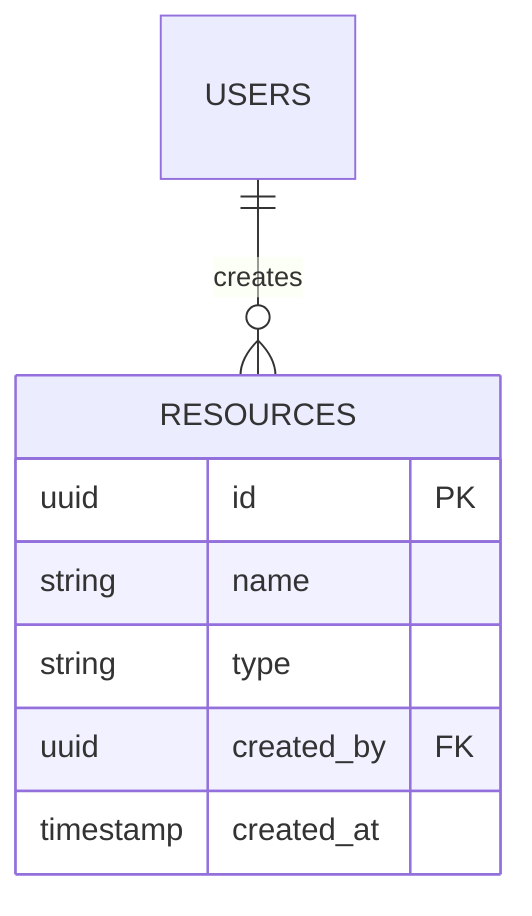

# 数据库设计维度文件模板

**触发条件：** 模块涉及持久化（dimension-triggers.md §模块维度触发）
**产出位置：** `modules/<NN>-<m>/database.md`
**产出方：** 通用 omp task 子代理（database 设计 persona，prompt 按本模板构建）
**可还原性目标：** 任意 AI 据此生成一致性的 schema 和迁移脚本

## 文件格式

产出为独立维度文件 `modules/<NN>-<m>/database.md`，frontmatter 为 `type: design-database`，以 `## Database {#database}` 开头：

```markdown
## Database {#database}

### ER 模型

（优先使用 Mermaid `erDiagram` 绘制模块内实体关系图）



### 表清单

| 表 ID | 表名 | 功能域 | 描述 |
|-------|------|--------|------|
| T-users | users | core | 用户表 |
| T-resources | resources | core | 资源表 |
| T-audit-log | audit_log | aux | 审计日志表 |

### 关系与外键

| 源表.字段 | 目标表.字段 | 级联规则 |
|-----------|------------|---------|
| resources.created_by | users.id | ON DELETE CASCADE |
| audit_log.user_id | users.id | ON DELETE SET NULL |

### 范式决策

- 范式级别：[3NF / BCNF / 反范式]
- 反范式理由：[如适用]

### 迁移策略

- 初始迁移：[schema 创建]
- 数据迁移：[如适用]
- 回滚策略：[down 迁移]

### 数据生命周期

- 保留策略：[TTL / 归档 / 永久]
- 归档规则：[如适用]
- 清理策略：[如适用]

### 分库分表规则

（如适用：分片键、分片策略、跨分片查询处理）

### 敏感字段标注

| 表.字段 | 敏感级别 | 保护措施 |
|---------|---------|---------|
| users.email | PII | 加密存储 |
| users.password_hash | 凭证 | bcrypt + salt |

### T-users: users

```sql
CREATE TABLE users (
  id UUID PRIMARY KEY DEFAULT gen_random_uuid(),
  email VARCHAR(255) NOT NULL UNIQUE,
  password_hash VARCHAR(255) NOT NULL,
  name VARCHAR(100) NOT NULL,
  role VARCHAR(50) NOT NULL DEFAULT 'user',
  created_at TIMESTAMP NOT NULL DEFAULT NOW(),
  updated_at TIMESTAMP NOT NULL DEFAULT NOW()
);

CREATE INDEX idx_users_email ON users(email);
CREATE INDEX idx_users_role ON users(role);
```

### T-resources: resources

```sql
CREATE TABLE resources (
  id UUID PRIMARY KEY DEFAULT gen_random_uuid(),
  name VARCHAR(100) NOT NULL,
  type VARCHAR(10) NOT NULL CHECK (type IN ('A', 'B', 'C')),
  created_by UUID NOT NULL REFERENCES users(id) ON DELETE CASCADE,
  created_at TIMESTAMP NOT NULL DEFAULT NOW(),
  updated_at TIMESTAMP NOT NULL DEFAULT NOW()
);

CREATE INDEX idx_resources_created_by ON resources(created_by);
CREATE INDEX idx_resources_type ON resources(type);
```

### 种子数据

```sql
INSERT INTO users (email, password_hash, name, role) VALUES
  ('admin@example.com', '$2b$10$...', '管理员', 'admin');
```

### 负向设计空间

- **禁止无索引的外键**：所有外键必须创建索引
- **禁止无约束的必填字段**：NOT NULL 字段必须有应用层校验
- **禁止明文存储敏感数据**：密码、密钥、Token 必须加密或哈希存储
- **禁止无回滚的迁移**：所有迁移脚本必须包含 up 和 down
- **禁止跨库 join**：分库后不得跨库 join
- **禁止无分页的列表查询**：列表查询必须包含分页参数
```

## 契约元素（MVCE）

- `[核心]` **ER 模型**：实体关系图（Mermaid `erDiagram`）
- `[核心]` **表结构**：每张表（含稳定 ID `T-XXX`）的完整 DDL（CREATE TABLE + 索引 + 约束）
- `[核心]` **关系与外键表**：源表.字段 → 目标表.字段，级联规则
- `[可选]` **范式决策**：范式级别和反范式理由
- `[核心]` **迁移策略**：初始迁移、数据迁移、回滚策略
- `[可选]` **种子数据**：必需的初始数据（INSERT 语句）
- `[核心]` **敏感字段标注**：表.字段、敏感级别、保护措施
- `[核心]` **负向设计空间**：禁止的数据库模式

轻量级任务可省略 `[可选]` 元素。


## 维度子代理执行清单

> 本清单由 AE database 维度专精代理正文合并而来。维度子代理不注册为 omp 代理：派通用 omp task 子代理，prompt = 本模板全文 + 需求上下文，outputSchema 收结构化产物摘要（files / coreElements / optionalElements / stableIds / mappingRows / crossDimensionDeps / lineCount）。

### 输入上下文

- **prd 内容摘要**：需求条目、目标、范围边界、时段标注
- **深度追问结果**：已确认的数据库相关设计决策（范式级别、分库分表、数据生命周期）
- **overview 上下文**：设计读数、范围映射、跨维度依赖关系、稳定 ID 体系（T-XXX 用于本维度）
- **跨维度依赖**：api 维度的请求/响应字段（api 先于 database 产出，读取 api 字段对齐）

### 执行步骤

1. 读取本模板获取契约元素清单和内容模板，结合 prd 需求和深度追问结果，确定本维度需要产出的契约元素。api 先于 database 产出，读取 api 的请求/响应字段确保字段对齐。
2. 按模板产出 `modules/<NN>-<m>/database.md`。
3. 同步填充跨维度映射表行项（返回给主代理）：`api-field-to-database-column-mapping`（API 字段 ↔ database 表字段）。
4. 返回产出摘要：产出独立文件路径、契约元素完成情况（核心/可选）、稳定 ID 列表（T-XXX）、跨维度映射表行项、行数统计。

### 关键约束

- 表必须使用稳定 ID `T-XXX`，供跨维度映射表 `api-field-to-database-column-mapping` 追溯
- 表字段必须与 api 请求/响应字段对齐（如 api 已产出）
- 所有外键必须创建索引
- 所有迁移脚本必须包含 up 和 down 双向操作
- 敏感数据必须加密或哈希存储
- 遵守 database 维度的负向设计空间


### 边界

- 只产出本维度的设计契约，不产出其他维度
- 不写实现代码
- 不执行 Git 操作
- 不修改代码库文件（除产出 `modules/<NN>-<m>/database.md` 外）


### 范围严格性约束（硬约束）

- 严格按需求范围产出，禁止镀金
- 需求没有提及的一律不产出
- 即使某特性达不到最佳实践，如果需求没提及，不做
- 只产出需求中已明确提及的内容对应的设计契约
- 不主动添加需求未提及的功能、抽象、配置项或防御逻辑
- 维度触发不等于必须产出全部模板内容 - 只产出需求已提及的部分
