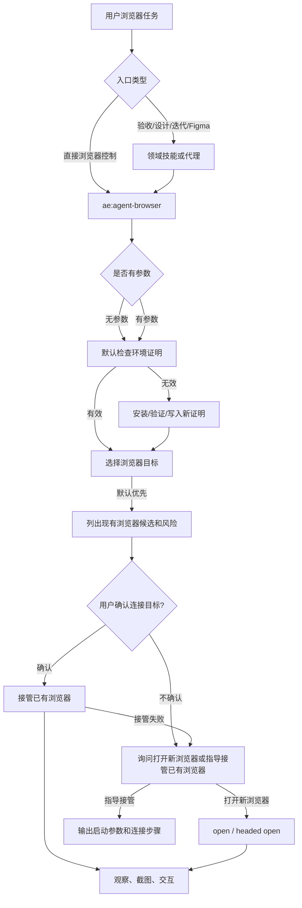

# agent-browser 浏览器能力彻底重构计划

## AI 解析契约
- canonicalKind: plan
- humanEquivalent: true
- stableIdsRequired: true
- implementationUnitsRequired: true
- noImplicitScope: true

## 来源与目标
本计划响应用户要求：编写详细计划，彻底重构浏览器能力；移除 `ae:setup` 命令；不保留升级兼容代码或提示词；使用 `agent-browser --help` 获取完整命令与子命令参数信息并放入引用文件；让其他需要控制浏览器的技能和代理通过 `ae:agent-browser` 控制浏览器；需要操作浏览器时提供选择，尤其支持连接已经打开的浏览器；直接使用 `ae:agent-browser` 且没有参数时，默认检查环境并在缺失时安装，随后优先展示可接管的现有浏览器并在用户确认后连接。

目标是把 `ae:agent-browser` 从 CLI 速查技能升级为浏览器能力中枢，统一承载 agent-browser 安装、验证、环境证明、会话选择、连接已有浏览器、打开新浏览器、截图、交互、失败降级和消费方调用契约。

非目标是不实现对旧 `ae:setup`、`/ae-setup`、旧提示词或旧 proof 名称的兼容迁移。已有 `.opencode/ae/setup-proof.json` 不作为新流程的有效完成证明；执行实现时应删除旧语义，而不是保留双轨逻辑。

## 范围

### 包含
- 移除用户可见的 `ae:setup` 技能、命令、注册、模型路由、帮助展示和文档入口。
- 将 agent-browser 安装、验证、proof 写入和浏览器控制流程并入 `ae:agent-browser`。
- 用新的 agent-browser 环境证明语义替换旧 `ae-setup-proof` / `.opencode/ae/setup-proof.json` 语义。
- 重写 prompt optimize 浏览器门禁注入逻辑，使目标新会话进入 `ae:agent-browser` 环境验证与控制流程。
- 更新 `ae:test-browser`、`ae:frontend-design`、`@design-iterator`、`@figma-design-sync` 等消费方，使它们不再自行维护安装验证流程。
- 采集 `agent-browser --help`、顶层子命令 `--help` 和必要二级命令帮助，沉淀到 `ae:agent-browser` 的 references。
- 增加连接已打开浏览器的用户选择、CDP 限制、多实例选择、启动参数指引和敏感操作确认流程。
- 更新相关测试，覆盖无旧入口、统一入口、proof 新语义、消费方引用和文档一致性。

### 不包含
- 不保留 `ae:setup`、`/ae-setup`、旧 setup 提示词或旧 proof 文件兼容读取。
- 不承诺接管任意普通已打开浏览器；仅支持 agent-browser 可发现或已启用 CDP remote debugging 的浏览器。
- 不新增非 agent-browser 的浏览器自动化后端。
- 不修改 `agent-browser` CLI 本身。

### 约束
- 面向插件用户的运行时能力以 `src/` 为真源，不得把本仓库 `.opencode/`、`docs/ae/` 或 `dist/` 调试产物当作用户项目结构前提。
- 新增或删除技能、命令、工具名称必须同步 `src/schemas/ae-asset-schema.ts`、catalog、模型路由和测试。
- 浏览器控制命令实际执行前仍必须有机器可校验的环境证明或由 `ae:agent-browser` 当轮完成安装验证；不能用用户声明、`Get-Command` 或已安装状态替代完整验证。`agent-browser --version`、`agent-browser --help` 和 `agent-browser skills get core --full` 等低风险环境探测命令允许作为 proof 写入前的验证白名单。
- 连接已有浏览器可能访问用户登录态，涉及写操作、下载、上传、跨域导航或生产系统时必须先确认操作范围。
- 所有路径使用仓库相对路径；公开文案不得要求下游项目存在本仓库源码布局。

## 需求追溯
| 需求 ID | 计划响应 |
|---------|----------|
| R1 移除 `ae:setup` 命令 | U1, U2, U8 |
| R2 不保留升级兼容代码或提示词 | U1, U2, U3, U8 |
| R3 将安装、验证、proof 并入 `ae:agent-browser` | U2, U3, U4, U5 |
| R4 其他浏览器消费方通过 `ae:agent-browser` 控制浏览器 | U6 |
| R5 操作浏览器时提供选择，尤其可连接已打开浏览器 | U3, U4, U5 |
| R6 使用 `agent-browser --help` 获取完整命令与参数并放入引用文件 | U3, U7 |
| R7 更新规则、测试和文档以匹配新安全模型 | U5, U6, U8, U9 |
| R8 `ae:agent-browser` 无参数默认检查/安装环境并优先提供现有浏览器接管选项 | U3, U4 |

## 高层技术设计
重构后的浏览器能力分为四层：

1. `ae:agent-browser` 作为唯一浏览器能力入口，负责环境准备、证明、浏览器目标选择、会话控制和 CLI references。
2. agent-browser 环境证明工具只证明当前 worktree 的 agent-browser 能力已由 `ae:agent-browser` 验证完成，不再引用 `ae:setup`。
3. 浏览器消费方只描述自身领域目标，例如验收、视觉设计、Figma 对齐或设计迭代；浏览器安装验证、连接策略和可复制命令集中放在 `ae:agent-browser`。
4. prompt optimize 对浏览器触发词注入新门禁：目标会话先进入 `ae:agent-browser` 环境验证与目标选择流程，再执行具体浏览器任务。



### 关键决策
- D1. 删除 `ae:setup` 而不是隐藏入口 → 理由: 用户明确要求彻底重构且不保留升级兼容代码或提示词，隐藏入口会继续保留旧语义和测试负担。
- D2. 将旧 `ae-setup-proof` 替换为 agent-browser 环境证明工具 → 理由: 旧工具名和文件名都绑定 `ae:setup`，保留会污染新用户流程。
- D3. `ae:agent-browser` 既是技能入口也是流程契约真源 → 理由: OpenCode 技能不是函数调用，消费方需要通过统一提示词契约和引用文档复用能力边界。
- D4. 完整 CLI 帮助进入 references，`SKILL.md` 只保留常用流程和决策树 → 理由: 避免主技能过长，同时满足完整参数信息可追溯。
- D5. 已打开浏览器只承诺 CDP/agent-browser 可连接场景 → 理由: 普通未启用 remote debugging 的浏览器通常不能被自动化工具安全接管。
- D6. 消费方不得保留独立安装验证步骤 → 理由: 否则会重新出现多处 setup 门禁、安装判断和失败降级分叉。
- D7. `/ae-agent-browser` 无参数默认进入环境检查并优先提供现有浏览器接管选项 → 理由: 直接使用时应优先完成可用性自检并复用用户现有浏览器，但连接已有浏览器会暴露上下文，必须在用户确认目标后再连接。

## 专项设计

### 数据模型
新的 agent-browser 环境证明建议使用：

```json
{
  "sessionId": "<写入会话 ID>",
  "completedAt": "<ISO 时间>",
  "schemaVersion": 1,
  "worktreeFingerprint": "<工作区路径与 HEAD/状态摘要的稳定指纹>",
  "agentBrowserVersion": "<agent-browser --version 输出>",
  "validationResults": [
    {
      "command": "agent-browser --version",
      "exitCode": 0,
      "outputHash": "<stdout 摘要哈希>",
      "executedAt": "<ISO 时间>"
    },
    {
      "command": "agent-browser --help",
      "exitCode": 0,
      "outputHash": "<stdout 摘要哈希>",
      "executedAt": "<ISO 时间>"
    },
    {
      "command": "agent-browser skills get core --full",
      "exitCode": 0,
      "outputHash": "<stdout 摘要哈希>",
      "executedAt": "<ISO 时间>"
    }
  ],
  "proofKind": "agent-browser-environment"
}
```

证明文件路径建议为 `.opencode/ae/agent-browser-proof.json`。实现时不读取旧 `.opencode/ae/setup-proof.json`，以满足不保留兼容要求。

### 安全设计
- 写入 agent-browser 环境证明前必须由工具侧可观测证据确认当前会话真实经过 `ae:agent-browser` 环境准备流程，并绑定实际验证命令、退出码、输出摘要、执行时间和 worktree 指纹。
- 安装 `agent-browser`、下载浏览器依赖或写入 `.opencode/ae/agent-browser-proof.json` 前需要用户授权；授权提示必须包含将执行的安装命令、包管理器或来源、目标版本或版本解析策略、浏览器依赖下载范围、写入路径和取消后的降级行为。
- 连接已有浏览器前必须说明 CDP 连接会暴露当前浏览器上下文，并由用户显式确认目标；涉及登录态、生产系统、跨域导航、表单提交、上传或下载时请求二次确认。
- 无 proof 且用户拒绝安装或验证失败时，消费方不得继续执行 `agent-browser` 命令，只能标注浏览器证据未完成或选择非浏览器降级方案。

### 部署与回滚
本变更为破坏性重构。回滚方式是恢复上一版本的 `ae:setup` 资产、旧 proof 工具、旧规则和相关测试。执行中不得尝试在同一版本同时支持新旧两套入口。

## 实现单元

### U1. 删除 `ae:setup` 用户入口和资产注册
- [ ] 目标: 移除 `ae:setup` / `/ae-setup` 的用户可见入口、schema 枚举、catalog 注册、模型路由、帮助展示和旧技能提示词资产。
- [ ] 覆盖需求: R1, R2
- [ ] 行为保持要求: 除浏览器 setup 入口被删除外，其他 AE 技能、命令和 prompt optimize 变体生成规则保持不变。
- [ ] 依赖: 无
- [ ] 文件:
  - `src/schemas/ae-asset-schema.ts`
  - `src/services/ae-catalog.ts`
  - `src/services/asset-model-routing-catalog.ts`
  - `src/assets/skills/ae-setup/SKILL.md`
  - `src/assets/commands/`
  - `docs/usage-guide.md`
- [ ] 方法:
  - 删除 `SKILL.SETUP` 对应常量、schema 枚举项和由其派生的 `COMMAND.SETUP` 使用点。
  - 删除 catalog 中 `/ae-setup` 注册项。
  - 删除模型路由中的 `COMMAND.SETUP` 场景配置。
  - 删除 `src/assets/skills/ae-setup/` 目录，不能仅取消 runtime manifest 注册后保留旧提示词资产。
  - 扫描 `src/assets/commands`，确认不存在 `/ae-setup` 命令资产。
  - 更新用户文档，移除 `/ae-setup` 入口说明。
- [ ] 需遵循的模式:
  - 资产名称以 `src/schemas/ae-asset-schema.ts` 为真源。
  - 新增或删除命令后同步 `COMMAND_SCENARIOS`。
- [ ] 测试场景:
  - 正常路径: `/ae-help` 不列出 `ae:setup` 和 `/ae-setup`。
  - 边界情况: `AeSkillNameSchema` 和 `AeCommandNameSchema` 不接受旧入口。
  - 错误路径: catalog 中不存在引用 `SKILL.SETUP` 的注册项。
  - 集成场景: 资产健康检查与 runtime manifest 不包含旧技能目录；命令资产目录不包含旧命令文件。
- [ ] 验证:
  - `npx vitest run tests/schemas/ae-asset-schema.test.ts`
  - `npx vitest run tests/services/ae-catalog.test.ts`
  - `npx vitest run tests/services/asset-model-routing-catalog.test.ts`
  - `npx vitest run tests/assets/asset-health.test.ts`
- [ ] 回滚信号: 帮助列表或 command registration 因缺失枚举项导致非浏览器命令注册失败。

### U2. 替换旧 setup proof 为 agent-browser proof
- [ ] 目标: 删除 `ae-setup-proof`、`setup-proof-service` 和 `setup-proof-schema` 中绑定 `ae:setup` 的语义，并新增 agent-browser 环境证明工具、service、schema 和测试。
- [ ] 覆盖需求: R1, R2, R3
- [ ] 行为保持要求: 非浏览器工具注册不受影响；工具错误仍返回中文可恢复提示。
- [ ] 依赖: U1
- [ ] 文件:
  - `src/tools/ae-setup-proof.tool.ts`
  - `src/tools/ae-agent-browser-proof.tool.ts`
  - `src/services/setup-proof-service.ts`
  - `src/services/agent-browser-proof-service.ts`
  - `src/schemas/setup-proof-schema.ts`
  - `src/schemas/agent-browser-proof-schema.ts`
  - `src/tools/index.ts`
  - `src/schemas/ae-asset-schema.ts`
  - `tests/tools/ae-setup-proof.tool.test.ts`
  - `tests/tools/ae-agent-browser-proof.tool.test.ts`
  - `tests/services/setup-proof-service.test.ts`
  - `tests/services/agent-browser-proof-service.test.ts`
- [ ] 方法:
  - 删除旧工具常量 `TOOL.AE_SETUP_PROOF`，新增 `TOOL.AE_AGENT_BROWSER_PROOF`。
  - 删除旧工具、service、schema 和旧测试文件，新增对应 agent-browser proof 文件。
  - 新证明路径使用 `.opencode/ae/agent-browser-proof.json`。
  - 写入证明时校验当前会话中存在 `ae:agent-browser` 或 `/ae-agent-browser` 的真实触发证据，不接受旧 `ae:setup` 证据。
  - proof 写入必须由工具侧可观测证据驱动，记录实际验证命令、退出码、版本输出摘要、执行时间、proof schema 版本和 worktree 指纹，禁止仅凭用户、LLM 声明或提示词包含 `ae:agent-browser` 字样写入。
  - proof `check` 不能仅凭 JSON schema 判定有效；至少重新执行 `agent-browser --version` 这类低风险版本检查，并与 proof 中记录的版本证据比对。
- [ ] 需遵循的模式:
  - 工具描述首行简短，参数最小化，错误可恢复。
  - 文件写入通过工具权限确认，不泄露绝对路径。
  - tool 层处理用户确认、ctx 元数据和可恢复错误包装；service 层只接收已授权写入请求与结构化 proof 数据，不依赖 tool context；schema 层只定义 proof 结构和校验。
- [ ] 测试场景:
  - 正常路径: `check` 能读取新 proof 并判定有效。
  - 边界情况: 旧 `.opencode/ae/setup-proof.json` 存在时仍判定新 proof 缺失。
  - 错误路径: 无 `ae:agent-browser` 触发证据时拒绝写入证明。
  - 错误路径: 仅有声明式触发证据、伪造 `validationResults` 或手工写入结构合法 JSON 时拒绝放行。
  - 集成场景: 工具注册只暴露新 proof 工具名，不暴露 `ae-setup-proof`。
- [ ] 验证:
  - `npx vitest run tests/tools/ae-agent-browser-proof.tool.test.ts`
  - `npx vitest run tests/services/agent-browser-proof-service.test.ts`
  - `npx vitest run tests/schemas/ae-asset-schema.test.ts`
- [ ] 回滚信号: 新 proof 工具无法跨会话复用，导致每次浏览器任务都要求重新安装验证。

### U3. 重写 `ae:agent-browser` 为浏览器能力中枢
- [ ] 目标: 将安装检查、安装引导、复检、proof 写入、会话选择、连接已有浏览器和浏览器操作流程集中到 `ae:agent-browser`。
- [ ] 覆盖需求: R3, R5, R6, R8
- [ ] 行为保持要求: `ae:agent-browser` 仍能指导使用 `agent-browser` CLI，但不再只是命令速查。
- [ ] 依赖: U2
- [ ] 文件:
  - `src/assets/skills/ae-agent-browser/SKILL.md`
  - `src/assets/skills/ae-agent-browser/references/environment-proof.md`
- [ ] 方法:
  - 重写 frontmatter description，使其说明 `ae:agent-browser` 是安装、验证和浏览器控制中枢。
  - 正文包含无参数默认流程：先检查新 proof 和 agent-browser 环境；缺失时验证 `agent-browser --version`、`agent-browser --help`、`agent-browser skills get core --full`；未安装时请求用户确认安装；验证完成后写入新 proof。
  - 环境检查通过后默认优先列出现有浏览器候选和风险说明，并在用户确认目标后接管；接管失败时询问用户是打开新的受控浏览器，还是按指引重新启动已有浏览器以允许接管。
  - 正文链接目标选择和 CLI reference；目标选择细节由 U4 独占维护，完整 CLI 帮助由 U7 独占维护。
  - `SKILL.md` 只产出中枢流程骨架和 references 链接，不展开目标选择细节，避免与 U4 共享可变内容。
  - 正文禁止把旧 `ae:setup` 作为兜底入口。
  - 高频流程留在 `SKILL.md`，proof 说明放入 `environment-proof.md`。
- [ ] 需遵循的模式:
  - OpenCode 原生 Skill 必须有 frontmatter、角色目标、适用场景、流程、输入处理、输出要求、安全边界和验证方式。
  - 面向插件用户的文案不得硬编码本仓库源码目录。
- [ ] 测试场景:
  - 正常路径: 无参数调用且 proof 有效时，列出现有浏览器候选并请求用户确认目标。
  - 边界情况: 用户请求操作已打开浏览器但未提供 CDP 地址时，提示限制和可选方案。
  - 错误路径: 安装失败或用户拒绝安装时停止浏览器流程。
  - 集成场景: `ae:agent-browser` 文案不包含 `ae:setup` 或 `/ae-setup`。
- [ ] 验证:
  - `npx vitest run tests/assets/asset-health.test.ts`
  - `npm run typecheck`
- [ ] 回滚信号: `ae:agent-browser` 文案过长导致常用流程难以执行或 references 未被正确复制到 dist。

### U4. 实现浏览器目标选择与已打开浏览器连接契约
- [ ] 目标: 为操作浏览器前的选择提供明确流程，默认优先展示现有浏览器接管选项，并在接管失败时提供新浏览器或已有浏览器接管指引。
- [ ] 覆盖需求: R5, R8
- [ ] 行为保持要求: 默认仍能打开新的受控浏览器，不强制用户连接已有浏览器。
- [ ] 依赖: U3
- [ ] 文件:
  - `src/assets/skills/ae-agent-browser/SKILL.md`
  - `src/assets/skills/ae-agent-browser/references/browser-target-selection.md`
- [ ] 方法:
  - 定义默认顺序：优先自动发现现有浏览器并展示候选摘要和风险；用户确认目标后连接；失败后询问用户打开新受控浏览器，或指导用户用可接管参数重新启动已有浏览器。
  - 定义选择项：连接用户提供的 CDP 端口或 URL、自动发现可连接浏览器、打开新受控浏览器、复用已有 agent-browser session。
  - 说明普通未启用 remote debugging 的已打开浏览器不能保证接管；如果需要启动时传入参数才能接管，必须给出具体启动参数、示例命令和连接步骤。
  - 即使只有一个候选，连接已有浏览器前也必须询问用户确认；多实例或多标签页时要求列出候选摘要并询问用户选择。
  - 连接已有登录态浏览器时限制默认只读观察，敏感写操作需额外确认。
- [ ] 需遵循的模式:
  - 安全边界优先，不能为了便利自动操作用户真实登录态。
- [ ] 测试场景:
  - 正常路径: 无参数调用时优先展示现有浏览器候选；用户确认候选或提供 CDP URL 后流程进入 connect。
  - 边界情况: 多个候选浏览器时要求选择。
  - 错误路径: 接管失败时询问用户打开新受控浏览器，或提供 remote debugging 重启参数与连接步骤。
  - 集成场景: 消费方引用该选择契约而不是复制分散流程。
- [ ] 验证:
  - `npx vitest run tests/assets/asset-health.test.ts`
  - 对 `src/assets/skills/ae-agent-browser/SKILL.md` 和 `src/assets/skills/ae-agent-browser/references/browser-target-selection.md` 做文档审查，确认包含无参数默认检查/安装环境、默认优先展示现有浏览器接管选项、连接已有浏览器前用户确认、接管失败后询问打开新浏览器或指导接管已有浏览器、CDP 连接、自动发现、新受控浏览器、session 复用、多实例选择、普通浏览器不可保证接管、需要启动参数时给出具体参数指令、登录态和敏感写操作确认，且没有“可接管任意已打开浏览器”的承诺。
- [ ] 回滚信号: 文案承诺可接管任意已打开浏览器，造成不可实现承诺。

### U5. 重写 prompt optimize 浏览器门禁
- [ ] 目标: 将新会话注入逻辑从 `ae:setup` proof 门禁改为 `ae:agent-browser` 环境验证与控制门禁。
- [ ] 覆盖需求: R3, R7
- [ ] 行为保持要求: 仍保护首 token 的 `/command` 或 `@agent` 引用位置。
- [ ] 依赖: U2, U3
- [ ] 文件:
  - `src/services/browser-setup-gate.ts`
  - `src/services/browser-environment-gate.ts`
  - `src/tools/ae-prompt-optimize.tool.ts`
  - `src/assets/skills/ae-prompt-optimize/SKILL.md`
  - `tests/services/prompt-optimize-setup-gate.test.ts`
  - `tests/services/prompt-optimize-browser-environment-gate.test.ts`
- [ ] 方法:
  - 将文件和测试命名按新语义调整为 `browser-environment-gate`；删除旧 `setup-gate` 命名文件。
  - 触发词继续覆盖 `agent-browser`、`ae:test-browser`、`ae:frontend-design`、`@design-iterator`、`@figma-design-sync`。
  - 注入内容改为：先调用新 proof 工具 `check`；缺失时进入 `ae:agent-browser` 环境验证流程；验证和写入证明前不得执行 `agent-browser` 浏览器控制命令，低风险环境探测命令只允许由 `ae:agent-browser` 验证流程使用。
  - 注入契约必须覆盖完整浏览器安全门禁：proof check 或当轮验证、目标选择、连接已有浏览器前确认、登录态/生产系统/跨域导航/提交/上传/下载二次确认；auto 模式不得替代这些确认。
  - 删除所有 `ae:setup` / `/ae-setup` marker 逻辑。
- [ ] 需遵循的模式:
  - prompt optimize 生成的新会话也必须继承浏览器门禁。
- [ ] 测试场景:
  - 正常路径: 浏览器触发词提示词被注入新门禁。
  - 边界情况: 以 `/ae-test-browser` 或 `@design-iterator` 开头时仍保留首引用。
  - 错误路径: 已包含旧 `ae:setup` 的提示词不会被视为已满足新门禁。
  - 错误路径: auto 模式下仍不能绕过目标选择、登录态和敏感操作确认。
  - 集成场景: auto 模式提交前也经过新门禁处理。
- [ ] 验证:
  - `npx vitest run tests/services/prompt-optimize-browser-environment-gate.test.ts`
  - `npx vitest run tests/tools/ae-prompt-optimize.tool.test.ts`
- [ ] 回滚信号: prompt optimize 生成的浏览器任务提示词无法触发 `ae:agent-browser` 环境验证。

### U6. 重写浏览器消费方为 `ae:agent-browser` 消费者
- [ ] 目标: 让 `ae:test-browser`、`ae:frontend-design`、`@design-iterator`、`@figma-design-sync` 通过 `ae:agent-browser` 的统一契约获得浏览器能力。
- [ ] 覆盖需求: R4, R7
- [ ] 行为保持要求: 各消费方的领域职责保持不变；`ae:test-browser` 仍负责 E2E 验收，设计类代理仍负责视觉迭代或 Figma 对齐。
- [ ] 依赖: U3, U4
- [ ] 文件:
  - `src/assets/skills/ae-test-browser/SKILL.md`
  - `src/assets/skills/ae-test-browser/references/login-detection.md`
  - `src/assets/skills/ae-frontend-design/SKILL.md`
  - `src/assets/skills/ae-agent-creator/SKILL.md`
  - `src/assets/skills/ae-agent-creator/references/permission-patterns.md`
  - `src/assets/skills/ae-html-bundle/SKILL.md`
  - `src/assets/skills/ae-lfg/SKILL.md`
  - `src/assets/skills/ae-lfg/references/pipeline.md`
  - `src/assets/agents/workflow/design-iterator.md`
  - `src/assets/agents/workflow/figma-design-sync.md`
  - `src/services/ae-catalog.ts`
- [ ] 方法:
  - 先批量扫描 `src/assets/**/*.md` 中的 `ae:setup`、`/ae-setup`、`ae-setup-proof`、`setup-proof`，再逐个改写浏览器消费方和相关 references。
  - 扫描输出旧入口命中清单，标注哪些命中需要批量替换，哪些需要人工语义改写；改写后再次扫描确认旧入口残留。
  - 增加资产级扫描：除 `ae:agent-browser` 自身 reference 和明确白名单外，运行时公开资产不得出现可直接执行的 `agent-browser open/click/fill/type/press/wait/screenshot` 等浏览器控制命令；允许提及时必须绑定 `ae:agent-browser` proof 检查和目标选择契约。
  - 移除消费方内的旧 setup proof 检查和安装说明。
  - 消费方在实际浏览器操作前要求加载或遵循 `ae:agent-browser`，使用其 proof、目标选择和命令 reference。
  - 将可复制 `agent-browser` 命令从消费方主文案中收敛，必要命令改为引用 `ae:agent-browser` reference。
  - `ae:test-browser` 专注验收策略、登录检测、交互断言和报告格式。
  - 设计类能力专注截图目标、视觉判断和迭代，不维护安装验证细节。
- [ ] 需遵循的模式:
  - 不把 `ae:agent-browser` 当作普通函数调用；要写清楚 LLM 执行时的技能加载和流程遵循要求。
- [ ] 测试场景:
  - 正常路径: 消费方文案引用 `ae:agent-browser`。
  - 边界情况: 消费方中不再出现 `ae:setup`、`/ae-setup` 或 `ae-setup-proof`。
  - 错误路径: proof 缺失时消费方不会直接执行 `agent-browser` 浏览器控制命令。
  - 集成场景: agent-browser gate 集成扫描接受新的集中式契约。
- [ ] 验证:
  - `npx vitest run tests/services/agent-browser-environment-gate.integration.test.ts`
  - `npx vitest run tests/services/ae-catalog.test.ts`
  - `npx vitest run tests/assets/asset-health.test.ts`
  - `rg -n "ae:setup|/ae-setup|ae-setup-proof|setup-proof" src/assets`
- [ ] 回滚信号: 消费方失去足够执行细节，导致无法完成原有 E2E 或视觉验证任务。

### U7. 采集并维护 agent-browser CLI 完整引用
- [ ] 目标: 用 `agent-browser --help` 和各子命令 `--help` 生成 `ae:agent-browser` 的完整 CLI references。
- [ ] 覆盖需求: R6
- [ ] 行为保持要求: references 作为离线使用资料，不在运行时联网获取。
- [ ] 依赖: U3
- [ ] 文件:
  - `src/assets/skills/ae-agent-browser/references/agent-browser-cli-reference.md`
  - `src/assets/skills/ae-agent-browser/references/agent-browser-core-skill.md`
  - `src/assets/skills/ae-agent-browser/references/agent-browser-help-inventory.json`
  - `scripts/collect-agent-browser-help.mjs`
- [ ] 方法:
  - 由 `ae:agent-browser` 新环境验证流程确认 agent-browser 可用后采集 CLI 帮助，不引用旧 proof 工具。
  - 先重写 agent-browser 环境门禁规则，明确 `agent-browser --version`、`agent-browser --help`、`agent-browser skills get core --full` 和各级 `--help` 属于 proof 写入前允许执行的环境探测命令，不属于浏览器控制命令。
  - 使用 Node.js 脚本化采集，避免手工逐个运行造成遗漏；脚本输入为 `agent-browser --help` 解析出的命令清单，输出为 inventory JSON 与 Markdown reference。
  - 先生成采集清单，记录 agent-browser 版本、顶层命令、二级命令候选、退出码、stdout/stderr 摘要和失败项。
  - 采集顶层 `agent-browser --help`。
  - 对顶层列出的每个子命令运行 `agent-browser <command> --help`。
  - 对存在二级命令的命令继续运行 `agent-browser <command> <subcommand> --help`。
  - 将采集清单归档到 `agent-browser-help-inventory.json`，将完整输出归档为 Markdown reference，标注采集日期和 agent-browser 版本。
  - `SKILL.md` 只引用该 reference，不复制全部长帮助。
- [ ] 需遵循的模式:
  - 不把本地工具输出绝对路径写入公开 reference。
- [ ] 测试场景:
  - 正常路径: reference 包含顶层命令列表和常用子命令参数。
  - 边界情况: 某子命令帮助不可用时记录采集失败和原因。
  - 错误路径: reference 中不包含本机绝对路径或用户隐私。
  - 集成场景: postbuild 能复制新增 references 到 dist。
  - 集成场景: 仅桥接文件加 `dist` 的运行时场景能发现新增 references。
- [ ] 验证:
  - `npm run build`
  - `npx vitest run tests/assets/asset-health.test.ts`
- [ ] 回滚信号: CLI reference 太大导致资产扫描或帮助输出性能明显下降。

### U8. 更新全局规则、公开文档和资产健康约束
- [ ] 目标: 将全局 setup gate 规则改写为 agent-browser 环境门禁规则，并更新公开文档与测试扫描规则。
- [ ] 覆盖需求: R1, R2, R7
- [ ] 行为保持要求: 浏览器安全门禁强度不降低，只替换入口和 proof 语义。
- [ ] 依赖: U1, U2, U3, U6
- [ ] 文件:
  - `src/assets/rules/setup-gate-rule.md`
  - `docs/usage-guide.md`
  - `README.md`
  - `tests/services/command-registration.test.ts`
  - `tests/services/help-catalog-service.integration.test.ts`
  - `tests/assets/markdown-protocols.test.ts`
  - `tests/services/agent-browser-environment-gate.integration.test.ts`
  - `tests/assets/asset-health.test.ts`
  - `docs/builtin-config.md`
- [ ] 方法:
  - 将规则文件重命名或重写为 agent-browser gate 语义。
  - 删除“ae:setup 是唯一前置入口”等旧句子。
  - 新规则声明：任何 `agent-browser` 执行前必须由 `ae:agent-browser` 完成 proof 检查或当轮环境验证。
  - 更新 usage guide、builtin config、README 和相关测试快照。
  - 改写集成扫描，禁止运行时公开资产把旧 `ae:setup` / `ae-setup-proof` 作为用户可执行入口或门禁语义保留；计划文档、测试名称迁移说明和删除断言允许把旧字符串作为删除对象出现。
  - 本单元需要作为迁移原子步骤执行：先落地新规则和新扫描，再删除旧入口；不得提交 U1/U2 已删除旧入口但 U5/U8 仍要求旧门禁的半迁移状态。
  - 若需要拆分提交，拆分为 U8a 规则语义、U8b 公开文档、U8c 测试/扫描规则；每个子单元都必须有独立验证命令。
- [ ] 需遵循的模式:
  - 通用运行时规则不能引用本仓库源码维护路径作为用户项目前提。
- [ ] 测试场景:
  - 正常路径: 规则覆盖技能、代理、命令、bash、MCP、prompt optimize、新增消费方。
  - 边界情况: 文档只描述 `ae:agent-browser` 新入口。
  - 错误路径: 扫描发现旧入口字符串时报错。
  - 集成场景: asset health 快照与 catalog 一致。
- [ ] 验证:
  - `npx vitest run tests/services/agent-browser-environment-gate.integration.test.ts`
  - `npx vitest run tests/services/command-registration.test.ts tests/services/help-catalog-service.integration.test.ts tests/assets/markdown-protocols.test.ts`
  - `npx vitest run tests/assets/asset-health.test.ts`
  - `npm run build`
- [ ] 回滚信号: 规则过度约束导致只读提及 `agent-browser` 的文档也被错误判定为必须执行门禁。

### U9. 全量测试、构建与门禁证明
- [ ] 目标: 验证破坏性重构后的注册、文档、工具、规则和构建产物一致。
- [ ] 覆盖需求: R7
- [ ] 行为保持要求: 非浏览器核心流程不回归。
- [ ] 依赖: U1, U2, U3, U4, U5, U6, U7, U8
- [ ] 文件:
  - `package.json`
  - `tests/`
  - `src/`
- [ ] 方法:
  - 先运行验证区第一条命令列出的受影响测试集合，再运行全量类型检查、构建和测试。
  - 检查 Git diff，确认没有旧入口残留。
  - 运行审查，重点覆盖安全门禁、运行时资产注册和文档一致性。
  - 使用 `ae-gate` 记录最终交付证明。
- [ ] 需遵循的模式:
  - 交付前必须区分已完成、已验证、未验证、Git 操作状态、门禁结果和剩余风险。
- [ ] 测试场景:
  - 正常路径: 所有受影响测试通过。
  - 边界情况: 构建产物包含新 references 和新规则。
  - 错误路径: 旧 `ae:setup`、`/ae-setup`、`ae-setup-proof` 不再作为用户可执行入口或门禁语义残留在运行时公开资产中。
  - 集成场景: `npm run build` 成功，runtime manifest 可用。
- [ ] 验证:
  - `npx vitest run tests/schemas/ae-asset-schema.test.ts tests/services/ae-catalog.test.ts tests/services/asset-model-routing-catalog.test.ts tests/services/prompt-optimize-browser-environment-gate.test.ts tests/services/agent-browser-environment-gate.integration.test.ts tests/assets/asset-health.test.ts`
  - `npm run typecheck`
  - `npm run build`
  - `npm run test`
  - `ae-gate checkpoint=final workflow=work`
- [ ] 回滚信号: 全量测试或构建发现运行时 manifest、命令注册或工具注册无法加载。

## 风险与应对
| 风险 | 影响 | 应对措施 |
|------|------|----------|
| 旧入口残留 | 用户仍被引导到不存在的 `ae:setup` | 用集成扫描禁止运行时公开资产把 `ae:setup`、`/ae-setup`、`ae-setup-proof` 作为用户入口或门禁语义保留 |
| proof 新语义过松 | agent-browser 未完整验证就执行浏览器命令 | 新 proof 写入必须绑定 `ae:agent-browser` 触发证据和实际验证命令 |
| proof 文件被伪造 | 手工写入结构合法 JSON 后绕过真实验证 | `check` 时复验低风险版本命令并比对 proof 中的版本、schema、输出摘要和 worktree 指纹 |
| proof 新语义过严 | 每次任务都重复安装或验证 | proof 可跨会话复用，只要 schema 和版本证据有效 |
| 消费方过度瘦身 | `ae:test-browser` 或视觉代理缺少可执行步骤 | 保留领域步骤，浏览器命令和安装验证集中引用 `ae:agent-browser` references |
| 已打开浏览器承诺过度 | 用户以为可接管任意普通 Chrome | 文案明确只支持 CDP/agent-browser 可连接目标，失败时给新受控浏览器方案 |
| 默认连接已有浏览器泄露登录态 | 无参数流程在用户确认前读取现有浏览器上下文 | 默认只展示候选和风险，连接任何已有浏览器前都必须由用户确认目标 |
| 接管失败恢复路径不清 | 用户不知道该打开新浏览器还是如何重启已有浏览器 | 接管失败时必须提供明确选择，并在需要启动参数时输出具体命令和连接步骤 |
| 连接已有登录态带来误操作 | 误提交表单、下载、上传或跨域导航 | 默认只读观察，敏感写操作前二次确认 |
| runtime 资产漏复制 | 分发后缺少新 references 或规则 | 运行 `npm run build` 和 asset health 测试 |
| 破坏性删除导致测试大量失败 | 实施成本高、回归面大 | 按 U1-U9 顺序逐步改写测试和实现，不保留双轨兼容 |
| 半迁移状态形成死锁 | 旧入口已删除但旧门禁仍要求 `ae:setup` 或旧 proof | 将新 proof、新门禁、规则扫描和旧入口删除作为同一原子迁移阶段验证，不提交不可运行中间态 |

## 待定问题

### 执行前需解决
- Q1. 新 proof 工具最终命名是否采用 `ae-agent-browser-proof`；本计划默认采用该方向。

### 推迟到执行
- Q2. `agent-browser` 所有二级命令的枚举以当前实际 `agent-browser --help` 输出为准，实施时采集后再固化到 reference。

## 等价性检查
- implementationUnitsCount: 9
- tracedRequirementsCount: 8
- decisionsCount: 7
- risksCount: 12
