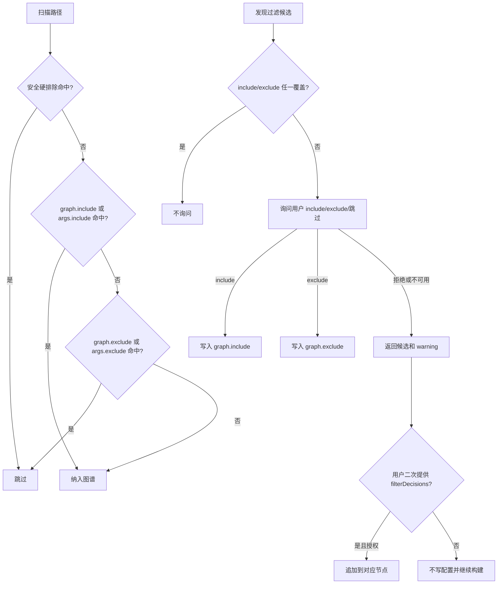

# 重构 Graph Include 配置与匹配逻辑

## AI 解析契约
- canonicalKind: plan
- humanEquivalent: true
- stableIdsRequired: true
- implementationUnitsRequired: true
- noImplicitScope: true

## 来源与目标
来源为用户直接请求：重构 `ae.jsonc` 中关于 graph 的配置以及匹配逻辑，增加 `include` 节点；`include` 优先级高于 `exclude`；在生成知识图谱过程中，如果探测到明显需要忽略的文件或路径，必须先检查 `ae.jsonc` 的 `include` 或 `exclude` 中是否已有关于该路径的配置，只有两者都未覆盖时才询问用户是否需要排除或包含，用户选择后追加到 `include` 或 `exclude` 节点。用户已明确：不需要保留 `!` 排除规则；合并配置优先级与现有配置优先级保持一致，建议复用现有全局、项目级配置相关合并代码；写入 `ae.jsonc` 时不得直接覆盖所有内容，已有注释不得丢失。

目标是把当前仅支持 `graph.exclude` 和 `!` 否定规则的图谱过滤模型，重构为显式 `graph.include` + `graph.exclude` 模型，并让构建工具在发现未被任一节点覆盖的过滤候选时持久化用户选择。

外部行为保持要求：现有只使用正向 `graph.exclude` 的配置继续可用；`!` 否定规则不再作为有效重新纳入机制保留，需要通过执行单元迁移为 `graph.include` 后再移除相关匹配逻辑与测试期望。

## 范围

### 包含
- 为 `GraphConfig` 增加 `include: string[]`，并通过现有 builtin-opencode 配置加载/合并能力支持三层 `ae.jsonc` 中 `graph.include` 与 `graph.exclude` 的读取、校验、合并和保存。
- 重构图谱路径匹配逻辑，使 `include` 命中优先于 `exclude` 命中；`exclude` 中的 `!` 不再具备特殊语义。
- 调整图谱文件采集递归逻辑，确保被 `exclude` 的父目录下存在 `include` 后代时仍能继续遍历并采集被包含路径。
- 将构建过程中的未覆盖过滤候选询问，从“确认后批量保存到 exclude”升级为“先检查 include/exclude 覆盖，未覆盖才询问，用户选择 include 或 exclude 后保存到对应节点”。
- 写入项目级 `.opencode/ae.jsonc` 时采用最小 JSONC 编辑，保留文件已有注释、格式和无关内容，不得以 `JSON.stringify` 整文件覆盖。
- 同步工具参数、返回字段、技能文档、命令提示、内置配置 schema、用户文档和相关测试。
- 迁移当前仓库项目级 `.opencode/ae.jsonc` 中已有的 `!` 规则到 `graph.include`，避免本仓库自身图谱范围在执行后异常变化。

### 不包含
- 不改变图谱存储格式、分片格式、预览页渲染逻辑或查询语义。
- 不引入深层 AST 分析、符号级调用链或运行时动态依赖分析。
- 不新增独立图谱配置文件；继续使用三层 `ae.jsonc`。
- 不允许 `include` 覆盖安全硬排除、越界路径、符号链接保护、敏感文件名保护和图谱产物目录保护。

### 约束
- 面向插件用户的运行时能力不得假设当前源码仓库布局；涉及本仓库 `.opencode/ae.jsonc` 的迁移仅作为本仓库开发语境处理。
- 自动写入项目级 `.opencode/ae.jsonc` 前必须使用现有工具确认机制取得许可；非交互或用户拒绝时不得创建或修改配置。
- `exclude` 中的 `!` 不保留兼容，不应继续出现在新文档、新测试期望或保存逻辑中。
- 配置合并优先级必须与现有 builtin-opencode 配置优先级一致：插件内置 < 全局 < 项目级；不得为 graph 再实现一套相互冲突的特殊优先级。
- 持久化规则时只能追加或创建 `graph.include` / `graph.exclude` 中的目标数组项，不得覆盖 `ae.jsonc` 全文、不得丢失注释、不得改写无关节点。

## 需求追溯
| 需求 ID | 计划响应 |
|---------|----------|
| R1. `ae.jsonc` 的 graph 配置增加 `include` 节点 | U1, U2, U4, U8, U9 |
| R2. `include` 优先级高于 `exclude` | U4, U5, U8, U9 |
| R3. 同时被包含和被排除的文件按包含逻辑生效 | U4, U5, U8, U9 |
| R4. 构建图谱时发现需要过滤但未被 include/exclude 覆盖的路径要询问用户选择 | U6, U9 |
| R5. 用户选择后追加到 `include` 或 `exclude` 节点 | U3, U6, U9 |
| R6. 不保留 `!` 排除规则 | U4, U7, U8, U9 |
| R7. 配置合并优先级与现有配置优先级一致，并复用现有合并代码 | U2, U9 |
| R8. 写入 ae.jsonc 不得覆盖全部内容，且不能丢失已有注释 | U3, U6, U7, U9 |

## 高层技术设计
图谱过滤分为三层决策：安全硬排除、显式包含、显式排除。安全硬排除保持最高优先级，用于防止敏感文件、`.git`、图谱输出目录、越界路径和符号链接进入图谱；`graph.include` 与本次构建临时 `args.include` 同等参与显式包含判定，只覆盖 `graph.exclude` 与工具参数 `args.exclude`，不覆盖安全边界。

### 关键决策
- D1. `GraphConfig` 明确包含 `{ include: string[], exclude: string[] }` → 理由: 让“重新纳入”成为显式配置，不再依赖 `exclude` 中的 `!` 否定规则。
- D2. `include` 优先于 `exclude`，但低于安全硬排除 → 理由: 满足用户要求的优先级，同时避免敏感文件和图谱产物被误纳入。
- D3. `graph.include` 和 `graph.exclude` 的三层配置合并复用 `loadBuiltinOpencodeConfig` / `mergeBuiltinOpencodeConfig` 的现有优先级语义，数组遵循现有配置合并行为由高优先级层覆盖低优先级层 → 理由: 用户要求 graph 配置优先级与现有配置保持一致，避免维护第二套分层合并规则。
- D4. `!` 规则不保留兼容，执行中迁移当前项目配置后移除特殊解析 → 理由: 用户明确不需要保留该规则，减少双重语义和未来维护成本。
- D5. 非交互或用户拒绝写配置时构建继续，结果返回未决过滤候选 warning → 理由: 保持现有 `ae-graph-build` 在无 ask 能力下仍可构建的行为。
- D6. `.opencode/ae.jsonc` 写入采用最小 JSONC 文本修改，不再使用整对象 `JSON.stringify` 覆盖文件 → 理由: 用户要求已有注释不得丢失，且不得直接覆盖 ae.jsonc 中所有内容。

## 专项设计

### 数据模型
- `GraphConfig`：新增 `include: string[]`，保留 `exclude: string[]`。
- `AeProjectConfig.graph`：新增 `include?: unknown`，保留 `exclude?: unknown`。
- 路径匹配结果建议新增 `GraphPathMatchResult`：包含 `hardExcluded`、`hardExcludeReason`、`included`、`excluded`、`matchedInclude`、`matchedExclude`、`covered`。
- 保存规则建议使用统一函数 `updateGraphRulesInProjectConfig(worktree, changes)`，并可保留 `saveGraphExcludeRule` / `saveGraphIncludeRule` 作为内部清晰入口；该函数必须以文本级 JSONC 最小编辑方式追加或删除数组项，不能整文件重写。

### 接口设计
- `ae-graph-build` 工具参数增加 `include?: string[]`，与 `exclude?: string[]` 一样作为本次构建临时叠加规则，不默认写入配置。
- 如 `ctx.ask` 无法返回结构化 include/exclude 选择，工具增加显式 `filterDecisions?: { include?: string[], exclude?: string[] }` 输入作为二次调用持久化入口；只有用户在会话中明确给出选择且写入授权通过时，才把其中规则追加到项目级配置。
- 工具返回新增 `includeRules`、`savedIncludes`、`filterDecisionWarnings`；保留 `excludeRules`、`savedExcludes`。
- `graph.include` / `graph.exclude` 配置 schema 均为字符串数组。

### JSONC 最小编辑策略
- 执行时优先不新增依赖，基于现有文本内容做受限 JSONC 编辑：定位根对象、`graph` 对象、目标数组的文本范围，只在目标数组或缺失节点位置做插入/删除。
- 追加数组项时，规则值必须使用 `JSON.stringify(rule)` 的结果作为单个字符串字面量插入；删除数组项时，只删除与目标字符串值完全相等的数组元素及必要逗号，不删除相邻注释。
- 支持范围必须覆盖：缺失 `graph`、缺失 `include` / `exclude`、空数组、已有数组、重复规则、数组前后注释、尾随逗号和根对象其他节点。
- 如果无法可靠定位编辑范围，或删除会导致注释归属不明确，函数返回中文可恢复错误，不得退化为整文件 `JSON.stringify` 覆盖。
- 只有当上述受限策略无法通过测试时，执行阶段才评估引入 JSONC AST 编辑依赖；新增依赖需说明用途并补测试。

## 实现单元

### U1. 配置模型与校验
- [ ] 目标: 支持 `graph.include` 与 `graph.exclude` 的类型、默认值和逐层校验。
- [ ] 覆盖需求: R1
- [ ] 行为保持要求: 仅有正向 `graph.exclude` 的既有配置继续可解析；非法 graph 配置返回中文可恢复错误。
- [ ] 依赖: 无
- [ ] 文件:
  - `src/services/graph-config-service.ts`
  - `tests/services/graph-config-service.test.ts`
- [ ] 方法:
  - 扩展 `GraphConfig`、`AeProjectConfig.graph` 和配置校验逻辑。
  - 将 `validateGraphExcludeConfig` 重命名或重构为同时校验 `graph.include` 与 `graph.exclude`。
  - graph 专项校验应在单层配置读入时执行；非法低优先级层即使会被高优先级层覆盖，也应返回可观察错误，避免静默吞掉坏配置。
- [ ] 需遵循的模式:
  - 沿用现有 JSONC 解析错误提示风格。
  - 不在该单元处理三层合并或写回，避免模型校验与持久化耦合。
- [ ] 测试场景:
  - 正常路径: 读取包含 `graph.include` 与 `graph.exclude` 的项目级配置。
  - 边界情况: 缺失 `graph.include` 时默认为空数组。
  - 错误路径: `graph.include` 或 `graph.exclude` 非字符串数组时报中文错误。
  - 集成场景: 非法低优先级 graph 配置不会因高优先级覆盖而静默通过。
- [ ] 验证:
  - `npx vitest run tests/services/graph-config-service.test.ts`
- [ ] 回滚信号: 配置读取失败、非法 graph 配置未报错或只含 exclude 的测试失败。

### U2. 配置加载与现有合并复用
- [ ] 目标: 让 `loadGraphConfig` 复用现有 builtin-opencode 配置路径解析与三层合并语义。
- [ ] 覆盖需求: R1, R7
- [ ] 行为保持要求: graph 配置优先级与现有 builtin-opencode 配置一致；不得保留 graph 专用三层累加逻辑。
- [ ] 依赖: U1
- [ ] 文件:
  - `src/services/graph-config-service.ts`
  - `src/services/builtin-opencode-config-service.ts`
  - `tests/services/graph-config-service.test.ts`
- [ ] 方法:
  - `loadGraphConfig` 复用 `resolveBuiltinOpencodeConfigPaths` 与 `loadBuiltinOpencodeConfig`，让 graph 节点遵循现有配置优先级和对象/数组合并语义。
  - 如需对每层 graph 做专项校验，应在读取配置层时接入校验，而不是在合并后才校验。
  - 删除或停用 graph 专用的三层数组累加合并路径。
- [ ] 需遵循的模式:
  - 复用 `builtin-opencode-config-service.ts` 的路径解析和合并语义，不复制一套 graph 专用分层合并。
- [ ] 测试场景:
  - 正常路径: 内置、全局、项目级 include/exclude 遵循现有配置优先级。
  - 边界情况: 项目级数组覆盖全局数组时结果与 `mergeBuiltinOpencodeConfig` 一致。
  - 错误路径: 任一配置层 graph 非法时返回中文可恢复错误。
  - 集成场景: `mcp`、`modelScenarios` 与 graph 同时存在时合并结果互不破坏。
- [ ] 验证:
  - `npx vitest run tests/services/graph-config-service.test.ts`
- [ ] 回滚信号: 合并优先级与现有 builtin-opencode 配置不一致，或 graph 专用累加逻辑仍生效。

### U3. JSONC 最小编辑与持久化 API
- [ ] 目标: 提供追加和删除 `graph.include` / `graph.exclude` 数组项且保留 JSONC 注释和无关内容的项目级配置写入能力。
- [ ] 覆盖需求: R5, R8
- [ ] 行为保持要求: 不得以 `JSON.stringify` 整文件覆盖 `.opencode/ae.jsonc`；不得改写无关节点；写入值必须按 JSON 字符串语义安全编码；删除规则时不得删除相邻注释或无关数组项。
- [ ] 依赖: U1
- [ ] 文件:
  - `src/services/graph-config-service.ts`
  - `tests/services/graph-config-service.test.ts`
- [ ] 方法:
  - 新增 `updateGraphRulesInProjectConfig(worktree, changes)`，支持 `appendInclude`、`appendExclude`、`removeInclude`、`removeExclude`；并可保留 `saveGraphExcludeRule` / `saveGraphIncludeRule` 作为内部清晰入口。
  - 优先在已有 `graph.include` / `graph.exclude` 数组中插入去重后的规则；节点不存在时只插入缺失节点；保留注释与无关内容。
  - 删除规则时仅删除目标数组中字符串值完全相等的元素，并保留数组周围注释、缩进和其他元素。
  - 所有追加规则必须使用 JSON 字符串编码结果插入，禁止直接拼接原始规则文本。
  - 保留 `mkdirSync(dirname(configPath), { recursive: true })` 的缺失目录创建模式。
  - 无法可靠保留注释或结构时返回中文可恢复错误，不执行整文件覆盖兜底。
- [ ] 测试场景:
  - 正常路径: 保存 include 后不破坏已有 exclude、`mcp`、`modelScenarios`、`$schema`、注释或无关格式。
  - 边界情况: 缺失 graph、缺失 include/exclude、空数组、重复规则、删除数组首项/中间项/末项均可处理。
  - 错误路径: 包含引号、反斜杠、换行、逗号、方括号的规则不会破坏 JSONC 结构。
  - 集成场景: 保存后配置仍可由 `loadGraphConfig` 解析。
- [ ] 验证:
  - `npx vitest run tests/services/graph-config-service.test.ts`
- [ ] 回滚信号: 保存或删除后丢失注释/未知节点、特殊字符破坏配置、删除错误数组项，或出现整文件 JSON 覆盖。

### U4. 路径匹配语义重构
- [ ] 目标: 建立显式 include/exclude 匹配结果，并移除 `!` 否定规则特殊语义。
- [ ] 覆盖需求: R2, R3, R6
- [ ] 行为保持要求: 星号、问号、路径锚定、目录规则等正向 glob 匹配能力继续可用。
- [ ] 依赖: U1, U2
- [ ] 文件:
  - `src/services/graph-config-service.ts`
  - `tests/services/graph-config-service.test.ts`
- [ ] 方法:
  - 将规则解析函数改为通用正向规则解析，不再处理 `!` 作为否定标记。
  - 新增 `matchGraphPath(relativePath, config, isDirectory)`，先匹配 include，再匹配 exclude，最终返回覆盖和决策信息。
  - 保留或替换 `matchGraphExcludePath` 的内部调用点，避免公开函数语义与新模型冲突。
  - 删除或更新测试中 `!packages/app/dist/keep.ts` 的期望。
- [ ] 需遵循的模式:
  - 最小化重构范围，不改变 glob 到 regex 的既有核心逻辑，除非为移除 `!` 必需。
  - 匹配结果中保留命中的 include/exclude 规则，便于工具返回和调试。
- [ ] 测试场景:
  - 正常路径: `exclude: ['**/dist']` 排除 `dist/a.ts`。
  - 边界情况: `include: ['dist/keep.ts']` 与 `exclude: ['**/dist']` 同时命中时包含 `dist/keep.ts`。
  - 错误路径: `!dist/keep.ts` 不再作为重新纳入规则；若作为普通规则无法按预期命中，应在测试中明确不依赖它。
  - 集成场景: 临时 `args.exclude` 与配置 include 冲突时 include 生效。
- [ ] 验证:
  - `npx vitest run tests/services/graph-config-service.test.ts`
- [ ] 回滚信号: include/exclude 同时命中时仍被排除，或 `!` 规则仍被当作特殊语义处理。

### U5. 文件采集过滤与递归剪枝
- [ ] 目标: 让图谱采集阶段按新匹配语义过滤，并支持 exclude 父目录下的 include 后代。
- [ ] 覆盖需求: R2, R3
- [ ] 行为保持要求: `.git`、`.ae`、敏感文件名、`docs/ae/graphs`、符号链接和越界路径仍不可被 include 纳入。
- [ ] 依赖: U3, U4
- [ ] 文件:
  - `src/services/graph-parse-service.ts`
  - `tests/services/graph-parse-service.test.ts`
- [ ] 方法:
  - 将 `shouldExclude` 改为返回带原因的路径决策结果：先执行安全硬排除，再使用新匹配函数决定配置过滤。
  - 将 `hasNegatedDescendantRule` 替换为 `hasIncludedDescendantRule`，用于判断被 exclude 的目录下是否存在 include 后代规则。
  - 在递归剪枝时，仅允许命中 `graph.exclude` / `args.exclude` 的目录为了寻找 include 后代继续进入；命中安全硬排除、越界、符号链接、敏感文件名、`.git`、`docs/ae/graphs` 的路径必须立即停止，不得递归进入。
- [ ] 需遵循的模式:
  - 保持 `collectGraphFiles` 只返回支持解析的文件类型。
  - 保持符号链接跳过逻辑不变。
- [ ] 测试场景:
  - 正常路径: `exclude: ['**/dist']` 时 `dist/a.ts` 不采集。
  - 边界情况: `exclude: ['**/dist']` 且 `include: ['dist/keep.ts']` 时只采集 `dist/keep.ts`，不采集 `dist/a.ts`。
  - 错误路径: include `.env`、`.git/config` 或 `docs/ae/graphs/graph.json` 不会被采集。
  - 集成场景: exclude 父目录、include 子目录时仍能遍历到子目录文件；include 后代规则不会诱导遍历 `.git`、`docs/ae/graphs`、符号链接目录或越界路径。
- [ ] 验证:
  - `npx vitest run tests/services/graph-parse-service.test.ts`
- [ ] 回滚信号: include 后代因父目录剪枝无法采集，或安全硬排除被 include 绕过。

### U6. 构建工具交互决策与写入流程
- [ ] 目标: 将未覆盖过滤候选的确认流程改为用户选择 include/exclude 后写入对应节点。
- [ ] 覆盖需求: R4, R5, R8
- [ ] 行为保持要求: 用户拒绝或 `ctx.ask` 不可用时不写 `.opencode/ae.jsonc`，构建继续并返回可观察 warning。
- [ ] 依赖: U2, U3, U4, U5
- [ ] 文件:
  - `src/tools/ae-graph-build.tool.ts`
  - `tests/tools/ae-graph-build.tool.test.ts`
- [ ] 方法:
  - 将 `ExcludeSuggestion` 泛化为过滤候选，覆盖状态检查必须先对候选实际路径和建议规则分别检查“include 或 exclude 任一命中即 covered”。
  - 将 `confirmMissingExcludes` 重构为 `confirmMissingGraphFilterDecisions`，支持保存 include 与 exclude。
  - 由于现有 `ctx.ask` 主要表达授权确认，执行前需确认可否从 ask 返回值读取结构化选择；若不可用，工具返回候选列表和可恢复提示，并要求用户明确给出 include/exclude 选择后通过 `filterDecisions` 二次调用持久化，不自动推断或写入。
  - 执行顺序固定为：加载配置 → 合并本次 `args.include` / `args.exclude` → 若存在 `filterDecisions` 则请求写文件授权并持久化 → 持久化后重新加载配置 → 再次合并本次临时参数 → 重新计算候选覆盖状态 → 执行构建。
  - 返回 `savedIncludes`、`savedExcludes`、`includeRules`、`excludeRules` 和未决候选 warning。
- [ ] 需遵循的模式:
  - 继续使用 `ctx.ask` 的 file permission 语义保护 `.opencode/ae.jsonc` 写入。
  - 不把临时 `include` / `exclude` 参数默认持久化到配置。
  - `filterDecisions` 仅代表用户已明确选择的待持久化规则，仍必须通过写文件授权确认。
- [ ] 测试场景:
  - 正常路径: 用户选择 exclude 后追加到 `graph.exclude`，本次构建使用新规则。
  - 边界情况: 用户选择 include 后追加到 `graph.include`，并不再把该候选作为缺失排除规则反复询问。
  - 错误路径: ask 不可用、没有 `filterDecisions` 或用户拒绝写入时不创建 `.opencode/ae.jsonc`，已有文件时不修改。
  - 集成场景: 多个候选分别追加到 include/exclude；已有 include 或 exclude 覆盖时不再询问；写入后原有注释仍存在。
- [ ] 验证:
  - `npx vitest run tests/tools/ae-graph-build.tool.test.ts`
- [ ] 回滚信号: 未授权时写入配置、已有覆盖仍询问、用户选择 include 仍被保存到 exclude、或写入后注释丢失。

### U7. 本仓库项目级配置迁移
- [ ] 目标: 将当前仓库 `.opencode/ae.jsonc` 中用于重新纳入的 `!` 规则迁移到 `graph.include`，并从 `graph.exclude` 删除原规则。
- [ ] 覆盖需求: R6, R8
- [ ] 行为保持要求: 当前仓库图谱构建范围保持与迁移前意图等价；只迁移 graph 节点，不改动无关配置。
- [ ] 依赖: U3, U4
- [ ] 文件:
  - `.opencode/ae.jsonc`
- [ ] 方法:
  - 读取当前项目级配置，识别 `graph.exclude` 中以 `!` 开头的规则。
  - 去掉 `!` 后写入 `graph.include`。
  - 从 `graph.exclude` 移除原 `!` 规则。
  - 保持 JSONC 可解析，并使用同一最小 JSONC 编辑能力保留文件原有注释。
- [ ] 需遵循的模式:
  - 这是本仓库开发配置迁移，不得把 `.opencode/ae.jsonc` 写成插件用户项目必须具备的结构。
  - 不修改 `.opencode/` 下无关文件。
- [ ] 测试场景:
  - 正常路径: 迁移后 `loadGraphConfig` 返回 include/exclude 分离结果。
  - 边界情况: 重复 include 去重。
  - 错误路径: 无 `!` 规则时不产生空字符串 include。
  - 集成场景: 本仓库运行 `ae-graph-build` 不再依赖 `!` 规则；迁移后 `.opencode/ae.jsonc` 既有注释未丢失。
- [ ] 验证:
  - `npm run typecheck`
  - `npm run test`
- [ ] 回滚信号: 当前仓库图谱关键路径意外被排除，或 `.opencode/ae.jsonc` 无法解析。

### U8. 文档、Schema 与命令提示同步
- [ ] 目标: 让用户可发现并正确使用 `graph.include`。
- [ ] 覆盖需求: R1, R2, R3, R5, R6
- [ ] 行为保持要求: 面向插件用户的文案不得把本仓库源码布局当作普通项目必备前提。
- [ ] 依赖: U1, U6
- [ ] 文件:
  - `src/assets/skills/ae-graph-build/SKILL.md`
  - `src/services/ae-catalog.ts`
  - `src/assets/config/ae.schema.json`
  - `docs/builtin-config.md`
  - `docs/usage-guide.md`
- [ ] 方法:
  - 在技能 argument hint 与执行流程中加入 `include` 参数和 `graph.include` 配置说明。
  - 在工具输出要求中加入包含规则、保存的包含规则和未决过滤决策。
  - 在 config schema 中增加 `graph.include` / `graph.exclude` 的字符串数组定义。
  - 在用户文档中明确 `include` 高于 `exclude`，但不能覆盖安全硬排除。
  - 移除或替换关于 `!` 否定规则的说明。
- [ ] 需遵循的模式:
  - 技能列表和命令提示保持同文件既有风格。
  - 文档只描述通用用户项目行为；本仓库配置迁移不写入用户侧文档。
- [ ] 测试场景:
  - 正常路径: asset health 或 schema 相关测试通过。
  - 边界情况: 帮助输出中 argument hint 不遗漏 include。
  - 错误路径: 文档不再建议使用 `!` 规则。
  - 集成场景: `ae:graph-build` 技能描述与工具参数一致。
- [ ] 验证:
  - `npm run typecheck`
  - `npm run test`
- [ ] 回滚信号: 工具参数与技能/帮助提示不一致，或 schema 不接受合法 graph 配置。

### U9. 回归与端到端验证
- [ ] 目标: 证明重构没有破坏图谱构建、查询、增量构建、锁恢复和既有排除行为。
- [ ] 覆盖需求: R1, R2, R3, R4, R5, R6, R7, R8
- [ ] 行为保持要求: 除 `!` 规则移除外，已有 graph 构建能力和返回路径保持稳定。
- [ ] 依赖: U1, U2, U3, U4, U5, U6, U7, U8
- [ ] 文件:
  - `tests/services/graph-config-service.test.ts`
  - `tests/services/graph-parse-service.test.ts`
  - `tests/tools/ae-graph-build.tool.test.ts`
  - `tests/tools/ae-graph-query.tool.test.ts` 或相关现有查询测试
- [ ] 方法:
  - 补充 include/exclude 端到端 fixture：`dist/keep.ts` 被 include，`dist/other.ts` 被 exclude。
  - 验证 graph build 后 graph query 不返回被 exclude 文件的依赖，同时能返回 include 文件。
  - 保留 stale lock、auto/incremental/full、target 越界、符号链接保护测试。
- [ ] 需遵循的模式:
  - 测试描述使用中文。
  - 单元测试覆盖正常输入、空值/缺失参数、非法类型、边界冲突。
- [ ] 测试场景:
  - 正常路径: include/exclude 配置构建成功并可查询。
  - 边界情况: include 覆盖 exclude；安全硬排除不能被覆盖。
  - 错误路径: 非法 ae.jsonc 返回中文可恢复错误。
  - 集成场景: `npm run test` 全量通过。
- [ ] 验证:
  - `npx vitest run tests/services/graph-config-service.test.ts tests/services/graph-parse-service.test.ts tests/tools/ae-graph-build.tool.test.ts`
  - `npm run typecheck`
  - `npm run test`
- [ ] 回滚信号: 全量测试中图谱构建、查询或配置相关测试失败。

## 风险与应对
| 风险 | 影响 | 应对措施 |
|------|------|----------|
| `ctx.ask` 无法返回结构化 include/exclude 选择 | 无法在单次工具调用内完成“选择后写入对应节点” | 执行前先确认 ask 返回契约；不可用时通过 `filterDecisions` 二次调用承载用户明确选择，仍需写文件授权，避免伪造用户选择 |
| 移除 `!` 规则导致现有用户配置行为变化 | 旧配置中的重新纳入路径不再生效 | 本计划按用户要求接受破坏式语义；文档明确迁移到 `graph.include`，本仓库配置先迁移 |
| include 覆盖安全硬排除 | 敏感文件或图谱产物进入图谱 | 区分 `hardExcluded` 与配置排除，硬排除立即剪枝，并补测试覆盖 `.env`、`.git`、`docs/ae/graphs` |
| 父目录被 exclude 后 include 后代无法遍历 | include 规则看似配置成功但无效果 | 用 `hasIncludedDescendantRule` 替换否定规则递归逻辑；只允许配置排除目录为 include 后代继续遍历 |
| 文档、schema、技能提示与工具参数不同步 | 用户无法发现或错误使用 include | 将文档与 schema 纳入 U8，同步运行资产健康和全量测试 |
| 复用现有合并逻辑后数组由高优先级覆盖低优先级 | 与当前 graph.exclude 累加行为不同，可能改变已有多层配置效果 | 按用户要求接受与现有配置优先级一致的语义；文档明确 graph 数组也遵循 builtin-opencode 合并行为 |
| JSONC 文本最小编辑实现复杂 | 写入 include/exclude 时可能破坏格式或注释 | 优先添加专门测试覆盖带注释配置；无法可靠编辑时返回可恢复提示，不执行整文件覆盖 |
| 文本追加规则未正确转义 | 特殊字符破坏 JSONC 结构或注入无关配置 | 所有写入值必须用 JSON 字符串编码，测试覆盖引号、反斜杠、换行、逗号和方括号 |

## 待定问题

### 推迟到执行
- Q1. `ctx.ask` 是否能返回结构化选择值；若不能，执行时采用返回候选提示，并通过用户明确选择后的 `filterDecisions` 二次调用持久化。
- Q2. JSONC 最小编辑是否引入新依赖；计划默认采用受限文本编辑，只有无法通过注释保留、特殊字符和删除元素测试时再评估新增依赖。

## 等价性检查
- implementationUnitsCount: 9
- tracedRequirementsCount: 8
- decisionsCount: 6
- risksCount: 8
