# Redesign ae-gate Evidence Ledger

## AI 解析契约
- canonicalKind: plan
- humanEquivalent: true
- stableIdsRequired: true
- implementationUnitsRequired: true
- noImplicitScope: true

## 来源与目标
来源为 `ae/brainstorms/ae-gate-evidence-ledger-redesign-requirements.md`。

目标是将 `ae-gate` 的可信根从当前会话参数、当前 `sessionID` 和当前 history 迁移为当前工作区内可复验的持久化证据账本。新门禁必须能在跨会话、history 缺失、子代理不能写文件和运行时字段变化时恢复，同时继续阻断真实缺证、验证失败、审查失败、Git 写操作未授权、基线缺失和必需浏览器验收缺失。

非目标：不实现密码学防篡改账本；不承诺抵抗拥有任意工作区写权限的恶意篡改者；不把 `ae-gate` 变成测试、构建、浏览器验收或代码审查的替代品；不要求普通用户项目具备本仓库源码布局。

现有实现约束：`src/services/gate-service.ts` 已有 worktree 指纹、Git 写操作解析、review metadata 校验和 final proof 写入；`src/tools/ae-gate.tool.ts` 当前参数过宽且会从 `context.history` 推断可信审查与授权来源；`src/tools/ae-review-proof.tool.ts` 当前写入 proof 时要求 `sessionID` 和当前 history；`src/tools/ae-agent-browser-proof.tool.ts` 与 `src/schemas/agent-browser-proof-schema.ts` 已有可复用的 `proofKind`、`schemaVersion`、哈希和跨会话 check 模式。

## 范围

### 包含
- 新增工作区持久化证据账本模型，覆盖验证、审查、Git 授权、Git 执行、worktree 决策、需求/计划/交接基线和浏览器验收域。
- 新增或扩展受信捕获入口，使可放行证据由工具执行、工具确认或 proof 工具写入。
- 重构 `ae-gate` 从账本自动汇总并复验当前有效证据，final proof 引用采用证据 ID。
- 将旧 `ae-gate` 参数中的验证、审查、授权和浏览器状态降级为迁移声明或恢复提示，正式交付风险默认 fail-closed。
- 支持跨会话复验，不把 `sessionID` 变化或当前 history 缺失作为阻断条件。
- 定义误阻断恢复矩阵和负向测试矩阵。

### 不包含
- 不提供远程审计、防篡改存储或外部信任服务。
- 不把子代理自然语言输出、主代理搬运文本或手写 JSON 升级为正式通过证据。
- 不在计划阶段确定每个字段的最终 TypeScript 命名细节之外的实现代码。
- 不改变 agent-browser 环境 proof 的前置门禁规则；浏览器验收 proof 只用于交付证据域。

### 约束
- 面向插件用户的运行时能力只能要求通用 `ae/` 工作流产物，不得要求本仓库源码目录。
- 旧参数迁移必须 fail-closed，不能成为绕过账本证据的后门。
- `sessionID` 仅允许作为审计字段，不允许作为跨会话复验放行必需字段。
- 本地账本文档和门禁输出必须使用“可复验、篡改显著化、工作流恢复”措辞，不得声称绝对防篡改。

## 需求追溯
| 需求 ID | 计划响应 |
|---------|----------|
| R1 | U1, U2, U3, U10, U12 |
| R2 | U1, U4, U5, U6, U7, U8, U9 |
| R3 | U3, U10, U12 |
| R4 | U10, U12 |
| R5 | U1, U4, U5, U6, U10 |
| R6 | U1, U2, U7 |
| R7 | U1, U2, U11 |
| R8 | U1, U2, U4, U5, U6, U12 |
| R9 | U3, U5, U10, U12 |
| R10 | U1, U5, U10, U12 |
| R11 | U1, U5, U10, U12 |
| R12 | U3, U10, U12 |
| R13 | U3, U10, U12 |
| R14 | U1, U3, U10 |
| R15 | U4, U10, U12 |
| R16 | U5, U10, U12 |
| R17 | U6, U10, U12 |
| R18 | U1, U3, U10 |
| R19 | U3, U10, U12 |
| R20 | U10, U11, U12 |
| R21 | U10, U11 |
| R22 | U10, U12 |
| R23 | U3, U4, U5, U6, U7, U8, U9, U10 |
| R24 | U12 |
| R25 | U10, U11, U12 |
| R26 | U6, U10, U12 |
| R27 | U3, U7, U10, U12 |
| R28 | U3, U4, U5, U6, U7, U8, U9, U12 |
| R29 | U9, U10, U12 |
| NFR1 | U1, U2, U3, U12 |
| NFR2 | U1, U11 |
| NFR3 | U3, U10, U12 |
| NFR4 | U10, U11, U12 |

## 高层技术设计
采用“分域事件账本 + 单条证据 artifact + 可重建索引”的结构：

```text
ae/evidence/
  ledger.jsonl
  index.json
  artifacts/
    validation/<evidence-id>.json
    review/<evidence-id>.json
    git-authorization/<evidence-id>.json
    git-operation/<evidence-id>.json
    worktree-decision/<evidence-id>.json
    baseline/<evidence-id>.json
    browser-acceptance/<evidence-id>.json
```

`ledger.jsonl` 是历史事件真源，单条 artifact 便于人工审阅和独立复验，`index.json` 只作为缓存，可从 ledger 和 artifacts 重建。`ae-gate` 读取账本后对每个证据域生成四态评估：`missing`、`unverifiable`、`failed`、`passed`。

```mermaid
flowchart TD
  A[受信捕获入口] --> B[证据 artifact]
  B --> C[ledger.jsonl 追加事件]
  C --> D[index.json 可重建缓存]
  E[ae-gate 最小输入] --> F[读取当前基线和 worktree 指纹]
  F --> G[按域选择当前有效证据]
  D --> G
  C --> G
  G --> H[复验证据状态、范围、哈希、可信度]
  H --> I{所有硬门禁通过?}
  I -->|是| J[写 ae/gates proof 并引用证据 ID]
  I -->|否| K[输出 blockers、missingEvidence、nextSteps]
```



核心数据流：受信工具写入证据；证据记录包含 producer、proofKind、schemaVersion、sourceTrust、captureTrust、writerTrust、scope、worktreeFingerprint、result、hashes 和 timestamps；`ae-gate` 不信任记录内自称的结论，必须按证据域复验 proof 格式、哈希、当前基线、工作区指纹和覆盖规则。

### 关键决策
- D1. 采用 `ae/evidence/` 作为新账本根目录 → 理由: 与现有 `ae/gates/`、`ae/reviews/` 同属通用工作流产物，不依赖插件源码仓库布局。
- D2. 采用 JSONL 事件账本加分域 artifact，而不是单个巨型 JSON → 理由: 更适合多次验证/审查、历史失败保留、人工审阅和部分损坏恢复。
- D3. `index.json` 只作为可重建缓存，不作为放行真源 → 理由: 避免索引损坏或过期导致错误放行。
- D4. 统一四态证据评估模型 → 理由: 可直接满足缺失、不可复验、失败和通过的恢复输出要求。
- D5. 事实来源可信度、捕获可信度和写入者可信度分离 → 理由: 防止主代理代写、子代理转述或旧参数自报被升级为正式证据。
- D6. 每条可放行证据必须有 `proofKind`、`producer` 和记录哈希 → 理由: 使字段缺失、格式异常和普通手写条目显著化并 fail-closed。
- D7. 跨会话复验不依赖当前 history → 理由: 当前 history 是运行时上下文，不是工作区事实。
- D8. 旧 `validation_results`、`review_evidence` 和 `git_authorization_evidence` 保留为迁移声明输入，但 final 不单独采纳 → 理由: 增量迁移时不降低硬门禁强度。
- D9. Git 授权与 Git 执行拆为两个证据域并在 final 匹配 → 理由: 授权真实性和实际执行范围是两个不同事实。
- D10. 浏览器环境 proof 与浏览器验收 proof 分离 → 理由: 环境可用不等于本次交付经过页面验收。
- D11. 当前有效证据选择必须绑定基线 scope，而不只看最新时间或可信度 → 理由: 防止采用其他任务或旧计划的证据。
- D12. 本地账本只承诺篡改显著化，不承诺抵抗任意本地写权限伪造 → 理由: 符合普通工作区文件的实际安全边界。
- D13. Git 写操作可放行证据必须由受信工具托管执行并捕获 pre/post 状态 → 理由: 事后记录无法证明授权发生在执行前，也无法证明执行参数未被替换。
- D14. 浏览器验收必须有独立捕获入口并绑定 agent-browser 环境 proof check → 理由: 只有这样才能同时满足环境门禁和交付验收硬门禁。

## 专项设计

### 数据模型
新增 schema 文件承载稳定模型，字段命名以实现时为准但语义必须覆盖以下结构：

```text
EvidenceRecord
- id
- schemaVersion
- evidenceKind: validation | review | git-authorization | git-operation | worktree-decision | baseline | browser-acceptance
- producer: tool, proofKind, version
- trust: sourceTrust, captureTrust, writerTrust
- scope: workflow, checkpoint, requirementsPath, planPath, handoffPath, baselineHash, files, command, intent
- worktreeFingerprint: worktree, branch, head, statusSummary, statusSummaryHash, degraded
- result: status, summary, exitCode, blockingFindings
- hashes: rawInputHash, outputHash, artifactHash, recordHash, previousRecordHash
- timestamps: capturedAt, writtenAt
```

信任等级最少包含：`machine-verifiable`、`trusted-tool-output`、`user-confirmed`、`agent-declared`、`unverifiable`。门禁放行以事实来源和捕获可信度为准，写入者可信度只用于审计和降级说明。

### 接口设计
- `ae-gate` 最终目标参数收敛为 `workflow`、`checkpoint`、可选 `requirements_path`、`plan_path`、`handoff_path`、`write_proof`、`notes`。
- 迁移期保留旧参数，但工具描述和结果必须标注其为 legacy declared，不得单独放行 final。
- 新增受信验证捕获入口，用于执行验证命令并写入 `validation` 证据。
- 新增受信 Git proof 入口，所有可放行的 Git 写操作必须由该入口在同一流程中完成用户确认、执行和证据写入；外部已执行 Git 写操作只能作为声明或恢复提示，不能放行 final。
- 扩展 `ae-review-proof`，写入现有 `ae/reviews/<run-id>/metadata.json` 的同时写入 `review` 证据。
- 新增或改造浏览器验收 proof 入口，`browser-acceptance` 证据必须来自真实浏览器验收捕获，不得由环境 proof 或旧 `browser_test_status` 升级。

### 安全设计
- 所有写入 `ae/evidence/` 的工具必须通过 `ctx.ask` 获取文件写入授权。
- 所有会执行外部命令的 proof 工具必须在执行前通过 `ctx.ask` 获取命令执行确认，展示完整 argv、cwd、目标范围、超时和输出保存策略；文件写入授权不能替代命令执行授权。
- 验证 proof 工具优先使用 argv 数组执行，禁止隐式 shell 拼接；cwd 必须位于当前 worktree 内。包含 Git 写操作、删除、发布、安装或其他副作用的命令不得混入 validation proof，必须走对应专项授权或阻断。
- 工具不得把调用方传入的旧验证结果、自报授权或摘要文本标记为 `machine-verifiable`、`trusted-tool-output` 或 `user-confirmed`。
- `recordHash` 计算必须排除自身字段；哈希不匹配时标记为 `unverifiable` 并阻断硬门禁。
- 账本读取必须校验 `recordHash`、`previousRecordHash` 链、ledger 到 artifact 与 artifact 到 ledger 的双向引用；链断裂、尾部异常截断、孤儿 artifact 或缺口对受影响 scope 返回 `unverifiable`。
- 本地一致伪造账本不在安全承诺范围内；文档、工具描述和门禁输出必须明确该边界。

### 部署与回滚
- 第一阶段引入账本读写和评估服务，但保留现有 `runGate` 外部入口。
- 第二阶段让 review proof、验证 proof、受信 Git 执行 proof 和浏览器验收 proof 写入账本。
- 第三阶段让 final gate 只采纳新账本或可桥接的受信 proof，旧参数仅做声明和恢复提示；未实现对应受信捕获入口前，不得把该证据域升级为不可恢复硬门禁。
- 回滚信号：账本读取导致所有现有交付路径不可用、proof 写入破坏现有 `ae/reviews/` 或 `ae/gates/` 兼容读取、或门禁输出无法给出可执行恢复路径。

## 实现单元

### U1. 建立证据账本路径、Schema 和哈希基础
- [ ] 目标: 新增稳定的 `ae/evidence/` 路径常量、证据记录 schema、信任等级、证据状态和哈希工具，为所有证据域提供统一结构。
- [ ] 覆盖需求: R1, R2, R5, R6, R7, R8, R10, R11, R14, R18, NFR1, NFR2
- [ ] 依赖: 无
- [ ] 文件:
  - `src/schemas/docs-ae-paths.ts`
  - `src/schemas/evidence-ledger-schema.ts`
  - `src/services/evidence-ledger-service.ts`
  - `tests/schemas/evidence-ledger-schema.test.ts`
  - `tests/services/evidence-ledger-service.test.ts`
- [ ] 方法:
  - 新增 `DOCS_AE_SUBDIRS.EVIDENCE`，所有账本路径通过 `docsAePath` 拼接。
  - 定义 `EvidenceKind`、`EvidenceState`、`EvidenceTrust`、`EvidenceRecord`、`EvidenceEvaluation` 和分域 payload schema。
  - 实现 `hashEvidencePayload`、`hashEvidenceRecord`、`verifyRecordHash`，记录哈希排除 `recordHash` 自身。
  - 定义 `producer`、`proofKind`、`schemaVersion`、`sourceTrust`、`captureTrust`、`writerTrust` 的最小可放行规则。
  - 将 `sessionId` 仅放在可选 audit 字段中，不参与通过判定。
- [ ] 需遵循的模式:
  - 参考 `src/schemas/agent-browser-proof-schema.ts` 的 Zod schema、`proofKind` 和 `schemaVersion` 模式。
  - 参考 `src/services/gate-service.ts` 中 `hashReviewOutput` 和 worktree 指纹归一化逻辑。
- [ ] 测试场景:
  - 正常路径: 合法记录可通过 schema 校验并计算稳定哈希。
  - 边界情况: `sessionId` 缺失不影响 schema 中的非审计字段校验。
  - 错误路径: 缺少 `proofKind`、`producer`、信任字段或哈希不匹配时标为不可复验。
  - 集成场景: 路径常量生成 `ae/evidence`，不引用源码仓库专用目录。
- [ ] 验证:
  - `npx vitest run tests/schemas/evidence-ledger-schema.test.ts tests/services/evidence-ledger-service.test.ts`
  - `npm run typecheck`
- [ ] 回滚信号: 新 schema 迫使现有 proof 文件迁移才能读取，或把 `sessionId` 误设为必填放行字段。

### U2. 实现账本 IO、索引重建和完整性校验
- [ ] 目标: 提供 `ledger.jsonl`、分域 artifacts 和 `index.json` 的读写、重建与完整性校验能力，不承载业务选择逻辑。
- [ ] 覆盖需求: R1, R6, R7, R8, NFR1
- [ ] 依赖: U1
- [ ] 文件:
  - `src/services/evidence-ledger-service.ts`
  - `tests/services/evidence-ledger-service.test.ts`
- [ ] 方法:
  - 实现 ledger 追加、artifact 写入、index 重建和损坏降级读取。
  - 校验 `recordHash`、`previousRecordHash`、artifact hash、ledger 到 artifact 引用和 artifact 到 ledger 反向引用。
  - `index.json` 不存在或损坏时从 ledger/artifact 重建；重建失败返回 `unverifiable` 诊断，不放行。
  - 对尾部截断、孤儿 artifact、重复 evidence id 和跨域路径不一致输出可恢复诊断。
- [ ] 需遵循的模式:
  - 使用服务层结构化结果承载 `diagnostics`、`recoverBy` 和受影响 scope；不在 IO 层决定 gate 是否通过。
  - runtime evidence 文件变化继续沿用 `normalizeStatusSummaryForEvidence` 排除，避免 proof 写入污染指纹。
- [ ] 测试场景:
  - 正常路径: 写入 artifact 后追加 ledger，并可从 ledger 重建 index。
  - 边界情况: index 缺失时可重建，ledger 空时返回 missing。
  - 错误路径: JSONL 损坏、artifact 缺失、recordHash 不匹配、链断裂返回 unverifiable 诊断。
  - 集成场景: artifact 被篡改后即使 index 仍存在也不能作为可复验证据返回。
- [ ] 验证:
  - `npx vitest run tests/services/evidence-ledger-service.test.ts`
  - `npm run typecheck`
- [ ] 回滚信号: IO 层把损坏 index 当作放行真源，或跳过 ledger/artifact 双向校验。

### U3. 实现四态评估和当前有效证据选择器
- [ ] 目标: 将账本记录转换为 `missing`、`unverifiable`、`failed`、`passed` 四态，并按当前基线选择当前有效证据。
- [ ] 覆盖需求: R1, R3, R9, R12, R13, R14, R18, R19, R23, R27, NFR1, NFR3
- [ ] 依赖: U1, U2
- [ ] 文件:
  - `src/services/evidence-selector-service.ts`
  - `src/services/gate-service.ts`
  - `tests/services/evidence-selector-service.test.ts`
  - `tests/services/gate-service.test.ts`
- [ ] 方法:
  - 选择器匹配 workflow、checkpoint、需求/计划/交接基线、baselineHash、文件范围或验证意图、worktree 指纹。
  - 实现历史失败覆盖规则：同类、同范围、时间顺序正确、指纹关系清晰、可信度不低于被覆盖证据。
  - 同一 scope 中 `failed` 证据晚于 `passed` 证据时必须阻断，除非有更晚的同等或更高可信 passed 证据覆盖。
  - 旧参数和 agent-declared 记录仅进入 `legacyEvidence` 或恢复提示，不能升级为 `passed`。
- [ ] 需遵循的模式:
  - 使用 `GateResult` 现有 `blockers`、`warnings`、`missingEvidence`、`nextSteps` 承载恢复信息。
  - 选择器只返回评估和采用候选，final 硬门禁仍由 `gate-service` 统一决策。
- [ ] 测试场景:
  - 正常路径: 多条历史记录中采用最新同范围可信通过证据。
  - 边界情况: 多任务账本中最新证据属于其他计划时不采用。
  - 错误路径: 高可信失败不能被低可信声明通过覆盖。
  - 集成场景: baselineHash 改变后旧验证、审查、浏览器证据失效。
- [ ] 验证:
  - `npx vitest run tests/services/evidence-selector-service.test.ts tests/services/gate-service.test.ts`
  - `npm run typecheck`
- [ ] 回滚信号: 选择器仅按时间或可信度采用证据，未绑定当前任务基线。

### U4. 新增受信验证捕获入口
- [ ] 目标: 由受信工具实际执行验证命令并写入 `validation` 证据，使 `validation_results` 入参不再承担正式放行职责。
- [ ] 覆盖需求: R2, R5, R8, R15, R23, R28, NFR4
- [ ] 依赖: U1, U2, U3
- [ ] 文件:
  - `src/tools/ae-validation-proof.tool.ts`
  - `src/tools/index.ts`
  - `src/schemas/ae-asset-schema.ts`
  - `src/services/evidence-ledger-service.ts`
  - `tests/tools/ae-validation-proof.tool.test.ts`
  - `tests/services/gate-service.test.ts`
- [ ] 方法:
  - 工具接收命令、工作目录、可选验证意图和基线路径，由工具执行命令并捕获 exitCode、时间、输出摘要和输出哈希。
  - 执行前用 `ctx.ask` 请求命令执行确认，展示 argv、cwd、超时、输出保存策略和是否写入 `ae/evidence/`。
  - 禁止把包含 Git 写操作、删除、发布、安装或其他明显副作用的命令作为 validation proof 执行；提示改用专项入口或用户自行处理。
  - 写入 `validation` artifact 和 ledger 事件，producer 标记为受信验证捕获工具。
  - 输出过长时保存截断摘要和完整输出哈希，不把完整敏感输出强制写入账本。
  - 命令失败也写入 failed 证据，供门禁解释“可复验但结论失败”。
- [ ] 需遵循的模式:
  - 参考 `ae-agent-browser-proof` 对真实 CLI 结果重新执行和哈希写入的思路。
  - 工具写文件前使用 `ctx.ask`。
- [ ] 测试场景:
  - 正常路径: 执行成功命令写入 passed validation 证据。
  - 边界情况: 输出为空但 exitCode 为 0 时仍可凭受信执行事实写入摘要和哈希。
  - 错误路径: exitCode 非 0 写入 failed，`ae-gate` 阻断并要求修复后重跑。
  - 集成场景: 只有旧 `validation_results` 且无验证 proof 时 final 不通过。
- [ ] 验证:
  - `npx vitest run tests/tools/ae-validation-proof.tool.test.ts tests/services/gate-service.test.ts`
  - `npm run typecheck`
- [ ] 回滚信号: 工具接受调用方自报 exitCode 作为高可信事实，或未执行命令仍写 passed。

### U5. 扩展审查 proof 并移除跨会话 history 放行依赖
- [ ] 目标: 让审查通过证据由受信审查 proof 写入账本，`ae-gate` 跨会话复验时不依赖当前 history 或当前 `sessionID`。
- [ ] 覆盖需求: R2, R5, R9, R10, R11, R16, R23, R28
- [ ] 依赖: U1, U2, U3
- [ ] 文件:
  - `src/tools/ae-review-proof.tool.ts`
  - `src/services/gate-service.ts`
  - `src/services/evidence-ledger-service.ts`
  - `tests/tools/ae-review-proof.tool.test.ts`
  - `tests/services/gate-service.test.ts`
  - `tests/tools/ae-gate.tool.test.ts`
- [ ] 方法:
  - 保留 `ae/reviews/<run-id>/metadata.json` 作为已有 proof 产物，同时写入 `review` evidence artifact。
  - metadata 和账本记录包含 reviewStatus、worktree、branch、HEAD、statusSummary、发现严重级别摘要、reviewOutputHash 或报告哈希。
  - 写 proof 时只有可复验的审查来源才能得到 `trusted-tool-output` 捕获可信度：当前 history 中可定位的审查输出、可复验 `task_id`/消息引用，或未来受信审查捕获元数据。
  - 缺少可复验审查来源时允许写 agent-declared 审计记录，但不能写 passed review 证据，也不能放行 final。
  - 跨会话 gate 复验不能要求当前会话 `trustedReviewOutputs` 存在；它复验的是 metadata、hash、工作区指纹和当时已捕获的来源引用。
  - `sessionId` 缺失时不应阻断 proof 写入；如运行时可得则写入 audit 字段。
  - 子代理输出由主代理搬运时只能作为 `agent-declared` 审计记录，除非有可复验来源引用并通过受信 proof 工具捕获。
- [ ] 需遵循的模式:
  - 复用 `hashReviewOutput`、`normalizeStatusSummaryForEvidence` 和当前 review metadata 格式中仍正确的字段。
  - 修改 `reviewReportMatchesEvidence` 时保持 fail-closed：metadata/proofKind/hash/指纹任一不匹配均阻断。
- [ ] 测试场景:
  - 正常路径: review proof passed 且无阻断发现，history 为空但账本和 metadata 可复验时通过。
  - 边界情况: `sessionId` 不可用时 proof 仍可写入审计字段缺失的合法记录。
  - 错误路径: reviewOutputHash 不匹配、metadata 缺 `proofKind`、指纹不匹配或有 high/medium 发现时阻断。
  - 集成场景: 主代理手写审查摘要或搬运子代理输出不能放行审查。
- [ ] 验证:
  - `npx vitest run tests/tools/ae-review-proof.tool.test.ts tests/services/gate-service.test.ts tests/tools/ae-gate.tool.test.ts`
  - `npm run typecheck`
- [ ] 回滚信号: 跨会话仍因当前 history 缺失而阻断合法审查 proof。

### U6. 建立受信 Git 写操作入口
- [ ] 目标: 由同一受信入口完成 Git 写操作的执行前授权、真实执行和证据写入，并在 final gate 中匹配授权与执行范围。
- [ ] 覆盖需求: R2, R5, R8, R17, R26, R28
- [ ] 依赖: U1, U2, U3
- [ ] 文件:
  - `src/tools/ae-git-proof.tool.ts`
  - `src/services/gate-service.ts`
  - `src/services/evidence-ledger-service.ts`
  - `tests/tools/ae-git-proof.tool.test.ts`
  - `tests/services/gate-service.test.ts`
- [ ] 方法:
  - 受信工具接收 Git argv、cwd、目标 worktree 和授权范围摘要；执行前通过 `ctx.ask` 请求用户确认完整命令参数。
  - 授权 proof 必须在 operationStart 前写入或在同一工具调用中先捕获，记录授权时指纹、时间、目标 worktree 和完整 argv。
  - 工具随后实际执行 Git 写命令并记录 `git-operation` 证据，包含最终执行参数、cwd、执行前后 HEAD/status、exitCode、operationStart 和 operationEnd。
  - `ae-gate` final 对每个 Git 写操作要求授权 proof 与执行 proof 同时存在，且授权时间早于执行开始，参数、目标 worktree、范围一致。
  - 外部已执行 Git 写操作、旧 `git_operations`、旧 `git_authorization_evidence` 和用户自然语言声明只能作为 legacy declared；不能事后补授权通过 pre-authorized gate。
  - 检测到当前工作区存在无法映射到受信 Git operation 的写操作痕迹时 fail-closed，并提示用受信入口重新执行、提供恢复性人工说明但不放行，或放弃本次 Git 写操作。
  - 保留现有 `parseGitOperation` 和危险写操作识别能力，作为匹配和恢复提示基础。
- [ ] 需遵循的模式:
  - 复用 `src/services/gate-service.ts` 中 `WRITE_SUBCOMMANDS`、worktree target 解析和 unsafe directory override 检查。
  - 旧 `user_authorized_git_write` 和旧 `git_authorization_evidence` 只作为 legacy declared。
- [ ] 测试场景:
  - 正常路径: 授权 proof 和执行 proof 完全匹配时 Git 写操作门禁通过。
  - 边界情况: 无 Git 写操作时显式空操作不要求授权 proof。
  - 错误路径: 泛化授权、参数不一致、目标 worktree 不一致、事后授权、只有授权无执行、只有执行无授权均阻断。
  - 集成场景: worktree add 目标必须符合既有安全路径规则。
- [ ] 验证:
  - `npx vitest run tests/tools/ae-git-proof.tool.test.ts tests/services/gate-service.test.ts`
  - `npm run typecheck`
- [ ] 回滚信号: 仅凭用户声明或旧授权字段即可放行 Git 写操作。

### U7. 建立基线证据域
- [ ] 目标: 将需求、计划和 A→B handoff 执行基线写入账本，作为其他证据的采用 scope。
- [ ] 覆盖需求: R2, R6, R23, R27, R28
- [ ] 依赖: U1, U2, U3
- [ ] 文件:
  - `src/services/evidence-ledger-service.ts`
  - `src/services/gate-service.ts`
  - `src/tools/ae-gate.tool.ts`
  - `tests/services/gate-service.test.ts`
  - `tests/tools/ae-gate.tool.test.ts`
- [ ] 方法:
  - 为 baseline 证据记录 requirements/plan/handoff 路径、内容哈希和当前 workflow scope。
  - `before_work` 或 `start` 阶段可写入基线证据；final 必须引用当前有效 baselineHash。
  - baseline 变化后旧验证、审查、Git 和浏览器证据默认失效，除非证据明确覆盖新 baselineHash。
- [ ] 需遵循的模式:
  - 无 plan 但有 handoff 的 B worktree 续执行场景必须保留现有恢复语义。
- [ ] 测试场景:
  - 正常路径: requirements/plan 路径和哈希稳定时生成 baseline 并被后续证据引用。
  - 边界情况: B worktree 只有 handoff_path 时 baseline 可建立。
  - 错误路径: baseline contentHash 变化后旧证据失效。
  - 集成场景: final proof 包含采用的 baseline evidence id 和 baselineHash。
- [ ] 验证:
  - `npx vitest run tests/services/gate-service.test.ts tests/tools/ae-gate.tool.test.ts`
  - `npm run typecheck`
- [ ] 回滚信号: final 采用未绑定当前 baselineHash 的旧证据。

### U8. 建立 worktree 决策证据域
- [ ] 目标: 将 worktree 决策从一次性入参迁移为可复验账本证据，并保留 transferred/cancelled 阻断语义。
- [ ] 覆盖需求: R2, R23, R28
- [ ] 依赖: U1, U2, U3
- [ ] 文件:
  - `src/services/evidence-ledger-service.ts`
  - `src/services/gate-service.ts`
  - `src/tools/ae-gate.tool.ts`
  - `tests/services/gate-service.test.ts`
  - `tests/tools/ae-gate.tool.test.ts`
- [ ] 方法:
  - 新增 `worktree-decision` 证据，记录 decision、sourceWorktree、targetWorktree、branch、HEAD、handoffPath 和时间。
  - `created`、`rejected`、`not_applicable` 参与正常评估；`transferred`、`cancelled` 在 final 保持阻断或转移提示。
  - 旧 `worktree_decision` 入参仅作为 legacy declared 和恢复提示。
- [ ] 需遵循的模式:
  - A→B handoff 的结构化字段仍以 `ae-worktree-handoff` 产物为恢复真源。
- [ ] 测试场景:
  - 正常路径: not_applicable 或 created 决策证据匹配当前 worktree 时通过。
  - 边界情况: rejected 决策必须说明未创建 worktree 的原因但不自动阻断。
  - 错误路径: transferred/cancelled 在 final 阻断并输出恢复入口。
  - 集成场景: 旧入参缺失但账本有合法决策时不阻断。
- [ ] 验证:
  - `npx vitest run tests/services/gate-service.test.ts tests/tools/ae-gate.tool.test.ts`
  - `npm run typecheck`
- [ ] 回滚信号: final 仍完全依赖旧 `worktree_decision` 入参。

### U9. 建立浏览器验收证据域
- [ ] 目标: 为真实浏览器验收写入独立 `browser-acceptance` 证据，并定义从可选证据到硬门禁的升级条件。
- [ ] 覆盖需求: R2, R23, R28, R29
- [ ] 依赖: U1, U2, U3, U7
- [ ] 文件:
  - `src/tools/ae-browser-acceptance-proof.tool.ts`
  - `src/tools/ae-agent-browser-proof.tool.ts`
  - `src/tools/index.ts`
  - `src/schemas/ae-asset-schema.ts`
  - `src/services/gate-service.ts`
  - `tests/tools/ae-browser-acceptance-proof.tool.test.ts`
  - `tests/services/gate-service.test.ts`
- [ ] 方法:
  - 浏览器验收 proof 入口必须先调用或复用 `ae-agent-browser-proof action=check` 的合法环境证明；证明缺失时阻断并提示先完成 `ae:agent-browser`。
  - 该入口记录本次验收目标、启动 URL 或本地页面、关键截图/快照哈希、操作摘要、验收结论、baselineHash 和 worktree 指纹。
  - 浏览器环境 proof 只能证明工具环境可用，不得桥接为本次 `browser-acceptance` passed。
  - `ae-gate` 在需求、计划或 handoff 明确声明浏览器验收、视觉验证、端到端验收等交付标准时，final 缺少 matching passed browser evidence 必须阻断。
  - `browser_test_status` 旧入参只作为 legacy declared；不能放行 final。
- [ ] 需遵循的模式:
  - 继续遵守 agent-browser 环境门禁：任何实际浏览器操作前必须先校验证明。
  - 浏览器验收 proof 只记录验收结果，不替代 `ae:test-browser` 的真实操作流程。
- [ ] 测试场景:
  - 正常路径: 计划要求浏览器验收且存在 matching passed browser evidence 时通过。
  - 边界情况: 计划未声明浏览器验收时缺浏览器证据不阻断。
  - 错误路径: 只有环境 proof、只有旧 `browser_test_status` 或 baselineHash 不匹配时阻断。
  - 集成场景: proof 入口在环境证明缺失时不执行浏览器操作并给出恢复提示。
- [ ] 验证:
  - `npx vitest run tests/tools/ae-browser-acceptance-proof.tool.test.ts tests/services/gate-service.test.ts`
  - `npm run typecheck`
- [ ] 回滚信号: 浏览器环境 proof 被误当成本次浏览器验收通过 proof。

### U10. 重构 ae-gate 为账本优先、最小输入和 fail-closed 迁移
- [ ] 目标: 让 `ae-gate` 优先从账本自动汇总当前有效证据，final proof 引用采用证据 ID，并将旧参数降级为 legacy declared。
- [ ] 覆盖需求: R1, R3, R4, R9, R10, R11, R12, R13, R14, R18, R19, R20, R21, R22, R23, R25, R26, R27, R29, NFR3, NFR4
- [ ] 依赖: U1-U9
- [ ] 文件:
  - `src/tools/ae-gate.tool.ts`
  - `src/services/gate-service.ts`
  - `tests/tools/ae-gate.tool.test.ts`
  - `tests/services/gate-service.test.ts`
- [ ] 方法:
  - `GateInput` 新增最小 scope 输入；旧字段保留但标记为 legacy。
  - `GateResult` 新增 `adoptedEvidence`、`evidenceEvaluations`、`legacyEvidence` 和 `proofPath` 反查信息。
  - final gate 必须对验证、审查、Git 授权/执行、worktree 决策、基线和必要浏览器验收域逐项评估。
  - 旧 `validation_results` exit 0、旧 `review_evidence`、旧 `user_authorized_git_write` 不再单独放行正式交付风险。
  - `writeProof` 写入 `ae/gates/*.json` 时包含采用证据 ID、证据哈希、当前 worktree 指纹和基线哈希。
  - 每个 blocker 都必须给出可执行 nextStep，例如运行验证 proof、重写 review proof、补授权/执行 proof、选择有效基线或重新浏览器验收。
- [ ] 需遵循的模式:
  - 保留现有 `addArtifactBlockers`、`addFinalBlockers` 中仍正确的硬门禁语义，但证据来源从入参迁移到账本评估。
  - final 默认写 proof，preflight 阻断时不写 proof 的现有行为继续保留。
- [ ] 测试场景:
  - 正常路径: 账本证据齐全，final 通过，proof 引用所有采用证据 ID。
  - 边界情况: 会话 ID 变化、当前 history 为空不阻断合法账本证据。
  - 错误路径: 只有旧参数完整但无受信 proof 时 final 阻断。
  - 集成场景: proofPath 反查能找到采用证据 ID 和基线哈希。
- [ ] 验证:
  - `npx vitest run tests/services/gate-service.test.ts tests/tools/ae-gate.tool.test.ts`
  - `npm run typecheck`
- [ ] 回滚信号: final gate 仍需要调用方手工传入所有验证、审查和授权细节才能通过。

### U11. 更新工具注册、描述和用户侧流程文案
- [ ] 目标: 让新证据账本能力在工具、技能和帮助文案中可发现，并明确迁移边界与安全边界。
- [ ] 覆盖需求: R7, R20, R21, R25, NFR2, NFR4
- [ ] 依赖: U4, U5, U6, U9, U10
- [ ] 文件:
  - `src/tools/index.ts`
  - `src/schemas/ae-asset-schema.ts`
  - `src/services/asset-model-routing-catalog.ts`
  - `src/assets/skills/ae-work/SKILL.md`
  - `src/assets/skills/ae-review/SKILL.md`
  - `src/assets/skills/ae-lfg/SKILL.md`
  - `src/assets/skills/ae-test-browser/SKILL.md`
  - `src/assets/commands/ae-work.md`
  - `src/assets/commands/ae-lfg.md`
  - `src/assets/commands/ae-review.md`
  - `src/assets/commands/ae-test-browser.md`
  - `tests/assets/asset-sync.test.ts`
  - `tests/schemas/ae-asset-schema.test.ts`
- [ ] 方法:
  - 新增工具常量和注册时同步模型路由，遵守命令模型场景配置规范。
  - 更新 `ae:work` 和 `/ae-lfg` 的交付说明：先运行受信捕获入口，再由 `ae-gate` 自动汇总账本。
  - 工具描述中明确旧参数为迁移声明，不替代受信 proof。
  - 面向插件用户文案只引用通用 `ae/` 产物，不引用本仓库源码结构。
  - 浏览器相关文案保持 agent-browser proof 前置门禁，不生成绕过门禁的命令。
- [ ] 需遵循的模式:
  - AE 资产名称通过 `src/schemas/ae-asset-schema.ts` 常量引用。
  - 更新技能/命令前读取现有资产，最小修改。
- [ ] 测试场景:
  - 正常路径: 新工具出现在注册表和帮助输出。
  - 边界情况: `-po`、`-pa` 等变体不新增独立模型场景。
  - 错误路径: 用户侧文案不得声称本地账本绝对防篡改。
  - 集成场景: 资产测试确认工具常量、命令场景和文案一致。
- [ ] 验证:
  - `npx vitest run tests/assets/asset-sync.test.ts tests/schemas/ae-asset-schema.test.ts`
  - `npm run typecheck`
- [ ] 回滚信号: 用户侧运行时文案要求目标项目存在本仓库 `src/`、`.opencode/plugins/` 或固定 npm 脚本。

### U12. 建立迁移验收矩阵和回归测试套件
- [ ] 目标: 用测试覆盖误阻断恢复和真实风险阻断，防止新账本降低硬门禁强度。
- [ ] 覆盖需求: R1, R3, R4, R8, R9, R10, R11, R12, R13, R15, R16, R17, R19, R22, R24, R25, R26, R27, R28, R29, NFR1, NFR3, NFR4
- [ ] 依赖: U1-U11
- [ ] 文件:
  - `tests/services/gate-service.test.ts`
  - `tests/tools/ae-gate.tool.test.ts`
  - `tests/tools/ae-review-proof.tool.test.ts`
  - `tests/tools/ae-validation-proof.tool.test.ts`
  - `tests/tools/ae-git-proof.tool.test.ts`
  - `tests/tools/ae-browser-acceptance-proof.tool.test.ts`
  - `tests/services/evidence-selector-service.test.ts`
- [ ] 方法:
  - 固化需求中的误阻断恢复矩阵：会话 ID 变化、history 空、子代理不能写文件、运行时字段缺失。
  - 固化真实风险阻断矩阵：缺验证、验证失败、审查失败、Git 未授权、授权/执行不匹配、基线缺失、浏览器必需但缺失。
  - 增加迁移期测试：旧参数完整但无受信 proof 时阻断，旧参数与受信 proof 同时存在时只采用 proof。
  - 增加篡改显著化测试：字段缺失、格式异常、recordHash 不匹配、proofKind 缺失、来源级别不足。
- [ ] 需遵循的模式:
  - 测试描述使用中文。
  - Mock 文件系统、Git 或上下文历史时只模拟必要字段。
- [ ] 测试场景:
  - 正常路径: 同一会话和跨会话 final 均能采用合法账本证据。
  - 边界情况: 多任务账本中最新证据属于其他计划时不采用。
  - 错误路径: 本地损坏或手写条目不能放行。
  - 集成场景: `npm run test` 覆盖新旧门禁路径。
- [ ] 验证:
  - `npm run test`
  - `npm run typecheck`
- [ ] 回滚信号: 测试为了迁移兼容重新允许旧参数单独通过 final。

## 风险与应对
| 风险 | 影响 | 应对措施 |
|------|------|----------|
| 账本模型过宽导致实现一次性变更过大 | 容易引入门禁回归 | 先落 U1/U2 基础，再按验证、审查、Git、浏览器分域迁移 |
| fail-closed 迁移会让现有调用方短期更容易被阻断 | 用户需要学习新 proof 工具 | `ae-gate` 输出精确 nextSteps，旧参数只用于恢复提示 |
| 审查 proof 跨会话去 history 后降低来源证明强度 | 手写 metadata 可能看似完整 | 依赖 proofKind、producer、recordHash、报告/输出哈希、工作区指纹和受信写入格式；文档声明本地恶意伪造不在安全承诺范围 |
| Git 授权与执行入口托管所有 Git 写操作会增加调用成本 | 一些外部已执行 Git 写操作无法通过 final | 这是有意的 fail-closed 迁移；未捕获或不匹配时提示通过受信入口重新执行、避免 Git 写操作，或把本次交付标记为未通过 |
| 浏览器验收要求检测误判 | 可能误阻断或漏阻断 | 只在需求、计划或 handoff 明确声明浏览器/视觉/E2E 交付标准时升级硬门禁；输出采用依据 |
| recordHash 链被一致伪造 | 可能产生虚假安全感 | 明确账本只做篡改显著化，不声称抵抗任意本地写权限 |

## 待定问题

### 执行前需解决
- 无。Git proof 采用受信工具托管执行；浏览器验收 proof 采用独立入口并强制 agent-browser proof check。

### 推迟到执行
- Q2. 验证输出摘要的默认截断长度和敏感信息过滤策略在实现 `ae-validation-proof` 时确定。
- Q3. `producer.version` 是否绑定插件版本、schema 版本或工具版本，在实现可获得版本来源后确定。
- Q4. 浏览器验收 proof 的截图/快照摘要字段和默认保留数量在实现 `ae-browser-acceptance-proof` 时确定。

## 一致性检查
- implementationUnitsCount: 12
- tracedRequirementsCount: 33
- decisionsCount: 14
- risksCount: 6
