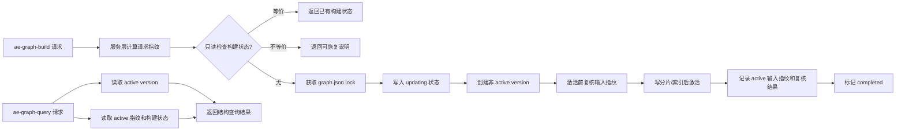

# 知识图谱新鲜度与更新策略

## AI 解析契约
- canonicalKind: plan
- humanEquivalent: true
- stableIdsRequired: true
- implementationUnitsRequired: true
- noImplicitScope: true

## 来源与目标
来源: `ae/brainstorms/graph-freshness-update-strategy-requirements.md`。

目标是在现有文件关系图谱能力上增加可解析的新鲜度表达、构建中状态表达、等价构建 single-flight 行为和高影响场景门控规则。查询必须继续读取最后一个完整 active version，不读取未激活构建产物；当图谱无法证明新鲜时，后续流程必须能区分旧快照可用于定位线索和不能用于高影响结论。

非目标是不实现实时文件监听索引、不让查询读取构建中的未激活版本、不为每次文件变化自动构建图谱、不扩展到符号级或运行时动态依赖分析。

外部行为保持要求: 现有 `ae-graph-build` 的 `auto/full/incremental` 入口、现有查询模式和 active version 语义继续可用；新增字段必须作为结构化补充，不破坏已存在的 `status`、`mode`、`scopeRoot`、`versionId`、`summary`、`queryCost`、`truncation` 和 `result` 返回结构。

## 范围

### 包含
- 查询结果增加 `freshness` 对象，表达 `fresh`、`maybe_stale`、`stale`、`updating` 和判定依据。
- 构建版本记录持久化构建输入指纹，用于判断 active version 是否仍可证明新鲜。
- 新增轻量构建状态文件或等价状态记录，表达构建生命周期、等价请求复用和僵尸状态恢复。
- 构建工具在重复等价请求时返回已有构建状态，不启动第二个并行构建。
- 构建完成前复核输入指纹；构建期间再次发生变更时，新 active version 不得被标记为 `fresh`。
- 查询工具在构建中继续返回旧 active version，并标注正在更新。
- 技能/规则文案补充稳定点刷新策略和高影响门控矩阵。
- 覆盖存储、构建工具、查询工具、并发重入和门控文案的单元/集成测试。

### 不包含
- 不新增后台 daemon、文件 watcher 或自动实时刷新机制。
- 不改变图谱解析深度，仍只支持 `depth=shallow`。
- 不把图谱结果提升为测试、类型检查、Git diff 或源码读取的替代证据。
- 不在查询工具内自动触发构建。

### 约束
- 查询一致性优先于新鲜度，任何构建失败或中断都不得破坏最后一个可用 active version。
- 新鲜度判定必须保守；无法证明 `fresh` 时降级为 `maybe_stale`，构建中或状态异常时不得误标 fresh。
- 构建输入等价判断必须包含 worktree、scope、include/exclude、depth、mode 语义、过滤配置和构建输入指纹，不能只按 `worktree + scope` 判等。
- 面向插件用户的文案必须保持通用，不把本仓库源码结构作为下游项目的默认前提。

## 需求追溯
| 需求 ID | 计划响应 |
|---------|----------|
| R1 | U1, U3, U4, U5 |
| R2 | U1, U5, U7 |
| R3 | U5, U6, U7 |
| R4 | U6, U7 |
| R5 | U6, U7 |
| R6 | U5, U6, U7 |
| R7 | U2, U3, U4, U8 |
| R8 | U3, U4, U5, U7 |
| R9 | U4, U7 |
| R10 | U3, U4, U8 |
| R11 | U6, U7 |
| NFR1 | U1, U3, U4, U5, U8 |
| NFR2 | U2, U3, U4, U6, U8 |
| NFR3 | U5, U7, U8 |
| NFR4 | U1, U2, U4, U5, U8 |

## 高层技术设计
现有 `src/services/graph-storage-service.ts` 已经通过非 active version 构建、完成后 `activateVersion` 切换 active，天然满足“构建中查询旧 active version”的数据一致性基础。计划在此基础上增加两个独立概念：active version 的构建输入指纹，以及当前或最近构建的状态记录。

### 关键决策
- D1. 在查询结果顶层新增 `freshness` 对象，而不是只追加中文提示 → 理由: 后续 AI 流程需要稳定字段解析，同时保留中文说明满足用户反馈。
- D2. 新增轻量构建状态记录，不复用现有 `graph.json.lock` 作为 single-flight 真源 → 理由: 锁只证明写入互斥，不能表达构建输入、生命周期、等价请求复用、僵尸状态或用户可恢复建议。
- D3. 构建输入指纹和 freshness 判定核心放在服务层共享模块，而不是工具层 → 理由: 构建工具和查询服务都需要同一判等语义，避免复制逻辑或服务反向依赖工具。
- D4. 查询工具只报告新鲜度，不自动构建 → 理由: 需求要求稳定点刷新，查询内自动构建会重新引入中间态频繁更新和多技能重复调度。
- D5. 高影响结论门控落在技能/规则文案和工具返回提示双层 → 理由: 工具无法知道 LLM 后续是否要声明“无影响”，必须让消费流程也承担门控约束。
- D6. single-flight 状态判等必须在获取 `graph.json.lock` 前以只读方式完成 → 理由: 否则等价并发请求会先被写锁拦截，无法返回已有构建状态。

## 专项设计

### 数据模型
`src/services/graph-storage-service.ts` 中扩展版本记录与 manifest，新增可选字段以支持既有存储自然降级：

- `buildInputFingerprint: string`：active version 对应的输入指纹。
- `buildInput: { scopeRoot: string; depth: 'shallow'; effectiveMode: 'full' | 'incremental'; includeRules: string[]; excludeRules: string[]; changedFilesDigest: string; configDigest: string; gitHead?: string; gitStatusDigest?: string }`：用于诊断和新鲜度依据，不要求保存完整文件内容。
- `endInputFingerprint?: string`：构建完成前复核得到的输入指纹。
- `inputChangedDuringBuild?: boolean`：开始与结束指纹不一致时置为 true；此时 active 可激活，但 freshness 初始不得为 `fresh`。
- `completedAt: string`：版本激活完成时间，用于用户可读说明和僵尸状态比较。

新增构建状态文件建议为 `ae/graphs/graph-build-state.json`，与 `graph.json.lock` 分离：

- `schemaVersion: 1`
- `status: 'updating' | 'completed' | 'failed'`
- `startedAt`、`updatedAt`、`completedAt?`
- `worktreeKey`、`scopeRoot`
- `requestFingerprint`、`requestSummary`
- `activeVersionAtStart?`、`targetVersionId?`
- `processId?`
- `message`、`recoverBy`

构建状态生命周期协议：

- 读取状态和等价判定必须不获取 `graph.json.lock`。
- 只有决定启动真实构建时才获取 `graph.json.lock`。
- 获取写锁后必须重新读取状态；若期间已有等价构建写入 `updating`，释放锁并返回复用状态。
- `updating` 写入失败时不得创建 version。
- 构建失败时写入 `failed`，保留旧 active version。
- `activateVersion` 成功但 `completed` 状态写入失败时，active version 仍可查询，但 freshness 必须根据 active metadata 和缺失/异常状态保守降级为 `maybe_stale`。
- 查询读取到 lock 与 state 不一致时，以 active version 一致性为准返回可用查询结果，以状态异常作为 freshness 降级依据；不得只因 lock 存在而读取未激活版本。

`freshness` 返回对象建议结构：

- `status: 'fresh' | 'maybe_stale' | 'stale' | 'updating'`
- `activeVersionId`
- `basis: string[]`
- `message: string`
- `requiresRefreshFor: string[]`
- `canUseAsEvidence: boolean`
- `buildState?: { status; startedAt; requestFingerprint; equivalentToActive?: boolean; stale?: boolean }`

### 性能设计
- 构建输入指纹只基于规范化路径、规则、Git diff 摘要和必要元数据摘要，避免读取所有文件内容做哈希。
- 查询 freshness 时只读取 `graph.json`、active manifest 和构建状态文件，不扫描全仓文件。
- `stats`、`deps`、`core` 等已有索引快路径继续保留，freshness 计算不得强制加载完整图谱。

### 部署与回滚
- 由于 `graph.json` schema 当前为 `3`，执行时可优先用可选字段扩展，避免必须迁移旧图谱；若实现判断需要严格 schema，可升级 schema 并提供旧 schema 诊断重建路径。
- 回滚信号: 旧 active 图谱无法读取、构建失败后 active 被切换、查询结果缺失原有字段、重复构建被永久阻断。
- 回滚方案: 移除状态文件即可解除 single-flight 阻塞；旧 active version 仍应可被查询；必要时执行 `ae-graph-build mode=full` 重建。

## 实现单元

### U1. 新鲜度数据模型与 active 版本元数据
- [ ] 目标: 为 active version 持久化足够的构建输入信息，使查询能判断当前图谱是否可证明 fresh。
- [ ] 覆盖需求: R1, R2, NFR1, NFR4
- [ ] 依赖: 无
- [ ] 文件:
  - `src/services/graph-storage-service.ts`
  - `tests/services/graph-storage-service.test.ts`
- [ ] 方法:
  - 扩展 `GraphVersionRecord` 和 `GraphVersionManifest`，增加可选构建输入元数据，保持旧存储可读取。
  - 为 `createVersion` 或新增方法传入构建输入元数据，`activateVersion` 写入 manifest 时同步保存。
  - 增加只读读取方法，例如 `getActiveVersionMetadata(workspaceRoot, scopeRoot)`，返回 active version 的指纹、规则、创建/完成时间和 summary。
  - 旧版本没有指纹时，查询层必须只能判定为 `maybe_stale`，不得判定 fresh。
- [ ] 需遵循的模式:
  - 继续使用 `writeJsonAtomic` 写 manifest 和 store。
  - 只读 storage 不得触发写入。
  - 可选字段兼容旧 JSON，避免无必要的强制迁移。
- [ ] 测试场景:
  - 正常路径: 新建并激活版本后，可读取构建输入指纹和完成时间。
  - 边界情况: 旧 store 没有构建输入字段仍可诊断和查询，但 freshness 降级。
  - 错误路径: manifest 缺失或格式异常时仍返回现有 diagnostic，不误报 fresh。
  - 集成场景: 手工传入 full 与 incremental 样例元数据后，激活版本都能保留对应元数据。
- [ ] 验证:
  - `npx vitest run tests/services/graph-storage-service.test.ts`
- [ ] 回滚信号: 旧 `ae/graphs/graph.json` 无法被读取或 active version 丢失。

### U2. 构建请求规范化与指纹服务
- [ ] 目标: 提供工具层和查询服务都可复用的请求规范化、输入摘要和 freshness 判定基础，避免分层反向依赖或逻辑漂移。
- [ ] 覆盖需求: R7, NFR2, NFR4
- [ ] 依赖: U1
- [ ] 文件:
  - `src/services/graph-freshness-service.ts`
  - `src/tools/ae-graph-build.tool.ts`
  - `src/services/graph-query-service.ts`
  - `src/services/graph-config-service.ts`
  - `tests/services/graph-freshness-service.test.ts`
  - `tests/tools/ae-graph-build.tool.test.ts`
- [ ] 方法:
  - 新增服务层模块，导出 `normalizeGraphBuildInput`、`createGraphRequestFingerprint`、`createGraphInputDigest` 和 `evaluateGraphFreshnessBasis` 等纯函数或近纯函数。
  - 规范化 `scopeRoot`、`depth`、请求模式、有效模式、include/exclude、过滤配置和 diff 摘要。
  - 对 include/exclude 使用去重排序后的稳定 JSON，避免参数顺序导致非等价误判。
  - 对 Git 状态读取失败、未跟踪文件、过滤规则变化和结构性变化生成保守摘要；无法稳定摘要时标记为 `maybe_stale` 的依据。
  - 区分 `requestedMode` 与 `effectiveMode`：single-flight 请求判等使用请求语义和已计算输入摘要，active freshness 使用实际构建输入摘要。
  - `ae-graph-build` 与 `graph-query-service` 都只调用该服务层模块，不从服务层 import 工具文件。
- [ ] 需遵循的模式:
  - 不读取未必要的文件内容。
  - 不把 `git ls-files` 结果当作文件存在性证明，只作为输入摘要来源。
  - 保持路径为 POSIX 风格仓库相对路径。
- [ ] 测试场景:
  - 正常路径: 相同参数、相同过滤配置、相同 diff 产生相同指纹。
  - 边界情况: include/exclude 顺序不同但集合相同，指纹相同。
  - 错误路径: Git diff 读取失败时指纹带 warning，不允许判定 fresh。
  - 集成场景: 过滤配置变化导致指纹变化并触发全量构建；查询服务与构建工具对同一输入得到一致 freshness basis。
- [ ] 验证:
  - `npx vitest run tests/services/graph-freshness-service.test.ts`
  - `npx vitest run tests/tools/ae-graph-build.tool.test.ts`
- [ ] 回滚信号: 无变更时频繁触发全量构建，或不同过滤配置被错误复用。

### U3. 构建状态存储与生命周期协议
- [ ] 目标: 增加可恢复的构建状态记录，使重复等价构建请求复用已有状态，不等价请求获得可恢复说明。
- [ ] 覆盖需求: R1, R7, R8, R9, R10, NFR1, NFR2
- [ ] 依赖: U1, U2
- [ ] 文件:
  - `src/services/graph-storage-service.ts`
  - `tests/services/graph-storage-service.test.ts`
- [ ] 方法:
  - 在 storage service 增加构建状态文件路径、读取、原子写入、清理和 stale 判定方法。
  - 明确状态 API：`readGraphBuildState`、`writeGraphBuildState`、`markGraphBuildCompleted`、`markGraphBuildFailed`、`isGraphBuildStateStale`。
  - 状态 API 必须支持只读读取，不获取 `graph.json.lock`。
  - 写状态时使用原子写入；写入失败必须返回可恢复错误，不能静默吞掉。
  - 僵尸状态判定使用 `updatedAt` 超时和进程存在性可用性；跨平台无法验证进程时只依赖超时，不自动删除锁外文件，必要时返回恢复建议。
  - 现有 `graph.json.lock` 继续负责写互斥；构建状态负责用户可见生命周期和 single-flight 语义。
- [ ] 需遵循的模式:
  - 状态文件写入必须原子化。
  - 不在未获得明确确认时强制清理可能仍有效的锁。
  - 构建失败不得调用 `activateVersion`，不得修改 active 指针。
- [ ] 测试场景:
  - 正常路径: 状态从 `updating` 转为 `completed`，可只读读取完成状态。
  - 边界情况: `updating` 超时后被判定 stale，并返回恢复建议。
  - 错误路径: 状态文件损坏或写入失败时返回可恢复错误，不破坏 active version。
  - 集成场景: 构建状态与 active version 不一致时，diagnostic 保留 active 可用性并提供 freshness 降级依据。
- [ ] 验证:
  - `npx vitest run tests/services/graph-storage-service.test.ts`
- [ ] 回滚信号: 残留 `updating` 永久阻止构建，或并发请求绕过 single-flight 创建多个版本。

### U4. 构建工具 single-flight 编排与结束复核
- [ ] 目标: 在 `ae-graph-build` 中按正确顺序接入指纹、状态、写锁和结束复核，确保等价请求可复用且构建期间变化不误标 fresh。
- [ ] 覆盖需求: R1, R7, R8, R9, R10, NFR1, NFR2, NFR4
- [ ] 依赖: U1, U2, U3
- [ ] 文件:
  - `src/tools/ae-graph-build.tool.ts`
  - `tests/tools/ae-graph-build.tool.test.ts`
- [ ] 方法:
  - 在获取 `graph.json.lock` 前完成配置加载、scope 规范化、request fingerprint 计算和构建状态只读检查。
  - 有效 `updating` 状态存在时：等价请求返回 `reusedExistingBuild=true`、旧 active 使用边界和 `recoverBy`；不等价请求返回等待/稍后重试的结构化说明。
  - 决定启动真实构建时再获取写锁；获取写锁后重新读取状态，防止两个请求同时通过前置检查。
  - 写入 `updating` 后记录 `startInputFingerprint`，构建解析完成且激活前计算 `endInputFingerprint`。
  - `startInputFingerprint !== endInputFingerprint` 时仍可激活完整版本，但 metadata 标记 `inputChangedDuringBuild=true`，查询 freshness 不得返回 `fresh`。
  - 构建失败时写入 `failed` 并保持旧 active version；重复请求获得失败摘要和恢复建议。
- [ ] 需遵循的模式:
  - 写锁只保护 `graph.json` 和版本分片写入，不作为用户可见 single-flight 真源。
  - 构建期间不得读取或暴露未激活版本给 query。
  - 返回结构使用 JSON，保留现有构建成功字段。
- [ ] 测试场景:
  - 正常路径: 构建成功返回 `completed` 状态、active summary 和一致的 start/end 指纹。
  - 边界情况: 使用可控 Promise 或 mock 暂停第一次构建在 `updating` 状态，第二次同参数调用返回 `reusedExistingBuild=true` 且 version 数不增加。
  - 错误路径: 第二次不同参数调用返回等待/拒绝结构；第一次构建失败后 active version 未改变。
  - 集成场景: 构建过程中 mock 出新的 Git diff，激活后查询不得得到 `fresh`。
- [ ] 验证:
  - `npx vitest run tests/tools/ae-graph-build.tool.test.ts`
- [ ] 回滚信号: 等价并发请求仍先返回锁错误，或构建期间变更后 active 被标记为 fresh。

### U5. 查询结果 freshness 输出
- [ ] 目标: 让所有成功查询和可用诊断都包含结构化新鲜度信息，并在构建中明确说明返回的是旧 active version。
- [ ] 覆盖需求: R1, R2, R3, R6, R8, NFR1, NFR3, NFR4
- [ ] 依赖: U1, U2, U3, U4
- [ ] 文件:
  - `src/services/graph-query-service.ts`
  - `src/tools/ae-graph-query.tool.ts`
  - `tests/services/graph-freshness-service.test.ts`
  - `tests/tools/ae-graph-query.tool.test.ts`
- [ ] 方法:
  - 在 `executeGraphQuery` 开始处读取 active metadata 和 build state，计算 `freshness`。
  - 修改 `formatOkResult`，将 `freshness` 放在顶层并保留原字段。
  - 当 build state 为有效 `updating` 且 active version 存在时，查询继续使用 active version，`freshness.status='updating'`。
  - 当 active 无输入指纹、Git 状态不可读、过滤配置变化、状态 failed/stale 或 `inputChangedDuringBuild=true` 时，返回 `maybe_stale` 或 `stale`，并给出中文 `message` 与 `requiresRefreshFor`。
  - 对 `status='diagnostic'` 且无 active version 的情况，保留现有 diagnostic；如有 active 可用但存在状态异常，返回可用旧图谱和 freshness，而不是误导为不可查询。
- [ ] 需遵循的模式:
  - 查询工具不得创建 storage 写锁。
  - `freshness` 不得强制加载完整图谱。
  - 结果结构必须能被 JSON 解析，中文说明只作为补充。
- [ ] 测试场景:
  - 正常路径: active 指纹与当前输入等价时返回 `fresh`。
  - 边界情况: 旧 active 无指纹时返回 `maybe_stale`，查询结果仍可用。
  - 错误路径: 构建中状态过期时返回 `maybe_stale` 或 `stale`，不永久 `updating`。
  - 集成场景: 构建中执行 `impact` 查询，返回旧 active version、`status='updating'` 和旧快照提示。
- [ ] 验证:
  - `npx vitest run tests/tools/ae-graph-query.tool.test.ts`
- [ ] 回滚信号: 查询返回缺少原有 `result`，或构建中查询失败而不是读取旧 active。

### U6. 稳定点刷新策略与高影响门控
- [ ] 目标: 将需求中的刷新稳定点和旧图谱使用边界固化到面向插件用户的规则/技能文案中，避免流程把旧图谱当作结论依据。
- [ ] 覆盖需求: R3, R4, R5, R6, R11, NFR2
- [ ] 依赖: U5
- [ ] 文件:
  - `src/assets/rules/graph-first.md`
  - `src/assets/skills/ae-graph-query/SKILL.md`
  - `src/assets/skills/ae-graph-build/SKILL.md`
  - `src/assets/skills/ae-review/SKILL.md`
  - `src/assets/skills/ae-refactor/SKILL.md`
  - `src/assets/skills/ae-work/SKILL.md`
  - `tests/assets/graph-freshness-guidance.test.ts`
- [ ] 方法:
  - 在 graph-first 规则中加入稳定点刷新策略表：用户显式刷新、审查前、重构/影响分析前、一批编辑完成后、阶段结束后、阶段开始。
  - 明确阶段开始默认不自动刷新，除非已有过期诊断且当前任务依赖图谱结论。
  - 加入高影响门控矩阵：定位候选文件允许旧图谱；声明无影响/无依赖/无需修改必须 fresh 或有真实文件/Git diff 证据；重构、删除、跨模块修改影响范围必须刷新。
  - 在相关技能中要求读取 `freshness`，并在 `freshness.status !== 'fresh'` 时禁止把图谱空结果写成最终结论。
  - 保持文案通用，不引用本仓库内部测试命令或源码结构作为下游项目前提。
  - 新增 Vitest 文本断言，检查目标资产包含 `freshness`、状态读取要求、非 fresh 空结果不得作为“无影响/无依赖/无需修改”最终结论的语义。
- [ ] 需遵循的模式:
  - 面向用户的资产只描述通用工作流证据。
  - 不要求所有任务一开始自动构建图谱。
  - 不替代源码读取、Git diff、测试和审查。
- [ ] 测试场景:
  - 正常路径: 文案明确低风险定位可继续使用旧图谱并标注。
  - 边界情况: 用户拒绝刷新时，文案要求只能引用旧图谱为线索。
  - 错误路径: 构建失败时，文案禁止输出“无影响”类结论。
  - 集成场景: `ae:review`、`ae:refactor`、`ae:work` 都能从规则中继承高影响门控。
- [ ] 验证:
  - `npx vitest run tests/assets/graph-freshness-guidance.test.ts`
  - `npm run typecheck`
  - 人工检查上述 Markdown 中技能边界无仓库源码假设泄漏。
- [ ] 回滚信号: 规则导致所有阶段开始都自动构建，或允许 stale 图谱支撑高影响结论。

### U7. 工具描述与用户可恢复反馈
- [ ] 目标: 更新工具描述和返回消息，让重复构建、构建中查询、旧快照查询和刷新要求对用户可见且可恢复。
- [ ] 覆盖需求: R2, R3, R4, R5, R6, R8, R9, R11, NFR3
- [ ] 依赖: U4, U5, U6
- [ ] 文件:
  - `src/tools/ae-graph-build.tool.ts`
  - `src/tools/ae-graph-query.tool.ts`
  - `tests/tools/ae-graph-build.tool.test.ts`
  - `tests/tools/ae-graph-query.tool.test.ts`
- [ ] 方法:
  - `ae-graph-build` 返回中加入 `buildState`、`requestFingerprint`、`reusedExistingBuild`、`recoverBy` 和旧 active 使用边界。
  - `ae-graph-query` 描述中说明查询不构建图谱，会返回 active version 的 freshness。
  - 对重复等价请求返回“已有构建进行中”的 JSON，而不是纯文本锁错误。
  - 对无法刷新或构建失败场景返回结构化建议：可继续低风险定位、等待构建完成、显式重试 full 构建或使用真实文件/Git diff 补证。
  - 确保所有错误仍为中文可恢复结果，不抛出未捕获异常给用户。
- [ ] 需遵循的模式:
  - Tool 描述第一行保持简短摘要。
  - 返回结构不包含绝对路径，面向用户的路径使用仓库相对路径。
  - 不新增 toast 或 UI 通知。
- [ ] 测试场景:
  - 正常路径: 构建成功返回 buildState completed 和 active summary。
  - 边界情况: 无变更时返回无需更新，并包含 freshness/active 依据。
  - 错误路径: 锁存在且不能确认清理时返回结构化可恢复说明。
  - 集成场景: 查询结果 JSON 包含 `tool` 和 `freshness`，原查询字段保持不变。
- [ ] 验证:
  - `npx vitest run tests/tools/ae-graph-build.tool.test.ts tests/tools/ae-graph-query.tool.test.ts`
- [ ] 回滚信号: 调用方无法 JSON 解析工具结果，或用户只能看到不可恢复的锁错误。

### U8. 最终集成验证与回归门禁
- [ ] 目标: 汇总前序单元已落地的测试，形成最终验证报告和回归门禁，不承载新的功能实现。
- [ ] 覆盖需求: R7, R10, NFR1, NFR2, NFR3, NFR4
- [ ] 依赖: U1, U2, U3, U4, U5, U6, U7
- [ ] 文件:
  - `tests/services/graph-storage-service.test.ts`
  - `tests/services/graph-freshness-service.test.ts`
  - `tests/tools/ae-graph-build.tool.test.ts`
  - `tests/tools/ae-graph-query.tool.test.ts`
  - `tests/assets/graph-freshness-guidance.test.ts`
- [ ] 方法:
  - 汇总 U1-U7 的测试覆盖矩阵，确认每个需求至少有一个自动化测试或明确的人工审查证据。
  - 运行 storage、freshness service、build tool、query tool 和资产文案断言测试。
  - 运行 `npm run typecheck`。
  - 若 Markdown 文案改动较多或测试覆盖矩阵显示跨技能行为存在风险，运行全量测试作为回归兜底。
- [ ] 需遵循的模式:
  - Vitest 测试放在 `tests/` 下，命名使用 kebab-case。
  - 测试描述使用中文。
  - Mock Git 命令和文件系统状态时避免依赖本机真实 Git 状态。
- [ ] 测试场景:
  - 正常路径: 覆盖矩阵显示 fresh active 查询、构建成功激活新版本、文案门控断言均已覆盖。
  - 边界情况: 覆盖矩阵显示旧 active 无指纹、未跟踪文件、过滤配置变化、Git diff 不可读、构建期间再次变更均已覆盖。
  - 错误路径: 覆盖矩阵显示构建失败、状态文件残留、锁存在、manifest 异常均已覆盖。
  - 集成场景: 覆盖矩阵显示构建中查询仍读取旧 active，重复构建不创建第二个版本。
- [ ] 验证:
  - `npx vitest run tests/services/graph-storage-service.test.ts tests/services/graph-freshness-service.test.ts tests/tools/ae-graph-build.tool.test.ts tests/tools/ae-graph-query.tool.test.ts tests/assets/graph-freshness-guidance.test.ts`
  - `npm run typecheck`
  - `npm run test`
- [ ] 回滚信号: 任一 freshness 状态只能靠人工解释无法从 JSON 字段断言，或测试必须依赖真实仓库全量图谱。

## 风险与应对
| 风险 | 影响 | 应对措施 |
|------|------|----------|
| 指纹过于粗略导致 stale 被误标 fresh | 高影响结论可能基于旧图谱 | 默认保守降级；无法稳定覆盖的输入纳入 `basis` 并返回 `maybe_stale` |
| 状态文件与 lock 状态不一致 | 用户看到构建中但实际无构建，或反之 | 状态文件只负责用户语义；lock 仍负责写互斥；增加 stale 判定和恢复建议 |
| 新字段破坏旧图谱读取 | 用户已有图谱无法查询 | 使用可选字段兼容；旧版本 freshness 降级，不阻断低风险查询 |
| 查询 freshness 计算过重 | 查询性能下降 | 不扫描全仓；只读取 active metadata、状态文件和轻量 Git 摘要 |
| 技能文案过度自动刷新 | 回到频繁重建和中间态噪音 | 明确阶段开始默认不自动刷新，只在稳定点或高影响结论前刷新 |
| single-flight 拒绝不等价请求影响体验 | 用户不清楚如何继续 | 返回可恢复 JSON，说明等待、稍后重试、显式 full 构建或低风险使用旧图谱的边界 |

## 待定问题

### 推迟到执行
- Q1. 构建状态 stale 超时时长的具体常量应结合现有测试运行时间和大型仓库构建耗时设置，默认可从 10 分钟起步并在测试中注入。
- Q2. 是否升级 `graph.json` schemaVersion 取决于实现时可选字段兼容是否足够；若升级，必须同步诊断和测试旧 schema 恢复路径。
- Q3. 进程存活检测在 Windows 与 Unix 的实现细节可在执行时决定；如果跨平台不稳定，仅使用超时和用户确认恢复。

## 等价性检查
- implementationUnitsCount: 8
- tracedRequirementsCount: 15
- decisionsCount: 6
- risksCount: 6
