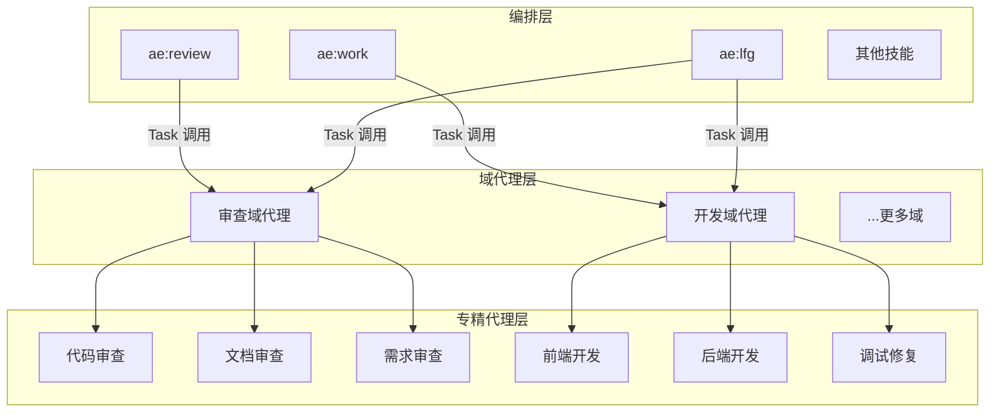
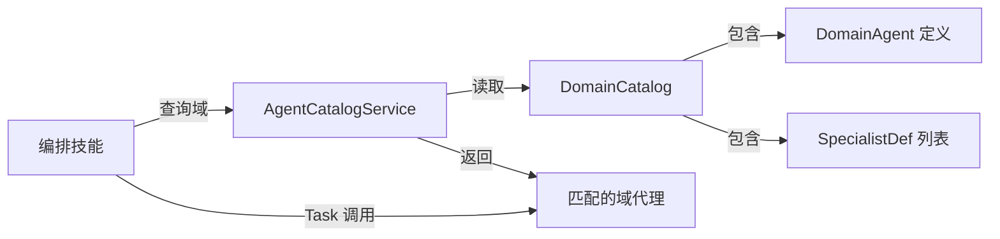

# 统一编排协议实施计划

## AI 解析契约
- canonicalKind: plan
- humanEquivalent: true
- stableIdsRequired: true
- implementationUnitsRequired: true
- noImplicitScope: true

## 来源与目标

**来源**：`ae/brainstorms/unified-orchestration-protocol-requirements.md`

**目标**：将 AE 插件从"技能包办一切"架构重构为三层编排架构（编排技能 → 域代理 → 专精代理），实现跨技能能力复用和场景域独立扩展。

**非目标**：
- 不重构 OpenCode 平台自身的子代理机制
- 不实现所有场景域的专精代理（首批只实现审查域和开发域）
- 不改变用户侧的命令入口（`/ae-work`、`/ae-review` 等命令仍可用）

## 范围

### 包含
- 域代理目录结构和定义格式
- 代理目录（Agent Catalog）服务和查询工具
- 域代理调度基础设施（选择规则、协调策略、结果聚合器）
- 编排层四阶段协议的技能重构框架
- 审查域重构为域代理 + 专精代理
- 开发域代理和首批专精代理
- ae:review 和 ae:work 的编排层重构

### 不包含
- 测试、运维、产品、文档、知识等域的专精代理实现
- 域代理的 UI/UX 变更
- OpenCode 平台 Task 工具本身的改造
- 具体专精代理的提示词优化

### 约束
- 域代理和专精代理通过 OpenCode Task 工具调用
- 代理目录存储格式使用 TypeScript 常量（与当前 `AgentDefinitionSchema` 一致）
- 域代理定义格式采用目录结构（DOMAIN.md + specialists/）
- 编排层只传递通用 `domainContext` 容器，不构造或理解域特有字段；域特有上下文由域代理在容器内补全和解释

## 需求追溯

| 需求 ID | 计划响应 |
|---------|----------|
| R1 | U2, U7, U8 |
| R2 | U2 |
| R3 | U2 |
| R4 | U2 |
| R5 | U7, U8 |
| R6 | U1 |
| R7 | U5 |
| R8 | U6 |
| R9 | U1 |
| R10 | U3 |
| R11 | U3 |
| R12 | U3 |
| R13 | U4 |
| R14 | U4 |
| R15 | U1, U3 |
| R16 | U4 |
| R17 | U4 |
| R18 | U4 |
| R19 | U5, U7 |
| R20 | U6, U8 |

## 高层技术设计

### 三层架构



### 域代理目录结构

```
src/assets/agents/
├── domains/                        # 域代理根目录
│   ├── review/                     # 审查域
│   │   ├── DOMAIN.md               # 域代理定义（入口/调度/聚合）
│   │   ├── specialists/            # 专精代理
│   │   │   ├── code-reviewer.md
│   │   │   ├── document-reviewer.md
│   │   │   ├── requirements-reviewer.md
│   │   │   └── ...
│   │   └── references/            # 域内调度规则和模板
│   │       ├── selection-rules.md
│   │       └── synthesis-template.md
│   ├── development/                # 开发域
│   │   ├── DOMAIN.md
│   │   ├── specialists/
│   │   │   ├── frontend-dev.md
│   │   │   ├── backend-dev.md
│   │   │   └── debug-fix.md
│   │   └── references/
│   ├── explore/                    # 探索域预留
│   ├── product/                    # 产品域预留
│   ├── design/                     # 设计域预留
│   ├── testing/                    # 测试域预留
│   ├── operations/                 # 运维域预留
│   ├── documentation/              # 文档域预留
│   ├── knowledge/                  # 知识域预留
│   └── ...更多域
├── review/                         # 旧目录（迁移后清空）
├── research/                       # 旧目录（迁移后清空）
└── workflow/                       # 旧目录（迁移后清空）
```

### 编排层四阶段协议

```
┌──────────┐    ┌──────────┐    ┌──────────┐    ┌──────────┐
│  入口    │ →  │  交互    │ →  │  调度    │ →  │  汇总    │
│ Entry    │    │Interact  │    │ Dispatch │    │ Summary  │
└──────────┘    └──────────┘    └──────────┘    └──────────┘
     ↓               ↓               ↓               ↓
 intent +       confirmed_      dispatch_       deliverable +
 domain +       context         results         validation
 constraints
```

**阶段间数据传递格式**：

| 阶段 | 输出 | 关键字段 |
|------|------|---------|
| 入口 | `TaskIntent` | `intent`, `domain`, `constraints`, `rawInput` |
| 交互 | `ConfirmedContext` | `confirmedParams`, `exclusions`, `boundaries` |
| 调度 | `DispatchResults` | `domainResults[]`（每个含 `status`, `summary`, `evidence`, `artifacts`） |
| 汇总 | `Deliverable` | `description`, `validationResults`, `artifacts[]` |

### 域代理上下行契约

**上行（编排层 → 域代理）**：
```typescript
interface DomainCallRequest {
  task: string
  intent: string
  constraints: string[]
  // 编排层只提供通用容器；域代理负责解释、补全和注入域专业上下文。
  domainContext: Record<string, unknown>
}
```

**上行（域代理 → 编排层）**：
```typescript
interface DomainExecutionResult {
  status: 'success' | 'partial' | 'failed'
  summary: string
  evidence: string[]
  artifacts: string[]
  findings?: DomainFinding[]
}
```

**下行（域代理 → 专精代理）**：
```typescript
interface SpecialistTask {
  task: string
  domainContext: Record<string, unknown>
  constraints: string[]
}
```

**下行（专精代理 → 域代理）**：
```typescript
interface SpecialistResult {
  status: 'success' | 'partial' | 'failed'
  output: string
  evidence: string[]
}
```

### 代理目录服务



核心类型：
```typescript
interface DomainCatalog {
  domain: string
  domainAgent: AgentDefinition
  specialists: SpecialistDef[]
}

interface SpecialistDef {
  name: string
  capabilities: string[]
  selectionCriteria: string
  inputContract: string
  outputContract: string
}
```

### 关键决策

- D1. 采用三层调度架构（编排技能 → 域代理 → 专精代理） → 理由: 域代理封装域内调度逻辑，使编排层无需理解域内专业知识（承接需求 D1）
- D2. 编排技能采用四阶段统一契约（入口/交互/调度/汇总） → 理由: 标准化所有编排技能的行为模式，使技能可组合、数据流可预测（承接需求 D2）
- D3. 域内调度策略由域代理自行决定 → 理由: 不同域的调度模式本质不同，强行统一会过度抽象（承接需求 D3）
- D4. `domainContext` 作为域特有扩展点 → 理由: 保持上行契约统一的同时，允许域代理接收和注入专业参数（承接需求 D4）
- D5. 域代理发现采用 LLM 动态路由 → 理由: 30+ 技能需要灵活路由，显式参数无法覆盖所有场景；编排层通过查询代理目录获取域代理描述，LLM 根据意图匹配（解决需求待定问题"编排技能如何发现和选择域代理"）
- D6. 域代理定义采用目录结构（DOMAIN.md + specialists/） → 理由: 域代理包含调度规则、专精代理清单和域内模板，单文件无法承载；目录结构与现有技能目录风格一致（解决需求待定问题"域代理的代理定义格式"）
- D7. 代理目录存储使用 TypeScript 常量 → 理由: 与当前 `AgentDefinitionSchema` 和 `ae-catalog.ts` 的模式一致，支持编译期类型检查
- D8. 审查域迁移策略：专精代理 .md 文件直接移入 `domains/review/specialists/`不改内容，注册层和路径映射同步更新 → 理由: 最小化迁移风险，验证新架构可行后再优化
- D9. 开发域代理首批包含 3 个专精代理（前端开发、后端开发、调试修复），重构改造暂不实现 → 理由: 覆盖开发域最常见场景，验证流水线+并行调度模式；R8 验收标准已调整为"首批至少实现三个"
- D10. 域代理以 OpenCode 原生代理（.md）形态存在，通过 Task 工具调用 → 理由: 与现有代理机制对齐，不引入新运行时依赖
- D11. 运行时路径映射：新增 `domain` stage 后，`agent-registration.ts` 的 `buildAgentConfig` 使用 `AgentDefinition.path` 字段替代 `stage+name` 拼接 → 理由: 域代理目录为 `agents/domains/{domain}/specialists/{name}.md`，与当前 `{stage}/{name}.md` 模式不兼容；`path` 字段已在 `AgentDefinitionSchema` 中定义但运行时未使用，改为从 `path` 读取实际文件位置
- D12. 审查域迁移后，`review-selector.ts` 和 `review-catalog.ts` 保留为代码层实现，供 `ae-review-contract` 工具使用；审查域代理的 `selection-rules.md` 作为 LLM 层描述，与代码逻辑语义对齐但不替代 → 理由: 代码层精确匹配（`ActivationPredicate`）不可被自然语言完全替代；双路径语义一致即可，`ae-review-contract` 工具走代码路径保证确定性

## 专项设计

### 接口设计

**Agent Catalog 查询工具**（`ae-domain-catalog` 工具）：
- 输入：`query`（任务描述或意图）、`domain`（可选域名过滤）
- 输出：匹配的域代理列表（含 `domain`、`description`、`specialists` 摘要）
- 实现：遍历 `DomainCatalog[]`，当 `domain` 参数存在时精确匹配，否则返回所有域供 LLM 选择

**域代理调度**：编排层通过 Task 工具调用域代理，传入 `DomainCallRequest` 格式的 prompt

### 数据模型

**新增 Schema**（扩展 `src/schemas/ae-asset-schema.ts`）：

| Schema | 用途 |
|--------|------|
| `DomainCatalogSchema` | 域代理目录条目 |
| `SpecialistDefSchema` | 专精代理定义 |
| `DomainCallRequestSchema` | 域调用请求 |
| `DomainExecutionResultSchema` | 域执行结果 |
| `SpecialistTaskSchema` | 专精任务 |
| `SpecialistResultSchema` | 专精结果 |

**扩展已有 Schema**：
- `AgentStageSchema` 新增 `'domain'` 值
- `AGENT` 常量新增域代理名称（如 `AGENT.REVIEW_DOMAIN`、`AGENT.DEVELOPMENT_DOMAIN`）

## 实现单元

### U1. 域代理目录结构与 Schema 定义
- [ ] 目标: 定义域代理的目录结构、文件格式和 TypeScript Schema，为后续实现提供类型基础
- [ ] 覆盖需求: R6, R9, R15
- [ ] 唯一产出物: `src/schemas/ae-asset-schema.ts` 中的域代理相关 Schema 和常量
- [ ] 依赖: 无
- [ ] 文件:
  - `src/schemas/ae-asset-schema.ts`
  - `src/assets/agents/domains/` 目录结构
- [ ] 方法:
  - 在 `AgentStageSchema` 新增 `'domain'` 值
  - 在 `AGENT` 常量新增域代理名：`REVIEW_DOMAIN`、`DEVELOPMENT_DOMAIN`
  - 新增 `SpecialistDefSchema`：`name`、`capabilities`、`selectionCriteria`、`inputContract`、`outputContract`
  - 新增 `DomainCatalogSchema`：`domain`、`domainAgent`（引用 `AgentDefinitionSchema`）、`specialists`（`SpecialistDefSchema[]`）
  - 新增 `DomainCallRequestSchema`：`task`、`intent`、`constraints`、`domainContext`
  - 新增 `DomainExecutionResultSchema`：`status`、`summary`、`evidence`、`artifacts`、`findings`（可选）
  - 新增 `SpecialistTaskSchema`：`task`、`domainContext`、`constraints`
  - 新增 `SpecialistResultSchema`：`status`、`output`、`evidence`
  - 创建 `src/assets/agents/domains/` 目录
- [ ] 需遵循的模式:
  - 与现有 `AgentDefinitionSchema`、`AeAssetEntrySchema` 的定义风格一致
  - `AGENT` 常量使用 `as const` 风格
  - Schema 字段附带 `.describe()` 中文描述
- [ ] 测试场景:
  - 正常路径: Schema 解析合法域代理定义
  - 边界情况: `domainContext` 为空对象时 Schema 校验通过
  - 错误路径: 缺少必填字段时 Schema 校验失败
  - 集成场景: `DomainCatalogSchema` 引用 `AgentDefinitionSchema` 不产生循环依赖
- [ ] 验证:
  - `npm run typecheck`
  - `npx vitest run tests/schemas/`

### U2. 编排层四阶段协议框架
- [ ] 目标: 定义编排技能的四阶段协议数据结构和阶段间传递格式
- [ ] 覆盖需求: R1, R2, R3, R4
- [ ] 唯一产出物: `src/schemas/orchestration-protocol.ts` 中的四阶段类型定义
- [ ] 依赖: U1（使用 `DomainCallRequestSchema`）
- [ ] 文件:
  - `src/schemas/orchestration-protocol.ts`（新建）
- [ ] 方法:
  - 定义 `TaskIntent`：`intent`（意图标签）、`domain`（目标域名）、`constraints`（约束条件）、`rawInput`（原始输入）
  - 定义 `ConfirmedContext`：`confirmedParams`、`exclusions`、`boundaries`
  - 定义 `DispatchResults`：`domainResults`（`DomainExecutionResult[]`）
  - 定义 `Deliverable`：`description`、`validationResults`、`artifacts`
  - 每个阶段类型包含 `stage` 标签和 `timestamp`，便于调试和追踪
- [ ] 需遵循的模式:
  - 纯类型定义文件，不含业务逻辑
  - 使用 Zod Schema 导出运行时校验和类型推导
- [ ] 测试场景:
  - 正常路径: 各阶段 Schema 解析合法数据
  - 边界情况: `constraints` 为空数组时校验通过
  - 错误路径: `intent` 缺失时校验失败
  - 集成场景: `DispatchResults` 引用 `DomainExecutionResult` 不产生循环依赖
- [ ] 验证:
  - `npm run typecheck`

### U3. 代理目录服务与查询工具
- [ ] 目标: 实现代理目录服务和 `ae-domain-catalog` 工具，使编排层可通过工具查询域代理
- [ ] 覆盖需求: R10, R11, R12, R15
- [ ] 唯一产出物: `src/services/domain-catalog-service.ts` 和 `src/tools/ae-domain-catalog.tool.ts`
- [ ] 依赖: U1（使用 Schema 和常量）
- [ ] 文件:
  - `src/services/domain-catalog-service.ts`（新建）
  - `src/tools/ae-domain-catalog.tool.ts`（新建）
  - `src/tools/index.ts`（注册新工具）
- [ ] 方法:
  - `domain-catalog-service.ts`：维护 `DOMAIN_CATALOGS: DomainCatalog[]` 常量，首批包含审查域和开发域的目录定义
    - 审查域目录：引用现有 21 个审查代理为专精代理，`selectionCriteria` 从 `review-catalog.ts` 的 `REVIEW_MATRIX` 迁移
    - 开发域目录：引用 3 个新专精代理，`selectionCriteria` 按任务类型描述
  - `getDomainCatalog(domain?: string)`：按域名过滤或返回全部
  - `ae-domain-catalog.tool.ts`：工具定义
    - `args.query`：任务描述（LLM 用于理解查询意图）
    - `args.domain`：可选域名过滤
    - 执行：调用 `getDomainCatalog`，返回匹配的域代理描述和专精代理摘要
  - 在 `src/tools/index.ts` 注册新工具
- [ ] 需遵循的模式:
  - 与 `ae-catalog.ts` 的 `PHASE_ONE_ENTRIES` 风格一致（TypeScript 常量数组）
  - 工具定义遵循 `@opencode-ai/plugin/tool` 模式
  - 工具描述包含功能说明和注意事项
- [ ] 测试场景:
  - 正常路径: 查询所有域返回完整目录
  - 边界情况: `domain` 参数为空时返回全部域
  - 错误路径: 不存在的域名返回空列表而非报错
  - 集成场景: 工具注册后 `ae:help` 可展示新工具
- [ ] 验证:
  - `npm run typecheck`
  - `npx vitest run tests/tools/`

### U4. 域代理调度基础设施
- [ ] 目标: 实现选择规则引擎、协调策略模板和结果聚合器，为域代理提供共享调度能力
- [ ] 覆盖需求: R13, R14, R16, R17, R18
- [ ] 唯一产出物: `src/services/domain-dispatch-service.ts`
- [ ] 依赖: U1（使用 Schema）、U3（使用目录服务）
- [ ] 文件:
  - `src/services/domain-dispatch-service.ts`（新建）
- [ ] 方法:
  - **选择规则引擎** `selectSpecialists(domain: string, taskIntent: TaskIntent): SpecialistDef[]`
    - 读取 `DomainCatalog.specialists` 的 `selectionCriteria` 和 `capabilities`
    - 支持三类匹配模式：能力匹配（`capabilities` 对任务意图）、范围匹配（文件/文档/模块范围）、上下文匹配（`constraints` 与 `domainContext`）
    - 基于 `taskIntent.intent`、`taskIntent.constraints` 和调用请求中的 `domainContext` 匹配专精代理
    - 当前实现为简单关键词匹配 + 常驻代理自动选中（复用 `review-selector.ts` 的 `alwaysOn` 逻辑）
  - **协调策略模板** `getCoordinationStrategy(domain: string): CoordinationStrategy`
    - `parallel`：所有专精并行执行
    - `pipeline`：专精按序执行
    - `parallel-then-sequential`：并行组 + 后续顺序步骤
    - `conditional`：条件选择单个或子集专精
    - 每个域代理在 `DOMAIN.md` 中声明策略类型，服务读取后返回策略实例
  - **结果聚合器** `aggregateResults(strategy: AggregationStrategy, results: SpecialistResult[]): DomainExecutionResult`
    - `union`：合并所有发现，去重，按严重级别排序
    - `merge`：将各专精输出合并为完整交付物
    - `best-of`：从多个结果中筛选最优
    - `reduce`：汇总结果，统计摘要
- [ ] 需遵循的模式:
  - 与 `review-selector.ts` 的 `selectReviewers` 和 `matchesEntry` 风格一致
  - 服务函数式设计，不维护运行时状态
- [ ] 测试场景:
  - 正常路径: 审查域选择规则返回代码审查+安全审查专精
  - 边界情况: 无匹配专精时返回空列表
  - 错误路径: 未知域返回空列表
  - 集成场景: 选择规则与 `review-selector.ts` 对同一输入产生相同审查者列表
- [ ] 验证:
  - `npm run typecheck`
  - `npx vitest run tests/services/domain-dispatch-service.test.ts`

### U5. 审查域代理与专精代理迁移
- [ ] 目标: 将审查域重构为域代理 + 专精代理体系，验证三层架构的可行性
- [ ] 覆盖需求: R7, R19
- [ ] 唯一产出物: `src/assets/agents/domains/review/` 目录下的审查域代理和专精代理定义
- [ ] 依赖: U1（Schema）、U3（目录注册）、U4（调度基础设施）
- [ ] 文件:
  - `src/assets/agents/domains/review/DOMAIN.md`（新建）
  - `src/assets/agents/domains/review/specialists/*.md`（从 `src/assets/agents/review/` 迁移）
  - `src/assets/agents/domains/review/references/selection-rules.md`（从 `review-catalog.ts` 和 `review-selector.ts` 提取）
  - `src/assets/agents/domains/review/references/synthesis-template.md`（从 `ae:review` 的 `synthesis-and-presentation.md` 提取）
  - `src/services/ae-catalog.ts`（更新代理注册，指向新路径）
  - `src/services/agent-registration.ts`（更新代理文件映射）
- [ ] 方法:
  - 创建 `DOMAIN.md`：包含域代理定义
    - frontmatter: `description: 审查域代理`、`mode: subagent`、`steps: 30`
    - 正文: Role（审查域协调者）、When To Use（任何审查任务）、Workflow（选择审查者 → 并行调度 → 综合发现 → 返回结果）、Output（`DomainExecutionResult` 格式）、Boundaries（只读操作、排除规则）
  - 将 `src/assets/agents/review/*.md` 的 21 个文件复制到 `src/assets/agents/domains/review/specialists/`，不改内容
  - 从 `review-catalog.ts` 的 `REVIEW_MATRIX` 和 `review-selector.ts` 的选择逻辑提取为 `selection-rules.md`，供域代理读取
  - 更新 `ae-catalog.ts` 的 `REQUIRED_AGENTS`：审查类代理路径改为 `src/assets/agents/domains/review/specialists/{name}.md`
  - 更新 `agent-registration.ts` 的 `buildAgentConfig`：使用 `AgentDefinition.path` 字段替代 `stage+name` 拼接来定位代理文件（D11），使域代理和专精代理可使用嵌套目录路径
  - 新增审查域代理注册：`AGENT.REVIEW_DOMAIN` → `src/assets/agents/domains/review/DOMAIN.md`
- [ ] 需遵循的模式:
  - `DOMAIN.md` 的 frontmatter 遵循 OpenCode 代理 frontmatter 规范
  - 专精代理 .md 文件内容与迁移前完全一致
  - 选择规则用自然语言描述（供 LLM 理解），与代码中的 `ActivationPredicate` 逻辑语义对齐
- [ ] 测试场景:
  - 正常路径: 域代理可被 Task 工具调用，返回审查结果
  - 边界情况: 单审查者场景（如只有 correctness-reviewer）正常工作
  - 错误路径: 所有审查代理超时时返回 `partial` 状态
  - 集成场景: `ae:review` 通过审查域代理获得与迁移前等效的审查结果
- [ ] 验证:
  - `npm run typecheck`
  - `npm run build`
  - 手动验证：`/ae-review` 命令仍可正常执行代码审查

### U6. 开发域代理与首批专精代理
- [ ] 目标: 创建开发域代理和 3 个专精代理，验证开发域的流水线+并行调度模式
- [ ] 覆盖需求: R8, R20
- [ ] 唯一产出物: `src/assets/agents/domains/development/` 目录下的开发域代理和专精代理定义
- [ ] 依赖: U1（Schema）、U3（目录注册）、U4（调度基础设施）、U5（共享注册文件和路径映射先由审查域迁移落地）
- [ ] 文件:
  - `src/assets/agents/domains/development/DOMAIN.md`（新建）
  - `src/assets/agents/domains/development/specialists/frontend-dev.md`（新建）
  - `src/assets/agents/domains/development/specialists/backend-dev.md`（新建）
  - `src/assets/agents/domains/development/specialists/debug-fix.md`（新建）
  - `src/assets/agents/domains/development/specialists/refactor-dev.md`（占位文件，仅含 frontmatter 和能力描述，不实现完整工作流）
  - `src/assets/agents/domains/development/references/selection-rules.md`（新建）
  - `src/services/ae-catalog.ts`（新增开发域代理注册）
  - `src/services/agent-registration.ts`（新增开发域代理映射）
- [ ] 方法:
  - 创建 `DOMAIN.md`：
    - frontmatter: `description: 开发域代理`、`mode: subagent`、`steps: 30`
    - 正文: Role（开发域协调者）、When To Use（任何开发/实现任务）、Workflow（分析任务 → 拆分子任务 → 选择专精 → 并行/流水线调度 → 聚合结果）、Output（`DomainExecutionResult` 格式）、Boundaries（不执行 git 操作、不修改 `.opencode/`）
    - 协调策略声明：`parallel-then-sequential`（并行实现 → 顺序集成）
    - 聚合策略声明：`merge`
  - 创建 3 个专精代理：
    - `frontend-dev.md`：前端开发专精，能力描述包含 UI 组件、样式、交互逻辑、响应式设计
    - `backend-dev.md`：后端开发专精，能力描述包含 API、数据层、业务逻辑、中间件
    - `debug-fix.md`：调试修复专精，能力描述包含错误分析、根因定位、修复实现、回归验证
    - `refactor-dev.md`：重构改造专精（占位），能力描述包含代码重构、架构优化、技术债清理
  - 创建 `selection-rules.md`：按任务关键词匹配（"前端"/"UI"/"组件" → frontend-dev，"API"/"数据库"/"服务" → backend-dev，"调试"/"修复"/"Bug" → debug-fix，"重构"/"优化"/"技术债" → refactor-dev）
  - 在 `ae-catalog.ts` 新增开发域代理和专精代理注册
  - 在 `AGENT` 常量新增：`DEVELOPMENT_DOMAIN`、`FRONTEND_DEV`、`BACKEND_DEV`、`DEBUG_FIX`、`REFACTOR_DEV`
- [ ] 需遵循的模式:
  - 与审查域代理的 `DOMAIN.md` 结构一致
  - 专精代理 frontmatter 遵循 OpenCode 代理规范
  - 选择规则用自然语言描述
- [ ] 测试场景:
  - 正常路径: 开发域代理接收到前端任务后选择 `frontend-dev` 专精代理
  - 边界情况: 任务同时涉及前后端时选择 `frontend-dev` + `backend-dev` 并行执行
  - 错误路径: 任务无法匹配任何专精时返回 `failed` 状态
  - 集成场景: `ae:work` 通过开发域代理完成一个实现任务
- [ ] 验证:
  - `npm run typecheck`
  - `npm run build`
  - 手动验证：开发域代理可被 Task 工具调度

### U7. ae:review 编排层重构
- [ ] 目标: 将 ae:review 重构为编排层（入口/交互/调度/汇总），调度逻辑委托给审查域代理
- [ ] 覆盖需求: R1, R5, R19
- [ ] 唯一产出物: 重构后的 `src/assets/skills/ae-review/SKILL.md`
- [ ] 依赖: U2（四阶段协议类型）、U5（审查域代理）
- [ ] 文件:
  - `src/assets/skills/ae-review/SKILL.md`（重构）
  - `src/assets/skills/ae-review/references/`（精简或移除不再需要的子流程文件）
- [ ] 方法:
  - 重构 `SKILL.md` 为四阶段协议：
    - 入口阶段：保留现有参数解析（domain、mode、范围标记），输出 `TaskIntent`
    - 交互阶段：保留现有范围确认（交互模式），输出 `ConfirmedContext`
    - 调度阶段：**移除现有的子代理调度逻辑**，改为通过 Task 工具调用审查域代理，传入 `DomainCallRequest`
    - 汇总阶段：接收 `DomainExecutionResult`，格式化为用户可读的审查报告，输出 `Deliverable`
  - 审查域代理负责：选择审查者、并行调度、结果综合
  - `ae-review-contract` 工具保留（供外部调用者获取审查团队预览），但内部调度改走域代理
  - 精简 `references/` 下的子流程文件：保留范围确定和综合展示逻辑，移除审查者选择和子代理调度逻辑
- [ ] 需遵循的模式:
  - 四阶段协议与 `orchestration-protocol.ts` 中的类型定义对齐
  - 保持现有用户命令入口不变（`/ae-review`）
- [ ] 测试场景:
  - 正常路径: `/ae-review` 执行代码审查，结果与重构前等效
  - 边界情况: 无头模式跳过交互阶段直接调度
  - 错误路径: 审查域代理返回 `failed` 时，汇总阶段输出错误摘要
  - 集成场景: `ae:lfg` 的审查步骤仍可正常调用 `ae:review`
- [ ] 验证:
  - `npm run build`
  - 手动验证：`/ae-review mode:headless domain:code from:HEAD~1` 正常执行

### U8. ae:work 编排层重构
- [ ] 目标: 将 ae:work 重构为编排层（入口/交互/调度/汇总），开发能力委托给开发域代理
- [ ] 覆盖需求: R1, R5, R20
- [ ] 唯一产出物: 重构后的 `src/assets/skills/ae-work/SKILL.md`
- [ ] 依赖: U2（四阶段协议类型）、U6（开发域代理）
- [ ] 文件:
  - `src/assets/skills/ae-work/SKILL.md`（重构）
  - `src/assets/skills/ae-work/references/`（精简或移除不再需要的子流程文件）
- [ ] 方法:
  - 重构 `SKILL.md` 为四阶段协议：
    - 入口阶段：保留现有输入分流（计划路径/交接文件/裸提示词/上游委派），输出 `TaskIntent`
    - 交互阶段：保留 worktree 决策和用户确认，输出 `ConfirmedContext`
    - 调度阶段：**将任务分析和子代理调度改为调用开发域代理**，传入 `DomainCallRequest`；开发域代理负责选择专精代理和协调执行
    - 汇总阶段：接收 `DomainExecutionResult`，运行验证，输出 `Deliverable`
  - 保留 `ae-task-analyzer` 工具（开发域代理可使用它做任务分解）
  - 精简 `references/` 下的子流程文件：保留输入分流、worktree 决策和验证逻辑，移除子代理调度模板
- [ ] 需遵循的模式:
  - 四阶段协议与 `orchestration-protocol.ts` 中的类型定义对齐
  - 保持现有用户命令入口不变（`/ae-work`）
  - worktree 决策逻辑保留在编排层（域代理不涉及 Git 操作）
- [ ] 测试场景:
  - 正常路径: `/ae-work` 执行一个实现任务，开发域代理调度专精代理完成
  - 边界情况: 上游编排器委派（ae:lfg 调用）时跳过 worktree 询问
  - 错误路径: 开发域代理返回 `partial` 时，汇总阶段列出未完成项
  - 集成场景: `ae:lfg` 的工作执行步骤仍可正常调用 `ae:work`
- [ ] 验证:
  - `npm run build`
  - 手动验证：`/ae-work` 执行一个简单实现任务

## 风险与应对

| 风险 | 影响 | 应对措施 |
|------|------|----------|
| Task 工具嵌套调用（编排→域→专精）不可行或上下文丢失 | 整个三层架构无法工作 | Q1 必须在执行前验证；若不支持嵌套，域代理退化为编排层内联逻辑（两层合并为一层） |
| 审查域迁移后审查质量下降 | 用户信任度降低 | D12 决策保留代码层选择逻辑；审查域代理的 `selection-rules.md` 与代码逻辑语义对齐；U5 集成测试验证功能可用性 |
| LLM 动态路由选择错误域代理 | 任务被路由到不合适的域 | 代理目录中的 `selectionCriteria` 提供明确的匹配描述；编排层入口阶段可覆盖 LLM 选择 |
| 域代理 .md 文件过大导致 prompt 超限 | Task 调用失败 | DOMAIN.md 只包含调度逻辑，专精代理描述和选择规则放在 references/ 下按需加载 |
| U5/U6 修改共享文件产生合并冲突 | 返工风险 | U6 显式依赖 U5；共享文件（ae-catalog.ts、agent-registration.ts、ae-asset-schema.ts）由 U5 先行修改，U6 在 U5 完成后再开始 |

## 待定问题

### 执行前需解决
- Q1. [影响 U7/U8] OpenCode Task 工具是否支持 subagent→subagent 的嵌套调用？需实际验证：编排技能（主代理）→ 域代理（subagent）→ 专精代理（subagent）的两层 Task 嵌套是否可行

### 推迟到执行
- Q2. [影响 U7] ae:review 重构后，`references/subagent-template.md` 是否需要适配新契约格式，还是完全由域代理内部处理
- Q3. ae:lfg 是否需要重构为纯编排层（按四阶段协议调度多个域代理）

## 一致性检查
- implementationUnitsCount: 8
- tracedRequirementsCount: 20
- decisionsCount: 12
- risksCount: 5
