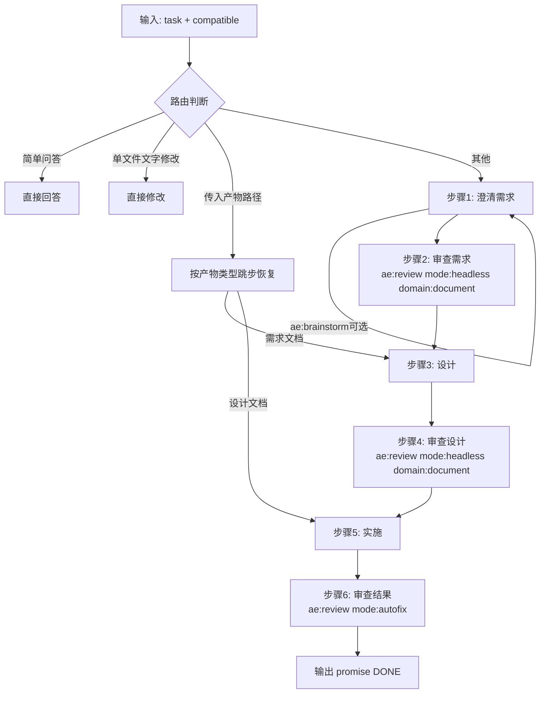

# 重构 ae:lfg 技能实施计划

## AI 解析契约
- canonicalKind: plan
- humanEquivalent: true
- stableIdsRequired: true
- implementationUnitsRequired: true
- noImplicitScope: true

## 来源与目标

来源：`ae/prds/2026-06-03-refactor-ae-lfg-skill-prd.md`

目标：将 ae:lfg 从依赖 ae:prd/ae:plan/ae:work 的组合管道重构为自包含管道，内联澄清/设计/实施，仅调用 ae:review 做审查，极简文档格式，一次澄清后静默执行到底。

非目标：不修改 ae:review、ae:prd、ae:work 技能本身；不修改 TypeScript 工具/服务代码；不修改命令注册或 schema 常量。

## 范围

### 包含
- ae:lfg SKILL.md 重写
- ae:lfg references/ 目录下的参考文档更新
- 新的 lfg 需求文档模板和设计文档模板
- ae:plan 排除 -lfg 产物规则
- ae:prd 排除 -lfg 产物规则
- ae-catalog.ts 中 ae:lfg 的 description 和 argumentHint 更新

### 不包含
- ae:review 技能本身的修改
- ae:prd、ae:work 技能的核心逻辑修改（仅允许 ae:plan/ae:prd 添加排除规则文本）
- ae:lfg 相关工具/服务的 TypeScript 代码修改（ae-catalog.ts 的 description/argumentHint 更新除外）
- 命令注册或 schema 常量变更（SKILL.LFG 和 COMMAND.LFG 保持不变）

### 约束
- 技能名称仍为 ae:lfg
- 审查步骤必须复用现有 ae:review
- 产物目录与 ae:prd/ae:plan 共享，仅靠 -lfg 命名标识区分
- lfg 产物 frontmatter type 值为 lfg-prd 和 lfg-plan

## 需求追溯

| 需求 ID | 计划响应 |
|---------|----------|
| R1 | U1a |
| R2 | U1a |
| R3 | U1a |
| R4 | U1a |
| R5 | U1a |
| R6 | U1a |
| R7 | U1a |
| R8 | U1a |
| R9 | U2 |
| R10 | U2 |
| R11 | U2 |
| R12 | U2 |
| R13 | U3 |
| R14 | U1b |
| R15 | U1a |
| R16 | U1a |
| R17 | U1a |
| R18 | U1a |
| R19 | U1a |
| R20 | U1a |
| R21 | U1a |
| R22 | U1a |
| R23 | U1a |
| R24 | U1a |
| R25 | U3 |
| NFR1 | U1a |
| NFR2 | U1a |
| NFR3 | U1a |

## 高层技术设计

### 管道架构

### 关键决策
- D1. lfg 需求文档 frontmatter type 值为 `lfg-prd`，设计文档为 `lfg-plan` → 理由: 与文件名 -lfg-prd.md/-lfg-plan.md 一致，且不与现有 prd/plan 冲突
- D2. 审查步骤统一使用 ae:review，需求/设计审查用 mode:headless domain:document，结果审查用 mode:autofix → 理由: headless 模式静默执行，autofix 模式可自动修复代码问题
- D3. 澄清阶段内联提问逻辑，不调用 ae:prd → 理由: 减少跨技能交互，一次澄清后静默执行
- D4. 产物路径沿用 ae/prds/ 和 ae/plans/ 目录，-lfg 标识区分 → 理由: 用户偏好同目录聚合

## 实现单元

### U1a. 重写 ae:lfg SKILL.md
- [ ] 目标: 将 SKILL.md 从调用子技能的组合管道重写为自包含 6 步管道
- [ ] 覆盖需求: R1-R8, R14-R24, NFR1-NFR3
- [ ] 唯一产出物: `src/assets/skills/ae-lfg/SKILL.md` 重写完成
- [ ] 依赖: 无
- [ ] 文件:
  - `src/assets/skills/ae-lfg/SKILL.md`
- [ ] 方法:
  - 重写 SKILL.md，包含以下章节：
    - frontmatter：保留 name: ae:lfg，更新 description 和 argument-hint（`"[task] [--compatible=true|false]"`）
    - 输入：两个参数 task 和 compatible
    - 任务路由：简单问答直接回答、只读审查直接调用 ae:review report-only、提交请求走 Git 安全流程、单文件文字修改直接修改、其余走管道
    - 恢复策略：传入产物路径时按类型跳步（需求→从设计开始，设计→从实施开始）
    - 6 步管道，每步含门控条件：
      - 步骤 1 澄清需求：内联提问，一次一问，可用 ae:brainstorm；门控：所有待定问题已解决，目标/范围/验收标准已确认
      - 步骤 2 审查需求：调用 ae:review mode:headless domain:document；门控：无 P0/P1 阻断；最多重试 3 次
      - 步骤 3 设计：内联生成设计文档；门控：设计文档已写入磁盘
      - 步骤 4 审查设计：调用 ae:review mode:headless domain:document；门控：无 P0/P1 阻断；最多重试 3 次
      - 步骤 5 实施：内联执行（编辑文件、运行命令）；门控：产出物与设计一致
      - 步骤 6 审查结果：调用 ae:review mode:autofix；门控：可合并结论；最多重试 3 次
    - 澄清阶段应考虑任务执行过程中所有可能存在的问题（NFR1）
    - 静默执行原则：澄清完成后禁止提问；ae:review 阻断时中止并报告已完成步骤、失败步骤、失败原因、已产出物路径（NFR2）
    - 审查收敛上限：每个审查步骤最多重试 3 次，3 次后仍有 P0/P1 阻断发现则中止管道（NFR3）
    - 不兼容更新：compatible=false 时 frontmatter 含 breakingChange: true，需求文档记录"不兼容历史产物"，设计文档写明"清除历史技术债务，彻底重构"
    - 审查产物存 ae/reviews/ 目录（R20）
    - 非软件任务：步骤语义映射（设计=方案规划，实施=方案落地，审查=domain:document）
    - 交付证据：汇总验证结果、审查状态、Git 操作状态
    - 去除项：无浏览器测试、无 worktree、无 S1-S7 路由
- [ ] 需遵循的模式:
  - 现有 SKILL.md 的 frontmatter 格式
  - ae:review 的调用方式（mode:headless/autofix, domain:document/code）
  - ae:brainstorm 的可选调用方式
- [ ] 测试场景:
  - 正常路径: 6 步管道完整执行
  - 边界情况: compatible=false 时的行为；传入产物路径跳步恢复；只读审查和提交请求的路由
  - 错误路径: ae:review 阻断时管道中止；审查重试 3 次后中止
  - 集成场景: ae:review 被正确调用并传参
- [ ] 验证:
  - SKILL.md 中无调用 ae:prd/ae:plan/ae:work 的指令
  - SKILL.md 中定义 6 步管道和门控条件
  - SKILL.md 中声明"澄清完成后禁止提问"
  - SKILL.md 中无 worktree/浏览器测试/S1-S7 引用
  - SKILL.md 中声明澄清阶段考虑所有可能问题
  - SKILL.md 中定义失败中止行为（已完成步骤、失败步骤、失败原因、已产出物路径）
  - SKILL.md 中定义审查收敛上限（最多重试 3 次）
  - SKILL.md 中明确审查产物存 ae/reviews/
  - SKILL.md 中路由规则覆盖只读审查和提交请求
  - ae-catalog.ts 的 description 和 argumentHint 已更新

### U1b. 更新 ae-catalog.ts 元数据
- [ ] 目标: 同步更新 ae-catalog.ts 中 ae:lfg 的 description 和 argumentHint
- [ ] 覆盖需求: R14
- [ ] 唯一产出物: `src/services/ae-catalog.ts` 中 LFG 条目的 description 和 argumentHint 已更新
- [ ] 依赖: U1a
- [ ] 文件:
  - `src/services/ae-catalog.ts`
- [ ] 方法:
  - 将 description 更新为与 SKILL.md 一致的描述
  - 将 argumentHint 更新为 `[task] [--compatible=true|false]`
- [ ] 需遵循的模式:
  - ae-catalog.ts 中其他条目的 description/argumentHint 格式
- [ ] 测试场景:
  - 正常路径: 构建通过，npm run typecheck 无错误
  - 集成场景: 命令 /ae-lfg 显示新的 argumentHint
- [ ] 验证:
  - ae-catalog.ts 的 LFG 条目 description 和 argumentHint 与 SKILL.md 一致

### U2. 创建 lfg 文档模板和更新 references
- [ ] 目标: 定义 lfg 极简需求/设计文档模板，更新 references 目录
- [ ] 覆盖需求: R9-R12
- [ ] 唯一产出物: `src/assets/skills/ae-lfg/references/lfg-templates.md` 和更新的 `pipeline.md`、`task-routing.md`
- [ ] 依赖: U1
- [ ] 文件:
  - `src/assets/skills/ae-lfg/references/lfg-templates.md`（新建）
  - `src/assets/skills/ae-lfg/references/pipeline.md`（更新）
  - `src/assets/skills/ae-lfg/references/task-routing.md`（更新）
- [ ] 方法:
  - 新建 `lfg-templates.md`，包含：
    - 需求文档模板（frontmatter type: lfg-prd，5 章节：目标、范围、验收标准、约束、待定问题）
    - 设计文档模板（frontmatter type: lfg-plan，3 章节：实现步骤、文件变更、验证命令）
    - breakingChange 字段说明
    - 产物路径命名规则
  - 更新 `pipeline.md`：反映新的 6 步管道
  - 更新 `task-routing.md`：简化为三条路由规则（简单问答、单文件文字修改、其余走管道）
- [ ] 需遵循的模式:
  - 现有 ae:prd 的 requirements-capture.md 模板格式（frontmatter + AI 解析契约 + 章节结构）
  - 现有 ae:plan 的 plan-template.md 模板格式
- [ ] 测试场景:
  - 正常路径: 模板可被 ae:review domain:document 审查
  - 边界情况: breakingChange: true 时的 frontmatter
  - 错误路径: 模板章节缺失时的降级
  - 集成场景: SKILL.md 引用模板路径正确
- [ ] 验证:
  - 需求模板只含 5 章节
  - 设计模板只含 3 章节
  - frontmatter type 值为 lfg-prd 和 lfg-plan
  - pipeline.md 反映 6 步管道
  - task-routing.md 反映三条路由规则

### U3. 添加 ae:plan 排除规则和 ae:prd 防御性声明
- [ ] 目标: 在 ae:plan 中排除 -lfg 产物，在 ae:prd 中添加防御性排除声明
- [ ] 覆盖需求: R13, R25
- [ ] 唯一产出物: ae:plan SKILL.md 中新增排除规则，ae:prd SKILL.md 中新增防御性声明
- [ ] 依赖: 无
- [ ] 文件:
  - `src/assets/skills/ae-plan/SKILL.md`
  - `src/assets/skills/ae-prd/SKILL.md`
- [ ] 方法:
  - 在 ae:plan SKILL.md 的 Phase 0.2（查找上游需求文档）中添加排除规则：搜索 `ae/prds/` 时排除文件名含 `-lfg` 的文件
  - 在 ae:prd SKILL.md 中添加防御性声明：若未来恢复逻辑扩展为目录扫描，应排除文件名含 `-lfg` 的文件（当前 ae:prd 恢复逻辑仅从会话上下文识别，不会误拾 -lfg 文件，但防御性声明防止未来回归）
- [ ] 需遵循的模式:
  - 现有 ae:plan 和 ae:prd 的排除规则表达方式
- [ ] 测试场景:
  - 正常路径: ae:plan 搜索 ae/prds/ 时跳过 -lfg 文件
  - 边界情况: 目录中同时存在 prd 和 lfg-prd 文件时只拾取 prd 文件
  - 错误路径: 无
  - 集成场景: 不影响现有 ae:plan/ae:prd 的正常功能
- [ ] 验证:
  - ae:plan SKILL.md 中声明排除 -lfg 文件
  - ae:prd SKILL.md 中声明防御性排除 -lfg 文件

## 风险与应对

| 风险 | 影响 | 应对措施 |
|------|------|----------|
| ae:review 对 lfg-prd/lfg-plan type 值降级为 general 处理，审查质量可能低于对 prd/plan type 的专项审查 | 审查发现可能不够精准 | 在 lfg 模板中包含 AI 解析契约，帮助审查者理解文档结构；若审查质量不足，可在后续迭代中为 ae:review 添加 lfg-prd/lfg-plan 类型支持 |
| ae:brainstorm 不可用或行为变更 | 澄清步骤无法提供推荐答案 | 降级为不使用 brainstorm，直接提问；SKILL.md 中声明 brainstorm 为可选依赖 |
| 现有用户习惯 S1-S7 路由和子技能调用 | 体验变化 | SKILL.md 中说明简化路由的理由；旧命令仍可独立使用 |

## 待定问题

### 推迟到执行
- ae-catalog.ts 中 description 的最终措辞（需与 SKILL.md 描述一致）

## 一致性检查
- implementationUnitsCount: 4
- tracedRequirementsCount: 28
- decisionsCount: 4
- risksCount: 3
