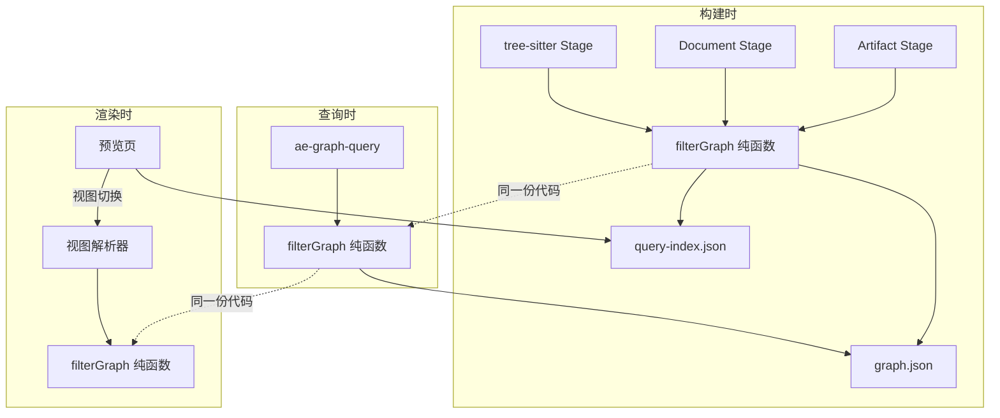

# 知识图谱增强：渲染/查询一致性 + 多语言依赖 + 文档图谱 + 多视图

## AI 解析契约
- canonicalKind: plan
- humanEquivalent: true
- stableIdsRequired: true
- implementationUnitsRequired: true
- noImplicitScope: true

## 来源与目标

来源：头脑风暴汇总（渲染/查询一致性、多语言工具驱动依赖、文档引用图谱、多图谱切换四方向）。

目标：增强知识图谱系统，使其支持：(1) 渲染逻辑与查询逻辑一致性保证；(2) 多语言代码关系和工具驱动依赖树分析（Maven/Gradle/npm/go mod/pip/cargo）；(3) 非代码文档的文件引用图谱；(4) 多视图切换（代码视图/文档视图/完整视图）。

非目标：不重写现有图谱系统；不引入需要在线服务的硬依赖（离线 HTML 预览页仍作为 fallback）；不做类级 JAR 依赖粒度（只做 JAR/制品级）；不做跨语言 API 合约桥接（后续迭代）。

## 范围

### 包含
- 共享过滤纯函数 `filterGraph`，构建端和查询端统一入口
- GraphEdge schema 扩展：`layer`、`source`、`confidence`、`completeness` 字段
- GraphRelationType 扩展：`dependency`、`image_reference` 等新关系类型
- 文档引用解析增强：图片引用 ``、HTML comment include
- 多视图切换：单 graph.json + layer 标签 + 预览页视图选择 UI
- DependencyResolver 统一接口 + Maven/npm/Go 解析器实现
- ToolchainProfile 构建时环境探测
- BuildStage 抽象：tree-sitter Stage + Document Stage + Artifact Stage
- 预览页改造：视图选择 + 共享 filterGraph 查表渲染
- `depth` 参数扩展：`shallow`（仅 tree-sitter + 文档）→ `medium`（+ 工具驱动依赖）

### 不包含
- 跨语言 API 合约桥接（api-contract 节点、protobuf 解析）
- 类级 JAR 依赖粒度
- 视图持久化到工作区产物（`ae/graphs/views/*.json`），P4 仅做 localStorage
- HTTP 服务模式（可选增强层，不在本计划范围）
- SCIP 协议兼容
- Bazel query 接入

### 约束
- 离线 HTML 预览页必须仍可独立工作，不硬依赖后端服务
- `depth=shallow` 行为不变，工具驱动解析仅在 `depth=medium` 时激活
- 工具缺失时必须降级而非失败，降级路径需标注 confidence
- 构建时间：shallow 构建保持秒级，medium 构建允许分钟级但需可中断
- 现有 `ae-graph-query` 8 种模式的行为不变，新增参数为可选

## 需求追溯

| 需求 ID | 描述 | 计划响应 |
|---------|------|----------|
| R1 | 渲染逻辑和查询逻辑一致性 | U1, U2 |
| R2 | 支持多语言代码关系 | U4, U5 |
| R3 | JAR 依赖使用 Maven 工具操作 | U4, U5 |
| R4 | 非代码文档有清晰的文件引用图谱 | U3 |
| R5 | 支持多图谱/多视图切换 | U2, U6 |
| R6 | 工具缺失时降级而非失败 | U5 |
| R7 | 构建时间 shallow 保持秒级 | U1, U5 |

## 高层技术设计

### 架构概览



### 关键决策

- D1. 单 graph.json + layer 标签，多视图是呈现层过滤 → 理由: 与 Nx ProjectGraph 模式一致，避免节点重复和跨图谱 join 复杂度
- D2. 共享 `filterGraph` 纯函数保证一致性 → 理由: 一致性从"两个实现对齐"降级为"一个实现的幂等性"，可测试可验证
- D3. BuildStage 抽象支持并行和独立失败 → 理由: tree-sitter/文档/制品解析可并行，Maven 失败不影响代码图谱
- D4. `depth=shallow` 不变，`depth=medium` 启用工具驱动 → 理由: 零破坏性，shallow 秒级体验不变
- D5. 文档引用归入 `layer: document`，独立于 `layer: code` → 理由: 语义不等价（编译依赖 vs 引用关系），查询时需显式声明粒度
- D6. 工具驱动依赖只做制品级（JAR/module/package），不做类级 → 理由: 类级节点数可达 100K+，递归爆炸风险

### 数据模型扩展

```typescript
// GraphEdge 扩展字段
interface GraphEdge {
  // ... 现有字段
  layer: 'code' | 'document' | 'artifact' | 'inferred'
  source: 'tree-sitter' | 'regex' | 'maven-cli' | 'npm-ls' | 'go-mod' | 'pipdeptree' | 'cargo-tree' | 'user-override'
  confidence: 'high' | 'medium' | 'low'
  completeness?: 'full' | 'partial' | 'incomplete'
}

// GraphNode 扩展（制品节点）
interface GraphArtifactNode {
  kind: 'external-package'
  ecosystem: 'maven' | 'npm' | 'gomod' | 'pip' | 'cargo'
  groupId?: string
  artifactId?: string
  version?: string
  scope?: string
}

// 视图定义
interface GraphView {
  id: string
  label: string
  layers: Array<'code' | 'document' | 'artifact'>
  relationTypes?: string[]
  description?: string
}
```

### DependencyResolver 统一接口

```typescript
interface DependencyResolver {
  ecosystem: string
  detect(worktree: string): boolean
  resolve(worktree: string, timeout: number): Effect<DependencyTree, ResolverError>
}

interface DependencyTree {
  ecosystem: string
  root: DependencyNode
  parser: 'tool-cli' | 'regex-fallback'
}

interface DependencyNode {
  name: string
  version?: string
  scope?: string
  children: DependencyNode[]
}
```

### BuildStage 抽象

```typescript
interface BuildStage {
  name: string
  layer: 'code' | 'document' | 'artifact'
  requiredTools: ToolDescriptor[]
  extract(worktree: string, env: ToolchainProfile): Effect<StageResult, StageError>
  confidence: 'deterministic' | 'heuristic'
}

interface ToolDescriptor {
  tool: string
  command: string
  detectFiles: string[]
}
```

## 实现单元

### U1. filterGraph 纯函数抽取与共享
- [ ] 目标: 将构建端和查询端的散布过滤逻辑统一为单一纯函数，保证渲染/查询一致性
- [ ] 覆盖需求: R1, R7
- [ ] 所属模块: services/graph
- [ ] 唯一产出物: `src/services/graph/graph-filter.ts` 纯函数，构建端和查询端均调用此函数
- [ ] 依赖: 无
- [ ] 文件:
  - `src/services/graph/graph-filter.ts`（新增）
  - `src/services/graph-parse-service.ts`（移除散点过滤，改用 filterGraph）
  - `src/services/graph-query-service.ts`（移除散布过滤逻辑，改用 filterGraph）
- [ ] 方法:
  - 定义 `GraphFilterOptions` 接口（scopeRoot/directory/relationTypes/fileTypes/layers/excludePaths/includeSymbolNodes）
  - 定义 `filterGraph(files, relations, options): FilteredGraph` 纯函数
  - 从 `graph-query-service.ts` 提取 `isFileLevelRelation`、`filterRelationsByDirectory` 等逻辑
  - 从 `graph-parse-service.ts` 提取 `shouldExclude` 逻辑
  - 构建端在 parseFileRelations 后调用 filterGraph 替代散点过滤
  - 查询端在 executeGraphQuery 中调用 filterGraph 替代散布过滤
- [ ] 需遵循的模式:
  - 纯函数无副作用，输入相同输出相同
  - 放在 `services/graph/` 而非 `utils/`，因为依赖 schema 类型
- [ ] 测试场景:
  - 正常路径: 各种过滤组合返回预期子集
  - 边界情况: 空 files/relations、空 options、全部过滤掉
  - 错误路径: 无效 relationType/fileType 静默忽略
  - 集成场景: 构建端和查询端对同一数据调用 filterGraph 结果一致
- [ ] 验证:
  - `npx vitest run src/services/graph/graph-filter.test.ts`
  - `npm run typecheck`

### U2. Schema 扩展 + 多视图支持
- [ ] 目标: 扩展 GraphEdge schema 支持 layer/source/confidence；实现视图定义和视图解析器
- [ ] 覆盖需求: R1, R5
- [ ] 所属模块: schemas + services/graph
- [ ] 唯一产出物: 扩展后的 graph-schema.ts + 视图解析器 + 预览页视图选择 UI
- [ ] 依赖: U1
- [ ] 文件:
  - `src/services/graph/graph-schema.ts`（扩展 GraphEdge、GraphNode、GraphView 类型）
  - `src/services/graph/graph-view-resolver.ts`（新增）
  - `src/assets/skills/ae-graph-build/references/index.html`（视图选择 UI）
  - `src/assets/skills/ae-graph-build/references/assets/index-Bgy1gCZm.js`（视图切换逻辑）
- [ ] 方法:
  - GraphEdge 新增 `layer`（必填，默认 `'code'`）、`source`（必填，默认 `'tree-sitter'`）、`confidence`（必填，默认 `'high'`）、`completeness`（可选）
  - GraphNodeKind 新增 `'external-package'`
  - GraphRelationType 新增 `'dependency'`、`image_reference`
  - 定义内置视图：`code`（layers: ['code']）、`document`（layers: ['document']）、`full`（layers: ['code', 'document', 'artifact']）、`artifact`（layers: ['artifact']）
  - 视图解析器：`resolveView(graph, viewId): FilteredGraph`，内部调用 filterGraph
  - 预览页增加视图选择下拉，切换时调用视图解析器重新渲染
- [ ] 需遵循的模式:
  - layer 字段向后兼容：现有关系默认 `layer: 'code'`
  - 视图是逻辑过滤，不修改 graph.json 数据
- [ ] 测试场景:
  - 正常路径: 各内置视图返回预期子图
  - 边界情况: 空图谱、无对应 layer 关系
  - 错误路径: 未知 viewId 降级为 full 视图
  - 集成场景: 视图解析器结果与 filterGraph 直接调用结果一致
- [ ] 验证:
  - `npx vitest run src/services/graph/graph-view-resolver.test.ts`
  - `npm run typecheck`
  - 手动验证预览页视图切换

### U3. 文档引用解析增强
- [ ] 目标: 扩展 Markdown 解析支持图片引用和 include 指令，文档关系归入 layer: document
- [ ] 覆盖需求: R4
- [ ] 所属模块: services/graph
- [ ] 唯一产出物: 增强后的 pushMarkdownLinkReferences，新增图片引用和 include 解析
- [ ] 依赖: U2（layer 字段）
- [ ] 文件:
  - `src/services/graph-parse-service.ts`（扩展 pushMarkdownLinkReferences）
  - `src/services/graph/graph-schema.ts`（新增 image_reference 关系类型）
- [ ] 方法:
  - 在 `pushMarkdownLinkReferences` 中新增 `!\[alt\](url)` 正则匹配（~3 行），关系类型复用 `link` 或使用 `image_reference`
  - 新增 HTML comment include 正则 `<!--\s*include\s+(.+?)\s*-->`（~5 行）
  - 所有文档关系标记 `layer: 'document'`、`source: 'regex'`、`confidence: 'medium'`
  - broken link 检测：目标文件不存在时标记 `completeness: 'incomplete'`，仍写入图谱但 health 查询可检测
- [ ] 需遵循的模式:
  - 复用现有正则方案，不引入 tree-sitter markdown grammar（ROI 太低）
  - 图片不入图谱节点，只记录关系指向 external_reference
- [ ] 测试场景:
  - 正常路径: Markdown 文件中的链接、图片、include 被正确提取
  - 边界情况: 空 Markdown、无链接、相对路径、锚点链接
  - 错误路径: 格式错误的链接静默跳过
  - 集成场景: 构建后文档关系在 graph.json 中 layer 为 document
- [ ] 验证:
  - `npx vitest run src/services/graph-parse-service.test.ts`
  - 手动验证含图片和 include 的 Markdown 项目

### U4. DependencyResolver 统一接口 + ToolchainProfile
- [ ] 目标: 定义依赖解析器统一接口和构建时环境探测机制
- [ ] 覆盖需求: R2, R6
- [ ] 所属模块: services/graph
- [ ] 唯一产出物: DependencyResolver 接口 + ToolchainProfile 探测 + BuildStage 抽象
- [ ] 依赖: U2
- [ ] 文件:
  - `src/services/graph/dependency-resolver.ts`（新增，统一接口）
  - `src/services/graph/toolchain-profile.ts`（新增，环境探测）
  - `src/services/graph/build-stage.ts`（新增，Stage 抽象）
  - `src/services/graph/graph-schema.ts`（ToolDescriptor 等类型）
- [ ] 方法:
  - 定义 `DependencyResolver` 接口（ecosystem/detect/resolve）
  - 定义 `ToolchainProfile` 数据结构：`Map<ecosystem, { available: boolean, version?: string, command: string }>`
  - `detectToolchain(worktree): Effect<ToolchainProfile>` 一次性探测所有工具链可用性
  - 探测逻辑：检查锁文件/manifest 存在性（pom.xml/package-lock.json/go.mod/requirements.txt/Cargo.toml）→ 检查命令可用性（`mvn --version`/`npm --version`/`go version`/`pip --version`/`cargo --version`）
  - 定义 `BuildStage` 接口（name/layer/requiredTools/extract/confidence）
  - 定义内置 Stage：TreeSitterStage、DocumentStage、ArtifactStage
  - ToolchainProfile 结果注入到各 Stage，Stage 根据 requiredTools 决定是否激活
- [ ] 需遵循的模式:
  - 探测只做一次，结果缓存到 ToolchainProfile
  - Stage 失败不影响其他 Stage（失败隔离）
  - ae.jsonc 可声明项目语言列表，避免无意义探测
- [ ] 测试场景:
  - 正常路径: 各工具链探测返回正确可用性
  - 边界情况: 无任何工具链、部分可用
  - 错误路径: 探测命令超时或异常，标记为不可用
  - 集成场景: ToolchainProfile 注入 Stage 后，不可用 Stage 被跳过
- [ ] 验证:
  - `npx vitest run src/services/graph/dependency-resolver.test.ts`
  - `npx vitest run src/services/graph/toolchain-profile.test.ts`
  - `npm run typecheck`

### U5. Maven/npm/Go 解析器实现
- [ ] 目标: 实现 Maven、npm、Go 三个优先级最高的依赖解析器，集成到 Artifact Stage
- [ ] 覆盖需求: R2, R3, R6, R7
- [ ] 所属模块: services/graph
- [ ] 唯一产出物: maven-resolver + npm-resolver + go-resolver，集成到 ae-graph-build
- [ ] 依赖: U4
- [ ] 文件:
  - `src/services/graph/maven-resolver.ts`（新增）
  - `src/services/graph/npm-resolver.ts`（新增）
  - `src/services/graph/go-resolver.ts`（新增）
  - `src/services/graph/dependency-resolver.ts`（注册解析器）
  - `src/tools/ae-graph-build.tool.ts`（depth 参数扩展 + Artifact Stage 集成）
  - `src/services/graph-parse-service.ts`（构建流程增加 Artifact Stage 调用）
- [ ] 方法:
  - **maven-resolver**: detect 检查 `pom.xml` 存在 + `mvn` 命令可用；resolve 调用 `mvn dependency:tree -DoutputType=text`，解析树形缩进输出，构建 DependencyTree；超时 60s；降级：Maven 不可用时用正则解析 pom.xml `<dependencies>` 段（confidence: low）
  - **npm-resolver**: detect 检查 `package-lock.json`/`package.json` + `npm` 可用；resolve 调用 `npm ls --json --all`，解析 JSON 树；超时 30s；降级：npm 不可用时解析 package.json `dependencies`/`devDependencies` 字段
  - **go-resolver**: detect 检查 `go.mod` + `go` 可用；resolve 调用 `go mod graph`，解析 `from to` 格式，结合 `go.mod` require 段构建父子树；超时 30s；降级：go 不可用时正则解析 go.mod require 行
  - 所有解析器产出统一转为 `GraphNode[] + GraphRelation[]`，节点 kind 为 `external-package`，关系 type 为 `dependency`，layer 为 `artifact`
  - `ae-graph-build.tool.ts` 的 `depth` 参数新增 `'medium'` 值，medium 时激活 Artifact Stage
  - 解析结果缓存到 `ae/graphs/dep-cache-{ecosystem}.json`，下次构建时检查 manifest 文件指纹决定是否复用
- [ ] 需遵循的模式:
  - 每个解析器先尝试工具命令，失败时降级为正则，降级结果标注 `source: 'regex-fallback'`、`confidence: 'low'`
  - 工具命令统一加超时，超时后降级
  - 传递深度硬限 1 层（Maven 直接依赖），传递依赖标注 `completeness: 'partial'`
- [ ] 测试场景:
  - 正常路径: 各解析器正确解析依赖树输出
  - 边界情况: 空依赖、单依赖、循环依赖（Maven omitted for conflict）
  - 错误路径: 工具不可用降级为正则；工具超时降级；工具输出格式异常降级
  - 集成场景: ae-graph-build depth=medium 产出含 artifact 层关系的图谱
- [ ] 验证:
  - `npx vitest run src/services/graph/maven-resolver.test.ts`
  - `npx vitest run src/services/graph/npm-resolver.test.ts`
  - `npx vitest run src/services/graph/go-resolver.test.ts`
  - 在含 pom.xml 的项目上运行 `ae-graph-build depth=medium` 验证 JAR 依赖出现

### U6. 预览页改造 + query-index 预计算
- [ ] 目标: 预览页改为视图选择 + filterGraph 查表渲染，构建时生成 query-index.json 加速前端
- [ ] 覆盖需求: R1, R5
- [ ] 所属模块: skills/ae-graph-build
- [ ] 唯一产出物: 改造后的预览页 HTML/JS + query-index.json 构建产物
- [ ] 依赖: U1, U2
- [ ] 文件:
  - `src/assets/skills/ae-graph-build/references/index.html`
  - `src/assets/skills/ae-graph-build/references/assets/index-Bgy1gCZm.js`
  - `src/services/graph-parse-service.ts`（构建末尾增加 query-index 生成）
  - `src/services/graph/graph-query-index.ts`（新增，预计算逻辑）
- [ ] 方法:
  - 构建时在写 graph.json 后，调用 `generateQueryIndex(graph): QueryIndex` 生成预计算摘要（按 relationType 分组的边列表、按 directory 分组的节点列表、各视图的节点/边统计）
  - query-index.json 嵌入预览页 `<script>` 中（与当前 graph.json 嵌入方式一致）
  - 预览页 JS 重构：移除内嵌过滤逻辑，改为调用共享的 `filterGraph` JS 版本（从 TypeScript 编译或手写对齐版本）
  - 视图选择 UI：顶部下拉（代码/文档/完整/制品），切换时调用 `resolveView(graphData, viewId)` 重新渲染
  - 节点点击交互：点击节点显示其 layer 和 source 信息
  - 低 confidence 关系用虚线渲染，broken link 用红色虚线
- [ ] 需遵循的模式:
  - 预览页是 query 系统的薄渲染层，不持有独立过滤逻辑
  - query-index.json 是预计算缓存，不是新数据源
- [ ] 测试场景:
  - 正常路径: 视图切换正确渲染对应子图
  - 边界情况: 空图谱、单视图
  - 错误路径: query-index.json 缺失时降级为全量渲染
  - 集成场景: 预览页过滤结果与 ae-graph-query filter 结果一致
- [ ] 验证:
  - 手动验证预览页视图切换和交互
  - 对比预览页显示的节点数与 ae-graph-query filter 返回的节点数

### U7. pip/cargo 解析器 + Gradle 解析器
- [ ] 目标: 实现 Python pip、Rust cargo、Java Gradle 依赖解析器，完成多语言覆盖
- [ ] 覆盖需求: R2
- [ ] 所属模块: services/graph
- [ ] 唯一产出物: pip-resolver + cargo-resolver + gradle-resolver
- [ ] 依赖: U4, U5
- [ ] 文件:
  - `src/services/graph/pip-resolver.ts`（新增）
  - `src/services/graph/cargo-resolver.ts`（新增）
  - `src/services/graph/gradle-resolver.ts`（新增）
  - `src/services/graph/dependency-resolver.ts`（注册新解析器）
- [ ] 方法:
  - **pip-resolver**: detect 检查 `requirements.txt`/`pyproject.toml` + `pipdeptree` 可用；resolve 调用 `pipdeptree --json-tree`，解析 JSON 树；降级解析 requirements.txt
  - **cargo-resolver**: detect 检查 `Cargo.toml` + `cargo` 可用；resolve 调用 `cargo tree`，解析树形文本；降级解析 Cargo.toml `[dependencies]` 段
  - **gradle-resolver**: detect 检查 `build.gradle`/`build.gradle.kts` + `gradle` 可用；resolve 调用 `gradle dependencies --configuration compileClasspath`，解析树形文本；降级解析 build.gradle dependencies 块
- [ ] 需遵循的模式:
  - 与 U5 解析器模式一致：detect → resolve（tool-cli）→ fallback（regex）→ 统一 DependencyTree
- [ ] 测试场景:
  - 正常路径: 各解析器正确解析输出
  - 边界情况: 虚拟环境未激活（pip）、workspace 项目（cargo）
  - 错误路径: 工具不可用降级
  - 集成场景: 各解析器注册后 ToolchainProfile 正确探测
- [ ] 验证:
  - `npx vitest run src/services/graph/pip-resolver.test.ts`
  - `npx vitest run src/services/graph/cargo-resolver.test.ts`
  - `npx vitest run src/services/graph/gradle-resolver.test.ts`

## 风险与应对

| 风险 | 影响 | 应对措施 |
|------|------|----------|
| Maven 依赖解析需要网络和私服认证 | 构建失败阻断图谱生成 | detect 阶段检查 mvn 可用性；resolve 加 60s 超时；失败降级为正则解析 pom.xml，标注 confidence: low |
| 多模块 Maven 项目 dependency:tree 耗时 3-5 分钟 | 用户等待体验差 | depth=medium 才启用；缓存 dep-cache-maven.json；manifest 指纹不变时复用缓存 |
| scope 语义标识与现有目录路径 scope 冲突 | 查询时 scopeRoot 语义混乱 | GraphVersionRecord 新增 `scopeType: 'path' \| 'semantic'` 区分；现有 scope 默认 `path` |
| 预览页嵌入 query-index.json 增大 HTML 体积 | 加载变慢 | query-index 只含摘要（按视图预计算的节点/边 ID 列表），不含完整关系数据；大图谱时分片懒加载 |
| tree-sitter Markdown grammar 未集成 | 复杂 Markdown 语法（嵌套代码块、footnote）解析不完整 | 现有正则方案覆盖 90% 场景；剩余 10% 标注 completeness: partial |
| 工具驱动构建结果不可复现 | 团队成员图谱内容不同 | graph.json metadata 记录 ToolchainProfile 快照；query 结果标注 relation 的 source 和 confidence |

## 待定问题

### 执行前需解决
- Q1. filterGraph JS 版本如何与 TypeScript 版本保持同步？手写对齐 vs 编译提取 vs 共享 JSON schema 驱动？

### 推迟到执行
- Q2. pipdeptree 需要虚拟环境激活，如何检测当前是否在虚拟环境中？
- Q3. Gradle 构建可能触发全量编译，`gradle dependencies` 是否需要 `--no-build` 等参数？
- Q4. 预览页大图谱（>5000 节点）的 Cytoscape.js 渲染性能是否需要 WebWorker？

## 一致性检查
- implementationUnitsCount: 7
- tracedRequirementsCount: 7
- decisionsCount: 6
- risksCount: 6
