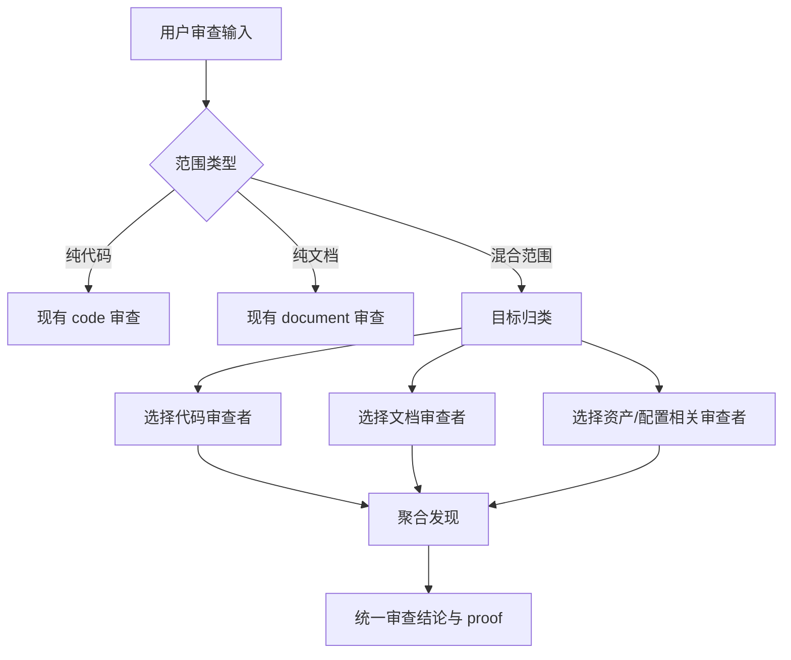

# 通用核心流程与多类型审查优化计划

## AI 解析契约
- canonicalKind: plan
- humanEquivalent: true
- stableIdsRequired: true
- implementationUnitsRequired: true
- noImplicitScope: true

## 来源与目标
来源：本次用户请求与现有 `ae:review` 技能、审查契约、审查选择器和审查子代理资产。

目标：优化现有 AE 通用核心流程，使其继续覆盖任意软件和非软件任务，并让 `ae:review` 能在一次审查中处理多种类型文件，而不是只能按单一代码域或文档域运行。

非目标：不新增新的流程技能；不改变 `ae:work` 的实施代理编排；不把多阶段交付门禁施加给通用审查入口。

## 范围

### 包含
- 明确通用核心流程仍以 `ae:*` 为唯一命名空间，覆盖非软件任务、软件完整任务和软件单阶段任务。
- 更新 `ae:review` 的输入语义，使其支持混合范围，例如同一次审查包含代码、计划、需求、配置、命令、技能提示词和测试用例。
- 扩展审查选择逻辑，使多类型审查能够合并代码域、文档域和配置/资产类审查者。
- 新增按审查场景和产出物类型工作的通用专一子代理（需求、设计、原型、追溯、证据等），单独提供任意上游产出物时也能复用。
- 更新相关技能说明、catalog 描述、审查契约工具和测试。

### 不包含
- 不实现新的流程技能或阶段编排技能。
- 不创建新的审查域代理体系；但新增产出物类型必须有专一审查子代理或明确映射到现有专一子代理。
- 不改变 `ae:review` 现有 `domain=code`、`domain=document` 的兼容行为。

### 约束
- 面向插件用户的文案不得把本仓库目录结构写成普通项目必须具备的前提。
- 审查工具错误必须返回可恢复中文提示，不抛出未捕获异常。
- 新增或调整命令场景时必须同步 `src/services/asset-model-routing-catalog.ts`。

## 需求追溯
| 需求 ID | 计划响应 |
|---------|----------|
| R1 | U1, U2 |
| R2 | U1, U3 |
| R3 | U3, U4, U5 |
| R4 | U4, U6 |
| R5 | U7 |

## 高层技术设计
通用核心流程保持"松耦合技能集合"，不新增 flow 技能。`ae:review` 增加混合审查能力，通过目标归类和子审查队伍合并实现。

### 关键决策
- D1. 保留 `ae:review domain=code|document`，新增混合审查入口而非替换旧入口 → 理由: 保持现有命令和用户习惯兼容。
- D2. `ae:review` 必须先自动识别审查场景和产出物类型，再由专一子代理执行 → 理由: 用户只给出代码、需求、设计、原型或测试用例时，审查入口也应能自动分配合适审查者。
- D3. `ae:review` 的 general 模式只聚合真实文件类型和用户显式范围，不自动盲扫历史产物 → 理由: 与通用审查边界和证据优先规则一致。

## 专项设计

### 接口设计
`ae-review-contract` 工具需要支持自动场景识别和混合输入。推荐最小改造路径：

- 保留现有 `kind` 枚举，新增 `kind=general` 作为混合或通用审查入口。
- 增加自动推断的 `reviewScenes` 和 `targetTypes` 归类结果，用于描述本次范围包含的审查场景和产出物类型。
- 当 `kind=general` 或输入范围无法归入单一域时，先根据路径、文件内容、frontmatter、标题、ID 形态和用户目标自动识别场景，再分别选择专一审查子代理，返回合并后的审查团队、目标覆盖矩阵和模式边界。

### 数据模型
- `ReviewSelectionInput.kind` 从 `'code' | 'document'` 扩展为 `'code' | 'document' | 'general'`。
- 新增 `reviewScenes: ('code' | 'requirements' | 'design' | 'prototype' | 'test-case' | 'plan' | 'config' | 'asset' | 'general-document')[]`，由自动识别阶段生成，可被用户显式覆盖。
- 新增 `targetTypes: ('code' | 'requirements' | 'design' | 'prototype' | 'test-case' | 'plan' | 'config' | 'asset' | 'document')[]`，由范围归类阶段生成，可被用户显式覆盖。
- `MatrixEntry` 增加可选 `reviewScenes` 和 `targetTypes` 激活条件；聚合层按场景和目标类型调用选择器、去重并回传 coverage。
- `domain` 仅表示审查对象域，`mode` 仅表示执行模式（interactive/headless/report-only/autofix），不得用 `mode` 表示审查场景。

## 实现单元

### U1. 明确通用审查入口边界
- [ ] 目标: 更新 `ae:review` 公开说明，明确它是通用审查入口，能覆盖代码、需求、设计、原型、计划、配置、资产和测试用例等不同审查场景。
- [ ] 覆盖需求: R1, R2
- [ ] 唯一产出物: 通用审查入口边界文案更新。
- [ ] 依赖: 无。
- [ ] 文件:
  - `src/assets/skills/ae-review/SKILL.md`
  - `src/services/ae-catalog.ts`
- [ ] 方法:
  - 将 `ae:review` 描述为默认通用审查入口，而不是只支持代码或普通文档。
  - 明确用户只提供某一类产出物时也能直接审查，例如已有需求文档、设计文档、原型说明或测试用例。
- [ ] 需遵循的模式:
  - 面向插件用户的流程文案不得泄漏本仓库维护前提。
- [ ] 测试场景:
  - 正常路径: 用户审查已有需求、设计、原型、计划或测试用例时能进入对应场景。
  - 边界情况: 用户只要求审查一个计划文件时不要求提供额外上下游产物。
  - 错误路径: 文档不得要求所有普通项目存在固定产物目录。
  - 集成场景: `ae:help` 后续描述能引用一致边界。
- [ ] 验证:
  - 人工阅读 `ae:review` 技能说明和 catalog 描述，确认通用审查入口语义一致。

### U2. 更新 `ae:review` 技能说明为多类型审查
- [ ] 目标: 让 `ae:review` 说明支持单域审查和混合范围审查。
- [ ] 覆盖需求: R1, R2
- [ ] 唯一产出物: `ae:review` 技能文案更新。
- [ ] 依赖: U1。
- [ ] 文件:
  - `src/assets/skills/ae-review/SKILL.md`
- [ ] 方法:
  - 说明 `ae:review` 默认自动识别审查场景；`domain=general`、`scenes`/`reviewScenes`、`targets`/`targetTypes` 只作为显式覆盖或调试入口。
  - 说明混合审查可同时覆盖代码、需求、设计、原型、计划、配置、技能、命令和测试用例。
  - 说明所有审查任务都必须由专一子代理执行，编排层只负责归类、调度和聚合。
  - 保留只读审查默认不改文件的边界。
- [ ] 需遵循的模式:
  - 技能正文必须包含角色、适用场景、流程、输入处理、输出要求和安全边界。
- [ ] 测试场景:
  - 正常路径: 用户给多个路径时能进入混合审查。
  - 边界情况: 只给代码 diff 时仍走代码审查。
  - 错误路径: 缺少路径时提示用户提供范围。
  - 集成场景: `/ae-review` 命令参数提示与技能说明一致。
- [ ] 验证:
  - 结构校验 frontmatter。

### U3. 扩展审查契约和选择器输入
- [ ] 目标: 让审查契约能表达混合范围和多类型文件。
- [ ] 覆盖需求: R2, R3
- [ ] 唯一产出物: 审查契约工具和选择器支持 mixed/general 输入。
- [ ] 依赖: U2。
- [ ] 文件:
  - `src/tools/ae-review-contract.tool.ts`
  - `src/services/review-selector.ts`
  - `src/services/review-catalog.ts`
  - `tests/tools/ae-review-contract.tool.test.ts`
  - `tests/services/review-selector.test.ts`
- [ ] 方法:
  - 在工具 schema 中增加 `kind=general`、`reviewScenes` 和 `targetTypes`，其中 `reviewScenes`、`targetTypes` 可由自动识别阶段生成，也可由用户显式覆盖。
  - 混合范围下按每个 review scene 和 target type 选择专一审查者，条件审查者按信号触发，最终合并为一个审查团队。
  - 新增或注册通用专一审查子代理：`requirements-reviewer` 审查需求完整性和可验证性，`prototype-reviewer` 审查原型交互与可用性，`traceability-reviewer` 审查跨产物 ID 和目标闭环，`evidence-reviewer` 审查验证证据真实性。
  - 继续复用已有专一审查子代理：`test-case-reviewer` 审查测试用例，`design-lens-reviewer` 审查设计决策，`standards-reviewer`、`agent-native-reviewer`、`security-reviewer`、`api-contract-reviewer` 审查配置、技能、命令和工具定义。
- [ ] 需遵循的模式:
  - Zod 字段必须有中文 `.describe()`。
  - 工具层捕获错误并返回中文可恢复提示。
- [ ] 测试场景:
  - 正常路径: 只提供需求文档、设计文档、原型说明或测试用例时，自动识别场景并返回对应专一审查者。
  - 边界情况: 只有 document 类型时结果不重复。
  - 错误路径: 非法类型返回友好提示。
  - 集成场景: has_tooling + has_agent_config 能触发代理原生审查。
- [ ] 验证:
  - `npx vitest run tests/tools/ae-review-contract.tool.test.ts tests/services/review-selector.test.ts`

### U4. 更新审查编排逻辑的聚合语义
- [ ] 目标: 混合审查时按类型分派并统一聚合发现。
- [ ] 覆盖需求: R3, R4
- [ ] 唯一产出物: `ae:review` 编排说明和聚合规则更新。
- [ ] 依赖: U3。
- [ ] 文件:
  - `src/assets/skills/ae-review/SKILL.md`
  - `src/services/review-catalog.ts`
  - `src/tools/ae-review-contract.tool.ts`
- [ ] 方法:
  - 在技能流程中先做目标归类，再调用审查契约工具生成审查团队。
  - 调度阶段不得让一个通用代理包办所有类型；每个识别出的 review scene 至少有一个专一子代理被调度或明确记录跳过原因。
  - 聚合时按 finding 标题和证据去重，同标题保留最高严重级别。
  - 审查结论必须声明每种目标类型是否被覆盖。
- [ ] 需遵循的模式:
  - 不把普通 task 正文当 proof 真源；proof 仍由 `ae-review-proof` 写入。
- [ ] 测试场景:
  - 正常路径: 混合文件审查输出按类型分组。
  - 边界情况: 某类型没有发现时仍声明已覆盖。
  - 错误路径: 某个子审查失败时整体为 partial/failed。
  - 集成场景: 聚合结果可写入 review proof metadata。
- [ ] 验证:
  - `npx vitest run tests/tools/ae-review-contract.tool.test.ts`

### U5. 更新 catalog、帮助和命令参数提示
- [ ] 目标: 用户能发现 `ae:review` 的多类型审查能力。
- [ ] 覆盖需求: R3
- [ ] 唯一产出物: catalog/help 中的 `ae:review` 描述更新。
- [ ] 依赖: U2, U3。
- [ ] 文件:
  - `src/services/ae-catalog.ts`
  - `src/schemas/ae-asset-schema.ts`
  - `tests/tools/ae-help.tool.test.ts`
- [ ] 方法:
  - 更新 `argumentHint`，强调默认自动识别；补充 `domain=general`、`scenes=requirements,design,test-case` 和 `targets=requirements,design,test-case` 作为显式覆盖示例，并兼容 `reviewScenes`/`targetTypes` 别名。
  - 保持 `ae:document-review` 的兼容模板继续转发到 `ae:review domain=document`。
- [ ] 需遵循的模式:
  - 技能列举顺序保持同文件既有主流程分组。
- [ ] 测试场景:
  - 正常路径: `ae-help ae:review` 展示混合审查能力。
  - 边界情况: `ae-document-review` 仍显示弃用/转发语义。
  - 错误路径: help 查询未知参数不报错。
  - 集成场景: command registration 生成 `/ae-review` 模板。
- [ ] 验证:
  - `npx vitest run tests/tools/ae-help.tool.test.ts`

### U6. 扩展审查证明元数据的来源描述
- [ ] 目标: 多类型审查 proof 能记录覆盖的目标类型和来源摘要。
- [ ] 覆盖需求: R4
- [ ] 唯一产出物: `ae-review-proof` 对 mixed/general 审查输出可审计。
- [ ] 依赖: U4。
- [ ] 文件:
  - `src/tools/ae-review-proof.tool.ts`
  - `tests/tools/ae-review-proof.tool.test.ts`
- [ ] 方法:
  - 不改变 proof 的核心哈希语义，优先在 `source_review_output` 中要求可解析的 target coverage summary。
  - 如需结构字段，新增可选 `targetCoverage`，不得破坏旧 metadata。
- [ ] 需遵循的模式:
  - passed 时不得包含阻断级发现。
- [ ] 测试场景:
  - 正常路径: mixed 输出可写 proof。
  - 边界情况: 旧 code/document 输出仍通过。
  - 错误路径: 缺失 statusSummary 时拒绝写入。
  - 集成场景: metadata hash 与 source output 一致。
- [ ] 验证:
  - `npx vitest run tests/tools/ae-review-proof.tool.test.ts`

### U7. 验证与文档审查
- [ ] 目标: 确认通用流程优化没有破坏现有注册、测试和公开边界。
- [ ] 覆盖需求: R5
- [ ] 唯一产出物: 验证结果与审查记录。
- [ ] 依赖: U1-U6。
- [ ] 文件:
  - `src/assets/skills/ae-review/SKILL.md`
  - `src/tools/ae-review-contract.tool.ts`
  - `src/services/review-selector.ts`
  - `src/services/review-catalog.ts`
- [ ] 方法:
  - 运行相关单测后运行类型检查。
  - 使用 `ae:review mode=autofix` 审查 `ae/plans/2026-06-13-001-general-core-flow-review-multi-type-plan.md`，并确认自动识别为计划/设计类文档审查。
  - 对后续代码实现改动使用 `ae:review mode=autofix` 审查，并确认自动识别代码、配置、资产和测试场景。
- [ ] 需遵循的模式:
  - 不执行 Git 提交、推送、reset、checkout 覆盖文件。
- [ ] 测试场景:
  - 正常路径: 相关单测通过。
  - 边界情况: 只实现本计划时通用审查仍形成独立闭环。
  - 错误路径: typecheck 暴露 schema 不一致时阻断交付。
  - 集成场景: `npm run typecheck` 通过。
- [ ] 验证:
  - `npx vitest run tests/tools/ae-review-contract.tool.test.ts tests/services/review-selector.test.ts tests/tools/ae-review-proof.tool.test.ts tests/tools/ae-help.tool.test.ts`
  - `npm run typecheck`

## 风险与应对
| 风险 | 影响 | 应对措施 |
|------|------|----------|
| 混合审查与现有 code/document 语义冲突 | 旧命令行为回归 | 保留旧参数，新增 general/mixed 入口 |
| 审查者重复触发 | 输出噪声增加 | 聚合层去重并记录 target coverage |
| proof 元数据破坏旧审计 | 历史审查不可复验 | 只新增可选字段或依赖 source output 摘要 |

## 待定问题

### 推迟到执行
- Q1. `asset-reviewer` 是否作为独立文件落地，或由 `standards-reviewer` 与 `agent-native-reviewer` 共同承担资产审查；无论采用哪种方式，识别出的审查场景必须映射到专一子代理。

## 一致性检查
- implementationUnitsCount: 7
- tracedRequirementsCount: 5
- decisionsCount: 3
- risksCount: 3
