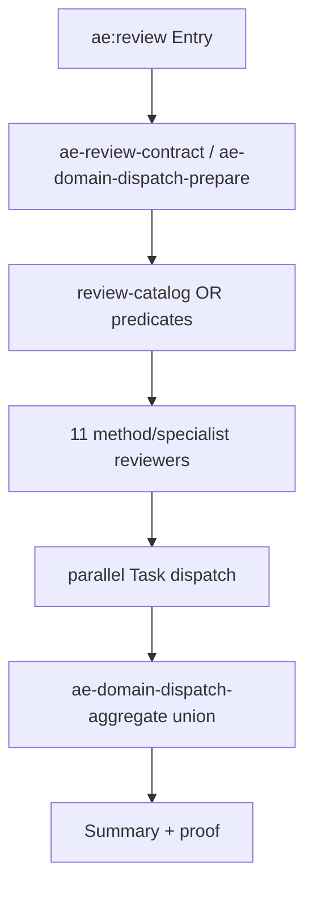

# 重构 ae:review 审查子代理拓扑

## AI 解析契约
- canonicalKind: plan
- humanEquivalent: true
- stableIdsRequired: true
- implementationUnitsRequired: true
- noImplicitScope: true

## 来源与目标
本计划来源于当前会话对 `ae:review` 审查子代理划分的多轮头脑风暴结论和本地代码研究。目标是在不引入新基础设施的前提下，彻底重划分审查子代理职责，并同步更新 `ae:review` 技能及所有注册、选择、调度、帮助、证明和测试链路。

外部行为保持要求：保留现有 `review-catalog` 布尔 OR 谓词模型、`ae-domain-dispatch-prepare` 代码化并行调度、`ae-domain-dispatch-aggregate` 的 `union` 聚合策略和 `specialistCount=0` 时回退 `@review-domain` 的策略。

## 范围

### 包含
- 将审查子代理从当前按角色/风险名称平铺的拓扑，重构为约 11 个方法论轴 specialist。
- 同步更新审查代理 Markdown、`AGENT` 常量、审查选择矩阵、domain catalog、dispatch prompt template、`ae-review-contract` 覆盖表、`ae-review-proof` 白名单、帮助 catalog、别名映射和相关参考文档。
- 同步更新 `ae:review` 技能文档，使其描述新代理划分、选择规则和不变的调度协议。
- 更新或补充相关 Vitest，覆盖新拓扑下的选择、调度准备、契约输出、proof 白名单、别名兼容和资产存在性。

### 不包含
- 不引入加权激活引擎、结构化 Finding schema、新聚合器、观测反馈循环、golden sample CI、自动学习评分或新持久化配置。
- 不改 `ae:review` 的四阶段编排协议、并行 Task 调度要求、`union` 聚合策略或 proof 工具的核心信任模型。
- 不新增独立 `observability`、`ui-quality`、`a11y`、`i18n`、`feature-flag`、`deprecation`、`ci-config` reviewer。
- 不执行代码改动；本计划仅定义后续实施方式。

### 约束
- 面向插件用户的可分发能力只以 `src/` 下定义为真源。
- 代理更新必须遵守 OpenCode 原生 Agent frontmatter 和正文结构要求。
- 删除或合并旧代理时必须同步别名或明确拒绝策略，避免历史命令、proof 来源或用户输入静默失效。
- 所有公开提示、工具描述和技能文档不得把本仓库开发结构写成下游项目通用前提。

## 需求追溯
| 需求 ID | 计划响应 |
|---------|----------|
| R1. 重新划分各种审查子代理 | U1, U2, U3, U4 |
| R2. 同步更新 `ae:review` 技能 | U5 |
| R3. 禁止镀金 | U1, U3, U5, U8 |
| R4. 推荐满足最终目标的彻底重构 | U1, U2, U3, U4 |
| R5. 保留现有调度和聚合基础设施 | U3, U5, U7 |
| R6. 避免注册、选择、帮助、proof、测试链路不同步 | U3, U4, U6, U7 |

## 高层技术设计

### 目标拓扑
采用“审查方法论”为主轴，而不是继续按角色名或风险标签平铺。保留少数具有独立产物或专门知识的契约/资源型代理。

| 新拓扑代理 | 类型 | 吸收或保留职责 | 初始激活语义 |
|------------|------|----------------|--------------|
| `correctness-reviewer` | 方法论 | 代码正确性、边界条件、状态管理、错误传播；吸收 `reliability-reviewer` 中错误处理与容错检查点 | 代码域常驻 |
| `maintainability-reviewer` | 方法论 | 可维护性、架构边界、模式合规、反模式、命名一致性、重复代码；吸收 `architecture-strategist` 与 `pattern-recognition-specialist` | 代码域常驻；文档域在 plan/design 场景条件触发 |
| `adversarial-reviewer` | 方法论 | 对抗式失败模式、安全攻击面、性能失效、可靠性极端场景；吸收独立 `security-reviewer`、`performance-reviewer` 的对抗部分 | `changedLineCount>=200`、`hasSecurity`、`hasPerformance`、`isHighRiskDomain`、`hasApi` 等条件 |
| `coherence-reviewer` | 方法论 | 文档一致性、流程完整性、步骤粒度、历史评论处理；吸收 `step-granularity-reviewer` 与 `previous-comments-reviewer` | 文档域常驻；`hasPrMetadata` 时可用于代码域 |
| `goal-alignment-reviewer` | 方法论 | 目标、验收标准、产品范围、可行性对齐；吸收 `product-lens-reviewer` 与 `feasibility-reviewer` | `hasGoalAlignment`、`hasPlanPath` 或 `hasRequirementPath` |
| `api-contract-reviewer` | 契约专精 | API 路由、请求/响应、序列化、版本兼容 | `hasApi` |
| `data-migrations-reviewer` | 契约专精 | 数据迁移、schema、回填、数据库完整性 | `hasMigrations` 或 `hasDatabase` |
| `standards-reviewer` | 规范专精 | 项目规范、配置、脚本、agent/tool/asset 可操作性；吸收 `agent-native-reviewer` 的非 UI 专项 | 代码域常驻；config/asset 目标覆盖 |
| `supply-chain-reviewer` | 新增专精 | lockfile、依赖新增或版本跳跃、包来源、许可与维护风险 | `hasDependencyChange` 或 `hasLockfileChange` |
| `testing-reviewer` | 资源/质量专精 | 测试覆盖、断言质量、测试用例文档质量；吸收 `test-case-reviewer` 的文档职责 | 代码域常驻；test-case 目标覆盖 |
| `research-reviewer` | 资源专精 | 历史方案、组织经验、外部最佳实践 | 条件触发：`hasDependencyChange`、`hasUnfamiliarProtocol`、`hasResearchNeed` |

### 旧代理归并映射
| 旧代理 | 处理 |
|--------|------|
| `architecture-strategist` | 合并到 `maintainability-reviewer`，旧名 alias 到新名 |
| `pattern-recognition-specialist` | 合并到 `maintainability-reviewer`，旧名 alias 到新名 |
| `reliability-reviewer` | 错误处理并入 `correctness-reviewer`，极端故障模式并入 `adversarial-reviewer`；旧名 alias 到 `correctness-reviewer` |
| `performance-reviewer` | 性能失效场景并入 `adversarial-reviewer`；旧名 alias 到 `adversarial-reviewer` |
| `security-reviewer` | 攻击面与威胁模型并入 `adversarial-reviewer`；旧名 alias 到 `adversarial-reviewer` |
| `previous-comments-reviewer` | 并入 `coherence-reviewer`，旧名 alias 到新名 |
| `step-granularity-reviewer` | 并入 `coherence-reviewer`，旧名 alias 到新名 |
| `product-lens-reviewer` | 并入 `goal-alignment-reviewer`，旧名 alias 到新名 |
| `feasibility-reviewer` | 并入 `goal-alignment-reviewer`，旧名 alias 到新名 |
| `design-lens-reviewer` | 结构部分并入 `maintainability-reviewer`，目标/用户价值部分并入 `goal-alignment-reviewer`；旧名 alias 到 `goal-alignment-reviewer` |
| `agent-native-reviewer` | 并入 `standards-reviewer`，旧名 alias 到新名 |
| `test-case-reviewer` | 并入 `testing-reviewer`，旧名 alias 到新名 |
| `requirements-reviewer` | 需求清晰度和验收标准并入 `goal-alignment-reviewer`，旧名 alias 到新名 |
| `prototype-reviewer` | 原型一致性并入 `goal-alignment-reviewer`，交互结构并入 `maintainability-reviewer`；旧名 alias 到 `goal-alignment-reviewer` |
| `traceability-reviewer` | 并入 `coherence-reviewer`，旧名 alias 到新名 |
| `evidence-reviewer` | 并入 `coherence-reviewer`，旧名 alias 到新名 |

### 关键决策
- D1. 以“审查方法论”为主轴重构 → 理由: 当前重叠来自风险标签与审查方法混用，方法论决定 prompt 结构、证据类型和职责边界。
- D2. 保留现有布尔 OR 谓词、并行调度和 `union` 聚合 → 理由: 用户明确禁止镀金，且当前任务目标是代理划分与技能同步，不是调度基础设施重写。
- D3. 删除独立 `observability` 与 `ui-quality` 新代理 → 理由: 可观测性可作为 correctness/adversarial 检查点，a11y/i18n 频率和专业边界不足以在本轮新增独立代理。
- D4. 新增 `supply-chain-reviewer` → 理由: 依赖与 lockfile 风险是当前拓扑未覆盖的真实盲区，且可用简单布尔谓词触发，不需要新基础设施。
- D5. 旧代理名通过 `agent-alias-map` 兼容到新代理 → 理由: 避免用户历史输入、旧文档和 proof 来源静默断链。
- D6. `traceability-reviewer` 和 `evidence-reviewer` 并入 `coherence-reviewer` → 理由: 本计划必须收敛为确定目标拓扑；混合追溯和证据核验都属于一致性/可核验性方法论，可通过 `coherence-reviewer` 的场景分支承载。

## 实现单元

### U1. 固化新旧代理映射与资产清单
- [ ] 目标: 定义最终 11 个目标代理、旧代理归并规则、别名兼容规则和保留/删除边界。
- [ ] 覆盖需求: R1, R3, R4
- [ ] 所属模块: review assets
- [ ] 唯一产出物: 一份执行期可直接对照的代理映射表，体现在源码常量、资产文件和测试期望中。
- [ ] 行为保持要求: 不改变 `ae:review` 对外参数，不引入新调度或聚合机制。
- [ ] 依赖: 无
- [ ] 文件:
  - `src/schemas/ae-asset-schema.ts`
  - `src/assets/agents/domains/review/specialists/*.md`
  - `src/services/agent-alias-map.ts`
- [ ] 方法:
  - 新增 `SUPPLY_CHAIN_REVIEWER` 常量。
  - 删除或停止注册被合并旧代理常量；若保留常量用于 alias 或兼容测试，确保不再作为 required review specialist 注册。
  - 新增 `supply-chain-reviewer.md`，并按 OpenCode Agent 结构写明 Role、When To Use、Workflow、Output、Boundaries。
  - 重写 `maintainability-reviewer.md`、`adversarial-reviewer.md`、`coherence-reviewer.md`、`goal-alignment-reviewer.md`、`standards-reviewer.md`、`testing-reviewer.md`，吸收对应旧职责。
  - 删除或移出不再注册的旧 specialist 文件，或者保留文件但在 catalog 中不注册；执行期优先选择删除以避免帮助列表误导。
  - 在 `AGENT_ALIAS_MAP` 中将旧代理名映射到新代理名。
- [ ] 需遵循的模式:
  - 更新既有 Agent 前先读取现有文件，保留仍有效的职责、流程、边界和输出要求。
  - 代理 frontmatter 必须包含 `description` 和 `mode`。
  - 代理正文必须包含 Role、When To Use、Workflow、Output、Boundaries。
- [ ] 测试场景:
  - 正常路径: 新增代理常量和文件可被 catalog 构建识别。
  - 边界情况: 旧代理名通过 alias 解析到新代理。
  - 错误路径: 注册清单中不存在已删除旧代理路径。
  - 集成场景: `ae:help` 不再列出被删除旧 specialist 为 required 代理。
- [ ] 验证:
  - `npx vitest run tests/services/agent-alias-map.test.ts`
  - `npm run typecheck`
- [ ] 回滚信号: 帮助 catalog 或 domain catalog 中仍出现已删除旧代理，或 alias 测试失败。

### U2. 重写审查选择矩阵与 selector 输入
- [ ] 目标: 将 `REVIEW_MATRIX` 从旧 26 代理收敛为新拓扑，并保留现有 OR 谓词语义。
- [ ] 覆盖需求: R1, R4, R5
- [ ] 所属模块: review selection
- [ ] 唯一产出物: 新拓扑下 `selectReviewers()` 对 code/document/general 场景返回预期代理且无重复。
- [ ] 行为保持要求: `selectReviewers()` 仍通过 `conditionGroups.some(group.every())` 执行布尔 OR，不引入评分、排序或串行阶段。
- [ ] 依赖: U1
- [ ] 文件:
  - `src/services/review-catalog.ts`
  - `src/services/review-selector.ts`
- [ ] 方法:
  - 更新 `REVIEW_MATRIX` 为新 11 代理清单。
  - 将 `research-reviewer` 从代码域常驻改为条件触发。
  - 将 `adversarial-reviewer` 阈值从 `changedLineCountGte50` 调整为 `changedLineCountGte200`，并保留安全、性能、API、高风险等条件。
  - 新增 `hasDependencyChange`、`hasLockfileChange`、`hasPlanPath`、`hasRequirementPath`、`hasUnfamiliarProtocol`、`hasResearchNeed` 等可选输入字段。
  - 派生 `changedLineCountGte200`，保留 `changedLineCountGte50` 仅在仍有明确用途时使用。
  - 为 `kind=general` 保证至少有一组覆盖混合产物的 reviewer 被选中。
- [ ] 需遵循的模式:
  - 只扩展字段，不改变 `ReviewKind`、`ReviewDocumentType`、`ReviewSceneType`、`ReviewTargetType` 的既有语义。
  - 未使用的输入字段应从 non-selection 列表或测试中明确标注。
- [ ] 测试场景:
  - 正常路径: 默认代码审查返回 correctness、testing、maintainability、standards。
  - 正常路径: 默认文档审查返回 coherence 与目标/结构相关方法论代理。
  - 边界情况: `changedLineCount=199/200` 对 adversarial 激活边界正确。
  - 边界情况: `requirementCount=4/5` 在仍保留的需求数量谓词上行为正确。
  - 错误路径: 被合并旧代理不再由 selector 返回。
  - 集成场景: `kind=general` 与多 targetTypes 不为空且覆盖声明合理。
- [ ] 验证:
  - `npx vitest run tests/services/review-catalog.test.ts tests/services/review-selector.test.ts`
  - `npm run typecheck`
- [ ] 回滚信号: 默认代码/文档审查返回空列表，或出现已删除旧代理名。

### U3. 同步 domain catalog、dispatch prompt 与证明白名单
- [ ] 目标: 确保代码化调度、domain catalog、prompt template 和 proof 工具全部识别新拓扑。
- [ ] 覆盖需求: R5, R6
- [ ] 所属模块: domain dispatch
- [ ] 唯一产出物: `ae-domain-dispatch-prepare` 对新选中代理都有专用 prompt template，`ae-review-proof` 信任新代理来源。
- [ ] 行为保持要求: `strategy=parallel`、`aggregation=union` 不变；`specialistCount > 0` 时仍不调用 `@review-domain`。
- [ ] 依赖: U1, U2
- [ ] 文件:
  - `src/services/domain-catalog-service.ts`
  - `src/tools/ae-domain-dispatch-prepare.tool.ts`
  - `src/tools/ae-review-proof.tool.ts`
  - `src/services/domain-dispatch-service.ts`
- [ ] 方法:
  - 更新 `REVIEW_SPECIALISTS` 为新 11 代理清单及能力、选择条件、输入输出契约。
  - 更新 `SPECIALIST_PROMPT_TEMPLATES`，避免新代理落入 fallback prompt。
  - 更新 `REVIEW_SUBAGENT_TYPES` 白名单，加入 `supply-chain-reviewer`，移除不再注册的旧代理或通过 alias 兼容。
  - 检查 `selectSpecialists()` 与 `getCoordinationStrategy()` 是否无需改动；若只读取 selector 与 catalog，则不额外修改。
- [ ] 需遵循的模式:
  - domain catalog 描述要与代理 Markdown Role 一致。
  - proof 白名单只接受真实 review 技能或新审查子代理，不扩大到非审查代理。
- [ ] 测试场景:
  - 正常路径: prepare 返回所有新代理的 prompt template。
  - 边界情况: 已删除旧代理不会出现在 domain catalog。
  - 错误路径: proof 工具拒绝非 review 子代理来源。
  - 集成场景: code/document/general 选择出的代理全部能在 domain catalog 中找到定义。
- [ ] 验证:
  - `npx vitest run tests/tools/ae-review-contract.tool.test.ts tests/services/review-selector.test.ts`
  - `npx vitest run tests/tools/ae-domain-dispatch-prepare.tool.test.ts`
  - `npm run typecheck`
- [ ] 回滚信号: `ae-domain-dispatch-prepare` 返回 fallback prompt，或 proof 不能采信新审查代理输出。

### U4. 同步契约工具、target coverage 与帮助 catalog
- [ ] 目标: 更新 `ae-review-contract`、`ae-catalog` 和别名/帮助路径，使外部可见的审查团队与新拓扑一致。
- [ ] 覆盖需求: R2, R6
- [ ] 所属模块: catalog and contract tools
- [ ] 唯一产出物: `ae-review-contract` 输出的新 reviewers、selectedSpecialists、targetCoverage 全部使用新代理名。
- [ ] 行为保持要求: `ae-review-contract` 仍只返回契约，不执行真实审查。
- [ ] 依赖: U1, U2, U3
- [ ] 文件:
  - `src/tools/ae-review-contract.tool.ts`
  - `src/services/ae-catalog.ts`
  - `src/services/agent-alias-map.ts`
  - `tests/tools/ae-review-contract.tool.test.ts`
- [ ] 方法:
  - 更新 `TARGET_TO_REVIEWERS`，例如 `code` 覆盖新代码常驻代理，`requirements`/`plan` 覆盖 `goal-alignment-reviewer` 与 `coherence-reviewer`，`asset` 覆盖 `standards-reviewer`。
  - 新增契约工具参数字段映射到 selector 新输入，如 `has_dependency_change`、`has_lockfile_change`、`has_plan_path`、`has_requirement_path`。
  - 更新 `REVIEW_SPECIALIST_AGENT_NAMES` 和 `REQUIRED_AGENTS`，删除旧 required review specialist，新增 `supply-chain-reviewer`。
  - 同步 alias 测试，确保旧名可解析到新名且不会进入 required agent 路径构建。
- [ ] 需遵循的模式:
  - 工具参数 Schema 字段必须有中文 `.describe()`。
  - 可恢复错误返回中文提示，不能抛出未捕获异常。
- [ ] 测试场景:
  - 正常路径: code contract 输出新代码审查团队。
  - 正常路径: targets=plan/document/test-case 的 coverage 不引用已删除旧代理。
  - 边界情况: lockfile/dependency 标记激活 `supply-chain-reviewer`。
  - 错误路径: 非法 scenes/targets 仍被过滤而不崩溃。
  - 集成场景: `selectedSpecialists` 与 `reviewers` 同步。
- [ ] 验证:
  - `npx vitest run tests/tools/ae-review-contract.tool.test.ts tests/services/agent-alias-map.test.ts`
  - `npm run typecheck`
- [ ] 回滚信号: targetCoverage 中仍出现旧代理名，或 `ae:help` 暴露不存在的代理路径。

### U5. 更新 `ae:review` 技能与审查域参考文档
- [ ] 目标: 让技能说明、选择规则、persona catalog 和 routing table 与新拓扑一致。
- [ ] 覆盖需求: R2, R3, R5
- [ ] 所属模块: review skill assets
- [ ] 唯一产出物: `ae:review` 文档不再指导 LLM 调度旧 26 个 specialist，且明确保留现有并行调度协议。
- [ ] 行为保持要求: 四阶段 Entry/Interact/Dispatch/Summary 结构保持不变。
- [ ] 依赖: U1, U2
- [ ] 文件:
  - `src/assets/skills/ae-review/SKILL.md`
  - `src/assets/agents/domains/review/references/selection-rules.md`
  - `src/assets/skills/ae-review/references/persona-catalog.md`
  - `src/assets/skills/ae-review/references/file-routing-table.md`
  - `src/assets/agents/domains/review/DOMAIN.md`
- [ ] 方法:
  - 在 `ae:review` 中将审查团队描述从角色平铺改为方法论轴 + 契约/资源型代理。
  - 更新 `goals=` 说明：仍通过 `hasGoalAlignment` 激活；如存在 `plan=` 或明确需求路径，由契约上下文传递 `hasPlanPath` 或 `hasRequirementPath`，不做 plan 文件语义扫描。
  - 删除或替换 `architecture-strategist`、`pattern-recognition-specialist`、`security-reviewer` 等旧代理引用。
  - 明确不新增两阶段串行调度，所有被选中 specialist 仍并行执行。
  - 更新通用域覆盖说明，确保每种目标类型至少有对应新代理或明确未覆盖原因。
- [ ] 需遵循的模式:
  - 面向插件用户的文案不得要求目标项目具备本仓库源码结构。
  - 只描述运行时通用能力，不泄漏 `.opencode/` 开发假设。
- [ ] 测试场景:
  - 正常路径: 文档中没有旧 26 代理表。
  - 边界情况: `kind=general` 或通用域说明仍保留多目标覆盖要求。
  - 错误路径: 文档不要求 LLM 直接调用 `@review-domain` 替代 prepare。
  - 集成场景: selection-rules 与 `REVIEW_MATRIX` 一致。
- [ ] 验证:
  - `npm run typecheck`
  - 手动检查 `src/assets/skills/ae-review/SKILL.md`、`src/assets/agents/domains/review/references/selection-rules.md` 中无旧代理残留误导。
- [ ] 回滚信号: 技能文档与 selector 选择结果不一致，或文档引导新调度基础设施。

### U6. 更新测试套件与新增同步校验
- [ ] 目标: 将测试从旧数量断言迁移到新拓扑语义断言，并补上多清单同步校验。
- [ ] 覆盖需求: R6
- [ ] 所属模块: tests
- [ ] 唯一产出物: 相关测试能够证明注册、选择、调度准备、契约输出、proof 白名单和 alias 映射一致。
- [ ] 行为保持要求: 不因测试便利引入运行时代码专用后门。
- [ ] 依赖: U1, U2, U3, U4, U5
- [ ] 文件:
  - `tests/services/review-catalog.test.ts`
  - `tests/services/review-selector.test.ts`
  - `tests/tools/ae-review-contract.tool.test.ts`
  - `tests/services/agent-alias-map.test.ts`
  - `tests/tools/ae-domain-dispatch-prepare.tool.test.ts`
  - `tests/tools/ae-review-proof.tool.test.ts`
- [ ] 方法:
  - 更新旧代理数量和 alwaysOn 断言为新拓扑断言。
  - 增加“所有 selector 可返回代理都存在于 domain catalog 和 prompt template”的测试。
  - 增加“所有 required review agents 都有实际 Markdown 文件”的测试。
  - 增加 `supply-chain-reviewer` 激活测试。
  - 增加旧代理 alias 映射测试。
  - 增加 `ae-review-contract` targetCoverage 无旧名残留测试。
- [ ] 需遵循的模式:
  - 测试描述使用中文。
  - Mock 外部依赖，不执行真实审查 Task。
- [ ] 测试场景:
  - 正常路径: code/document/general 选择均非空且无旧代理。
  - 边界情况: 阈值 199/200、需求数 4/5、goals 与 plan/requirement 路径标记。
  - 错误路径: 不存在的旧代理文件不会被 required catalog 引用。
  - 集成场景: dispatch prepare 对每个选中代理都有非 fallback prompt。
- [ ] 验证:
  - `npx vitest run tests/services/review-catalog.test.ts tests/services/review-selector.test.ts tests/tools/ae-review-contract.tool.test.ts tests/services/agent-alias-map.test.ts tests/tools/ae-domain-dispatch-prepare.tool.test.ts tests/tools/ae-review-proof.tool.test.ts`
  - `npm run typecheck`
- [ ] 回滚信号: 测试只能通过放宽断言到旧代理兼容，而无法证明新拓扑一致。

### U7. 运行端到端契约验证与构建检查
- [ ] 目标: 证明新拓扑在工具层、服务层和资产层可构建、可选择、可调度准备。
- [ ] 覆盖需求: R5, R6
- [ ] 所属模块: validation
- [ ] 唯一产出物: 一组可复核的验证命令输出，证明重构未破坏类型、选择和契约。
- [ ] 行为保持要求: 不提交、不推送、不变更 Git 配置。
- [ ] 依赖: U6
- [ ] 文件:
  - `package.json`
  - `tsconfig.json`
- [ ] 方法:
  - 先运行相关 Vitest，再运行 `npm run typecheck`。
  - 若相关测试通过且改动触及资产复制/注册，可运行 `npm run build`。
  - 若某验证因环境问题失败，记录具体错误、影响范围和是否与本改动相关。
- [ ] 需遵循的模式:
  - 只修复与本重构相关的测试失败；无关失败记录为剩余风险。
  - 不跳过 hooks，不提交代码。
- [ ] 测试场景:
  - 正常路径: 相关测试和 typecheck 通过。
  - 边界情况: build 检查复制资产后无路径缺失。
  - 错误路径: 若发现旧代理路径缺失导致 build/test 失败，回到 U1-U5 修复同步遗漏。
  - 集成场景: `ae-review-contract` 的代表性调用输出新审查团队。
- [ ] 验证:
  - `npx vitest run tests/services/review-catalog.test.ts tests/services/review-selector.test.ts tests/tools/ae-review-contract.tool.test.ts tests/services/agent-alias-map.test.ts tests/tools/ae-domain-dispatch-prepare.tool.test.ts tests/tools/ae-review-proof.tool.test.ts`
  - `npm run typecheck`
  - `npm run build`
- [ ] 回滚信号: 构建后帮助 catalog、domain catalog 或 proof 白名单仍出现旧代理不一致。

### U8. 审查计划执行结果并更新交接说明
- [ ] 目标: 对重构结果做只读审查，确认没有镀金、没有旧代理残留、没有运行时边界泄漏。
- [ ] 覆盖需求: R2, R3, R6
- [ ] 所属模块: review workflow
- [ ] 唯一产出物: 审查结论和后续 `ae:work` 交接摘要。
- [ ] 行为保持要求: 审查阶段只读，不自动修复新问题。
- [ ] 依赖: U7
- [ ] 文件:
  - `src/assets/skills/ae-review/SKILL.md`
  - `src/services/review-catalog.ts`
  - `src/services/domain-catalog-service.ts`
  - `src/tools/ae-review-contract.tool.ts`
  - `src/services/ae-catalog.ts`
- [ ] 方法:
  - 对照本计划的“不包含”和“关键决策”检查是否引入新基础设施。
  - 搜索旧代理名残留，区分 alias 兼容与误注册。
  - 检查面向插件用户文案是否泄漏本仓库开发路径假设。
  - 记录验证命令、Git 操作状态和剩余风险。
- [ ] 需遵循的模式:
  - 审查发现必须带文件路径和证据。
  - 未运行的验证必须明确说明原因。
- [ ] 测试场景:
  - 正常路径: 无阻断发现，旧代理残留仅出现在 alias 或迁移说明。
  - 边界情况: general 混合域覆盖依然有明确目标覆盖。
  - 错误路径: 发现新基础设施或两阶段调度文案，退回 U5。
  - 集成场景: `ae:review` 技能说明与工具/服务真实行为一致。
- [ ] 验证:
  - `npm run typecheck`
  - `npm run test` 或 U7 的相关测试命令。
- [ ] 回滚信号: 审查发现违反“禁止镀金”或“保留现有调度聚合”的 P1/P2 问题。

## 风险与应对
| 风险 | 影响 | 应对措施 |
|------|------|----------|
| 多处清单不同步 | 代理被选中但无法调度、无法被 proof 采信或帮助列表误导 | U3-U6 增加同步测试，要求 selector、domain catalog、prompt template、required agents、proof 白名单一致 |
| 过度合并导致安全/API/迁移漏审 | 审查质量下降 | API、数据迁移、供应链保留独立专精；安全/性能仅并入 adversarial 的高风险条件分支 |
| 删除文档专属代理后 general 覆盖不足 | 混合域审查出现未覆盖目标类型 | U4 更新 targetCoverage，U6 覆盖 requirements/plan/design/prototype/test-case/general-document 场景 |
| goal-alignment 误激活 | 噪音增多 | 不做 plan 内容语义扫描，仅由显式 `goals`、`plan=` 或路径上下文布尔字段触发 |
| research 条件化后错过必要外部参考 | 缺少外部实践证据 | 保留 `hasResearchNeed`、`hasDependencyChange`、`hasUnfamiliarProtocol` 触发字段，并在技能文档说明可显式请求研究审查 |
| 旧代理历史引用断链 | 用户或旧产物无法复用 | `agent-alias-map` 明确旧名到新名映射，并测试覆盖 |
| 面向用户资产泄漏本仓库假设 | 下游项目误以为必须具备源码仓库结构 | U5/U8 审查公开文案，仅在维护语境引用本仓库路径 |

## 待定问题

### 推迟到执行
- Q1. 被合并旧代理 Markdown 是删除还是迁移到非注册参考位置，执行时以帮助 catalog 和构建测试是否需要路径兼容为准。
- Q2. `hasDependencyChange` 与 `hasLockfileChange` 的检测由 `ae-review-contract` 参数显式输入还是由文件列表规则派生，执行时根据现有工具可获得的范围信息最小实现。

## 一致性检查
- implementationUnitsCount: 8
- tracedRequirementsCount: 6
- decisionsCount: 6
- risksCount: 7
