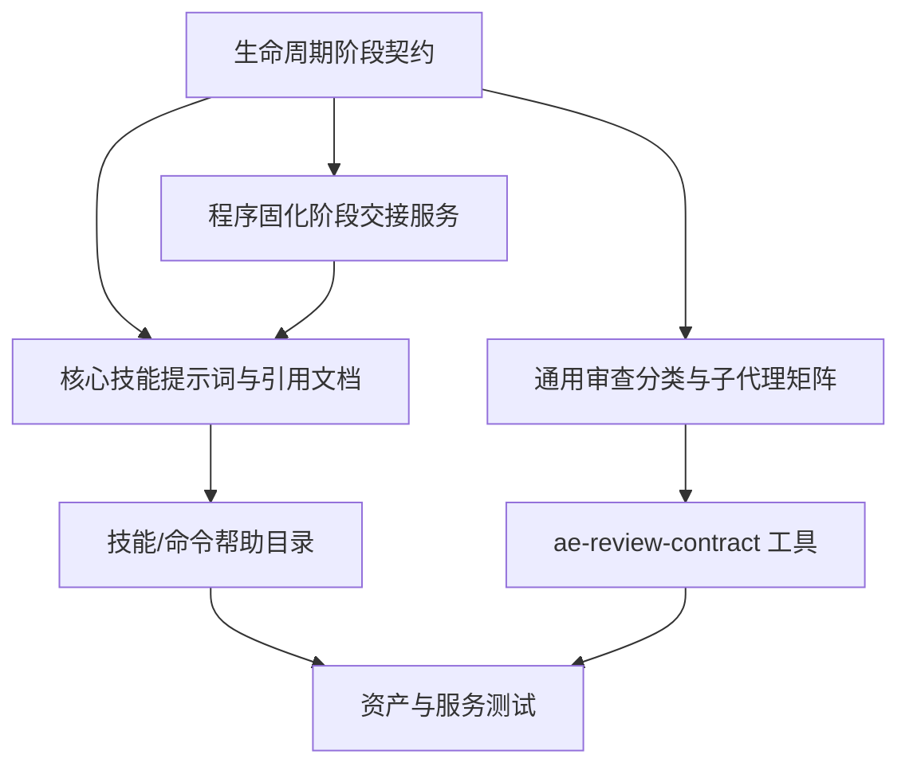

# 核心技能生命周期通用化计划

## AI 解析契约
- canonicalKind: plan
- humanEquivalent: true
- stableIdsRequired: true
- implementationUnitsRequired: true
- noImplicitScope: true

## 来源与目标
来源需求为 `ae/brainstorms/core-skill-lifecycle-generalization-requirements.md`。目标是把 AE 核心技能从软件工程专用管道重构为通用任务生命周期模型，同时保留软件开发作为重点应用场景。改造必须覆盖技能说明、命令帮助、审查契约、子代理分类、阶段交接、门禁证据和测试，避免用户侧公开资产中出现新旧流程语义并存。

本计划采用彻底重构策略：优先替换旧的软件开发专用语义、薄包装入口和低价值兼容分支；只有存在明确外部兼容证据或安全验证边界时才保留旧行为，并在计划或实现中标注边界。

## 范围

### 包含
- 重定义 `ae:ideate`、`ae:brainstorm`、`ae:plan`、`ae:refactor`、`ae:work`、`ae:review`、`ae:lfg` 的通用生命周期职责。
- 引入程序固化的阶段交接能力，用稳定数据定义阶段、可选后续技能、提示词模板和确认后执行边界。
- 将 `ae:plan` 与 `ae:refactor` 从薄包装关系调整为共享计划文档结构、不同策略入口的计划生成模型。
- 重构审查分类和子代理矩阵，使其支持需求、计划、测试用例、设计文档、最终产物、代码变更、文档变更和通用非软件产物。
- 同步更新技能资产、命令目录、帮助输出、模型路由、引用文档、工具描述和相关测试。
- 建立清债清单并删除、合并或替换与本需求相关的低价值旧机制。

### 不包含
- 不新增测试用例编写专用核心主技能；测试用例作为任务类型复用生命周期流程。
- 不在本轮引入远程 GitHub 写操作、Issue 或 PR 创建流程。
- 不手工维护 `dist/` 生成产物；实现后由构建流程生成。
- 不把当前插件源码仓库的内部目录结构写成下游项目必须具备的前提。

### 约束
- 面向插件用户的运行时能力不得把软件仓库、代码实现、测试或构建作为所有任务的必需前提。
- `ae:work` 仍必须遵守现有 Git 写操作授权、worktree 决策、验证和最终门禁规则；非代码任务要以产物路径、追溯关系、审查结果或用户确认作为证据补位。
- 浏览器能力仍必须遵守 agent-browser 环境证明门禁；本计划不放宽浏览器操作前置条件。
- 涉及新增或修改命令时必须同步 `COMMAND_SCENARIOS`，保持命令模型场景覆盖完整。

## 需求追溯
| 需求 ID | 计划响应 |
|---------|----------|
| R1 | U1, U2, U8 |
| R2 | U2, U3, U8 |
| R3 | U1, U2, U7 |
| R4 | U1, U2, U3, U5, U7 |
| R5 | U3, U8 |
| R6 | U2, U3 |
| R7 | U2, U3 |
| R8 | U2, U4 |
| R9 | U4 |
| R10 | U2, U7 |
| R11 | U5, U6, U7 |
| R12 | U4, U8 |
| R13 | U1, U4, U9, U10 |
| R14 | U5, U6, U9 |
| R15 | U1, U6, U9, U10 |
| R16 | U2, U3, U5, U6, U7, U8, U9, U10 |
| R17 | U2, U5, U6, U7, U8 |

## 高层技术设计
重构后的核心模型分为三层：

生命周期阶段契约应成为共享真源，至少覆盖：`ideate` 构思、`brainstorm` 需求探索、`requirements-review` 需求审查、`plan` 渐进计划、`refactor-plan` 彻底重构计划、`plan-review` 计划审查、`work` 实施、`outcome-review` 结果审查。技能文案、帮助输出和交接提示引用该契约，避免每个技能各自临场编写下一步说明。

审查体系改为“审查目标 + 风险维度”组合：审查目标负责判断需求、计划、测试、设计、代码变更、文档变更、最终产物或通用产物；风险维度负责激活安全、可靠性、性能、架构、产品、流程、测试覆盖等专家。这样既保留代码高风险审查能力，也支持非软件产物的质量检查。

### 关键决策
- D1. 新增共享生命周期契约服务或 schema，而不是只改各技能文案 → 理由: R5 要求下一步指引程序固化，必须有稳定真源生成交接提示。
- D2. `ae:refactor` 不再描述为 `ae:plan` 薄包装，而是使用共享计划模板的“彻底替换/清债策略入口” → 理由: 保留共同产物结构，同时消除职责混淆和薄包装技术债。
- D3. `ae:lfg` 从“全自主工程管道”改为“默认生命周期编排入口”，软件代码交付只是其中一种任务类型 → 理由: R3/R4 要求非软件任务也能进入完整流程。
- D4. 审查分类不继续只暴露 `code/document` 二分作为核心心智模型；新增 `target` 作为审查目标主字段，旧 `kind` 只作为短期兼容映射 → 理由: R11/R14 要求审查任意产物或变更，二分模型会继续隐藏需求、计划、测试、最终产物等目标差异。
- D5. 子代理重构以职责价值为依据，不保留只因历史存在而存在的代理 → 理由: R14/R15 要求允许新增、合并、移除，并清理低价值旧机制。
- D6. 非软件任务的门禁不伪造测试或构建要求，而是新增 `delivery_kind` 作为机器可校验交付类型，并使用产物路径、追溯、审查、人工可检查标准和用户确认作为证据 → 理由: 通用任务不能被软件验证命令错误阻断，也不能让代码任务借非代码语义绕过验证。
- D7. 实现期间先改 src 真源和测试，再通过构建更新 dist 调试产物 → 理由: `src/` 是可分发能力真源，`dist/` 不手工维护。

## 实现单元

### U1. 生命周期契约与清债基线
- [ ] 目标: 建立通用生命周期阶段、任务类型、阶段转移和清债规则的共享真源，作为后续技能、帮助、交接和测试的基础。
- [ ] 覆盖需求: R1, R3, R4, R13, R15
- [ ] 所属模块: lifecycle-contract
- [ ] 唯一产出物: 生命周期契约代码或资产，以及与其绑定的清债清单。
- [ ] 行为保持要求: 已有核心技能仍可被同名命令调用；软件开发任务仍能走原完整链路，但文案和分支不再把软件作为唯一前提。
- [ ] 依赖: 无
- [ ] 文件:
  - `src/schemas/ae-asset-schema.ts`
  - `src/services/ae-catalog.ts`
  - `src/services/asset-model-routing-catalog.ts`
  - `src/assets/skills/*/SKILL.md`
  - `src/assets/skills/*/references/*.md`
  - `tests/services/ae-catalog.test.ts`
  - `tests/services/help-catalog-service.test.ts`
- [ ] 方法:
  - 定义生命周期阶段枚举或只读 catalog，包含阶段 ID、职责、输入、输出、默认下一步、是否可独立调用、适用任务类型。
  - 建立清债清单，标注删除、替换、合并、保留及理由；优先纳入 `ae:lfg` 软件-only 停止语义、`universal-planning.md` 中“不提供 /ae-work”、`ae:refactor` 薄包装表述、审查二分心智模型和低价值代理分组。
  - 若仅用于文案和交接生成，避免新增过重 schema；若帮助、路由或工具需要机器读取，再在服务层新增类型和测试。
- [ ] 需遵循的模式:
  - 资产名称继续通过 `src/schemas/ae-asset-schema.ts` 常量引用。
  - 面向用户的文案不得泄漏插件源码仓库开发假设。
- [ ] 测试场景:
  - 正常路径: 核心阶段 catalog 包含完整生命周期并能生成默认顺序。
  - 边界情况: 用户从任意阶段直接进入时能返回该阶段的输入契约和后续选项。
  - 错误路径: 未知阶段或缺失下一步配置返回可恢复中文错误。
  - 集成场景: 帮助输出和技能交接引用同一阶段语义，不出现冲突表述。
- [ ] 验证:
  - `npx vitest run tests/services/ae-catalog.test.ts tests/services/help-catalog-service.test.ts`
  - `npm run typecheck`
- [ ] 回滚信号: 命令注册缺失、帮助输出无法列出核心技能、或生命周期阶段 catalog 与 `SKILL` 常量不一致。

### U2. 核心认知阶段技能提示词通用化
- [ ] 目标: 将 `ae:ideate`、`ae:brainstorm`、`ae:plan` 和 `ae:lfg` 的职责说明统一改为通用生命周期阶段，同时保留软件场景专项证据要求。
- [ ] 覆盖需求: R1, R2, R3, R4, R6, R7, R8, R10, R16, R17
- [ ] 所属模块: core-skills
- [ ] 唯一产出物: 更新后的认知阶段技能 `SKILL.md` 和必要引用文档。
- [ ] 行为保持要求: 原有软件功能、重构、审查、执行入口不消失；只是从“软件默认唯一流程”改为“通用生命周期 + 软件专项分支”。
- [ ] 依赖: U1
- [ ] 文件:
  - `src/assets/skills/ae-ideate/SKILL.md`
  - `src/assets/skills/ae-brainstorm/SKILL.md`
  - `src/assets/skills/ae-plan/SKILL.md`
  - `src/assets/skills/ae-lfg/SKILL.md`
  - `src/assets/skills/ae-brainstorm/references/*.md`
  - `src/assets/skills/ae-plan/references/*.md`
- [ ] 方法:
  - 将 `ae:ideate` 明确为候选方向生成与评估阶段，不要求仓库扫描作为所有主题前提；仓库内主题仍做本地落地扫描。
  - 将 `ae:brainstorm` 从“功能或改进”改为“目标、边界、约束、成功标准和待定问题探索”；需求文档可表达软件、测试、设计、文档和非软件任务。
  - 将 `ae:plan` 从“技术计划”改为“通用实施计划”；软件研究、代码图谱和测试命令只在任务涉及软件时启用。
  - 将 `ae:lfg` 从软件-only 管道改为默认生命周期编排入口，完整链路为构思可选、需求探索、需求审查、计划/重构计划、计划审查、实施、结果审查、可选专项验收。
  - 更新测试用例编写示例，明确通过 `brainstorm -> plan -> work -> review` 完成，不新增核心主技能。
- [ ] 需遵循的模式:
  - 仍保留 `disable-model-invocation` 等既有必要 frontmatter，除非 U1 证明需要调整。
  - 技能正文必须包含角色、适用场景、执行流程、输入处理、输出要求、安全边界和验证方式。
- [ ] 测试场景:
  - 正常路径: 软件功能仍按需求、计划、执行、审查链路运行。
  - 边界情况: 非软件任务不会被 `ae:lfg` 或 `ae:plan` 直接拒绝。
  - 错误路径: 输入模糊时仍停在当前阶段澄清，不跳到实现。
  - 集成场景: 测试用例任务在帮助文案和技能文案中都作为任务类型出现。
- [ ] 验证:
  - `npx vitest run tests/assets/ae-plan-artifact-text.test.ts tests/assets/ae-lfg-gate-text.test.ts tests/services/help-catalog-service.test.ts`
  - `npm run typecheck`
- [ ] 回滚信号: 用户侧技能描述仍出现“非软件任务停止”“不会提供 /ae-work”或“代码/构建是所有任务必需前提”等旧语义。

### U3. 程序固化阶段交接
- [ ] 目标: 用稳定生成逻辑替代各技能临场自由生成下一步指引，让用户确认后能进入下一阶段。
- [ ] 覆盖需求: R2, R4, R5, R6, R7, R16
- [ ] 所属模块: lifecycle-handoff
- [ ] 唯一产出物: 阶段交接生成服务或工具内函数，以及引用该能力的技能交接文档。
- [ ] 行为保持要求: 直接调用 `ae:plan` 后仍不得自动执行 `ae:work`；交接只提供可确认提示或可运行命令，除上游编排器模式外不擅自进入下一技能。
- [ ] 依赖: U1, U2
- [ ] 文件:
  - `src/services/ae-catalog.ts`
  - `src/assets/skills/ae-brainstorm/references/handoff.md`
  - `src/assets/skills/ae-plan/references/plan-handoff.md`
  - `src/assets/skills/ae-refactor/SKILL.md`
  - `src/assets/skills/ae-lfg/references/pipeline.md`
  - `tests/assets/ae-plan-artifact-text.test.ts`
  - `tests/services/*handoff*.test.ts` 或新增同类测试
- [ ] 方法:
  - 定义阶段完成上下文：当前阶段、产物路径、审查状态、推荐下一阶段、可选下一阶段、是否管道模式。
  - 生成稳定提示词模板，例如 `/ae-review domain:document <requirements-path>`、`/ae-plan <requirements-path>`、`/ae-work <plan-path>`、`/ae-review <产物或变更范围>`。
  - 区分“呈现下一步选项”和“管道编排自动继续”：直接技能调用只提示，`ae:lfg` 管道可按自身静默策略继续。
  - 移除 `universal-planning.md` 中阻止非软件计划进入执行的旧表述，改为通用交接规则。
- [ ] 需遵循的模式:
  - 交接提示使用仓库相对路径。
  - agent-browser 相关后续提示必须包含 proof 检查要求或指向 `ae:agent-browser`。
- [ ] 测试场景:
  - 正常路径: 需求文档完成后生成需求审查和计划下一步选项。
  - 边界情况: 无持久产物时生成摘要型下一步提示，不伪造路径。
  - 错误路径: 缺少必需路径时不生成不可执行命令。
  - 集成场景: `ae:plan` 直接调用仍只呈现 `/ae-work <plan-path>`，不自动调用工作技能。
- [ ] 验证:
  - `npx vitest run tests/assets/ae-plan-artifact-text.test.ts`
  - `npm run typecheck`
- [ ] 回滚信号: 交接测试发现“根据选择路由”类临场分派、自动执行后续技能，或非软件计划无法产生执行提示。

### U4. `ae:plan` 与 `ae:refactor` 策略分离
- [ ] 目标: 保留两个计划生成入口，但把差异从薄包装提示升级为明确策略：`ae:plan` 渐进规划，`ae:refactor` 彻底替换和清债规划。
- [ ] 覆盖需求: R8, R9, R12, R13
- [ ] 所属模块: planning-strategies
- [ ] 唯一产出物: 更新后的 `ae:plan` / `ae:refactor` 技能、共享计划模板说明和策略测试。
- [ ] 行为保持要求: 两者仍产出 `type: plan` 文档，`ae:work` 和 `ae-doc-extract` 仍能读取同一实现单元结构。
- [ ] 依赖: U1, U2
- [ ] 文件:
  - `src/assets/skills/ae-plan/SKILL.md`
  - `src/assets/skills/ae-refactor/SKILL.md`
  - `src/assets/skills/ae-plan/references/plan-template.md`
  - `src/assets/skills/ae-plan/references/deepening-workflow.md`
  - `src/services/ae-catalog.ts`
  - `tests/assets/*plan*.test.ts`
  - `tests/services/ae-catalog.test.ts`
- [ ] 方法:
  - 将 `ae:refactor` 说明改为“彻底重构计划策略入口”，不再说“不维护独立计划流程”或“再调用 ae:plan”作为核心定义。
  - 抽取共享计划结构契约，允许两个入口引用同一模板，但分别拥有不同的计划前置分析和债务处理规则。
  - 在计划模板中保留重构计划必填字段：行为保持要求、清债目标、被替换旧机制、blocked-debt 理由和回滚信号。
  - `ae:plan` 默认避免破坏已有行为；`ae:refactor` 默认一步到位替换旧接口、旧流程和旧分类，不做兼容层。
- [ ] 需遵循的模式:
  - 不新增平行 plan 文档类型；仍使用 `type: plan`。
  - 不把“降低改动量”作为 `ae:refactor` 降级理由。
- [ ] 测试场景:
  - 正常路径: `ae:plan` 和 `ae:refactor` 帮助描述能体现不同策略。
  - 边界情况: 输入是已有计划时能选择更新原计划或创建新计划。
  - 错误路径: 重构输入包含用户可见新功能时标记非纯重构并要求回到需求决策。
  - 集成场景: `ae:work` 对两类计划读取同一实现单元结构。
- [ ] 验证:
  - `npx vitest run tests/services/ae-catalog.test.ts tests/assets/ae-plan-artifact-text.test.ts`
  - `npm run typecheck`
- [ ] 回滚信号: `ae:refactor` 仍被帮助或技能正文描述为 `ae:plan` 薄包装，或计划模板不能表达清债替换策略。

### U5. 通用审查目标契约
- [ ] 目标: 将审查体系从 `code/document` 二分重构为以 `target` 为主的通用产物审查目标契约。
- [ ] 覆盖需求: R4, R11, R14, R16, R17
- [ ] 所属模块: review-system
- [ ] 唯一产出物: `target` 审查目标契约、旧 `kind` 兼容映射和对应工具参数测试。
- [ ] 行为保持要求: 代码审查仍必须覆盖 correctness、testing、maintainability、standards 等基础风险；安全、可靠性、迁移、性能等高风险条件不得被削弱。
- [ ] 依赖: U1, U2
- [ ] 文件:
  - `src/schemas/ae-asset-schema.ts`
  - `src/services/review-selector.ts`
  - `src/tools/ae-review-contract.tool.ts`
  - `src/assets/skills/ae-review/SKILL.md`
  - `tests/services/review-selector.test.ts`
  - `tests/tools/ae-review-contract.tool.test.ts`
- [ ] 方法:
  - 将 `ReviewSelectionInput` 扩展为 `target` 主字段，枚举至少包含 `requirements`、`plan`、`test`、`design`、`outcome`、`code-change`、`document-change`、`general-artifact`。
  - `ae-review-contract` 新增 `target` 参数；旧 `kind` 参数只做兼容映射：`code -> code-change`，`document -> requirements`，`plan -> plan`，`test -> test`，`general -> general-artifact`。
  - 工具 schema 中 `target` 为首选参数，`kind` 改为可选兼容参数；`target` 与 `kind` 同时传入且冲突时返回可恢复错误，不静默覆盖。
  - `domain` 仅表示范围收集模式，保留 `code|document`；不得再作为审查目标真源。
  - 未传 `target` 时由 `domain`、文档结构和路径推断；当无路径、无文档 frontmatter、无 Git diff 或 `domain` 与路径类型冲突时，无头模式返回可恢复错误。
  - 更新 `ae:review` 技能阶段 2-3，先确定范围 `domain`，再确定审查目标 `target`，最后选择审查团队。
- [ ] 需遵循的模式:
  - 审查子代理仍保持只读；自动修复只由 `ae:review` 编排器应用。
- [ ] 测试场景:
  - 正常路径: 需求、计划、测试用例、最终产物和代码变更分别选择合理审查团队。
  - 边界情况: 一个产物同时涉及安全和用户流程时能叠加风险审查者。
  - 错误路径: 未知审查目标返回可恢复提示，不静默降级到错误团队。
  - 集成场景: 旧 `kind` 调用能映射到新 `target` 并在返回中标注兼容来源。
- [ ] 验证:
  - `npx vitest run tests/services/review-selector.test.ts tests/tools/ae-review-contract.tool.test.ts`
  - `npm run typecheck`
- [ ] 回滚信号: 审查团队选择丢失代码安全/正确性基础覆盖，或文档/产物审查仍只能按 requirements/plan/test/general 粗分。

### U6. 子代理矩阵和代理资产清理
- [ ] 目标: 基于 U5 的审查目标契约重构子代理矩阵，合并、删除或新增真正服务通用生命周期的代理。
- [ ] 覆盖需求: R11, R14, R15, R16, R17
- [ ] 所属模块: review-agents
- [ ] 唯一产出物: 更新后的 `REVIEW_MATRIX`、代理注册列表和代理资产清理结果。
- [ ] 行为保持要求: 安全、正确性、测试、可维护性、规范、可靠性等高价值审查能力不得因合并而失去覆盖。
- [ ] 依赖: U5
- [ ] 文件:
  - `src/schemas/ae-asset-schema.ts`
  - `src/services/review-catalog.ts`
  - `src/services/ae-catalog.ts`
  - `src/assets/agents/review/*.md`
  - `src/assets/agents/research/*.md`
  - `src/assets/agents/workflow/*.md`
  - `src/assets/skills/ae-review/references/persona-catalog.md`
  - `src/assets/skills/ae-review/references/file-routing-table.md`
  - `tests/services/review-catalog.test.ts`
  - `tests/services/agent-registration.test.ts`
- [ ] 方法:
  - 盘点现有代理职责，按“基础质量、产物一致性、计划可执行性、风险专项、研究辅助、工作流辅助”建立新分类。
  - 合并职责重叠代理；移除只服务旧软件路径且可由更通用审查者覆盖的代理；必要时新增产物完整性、流程交接或验收证据审查者。
  - 评估 `AgentStageSchema` 的 stage 是否需要新增语义分类字段；若 stage 仅表示目录结构，则保留目录并在 catalog 中新增非路径语义分类。
  - 更新 persona、路由表和 findings schema 的任务类型说明。
- [ ] 需遵循的模式:
  - 代理 frontmatter 必须使用 `steps` 而不是 `maxSteps`。
  - 更新或删除代理时同步 `AGENT` 常量、注册列表和测试。
- [ ] 测试场景:
  - 正常路径: 新矩阵能按不同 `target` 选择基础审查者和条件审查者。
  - 边界情况: 删除或合并代理后注册列表无悬空引用。
  - 错误路径: REVIEW_MATRIX 引用不存在代理时测试失败。
  - 集成场景: 代理注册测试覆盖新增、合并或移除后的最终列表。
- [ ] 验证:
  - `npx vitest run tests/services/review-catalog.test.ts tests/services/review-selector.test.ts tests/services/agent-registration.test.ts`
  - `npm run typecheck`
- [ ] 回滚信号: 审查矩阵引用不存在代理，或高风险代码审查不再激活对应专项审查者。

### U7. 通用实施、验证和门禁证据
- [ ] 目标: 让 `ae:work`、`ae:lfg` 和门禁说明支持代码、文档、测试用例、设计和非软件任务的执行与验收证据。
- [ ] 覆盖需求: R3, R4, R10, R11, R16, R17
- [ ] 所属模块: work-and-gates
- [ ] 唯一产出物: 更新后的实施流程引用文档、门禁参数说明和相关服务测试。
- [ ] 行为保持要求: 代码交付仍必须运行相关验证命令和审查；Git 写操作授权要求不变。
- [ ] 依赖: U2, U3, U5, U6
- [ ] 文件:
  - `src/assets/skills/ae-work/SKILL.md`
  - `src/assets/skills/ae-work/references/input-routing-workflow.md`
  - `src/assets/skills/ae-work/references/task-analysis-workflow.md`
  - `src/assets/skills/ae-work/references/verification-workflow.md`
  - `src/assets/skills/ae-work/references/shipping-workflow.md`
  - `src/assets/skills/ae-lfg/SKILL.md`
  - `src/services/gate-service.ts`
  - `src/tools/ae-gate.tool.ts`
  - `tests/services/gate-service.test.ts`
  - `tests/tools/ae-gate.tool.test.ts`
- [ ] 方法:
  - 输入分流增加 `delivery_kind` 交付类型识别，枚举至少包含 `code-change`、`document-artifact`、`test-artifact`、`design-artifact`、`report-artifact`、`non-file-delivery`。
  - 门禁读取实际工作区变更并执行一致性校验：当 `delivery_kind` 不是 `code-change` 但变更包含 `src/**`、`tests/**`、`scripts/**`、构建配置、工具实现、schema 或运行时资产注册文件时，必须阻断并要求改为 `code-change` 或给出逐文件非代码理由。
  - 对混合交付采用最严格分类：同一次交付只要包含代码或可执行逻辑变更，就按 `code-change` 执行代码验证和代码审查门禁；文档产物证据只能作为附加证据。
  - 验证工作流按任务类型生成证据要求：代码用测试/构建/typecheck；文档用结构检查、需求追溯、审查报告；非文件化任务用可引用摘要和用户确认或无法持久化说明。
  - `ae-gate` 新增或复用机器可校验 `delivery_kind` 字段，并新增 `delivery_evidence` 结构：产物路径、追溯来源、审查证据、非文件交付摘要引用、用户确认来源、证据可信度和无法持久化原因。
  - `non-file-delivery` 只有在 `delivery_evidence.summary_ref`、`confirmation_source`、`evidence_trust` 和 `no_artifact_reason` 非空且可引用时才能通过；纯 `notes` 或普通声明不得升级为通过证据。
  - 按交付类型决定阻断规则；代码类缺少验证仍阻断，非代码类可用产物审查、追溯证据和结构化交付证据通过。
  - `ae-gate` 允许 `browser_test_status:not_applicable`、`review_status:not_applicable` 或无代码变更原因在非代码任务中成为合法证据，但必须由 `delivery_kind` 支撑，不得放宽代码任务。
  - 最终交付模板明确区分代码验证、产物验证、审查状态、Git 操作和剩余风险。
- [ ] 需遵循的模式:
  - 不把缺少测试命令本身视为非软件任务失败。
  - 不允许用用户声明替代真实工具输出作为代码验证通过证据。
- [ ] 测试场景:
  - 正常路径: 文档产出任务通过产物路径、追溯和审查结论通过门禁。
  - 边界情况: 无文件产物任务必须记录无法持久化原因和可引用摘要。
  - 错误路径: 代码变更缺少验证命令仍被门禁阻断。
  - 集成场景: `ae:lfg` 调用 `ae:work` 执行非软件任务不因无代码 diff 停止在代码审查前。
- [ ] 验证:
  - `npx vitest run tests/services/gate-service.test.ts tests/tools/ae-gate.tool.test.ts`
  - `npm run typecheck`
- [ ] 回滚信号: 非代码任务被错误要求代码 diff 或测试命令，或代码任务缺少验证仍通过最终门禁。

### U8. 帮助、命令和模型路由一致性
- [ ] 目标: 同步公开帮助、命令说明、argument-hint、prompt optimize 变体和模型路由，让用户发现的是通用生命周期入口。
- [ ] 覆盖需求: R1, R2, R5, R12, R16, R17
- [ ] 所属模块: catalog-and-routing
- [ ] 唯一产出物: 更新后的目录服务、命令描述、帮助输出和模型路由测试。
- [ ] 行为保持要求: 现有命令名保持可用；不新增低价值主命令；`ae:document-review` 若保留，继续作为 `ae:review domain:document` 兼容别名但文案不强化旧分类。
- [ ] 依赖: U1, U2, U3, U4, U5, U6, U7
- [ ] 文件:
  - `src/services/ae-catalog.ts`
  - `src/services/asset-model-routing-catalog.ts`
  - `src/schemas/ae-asset-schema.ts`
  - `src/assets/commands/*.md`
  - `src/assets/skills/ae-help/SKILL.md`
  - `tests/services/ae-catalog.test.ts`
  - `tests/services/help-catalog-service.test.ts`
  - `tests/services/asset-model-routing-catalog.test.ts`
- [ ] 方法:
  - 将核心技能描述改成阶段职责：构思、探索、渐进计划、重构计划、实施、审查、默认编排。
  - 检查 `PROMPT_OPTIMIZE_VARIANT_EXCLUDED_SKILLS` 是否仍符合通用流程；不为审查或浏览器门禁生成不安全变体。
  - 同步命令模型场景：构思/探索为 standard，计划/重构/工作/审查/默认编排为 deep，浏览器相关为 vision，帮助/查询为 quick。
  - 帮助输出按生命周期优先展示，辅助技能后置，避免测试用例等任务被误导为需要新增主技能。
- [ ] 需遵循的模式:
  - 所有命令必须覆盖 `COMMAND_SCENARIOS`。
  - 技能列表保持文件内既有分组风格，不机械打散语义相关能力。
- [ ] 测试场景:
  - 正常路径: `/ae-help` 展示核心生命周期顺序和通用任务说明。
  - 边界情况: `ae:document-review` 显示为兼容入口而不是独立主流程。
  - 错误路径: 新增命令缺少模型场景时测试失败。
  - 集成场景: prompt optimize 变体不会绕过 agent-browser proof 或审查边界。
- [ ] 验证:
  - `npx vitest run tests/services/ae-catalog.test.ts tests/services/help-catalog-service.test.ts tests/services/asset-model-routing-catalog.test.ts`
  - `npm run typecheck`
- [ ] 回滚信号: 帮助输出仍把 `ae:lfg` 描述为软件工程专用，或命令场景覆盖测试失败。

### U9. 旧语义批量扫描与文本契约测试
- [ ] 目标: 用脚本化扫描和资产文本契约测试固化旧语义清理结果。
- [ ] 覆盖需求: R13, R14, R15, R16
- [ ] 所属模块: cleanup-and-validation
- [ ] 唯一产出物: 旧语义扫描测试和文本契约测试。
- [ ] 行为保持要求: 扫描词表只覆盖与本需求冲突的公开资产语义，避免误伤内部维护文档和历史产物。
- [ ] 依赖: U2, U3, U4, U5, U6, U7, U8
- [ ] 文件:
  - `src/assets/skills/**`
  - `src/assets/agents/**`
  - `src/assets/commands/**`
  - `tests/assets/**`
- [ ] 方法:
  - 增加 Node.js 或 Vitest 文本契约测试，扫描 `src/assets/skills/**`、`src/assets/commands/**` 和必要代理文案。
  - 词表至少覆盖“非软件任务停止”“不要提供 /ae-work”“只服务代码实现”“软件-only”“ae:refactor 是 ae:plan 的包装器”等冲突语义。
  - 对必须保留的历史说明使用明确白名单和理由，不使用宽泛排除。
  - 输出命中文件和行号，便于实施阶段逐项清理。
- [ ] 需遵循的模式:
  - 不修改无关用户变更；若当前工作区已有非本任务改动，实施时只在必要文件内做最小协调。
  - 不提交、不推送，除非用户后续明确授权。
- [ ] 测试场景:
  - 正常路径: 扫描通过且无冲突旧语义。
  - 边界情况: 白名单只允许维护语境或本计划中用于描述待清理对象的引用。
  - 错误路径: 文本契约发现旧语义残留即失败。
  - 集成场景: 扫描测试与帮助、审查、计划资产测试一起运行。
- [ ] 验证:
  - `npx vitest run tests/assets`
  - `npm run typecheck`
- [ ] 回滚信号: 旧语义扫描仍命中用户侧公开资产且无白名单理由。

### U10. 最终构建与回归验证
- [ ] 目标: 消费前序所有产物，完成类型检查、测试、构建和必要图谱更新说明。
- [ ] 覆盖需求: R13, R15, R16
- [ ] 所属模块: final-validation
- [ ] 唯一产出物: 完整验证结果和可交付工作区状态。
- [ ] 行为保持要求: 不在最终验证单元中继续做功能性重构；发现问题回到对应单元修复。
- [ ] 依赖: U1, U2, U3, U4, U5, U6, U7, U8, U9
- [ ] 文件:
  - `src/**`
  - `tests/**`
  - `dist/**`
- [ ] 方法:
  - 运行相关单测后运行全量测试。
  - 运行构建，让 `dist/` 和调试桥接产物由脚本生成，不手工编辑。
  - 如关系图谱后续可用，增量构建或说明未更新图谱原因。
  - 检查 Git 状态，确认没有无关文件被修改。
- [ ] 需遵循的模式:
  - 不提交、不推送，除非用户后续明确授权。
- [ ] 测试场景:
  - 正常路径: 全量测试、类型检查和构建通过。
  - 边界情况: 生成产物变化可由构建解释。
  - 错误路径: 任一验证失败时回到对应实现单元修复。
  - 集成场景: `npm run build` 成功复制资产并生成调试桥接文件。
- [ ] 验证:
  - `npm run typecheck`
  - `npm run test`
  - `npm run build`
- [ ] 回滚信号: 构建失败、注册资产缺失、帮助命令不可生成，或旧语义文本契约失败。

## 风险与应对
| 风险 | 影响 | 应对措施 |
|------|------|----------|
| 生命周期契约过度工程化 | 增加维护成本并拖慢实现 | 先以只读 catalog 和生成函数实现，只有路由必须依赖时才升级 schema |
| 非软件任务证据过宽 | 门禁强度下降 | 明确区分代码验证、产物审查、追溯检查和用户确认；代码任务仍保持硬验证 |
| 子代理删减过度 | 安全、正确性或可靠性审查覆盖下降 | 每个删除或合并都必须有替代审查者和测试覆盖，安全/正确性基础能力不得移除 |
| 同步资产范围过大 | 引入无关改动和测试不稳定 | 以是否影响核心生命周期语义为边界，逐项列入清债清单 |
| `ae:lfg` 通用化破坏软件默认体验 | 现有软件用户流程退化 | 保留软件任务专项路径和门禁，但不把它写成唯一允许路径 |
| prompt optimize 或交接提示绕过浏览器 proof | 违反浏览器硬门禁 | 浏览器相关提示模板统一包含 proof 检查和 `ae:agent-browser` 兜底 |

## 待定问题

### 执行前需解决
- Q1. 子代理重构是否允许删除已公开的代理文件，还是先保留文件但从审查矩阵中移除？推荐: 若无外部兼容证据，允许删除并同步注册测试。

### 推迟到执行
- Q3. 生命周期契约放在 `src/services/` 还是 `src/schemas/`？若只是静态 catalog 和生成逻辑，优先 `services`；若工具参数或 schema 需要复用，再拆到 `schemas`。
- Q4. 是否新增“验收证据审查者”代理？执行时先盘点现有 `test-case-reviewer`、`coherence-reviewer`、`feasibility-reviewer` 能否覆盖，再决定新增。
- Q5. 当前工作区已有 `ae-review` 与 `gate-service` 相关未提交变更，实施时需要逐文件确认并避免覆盖非本任务改动。

## 一致性检查
- implementationUnitsCount: 10
- tracedRequirementsCount: 17
- decisionsCount: 7
- risksCount: 6
