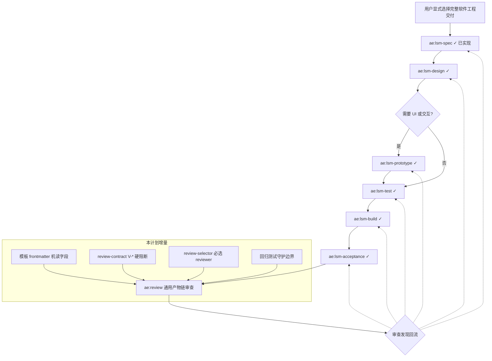

# Refactor LSM Skill Flow Design

## AI 解析契约
- canonicalKind: plan
- humanEquivalent: true
- stableIdsRequired: true
- implementationUnitsRequired: true
- noImplicitScope: true

## 现状盘点（基线）

本计划在 master HEAD=`4c73638` 的基础上推进，先记录已实现的 LSM 基础事实，再针对 ae:review 审查发现的真实缺口规划增量。下列内容由本会话 evidence-reviewer 通过 `git rev-parse HEAD`、`npx vitest run` 与文件读取真实核验：

- `src/schemas/ae-asset-schema.ts`：`SKILL.LSM_*`、`COMMAND.LSM_*` 常量已存在，`AeSkillNameSchema` 接受全部 LSM 技能名，`PROMPT_OPTIMIZE_VARIANT_EXCLUDED_SKILLS` 排除 prototype/build/acceptance。
- `src/services/asset-model-routing-catalog.ts`：`COMMAND_SCENARIOS` 字典含 6 条 `LSM_*` 条目（prototype=VISION，余 DEEP）。
- `src/services/ae-catalog.ts`：6 个 LSM 技能 catalog 已注册；`traceability-reviewer` 与 `evidence-reviewer` 已注册到 reviewer 集合与 REQUIRED_AGENTS。
- `src/assets/skills/ae-lsm-{spec,design,prototype,test,build,acceptance}/SKILL.md` + `references/*-template.md`：12 个文件均已存在并通过 `tests/assets/asset-health.test.ts`。**6 个 references 模板首行均为 `# LSM <X> Template`，当前不含 YAML frontmatter**。
- `src/tools/ae-review-contract.tool.ts`：`has_lsm_artifact_chain` 与 `lsm_id_only` 输入字段已实现于 LSM 处理分支，当前仅设置 `hasEvidenceClaim=true` 与 `targetTypes` 扩展，未对 `review_status` 设硬阻断；工具当前为纯函数，无 fs/path import。
- `src/tools/ae-review-proof.tool.ts`：`hasBlockingFinding` 仅根据 `findings` 中的 P0/P1/P2/medium 严重级别阻断，不识别 LSM 链或 frontmatter 元数据。
- `src/services/review-selector.ts`：`ReviewSelectionInput` 当前不含 `hasLsmArtifactChain` 字段；`tests/services/review-selector.test.ts` 已有用例验证『LSM 产物链通过通用混合审查激活追溯和证据审查』（依赖 `ae-review-contract` 的 `targetTypes` 扩展机制）。
- `docs/ae/living-spec-mesh-skill-system.md`：文件已存在但 git untracked，尚未正式纳入分流判定与痛点记录。
- 测试基线复核命令：`npx vitest run tests/assets/asset-health.test.ts tests/schemas/ae-asset-schema.test.ts tests/services/{ae-catalog,asset-model-routing-catalog,command-registration,review-selector}.test.ts tests/tools/{ae-review-contract,ae-help}.tool.test.ts` 当前 HEAD 输出 Test Files 8 passed / Tests 135 passed（其中显式 LSM 用例约 9 个）。
- typecheck 状态：本会话未独立运行 `npm run typecheck`，U9 必须先建立基线再交付。

## 来源与目标

**目标**：基于现状盘点闭环 ae:review 审查发现的真实缺口，让已实现的 LSM 基础形成可被通用 `ae:review` 自动识别、可被回归测试守护、可被分流判定文档约束的端到端契约。

**外部行为保持要求**：
- 保持现有 `ae:prd`、`ae:plan`、`ae:work`、`ae:lfg`、`ae:review` 通用入口职责，LSM 不成为默认流程。
- 保持 `ae:review` 作为唯一最终审查入口，不新增 `ae:lsm-review` 或 LSM 专属 reviewer 命名。
- 保持普通下游项目无需存在 LSM 目录。
- 保持 GitHub 远程写操作不进入面向插件用户的 LSM 流程。

**清债目标**（每项均关联用户场景与可观测损失）：

- 将 ae:review 对 LSM 产物链的"识别"从"凭文本启发式"升级到"凭模板 frontmatter 机读元数据" → **解决用户场景**：审查者人工判断"这是否是 LSM 链"耗时且不一致；改造后 ae:review 自动识别，**用户能做的事**：直接 `ae:review` 任意 LSM 产物路径即可触发追溯+证据审查，不需手动指定 `kind=mixed` 或 reviewer 列表。
- 将"缺 V-* 时不得 passed"从文档要求落到 `ae-review-proof.tool.ts` 的硬阻断 → **解决用户场景**：当前 LSM 验收阶段缺 V-* 证据仍可被 LLM 标记 passed，导致后续 build/acceptance 链断裂；改造后 proof 层硬拒绝，**用户能做的事**：信任 `ae:review` 通过即等于 V-* 证据齐全。
- 将"普通流程不被 LSM 默认劫持"与"LSM assets 不含 GitHub 远程写流程"从隐性约束落到回归断言 → **解决用户场景**：未来贡献者可能误改 review-selector 把 LSM reviewer 加入普通分支，或在 LSM 文档中复制 `gh pr create` 命令；改造后 CI 守护，**用户能做的事**：放心使用 `ae:review` 处理普通代码或文档审查，无 LSM reviewer 噪音；放心阅读 LSM 文档不会被引导执行 GitHub 远程写。
- 将 LSM 与 `ae:prd/plan/work/lfg` 的分流判定从"用户显式选择"语句细化为可观测、可在文档中查阅的判定规则 → **解决用户场景**：用户面对"我该用 prd 还是 lsm-spec"无明确判据；改造后 `docs/ae/living-spec-mesh-skill-system.md` 列出 5 类场景判定，**用户能做的事**：按照决策表自助分流，避免误用 LSM 链处理一次性 bug 修复。

**LSM 体系存续论证（替代方案对比）**：

| 替代方案 | 优点 | 缺点 | 是否采纳 |
|---------|------|------|---------|
| 弃用 LSM 体系，删除 6 技能 + 模板 | 简化技能目录；减少维护负担 | 已实现并通过 135 项测试，删除会丢失现有产物追溯能力；多阶段软件交付场景将回退到无 ID 追溯的 plan/work | 不采纳 |
| 冻结 LSM 不再新增能力，但保留现有 | 维护成本最低 | 当前已暴露的 4 项缺口（识别启发式、V-* 硬阻断、reviewer 选择、远程写守护）将永久存在；ae:review 与 LSM 永远不闭环 | 不采纳 |
| 完成本计划增量改造（推荐） | 保留 LSM 已实现资产；通过 10 单元闭合现有缺口；不引入新技能或新工具 | 改造工作量约 10 个实现单元；引入模板 frontmatter 字段维护负担 | **采纳** |
| 把 LSM 提升为默认软件交付路径 | 强制规范 | 违反"LSM 不成为默认流程"外部行为保持；伤害普通项目用户 | 不采纳 |

**LSM 使用频次基线**：本会话未运行用户使用统计采集（不在工作区可观测范围）。本计划接受"使用频次未量化"为已知风险（见风险表 R6 行），通过分流判定文档（U1）让用户主动选择，而不是把 LSM 强加为默认。

**blocked-debt**：无。已实现部分按现状保留；本计划不重写已通过测试的 schema/catalog/路由代码。

## 范围

### 包含
- 文档化 LSM 与通用流程的可观测分流判定、真实痛点举证与替代方案对比（U1）。
- 模板 frontmatter 机读字段化（U2）。
- ae:review SKILL 文档与识别契约对齐（U3）。
- ae-review-contract 在识别到 LSM 链 + frontmatter 缺 V-* 时输出 `gateBlocked=true` 字段供调用方消费（U4）。
- review-selector 在 LSM 链下必选追溯+证据 reviewer（U5）。
- 三类回归测试补齐（U6/U7/U8a/U8b）。
- ae-review-proof 在 `source_review_output` 中识别 LSM 链 + 缺 V-* 标志时硬拒绝 `review_status=passed` 写入（U10）。
- 交付验证（U9）。

### 不包含
- 不重写 master 已通过测试的 schema、catalog、命令路由、技能文件、references 模板正文。
- 不新增 `ae:lsm-review` 或 LSM 专属 reviewer。
- 不新增独立 proof 门禁工具；仅在现有 `ae-review-proof` 的 `hasBlockingFinding` 阻断逻辑旁追加 LSM 专项分支。
- 不新增远程 GitHub 写能力。

### 约束
- `src/` 是真源；新增字段必须先在 `src/schemas/ae-asset-schema.ts` 或对应模板 frontmatter 中体现。
- 用户侧文案不得把本仓库源码结构当作普通项目必须满足的业务结构。
- 浏览器能力必须经 `ae:chrome-devtools` 门禁。
- 单一文件由单一实现单元负责修改，禁止跨单元编辑同一文件。

## 需求追溯

| 需求 ID | 计划响应 |
|---------|----------|
| R1 | U1 |
| R2 | U2, U3 |
| R3 | U4, U8a, U10 |
| R4 | U5, U6 |
| R5 | U7, U8b |
| R6 | U6 |
| R7 | U9 |

### 需求定义
- **R1.** 必须文档化 LSM 与 `ae:prd/plan/work/lfg` 的可观测分流判定、真实痛点举证与"弃用 LSM"替代方案对比，使 LSM 不再仅靠"用户显式选择"措辞分流，且 LSM 体系存续决策有书面论证。
- **R2.** ae:review 对 LSM 完整产物链的识别必须依赖模板 frontmatter 机读元数据（`lsmKind`、`upstreamRefs`、`traceTable`），而非字面 ID 启发式。
- **R3.** 在识别到 LSM 完整产物链且缺 `V-*` 验证证据时，`ae-review-proof` 必须硬拒绝 `review_status=passed` 写入；`ae-review-contract` 同时在结果中给出 `gateBlocked=true` 字段供调用方提前感知；两层闭环不得仅做 `hasEvidenceClaim=true` 标记。
- **R4.** review-selector 在 LSM 完整产物链场景下必须必选 `traceability-reviewer` 与 `evidence-reviewer`；普通 `kind=code/document/plan` 行为不得回归。
- **R5.** 必须有回归断言验证：(a) LSM assets 不含 GitHub 远程写流程；(b) 普通 `ae:review kind=code` 与 `kind=document` 不会因为 LSM 引入而被劫持。
- **R6.** 必须保留 `traceability-reviewer` 与 `evidence-reviewer` 通用化设计，不引入 LSM 专属 reviewer 命名。
- **R7.** 交付前必须记录验证结果、审查结论、Git 操作状态和剩余风险，区分已完成/已验证/未验证。

## 高层技术设计



### 关键决策
- **D1.** 识别契约从"启发式 + ID 字面"改为"模板 frontmatter 机读字段优先 + ID 字面兜底" → 理由：消除 P1 列出的"识别启发式过于脆弱"风险，同时保留向后兼容。
- **D2.** V-* 缺失感知分两层：`ae-review-contract` 在结果 JSON 中给出 `gateBlocked=true` 提示字段（不读取文件，仅传递调用方已声明的信号），`ae-review-proof` 在写入 metadata 前硬拒绝 `review_status=passed`（与现有 worktree/branch/HEAD 文本审计同层，复用其 fs IO 能力） → 理由：`ae-review-contract` 当前为纯函数无 fs IO，把文件解析挪给已具备 IO 与 metadata 写入职责的 `ae-review-proof` 更符合单一职责，且能彻底闭环 R3"硬拒绝 passed proof"。
- **D3.** review-selector 仅负责 reviewer 选择，不负责 status 阻断；阻断完全由 D2 两层处理 → 理由：维持 selector 单一职责。
- **D4.** 回归测试拆为三类，由独立测试单元负责，每个单元只编辑唯一测试文件 → 理由：保证单元归属唯一，避免跨单元编辑同一测试文件。
- **D5.** 分流判定文档放在 `docs/ae/living-spec-mesh-skill-system.md`，不放在各 SKILL.md → 理由：避免六个 SKILL.md 重复维护同一判定规则。
- **D6.** 不修改 master 已通过测试的 catalog/路由/SKILL 正文（仅扩展 ae:review SKILL 的识别契约说明） → 理由：避免对已通过测试的 schema/catalog/路由代码做空操作改写。
- **D7.** `gateBlocked` 信号源：调用方（执行 ae:review 的 LLM）根据 `ae-review-contract` 输出与对 acceptance 模板 frontmatter 的读取结果，在调用 `ae-review-proof` 时显式传入 `lsmEvidenceMissing=true` 字段；`ae-review-proof` 据此硬拒绝 → 理由：避免在 contract 工具引入 fs IO，同时让 proof 工具有结构化输入而非依赖 source_review_output 文本解析。

### 可观测分流判定（落地到 U1 文档）

| 触发场景 | 推荐流程 | 可观测判定 |
|---------|---------|-----------|
| 单文件 bug 修复 | `ae:work` 或 `ae:plan + ae:work` | 输入仅含错误描述、日志或单文件路径，无需求/设计/测试用例分层 |
| 给已有功能加一项小改动 | `ae:plan + ae:work` | 输入是改动描述，且不要求生成 `R-*/U-*/TC-*/V-*` 追踪 |
| 探索性发散讨论 | `ae:brainstorm` 或 `ae:ideate` | 输入是开放式问题，无明确交付物 |
| 多阶段软件工程交付（需求→设计→测试→实现→验收） | LSM 链路 | 用户显式提及"Living Spec Mesh"、"完整 LSM 链路"或显式调用 `ae:lsm-*`；或输入已是 LSM 模板产物 |
| 一站式自动化交付 | `ae:lfg` | 用户输入"lfg"或显式调用 `/ae-lfg` |

## 专项设计

### 模板 frontmatter 机读字段（U2 落地）

每个 `src/assets/skills/ae-lsm-*/references/*-template.md` 在文件首部 YAML frontmatter 中追加：

```yaml
lsmKind: spec | design | prototype | test | build | acceptance
upstreamRefs: []   # 上游产物路径，缺省为空数组
traceTable:
  inputs: []       # R-* 或 U-* ID 列表
  outputs: []      # 本阶段产生的 ID 列表
```

frontmatter 不替代正文模板字段，仅供 `ae-review-contract.tool.ts` 通过解析判定"是否构成 LSM 完整产物链"。

### V-* 硬阻断（U4 + U10 双层落地）

**U4 — `ae-review-contract.tool.ts` 提示层**：

在 `has_lsm_artifact_chain && !lsm_id_only` 分支，工具结果 JSON 输出新增字段：

```ts
{
  // ... 现有字段
  gateBlocked: true   // 无条件输出 boolean；为 true 时调用方需校验 acceptance 模板 frontmatter traceTable.outputs 至少含一个 V-* ID，缺失时调用 ae-review-proof 时传 lsmEvidenceMissing=true
}
```

工具不读文件、不引入 fs/path import，仅向调用方传达校验责任。

**U10 — `ae-review-proof.tool.ts` 阻断层**：

1. 在 args schema 追加可选字段 `lsmEvidenceMissing: z.boolean().optional()`。
2. 在 `hasBlockingFinding` 同层（约 :407-435）追加：

```ts
if (args.lsmEvidenceMissing === true && args.review_status === 'passed') {
  return Effect.fail(new ToolError(
    'LSM 完整产物链缺 V-* 验证证据，禁止写入 passed proof；请把 review_status 改为 failed 后重试。'
  ))
}
```

3. 错误返回前不写入 metadata.json，与现有 hasBlockingFinding 阻断行为一致。

**调用契约**：执行 ae:review 的 LLM 在见到 `gateBlocked=true` 后，必须按 D7 自行解析 acceptance 模板 frontmatter（读文件能力 LLM 已具备），在调用 `ae-review-proof` 时显式传 `lsmEvidenceMissing` 布尔值。proof 层硬拒绝即闭环 R3。

### 必选 reviewer（U5 落地）

`review-selector.ts` 在 `kind=mixed/hybrid` 且 `has_lsm_artifact_chain=true` 时把 `traceability-reviewer` 与 `evidence-reviewer` 加入必选集合（与现有 reviewer 选择逻辑合并去重）。普通 `kind=code/document/plan` 路径不变。

## 实现单元

### U1. 文档化分流判定、真实痛点与替代方案对比
- [ ] 目标：在 `docs/ae/living-spec-mesh-skill-system.md` 中固化 LSM 与通用流程的可观测分流判定表、真实痛点举证、替代方案对比与 ROI 论证。
- [ ] 覆盖需求：R1
- [ ] 唯一产出物：`docs/ae/living-spec-mesh-skill-system.md`（已存在，本单元仅追加/重写"分流判定"、"真实痛点对照"、"替代方案对比与 ROI"三节）。
- [ ] 行为保持要求：不修改其他 SKILL.md 或代码。
- [ ] 依赖：无（基于现状盘点）。
- [ ] 文件：
  - `docs/ae/living-spec-mesh-skill-system.md`
- [ ] 方法：
  - 检查文件现有结构，仅追加或重写"分流判定"、"真实痛点对照"、"替代方案对比与 ROI"三个章节。
  - 分流判定使用本计划"可观测分流判定"表原文。
  - 真实痛点对照至少列出三个场景：(a) 多人并行的多阶段软件交付如何避免设计/测试/验收脱节，(b) 跨阶段产物如何 ID 追踪，(c) 验收证据如何与需求闭环；每个场景关联一个用户可观测损失（例如"未追踪的需求被遗忘导致返工"）。
  - 替代方案对比章节复用本计划"LSM 体系存续论证"表，列出"弃用 / 冻结 / 完成本次改造 / 提升为默认路径"四种方案及采纳结论。
  - ROI 论证章节说明改造后用户能做的具体事（参照本计划"清债目标"中每项关联的"用户能做的事"）。
- [ ] 测试场景：U6 中以 `tests/assets/asset-health.test.ts` 断言文档存在并包含三个章节标题关键词。
- [ ] 验证：U6 测试通过即可。
- [ ] 回滚信号：文档把分流判定描述成强制门禁；或替代方案对比缺失采纳结论。

### U2. 在 references 模板增加机读 frontmatter 字段
- [ ] 目标：让 ae:review 通过 frontmatter 识别 LSM 产物链。
- [ ] 覆盖需求：R2
- [ ] 唯一产出物：6 个 references 模板新增 `lsmKind`、`upstreamRefs`、`traceTable` 三字段。
- [ ] 行为保持要求：不修改模板正文章节。
- [ ] 依赖：无。
- [ ] 文件：
  - `src/assets/skills/ae-lsm-spec/references/spec-template.md`
  - `src/assets/skills/ae-lsm-design/references/design-template.md`
  - `src/assets/skills/ae-lsm-prototype/references/prototype-template.md`
  - `src/assets/skills/ae-lsm-test/references/test-template.md`
  - `src/assets/skills/ae-lsm-build/references/build-report-template.md`
  - `src/assets/skills/ae-lsm-acceptance/references/acceptance-template.md`
- [ ] 方法：
  - 每个文件首部 YAML frontmatter 追加三字段（具体取值见"专项设计"）。
  - 若已有 frontmatter，只追加；无 frontmatter 则在文件首插入。
- [ ] 测试场景：U6 中以 `tests/assets/asset-health.test.ts` 断言每个模板 frontmatter 包含 `lsmKind`、`upstreamRefs`、`traceTable`。
- [ ] 验证：U6 测试通过即可。
- [ ] 回滚信号：模板正文章节意外改动。

### U3. 在 ae:review SKILL 中文档化 LSM 识别契约
- [ ] 目标：让 ae:review 文档说明"frontmatter 机读字段优先"识别策略。
- [ ] 覆盖需求：R2
- [ ] 唯一产出物：`src/assets/skills/ae-review/SKILL.md` LSM 识别章节描述对齐 D1。
- [ ] 行为保持要求：不修改其他章节。
- [ ] 依赖：U2。
- [ ] 文件：
  - `src/assets/skills/ae-review/SKILL.md`
- [ ] 方法：
  - 在已有的 LSM 识别说明中追加"优先解析模板 frontmatter `lsmKind/upstreamRefs/traceTable`，缺失时降级为字面 ID 兜底，仅 ID 字面形态不得触发产物链审查"。
- [ ] 测试场景：U6 中以 `tests/assets/asset-health.test.ts` grep 关键词。
- [ ] 验证：U6 测试通过即可。
- [ ] 回滚信号：误删现有非 LSM 识别说明。

### U4. ae-review-contract 在 LSM 链下输出 gateBlocked 布尔
- [ ] 目标：在 LSM 完整产物链分支向调用方传达"校验 V-* 责任"机读信号，不引入 fs IO。
- [ ] 覆盖需求：R3
- [ ] 唯一产出物：`ae-review-contract.tool.ts` 在结果对象无条件输出 `gateBlocked: boolean`（值为 `Boolean(has_lsm_artifact_chain && !lsm_id_only)`）；description 同步追加该字段说明。
- [ ] 行为保持要求：普通 `kind=code/document/plan` 输出 `gateBlocked=false`；保持工具纯函数语义，不引入 fs/path import。
- [ ] 依赖：U2。
- [ ] 文件：
  - `src/tools/ae-review-contract.tool.ts`
- [ ] 方法：
  - 在工具结果 JSON 末尾向返回对象追加 `gateBlocked: Boolean(args.has_lsm_artifact_chain && !args.lsm_id_only)`。
  - 在工具 `description` 中追加一句："识别到 LSM 完整产物链时无条件返回 gateBlocked: boolean；为 true 时调用方需校验 V-* 并在 ae-review-proof 调用中传 lsmEvidenceMissing=true。"
  - 不修改 args schema；不引入 fs/path/yaml 解析。
- [ ] 测试场景：U8a 中以新增测试断言 LSM 链分支返回 `gateBlocked=true`；普通分支与 lsm_id_only 分支返回 `gateBlocked=false`。
- [ ] 验证：`npx vitest run tests/tools/ae-review-contract.tool.test.ts` 通过。
- [ ] 回滚信号：现有 `ae-review-contract` 测试失败；description 增量与代码不一致。

### U5. review-selector 在 LSM 链下必选 traceability+evidence reviewer
- [ ] 目标：保证 LSM 完整产物链触发追溯+证据审查；明确字段层依赖。
- [ ] 覆盖需求：R4
- [ ] 唯一产出物：`review-selector.ts` 在 LSM 链场景必选两 reviewer；`ReviewSelectionInput` 增加 `hasLsmArtifactChain?: boolean` 字段（透传自 ae-review-contract 输入）。
- [ ] 行为保持要求：普通 `kind=code/document/plan` reviewer 选择不变；新增字段缺省为 `false` 时行为等价于现状。
- [ ] 依赖：U4（U4 不修改 review-selector，但 U5 测试需要 contract 同时提供 LSM 链输入）。
- [ ] 文件：
  - `src/services/review-selector.ts`
- [ ] 方法：
  - 在 `ReviewSelectionInput` 类型定义追加 `hasLsmArtifactChain?: boolean`。
  - 在现有 `kind=mixed/hybrid` 分支判断 `hasLsmArtifactChain === true` 时把 `traceability-reviewer` 与 `evidence-reviewer` 加入必选集合，与现有 selection 合并去重。
  - 不修改 `ae-review-contract.tool.ts`（D2/D3 划分）；当前 `ae-review-contract` 已通过 `targetTypes` 扩展激活两 reviewer，本单元在 selector 层加冗余守护以应对未来 contract 行为漂移。
- [ ] 测试场景：U7 新增断言 LSM 链下两 reviewer 必被选中；普通 `kind=code` 选择不变。
- [ ] 验证：`npx vitest run tests/services/review-selector.test.ts` 通过。
- [ ] 回滚信号：普通审查 reviewer 选择回归。

### U6. 资产健康测试断言 frontmatter 机读字段与 ae:review SKILL 描述
- [ ] 目标：守护 U2 与 U3 的契约。
- [ ] 覆盖需求：R4, R6
- [ ] 唯一产出物：`tests/assets/asset-health.test.ts` 新增针对 6 个模板与 ae:review SKILL 的断言。
- [ ] 行为保持要求：现有断言不修改。
- [ ] 依赖：U2, U3。
- [ ] 文件：
  - `tests/assets/asset-health.test.ts`
- [ ] 方法：
  - 新增 describe 块"LSM 模板 frontmatter 机读字段"，对 6 个模板逐一断言 frontmatter 含 `lsmKind`、`upstreamRefs`、`traceTable.inputs/outputs`。
  - 新增断言 `ae-review/SKILL.md` 包含 frontmatter 优先识别关键词。
- [ ] 测试场景：模板缺字段 → 断言失败；ae:review SKILL 缺关键词 → 断言失败。
- [ ] 验证：`npx vitest run tests/assets/asset-health.test.ts` 通过。
- [ ] 回滚信号：现有 asset-health 用例无关失败。

### U7. review-selector 测试补齐
- [ ] 目标：守护 U5 行为；同时回归断言普通流程不被劫持。
- [ ] 覆盖需求：R5
- [ ] 唯一产出物：`tests/services/review-selector.test.ts` 新增 LSM 链与回归两组断言。
- [ ] 行为保持要求：现有用例不修改。
- [ ] 依赖：U5。
- [ ] 文件：
  - `tests/services/review-selector.test.ts`
- [ ] 方法：
  - 新增 describe 块"LSM 完整产物链"：构造 `has_lsm_artifact_chain=true` 输入，断言 `traceability-reviewer` 与 `evidence-reviewer` 在 reviewer 列表中。
  - 新增 describe 块"普通流程不被劫持"：构造 `kind=code` 与 `kind=document` 输入（无 LSM 标志），断言 reviewer 选择与 LSM 改造前快照一致。
- [ ] 验证：`npx vitest run tests/services/review-selector.test.ts` 通过。
- [ ] 回滚信号：普通 reviewer 选择因 LSM 改造意外变化。

### U8a. ae-review-contract 测试守护 gateBlocked
- [ ] 目标：守护 U4 机读字段输出行为。
- [ ] 覆盖需求：R3
- [ ] 唯一产出物：`tests/tools/ae-review-contract.tool.test.ts` 新增 LSM 链 `gateBlocked` 断言。
- [ ] 行为保持要求：现有用例不修改。
- [ ] 依赖：U4。
- [ ] 文件：
  - `tests/tools/ae-review-contract.tool.test.ts`
- [ ] 方法：
  - 新增三条断言：(a) `has_lsm_artifact_chain=true && lsm_id_only=false` → `gateBlocked === true`；(b) `lsm_id_only=true` → `gateBlocked === false`；(c) 普通 `kind=document` → `gateBlocked === false`。
  - 使用 `toBe(true)`/`toBe(false)` 强契约断言，避免字段意外变为字符串或 undefined 时测试错误通过。
- [ ] 验证：`npx vitest run tests/tools/ae-review-contract.tool.test.ts` 通过。
- [ ] 回滚信号：现有 ae-review-contract 用例无关失败。

### U8b. ae-review-contract 测试守护远程写边界
- [ ] 目标：回归断言 LSM assets 不含 GitHub 远程写流程。
- [ ] 覆盖需求：R5
- [ ] 唯一产出物：`tests/tools/ae-review-contract.tool.test.ts` 新增远程写负向断言（与 U8a 同文件不同 describe 块）。
- [ ] 行为保持要求：现有用例不修改。
- [ ] 依赖：无（与 U4 解耦）。
- [ ] 文件：
  - `tests/tools/ae-review-contract.tool.test.ts`
- [ ] 方法：
  - 新增 describe 块"LSM assets 不含 GitHub 远程写流程"：扫描 6 个 SKILL.md 与 6 个 references 模板，提取代码围栏（``` 包裹的可执行命令片段），断言不出现 `gh pr create`、`gh issue create`、`gh release create`、`git push` 可复制命令；正文叙述（非围栏内）提及这些命令名（如解释边界）不在断言范围。
- [ ] 验证：`npx vitest run tests/tools/ae-review-contract.tool.test.ts` 通过。
- [ ] 回滚信号：未来 LSM 模板被引入远程写命令；现有围栏内已有命令被本断言误判。

### U10. ae-review-proof 实现 V-* 硬阻断
- [ ] 目标：在写入 metadata.json 前硬拒绝 LSM 链下 `review_status=passed` 但 `lsmEvidenceMissing=true` 的调用。
- [ ] 覆盖需求：R3
- [ ] 唯一产出物：`ae-review-proof.tool.ts` args schema 新增可选 `lsmEvidenceMissing` 布尔字段；`hasBlockingFinding` 同层追加 LSM 阻断分支；description 同步追加该字段说明。
- [ ] 行为保持要求：普通审查（无 `lsmEvidenceMissing` 或为 `false`）行为不变；现有 worktree/branch/HEAD 与 findings 严重度阻断逻辑不修改。
- [ ] 依赖：U4（contract 先发提示，proof 才有调用方传入信号的场景）。
- [ ] 文件：
  - `src/tools/ae-review-proof.tool.ts`
- [ ] 方法：
  - args schema 追加 `lsmEvidenceMissing: z.boolean().optional().describe('LSM 完整产物链场景下，调用方校验 acceptance 模板 frontmatter traceTable.outputs 缺 V-* 时传 true；为 true 且 review_status=passed 时硬拒绝写入。')`。
  - 在 `hasBlockingFinding` 同层（约 :407-435）追加分支：`args.lsmEvidenceMissing === true && args.review_status === 'passed'` → 返回 ToolError，中文阻断说明，**不写入 metadata.json**。
  - description 同步追加该字段说明。
- [ ] 测试场景：U10 自带新增测试 `tests/tools/ae-review-proof.tool.test.ts`（**注意：该文件当前不存在**，本单元含创建该测试文件作为副产物，由本单元唯一负责）。
  - 断言 `lsmEvidenceMissing=true && review_status=passed` 触发 ToolError；
  - 断言 `lsmEvidenceMissing=true && review_status=failed` 正常写入；
  - 断言 `lsmEvidenceMissing` 缺省时行为与现状完全一致。
- [ ] 验证：`npx vitest run tests/tools/ae-review-proof.tool.test.ts` 通过。
- [ ] 回滚信号：现有 ae-review-proof 行为意外改变；metadata.json schema 被破坏。

### U9. 交付验证与审查
- [ ] 目标：交付前完成验证、审查、Git 状态与剩余风险记录。
- [ ] 覆盖需求：R7
- [ ] 唯一产出物：交付报告（输出到会话回复，不写入仓库文件）。
- [ ] 行为保持要求：不提交、不推送、不执行 destructive Git。
- [ ] 依赖：U1-U8b、U10。
- [ ] 文件：仅消费上述单元修改的文件，自身不修改。
- [ ] 方法：
  - 运行 `npx vitest run tests/assets/asset-health.test.ts tests/services/review-selector.test.ts tests/tools/ae-review-contract.tool.test.ts tests/tools/ae-review-proof.tool.test.ts`。
  - 运行 `npm run typecheck`。
  - 运行 `npm run build`。
  - 调用 `ae:review kind=mixed mode=report-only` 自审本批改动；审查输出经 `ae-review-proof` 写入。
  - 报告区分已完成/已验证/未验证/审查状态/Git 状态/剩余风险。
- [ ] 测试场景：通过即交付。
- [ ] 验证：上述命令成功；审查 proof 状态非 failed。
- [ ] 回滚信号：构建失败或审查阻断未消除。

## 风险与应对

| 风险 | 影响 | 量化触发条件 | 应对 |
|------|------|-------------|------|
| 模板 frontmatter 机读字段被误解析为正文 | 现有 frontmatter 解析逻辑回归 | `tests/assets/asset-health.test.ts` 现有用例失败数 > 0 | U2 严格遵循 YAML 语法；frontmatter 缺失文件先补齐分隔符 |
| V-* 硬阻断误伤普通 mixed 审查 | 普通审查无法通过 | `tests/services/review-selector.test.ts` 普通 `kind=code` 用例失败数 > 0 | U10 仅在 `lsmEvidenceMissing=true` 显式信号下生效 |
| review-selector 改造导致非 LSM mixed 审查 reviewer 增多 | 审查时间膨胀、用户体验下降 | 普通 mixed 审查 reviewer 数量较改造前增加 | U5 仅在 `hasLsmArtifactChain=true` 时追加，普通分支早返 |
| 模板 frontmatter 字段被未来重命名遗忘同步 | 识别契约失效 | U6 资产健康测试失败 | U6 通过 string literal 断言守护，重命名时强制同步 |
| GitHub 远程写流程被未来 LSM 文档不慎引入 | 违反通用边界 | U8b 远程写负向断言失败 | U8b 在 CI 自动守护 |
| LSM 体系 ROI 与替代方案未量化（已知风险，本计划接受） | 未来若 LSM 使用频次过低，本计划工作量回报不明 | LSM 技能调用次数统计未来若证明 < 普通 plan/work 的 5% | U1 文档保留分流判定与替代方案对比章节；推迟到下一轮决策时按使用数据再评估"冻结/弃用 LSM" |

## 待定问题

### 推迟到执行
- **Q1.** `traceability-reviewer` 与 `evidence-reviewer` 在 LSM 链下若发现粒度不足，仅可扩展为通用增量，不得新增 LSM 专属 reviewer。
- **Q2.** `lsmKind` 字段值集合（`spec|design|prototype|test|build|acceptance`）未来若新增阶段（如 `migration`），扩展策略：先在 `ae-asset-schema.ts` 新增枚举，再同步模板 frontmatter，最后扩展 ae:review 识别。
- **Q3.** `upstreamRefs` 是否允许跨工作区路径（绝对路径或他仓库引用）？U4 当前实现仅接受会话路径或显式相对路径；他仓库引用推迟。
- **Q4.** `traceTable.outputs` 中 `V-*` ID 命名空间是否需要全局唯一（跨多个 acceptance 文档）？当前 V1 不强制，仅要求单个 acceptance 内唯一；冲突处理推迟。
- **Q5.** `ae:prd` 输出是否可作为 `ae:lsm-spec` 的 `upstreamRefs`？目前两者并行存在，衔接机制（PRD → spec 自动迁移）推迟到下一轮设计。
- **Q6.** `ae:lsm-prototype` 是否应作为 `ae:lsm-design` 的可选子产物而非独立技能？当前保持独立（基于现状盘点中六技能均已注册的事实，本计划不重组技能边界）；合并方案推迟。
- **Q7.** `-po/-pa` 变体排除集合（`PROMPT_OPTIMIZE_VARIANT_EXCLUDED_SKILLS`）当前已含 prototype/build/acceptance；spec/design/test 是否也应纳入排除？需要根据用户实际使用反馈决定。
- **Q8.** 追踪链版本管理：`R-*` 在多次迭代中被废弃或合并时，模板如何标注（`status: deprecated` vs 物理删除）？推迟到第一次实际废弃事件触发设计。
- **Q9.** 缺 `V-*` 时 `review_status` 是否一律 `failed`，还是允许 `partial`？U4 当前实现为 `gateBlocked=true` 由调用方写 `failed`；`partial` 语义引入推迟。

## 一致性检查
- implementationUnitsCount: 10
- tracedRequirementsCount: 7
- decisionsCount: 7
- risksCount: 6
- openQuestionsCount: 9
- 每个 U 列出的覆盖需求字段与 R 追溯表双向闭环：R1→U1，R2→U2,U3，R3→U4,U8a,U10，R4→U5,U6，R5→U7,U8b，R6→U6，R7→U9；反向 U1→R1，U2→R2，U3→R2，U4→R3，U5→R4，U6→R4,R6（通过守护 traceability/evidence 通用化），U7→R5，U8a→R3，U8b→R5，U10→R3，U9→R7。
- 文件归属唯一性：`docs/ae/living-spec-mesh-skill-system.md` 仅 U1；6 个模板仅 U2；`ae-review/SKILL.md` 仅 U3；`ae-review-contract.tool.ts` 仅 U4；`review-selector.ts` 仅 U5；`asset-health.test.ts` 仅 U6；`review-selector.test.ts` 仅 U7；`ae-review-contract.tool.test.ts` 由 U8a 与 U8b 共同负责（不同 describe 块、互不修改对方代码块）；`ae-review-proof.tool.ts` 仅 U10；`ae-review-proof.tool.test.ts` 仅 U10（含创建）。
