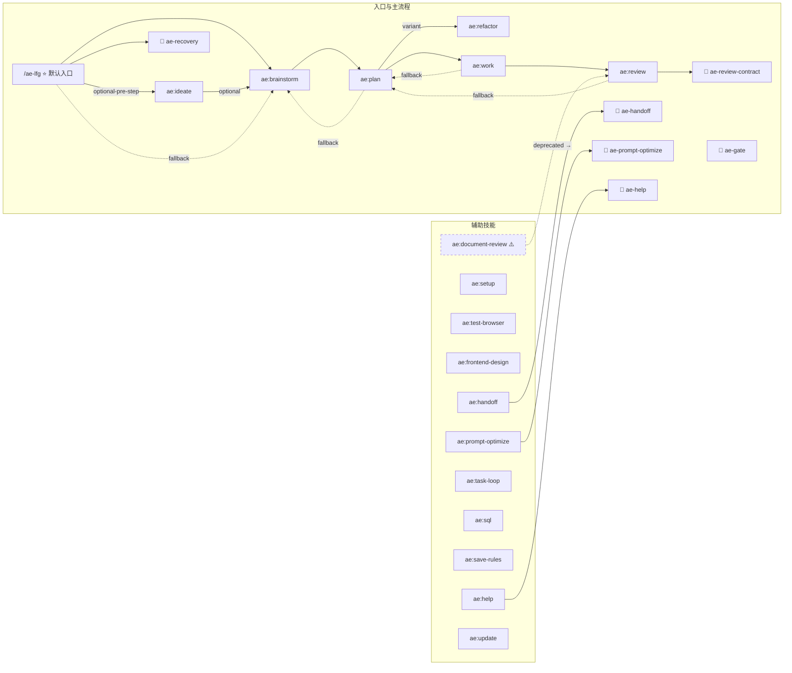

# 资产可达性图谱

> 本文档由 `npm run asset-graph` 自动生成。上次生成：2026-04-27T23:40:16.049Z

## 1. 入口与主流程



## 2. 命令与技能映射

```mermaid
graph LR
  subgraph phase_one_cmds["Phase One 命令"]
    cmd_ae-ideate["/ae-ideate → ae:ideate"]
    cmd_ae-brainstorm["/ae-brainstorm → ae:brainstorm"]
    cmd_ae-document-review["/ae-document-review → ae:review ⚠️"]
    cmd_ae-plan["/ae-plan → ae:plan"]
    cmd_ae-refactor["/ae-refactor → ae:refactor"]
    cmd_ae-work["/ae-work → ae:work"]
    cmd_ae-review["/ae-review → ae:review"]
    cmd_ae-lfg["/ae-lfg → ae:lfg"]
    cmd_ae-setup["/ae-setup → ae:setup"]
    cmd_ae-test-browser["/ae-test-browser → ae:test-browser"]
    cmd_ae-frontend-design["/ae-frontend-design → ae:frontend-design"]
    cmd_ae-handoff["/ae-handoff → ae:handoff"]
    cmd_ae-prompt-optimize["/ae-prompt-optimize → ae:prompt-optimize"]
    cmd_ae-prompt-optimize-auto["/ae-prompt-optimize-auto → ae:prompt-optimize"]
    cmd_ae-task-loop["/ae-task-loop → ae:task-loop"]
    cmd_ae-sql["/ae-sql → ae:sql"]
    cmd_ae-save-rules["/ae-save-rules → ae:save-rules"]
    cmd_ae-help["/ae-help → ae:help"]
    cmd_ae-update["/ae-update → ae:update"]
  end

  po-pa-summary["*-po / *-pa 派生命令 (17+17)"]
  disk_ae-commit["/ae-commit 📄 source:filesystem"]

  cmd_ae-document-review -.->|"deprecated"| cmd_ae-review

```



## 3. 审查代理

```mermaid
graph TB
  ae_review["ae:review"]

  subgraph sg_代码域 - 常驻["代码域 - 常驻"]
    correctness-reviewer["correctness-reviewer"]
    testing-reviewer["testing-reviewer"]
    maintainability-reviewer["maintainability-reviewer"]
    standards-reviewer["standards-reviewer"]
    research-reviewer["research-reviewer"]
  end
  ae_review -->|"alwaysOn"| correctness-reviewer
  ae_review -->|"alwaysOn"| testing-reviewer
  ae_review -->|"alwaysOn"| maintainability-reviewer
  ae_review -->|"alwaysOn"| standards-reviewer
  ae_review -->|"alwaysOn"| research-reviewer

  subgraph sg_代码域 - 条件激活["代码域 - 条件激活"]
    agent-native-reviewer["agent-native-reviewer 🔀hasCli|hasUi|hasTooling|hasAgentConfig"]
    pattern-recognition-specialist["pattern-recognition-specialist 🔀hasNewAbstraction|changedLineCountGte50"]
    performance-reviewer["performance-reviewer 🔀hasPerformance"]
    api-contract-reviewer["api-contract-reviewer 🔀hasApi"]
    reliability-reviewer["reliability-reviewer 🔀hasReliability|hasInfra"]
    data-migrations-reviewer["data-migrations-reviewer 🔀hasMigrations|hasDatabase"]
    previous-comments-reviewer["previous-comments-reviewer 🔀hasPrMetadata"]
  end
  ae_review -.-> agent-native-reviewer
  ae_review -.-> pattern-recognition-specialist
  ae_review -.-> performance-reviewer
  ae_review -.-> api-contract-reviewer
  ae_review -.-> reliability-reviewer
  ae_review -.-> data-migrations-reviewer
  ae_review -.-> previous-comments-reviewer

  subgraph sg_文档域 - 常驻["文档域 - 常驻"]
    coherence-reviewer["coherence-reviewer"]
    feasibility-reviewer["feasibility-reviewer"]
  end
  ae_review -->|"alwaysOn"| coherence-reviewer
  ae_review -->|"alwaysOn"| feasibility-reviewer

  subgraph sg_文档域 - 条件激活["文档域 - 条件激活"]
    product-lens-reviewer["product-lens-reviewer 🔀documentType|requirementCountGte5|hasProductClaim"]
    step-granularity-reviewer["step-granularity-reviewer 🔀documentType|requirementCountGte5"]
    design-lens-reviewer["design-lens-reviewer 🔀hasUi"]
    test-case-reviewer["test-case-reviewer 🔀documentType"]
  end
  ae_review -.-> product-lens-reviewer
  ae_review -.-> step-granularity-reviewer
  ae_review -.-> design-lens-reviewer
  ae_review -.-> test-case-reviewer

  subgraph sg_双域 (both)["双域 (both)"]
    security-reviewer["security-reviewer 🔀hasSecurity"]
    adversarial-reviewer["adversarial-reviewer 🔀changedLineCountGte50|hasSecurity|hasApi|requirementCountGte5|hasArchitectureDecision|isHighRiskDomain|hasNewAbstraction"]
    architecture-strategist["architecture-strategist 🔀kind+hasArchitectureDecision|kind+hasNewAbstraction|kind+changedLineCountGte50|kind+documentType+hasArchitectureDecision"]
  end
  ae_review -.-> security-reviewer
  ae_review -.-> adversarial-reviewer
  ae_review -.-> architecture-strategist

  subgraph other_agents["其他代理 (非 REVIEW_MATRIX)"]
    repo-research-analyst["repo-research-analyst (research)"]
    web-researcher["web-researcher (research)"]
    spec-flow-analyzer["spec-flow-analyzer (workflow)"]
    design-iterator["design-iterator ⚡gilded (workflow)"]
    figma-design-sync["figma-design-sync ⚡gilded (workflow)"]
  end

```

## 4. 风险诊断

### 4.1 unreachable（不可达资产）

**状态:** 🔴 发现

| 条目 | 详情 | 已检查数据源 | 推荐修复 |
|------|------|-------------|----------|
| repo-research-analyst | 非审查域代理，无结构化工作流路径 (stage: research)，依赖 LLM 运行时按需调用 | 节点集, 边集, BFS 遍历, REVIEW_MATRIX, ae-catalog.ts | 确认是否为预期；如需结构化可达，添加 skill→agent 边 |
| web-researcher | 非审查域代理，无结构化工作流路径 (stage: research)，依赖 LLM 运行时按需调用 | 节点集, 边集, BFS 遍历, REVIEW_MATRIX, ae-catalog.ts | 确认是否为预期；如需结构化可达，添加 skill→agent 边 |
| spec-flow-analyzer | 非审查域代理，无结构化工作流路径 (stage: workflow)，依赖 LLM 运行时按需调用 | 节点集, 边集, BFS 遍历, REVIEW_MATRIX, ae-catalog.ts | 确认是否为预期；如需结构化可达，添加 skill→agent 边 |
| design-iterator | 非审查域代理，无结构化工作流路径 (stage: workflow)，依赖 LLM 运行时按需调用 | 节点集, 边集, BFS 遍历, REVIEW_MATRIX, ae-catalog.ts | 确认是否为预期；如需结构化可达，添加 skill→agent 边 |
| figma-design-sync | 非审查域代理，无结构化工作流路径 (stage: workflow)，依赖 LLM 运行时按需调用 | 节点集, 边集, BFS 遍历, REVIEW_MATRIX, ae-catalog.ts | 确认是否为预期；如需结构化可达，添加 skill→agent 边 |
| ae-gate | 无结构化路径可达 (type: tool) | 节点集, 边集, BFS 遍历 | 检查是否应删除或添加引用 |

**已检查数据源:** 节点集, 边集, BFS 遍历（含/不含条件边）

### 4.2 broken-ref（引用断裂）

**状态:** 🔴 发现

| 条目 | 详情 | 已检查数据源 | 推荐修复 |
|------|------|-------------|----------|
| ae-static-preview | 磁盘目录存在但常量中未声明 (orphan-directory) | 文件系统目录扫描, SKILL 常量 | 在 SKILL 常量中注册，或删除该目录 |

**已检查数据源:** SKILL/AGENT 常量, PHASE_ONE_ENTRIES, 文件系统目录扫描

### 4.3 duplicate-entry（重复入口）

**状态:** 🔴 发现

| 条目 | 详情 | 已检查数据源 | 推荐修复 |
|------|------|-------------|----------|
| ae:prompt-optimize | 多个命令指向同一技能: ae-prompt-optimize, ae-prompt-optimize-auto | PHASE_ONE_ENTRIES (ae-catalog.ts) | 评估是否应标注为 deprecated 并指向唯一入口 |

**已检查数据源:** PHASE_ONE_ENTRIES (ae-catalog.ts)

### 4.4 deprecated（已废弃）

**状态:** 🔴 发现

| 条目 | 详情 | 已检查数据源 | 推荐修复 |
|------|------|-------------|----------|
| ae:document-review | customTemplate 重定向 → ae:review | PHASE_ONE_ENTRIES customTemplate (ae-catalog.ts) | 评估是否移除注册或更新引用 |

**已检查数据源:** PHASE_ONE_ENTRIES customTemplate (ae-catalog.ts), SKILL.md frontmatter (deprecated 字段)

### 4.5 low-reach（低触达率）

**状态:** 🔴 发现

| 条目 | 详情 | 已检查数据源 | 推荐修复 |
|------|------|-------------|----------|
| security-reviewer | 条件激活 (domain: both): hasSecurity | REVIEW_MATRIX (review-catalog.ts) | 确认是否为期望的低频激活 |
| adversarial-reviewer | 条件激活 (domain: both): changedLineCountGte50 | hasSecurity | hasApi | requirementCountGte5 | hasArchitectureDecision | isHighRiskDomain | hasNewAbstraction | REVIEW_MATRIX (review-catalog.ts) | 确认是否为期望的低频激活 |
| agent-native-reviewer | 条件激活 (domain: code): hasCli | hasUi | hasTooling | hasAgentConfig | REVIEW_MATRIX (review-catalog.ts) | 确认是否为期望的低频激活 |
| architecture-strategist | 条件激活 (domain: both): kind+hasArchitectureDecision | kind+hasNewAbstraction | kind+changedLineCountGte50 | kind+documentType+hasArchitectureDecision | REVIEW_MATRIX (review-catalog.ts) | 确认是否为期望的低频激活 |
| pattern-recognition-specialist | 条件激活 (domain: code): hasNewAbstraction | changedLineCountGte50 | REVIEW_MATRIX (review-catalog.ts) | 确认是否为期望的低频激活 |
| performance-reviewer | 条件激活 (domain: code): hasPerformance | REVIEW_MATRIX (review-catalog.ts) | 确认是否为期望的低频激活 |
| api-contract-reviewer | 条件激活 (domain: code): hasApi | REVIEW_MATRIX (review-catalog.ts) | 确认是否为期望的低频激活 |
| reliability-reviewer | 条件激活 (domain: code): hasReliability | hasInfra | REVIEW_MATRIX (review-catalog.ts) | 确认是否为期望的低频激活 |
| data-migrations-reviewer | 条件激活 (domain: code): hasMigrations | hasDatabase | REVIEW_MATRIX (review-catalog.ts) | 确认是否为期望的低频激活 |
| previous-comments-reviewer | 条件激活 (domain: code): hasPrMetadata | REVIEW_MATRIX (review-catalog.ts) | 确认是否为期望的低频激活 |
| product-lens-reviewer | 条件激活 (domain: document): documentType | requirementCountGte5 | hasProductClaim | REVIEW_MATRIX (review-catalog.ts) | 确认是否为期望的低频激活 |
| step-granularity-reviewer | 条件激活 (domain: document): documentType | requirementCountGte5 | REVIEW_MATRIX (review-catalog.ts) | 确认是否为期望的低频激活 |
| design-lens-reviewer | 条件激活 (domain: document): hasUi | REVIEW_MATRIX (review-catalog.ts) | 确认是否为期望的低频激活 |
| test-case-reviewer | 条件激活 (domain: document): documentType | REVIEW_MATRIX (review-catalog.ts) | 确认是否为期望的低频激活 |
| design-iterator | gilded 层级 (stage: workflow) | GILDED_AGENTS (ae-catalog.ts) | 确认是否为期望的低频代理 |
| figma-design-sync | gilded 层级 (stage: workflow) | GILDED_AGENTS (ae-catalog.ts) | 确认是否为期望的低频代理 |

**已检查数据源:** REVIEW_MATRIX alwaysOn (review-catalog.ts), GILDED_AGENTS tier (ae-catalog.ts)

## 5. 代理可达性表

| 代理名 | 域 | 触达方式 | 入口路径摘要 |
|--------|-----|---------|-------------|
| coherence-reviewer | document | alwaysOn | ae:review → (alwaysOn) |
| feasibility-reviewer | document | alwaysOn | ae:review → (alwaysOn) |
| product-lens-reviewer | document | conditional | ae:review → (条件: documentType | requirementCountGte5 | hasProductClaim) |
| adversarial-reviewer | both | conditional | ae:review → (条件: changedLineCountGte50 | hasSecurity | hasApi | requirementCountGte5 | hasArchitectureDecision | isHighRiskDomain | hasNewAbstraction) |
| design-lens-reviewer | document | conditional | ae:review → (条件: hasUi) |
| security-reviewer | both | conditional | ae:review → (条件: hasSecurity) |
| step-granularity-reviewer | document | conditional | ae:review → (条件: documentType | requirementCountGte5) |
| test-case-reviewer | document | conditional | ae:review → (条件: documentType) |
| repo-research-analyst | research | runtime 可用 | LLM 运行时按需调用 (非结构化边) |
| research-reviewer | code | alwaysOn | ae:review → (alwaysOn) |
| web-researcher | research | runtime 可用 | LLM 运行时按需调用 (非结构化边) |
| spec-flow-analyzer | workflow | runtime 可用 | LLM 运行时按需调用 (非结构化边) |
| correctness-reviewer | code | alwaysOn | ae:review → (alwaysOn) |
| testing-reviewer | code | alwaysOn | ae:review → (alwaysOn) |
| standards-reviewer | code | alwaysOn | ae:review → (alwaysOn) |
| agent-native-reviewer | code | conditional | ae:review → (条件: hasCli | hasUi | hasTooling | hasAgentConfig) |
| api-contract-reviewer | code | conditional | ae:review → (条件: hasApi) |
| reliability-reviewer | code | conditional | ae:review → (条件: hasReliability | hasInfra) |
| maintainability-reviewer | code | alwaysOn | ae:review → (alwaysOn) |
| performance-reviewer | code | conditional | ae:review → (条件: hasPerformance) |
| architecture-strategist | both | conditional | ae:review → (条件: kind+hasArchitectureDecision | kind+hasNewAbstraction | kind+changedLineCountGte50 | kind+documentType+hasArchitectureDecision) |
| pattern-recognition-specialist | code | conditional | ae:review → (条件: hasNewAbstraction | changedLineCountGte50) |
| data-migrations-reviewer | code | conditional | ae:review → (条件: hasMigrations | hasDatabase) |
| previous-comments-reviewer | code | conditional | ae:review → (条件: hasPrMetadata) |
| design-iterator | workflow | low-reach (gilded) | LLM 运行时按需调用 |
| figma-design-sync | workflow | low-reach (gilded) | LLM 运行时按需调用 |

## 6. 覆盖边界

### 已覆盖数据源

- SKILL / COMMAND / AGENT / TOOL 常量 (`ae-asset-schema.ts`)
- PHASE_ONE_ENTRIES (`ae-catalog.ts`)
- REVIEW_MATRIX (`review-catalog.ts`)
- SKILL.md frontmatter（name, description 等字段）
- 文件系统目录扫描（skills/, agents/, commands/）
- recovery-service.ts 源码文本提取（`fallbackSkillForPhase`）⚠️ 手动同步点

### 未覆盖数据源

- SKILL.md 正文中的 `ae:*` / `@agent` 引用
- Agent prompt 正文中的技能/工具引用
- README 等自由文本引用

> **未覆盖 ≠ 确认安全** — 以上未覆盖数据源中可能存在额外的引用关系。

## 7. 鲜度声明

- **生成时间:** 2026-04-27T23:40:16.047Z
- **已扫描目录:** `src/assets/skills/`, `src/assets/agents/`, `src/assets/commands/`, `src/services/recovery-service.ts`
- **更新命令:** `npm run asset-graph`

## 8. 演进建议

- **CI 门禁:** 在 CI 中运行 `npm run asset-graph` 并检查风险条目
- **自诊断命令:** 将风险摘要集成到 `/ae-help` 输出
- **自然语言弱证据扩展:** 解析 SKILL.md 正文中的 `ae:*` 和 `@agent` 引用作为弱边
- **recovery 映射自动化:** 导出 `fallbackSkillForPhase` 消除源码文本提取的手动同步点
