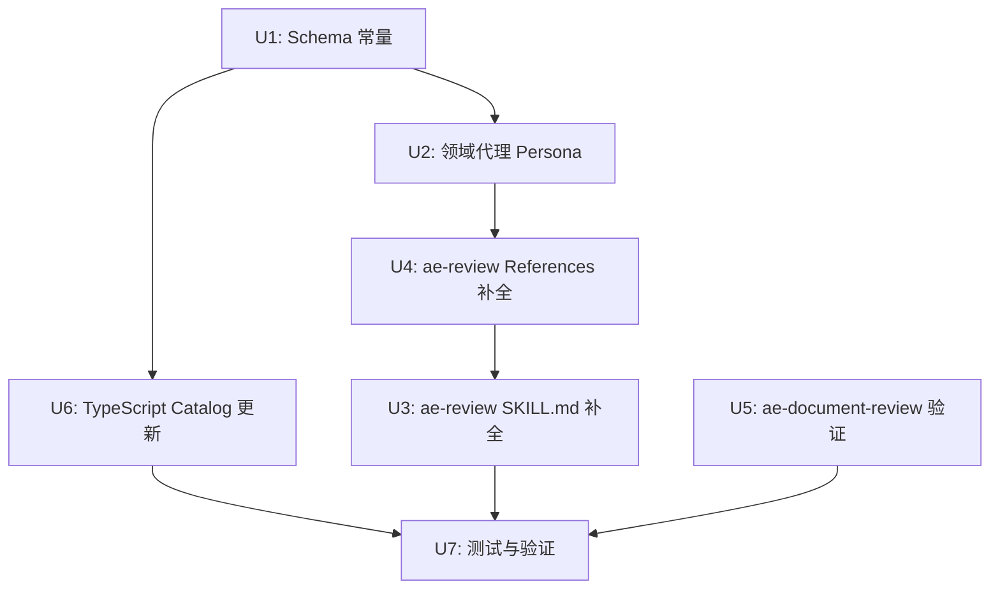

# ae-review 技能结构性更新计划

## 概览

基于需求文档 R1-R20，对 ae-review 技能进行结构性更新。核心变更：引入审查状态文件、完善范围检测参数、为非代码文件新增 4 个领域代理、通用化 ae-document-review。

### 已完成工作的评估

需求文档编写期间，SKILL.md 和 references 已先行调整。以下需求已**基本实现**，本计划中标记为「验证」，仅需确认一致性：

| 需求 | 状态 | 依据 |
|------|------|------|
| R3 resolve-base.sh 平台无关化 | ✅ 已完成 | 脚本已使用纯 Git + 可选平台 CLI |
| R4 文件路由机制 | ✅ 已完成 | `file-routing-table.md` 定义 8 条路由 |
| R6 全局审查者 | ✅ 已完成 | `persona-catalog.md` + `file-routing-table.md` |
| R10 SKILL.md 结构性更新 | ✅ 已完成 | 7 阶段编排器结构 |
| R11 移除 GitHub 特定路径 | 待验证 | 需确认 SKILL.md 无残留 |
| R15 subagent-template 双模式 | ✅ 已完成 | diff + full file 两种输入 |
| R16 findings-schema | ✅ 已完成 | 纯代码 schema，文档用独立 schema |
| R19 内容分类 | ✅ 已完成 | ae-document-review 按 frontmatter/标题/关键词分类 |

### 需要新增或补全的工作

| 类别 | 需求 | 工作量 |
|------|------|--------|
| 新增文件 | 4 个领域代理 persona | 4 个新文件 |
| Schema 常量 | ae-asset-schema.ts 新增 4 个 AGENT 常量 | 小 |
| Catalog 更新 | review-catalog.ts 新增 4 个条目 | 小 |
| SKILL.md 补全 | R1 状态文件、R2 范围检测流程、R2a 范围参数、R8-R9 全量审查、R11 GitHub 路径验证、R12 确认、R13 降级 | 中 |
| Reference 更新 | persona-catalog.md 领域代理、file-routing-table.md 领域代理引用、scope-detection.md 状态文件/参数补全、.env 排除强化 | 中 |
| ae-document-review | R18 任意路径、R20 批量场景 | 小 |
| 测试 | 新增常量/catalog 测试用例 | 小 |

## 技术决策

以下待定问题在计划阶段解决：

| 问题 | 决策 | 理由 |
|------|------|------|
| `review.defaultBase` 配置位置 | `opencode.json` | 结构化配置，resolve-base.sh 已支持读取；AGENTS.md 是自然语言指令不适合机器读取 |
| 无扩展名文件路由 | 文件名 glob 匹配 | file-routing-table.md 已使用此模式（Dockerfile、Makefile 等），无需引入正则 |
| ae-document-review 批次粒度 | 逐文件 | 每个文档独立审查、独立 schema、合并更简单；按目录分组增加复杂度但无质量收益 |
| `recent:<N>` 默认值 | 10 | 与 R2 中 HEAD==lastReviewed 行为一致 |

## 实现单元

### 依赖图



---

### U1: Schema 常量更新

**目标：** 在 ae-asset-schema.ts 中注册 4 个新领域代理常量

**需求追溯：** R7（路由定义引用领域代理）

**依赖：** 无

**文件：**
- `src/schemas/ae-asset-schema.ts`

**方法：**
1. 在 `AGENT` 对象中新增 4 个常量：
   - `CONFIG_REVIEWER: 'config-reviewer'`
   - `INFRA_REVIEWER: 'infra-reviewer'`
   - `DATABASE_REVIEWER: 'database-reviewer'`
   - `SCRIPT_REVIEWER: 'script-reviewer'`
2. 放置位置：在现有 code-review 常量块之后，按路由表中出现的顺序排列

**需遵循的模式：**
- 使用 `as const` 对象，值与目录名/文件名一致
- 添加到 `AGENT` 对象而非新建对象

**测试场景：**
- 常量值与预期字符串匹配
- Zod enum 校验通过

**验证：** `npm run typecheck` 通过

---

### U2: 领域代理 Persona 文件

**目标：** 创建 4 个领域专用审查者的 Markdown persona 文件

**需求追溯：** R7（config/infra/database/script 路由的领域代理）

**依赖：** U1

**文件：**
- `src/assets/agents/review/config-reviewer.md`（新建）
- `src/assets/agents/review/infra-reviewer.md`（新建）
- `src/assets/agents/review/database-reviewer.md`（新建）
- `src/assets/agents/review/script-reviewer.md`（新建）

**方法：**

每个文件遵循现有 persona 格式（参考 `correctness-reviewer.md` 的结构）：

1. **config-reviewer** — 校验范围：
   - JSON/YAML/TOML/XML 语法正确性
   - Schema 一致性（字段类型、嵌套结构）
   - 必填字段完整性
   - 敏感值检测（硬编码密码/token/密钥）
   - 配置值合理性（端口号范围、路径存在性）

2. **infra-reviewer** — 校验范围：
   - Dockerfile 最佳实践（镜像标签、非 root 用户、多阶段构建、层缓存）
   - CI 工作流完整性（缓存策略、失败处理、超时设置）
   - Terraform 资源依赖和状态管理
   - 环境变量和密钥管理

3. **database-reviewer** — 校验范围：
   - 迁移可逆性（回滚脚本存在性和正确性）
   - 数据完整性约束（外键、唯一约束、检查约束）
   - 索引策略（缺失索引、冗余索引、复合索引列顺序）
   - Prisma schema 关系正确性

4. **script-reviewer** — 校验范围：
   - Shell 可移植性（bash vs sh 差异、POSIX 兼容性）
   - 幂等性（重复执行安全性）
   - 平台兼容性（Unix vs Windows 路径分隔符、换行符）
   - 环境变量依赖（必需变量检查、默认值）

**需遵循的模式：**
- 文件名与 `AGENT` 常量值完全一致
- 包含 YAML frontmatter：`name`、`type: subagent`
- 使用条件性激活角色模式（参考 `security-reviewer.md` 的条件触发写法）
- 输出格式遵循 `findings-schema.json`

**测试场景：**
- 文件名与常量值一致
- frontmatter 格式正确
- persona 描述覆盖需求 R7 中定义的校验范围

**验证：** 构建后检查 `.opencode/agents/ae/` 目录是否包含 4 个新文件

---

### U3: ae-review SKILL.md 补全

**目标：** 补全 SKILL.md 中缺失的需求：状态文件读写、范围参数、透明确认、友好降级

**需求追溯：** R1（状态文件）、R2（范围检测流程）、R2a（范围参数）、R8-R9（全量审查）、R11（GitHub 路径验证）、R12（确认）、R13（降级）

> **注意：** R2a 是 R2 的子需求，在需求文档中独立编号。

**依赖：** U4（references 需先就绪）

**文件：**
- `src/assets/skills/ae-review/SKILL.md`

**方法：**

1. **Phase 0（参数解析）增强：**
   - 新增 `recent:<N>` / `full` / `full:<path>` 参数到 Phase 0 参数表
   - 新增 `recent:<N>` 参数校验：N 必须为正整数，无效输入回退到默认值 10 并提示用户
   - 新增 `from:<ref>` 输入校验（拒绝 shell 元字符 `;|&$\`` ）

2. **Phase 1（范围检测）修改：**
   - 修改 scope-detection.md 状态文件 schema：新增 `branch` 字段及分支匹配逻辑
   - 修改 scope-detection.md 优先级 2：HEAD==lastReviewed 无变更行为从「全项目审查」改为「审查最近 10 次提交」
   - 新增 scope-detection.md 范围参数段：记录 from/recent/full/full:<path> 的完整行为

3. **Phase 1.5（新增）透明确认（R12）：**
   - 范围检测成功后，展示：基准 ref、变更文件数、变更行数、活跃路由组
   - 提供选项：确认开始 / 修正范围 / 查看文件列表
   - headless 模式跳过确认

3. **Phase 1.5b（新增）友好降级（R13）：**
   - 检测失败时提供选项：审查最近 N 次提交 / 仅工作区 / 手动指定 / 查看提交历史
   - 不报错终止，而是引导用户选择

4. **全量审查模式（R8-R9）：**
   - `full` 参数：`git ls-files` 获取所有跟踪文件，受全局排除约束
   - `full:<path>` 参数：限定路径下的跟踪文件
   - 审查者收到完整文件内容（非 diff）

5. **Phase 7 后状态文件写入（R1）：**
   - 审查完成后写入 `{ branch, lastReviewed, lastReviewTime }`
   - 确认 `.gitignore` 包含 `.opencode/review-state.json`

**需遵循的模式：**
- 保持 7 阶段骨架不变
- 新增逻辑以子阶段形式插入（如 Phase 1.5）
- 参考 `scope-detection.md` 中的优先级链

**测试场景：**
- 首次运行（无状态文件）→ 走 resolve-base.sh 或降级
- 状态文件 branch 不匹配 → 视为首次运行
- HEAD==lastReviewed 无变更 → recent:10
- HEAD==lastReviewed 有变更 → 仅工作区
- HEAD≠lastReviewed → diff + 工作区
- `full` 参数 → 全量审查
- `from:abc;rm -rf` → 拒绝（输入校验）

**验证：** 完整阅读 SKILL.md 确认所有 R1-R13 覆盖

---

### U4: ae-review References 补全

**目标：** 更新 references 文件，反映领域代理和排除强化

**需求追溯：** R5（排除）、R7（路由+领域代理）、R14（persona-catalog）、R17（output template）

**依赖：** U2（领域代理 persona 需先存在）

**文件：**
- `src/assets/skills/ae-review/references/persona-catalog.md`
- `src/assets/skills/ae-review/references/file-routing-table.md`
- `src/assets/skills/ae-review/references/scope-detection.md`
- `src/assets/skills/ae-review/references/synthesis-and-presentation.md`
- `src/assets/skills/ae-review/references/review-output-template.md`

**方法：**

1. **persona-catalog.md（R14）：**
   - 在条件审查者区域新增「领域专用」分组
   - 列出 config-reviewer、infra-reviewer、database-reviewer、script-reviewer
   - 每个标注激活条件（对应路由激活时）

2. **file-routing-table.md（R5 + R7）：**
   - 在配置/基础设施/数据库/脚本 4 条路由中**新增**领域代理引用（config-reviewer / infra-reviewer / database-reviewer / script-reviewer），格式参照需求 R7
   - 强化 .env 排除说明：在文件收集阶段即从列表移除，而非仅在内容读取时跳过

3. **scope-detection.md（R1 + R2 + R2a）：**
   - **修改**状态文件 schema：新增 `branch` 字段及分支匹配逻辑
   - **修改**优先级 2：HEAD==lastReviewed 无变更行为从「全项目审查」改为「recent:10」
   - **新增**范围参数段：记录 from/recent/full/full:<path> 的完整行为和校验规则
   - **新增** recent 默认值 10 的说明

4. **synthesis-and-presentation.md（R8-R9）：**
   - 确认全量审查模式的合成流程（完整文件 vs diff 的发现格式差异）
   - 确认状态文件写入时机（Phase 7 之后）

5. **review-output-template.md（R17）：**
   - 确认文档发现使用独立展示格式（section 而非 file:line）
   - 确认路由分组展示

**需遵循的模式：**
- 代理名称使用 `AGENT` 常量值（与 ae-asset-schema.ts 一致）
- 排除规则在路由表和 SKILL.md 中保持一致

**测试场景：**
- 领域代理名称与 ae-asset-schema.ts 常量完全一致
- .env 排除在 file-routing-table 和 SKILL.md 中描述一致
- 路由表 8 条路由完整无遗漏

**验证：** 交叉比对所有 references 文件与 SKILL.md 引用

---

### U5: ae-document-review 通用化验证

**目标：** 确认 ae-document-review 已满足 R18-R20

**需求追溯：** R18（任意路径）、R19（内容分类）、R20（批量场景）

**依赖：** 无（独立于 U1-U4）

**文件：**
- `src/assets/skills/ae-document-review/SKILL.md`
- `src/assets/skills/ae-document-review/references/`（4 个文件）

**方法：**

1. **R18 验证：** 确认 SKILL.md 不再限定 `docs/ae/brainstorms/` 和 `docs/ae/plans/` 为唯一输入路径，而是优先搜索这些路径同时接受任意传入路径
2. **R19 验证：** 确认文档分类基于内容特征（frontmatter、标题结构、关键词）而非路径
3. **R20 验证：** 确认 headless 模式支持被 ae-review 调用时返回结构化发现（JSON 格式，可被调用方合并）
4. **如发现不足：** 直接在对应文件中修正

**最小验收标准（R18-R20 必须满足的行为）：**
- R18：SKILL.md 阶段 1 接受任意文件路径参数，不硬编码 `docs/ae/` 前缀检查
- R19：文档分类逻辑中，路径仅作为辅助信号，主要判断依据为 frontmatter/标题/关键词
- R20：headless 模式返回有效 JSON，包含 `reviewer`、`findings`、`residual_risks`、`deferred_questions` 四个顶层字段

若任一条不满足，在 U5 中直接修正；若修正量超过预期（>30 行变更），升级为独立实现单元。

**需遵循的模式：**
- 保持 5 阶段结构不变
- headless 模式返回纯 JSON，interactive 模式包含 Markdown 展示

**测试场景：**
- 传入 `src/README.md` → 正常审查（非 docs/ae 路径）
- 传入无 frontmatter 的 .md → 分类为 general
- headless 模式 → 返回可 JSON.parse 的结构化发现

**验证：** 完整阅读 SKILL.md 和 references 确认 R18-R20

---

### U6: TypeScript Catalog 更新

**目标：** 在 review-catalog.ts 中注册 4 个新领域代理

**需求追溯：** R7（领域代理需在 catalog 中注册）

**依赖：** U1

**文件：**
- `src/services/review-catalog.ts`
- `src/services/review-catalog.test.ts`

**方法：**

1. 在 `CODE_REVIEWERS` 数组中新增 4 个条目：
   ```typescript
   { name: AGENT.CONFIG_REVIEWER, description: '...', alwaysOn: false }
   { name: AGENT.INFRA_REVIEWER, description: '...', alwaysOn: false }
   { name: AGENT.DATABASE_REVIEWER, description: '...', alwaysOn: false }
   { name: AGENT.SCRIPT_REVIEWER, description: '...', alwaysOn: false }
   ```
2. 每个条目的 `description` 与 persona 文件中的一致
3. `alwaysOn: false`（仅对应路由激活时参与）

4. **review-selector.ts 决策：** 领域代理激活由 SKILL.md 路由表驱动（LLM 层），`selectCodeReviewers` 和 `ae-review-contract.tool.ts` 不新增 feature flags。理由：路由表在 SKILL.md 层完成文件类型→代理映射，TypeScript 层不需要感知文件类型。ae-review-contract.tool.ts 的返回值将通过 SKILL.md 层的路由表间接包含领域代理。

5. 更新 `review-catalog.test.ts`：
   - 验证 CODE_REVIEWERS 长度从 15 增至 19
   - 验证新条目 name 与 AGENT 常量一致
   - 验证新条目 alwaysOn 为 false

**需遵循的模式：**
- name 使用 AGENT 常量引用（非字符串字面量）
- 条目顺序与 persona-catalog.md 中「领域专用」分组一致

**测试场景：**
- CODE_REVIEWERS 包含 19 个条目
- 每个新条目的 name 可在 AGENT 常量中找到
- catalog 完整性测试通过

**验证：** `npm run test` catalog 测试通过

---

### U7: 测试与最终验证

**目标：** 确保所有变更通过类型检查、lint 和测试

**依赖：** U3, U5, U6

**方法：**

1. 运行 `npm run typecheck` — 确认无类型错误
2. 运行 `npm run test` — 确认所有测试通过
3. 运行 `npm run build` — 确认构建成功
4. 验证构建产物：
   - `.opencode/agents/ae/` 包含 4 个新代理文件
   - `.opencode/plugins/` 包含最新构建
5. 交叉验证：
   - ae-asset-schema.ts 中的 4 个常量 → review-catalog.ts 的 4 个条目 → persona 文件名 → SKILL.md/references 中的引用名称：全部一致
   - SKILL.md 覆盖 R1-R13 全部需求（含 R11 GitHub 路径残留检查：grep -i "github.com\|gh pr\|PR #\|PR URL" src/assets/skills/ae-review/ 确认无残留）
   - ae-document-review 覆盖 R18-R20 全部需求

**验证：** 全部命令退出码 0

## 风险与缓解

| 风险 | 可能性 | 影响 | 缓解 |
|------|--------|------|------|
| 领域代理 persona 质量不一致 | 中 | 中 | 严格遵循现有 persona 格式，按 correctness-reviewer.md 为模板 |
| SKILL.md 补全引入逻辑矛盾 | 低 | 高 | Phase 5 文档审查覆盖 |
| U1→U2→U4→U3 依赖链承重风险 | 低 | 高 | U1 完成后冻结 4 个 AGENT 常量名称和分类作为接口契约，后续单元以此为不可变依赖开发 |
| .env 排除在边界场景泄露 | 低 | 高 | 在 SKILL.md Phase 2 明确：文件列表阶段即移除，后续阶段不可见 |
| 大规模 PR 逐文件文档审查性能 | 低 | 中 | 文档审查通常文件数少；若变更文档 >20 个，按路由组批量合并而非逐文件派发子代理 |

## 不在范围内

- 不修改审查者人设 .md 文件内容（已有 15+4 个 persona 的行为定义）
- 不改变 4 种审查模式（interactive/autofix/report-only/headless）
- 不改变严重级别（P0-P3）和动作路由
- 不创建 TypeScript 路由表镜像（路由纯 SKILL.md 层）
- 不修改 ae-review-contract.tool.ts 和 review-selector.ts 的接口（领域代理激活由 SKILL.md 路由表驱动，TypeScript 层不需要新增 feature flags）
