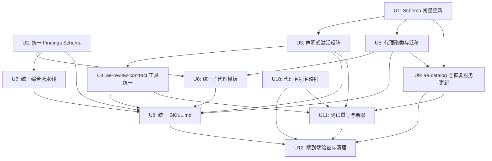

# 审查体系统一重构计划

## 概览

将 ae:review 和 ae:document-review 合并为统一技能 `ae:review`，消除双轨制（双 findings schema、双选择函数、双综合流水线、双子代理模板），聚类代理从 29 降至 25，通过重定向 SKILL.md 目录 + customTemplate 命令模板 + 代理名别名保证 ae:lfg 管道无缝运行。重定向 SKILL.md 为主要兼容机制；若 U12 验证发现 LLM 遵从率不足，则后备方案为最小修改 ae:lfg pipeline.md 步骤 3（一行变更：`ae:document-review` → `ae:review domain:document`）。

### 影响范围

- **技能**：ae:review SKILL.md + references 全面重写；ae:document-review 目录保留为重定向 SKILL.md
- **代理**：6 对合并 → 6 个新代理 .md；4 个文档代理迁入 review/；2 个重命名；保留 architecture-strategist 和 pattern-recognition-specialist
- **TypeScript**：review-catalog.ts、review-selector.ts、ae-asset-schema.ts、ae-catalog.ts、recovery-service.ts、recovery-schema.ts、ae-review-contract.tool.ts、ae-recovery.tool.ts、help-catalog-service.ts、agent-alias-map.ts（新建）
- **测试**：review-selector.test.ts、ae-catalog.test.ts、ae-asset-schema.test.ts、recovery-service.test.ts 重写；新增 review-matrix.test.ts
- **ae:lfg**：SKILL.md 和 pipeline.md 不修改——命令别名保证无缝

### 风险概况

| 风险 | 可能性 | 影响 | 缓解 |
|------|--------|------|------|
| 合并代理丢失原有关注点 | 中 | 高 | 基线回归验证 R46-R47 |
| 声明式矩阵与原双选择函数行为不等价 | 中 | 高 | 穷举激活测试 R49 |
| ae:lfg 步骤 3/5 调用断裂 | 中 | 极高 | 重定向 SKILL.md + customTemplate + 端到端验证 R51；若重定向失败则后备修改 ae:lfg pipeline.md 一行 |
| 旧审查产物无法恢复 | 低 | 中 | 代理名别名映射 R52-R53 |
| 合并后 SKILL.md 过长导致 LLM 理解衰减 | 中 | 中 | 核心流程 + 域分支结构，延迟加载 references |

## 技术决策

### TD1：ae:lfg 兼容方案——保留重定向 SKILL.md 目录

**问题：** ae:lfg 步骤 3/5 调用 `ae:document-review`。统一后只有一个 `ae:review` 技能，如何保证 ae:lfg 的调用不断裂？

**决策：** 保留 `src/assets/skills/ae-document-review/` 目录，将其 SKILL.md 内容替换为重定向指令。理由：

1. opencode 技能加载机制是：`命令模板引用 skillName → opencode 按 <skillsDir>/<skillSlug>/SKILL.md 目录查找`。ae-catalog 的 `skillFile` 字段不参与 opencode 技能加载——仅用于 AE 插件内部的帮助系统、TUI 和参数契约
2. ae:lfg 步骤 3/5 调用 `ae:document-review` → opencode 查找 `ae-document-review/SKILL.md` → 找到重定向 SKILL.md → LLM 按重定向指令调用 `ae:review domain:document`
3. DOCUMENT_REVIEW catalog 条目的 `skillName` 改为 `SKILL.REVIEW`，新增 `customTemplate` 字段注入 `domain:document`——确保 `/ae-document-review` 命令直接路由到 ae:review 技能
4. `SKILL.DOCUMENT_REVIEW` 常量保留（重定向目录名仍需常量引用），`AeSkillNameSchema` 枚举保留 `'ae:document-review'`

**重定向 SKILL.md 内容：**

```markdown
---
name: ae:document-review
description: 面向文档的专项审查（已合并到 ae:review）
---

此技能已合并到 ae:review 统一技能。请使用 ae:review 技能，并传入 domain:document 参数。

用法：ae:review domain:document [mode:*] [文档路径]
```

**替代方案（否决）：** 仅靠 ae-catalog skillFile 映射——opencode 技能加载不使用 catalog 的 skillFile，而是按目录名查找，删除目录会导致 skill 工具找不到技能

### TD2：SKILL.md references 合并为统一文件

**问题：** opencode `@./references/` 包含是技能加载时全量注入，不支持运行时条件加载。

**决策：** 将两套 references 合并为统一文件，使用标题分区（`## 代码域` / `## 文档域`），由 SKILL.md 的 LLM 执行逻辑根据 domain 选择性关注对应分区。具体合并：

| 原文件 | 合并后 | 策略 |
|--------|--------|------|
| ae-review/findings-schema.json + ae-document-review/findings-schema.json | 统一 findings-schema.json | 单一 schema，domain 判别器 |
| ae-review/synthesis-and-presentation.md + ae-document-review/synthesis-and-presentation.md | 统一 synthesis-and-presentation.md | 9 步统一流水线 |
| ae-review/subagent-template.md + ae-document-review/subagent-template.md | 统一 subagent-template.md | domain 变量分支 |
| ae-review/review-output-template.md + ae-document-review/review-output-template.md | 统一 review-output-template.md | 合并展示格式 |

不合并的文件（代码域独有）：
- scope-detection.md、file-routing-table.md、persona-catalog.md、resolve-base.sh

### TD3：traceability-reviewer 移出本轮

**问题：** R24 要求新增 traceability-reviewer，但需求文档 R48 规定若无法定义最小可行职责边界则移出。

**决策：** 移出本轮。理由：
1. 代码-文档一致性和需求-实现可追溯性检查需要明确"一致"的定义（需求 ID 在代码注释中的引用率阈值、文档 API 端点与代码路由的对应关系判定规则），当前无法定义
2. 作为独立增强提案后续跟进，不阻塞统一重构的核心价值

### TD4：声明式矩阵数据结构

**问题：** 如何将 `selectCodeReviewers()` + `selectDocumentReviewers()` 的命令式 if-链替换为声明式矩阵？

**决策：** 每个审查者行定义如下结构：

```typescript
interface MatrixEntry {
  name: string
  domain: 'code' | 'document' | 'both'
  alwaysOn: boolean
  conditionGroups?: ActivationPredicate[][]
}
```

选择函数 `selectReviewers(input)` 对每个条目：
1. `alwaysOn` → 直接包含
2. `domain === 'both'` 或 `domain === input.kind` → 检查 conditionGroups
3. `conditionGroups` 中任一组（组间 OR）的所有谓词满足（组内 AND） → 包含

`conditionGroups` 使用二维数组：外层 `some()`（OR），内层 `every()`（AND），能表达任意 OR 条件组合。例如 adversarial-reviewer 的代码域条件 `changedLineCount >= 50 || hasSecurity || hasApi` 表示为 `conditionGroups: [[changedLineCountGte50], [hasSecurity], [hasApi]]`。

`domain` 在矩阵中为 `"both"` 的审查者（合并后的 security-reviewer、adversarial-reviewer）根据 `input.kind` 切换审查重点，在 persona .md 中定义域特定段落。`conditionGroups` 中跨域审查者可组合代码域和文档域的条件组，通过 OR 语义自然统一——例如 adversarial-reviewer 的 conditionGroups 同时包含代码域条件组和文档域条件组。

### TD5：统一 ReviewSelectionInput 的 kind 维度

**问题：** R13 要求统一 CodeReviewSelectionInput 和 DocumentReviewSelectionInput。

**决策：** `kind: "code" | "document"` 作为输入维度。当 `kind === "document"` 时，ae-review-contract 的 `kind` 参数原值 `"plan" | "test" | "general" | "requirements"` 映射到 `kind: "document"` + `documentType: "plan" | "test" | "general" | "requirements"`。理由：
1. 矩阵的 `domain` 字段只需 `"code" | "document" | "both"` 三值
2. `documentType` 作为文档域的条件字段存在，参与条件谓词判断
3. ae-review-contract 工具的 `kind` 参数枚举保持不变（向后兼容），内部映射到统一 input

## 实现单元

### 依赖图



---

### U1: Schema 常量更新

**目标：** 更新 ae-asset-schema.ts 中的 AGENT/SKILL/AgentStageSchema 常量，为后续单元提供类型基础

**需求追溯：** R30

> **R30 覆盖说明：** R30 要求"删除 SKILL.DOCUMENT_REVIEW 和 COMMAND.DOCUMENT_REVIEW 常量，从 AeSkillNameSchema 枚举和 ALL_COMMAND_NAMES 中移除"，但 TD1 决策保留重定向目录——`SKILL.DOCUMENT_REVIEW` 常量用于重定向目录名引用（ae-catalog 条目 skillSlug、recovery-service 返回值），`'ae:document-review'` 枚举值用于技能加载路径匹配，删除会导致 ae:lfg 步骤 3/5 调用断裂。这是有意覆盖。

**依赖：** 无

**文件：**
- `src/schemas/ae-asset-schema.ts`

**方法：**

1. **AGENT 对象修改：**
   - 删除：`ADVERSARIAL_DOCUMENT_REVIEWER`、`KIERAN_TYPESCRIPT_REVIEWER`、`CLI_AGENT_READINESS_REVIEWER`、`SECURITY_LENS_REVIEWER`、`PRODUCT_LENS_REVIEWER`、`SCOPE_GUARDIAN_REVIEWER`、`STEP_GRANULARITY_REVIEWER`、`BATCH_OPERATION_REVIEWER`、`PROJECT_STANDARDS_REVIEWER`
   - 新增：`PRODUCT_SCOPE_REVIEWER: 'product-scope-reviewer'`、`PLAN_QUALITY_REVIEWER: 'plan-quality-reviewer'`、`STANDARDS_REVIEWER: 'standards-reviewer'`、`LEARNINGS_REVIEWER: 'learnings-reviewer'`
   - 保留：`SKILL.DOCUMENT_REVIEW`（TD1 要求保留，重定向目录名仍需常量引用）

  2. **AgentStageSchema 修改：**
     - 从 `['document-review', 'review', 'research', 'workflow']` 简化为 `['review', 'research', 'workflow']`

  3. **AeAssetEntrySchema 修改：** 新增 `customTemplate?: string` 可选字段，描述为"自定义命令模板，command-registration.ts 优先于默认模板使用"

  4. **AeSkillNameSchema 枚举：** 保留 `'ae:document-review'`（TD1：重定向目录仍需技能名枚举）

  5. **常量顺序：** 合并后的代理常量按主流程优先原则排列在对应分组中

  6. **现有常量保留：** `ARCHITECTURE_STRATEGIST` 和 `PATTERN_RECOGNITION_SPECIALIST` 已存在于 AGENT 对象中，保留不变——前者纳入 REVIEW_MATRIX 条件文档域，后者不纳入矩阵（供手动 @引用 使用）

**测试场景：**
- AGENT 对象不含已删除常量
- AGENT 对象包含新增常量且值正确
- AgentStageSchema 不含 `'document-review'`
- AeSkillNameSchema 仍含 `'ae:document-review'`
- AeAssetEntrySchema 含 `customTemplate` 可选字段
- `npm run typecheck` 通过

**验证：** `npm run typecheck` 通过（预期有编译错误，因为引用文件尚未更新——执行 `npm run typecheck 2>&1` 记录错误数量和涉及文件列表，作为 U3/U5/U9 的验收基线写入本文档）

---

### U2: 统一 Findings Schema

**目标：** 合并代码和文档两套 findings-schema.json 为统一 schema

**需求追溯：** R1-R8

**依赖：** 无（独立于 U1，因为 findings-schema.json 是 JSON 文件不引用 TS 常量）

**文件：**
- `src/assets/skills/ae-review/references/findings-schema.json`（重写）
- 删除 `src/assets/skills/ae-document-review/references/findings-schema.json`

**方法：**

1. **统一 schema 结构：**

```json
{
  "type": "object",
  "required": ["reviewer", "findings", "residual_risks"],
  "properties": {
    "reviewer": { "type": "string" },
    "findings": {
      "type": "array",
      "items": {
        "type": "object",
        "required": ["title", "severity", "domain", "location", "why_it_matters", "finding_type", "autofix_class", "confidence", "evidence"],
        "properties": {
          "title": { "type": "string", "maxLength": 100 },
          "severity": { "enum": ["P0", "P1", "P2", "P3"] },
          "domain": { "enum": ["code", "document"] },
          "location": {
            "oneOf": [
              {
                "type": "object",
                "required": ["type", "file", "line"],
                "properties": {
                  "type": { "const": "code" },
                  "file": { "type": "string" },
                  "line": { "type": "integer", "minimum": 1 }
                }
              },
              {
                "type": "object",
                "required": ["type", "file", "section"],
                "properties": {
                  "type": { "const": "document" },
                  "file": { "type": "string" },
                  "section": { "type": "string" }
                }
              }
            ]
          },
          "why_it_matters": { "type": "string" },
          "finding_type": { "enum": ["error", "omission", "pre-existing"] },
          "autofix_class": { "enum": ["auto", "gated", "manual", "advisory"] },
          "suggested_fix": { "type": ["string", "null"] },
          "confidence": { "type": "number", "minimum": 0.0, "maximum": 1.0 },
          "evidence": { "type": "array", "items": { "type": "string" }, "minItems": 1 },
          "owner": { "type": "string", "enum": ["review-fixer", "downstream-resolver", "human", "release"] },
          "requires_verification": { "type": "boolean" },
          "deferred_questions": { "type": "array", "items": { "type": "string" } }
        }
      }
    },
    "residual_risks": { "type": "array", "items": { "type": "string" } },
    "testing_gaps": { "type": "array", "items": { "type": "string" } },
    "deferred_questions": { "type": "array", "items": { "type": "string" } }
  }
}
```

2. **域特定字段规则（_meta 中说明，不作为 schema 约束）：**
   - 代码域：`owner`、`requires_verification` 为必填语义（schema 层可选，综合流水线校验）
   - 文档域：`deferred_questions` 为顶层字段
   - `location.type` 必须与 `domain` 一致（综合流水线校验，R1 自定义校验）

3. **autofix_class 映射规则（_meta 中记录 R4）：**
   - safe_auto → auto，gated_auto → gated，manual → manual，advisory → advisory
   - 文档 auto → auto，文档 present → gated

4. **finding_type 映射（R5）：**
   - 代码域 `pre_existing: true` → `finding_type: "pre-existing"`
   - 文档域原 `finding_type: "error" | "omission"` 保留

5. **降级规则（R8）：** `auto` 类发现无 `suggested_fix` → 降级为 `gated`，标记 `auto-downgraded-to-gated`

**测试场景：**
- 代码域发现：domain="code"、location.type="code"、有 file+line、有 owner+requires_verification → 校验通过
- 文档域发现：domain="document"、location.type="document"、有 file+section、无 owner → 校验通过
- 混合域校验：domain="code" 但 location.type="document" → 综合流水线报错
- autofix_class 只有 auto/gated/manual/advisory 四值
- finding_type 含 pre-existing

**验证：** JSON schema 合法性校验通过

---

### U3: 声明式激活矩阵

**目标：** 将 review-catalog.ts + review-selector.ts 重构为声明式矩阵 + 统一选择函数

**需求追溯：** R9-R13

**依赖：** U1

**文件：**
- `src/services/review-catalog.ts`（重写）
- `src/services/review-selector.ts`（重写）
- 删除 `src/services/review-catalog.test.ts`（被 U11 新测试替代）

**方法：**

1. **定义统一 ReviewSelectionInput：**

```typescript
export interface ReviewSelectionInput {
  kind: 'code' | 'document'
  documentType?: 'requirements' | 'plan' | 'test' | 'general'
  changedLineCount?: number
  hasSecurity?: boolean
  hasPerformance?: boolean
  hasApi?: boolean
  hasReliability?: boolean
  hasCli?: boolean
  hasPrMetadata?: boolean
  hasTypescript?: boolean
  hasMigrations?: boolean
  hasConfig?: boolean
  hasInfra?: boolean
  hasDatabase?: boolean
  hasScript?: boolean
  hasUi?: boolean
  requirementCount?: number
  hasArchitectureDecision?: boolean
  isHighRiskDomain?: boolean
  hasNewAbstraction?: boolean
  requirementCountGte5?: boolean
  changedLineCountGte50?: boolean
}
```

2. **定义 MatrixEntry 和谓词模型：**

```typescript
export type PredicateOperator = 'truthy' | 'eq' | 'oneOf'

export interface ActivationPredicate {
  field: keyof ReviewSelectionInput
  operator: PredicateOperator
  value?: unknown
}

export interface MatrixEntry {
  name: string
  domain: 'code' | 'document' | 'both'
  alwaysOn: boolean
  conditionGroups?: ActivationPredicate[][]
  description: string
}
```

3. **构建 REVIEW_MATRIX：** 合并当前 CODE_REVIEWERS + DOCUMENT_REVIEWERS 为单一数组，每个条目标注 domain 和激活条件。矩阵行顺序与代理目录一致。

   **代码域 alwaysOn：** correctness-reviewer、testing-reviewer、maintainability-reviewer、standards-reviewer、agent-native-reviewer、learnings-reviewer

   **文档域 alwaysOn：** coherence-reviewer、feasibility-reviewer

   **跨域（domain: both）：** security-reviewer（合并后）、adversarial-reviewer（合并后）

   **条件激活示例：**
   - `security-reviewer`：domain=both，conditionGroups=[[{field:"hasSecurity", operator:"truthy"}]]
   - `adversarial-reviewer`：domain=both，conditionGroups=[[{field:"changedLineCountGte50", operator:"truthy"}], [{field:"hasSecurity", operator:"truthy"}], [{field:"hasApi", operator:"truthy"}], [{field:"requirementCountGte5", operator:"truthy"}], [{field:"hasArchitectureDecision", operator:"truthy"}], [{field:"isHighRiskDomain", operator:"truthy"}], [{field:"hasNewAbstraction", operator:"truthy"}]]——组间 OR，涵盖代码域（changedLineCountGte50 || hasSecurity || hasApi）和文档域（requirementCountGte5 || hasArchitectureDecision || isHighRiskDomain || hasNewAbstraction）
   - `product-scope-reviewer`：domain=document，conditionGroups=[[{field:"documentType", operator:"eq", value:"plan"}], [{field:"requirementCountGte5", operator:"truthy"}]]——原 product-lens + scope-guardian 的两条 OR 激活路径
   - `data-migrations-reviewer`：domain=code，conditionGroups=[[{field:"hasMigrations", operator:"truthy"}]]
   - `config-reviewer`：domain=code，conditionGroups=[[{field:"hasConfig", operator:"truthy"}]]
   - `architecture-strategist`：domain=document，conditionGroups=[[{field:"hasArchitectureDecision", operator:"truthy"}]]

4. **requirementCount >= 5 的处理：** 初始谓词模型仅支持 truthy/eq/oneOf（R11）。对于 `requirementCount >= 5` 这种阈值条件，在 selectReviewers 函数中增加一个预处理步骤：将 `requirementCount` 转换为 `requirementCountGte5: boolean` 布尔标志，然后 conditionGroups 引用 `requirementCountGte5` + `truthy`。同理 `changedLineCount >= 50` → `changedLineCountGte50: boolean`。

5. **统一 selectReviewers(input)：**

```typescript
export function selectReviewers(input: ReviewSelectionInput): string[] {
  const derived: ReviewSelectionInput = {
    ...input,
    requirementCountGte5: (input.requirementCount ?? 0) >= 5,
    changedLineCountGte50: (input.changedLineCount ?? 0) >= 50,
  }
  const selected: string[] = []
  for (const entry of REVIEW_MATRIX) {
    if (matchesEntry(entry, derived)) {
      selected.push(entry.name)
    }
  }
  return selected
}

function matchesEntry(entry: MatrixEntry, input: ReviewSelectionInput): boolean {
  if (entry.domain !== 'both' && entry.domain !== input.kind) return false
  if (entry.alwaysOn) return true
  if (!entry.conditionGroups || entry.conditionGroups.length === 0) return false
  return entry.conditionGroups.some((group) =>
    group.every((pred) => evaluatePredicate(pred, input))
  )
}
```

6. **删除旧接口：** 删除 `DocumentReviewSelectionInput`、`CodeReviewSelectionInput`、`selectDocumentReviewers()`、`selectCodeReviewers()`、`CODE_REVIEWERS`、`DOCUMENT_REVIEWERS`

**需遵循的模式：**
- name 使用 AGENT 常量引用
- 条件字段名与 ReviewSelectionInput 属性名一致
- `conditionGroups` 二维数组：组间 OR（`some`），组内 AND（`every`）
- `gte` 阈值预处理模式：布尔派生字段 + truthy 谓词

**测试场景：**
- 等价性测试：对原 selectDocumentReviewers 的每个测试用例，验证 selectReviewers({kind:"document", ...}) 返回相同结果
- 等价性测试：对原 selectCodeReviewers 的每个测试用例，验证 selectReviewers({kind:"code", ...}) 返回相同结果
- 新增：hasConfig=true 激活 config-reviewer
- 新增：hasInfra=true 激活 infra-reviewer
- 新增：domain=both 的审查者在两种 kind 下均可见
- 边界：kind="document" 不激活代码域 alwaysOn 审查者
- OR 条件：adversarial-reviewer 在 hasSecurity=true 时激活（无需 changedLineCountGte50）
- OR 条件：product-scope-reviewer 在 documentType="plan" 时激活（无需 requirementCountGte5）

**验证：** `npm run typecheck` 通过

---

### U4: ae-review-contract 工具统一

**目标：** 消除工具的双重分派，统一调用 selectReviewers()

**需求追溯：** R15

**依赖：** U3

**文件：**
- `src/tools/ae-review-contract.tool.ts`

**方法：**

1. **新增 args：** `has_config`、`has_infra`、`has_database`、`has_script`、`has_migrations` 五个可选布尔参数（R15）

2. **消除双重分派：** 删除 `args.kind === 'code' ? selectCodeReviewers(...) : selectDocumentReviewers(...)` 分支，替换为统一调用：

```typescript
const kind = args.kind === 'code' ? 'code' : 'document'
const documentType = kind === 'document'
  ? (args.kind === 'plan' ? 'plan' : args.kind === 'test' ? 'test' : args.kind === 'general' ? 'general' : args.kind === 'requirements' ? 'requirements' : 'requirements')
  : undefined

const reviewers = selectReviewers({
  kind,
  documentType,
  hasSecurity: args.has_security,
  hasUi: args.has_ui,
  hasCli: args.has_cli,
  hasTypescript: args.has_typescript,
  hasPerformance: args.has_performance,
  hasApi: args.has_api,
  hasReliability: args.has_reliability,
  hasPrMetadata: args.has_pr_metadata,
  changedLineCount: args.changed_lines,
  requirementCount: args.requirement_count,
  hasArchitectureDecision: args.has_architecture_decision,
  isHighRiskDomain: args.is_high_risk_domain,
  hasNewAbstraction: args.has_new_abstraction,
  hasConfig: args.has_config,
  hasInfra: args.has_infra,
  hasDatabase: args.has_database,
  hasScript: args.has_script,
  hasMigrations: args.has_migrations,
})
```

3. **gate 消息统一：** 删除 kind 条件分支，统一为 `"P0/P1 默认阻断；文档域作为质量门控"`

4. **返回值增强：** 工具返回的 JSON 中增加 `documentType` 字段——当 `kind !== 'code'` 时返回 `{ kind: 'document', documentType: 'plan' | 'test' | 'general' | 'requirements' }`，当 `kind === 'code'` 时返回 `{ kind: 'code' }`。保持向后兼容（kind 字段仍存在），同时不丢失类型信息

4. **导入更新：** `import { selectReviewers } from '../services/review-selector.js'`

**测试场景：**
- kind="code" + has_security=true → 包含 security-reviewer
- kind="plan" → kind 映射为 "document"、documentType 为 "plan"
- kind="code" + has_config=true → 包含 config-reviewer
- kind="code" + has_infra=true → 包含 infra-reviewer
- gate 消息不含条件分支

**验证：** `npm run typecheck` 通过

---

### U5: 代理聚类与迁移

**目标：** 合并 6 对代理、重命名 2 个代理、迁移 10 个文档代理到 review/ 目录

**需求追溯：** R16-R27

**依赖：** U1

**文件：**
- `src/assets/agents/review/` 下新建/重写 6 个合并代理 + 2 个重命名代理 .md
- `src/assets/agents/review/` 下迁入 10 个文档代理 .md
- 删除 `src/assets/agents/document-review/` 目录
- 删除 `src/assets/agents/review/` 下被合并的旧代理 .md

**方法：**

#### 代理合并（6 对）

每对合并策略：**扩展而非替换**——保留两个原代理的完整审查指令到新 persona 中，用 `## 代码域审查` 和 `## 文档域审查` 标题分区。

1. **correctness-reviewer** ← correctness-reviewer + kieran-typescript-reviewer（R16）
   - 合并后 correctness-reviewer.md 包含原 correctness 内容 + 新增 `## TypeScript 严格类型审查模式` 段落
   - 当审查 TS 文件时自动启用严格类型审查模式（由 SKILL.md 路由表标注）

2. **agent-native-reviewer** ← agent-native-reviewer + cli-agent-readiness-reviewer（R17）
    - 合并后 agent-native-reviewer.md 包含原 agent-native 内容 + 新增 `## CLI 深度审计段落`
    - 消除两阶段激活
    - **行为变更标记：** 原 cli-agent-readiness-reviewer 为 gilded（条件激活），合并后变为 alwaysOn。评估影响：CLI 深度审计仅在 `hasCli=true` 时触发实质审查（矩阵条件控制），alwaysOn 仅增加 Token 消耗约 200 token/次（persona 段落），可接受

3. **security-reviewer** ← security-reviewer + security-lens-reviewer（R18）
   - 跨域（domain=both）
   - `## 代码域审查`：基于 OWASP 的安全漏洞审计（原 security-reviewer 内容）
   - `## 文档域审查`：评估文档中的安全缺口（原 security-lens-reviewer 内容）

4. **adversarial-reviewer** ← adversarial-reviewer + adversarial-document-reviewer（R19）
   - 跨域（domain=both）
   - `## 代码域审查`：对抗式构造故障场景（原 adversarial-reviewer 内容）
   - `## 文档域审查`：对文档做对抗式压力测试（原 adversarial-document-reviewer 内容）

5. **product-scope-reviewer** ← product-lens-reviewer + scope-guardian-reviewer（R20）
   - 文档域代理
   - 合并高相关度关注点：产品视角 + 范围对齐

6. **plan-quality-reviewer** ← step-granularity-reviewer + batch-operation-reviewer（R21）
   - 文档域代理
   - 计划执行层面的审查：步骤粒度 + 批量操作可脚本化

#### 重命名（2 个）

7. **standards-reviewer** ← project-standards-reviewer（R22）
   - 复制 `project-standards-reviewer.md` → `standards-reviewer.md`，frontmatter name 字段更新
   - 文档域能力待后续迭代扩展

8. **learnings-reviewer** ← learnings-researcher（R23）
   - 注意：learnings-researcher 在 research/ 目录，需迁入 review/ 目录
   - frontmatter name 字段更新
   - 文档域能力待后续迭代扩展

#### 迁移（10 个文档代理）

将 `src/assets/agents/document-review/` 下的代理 .md 文件迁入 `src/assets/agents/review/`：
- coherence-reviewer.md、feasibility-reviewer.md、design-lens-reviewer.md、test-case-reviewer.md
- 以上 4 个直接移动（不修改内容，stage 由 ae-catalog 控制）
- 其余 6 个（product-lens、scope-guardian、adversarial-document、security-lens、step-granularity、batch-operation）已被合并代理替代，不迁移——删除源文件

#### 删除清单

- `src/assets/agents/review/kieran-typescript-reviewer.md`
- `src/assets/agents/review/cli-agent-readiness-reviewer.md`
- `src/assets/agents/review/project-standards-reviewer.md`
- `src/assets/agents/document-review/` 整个目录（10 个文件）
- `src/assets/agents/research/learnings-researcher.md`（已迁入 review/learnings-reviewer.md）

#### 合并后代理目录清单（review/ 下 25 个 .md）

**alwaysOn 代码域（6）：** correctness-reviewer、testing-reviewer、maintainability-reviewer、standards-reviewer、agent-native-reviewer、learnings-reviewer

**alwaysOn 文档域（2）：** coherence-reviewer、feasibility-reviewer

**条件代码域（11）：** security-reviewer、performance-reviewer、api-contract-reviewer、reliability-reviewer、adversarial-reviewer、data-migrations-reviewer、config-reviewer、infra-reviewer、database-reviewer、script-reviewer、previous-comments-reviewer

**条件文档域（5）：** product-scope-reviewer、plan-quality-reviewer、design-lens-reviewer、test-case-reviewer、architecture-strategist

**跨域（domain: both，2）：** security-reviewer、adversarial-reviewer

**不参与审查聚类（1）：** pattern-recognition-specialist（保留于 review/ 目录，但不纳入 REVIEW_MATRIX，供手动 @引用 使用）

**实际计数：** 去重后 25 个 .md 文件（security-reviewer 和 adversarial-reviewer 为跨域共享，仅各占 1 个 .md）

#### 回滚策略

U5 涉及约 20 次文件系统操作（含不可逆删除），执行前必须创建 Git 检查点：

1. **执行前：** `git stash` 保存非 U5 变更 → `git add -A && git commit -m "checkpoint: pre-U5 agent migration"` 创建检查点
2. **失败回滚：** `git reset --hard HEAD~1` 恢复到检查点 → `git stash pop` 恢复非 U5 变更
3. **验证成功后：** 检查点提交由后续正常提交自然覆盖，无需额外操作；`git stash drop` 清理 stash
4. **原子性保证：** U5 所有文件操作在单次提交中完成，不允许部分提交

**测试场景：**
- review/ 目录下 .md 文件数 = 25
- 每个文件名与 AGENT 常量值匹配
- 合并代理 .md 包含两个原代理的核心审查指令
- frontmatter name 字段正确
- architecture-strategist 保留在 review/ 目录，pattern-recognition-specialist 保留但不纳入 REVIEW_MATRIX

**验证：** 构建后 `.opencode/agents/ae/review/` 包含 25 个文件，`.opencode/agents/ae/document-review/` 不存在

---

### U6: 统一子代理模板

**目标：** 合并两套 subagent-template.md 为统一模板

**需求追溯：** R41-R44

**依赖：** U2、U5

**文件：**
- `src/assets/skills/ae-review/references/subagent-template.md`（重写）
- 删除 `src/assets/skills/ae-document-review/references/subagent-template.md`

**方法：**

1. **统一模板结构：**

```
你是一位专业审查者。

<persona>
{persona_file}
</persona>

<output-contract>
根据是否提供了运行 ID，你最多产生两个输出：

1. **产物文件（当运行 ID 存在时）。** 将完整分析以 JSON 格式写入：
   docs/ae/review/{run_id}/{reviewer_name}.json

2. **精简返回（始终执行）。** 向父级返回精简 JSON，每个发现仅包含合并层级字段。

{schema}

[置信度准则和抑制规则——代码域和文档域通用]

规则：
- 你是 ae:review 工作流中的叶子审查者。不要调用 AE 技能或代理。
- 完整产物中的每个发现必须包含至少一项基于实际代码/内容的证据。
- 你在操作上是只读的。不要编辑项目文件或变更仓库状态。
- 根据域设置特定字段：
  - 代码域（domain: code）：设置 owner、requires_verification
  - 文档域（domain: document）：可设置 deferred_questions（顶层）
- 准确设置 autofix_class（auto/gated/manual/advisory）
- 将缺少 suggested_fix 的 auto 发现降级为 gated
- 如果未发现问题，返回空的 findings 数组
</output-contract>

<review-context>
域：{domain}
运行 ID：{run_id}
审查者名称：{reviewer_name}

{domain_specific_context}
</review-context>
```

2. **域特定上下文变量 `{domain_specific_context}`：**
   - 代码域：`意图：{intent_summary}\n\n变更文件：{file_list}\n\n{content_mode_label}\n{content}`
   - 文档域：`文档类型：{document_type}\n文档路径：{document_path}\n\n文档内容：\n{document_content}`

3. **共享变量：** persona_file、schema、domain、run_id、reviewer_name
4. **代码域独有变量：** intent_summary、file_list、content、content_mode_label
5. **文档域独有变量：** document_type、document_path、document_content

**测试场景：**
- 代码域模板变量完整：persona_file、schema、domain、run_id、reviewer_name、intent_summary、file_list、content、content_mode_label
- 文档域模板变量完整：persona_file、schema、domain、run_id、reviewer_name、document_type、document_path、document_content
- 模板含 4 级 autofix_class 说明
- 模板含 finding_type 字段说明

**验证：** 模板内容覆盖 R41-R44 全部变量

---

### U7: 统一综合流水线

**目标：** 合并代码 10 步和文档 8 步综合流水线为统一 9 步流水线

**需求追溯：** R36-R40

**依赖：** U2

**文件：**
- `src/assets/skills/ae-review/references/synthesis-and-presentation.md`（重写）
- 删除 `src/assets/skills/ae-document-review/references/synthesis-and-presentation.md`

**方法：**

1. **统一 9 步流水线：**

| 步骤 | 名称 | 代码域行为 | 文档域行为 |
|------|------|-----------|-----------|
| 1 | 校验 | 按 findings-schema 校验 | 同左 |
| 2 | 置信度门控 | 阈值 0.60（P0 0.50+） | 阈值 0.50（P0 0.50+） |
| 3 | 去重 | `normalize(file) + normalize(location.type) + normalize(line\|section) + normalize(title)` | 同左 |
| 4 | 共识提升 | 2+ 审查者标记同一问题 → +0.10 | 同左 |
| 5 | 残余风险提升 | 跳过（代码域无此步骤） | 跨角色佐证或阻塞风险 → P2 |
| 6 | 解决分歧 | 创建组合发现 | 同左，autofix_class 设为 gated |
| 7 | autofix 提升 | 跳过（代码域无此步骤） | 3 条件全满足 → present 升 auto（映射后 gated 升 auto） |
| 8 | 路由划分 | auto→修复队列；gated→待批队列；manual→设计队列；advisory→只读队列 | auto→修复队列；gated→待判断队列；manual→只读；advisory→只读 |
| 9 | 排序 | severity → confidence → file → line | severity → confidence → file → section |

2. **域特定逻辑参数化：** 步骤 5（残余风险提升）和步骤 7（autofix 提升）为步骤内部行为，根据发现列表中是否包含文档域发现决定是否执行。如果所有发现都是代码域，跳过步骤 5 和 7 的核心逻辑（仅做 passthrough）。

3. **降级标记（R8）：** 步骤 8 中，`auto` 类发现无 `suggested_fix` → 降级为 `gated`，标记 `auto-downgraded-to-gated` 并统计数量。

4. **删除 5.7 翻译步骤：** 统一 schema 后不再需要（R39）。

5. **迭代优化（R40）：** 保留迭代优化步骤。文档域激活（当前行为），代码域暂不启用。

6. **置信度阈值（R38）：** 在 `_meta` 中定义为可配置常量（默认代码 0.60、文档 0.50），P0 例外 0.50+。

7. **受保护产物规则：** 两种域合并，统一为 `docs/ae/brainstorms/`、`docs/ae/plans/`、`docs/ae/solutions/`、`.opencode/` 不可删除。

8. **域感知路由（域安全需求 R11-R12）：** 代码域和文档域的 auto 修复均自动应用。安全模型声明"确定性修复可直接应用"语义一致，但失败后果量级不同——代码域 auto 修复可能引入运行时 bug，文档域 auto 修复仅修改 markdown。后续迭代可考虑代码域 auto 修复增加 `npm run typecheck` 验证步骤（不在本轮范围内）。domain 参数为互斥值，不支持混合域审查。

**测试场景：**
- 纯代码域发现：步骤 5、7 跳过核心逻辑
- 纯文档域发现：步骤 5、7 执行完整逻辑
- auto 降级：auto 发现无 suggested_fix → 降级为 gated + 标记
- 去重指纹：code 域 file+line、document 域 file+section

**验证：** 流水线步骤数 = 9，不含翻译步骤

---

### U8: 统一 SKILL.md

**目标：** 重写 ae:review SKILL.md 为"核心流程 + 域分支"结构，将 ae-document-review 目录改为重定向 SKILL.md

**需求追溯：** R28-R29、R33-R34、域安全需求 R1-R7c、R8-R12、R14-R15

> **R28 覆盖说明：** R28 要求"删除 ae-document-review 目录"，但 TD1 决策保留该目录作为重定向机制。这是有意覆盖——opencode 按 `<skillsDir>/<skillSlug>/SKILL.md` 目录解析技能，删除目录会导致 ae:lfg 步骤 3/5 调用断裂。

**依赖：** U2、U3、U4、U5、U6、U7

**文件：**
- `src/assets/skills/ae-review/SKILL.md`（重写）
- `src/assets/skills/ae-review/references/review-output-template.md`（合并两套输出模板）
- `src/assets/skills/ae-document-review/SKILL.md`（替换为重定向指令）
- `src/assets/skills/ae-document-review/references/`（删除整个 references 子目录）

**方法：**

1. **SKILL.md 结构：** "核心流程 + 域分支"

```
# 统一审查

## 核心原则
[合并两套原则，统一表述]

## 模式规则
[统一 4 种模式表格]

## 排除规则

全域默认排除（域安全需求 R4-R5）：
- `docs/ae/brainstorms/` 和 `docs/ae/plans/` 在所有域下默认排除
- "明确指定"条件：
  1. 用户传入的文件路径指向这些目录下的文件
  2. 对话中明确提到"审查需求文档"或"审查计划文档"等语义等价表达
  3. `domain:document` 模式下确定性搜索机制（阶段 1）找到了文档——搜索成功等同于明确指定

## 执行流程

### 阶段 0：参数解析与模式检测
[合并，新增 domain 参数解析]
- 解析 `domain:code`（默认）或 `domain:document`
- `domain` 参数传递到后续所有阶段（排除规则、审查者选择、综合流水线）

### 阶段 1：确定范围
[代码域：Git diff / full / session / 自动检测]
[文档域：确定性搜索 → 交互询问 → 错误退出]
- `domain:document` + 指定文档路径 → 使用指定路径
- `domain:document` + 未指定路径 + 交互模式 → 确定性搜索（R6a-R6b）：在 `docs/ae/brainstorms/` 和 `docs/ae/plans/` 中查找最近修改的文件
  - 搜索成功 → 纳入文档（等同于 R4 条件 3）
  - **局限性：** 搜索按修改时间降序返回最新文件，不一定是用户意图审查的文件。交互模式下搜索结果需展示给用户确认（"找到最近修改的文档 X，是否审查此文档？"），无头/管道模式下直接使用最新文件
  - 搜索无结果 → 询问用户要审查哪个文档（R7a）
- `domain:document` + 未指定路径 + 无头模式 → 输出错误信息（R7b）
- `domain:document` + ae:lfg 管道模式（disable-model-invocation）→ 确定性搜索；搜索失败输出错误并终止（R7c）

### 阶段 2：意图发现与分类
[代码域：意图摘要 + 计划发现]
[文档域：文档类型分类（requirements/plan/test/general）]

### 阶段 3：审查者选择
[调用 ae-review-contract 工具，传入 domain 维度]
- `domain:code` 时仅激活代码域审查者
- `domain:document` 时仅激活文档域审查者

### 阶段 4：并行调度
[代码域子代理：使用统一模板代码域分支]
[文档域子代理：使用统一模板文档域分支]
[所有子代理统一并行调度，不再委派给 ae:document-review]

### 阶段 5-7：综合、展示和审查后
[阅读 references/synthesis-and-presentation.md]
```

2. **frontmatter 更新：**
   - `description` 更新为反映统一审查能力（含代码和文档）
   - `argument-hint` 扩展：`"[mode:*] [domain:code|domain:document] [from:<ref>] [full] [full:<path>] [session] [plan:<path>] [文档路径]"`

3. **关键变更点：**
   - 阶段 0 新增 `domain` 参数解析（域安全需求 R1-R3）
   - 阶段 1 `domain:document` 路径新增确定性搜索机制（域安全需求 R6a-R7c）
   - 排除规则升级为全域默认排除 + 明确指定条件（域安全需求 R4-R5）
   - 删除"阶段 4b：委派文档审查"——文档审查在阶段 4 统一调度
   - 删除 5.7 翻译步骤——统一 schema 消除翻译需求
   - 阶段 3 使用 ae-review-contract 工具（统一 selectReviewers）

4. **ae:document-review 目录处理（TD1 更新）：**
   - 保留 `src/assets/skills/ae-document-review/` 目录
   - SKILL.md 内容替换为重定向指令（"此技能已合并到 ae:review。请使用 ae:review 技能，并传入 domain:document 参数。"）
   - 删除 `src/assets/skills/ae-document-review/references/` 整个子目录（不再需要）

**测试场景：**
- SKILL.md 覆盖 R28-R29 全部需求
- SKILL.md 覆盖域安全需求 R1-R7c、R8-R12、R14-R15
- 无 ae:document-review 委派步骤
- 统一模板引用
- 排除规则完整：全域默认排除 + 明确指定条件
- 重定向 SKILL.md 内容正确

**验证：** 完整阅读 SKILL.md 确认所有需求覆盖；ae-document-review 目录存在且含重定向 SKILL.md；ae-document-review/references 目录不存在

---

### U9: ae-catalog 与恢复服务更新

**目标：** 更新 ae-catalog.ts、recovery-service.ts、recovery-schema.ts、ae-recovery.tool.ts、help-catalog-service.ts

**需求追溯：** R26、R30-R32

**依赖：** U1、U5（U5 删除 document-review/ 目录后 U9 才能安全更新 REQUIRED_AGENTS stage 映射——否则构建时 buildAgentConfig 会读取已不存在的目录导致 ENOENT）

**文件：**
- `src/services/ae-catalog.ts`
- `src/services/recovery-service.ts`
- `src/schemas/recovery-schema.ts`
- `src/tools/ae-recovery.tool.ts`
- `src/services/help-catalog-service.ts`

**方法：**

#### ae-catalog.ts

1. **AeAssetEntrySchema 变更（U1 中完成）：** 新增 `customTemplate?: string` 可选字段，描述为"自定义命令模板，优先于默认模板使用"
2. **command-registration.ts 变更（U9 中完成）：** `buildCommandConfig` 函数增加分支——当条目含 `customTemplate` 字段时，使用 `customTemplate` 替代默认模板（`使用 ${skillName} 技能处理这次请求。$ARGUMENTS`）。**PO/PA 变体传播：** PHASE_ONE_PO_ENTRIES 和 PHASE_ONE_PA_ENTRIES 生成时需传播 `customTemplate` 字段，PO/PA 的模板片段中的技能名需使用 customTemplate 的内容而非 baseSkillName——确保 `/ae-document-review-po` 和 `/ae-document-review-pa` 的模板引导 LLM 调用 `ae:review domain:document` 而非 `ae:document-review`

3. **PHASE_ONE_ENTRIES 中 DOCUMENT_REVIEW 条目（域安全需求 R2/R15）：**
   - 保留条目（TD1），`skillName` 改为 `SKILL.REVIEW`（命令模板引用 `ae:review` 技能）
   - 新增 `customTemplate` 字段，值为 `"使用 ae:review 技能以文档域审查模式处理这次请求。domain:document $ARGUMENTS"`（command-registration.ts 优先使用 customTemplate，否则使用默认模板）
   - `skillSlug` 保留 `'ae-document-review'`（opencode 按 skillSlug 目录查找 SKILL.md，重定向目录需匹配此值）
   - `description` 更新为：`"面向文档的专项审查（通过 ae:review 统一技能执行），核心流程审查需求和计划文档，也支持审查任意文档，与 Git 版本差异无强关联"`
   - `argumentHint` 保持 `"[mode:*] [文档路径]"`

2. **REVIEW 技能条目：**
   - `description` 更新为：`"全能审查技能。支持多种方式确定审查范围（Git 差异、全量文件、指定路径、会话变更等），对代码和文档文件进行分层角色审查。"`
   - `argument-hint` 更新与 SKILL.md 一致（含 `domain:code|domain:document`）

3. **REQUIRED_AGENTS 更新：**
   - 删除所有 `'document-review'` stage 条目
   - 迁移文档代理到 `'review'` stage，描述与 review-catalog.ts 矩阵一致
   - 合并代理使用新名称：product-scope-reviewer、plan-quality-reviewer、standards-reviewer、learnings-reviewer
   - 删除已合并代理旧条目：product-lens-reviewer、scope-guardian-reviewer、adversarial-document-reviewer、security-lens-reviewer、step-granularity-reviewer、batch-operation-reviewer、project-standards-reviewer、kieran-typescript-reviewer、cli-agent-readiness-reviewer
   - learnings-researcher 从 research stage 迁入 review stage（重命名为 learnings-reviewer）

4. **AgentStage 类型：** 从 `'document-review' | 'review' | 'research' | 'workflow'` 简化为 `'review' | 'research' | 'workflow'`

5. **GILDED_AGENTS 更新：** 删除 cli-agent-readiness-reviewer（已合并入 agent-native-reviewer，升级为 required）

#### recovery-schema.ts

1. `RecoveryPhaseSchema` 从 `['brainstorm', 'document-review', 'plan', 'work', 'review', 'lfg']` 简化为 `['brainstorm', 'plan', 'work', 'review', 'lfg']`

#### recovery-service.ts

1. `fallbackSkillForPhase`：删除 `case 'document-review'`，其逻辑合并到 `case 'review'`（都返回 `SKILL.PLAN`）
2. `preferredArtifactTypes`：删除 `case 'document-review'`，其逻辑合并到 `case 'review'`
3. `nextSkillForArtifact`：删除 `case 'document-review'` 分支，逻辑合并到 `case 'review'`——根据 `artifactType` 区分域：
   - `artifactType === 'plan'` / `'brainstorm'` → 返回 `SKILL.DOCUMENT_REVIEW`（文档审查恢复路径）
   - `artifactType === 'review'` → 需检查审查产物内容中的 `domain` 字段（U2 统一 schema 中 findings JSON 包含 `domain` 字段）：domain='document' → `SKILL.DOCUMENT_REVIEW`，domain='code' → `SKILL.REVIEW`。若产物无 domain 字段（旧格式），回退到代码审查路径 `SKILL.REVIEW`
   - 其他 artifactType → 返回 `SKILL.REVIEW`（代码审查恢复路径）
4. `resumePhaseForArtifact`：`artifactType === 'plan'` / `'brainstorm'` 时返回 `'review'`（非 `'document-review'`，因为枚举已删除）
5. **重要：** `RecoveryPhaseSchema` 不再有 `'document-review'` 枚举值后，所有 `case 'document-review'` 在 TypeScript strict 模式下为不可达代码。必须删除所有 `case 'document-review'` 分支，将逻辑合并到 `case 'review'` 分支中

#### ae-recovery.tool.ts

1. `phase` 参数枚举移除 `'document-review'`

#### help-catalog-service.ts

1. `stageLabel` 映射删除 `document-review` 分支，`review` stage 的标签从 `'代码审查'` 改为 `'审查'`（统一后不再区分）

**测试场景：**
- PHASE_ONE_ENTRIES 含 DOCUMENT_REVIEW 条目且 skillName 为 SKILL.REVIEW、含 customTemplate 字段
- DOCUMENT_REVIEW 条目 skillSlug 为 'ae-document-review'
- REQUIRED_AGENTS 不含 document-review stage
- REQUIRED_AGENTS 含 product-scope-reviewer、plan-quality-reviewer、standards-reviewer、learnings-reviewer
- REQUIRED_AGENTS 含 architecture-strategist 在 review stage
- RecoveryPhaseSchema 不含 'document-review'
- recovery-service.ts 无 'document-review' case（逻辑合并到 'review' case）
- recovery nextSkillForArtifact：phase='review' + artifactType='plan' → SKILL.DOCUMENT_REVIEW
- recovery nextSkillForArtifact：phase='review' + artifactType='review' + domain='document' → SKILL.DOCUMENT_REVIEW
- recovery nextSkillForArtifact：phase='review' + artifactType='review' + domain='code' → SKILL.REVIEW
- command-registration.ts buildCommandConfig 优先使用 customTemplate
- PO/PA 变体传播 customTemplate（模板含 'ae:review domain:document'）
- help-catalog-service.ts stage 映射正确

**验证：** `npm run typecheck` 通过

---

### U10: 代理名别名映射

**目标：** 建立旧代理名到新代理名的别名映射，供恢复服务解析旧审查产物

**需求追溯：** R52-R54

**依赖：** U1

**文件：**
- `src/services/agent-alias-map.ts`（新建）
- `src/services/recovery-service.ts`（修改：使用别名映射）

**方法：**

1. **agent-alias-map.ts：**

```typescript
export const AGENT_ALIAS_MAP: ReadonlyMap<string, string> = new Map([
  ['kieran-typescript-reviewer', 'correctness-reviewer'],
  ['cli-agent-readiness-reviewer', 'agent-native-reviewer'],
  ['security-lens-reviewer', 'security-reviewer'],
  ['adversarial-document-reviewer', 'adversarial-reviewer'],
  ['product-lens-reviewer', 'product-scope-reviewer'],
  ['scope-guardian-reviewer', 'product-scope-reviewer'],
  ['step-granularity-reviewer', 'plan-quality-reviewer'],
  ['batch-operation-reviewer', 'plan-quality-reviewer'],
  ['project-standards-reviewer', 'standards-reviewer'],
  ['learnings-researcher', 'learnings-reviewer'],
])

export function resolveAgentName(name: string): string {
  return AGENT_ALIAS_MAP.get(name) ?? name
}
```

2. **recovery-service.ts 修改：** 读取历史审查产物中的代理名时，通过 `resolveAgentName()` 解析。映射失败时降级（跳过该代理的恢复）而非报错。

3. **旧格式 findings 兼容（R54）：** 综合流水线在读取旧产物时按 R4 映射规则将旧 autofix_class 转换为新 4 级格式。在 synthesis-and-presentation.md 中增加兼容性说明。

**测试场景：**
- 旧名 "kieran-typescript-reviewer" → 解析为 "correctness-reviewer"
- 旧名 "correctness-reviewer" → 不变
- 不存在的旧名 → 返回原值（不报错）
- 旧 autofix_class "safe_auto" → 映射为 "auto"
- 旧 autofix_class "gated_auto" → 映射为 "gated"
- 旧文档域 "present" → 映射为 "gated"

**验证：** `npm run typecheck` 通过；别名映射条目数 = 10

---

### U11: 测试重写与新增

**目标：** 重写旧测试、新增矩阵测试和合并代理测试

**需求追溯：** R49-R50

**依赖：** U3、U4、U9、U10

**文件：**
- `src/services/review-selector.test.ts`（重写）
- `src/services/review-matrix.test.ts`（新建）
- `src/services/agent-alias-map.test.ts`（新建）
- `src/services/ae-catalog.test.ts`（更新）
- `src/schemas/ae-asset-schema.test.ts`（更新）
- `src/services/recovery-service.test.ts`（更新）

**方法：**

1. **review-selector.test.ts 重写：**
   - 删除 selectDocumentReviewers 测试
   - 新增 selectReviewers 测试，覆盖所有原 selectDocumentReviewers + selectCodeReviewers 的等价场景
   - 新增 hasConfig/hasInfra/hasDatabase/hasScript 标志位测试
   - 新增 domain=both 审查者跨域激活测试

2. **review-matrix.test.ts 新增（R49 穷举激活测试）：**
   - 对 REVIEW_MATRIX 中每个条目，验证 alwaysOn 条件
   - 对每个条件审查者，验证所有标志位组合下的激活行为
   - 验证 domain 过滤：code 审查者不出现于 document kind，反之亦然
   - 验证与原双选择函数的行为等价

3. **agent-alias-map.test.ts 新增：**
   - 10 个旧名 → 新名映射
   - 不存在的名 → 返回原值
   - 空字符串 → 返回空字符串

4. **ae-catalog.test.ts 更新：**
   - REQUIRED_AGENTS 不含 document-review stage
   - REQUIRED_AGENTS 含合并后代理
   - DOCUMENT_REVIEW 技能条目 skillFile 指向 ae-review
   - REVIEW 技能描述含"文档"关键词

5. **ae-asset-schema.test.ts 更新：**
   - AGENT 常量不含已删除项
   - AGENT 常量含新增项
   - AgentStageSchema 不含 document-review

6. **recovery-service.test.ts 更新：**
   - RecoveryPhaseSchema 不含 document-review
   - document-review 阶段恢复逻辑合并到 review
   - ae:lfg 恢复场景：步骤 3/5 的恢复请求路由到 review 阶段 + SKILL.DOCUMENT_REVIEW

**验证：** `npm run test` 全部通过

---

### U12: 端到端验证与清理

**目标：** 端到端验证 ae:lfg 管道和清理残留

**需求追溯：** R51

**依赖：** U8、U9、U10、U11

**方法：**

1. **构建验证：**
   - `npm run typecheck` 通过
   - `npm run test` 通过
   - `npm run build` 通过

2. **产物验证：**
   - `.opencode/agents/ae/review/` 包含 25 个 .md 文件
   - `.opencode/agents/ae/document-review/` 不存在
   - `.opencode/skills/ae-review/` 包含统一 references
   - `.opencode/skills/ae-document-review/` 存在且仅含重定向 SKILL.md（无 references 子目录）

3. **ae:lfg 管道端到端验证（R51 + 域安全需求）：**
   - 验证 ae:lfg 步骤 3/5 调用 `ae:document-review` → 加载重定向 SKILL.md → LLM 按重定向指令调用 `ae:review domain:document` → 确定性搜索找到文档 → 正常执行文档审查
   - 验证 ae:lfg 步骤 7 调用 `ae:review mode:autofix` → 排除规则阻止审查需求/计划文档 → 正常执行代码审查
   - 验证 ae-recovery 工具在 ae:lfg 管道中仍能正确恢复
   - **LLM 非确定性说明：** 步骤 3/5 的验证涉及 LLM 是否遵从重定向指令，具有非确定性。端到端验证执行 3 次且需全部成功（100% 阈值）——3 次样本的 2/3 通过率（Wilson 区间 95% CI 下界约 20%）不可靠。若 3 次中任一失败则激活后备方案（修改 ae:lfg pipeline.md 步骤 3 一行：`ae:document-review` → `ae:review domain:document`）

4. **交叉验证：**
   - ae-asset-schema.ts 常量 → review-catalog.ts 矩阵 name → 代理 .md 文件名：全部一致
   - ae-catalog.ts 技能描述与 SKILL.md frontmatter 语义一致
   - 删除 document-review 相关的所有 grep 残留

5. **清理：**
   - 确认 `src/assets/skills/ae-document-review/` 存在且仅含重定向 SKILL.md（references 子目录已删除）
   - 确认 `src/assets/agents/document-review/` 已删除
   - 确认旧代理 .md 已从 `src/assets/agents/review/` 删除
   - grep 搜索代码中 `document-review` 字符串残留（预期保留位置：ae-asset-schema.ts 的 SKILL.DOCUMENT_REVIEW、ae-catalog.ts 的 DOCUMENT_REVIEW 条目、recovery-service.ts 的 SKILL.DOCUMENT_REVIEW 引用、ae-document-review/ 重定向目录）

**验证：** 全部命令退出码 0；ae:lfg 管道步骤 3/5/7 正常执行

## 推迟的实现说明

- **R24 traceability-reviewer**：移出本轮，作为独立增强提案（TD3）
- **R11 gte 操作符**：初始仅 truthy/eq/oneOf，gte 待有消费者再添加
- **R38 置信度阈值配置机制**：硬编码常量（_meta 中），后续迭代考虑 reviewPolicy 配置文件
- **R40 代码域迭代优化**：暂不启用，待验证效果
- **R45-R46 基线 findings 快照**：语义匹配算法留待实现时定义，本轮以人工审查合并代理 persona 完整性替代
- **域安全需求待定问题**：确定性搜索"最近文件"判定标准、ae:lfg 管道模式精确行为定义
- **customTemplate 字段**：当前仅 DOCUMENT_REVIEW 一个消费者。若后续无其他消费者，可在稳定后内联到 command-registration.ts 的硬编码分支中

## 不在范围内

- 不修改 ae:lfg SKILL.md 和 ae:lfg references/pipeline.md（除非 U12 验证重定向失败，后备修改一行）
- 不改变 4 种审查模式（interactive/autofix/report-only/headless）
- 不改变严重级别（P0-P3）
- 不实现级联调度或严重度短路
- 不改变排除规则的核心内容（全域默认排除 + 明确指定条件的策略由域安全需求定义）
- 不新增 traceability-reviewer（TD3）
- 不扩展 standards-reviewer 和 learnings-reviewer 的文档域能力
- 不实现 gte 谓词操作符（R11 延期）
- 不支持混合域审查——domain 参数为互斥值，同一次审查仅产生单一域的发现
