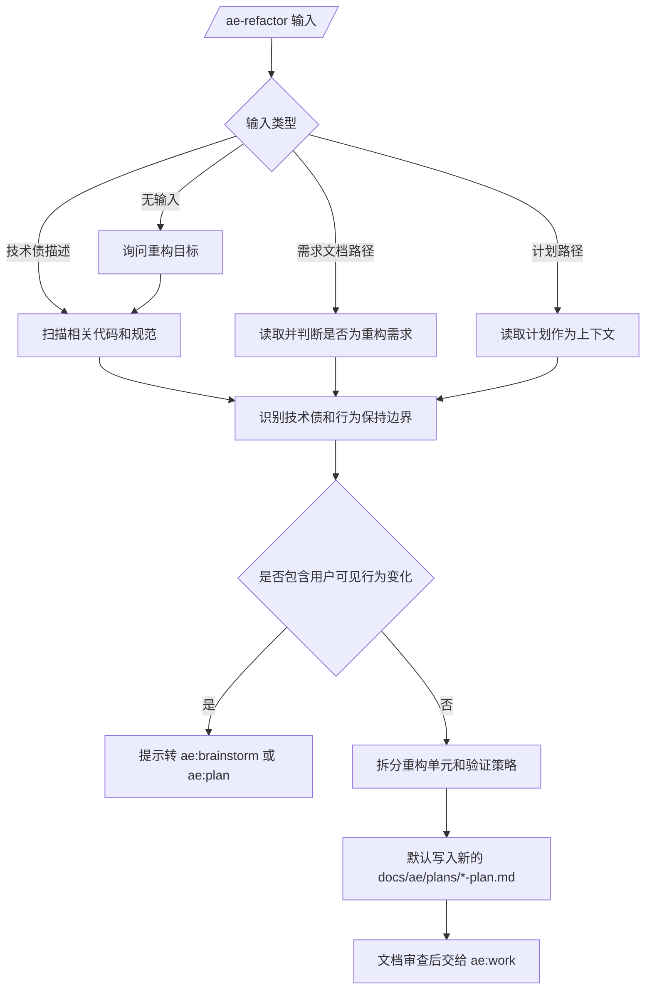

# 重构计划：补齐 ae:refactor 核心流程技能

## 背景

`ae:refactor` 目前只在 `src/assets/skills/ae-refactor/SKILL.md` 中存在极简说明，尚未进入 AE 资产常量、命令目录、帮助目录和正式工作流。用户已确认它应与 `ae:plan` 在核心流程中处于相同位置，是重构场景下的计划平替技能：`ae:plan` 回答通用“如何构建”，`ae:refactor` 回答“如何在保持行为的前提下安全消除历史技术债”。

## 目标

- 将 `ae:refactor` 补齐为正式公开技能入口，支持 `/ae-refactor`、`/ae-refactor-po`、`/ae-refactor-pa`。
- 将 `ae:refactor` 的技能说明重构为完整工作流，产出可由 `ae:work` 执行的标准计划文档。
- 保持 `ae:refactor` 与 `ae:plan` 同层但语义区分明确：新增功能和产品行为变化仍走 `ae:plan` 或 `ae:brainstorm`，纯重构和技术债治理优先走 `ae:refactor`。
- 保持现有 AE 资产规范、catalog/frontmatter 一致性和帮助/命令动态生成机制。

## 非目标

- 本计划只定义执行方案；执行阶段仍需要按实现单元修改代码和文档，但计划阶段不直接落地实现代码。
- 不新增 `type: refactor`、`docs/ae/refactors/` 或独立重构产物体系。
- 不新增独立 `refactor` recovery phase；短期复用标准 `plan` 产物和现有执行/审查链路。
- 不改造 `ae:work` 或 `ae:review` 的主流程语义；`ae:lfg` 仅补充纯重构场景选择 `ae:refactor` 的路由提示。
- 不创建 `src/assets/commands/ae-refactor.md`，除非实现阶段发现动态模板无法满足入口需求。
- 不把“彻底消除所有技术债”作为无边界目标；本次只要求目标技术债被可验证地解决并安全拆分。

## 关键决策

- **产物类型仍为 `plan`**：`ae:refactor` 生成 `docs/ae/plans/*-plan.md`，保持 `ae:work` 和 `ae:review` 兼容。
- **入口通过 catalog 动态生成**：新增 `SKILL.REFACTOR` 和 catalog entry 后，`COMMAND.REFACTOR`、`-po`、`-pa` 会沿现有机制生成。
- **frontmatter 与 catalog 字段同步**：以“公开元数据契约”为唯一标准，`SKILL.md` 的 `argument-hint` 必须与 `src/services/ae-catalog.ts` 的 `argumentHint` 字面一致。
- **复用 ae:plan 流程**：`ae:refactor` 不维护独立计划流程，而是补充重构约束后调用 `ae:plan`。

## 公开元数据契约

- 技能名：`ae:refactor`
- 命令名：`ae-refactor`
- 技能排序：主流程中位于 `ae:plan` 之后、`ae:work` 之前，表示重构场景下的计划平替入口。
- `argument-hint`：`[重构目标|计划路径|需求文档路径|代码异味描述]`
- catalog 描述：`重构专项计划入口：补充技术债消除、行为保持和验证护栏约束后调用 ae:plan`
- SKILL.md 描述语义：先把输入转换为以彻底消除目标技术债、保持外部行为、分阶段迁移和测试护栏为核心的计划约束，再调用 `ae:plan` 产出标准计划文档。

## 影响范围

- `src/assets/skills/ae-refactor/SKILL.md`
- `src/schemas/ae-asset-schema.ts`
- `src/schemas/ae-asset-schema.test.ts`
- `src/services/ae-catalog.ts`
- `src/services/command-registration.ts`（只在新增测试或发现模板问题时修改）
- `src/services/command-registration.test.ts`
- `src/services/help-catalog-service.test.ts`
- `src/assets/skills/ae-brainstorm/references/handoff.md`
- `src/assets/skills/ae-work/SKILL.md`
- `.opencode/rules/core/agent-design.md`（若存在对应源规则，优先更新源规则并同步运行时规则）
- `README.md`
- `docs/ae/usage-guide.md`

## 高层流程设计

## 实现单元

### [ ] 单元 1：补齐资产常量和 schema

**目标**

让 `ae:refactor` 成为 AE 资产系统可识别的正式技能名和命令名。

**文件**

- `src/schemas/ae-asset-schema.ts`
- `src/schemas/ae-asset-schema.test.ts`

**方法**

- 在 `SKILL` 中按主流程顺序添加 `REFACTOR: 'ae:refactor'`，位置建议紧邻 `PLAN`。
- 在 `AeSkillNameSchema` 的 enum 中添加 `SKILL.REFACTOR`，顺序与 `SKILL` 常量保持一致。
- 依赖现有 `COMMAND` 自动派生机制生成 `COMMAND.REFACTOR`，不手写命令字符串。
- 新增 `src/schemas/ae-asset-schema.test.ts`，断言 refactor 技能名和基础/派生命令名均可通过 Zod schema 解析。

**需遵循的模式**

- 遵守 AE 资产名称常量化规则，其他文件引用 `SKILL.REFACTOR` 和 `COMMAND.REFACTOR`。
- 不修改 `TOOL` 或 `AGENT` 常量。

**测试场景**

- 类型检查应确认 `COMMAND.REFACTOR` 可用。
- schema 应接受 `ae:refactor`，命令 schema 应接受 `ae-refactor`、`ae-refactor-po`、`ae-refactor-pa`。

**验证**

- `npm run typecheck`
- `npm run test`
- 聚焦验证：`npx vitest run src/schemas/ae-asset-schema.test.ts`

### [ ] 单元 2：将 ae:refactor 加入 catalog 和命令体系

**目标**

让 `/ae-refactor`、`/ae-refactor-po`、`/ae-refactor-pa` 出现在命令注册、TUI 命令和帮助目录中。

**文件**

- `src/services/ae-catalog.ts`

**方法**

- 在 `PHASE_ONE_ENTRIES` 中添加 `ae:refactor` entry，位置放在 `ae:plan` 之后、`ae:work` 之前，体现“plan 平替”关系。
- 使用 `skillDir(SKILL.REFACTOR)`、`COMMAND.REFACTOR` 和 `src/assets/skills/${skillDir(SKILL.REFACTOR)}/SKILL.md`。
- 设置 `defaultEntry: false`。
- 描述使用公开元数据契约中的 catalog 描述。
- `argumentHint` 使用公开元数据契约中的标准值。

**需遵循的模式**

- `argumentHint` 必须与 `src/assets/skills/ae-refactor/SKILL.md` frontmatter 的 `argument-hint` 字面一致。
- `description` 与 SKILL.md frontmatter 语义一致即可。
- 不新增命令 markdown 文件，优先使用 `command-registration.ts` 的动态模板。

**测试场景**

- `getPhaseOneEntries()` 包含 `ae:refactor`。
- `getPhaseOnePoEntries()` 包含 `ae-refactor-po`。
- `getPhaseOnePaEntries()` 包含 `ae-refactor-pa`。
- `buildCommandConfig()` 包含基础命令和两个派生命令。

**验证**

- `npm run test`
- 如新增聚焦测试：`npx vitest run src/services/command-registration.test.ts`

### [ ] 单元 3：重写 ae:refactor 技能工作流

**目标**

将 `src/assets/skills/ae-refactor/SKILL.md` 从极简说明升级为 `ae:plan` 的重构专项包装器。

**文件**

- `src/assets/skills/ae-refactor/SKILL.md`

**方法**

- 补齐 frontmatter：`name`、长描述 `description`、`argument-hint`。
- frontmatter 的 `argument-hint` 和描述语义必须引用公开元数据契约，不另行定义新字符串。
- 明确定位：`ae:refactor` 是重构场景下的 `ae:plan` 平替，创建计划但不写代码、不运行测试。
- 明确适用场景：模块拆分、层级边界调整、重复代码收敛、职责整理、架构规则对齐、测试结构重整。
- 明确不适用场景：新增产品能力、用户可见行为变化、需求不清、未知故障调试、一次性小改。
- 明确执行方式：构造重构约束并立即调用 `ae:plan`，不复制 `ae:plan` 的完整流程。
- 约束必须覆盖：彻底消除目标技术债、默认保持外部行为、先识别债务证据、明确非目标、分阶段迁移、测试护栏、回滚信号。
- 计划产物由 `ae:plan` 写入 `docs/ae/plans/`，frontmatter 仍为 `type: plan`。
- 要求每个实现单元包含：目标技术债、文件范围、依赖、行为保持要求、测试/验证、回滚信号。

**需遵循的模式**

- 文件引用使用仓库相对路径。
- 不引用不存在的 `references/*` 文件；若需要拆分参考文档，必须同步创建。
- 与 `ae:plan` 保持结构兼容，但不要简单复制 `ae:plan` 的泛化描述。

**测试场景**

- 人工检查 `argument-hint` 与 catalog 字面一致。
- `/ae-help refactor` 应展示新描述。
- `/ae-refactor <重构目标>` 的动态命令模板应正确加载该技能。

**验证**

- `npm run build`
- 人工或工具验证 `/ae-help refactor` 输出。

### [ ] 单元 4：补充命令、帮助和 TUI 相关测试

**目标**

防止未来再次出现“技能目录存在但未公开注册”的不一致。

**文件**

- `src/services/command-registration.test.ts`
- `src/services/help-catalog-service.test.ts`

**方法**

- 测试 `buildCommandConfig()` 能生成 `ae-refactor`、`ae-refactor-po`、`ae-refactor-pa`。
- 测试 `createTuiCommands()` 包含 `/ae-refactor`。
- 在 `help-catalog-service.test.ts` 中增加 `refactor` 查询覆盖，确认帮助目录能返回技能和命令。

**需遵循的模式**

- 测试描述使用中文。
- Mock 外部文件系统读取，或使用空临时命令目录路径验证动态命令。
- 不依赖 `.opencode/` 运行时产物。

**测试场景**

- 正常输入：refactor entry 生成基础命令。
- 派生命令：`-po`、`-pa` 均存在。
- TUI：基础命令和派生命令能出现在命令列表中。
- 帮助过滤：查询 `refactor` 能返回技能和命令。

**验证**

- `npm run test`

### [ ] 单元 5：同步用户文档

**目标**

让 README 和使用指南中的技能/命令数量、清单和流程说明与代码一致。

**文件**

- `README.md`
- `docs/ae/usage-guide.md`
- `src/assets/skills/ae-brainstorm/references/handoff.md`
- `src/assets/skills/ae-work/SKILL.md`
- `.opencode/rules/core/agent-design.md`（若存在对应源规则，优先更新源规则并同步运行时规则）

**方法**

- 在技能清单中加入 `ae:refactor`。
- 在命令清单中加入 `/ae-refactor`、`/ae-refactor-po`、`/ae-refactor-pa`。
- 更新技能数量和命令数量：若当前为 17 个技能，新增后应为 18 个；基础命令、`-po`、`-pa` 总数按现有文档口径同步调整。
- 说明推荐流程：`/ae-refactor → /ae-review domain:document → /ae-work → /ae-review plan:<path>`。
- 说明与 `/ae-plan` 的区别：`/ae-plan` 处理通用功能计划，`/ae-refactor` 会先加入重构专项约束再调用 `ae:plan`。
- 在 brainstorm 交接文档中补充路由提示：当需求是纯重构或行为保持型技术债治理时，规划入口可选 `/ae-refactor`；新增功能或行为变化仍默认 `/ae-plan`。
- 在 work 技能说明中补充提示：大型重构或架构债治理可先运行 `/ae-refactor`，普通功能计划仍运行 `/ae-plan`。
- 更新技能排序规则，将主流程顺序表达为 `ideate → brainstorm → document-review → plan/refactor → work → review` 或等价表述。

**需遵循的模式**

- 文档使用中文。
- 保持技能排序：主流程优先，`ae:refactor` 紧邻 `ae:plan`。

**测试场景**

- 文档中无旧数量残留。
- 文档中的 `argument-hint` 与 catalog/SKILL.md 一致。
- brainstorming/work 交接提示不会在纯重构场景继续唯一推荐 `/ae-plan`。

**验证**

- 人工检查 README 和 usage guide。
- `npm run build` 确认资产同步不报错。

## 风险与缓解

| 风险 | 影响 | 缓解 |
| --- | --- | --- |
| `ae:refactor` 与 `ae:plan` 职责重叠 | 用户不知道该用哪个入口 | 在 SKILL.md 和文档中明确：纯重构/技术债治理走 refactor，新增功能/行为变化走 plan 或 brainstorm |
| 只新增技能文档但未注册 catalog/schema | `/ae-refactor` 不可用，帮助目录缺失 | 先改 schema 和 catalog，并补命令生成测试 |
| 新增独立产物类型 | 破坏 `ae:work` 和 `ae:review` 兼容性 | 坚持使用 `type: plan` 和 `docs/ae/plans/` |
| 文案鼓励大爆炸重构 | 执行风险过高 | 要求分阶段、可验证、可回滚，并明确目标技术债范围 |
| 文档数量不同步 | README/usage guide 与实际帮助不一致 | 单元 5 专门同步公开文档和数量 |
| 重构约束过弱 | `ae:plan` 仍按普通功能计划处理 | 在 `ae:refactor` 的转交提示中明确行为保持、债务证据、测试护栏和回滚信号 |
| 既有技能交接仍唯一推荐 `/ae-plan` | 用户在重构场景无法发现 `/ae-refactor` | 单元 5 更新 brainstorm/work 的路由提示 |

## 推迟到实现阶段的问题

- 是否需要新增 `src/assets/skills/ae-refactor/references/` 以拆分长流程说明；默认先保持单文件，除非 SKILL.md 过长影响可读性。

## 验证计划

- `npm run typecheck`
- `npm run test`
- `npm run build`
- 人工验证 `/ae-help refactor` 包含 `ae:refactor`、`/ae-refactor`、`/ae-refactor-po`、`/ae-refactor-pa`。
- 人工验证 `/ae-refactor <重构目标>` 动态命令模板会调用 `ae:refactor` 并沿用参数。

## 推荐执行顺序

1. 修改 `src/schemas/ae-asset-schema.ts`，补齐资产常量和 schema。
2. 修改 `src/services/ae-catalog.ts`，公开 refactor entry 并触发命令派生。
3. 重写 `src/assets/skills/ae-refactor/SKILL.md`，定义重构约束包装器并转交 `ae:plan`。
4. 新增或补充测试，锁定命令、帮助和 TUI 可见性。
5. 更新 `README.md`、`docs/ae/usage-guide.md`、brainstorm/work 交接提示和技能排序规则。
6. 运行 `npm run typecheck`、`npm run test`、`npm run build`。
