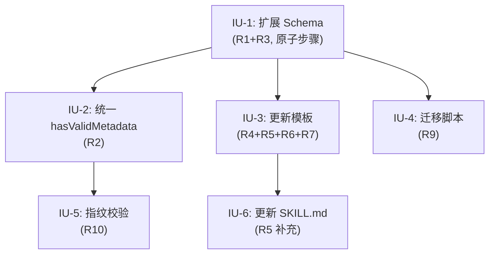

# 产物模板重构：统一元数据与结构化需求条目

## 问题框架

AE 恢复系统的 `hasValidMetadata()` 存在三轨验证逻辑（brainstorm/plan/Schema），导致 frontmatter 与 `ArtifactFrontmatterSchema` 不一致、状态盲区、替代链断裂。本次计划统一 brainstorm 产物的 frontmatter 为 `ArtifactFrontmatterSchema`，删除特殊验证分支，并保障现有文档向后兼容。

## 实现单元

### IU-1: 扩展 ArtifactFrontmatterSchema（原子步骤，含 R1+R3）

**目标：** 扩展 `ArtifactFrontmatterSchema` 加入类型特有字段和 `.superRefine()` 条件校验，新增 `active` 到 `ArtifactStatusSchema`。R1 与 R3 共享可变 Schema 中间状态，必须作为原子步骤完成。

**需求：** R1, R3（R3 覆盖 active 枚举新增和 brainstorm/plan 各自 status 枚举定义）

**依赖：** 无

**文件：**
- `src/schemas/artifact-schema.ts` — 主要变更

**方法：**

1. 在 `ArtifactStatusSchema` 枚举中新增 `active` 值（语义："审查通过并正在执行中"）
2. 在 `ArtifactFrontmatterSchema` 的 `z.object()` 中新增类型特有可选字段：
   - `date: z.string().optional().describe('ISO 日期')`
   - `topic: z.string().optional().describe('主题')`
   - `title: z.string().optional().describe('标题')`
   - `depth: z.enum(['standard', 'deep']).optional().describe('计划深度')`
3. 在 `ArtifactFrontmatterSchema` 链式调用 `.superRefine()` 按 `type` 条件校验：
   - `type === 'brainstorm'` → `date` 和 `topic` 必填，`status` 必须为 `drafted | review-passed | completed`
   - `type === 'plan'` → `date` 和 `title` 必填，`status` 必须为 `drafted | active | completed`
   - `type === 'work' | 'review'` → 无额外必填字段
4. 使用 `.superRefine()` 而非 `.refine()`，为每个缺失字段生成独立错误消息（精确到 `path`），便于 LLM 理解校验失败原因

**选择 `.superRefine()` 而非 `.refine()` 的理由：** 需求文档 R3 原定使用 `.refine()`，计划升级为 `.superRefine()` 以支持多字段独立报错。`.refine()` 只能生成单一自定义错误，无法定位到具体缺失字段。`.superRefine()` 通过 `ctx.addIssue()` 为每个缺失字段独立报错，错误消息精确到 `path: ['date']` 或 `path: ['topic']`，这对 LLM 理解校验失败原因至关重要。

**选择不使用 `z.discriminatedUnion()` 的理由：** 需求文档 R3 原定使用统一 Schema + `.refine()` 条件校验（计划升级为 `.superRefine()` 以支持多字段独立报错）。`discriminatedUnion` 虽提供更好的类型窄化，但会导致通用字段（`origin`/`originFingerprint`/`supersededBy`）在每个变体中重复声明，且与 R2 的"一条 `safeParse()` 调用"设计意图更一致。

**执行说明：**

- `ArtifactTypeSchema` 和 `ArtifactStatusSchema` 保持独立导出，下游代码已引用
- `ArtifactFrontmatter` 类型推断将包含所有可选字段（`date?`, `topic?`, `title?`, `depth?`），类型窄化需在消费方通过 `if (data.type === 'brainstorm')` 守卫实现
- 条件校验的 status 枚举验证需注意：`ArtifactStatusSchema` 本身包含所有状态值（含 `active`），`.superRefine()` 的 status 条件校验是在 `ArtifactStatusSchema` 校验通过之后的二次约束

**测试场景：**

- ✅ brainstorm 文档含 `type: brainstorm, status: drafted, date: '2026-04-27', topic: 'test'` → 校验通过
- ✅ plan 文档含 `type: plan, status: active, date: '2026-04-27', title: '测试计划'` → 校验通过
- ✅ work 文档含 `type: work, status: drafted` → 校验通过（无需 date/topic）
- ❌ brainstorm 缺少 `date` → 校验失败，错误定位到 `path: ['date']`
- ❌ brainstorm 缺少 `topic` → 校验失败，错误定位到 `path: ['topic']`
- ❌ brainstorm `status: review-needs-fix` → 校验失败（不在 brainstorm 允许的 status 枚举中）
- ❌ plan 缺少 `title` → 校验失败
- ❌ plan `status: review-needs-fix` → 校验失败（不在 plan 允许的 status 枚举中）
- ✅ brainstorm 含 `origin: 'docs/ae/brainstorms/xxx.md'` → 校验通过（可选字段）
- ✅ brainstorm 不含 `supersededBy` → 校验通过（可选字段）

**验证：** `ArtifactFrontmatterSchema.safeParse()` 对以上场景的通过/失败结果符合预期

---

### IU-2: 统一 hasValidMetadata()（R2）

**目标：** 删除 `hasValidMetadata()` 中的 brainstorm/plan 特殊分支，统一走 `ArtifactFrontmatterSchema.safeParse()`

**需求：** R2

**依赖：** IU-1（Schema 必须先完成扩展）

**文件：**
- `src/services/recovery-service.ts` — `hasValidMetadata()` 函数

**方法：**

1. 将 `hasValidMetadata()` 简化为单条 `ArtifactFrontmatterSchema.safeParse()` 调用
2. `artifact-store.ts` 的 `ArtifactRecord.frontmatter` 类型为 `Record<string, string>`，所有值为字符串。传递给 `safeParse()` 时，Zod 会自动将字符串 `'brainstorm'` 匹配到 enum 值
3. 无需类型转换——`ArtifactFrontmatterSchema` 的 `type` 和 `status` 是 `z.enum()`，字符串值可通过校验

**变更后代码：**

```typescript
function hasValidMetadata(artifact: {
  type: ArtifactKind
  frontmatter: Record<string, string>
}): boolean {
  return ArtifactFrontmatterSchema.safeParse({
    type: artifact.type,
    status: artifact.frontmatter.status,
    origin: artifact.frontmatter.origin,
    originFingerprint: artifact.frontmatter.originFingerprint,
    supersededBy: artifact.frontmatter.supersededBy,
    date: artifact.frontmatter.date,
    topic: artifact.frontmatter.topic,
    title: artifact.frontmatter.title,
    depth: artifact.frontmatter.depth,
  }).success
}
```

**注意：** `artifact.type` 来自 `ArtifactRecord.type`（由 `artifact-store.ts` 根据目录推断），不在 frontmatter 解析结果中，需显式传入。

**测试场景：**

- ✅ brainstorm 含 `date+topic+type+status` → `safeParse()` 通过
- ✅ plan 含 `date+title+type+status` → `safeParse()` 通过
- ❌ brainstorm 缺少 `date` → `safeParse()` 失败（由 IU-1 的 `.superRefine()` 拒绝）
- ✅ work/review 含 `type+status` → `safeParse()` 通过

**验证：** `hasValidMetadata()` 函数体只有一条 `ArtifactFrontmatterSchema.safeParse()` 调用，无 `if` 分支

---

### IU-3: 更新需求文档模板 frontmatter（R4+R5）

**目标：** 更新 `requirements-capture.md` 模板的 frontmatter 格式和 LLM 字段填写指引

**需求：** R4, R5, R6, R7

**依赖：** IU-1（Schema 定义必须先完成）

**文件：**
- `src/assets/skills/ae-brainstorm/references/requirements-capture.md` — 模板和检查列表

**方法：**

1. 更新模板 frontmatter 从 `{date, topic}` 到新格式：
   ```yaml
   ---
   type: brainstorm
   status: drafted
   date: YYYY-MM-DD
   topic: <kebab-case-topic>
   origin: <上游路径，若无则删除此行>
   originFingerprint: <上游指纹，若无则删除此行>
   ---
   ```
2. 在模板说明中增加字段填写指引：
   - `type` 固定为 `brainstorm`，LLM 不需选择
   - `status` 默认为 `drafted`，仅在文档通过审查后由后续技能更新为 `review-passed`
   - `origin` 和 `originFingerprint` 仅在有上游产物时填写
   - `originFingerprint` 的值 = 上游产物 `date` + `-` + `topic` 的 kebab-case 拼接（如 `2026-04-27-artifact-template-restructure`）
   - `supersededBy` 不出现在模板中（由后续技能在替代旧文档时写入）
3. 在检查列表中新增一项："每个需求条目是否都有明确的验收条件？"（R7）
4. 更新需求条目格式从 `R1. [具体需求]` 到 `R1. [需求描述] → 验收: [具体验收条件]`（R6）

**测试场景：**

- ✅ 模板生成的文档 frontmatter 包含 `type: brainstorm` 和 `status: drafted`
- ✅ 模板生成的文档 frontmatter 不包含 `supersededBy`
- ✅ 模板的检查列表包含验收条件检查项

**验证：** 按模板格式生成的最小 brainstorm 文档可通过 `ArtifactFrontmatterSchema.safeParse()`

---

### IU-4: 编写迁移脚本（R9）

**目标：** 为现有 7 个 brainstorm 文档补写 `type: brainstorm` + `status: drafted`，为现有 4 个 plan 文档补写 `type: plan`

**需求：** R9

**依赖：** IU-1（Schema 定义必须先完成）

**文件：**
- `scripts/migrate-frontmatter.ts` — 新建迁移脚本（一次性工具）
- `docs/ae/brainstorms/*.md` — 7 个文档需补字段（其中 1 个已含 type+status，脚本幂等处理）
- `docs/ae/plans/*.md` — 4 个 plan 文档需补 `type: plan`

**注意：** 需求 R9 编写时为 4 个 brainstorm，实现时已增至 7 个。迁移脚本按实际文件扫描而非硬编码数量。

**方法：**

1. 创建 `scripts/migrate-frontmatter.ts` 脚本
2. 使用 `parseFrontmatter()` 读取每个文档
3. 对 brainstorm 文档（`docs/ae/brainstorms/*.md`）：
   - 如果缺少 `type` → 补写 `type: brainstorm`
   - 如果缺少 `status` → 补写 `status: drafted`
   - 保留现有的 `date` 和 `topic`
4. 对 plan 文档（`docs/ae/plans/*.md`）：
   - 如果缺少 `type` → 补写 `type: plan`
   - 保留现有的 `status: active`（IU-1 已新增 `active` 到枚举）
   - 保留现有的 `date`、`source`、`depth` 等字段
5. 使用 `writeFileSync` 写回文件
6. 幂等性：已包含目标字段的文档不被修改
7. 脚本执行后验证：所有文档通过 `ArtifactFrontmatterSchema.safeParse()`

**不处理 plan 的 `source→origin` 迁移：** plan frontmatter 对齐超出当前范围（R1 仅覆盖 brainstorm）。plan 文档的 `source` 字段不在 `ArtifactFrontmatterSchema` 中，但作为未知字段会被 Zod 的 `safeParse()` 忽略（Zod 默认允许额外字段 pass-through）。

**关于 Zod 对额外字段的行为：** `z.object()` 默认允许传入对象包含 Schema 中未定义的字段（strip 模式），这些字段在校验时被忽略但不会导致失败。因此 plan 文档的 `source`、`depth` 字段不会影响 `safeParse()` 的结果。

**测试场景：**

- ✅ 旧 brainstorm `{date: '2026-04-24', topic: 'refactor-task-loop-skill'}` → 迁移后 `{type: 'brainstorm', status: 'drafted', date: '2026-04-24', topic: 'refactor-task-loop-skill'}`
- ✅ 已有 type+status 的 brainstorm → 不修改
- ✅ plan `{date: '2026-04-24', status: 'active'}` → 迁移后 `{type: 'plan', date: '2026-04-24', status: 'active'}`
- ✅ 脚本重复执行 → 第二次不修改任何文件（幂等性）

**验证：** 迁移后 `ArtifactFrontmatterSchema.safeParse()` 对所有文档均成功

---

### IU-5: originFingerprint 校验集成（R10）

**目标：** 在 `ae-recovery` 工具的恢复流程中新增 originFingerprint 一致性校验，校验失败时返回警告而非阻断

**需求：** R10

**依赖：** IU-1, IU-2

**文件：**
- `src/services/recovery-service.ts` — `resolveRecovery()` 函数
- `src/schemas/recovery-schema.ts` — 新增 `warnings` 字段

**方法：**

1. 在 `resolveRecovery()` 中 `expectedOriginFingerprint` 过滤 `activeArtifacts` 的逻辑处增加校验逻辑：
   - 当 `expectedOriginFingerprint` 与候选产物的 `originFingerprint` 不匹配时，标记 `sawFingerprintMismatch = true`，但**不再 `continue` 跳过该产物**
   - 改为将指纹不匹配的产物仍保留在候选列表中，但在最终返回结果中附加警告
   - 校验时根据候选产物的 `type` 字段选择拼接规则：`brainstorm` 用 `date` + `-` + `topic`，`plan` 用 `date` + `-` + `title`，与需求文档"依赖/假设"一致
2. 修改 `RecoveryResult` 类型（在 `recovery-schema.ts` 中）新增可选字段 `warnings: string[]`
3. 当 `sawFingerprintMismatch` 为 true 时：
   - 如果仍有候选产物可返回 → 返回 `resolved`/`needs-selection` 结果 + warnings 包含指纹不匹配警告
   - 如果无其他候选 → 返回 `needs-upstream` + warnings（而非当前的 `invalid-artifact` 阻断）
4. 警告消息格式：`"originFingerprint 不匹配：期望 '${expected}'，实际 '${actual}'，恢复结果可能指向错误的产物"`

**当前行为 vs 期望行为：**

| 场景 | 当前行为 | 期望行为 |
|------|---------|---------|
| 指纹不匹配 + 无其他候选 | 返回 `invalid-artifact`（阻断） | 返回 `needs-upstream` + 警告（不阻断） |
| 指纹不匹配 + 有其他匹配候选 | 跳过不匹配产物 | 返回匹配候选 + 警告 |

**注意：** `invalid-artifact` → `needs-upstream` 的分辨率类型变更影响下游。需确认 `ae-recovery.tool.ts` 和其他 `RecoveryResult` 消费方不依赖 `invalid-artifact` 分辨率类型做特殊处理。如有，需同步更新。

**测试场景：**

- ✅ 指纹匹配 → 正常恢复，无警告
- ✅ 指纹不匹配 + 有其他候选 → 返回匹配候选 + 警告
- ✅ 指纹不匹配 + 无其他候选 → 返回 `needs-upstream` + 警告
- ✅ 无 `expectedOriginFingerprint` 参数 → 行为不变

**验证：** 指纹不匹配时恢复流程不阻断，结果中包含警告信息

---

### IU-6: 更新 ae:brainstorm SKILL.md 的 frontmatter 指引（R5 补充）

**目标：** 在 `ae:brainstorm` SKILL.md 中为 LLM 提供明确的 frontmatter 字段填写指引

**需求：** R5（SKILL.md 部分）

**依赖：** IU-3（模板已更新，SKILL.md 指引需与模板一致）

**文件：**
- `src/assets/skills/ae-brainstorm/SKILL.md` — 阶段 3 文档生成部分

**方法：**

1. 在 SKILL.md 的文档生成阶段（阶段 3）中增加 frontmatter 字段填写指引段落：
   - `type` 固定为 `brainstorm`
   - `status` 默认为 `drafted`
   - `origin` 和 `originFingerprint` 仅在有上游产物时填写
   - `originFingerprint` 的值 = 上游产物 `date` + `-` + `topic` 的 kebab-case 拼接
   - `supersededBy` 不由 brainstorm 技能填写
2. 确保指引与 `requirements-capture.md` 模板一致

**测试场景：**

- ✅ SKILL.md 包含 `type`/`status` 默认值说明
- ✅ SKILL.md 包含 `originFingerprint` 拼接规则说明

**验证：** SKILL.md 的指引与 requirements-capture.md 模板语义一致

---

## 执行顺序



- IU-1 必须首先完成（所有其他 IU 依赖 Schema 定义）
- IU-2 必须在 IU-1 之后（统一校验依赖扩展后的 Schema）
- IU-3、IU-4、IU-5 可在 IU-1 完成后并行
- IU-6 在 IU-3 之后（指引需与模板一致）

## 高层技术设计

### Schema 变更影响链

```
artifact-schema.ts (IU-1)
  ↓ safeParse() 行为变化
recovery-service.ts (IU-2)
  ↓ hasValidMetadata() 统一
recovery-service.ts (IU-5)
  ↓ 指纹校验降级为警告
ae-recovery.tool.ts (无需变更，返回的 RecoveryResult 新增 warnings 字段)
```

### 现有文档兼容性路径

```
旧文档 {date, topic}
  ↓ IU-4 迁移脚本
新文档 {type: brainstorm, status: drafted, date, topic}
  ↓ IU-1 + IU-2
ArtifactFrontmatterSchema.safeParse() 通过
```

## 风险与缓解

| 风险 | 概率 | 影响 | 缓解 |
|------|------|------|------|
| `.superRefine()` 条件校验过于严格，拒绝合法文档 | 低 | 高 | IU-1 测试场景覆盖所有产物类型的合法/非法组合 |
| 迁移脚本破坏现有文档内容 | 低 | 高 | 脚本只操作 frontmatter 区域，不修改 body；幂等性保证 |
| `active` 枚举值与现有 status 语义冲突 | 低 | 中 | `active` 语义明确（"审查通过并正在执行中"），与 `drafted`/`completed` 互补 |
| originFingerprint 校验降级后恢复到错误产物 | 中 | 中 | 警告明确提示指纹不匹配，用户可判断是否继续 |
| Zod strip 模式下 plan 的 `source` 字段丢失 | 无 | 无 | `safeParse()` 不修改数据，只做校验；`source` 字段在原始文件中仍存在 |

## 推迟的实现说明

- plan frontmatter 对齐（`source→origin`、新增 `title` 字段）作为独立需求，不在本次范围
- originFingerprint 版本化（如 `v1:` 前缀）推迟到指纹规则变更时再考虑
- `frontmatter.ts` 升级为完整 YAML 解析器推迟到需要数组/嵌套字段时
- 迁移脚本执行方式（独立运行 vs 集成到构建流程）推迟到实现时决定
- R8 为约束声明（解析器能力已足够），无需实现，不纳入 IU

## 成功标准映射

| 成功标准 | 验证方式 | 对应 IU |
|---------|---------|--------|
| hasValidMetadata() 只有一条统一校验路径 | 代码审查：函数体无 `if` 分支 | IU-2 |
| 模板生成的 brainstorm 文档 frontmatter 可通过 safeParse() | IU-1 测试场景 | IU-1, IU-3 |
| ae:plan 可从验收子句提取验收条件 | 模板含 `→ 验收:` 语法 | IU-3 |
| 现有文档迁移后可通过 safeParse() | 迁移脚本验证步骤 | IU-4 |
| ae-recovery 校验 originFingerprint 一致性 | 指纹不匹配时返回警告而非阻断 | IU-5 |
