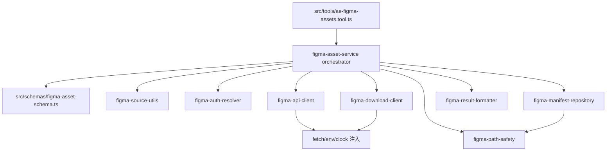
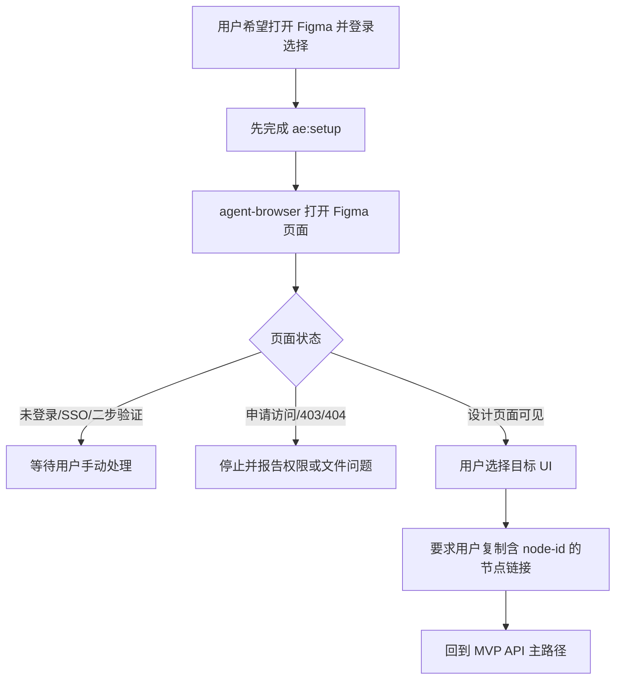
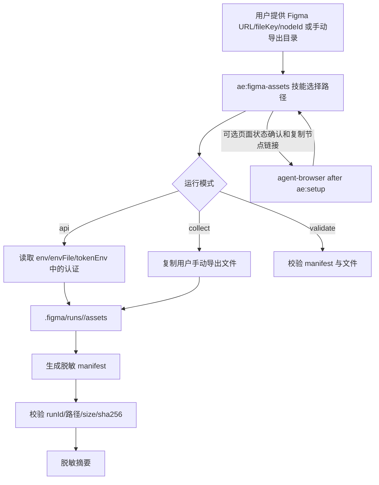

# Figma 素材导出技能修订计划

## 来源与目标

基于 `docs/ae/brainstorms/figma-asset-browser-skill-requirements.md` 和当前 `ae:figma-assets` 已实现现状，修订本计划为“吸纳已有实现后的补齐计划”。

目标不再是从零新增技能，而是在保留现有 API、collect、validate 三模式基础上，吸纳 Trae Figma 静态分析结论，补齐安全边界、认证模型、manifest 脱敏、本次运行校验、错误分类、测试覆盖，以及“agent-browser 辅助选择 vs tool 自带 WebView vs Figma Plugin Bridge”的架构决策。

本计划同时作为 `ae:figma-assets` 的技术债消除计划：执行顺序必须先锁定现有行为，再拆分 `src/services/figma-asset-service.ts` 中过度集中的职责，最后再落地会改变外部契约的功能补齐项。不得用新增功能掩盖结构性债务，也不得为了快速补齐 manifest v2、认证策略或安全提示而继续扩大单文件 service 的复杂度。

## 当前实现基线

- `src/assets/skills/ae-figma-assets/SKILL.md` 已存在，已声明 API、collect、validate 三模式，以及不读取浏览器凭证、不调用 Trae、agent-browser 使用前必须 `ae:setup`。
- `src/tools/ae-figma-assets.tool.ts` 已注册工具，负责 Zod 参数解析、调用 service、捕获错误并在工具层 toast。
- `src/services/figma-asset-service.ts` 已实现 Figma URL 解析、API 下载、手动目录收集、manifest 写入、checksum 校验、路径约束、下载域名白名单和禁止重定向。
- `src/schemas/figma-asset-schema.ts` 已定义工具参数和 manifest schema。
- `src/schemas/ae-asset-schema.ts`、`src/services/ae-catalog.ts`、`src/tools/index.ts` 已完成资产常量、catalog 和工具注册。
- `tests/tools/ae-figma-assets.tool.test.ts`、`tests/services/figma-asset-service.test.ts`、`tests/schemas/figma-asset-schema.test.ts` 已覆盖基础流程。

## 技术债消除目标

| 技术债 | 当前证据 | 本计划处理 |
| --- | --- | --- |
| service 职责过度集中 | `src/services/figma-asset-service.ts` 同时处理 URL 解析、认证、API 请求、下载安全、文件系统、manifest、validate、摘要和错误格式化 | 先补特征化测试，再按 source、auth、API client、download client、path safety、manifest repository、formatter 分阶段拆分 |
| IO 依赖隐式耦合 | service 直接依赖 `fetch`、`process.env`、`Date` 和 `fs/promises` | 引入最小 runtime deps，把 `fetch`、局部 env、clock 注入到 service 内部，避免测试依赖全局状态 |
| 安全逻辑与业务流程交织 | 路径逃逸、symlink、防删除、下载 URL 白名单与模式编排混在同一文件 | 提取路径安全和下载安全边界，安全规则必须有独立表驱动测试 |
| 关键逻辑难单测 | Figma URL 解析、nodeId 规范化、文件名清洗、manifest 构造、summary formatter 主要通过集成测试间接覆盖 | 将纯逻辑拆为可独立测试的函数或模块，先在原文件内私有拆分，稳定后再提取文件 |
| manifest 双写契约隐含 | run manifest、latest manifest、`.figma/assets/` 重建是重要外部行为，但未由清晰模块表达 | 提取 manifest repository，显式表达 run manifest、latest manifest 和 latest assets 的职责 |
| setup 门禁存在文档耦合 | `ae:figma-assets` 提到 `agent-browser`，但纯 API/collect/validate 不应强制 setup | 保持 agent-browser 仅为浏览器辅助路径门禁，不把整个技能名作为 setup 触发条件 |

消债成功标准：`runFigmaAssetTool` 最终只负责模式分发和依赖组装；工具层仍只负责 schema parse、调用 service、catch 错误和 toast；service/schema/utils 不依赖 tool、TUI 或 toast；新增行为变更必须有独立测试和迁移说明。

## 目标模块边界



模块可以先作为 `src/services/figma-asset-service.ts` 内部私有函数落地；只有当测试和边界稳定后再提取到独立文件，避免一次性大爆炸迁移。但每个 0.x 拆分项都必须在阶段验收中记录最终落点：独立文件，或暂留私有函数及理由。0.7 收敛阶段必须统一评估这些暂留边界，防止“私有函数拆分”变成继续维持单文件复杂度的借口。

## Trae 分析吸纳边界

| 类别 | 结论 | 计划处理 |
| --- | --- | --- |
| 可迁移原则 | 授权输入、素材获取、工作区落盘、manifest 校验、脱敏摘要 | 保留为 opencode 原生流程核心 |
| 可迁移参数 | `fileKey`、`nodeId`、format、scale、节点渲染导出 | 映射到 Figma 官方 API 与工具参数 |
| 可迁移产物 | `.figma` 目录、隔离运行产物、checksum、稳定索引 | 继续使用 `.figma/runs/<runId>/...` 与 `.figma/manifest.json` |
| 不可复用实现 | Trae WebView、IPC、私有命令、`window.figmaAdapter`、Figma 插件运行时全局 `figma` | 在技能和工具描述中明确排除 |
| 不可作为成功证据 | 页面点击下载、浏览器登录态、Trae 私有落盘链路 | 只把 agent-browser 作为状态确认，不作为素材落盘路径 |

## 关键决策

- 首版自动获取主路径仍为 Figma 官方 API，核心 endpoint 为 `/v1/images/:file_key`。
- 本轮 API 能力只补齐单 `nodeId` 链路；多节点、部分成功 manifest 和图片填充下载推迟。
- 手动导出收集是正式降级路径，必须具备与 API 路径同等的 manifest 和 checksum 校验。
- agent-browser 只用于页面状态确认；任何实际 `agent-browser` 调用前必须完成 `ae:setup`，且不得读取 cookie、localStorage、sessionStorage 或浏览器 token。
- agent-browser evidence 本轮不落盘；manifest 只记录 `evidence.saved: false`，用户授权保存页面状态证据属于后续增强。
- 不复用 Trae 私有 WebView、IPC、命令、运行时、D2C 依赖或凭证链路。
- 计划优先补齐已实现能力的安全和契约缺口，避免重写已经可工作的工具注册和基础流程。
- MVP 交互采用“用户复制 Figma 选中节点链接或显式提供 fileKey/nodeId”，不承诺浏览器内选中后自动感知当前 Figma selection。
- MVP 资源范围限定为“明确 `nodeId` 的节点渲染资源”，不承诺 Trae 式“所有嵌套资源”。图片填充、图标拆分、多节点批量和部分成功汇总进入后续增强。
- `agent-browser` 是 MVP 的可选辅助选择器：用于打开 Figma、让用户登录、确认页面状态、引导复制节点链接；下载仍由官方 API 工具完成。
- tool 自带 WebView/浏览器运行时不进入主线；它会扩大登录态、IPC、运行时分发、跨平台和测试风险，除非未来作为独立 companion runtime 重新立项。
- Figma Plugin Bridge 作为二阶段增强候选；它比自带 WebView 更接近 Trae 的选区体验，但必须独立设计配对、来源校验、payload 白名单、大小限制和用户确认。

## 方案选择矩阵

| 方案 | 定位 | 优势 | 风险 | 计划结论 |
| --- | --- | --- | --- | --- |
| agent-browser 辅助选择 + 官方 API 下载 | MVP 主路径 | 复用现有 `ae:setup`、技能和工具模型，安全边界清晰，分发体积小 | 无法直接读取 Figma 当前选区；仍需用户复制节点链接和显式 API 授权 | 进入本轮计划 |
| tool 自带 WebView/浏览器运行时 | 远期调研 | 可做定制 UI、长期选择器窗口和下载目录控制 | 登录态和 storage 泄露、IPC/preload 风险、运行时体积、跨平台和测试成本高 | 不进入主线 |
| Figma Plugin Bridge + opencode tool | 二阶段增强 | 可在 Figma 插件沙箱内读取当前选区，体验更接近 Trae | 需要维护插件和本地 bridge，必须做配对、安全协议和范围确认 | 推迟到独立设计 |

## MVP 用户流程

```mermaid
flowchart TD
  A[用户提供 Figma URL 或 fileKey/nodeId] --> B{是否有明确 nodeId}
  B -->|否| C[提示用户复制选中节点链接]
  C --> A
  B -->|是| D{是否有显式 API/OAuth token 来源}
  D -->|否| E[提示提供 tokenEnv/envFile/环境变量]
  E --> D
  D -->|是| F[ae-figma-assets api 模式]
  F --> G[/v1/images/:file_key]
  G --> H{返回可下载 URL}
  H -->|否| I[分类失败并给出下一步]
  H -->|是| J[下载到 .figma/runs/<runId>/assets]
  J --> K[生成 manifest + checksum]
  K --> L[validate 本次 runId 产物]
  L --> M[返回脱敏摘要和路径]
```

## 浏览器辅助流程



浏览器登录只证明页面可访问；它不产生 API token，不作为下载授权来源，不允许读取或转移 cookie、localStorage、sessionStorage、浏览器 token 或完整 DOM。

## 失败与降级映射

| 失败类别 | 触发条件 | 用户下一步 |
| --- | --- | --- |
| 缺少 `nodeId` | URL 无 `node-id` 且未显式传入 | 在 Figma 选择节点后复制节点链接 |
| 缺少认证 | API 模式没有 tokenEnv/envFile/环境变量 | 提供显式授权的 Figma token 来源，或改用 collect |
| 401 | token 无效或过期 | 轮换 token，优先检查 `FIGMA_OAUTH_TOKEN` / `FIGMA_API_KEY` |
| 403 | token 对文件无权限 | 确认账号权限或换有权限的 token |
| 404 | fileKey 或节点不可访问 | 检查文件链接和节点链接 |
| 429 | Figma API 限流 | 稍后重试，复杂退避推迟 |
| 空 images / 空下载 URL | nodeId 不可渲染、权限不足或 API 返回异常 | 换目标节点，或手动导出后 collect |
| 下载安全拒绝 | http、私网、非可信域名、重定向、超时或超大小 | 不重试该 URL，报告脱敏失败类别 |
| API 路径不可用 | 用户不提供 token 或组织策略禁止 API | 用户手动导出到本地目录后运行 collect |

## 高层设计



## 目标运行产物

- `.figma/runs/<runId>/assets/*`：本次运行素材，是成功判据的主来源。
- `.figma/runs/<runId>/manifest.json`：本次运行清单。
- `.figma/assets/*`：最新成功运行素材的稳定副本或索引，不作为本次成功的唯一判据。
- `.figma/manifest.json`：最新清单副本或索引。
- `.figma/runs/<runId>/evidence/*`：后续增强的可选页面状态证据目录；本轮不生成，最终回答不嵌入私有画面。

`collect` 是工具运行模式名；manifest 中记录为 `source.type: "manual"`，表示素材来自用户手动导出后由工具收集。

`validate` 默认读取 `.figma/manifest.json`，该文件必须是最新 run manifest 的副本或包含可解析的 `runId` 指针；随后校验 `.figma/runs/<runId>/manifest.json` 和 run 目录资产。`.figma/assets/*` 只是最新副本，不参与本次运行证明。

`.figma/runs/<runId>/evidence/*` 具有长期落盘敏感性；后续如启用用户授权保存页面状态证据，manifest 只记录 evidence 类型、相对路径和脱敏说明，不保存截图内容摘要、完整 URL、账号、组织、DOM 或 token。

本轮只实现 `evidence.saved: false` 的静态 manifest 字段和默认不保存策略；实际保存截图、快照或 DOM evidence 的接口、授权参数、清理策略和 validate 规则进入后续增强。

`.figma/` 下素材和 manifest 可能包含私有设计资产；本轮工具最终摘要必须提示用户确认 `.figma/` 是否应提交到 Git，并在 validate 或工具返回中标记 `.figma/` 未被 `.gitignore` 覆盖的风险。自动写入 `.gitignore` 仍需用户显式授权。

## 目标 manifest 字段

```json
{
  "schemaVersion": 2,
  "runId": "20260428-...",
  "startedAt": "ISO-8601",
  "completedAt": "ISO-8601",
  "status": "success|failed",
  "source": {
    "type": "api|manual",
    "authMode": "api-key|oauth|none",
    "figma": {
      "fileKeyHash": "sha256-prefix-from-run-salt",
      "nodeIdHashes": ["sha256-prefix-from-run-salt"]
    }
  },
  "evidence": {
    "agentBrowserUsed": false,
    "saved": false,
    "types": [],
    "paths": []
  },
  "assets": [
    {
      "path": ".figma/runs/<runId>/assets/icon.svg",
      "format": "svg",
      "size": 1234,
      "sha256": "...",
      "sourceNodeIdHash": "sha256-prefix",
      "createdAt": "ISO-8601"
    }
  ],
  "warnings": [],
  "failures": []
}
```

## 实施顺序原则

本计划执行时必须按以下顺序推进，避免在旧结构上继续堆叠功能：

1. 锁定行为基线：先补现有 API、collect、validate、manifest、摘要、脱敏和 setup 门禁的特征化测试。
2. 消除结构债务：拆分 source、文件名、formatter、路径安全、runtime deps、API client、download client、manifest repository 和 validate 边界。
3. 收敛薄编排入口：让 `runFigmaAssetTool` 只做模式分发和依赖组装，工具层只做参数解析、调用、错误捕获和 toast。
4. 落地功能补齐：在模块边界清晰后，再实现认证模型调整、manifest v2、失败 manifest、`.figma/` Git 风险提示和浏览器辅助文案。
5. 验证公开契约：每次行为变化必须有测试和迁移说明，不能混在“纯重构”提交中。

若实现中发现某项功能补齐会迫使 `src/services/figma-asset-service.ts` 继续膨胀，应暂停该功能项，先完成对应模块拆分。

## 实现单元

### 0. 锁定现有行为基线

- [ ] 补充 `.figma/runs/<runId>/manifest.json`、`.figma/manifest.json`、`.figma/assets/` 三类产物的行为基线测试。
- [ ] 补充 API、collect、validate 三模式的成功摘要和失败摘要快照或结构化断言。
- [ ] 补充 token 不进入 manifest、工具返回、toast 和错误消息的回归测试。
- [ ] 补充 source 脱敏、outputDir 自定义、envFile 读取、文件名冲突、历史 `.figma` 残留不误判的测试。
- [ ] 补充纯 API/collect/validate 路径不触发 `agent-browser` setup 的集成测试断言。

行为保持要求：本阶段只锁定当前已存在行为；发现与本计划后续目标不一致时，先记录为迁移债务，不在本阶段改变实现。

验收：`npx vitest run tests/services/figma-asset-service.test.ts tests/tools/ae-figma-assets.tool.test.ts tests/schemas/figma-asset-schema.test.ts`

### 0.1 拆分 source 解析与脱敏边界

- [ ] 提取 Figma URL 解析、fileKey/nodeId 归一化和 source 脱敏规则。
- [ ] 为 source 规则补充表驱动测试，覆盖 Figma URL、非 Figma URL、`node-id=1-2` 到 `1:2`、source 脱敏和非法输入。
- [ ] 保持缺少 nodeId 或非法 URL 的错误语义不变。

验收：source 解析和脱敏可独立测试，且不引入 `services -> tools` 依赖。

### 0.2 拆分文件名与摘要纯逻辑

- [ ] 提取文件名清洗、允许扩展名判断和重名后缀规则。
- [ ] 提取 Markdown 成功摘要、失败摘要和 validate 摘要格式化。
- [ ] 补充表驱动测试，覆盖危险文件名、重复文件名、API/collect/validate 摘要标题和敏感值不出现在摘要中。

验收：formatter 不读取文件系统、网络、环境变量或 opencode context。

### 0.3 拆分路径安全模块

- [ ] 将 workspace 内路径解析、`.figma` 输出路径解析、realpath 检查和符号链接拒绝封装为单一安全边界。
- [ ] 保持 `manualSourceDir` 位于输出目录内部时拒绝的行为。
- [ ] 保持 `.figma/assets` 删除重建前的安全检查。
- [ ] 补充路径逃逸、符号链接、输出目录冲突和 Windows 可稳定复现路径的测试。

验收：不降低任何现有路径安全测试；不把绝对本机路径写入工具返回或 manifest。

### 0.4 引入轻量运行时依赖注入

- [ ] 定义最小 `FigmaAssetRuntimeDeps`，包含 `fetch`、`env`、`now`，默认由 service 入口注入当前运行时。
- [ ] 将 token/envFile 解析改为读取局部 env 对象，禁止测试继续依赖全局 `process.env` 泄露状态。
- [ ] 将 runId/时间戳生成改为使用 `now`，让 manifest 和摘要测试稳定。
- [ ] 将现有 `vi.stubGlobal('fetch')` 测试逐步迁移为显式 mock deps。

验收：公共工具参数不增加 deps；测试可不污染全局 fetch/env/time。

### 0.5 拆分 API client

- [ ] 将 `/v1/images/:file_key` 请求构造、认证头选择和 HTTP 状态映射封装为 API client。
- [ ] 保持当前 API 成功响应、401/403/404/429 和空 images/空下载 URL 的错误分类。
- [ ] 补充 API client 测试，覆盖请求 URL、认证头、状态码映射和 token 不进入错误对象。
- [ ] 记录 API client 最终落点：独立文件，或暂留私有函数及理由。

验收：API client 不承担 manifest、路径、下载 URL 校验或摘要职责。

### 0.5a 拆分下载安全 client

- [ ] 将下载 URL 协议、host、端口、userinfo、重定向和大小限制封装为 download client。
- [ ] 保持当前禁止自动重定向和可信 Figma 域名范围行为。
- [ ] 补充 download client 测试，覆盖协议、host、端口、userinfo、重定向和大小限制。
- [ ] 记录 download client 最终落点：独立文件，或暂留私有函数及理由。

验收：download client 不承担 API 请求、manifest 写入、路径解析或工具摘要格式化职责。

### 0.5b 建立输出面泄露防护 matcher

- [ ] 建立共享 forbidden patterns matcher，统一校验 token、完整下载 URL、完整 Figma URL、完整 fileKey/nodeId、完整 envFile 路径和绝对本机路径不会进入输出面。
- [ ] 将 matcher 接入 manifest、toast、错误对象、工具返回和测试快照相关测试。
- [ ] 保持 matcher 为测试/脱敏边界能力，不引入 service 到 tool/TUI 的反向依赖。

验收：敏感值泄露测试可复用同一 matcher，不再分散手写断言。

### 0.5c 明确 Content-Type 校验迁移落点

- [ ] 本轮不实现严格 `Content-Type` 与请求 format 一致性检查，避免把安全行为变更混入结构重构。
- [ ] 在推迟事项和风险中记录当前不校验 Content-Type/魔数的残余风险。
- [ ] 若执行时决定实现该校验，必须另行标记为非纯重构行为变更，并补充成功/失败兼容测试。

验收：执行者不需要临场判断 Content-Type 检查是实现还是记录风险。

### 0.6 拆分 manifest repository

- [ ] 将 run manifest 写入、latest manifest 写入和 latest assets 重建封装到 manifest repository。
- [ ] 明确 `.figma/manifest.json` 只是最新索引，`.figma/runs/<runId>/manifest.json` 才是本次运行清单。
- [ ] 在切换到 v2 manifest 前，保持当前 manifest 写入路径可被测试精确描述。
- [ ] 记录 manifest repository 最终落点：独立文件，或暂留私有函数及理由。

验收：manifest repository 显式表达 run/latest 双层产物契约，不承担 validate 读取校验职责。

### 0.6a 拆分 validate 只读校验逻辑

- [ ] 将 validate 读取 latest manifest 和资产校验集中为单一只读函数。
- [ ] 补充 validate 对缺失 manifest、缺失资产、checksum mismatch、size mismatch 的定向测试。
- [ ] 保持 validate 的入口参数、成功标题和失败标题不变。
- [ ] 记录 validate 校验逻辑最终落点：独立文件，或暂留私有函数及理由。

验收：validate 不写入 manifest 或修改 latest assets。

### 0.7 收敛 `runFigmaAssetTool` 编排入口

- [ ] 将 API、collect、validate 分发整理为三个 mode handler。
- [ ] 确保工具层仍只负责 schema parse、调用 service、catch 错误和 toast。
- [ ] 删除重构产生的孤儿 helper；不要删除预先存在且无关的死代码。
- [ ] 列出仍留在 `figma-asset-service.ts` 内的私有边界及理由，确认没有继续扩大 orchestrator 文件职责。
- [ ] 复查 `src/tools/ae-figma-assets.tool.ts` 的描述、参数和错误体验，除本计划明确行为变更外尽量不动。

验收：`runFigmaAssetTool` 不再承载具体下载、manifest 写入、路径安全或摘要格式化细节。

### 1. 同步技能文档与 Trae 排除边界

- [ ] 更新 `src/assets/skills/ae-figma-assets/SKILL.md`，加入“Trae 分析吸纳边界”小节。
- [ ] 明确可迁移的是授权输入、素材字节、工作区落盘和 manifest 校验，不可复用 Trae WebView、IPC、`window.figmaAdapter`、Figma 插件运行时全局 `figma`。
- [ ] 保留 API、collect、validate 三模式选择矩阵。
- [ ] 强化 agent-browser 文案：仅状态确认；执行前必须 `ae:setup`；不能读取浏览器敏感态；不能把点击下载视为成功。
- [ ] 新增方案选择说明：MVP 采用 agent-browser 辅助选择 + 官方 API 下载；tool 自带 WebView 不进入主线；Figma Plugin Bridge 作为二阶段增强候选。
- [ ] 明确“加入对话”的 MVP 等价交互是用户复制含 `node-id` 的节点链接到对话，而不是浏览器选中后自动注入当前 Figma selection。
- [ ] 明确 MVP 资源范围为指定 `nodeId` 的节点渲染资源，不承诺 Trae 式所有嵌套图片、SVG、切片和设计 token。

验收：技能文档可单独指导代理选择官方 API 或手动收集，且不会诱导调用 Trae 私有链路。

### 1.1 补齐浏览器辅助选择流程

- [ ] 更新 `src/assets/skills/ae-figma-assets/SKILL.md`，加入浏览器辅助流程：先 `ae:setup`，再打开 Figma，用户手动登录，确认页面状态，引导复制节点链接，回到 API 主路径。
- [ ] 页面状态分类至少覆盖：未登录、SSO/二步验证、申请访问、403/404、页面可见但无 `node-id`、节点链接已复制。
- [ ] setup 失败时降级为用户手动复制链接或 `collect`，不得继续提供可执行 `agent-browser` 命令。
- [ ] 浏览器状态探测采用白名单：只基于 URL origin、登录/权限通用状态、404/403 或用户可见确认判断；默认不把截图、DOM snapshot、页面标题、文件名、团队名、账号邮箱、用户头像或设计文本写入输出、日志、manifest 或测试快照。
- [ ] 本轮不实现 evidence 保存；默认不截图、不保存 DOM、不嵌入私有设计画面，manifest 固定记录 `evidence.saved: false`。

验收：用户要求“打开 Figma 登录后继续”时，技能能安全地把流程引导到复制节点链接和 API 下载，而不是读取浏览器登录态。

### 1.2 补齐浏览器 setup 门禁覆盖

- [ ] 检查 `src/services/browser-setup-gate.ts` 与 `tests/services/agent-browser-setup-gate.integration.test.ts` 是否覆盖“包含可执行 `agent-browser` 命令或浏览器辅助流程文案时必须声明 setup 前置”。
- [ ] 不把整个 `ae:figma-assets` 技能名作为强制浏览器 setup 触发条件，避免纯 API、collect、validate 路径被误拦截。
- [ ] 补充或调整测试，确保 API/collect/validate 不强制 setup，只有浏览器辅助路径需要 setup。

验收：浏览器路径不会绕过 `ae:setup`，纯工具路径不会被过度门禁。

### 2. 统一认证模型和参数契约

- [ ] 在 `src/schemas/figma-asset-schema.ts` 中固化认证参数：本轮只支持 `envFile`、`tokenEnv` 和进程环境变量；配置引用推迟。
- [ ] 本轮移除直接 `token` 入参；如需兼容旧调用，schema 层拒绝非空 `token` 并返回迁移提示，不继续消费。
- [ ] 支持 `FIGMA_API_KEY`、`FIGMA_OAUTH_TOKEN` 和当前兼容的 `FIGMA_TOKEN`，明确优先级为 OAuth 高于 API key。
- [ ] `envFile` 只能读取用户显式提供的文件；读取前解析真实路径并拒绝符号链接或真实路径逃逸，错误、manifest、日志和工具返回不得包含完整 envFile 路径或文件内容。
- [ ] `envFile` 只能解析为局部对象，只读取 `FIGMA_OAUTH_TOKEN`、`FIGMA_API_KEY`、`FIGMA_TOKEN` allowlist key，禁止 merge 到全局 `process.env`，并测试非 Figma secret 不泄露。
- [ ] 认证解析优先级固定为：显式 `tokenEnv` 指定的 allowlist key > `envFile` 中的 `FIGMA_OAUTH_TOKEN` > `envFile` 中的 `FIGMA_API_KEY` > `envFile` 中的 `FIGMA_TOKEN` > 进程环境变量中的同序默认 key。
- [ ] 当前版本只接受用户外部管理的 OAuth access token；不处理、不保存 refresh token，token 过期只返回分类错误并引导用户外部轮换。
- [ ] 在 `src/services/figma-asset-service.ts` 中根据认证模式选择请求头：API key 使用 `X-Figma-Token`，OAuth 使用 `Authorization: Bearer ...`。
- [ ] 工具返回只展示认证模式和脱敏配置来源，不展示 token 值或完整 env 文件路径。

验收：认证来源可预测、可测试；token 不出现在 manifest、错误摘要、工具返回或测试快照中。

### 3. 补齐 API 模式能力与错误分类

- [ ] 在 `src/schemas/figma-asset-schema.ts` 和 `src/services/figma-asset-service.ts` 中明确本轮只支持单 `nodeId`；`nodeIds` 多节点参数推迟。
- [ ] 继续要求 API 模式必须有明确 `nodeId`，不得自动遍历整文件。
- [ ] 保留 `node-id=1-2` 到 `1:2` 的规范化。
- [ ] 将 Figma API 的 401、403、404、429、空 images、空下载 URL 映射为明确 `FigmaAssetError.code` 和用户可读失败类别。
- [ ] 下载远程 URL 时增加显式超时；继续限制 `https`、可信 Figma/CDN 域名、大小上限和重定向策略。
- [ ] 如果未来允许有限重定向，必须逐跳复验协议、域名和私网地址；否则继续禁止自动重定向并在计划中说明。
- [ ] 下载 URL 只在内存中使用，不得进入 manifest、warnings、failures、toast、日志、测试快照或最终摘要；失败摘要只记录错误 code、hash 后 fileKey/nodeId 和脱敏域名类别。
- [ ] 固化下载 URL 安全契约：使用 URL 解析后的 hostname 精确 allowlist，禁止 userinfo、非默认端口、异常 scheme、localhost、私网、链路本地、IPv6 ULA 和相似域名；本轮不做 DNS 解析，DNS 重绑定防护进入后续网络安全增强。
- [ ] 本轮允许域名必须显式列在 service 常量和测试中；禁止仅用宽泛 suffix 规则扩大到相似域名。
- [ ] 将 API 错误映射到用户下一步：401 换 token，403 查权限，404 查 fileKey/nodeId，429 稍后重试，空 images 换节点或 collect。

验收：API 失败能被稳定分类；单节点失败不会生成 `status: "success"` 的 manifest。

### 4. 强化 manifest 脱敏与本次运行证明

- [ ] 新增 v2 manifest schema，字段包含 `schemaVersion`、`runId`、`startedAt`、`completedAt`、`status`、结构化 `source`、`evidence`、`warnings`、`failures`。
- [ ] 旧 manifest 使用现有 `version: 1` 结构；不做自动升级，`validate` 发现旧结构时返回明确升级提示，要求重新执行 api 或 collect 生成 `schemaVersion: 2`。
- [ ] 不在 manifest 中保存完整 `fileKey`、完整 `nodeId`、完整 Figma URL、绝对本机路径、token、账号或组织信息。
- [ ] 对 fileKey/nodeId 使用每次 run 随机 salt 生成的 hash 前缀；salt 不写入 manifest，validate 不重新计算 source hash，只校验资产路径、size、sha256 和 runId。
- [ ] 输入校验错误（缺少 nodeId、缺少认证、非法 URL、非法路径）不创建 run 目录或 manifest；API 已发起或文件复制已开始后的失败创建 `status: "failed"` manifest，记录脱敏 `failures`，validate 对 failed manifest 返回失败并展示失败类别。
- [ ] 保持 `.figma/runs/<runId>/assets/*` 为本次成功判据；`.figma/assets/*` 和 `.figma/manifest.json` 只作为最新索引。
- [ ] `validate` 模式默认从 `.figma/manifest.json` 解析 `runId`，再校验 `.figma/runs/<runId>/manifest.json` 与资产。
- [ ] `validate` 模式必须校验：路径位于 `.figma/runs/<runId>/assets/` 内、文件存在、size 匹配、sha256 匹配、至少一个素材属于当前 runId。
- [ ] `warnings` 和 `failures` 只能保存结构化错误 code、脱敏 message 和 hash 后标识，禁止写入原始 API body/header、完整下载 URL、完整 Figma URL 或认证上下文。
- [ ] 本轮 evidence 字段固定记录 `agentBrowserUsed`、`saved: false`、空 `types` 和空 `paths`；实际 evidence 文件保存、清理、`.gitignore` 策略和 validate 校验推迟。
- [ ] 工具摘要必须展示 runId 和本次 manifest 相对路径，避免把 `.figma/assets/*` 历史副本误认为本次成功。
- [ ] 工具摘要和 validate 必须提示 `.figma/` 可能包含私有设计资产，并标记 `.gitignore` 未覆盖时的提交风险；自动修改 `.gitignore` 需要用户另行确认。

验收：历史 `.figma` 残留无法导致误判成功；manifest 和摘要不泄露私有标识。

### 5. 强化手动收集路径安全

- [ ] 保留 `manualSourceDir` 目录收集；显式文件列表推迟。
- [ ] 复制前后解析真实路径，拒绝符号链接、真实路径逃逸或校验后被替换的来源。
- [ ] TOCTOU 防护等级固定为：复制前后比较 source 的 realpath、size、mtimeMs；平台支持时额外比较 dev/ino，Windows 不可用时降级为 size/mtimeMs/realpath；复制后只信任目标副本 checksum。
- [ ] 写入目标路径前逐级检查 workspace、`.figma`、`runs`、`assets`，不允许符号链接逃逸。
- [ ] Windows junction、reparse point 和快捷方式检测作为 best-effort 安全加固；能稳定测试的部分纳入本轮，无法跨平台稳定复现的专项测试推迟。
- [ ] 复制后只基于工作区隔离目录内的副本计算 checksum 和 manifest。
- [ ] 文件重名继续使用安全后缀，避免覆盖。

验收：手动收集路径无法逃逸工作区，且只把本次复制的文件计入成功。

### 6. 工具输出和错误摘要

- [ ] 保持 `src/tools/ae-figma-assets.tool.ts` 为薄编排层，service 层不依赖工具层或 toast。
- [ ] 工具成功返回包括：状态、模式、认证模式、文件数量、脱敏相对路径、manifest 相对路径、warnings、failures。
- [ ] 工具失败返回包括：失败类别、可恢复原因、建议下一步；不返回原始 API 错误体、完整 URL、绝对路径或 token。
- [ ] 异常消息、toast、测试快照和工具返回统一脱敏，禁止记录 token、完整 URL、完整 fileKey/nodeId、原始 API body/header、绝对路径、完整 envFile 路径和私有画面；如未来新增日志通道，也必须复用同一脱敏策略。
- [ ] agent-browser evidence 默认不保存；本轮工具摘要只返回 `evidence.saved: false` 的脱敏元数据，不嵌入截图内容。
- [ ] `showToast` 仍只在工具层调用。
- [ ] 成功摘要必须避免“所有资源”表述；MVP 只说“节点渲染资源已导出”。
- [ ] 失败摘要按“失败类别 → 可恢复原因 → 用户下一步”组织，覆盖缺少 nodeId、缺少认证、401、403、404、429、空 images、下载安全拒绝和 collect 建议。

验收：用户能判断下一步是补充 token、修正权限、换 nodeId、手动导出，还是运行 validate。

### 6.1 拒绝 tool 自带 WebView 主线路线

- [ ] 在技能文档中说明 tool 自带 WebView/浏览器运行时不是当前方案，不以它复用 Figma 登录态或下载素材。
- [ ] 不新增 Electron、WebView2、Playwright 或长期本地 daemon 作为本轮依赖。
- [ ] 不让 service 层承担 UI、toast、窗口生命周期或浏览器缓存管理。

验收：本轮实现不会引入新浏览器运行时依赖，也不会扩大插件分发体积和运行时假设。

### 7. 测试补齐

- [ ] 认证契约测试：更新 `tests/schemas/figma-asset-schema.test.ts` 和 `tests/services/figma-asset-service.test.ts`，覆盖 envFile、tokenEnv、OAuth/API key 优先级、直接 `token` 入参被拒绝并返回迁移提示、认证脱敏。
- [ ] API 错误分类测试：更新 `tests/services/figma-asset-service.test.ts`，mock 401、403、404、429、空 images、空下载 URL，断言 `FigmaAssetError.code` 和工具摘要。
- [ ] 下载安全测试：更新 `tests/services/figma-asset-service.test.ts`，覆盖 http、localhost、私网、非可信域名、重定向、超时和超大小。
- [ ] 下载 URL 规范化测试：覆盖大小写、尾点、punycode、userinfo、非默认端口、IPv6 literal、localhost、私网字面量和相似域名；DNS 私网解析测试推迟到 DNS 防重绑定增强。
- [ ] manifest 与 validate 测试：更新 `tests/schemas/figma-asset-schema.test.ts` 和 `tests/services/figma-asset-service.test.ts`，覆盖 v2 manifest、旧结构升级提示、runId、size、sha256、`.figma/runs/<runId>/assets/` 路径约束。
- [ ] 手动收集路径安全测试：更新 `tests/services/figma-asset-service.test.ts`，覆盖符号链接、realpath 逃逸、复制中替换和重名文件；Windows reparse point 只在可稳定复现时加入。
- [ ] 工具输出测试：更新 `tests/tools/ae-figma-assets.tool.test.ts`，覆盖成功摘要、错误分类、toast、日志/返回值/token 脱敏、`.figma/` Git 风险提示和 evidence 默认不落盘。
- [ ] 保持 `tests/services/agent-browser-setup-gate.integration.test.ts` 覆盖 `ae:figma-assets` 的 agent-browser setup 前置门禁。
- [ ] 保持资产注册一致性测试覆盖 `SKILL.FIGMA_ASSETS`、`COMMAND`、`TOOL.AE_FIGMA_ASSETS`、catalog 和 frontmatter。
- [ ] 浏览器辅助流程测试：覆盖技能文档或门禁规则中 `ae:setup` 前置要求、未 setup 时不得出现可执行 `agent-browser` 步骤、setup 失败降级到复制链接或 collect，且纯 API/collect/validate 路径不强制 setup。
- [ ] 浏览器状态脱敏测试：页面标题、文件名、团队名、账号邮箱、用户头像标识和设计文本不得进入工具返回、toast、manifest、evidence 元数据或测试快照。
- [ ] 输出措辞测试：确保技能和工具摘要不承诺 Trae 式“所有资源”，只承诺 MVP 的节点渲染资源；二阶段 Bridge 和 tool WebView 不被描述为首版成功路径。
- [ ] 敏感信息回归测试：新增共享 matcher 或表驱动 helper，统一断言完整下载 URL、cookie、localStorage、sessionStorage、完整 Figma URL、完整 fileKey/nodeId、完整 envFile 路径、非 Figma env secret、截图内容摘要不会进入 manifest、工具返回、toast、异常或测试快照。

测试执行拆分：实现时按认证/schema、API 错误与下载安全、manifest/validate、tool 输出与脱敏、浏览器 setup/技能文案、敏感信息回归六组提交和验证，避免把所有测试补齐压成单一不可定位步骤。

验收命令：`npm run typecheck`、`npx vitest run tests/schemas/figma-asset-schema.test.ts`、`npx vitest run tests/services/figma-asset-service.test.ts`、`npx vitest run tests/tools/ae-figma-assets.tool.test.ts`、`npx vitest run tests/services/agent-browser-setup-gate.integration.test.ts`、`npm run test`、`npm run build`。

## 测试场景

- 合法 Figma URL + `node-id=1-2` 解析为 fileKey 和 `1:2`。
- 非 Figma URL、缺少 nodeId、路径穿越、绝对输出路径被拒绝。
- 浏览器辅助路径必须先完成 `ae:setup`；未完成时只能提示 setup 或降级，不得执行 `agent-browser`。
- 纯 API、collect、validate 路径不会因为 `ae:figma-assets` 技能名本身被强制 setup。
- 浏览器登录态只能作为页面可访问性确认，不会被转换为 API 凭证。
- `FIGMA_OAUTH_TOKEN` 与 `FIGMA_API_KEY` 同时存在时按优先级选择。
- 直接 token 入参被拒绝并返回迁移提示，不进入 service 或任何输出面。
- Figma API 返回 401、403、404、429、空 images 时分类明确。
- 下载 URL 为 http、localhost、私网、非可信域名、重定向或超大小时失败。
- 下载 URL 含 userinfo、非默认端口、尾点、punycode、IPv6 literal、localhost、私网字面量或相似域名时失败。
- 含查询签名的 Figma 下载 URL 只在内存中使用，不写入任何输出面。
- 手动收集单文件、多文件、重名文件成功。
- 手动收集来源不存在、符号链接、realpath 逃逸、复制中被替换时失败。
- 历史 `.figma` 残留存在时不误判成功。
- `validate` 对 checksum、size、runId、`.figma` 路径约束任一不匹配时失败。
- 最终摘要、manifest、日志、toast 和测试快照不包含 token、完整私有 URL、完整 fileKey/nodeId、绝对本机路径、完整 envFile 路径或私有设计画面。
- 浏览器辅助流程不会把页面标题、文件名、团队名、账号邮箱或设计文本写入输出面。
- 工具和技能文案不会把 tool 自带 WebView 或 Figma Plugin Bridge 描述为 MVP 成功路径。

## 风险与缓解

- Trae 私有实现误迁移：在技能文档、计划和测试中固定“只迁移原则，不复用私有链路”。
- 认证参数兼容性：如移除直接 `token` 会影响已有调用，需在技能文档中提供迁移说明；如保留则必须强脱敏并标记不推荐。
- manifest schema 迁移：如已有 `.figma/manifest.json` 使用旧结构，`validate` 可给出明确升级提示，不需要长期兼容历史格式。
- Figma API 限流：429 明确分类并提示稍后重试；复杂退避推迟。
- Web UI 下载不可控：不作为成功路径；需要素材时降级到官方 API 或手动收集。
- 用户期望 Trae 式“加入对话”：MVP 通过复制含 `node-id` 的节点链接替代自动感知当前 selection；Figma Plugin Bridge 另行设计。
- tool 自带 WebView 权限过大：本轮拒绝内置 WebView；未来若重启必须先完成威胁模型、沙箱和跨平台 E2E 计划。
- Figma 登录态误用：浏览器登录只作为可见状态确认，不产生 API 凭证；任何下载仍需显式 token 或用户手动导出。
- 下载 URL 泄露：把 Figma image URL 视为短期授权 URL，仅内存使用，所有输出面统一脱敏。
- manifest/evidence 长期落盘泄露：manifest 只保留带随机 salt 的 hash 前缀与相对路径；本轮 evidence 不落盘，`.figma/` Git 风险必须在摘要或 validate 中提示，后续如启用 evidence 必须设计 `.gitignore`、清理、大小限制和提交防护。
- Windows 路径安全：本轮保证跨平台 symlink 和 realpath 防护；junction、reparse point、快捷方式作为 best-effort 或后续专项。

## 推迟事项

- 完整图片填充下载 `/v1/files/:file_key/images`。
- 多节点 `nodeIds`、部分成功 manifest 和批量失败汇总。
- GIF、裁剪 transform、尺寸 CSS 变量生成。
- OAuth 交互授权流程；当前只消费用户已配置的 OAuth token。
- 受控浏览器下载目录和下载事件验证。
- evidence 文件保存、授权参数、清理策略、`.gitignore` 提醒/写入、大小数量限制和 validate 校验。
- DNS 私网解析、连接前后 IP 复验和 DNS 重绑定防护。
- 严格 `Content-Type` 与请求 format 一致性检查、魔数校验和伪装内容拒绝策略。
- tool 自带 WebView / Electron / WebView2 / Playwright runtime。
- tool 自带 WebView 的威胁模型、隔离 profile、禁用 nodeIntegration、最小 preload/IPC、禁止 storage 导出、禁止跨 origin 注入脚本、受控下载目录和跨平台 E2E。
- Figma Plugin Bridge 的生产级协议、插件分发、签名、nonce 配对、来源校验和 payload 白名单。
- Figma Plugin Bridge 的本地 bridge CSRF/CORS/回放防护：loopback 绑定、Origin 校验、短期 nonce、sessionId、过期时间、递增计数、每次导出用户确认和脱敏审计日志。
- 自动感知 Figma 当前选区并加入对话。
- 多项目级配置文件自动发现。
- 显式文件列表收集模式。
- Windows junction、reparse point、快捷方式专项检测与跨平台测试策略。
