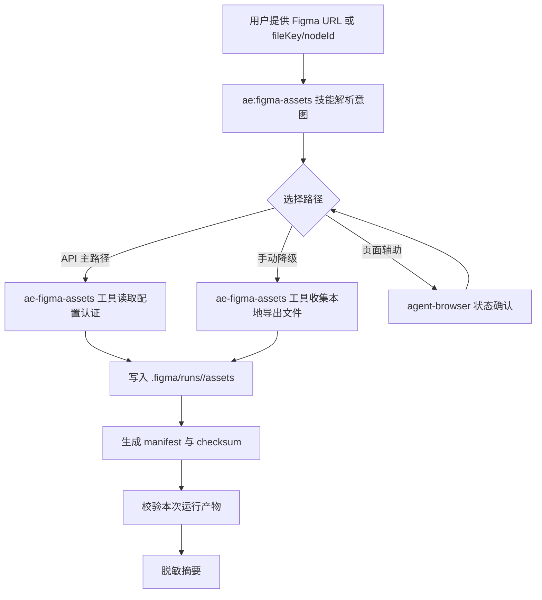

# Figma 素材导出技能计划

## 来源与目标

基于 `docs/ae/brainstorms/figma-asset-browser-skill-requirements.md`，新增 opencode 原生 Figma 素材导出能力。

目标是让代理在不调用 Trae、Trae CN、Trae 内部命令、Trae WebView 或 Trae 安装目录私有代码的前提下，使用用户显式配置的 Figma API 认证或用户手动导出的本地文件，把素材写入当前工作区 `.figma/`，生成 manifest，并输出脱敏执行摘要。

## 关键决策

- 首版主路径采用 Figma 官方 API：通过配置提供 `FIGMA_API_KEY` 或 `FIGMA_OAUTH_TOKEN`，调用 Figma API 获取节点渲染 URL 或图片填充 URL，然后下载到受控目录。
- 手动导出收集作为降级路径：用户不配置 token、API 失败或权限不足时，允许收集用户已手动导出的本地文件。
- `agent-browser` 只作为可选辅助：用于打开 Figma 页面、确认登录态/权限态、采集本地证据；不把点击下载视为素材已落盘。
- 新增最小 TypeScript 工具是必要的：技能文档负责流程编排，工具负责认证读取、路径约束、下载、checksum、manifest 和本次运行校验。
- 借鉴 `GLips/Figma-Context-MCP` 的实现模式，但不依赖其 MCP 服务作为必需链路：可参考 API key/OAuth 配置、`/v1/images/:file_key`、`/v1/files/:file_key/images`、节点 ID `-` 到 `:` 规范化、受控下载目录、文件名校验和下载摘要。

## 高层设计



### 建议运行产物

- `.figma/runs/<runId>/assets/*`：本次运行素材，是防止历史残留误判的内部真实写入目录。
- `.figma/runs/<runId>/manifest.json`：本次运行清单。
- `.figma/assets/*`：最新成功运行素材的索引或副本目录，用于满足需求文档中的稳定产物路径；不得作为本次运行成功的唯一判据。
- `.figma/manifest.json`：指向最新运行的汇总清单或最新清单副本，用于满足需求文档中的稳定清单路径。
- `.figma/runs/<runId>/evidence/*`：可选截图或状态证据，不在最终回答中嵌入私有画面。

### manifest 最小字段

```json
{
  "schemaVersion": 1,
  "runId": "20260428-...",
  "startedAt": "ISO-8601",
  "completedAt": "ISO-8601",
  "source": {
    "type": "api|manual|browser-assisted",
    "authMode": "api-key|oauth|none",
    "figma": {
      "fileKeyHash": "sha256-prefix",
      "nodeIds": ["redacted-or-hash"]
    }
  },
  "assets": [
    {
      "path": ".figma/runs/<runId>/assets/icon.svg",
      "format": "svg",
      "size": 1234,
      "sha256": "...",
      "sourceNodeId": "redacted-or-hash",
      "createdAt": "ISO-8601"
    }
  ],
  "warnings": [],
  "failures": []
}
```

## 实现单元

### 1. 资产注册与技能入口

- [ ] 在 `src/schemas/ae-asset-schema.ts` 增加技能常量，建议命名为 `SKILL.FIGMA_ASSETS = 'ae:figma-assets'`。
- [ ] 在 `src/schemas/ae-asset-schema.ts` 增加工具常量，建议命名为 `TOOL.AE_FIGMA_ASSETS = 'ae-figma-assets'`。
- [ ] 确认 `COMMAND` 自动派生出 `/ae-figma-assets`，并把技能加入 `AeSkillNameSchema`。
- [ ] 在 `src/services/ae-catalog.ts` 添加目录项，位置遵循技能列表顺序：主流程之后、辅助工具中靠近 `ae:test-browser` 与 `ae:swagger-parser`。
- [ ] 新增 `src/assets/skills/ae-figma-assets/SKILL.md`，frontmatter 的 `name`、`description`、`argument-hint` 与 catalog 保持一致。
- [ ] 更新 `src/tools/index.ts` 时必须使用 `[TOOL.AE_FIGMA_ASSETS]` 注册，禁止硬编码工具名。

验收：`ae:help` 能列出新技能和命令，技能名、命令名、catalog、frontmatter 字段一致。

### 2. 技能文档流程

- [ ] 在 `SKILL.md` 中定义适用场景：从用户有权访问的 Figma 文件或节点导出素材到当前工作区。
- [ ] 明确非目标：不做像素级设计同步，不替代 `figma-design-sync`，不替代 `ae:test-browser`，不调用 Trae。
- [ ] 定义路径选择：API 主路径、手动导出收集降级、agent-browser 可选状态确认。
- [ ] 定义配置认证：默认支持环境变量 `FIGMA_API_KEY`、`FIGMA_OAUTH_TOKEN`；可选支持用户显式传入的本地私有 env 文件路径，OAuth 优先级高于 API key；所有输出只展示认证模式和脱敏来源。
- [ ] 定义 API 输入前提：首版 API 下载必须有明确 nodeId；仅提供 fileKey 或文件 URL 且无 nodeId 时，技能应补问或降级，不自动遍历整文件。
- [ ] 定义失败分类：输入非法、未配置认证、凭证无效、权限不足、节点不可导出、限流、工作区不可写、manifest 校验失败、仅有页面证据无素材。
- [ ] 定义最终摘要格式：状态、路径类型、文件数量、脱敏相对路径、失败类别、下一步。

验收：技能文档可单独指导代理完成流程，并清楚说明何时调用工具、何时使用 agent-browser、何时降级。

### 3. Schema 与参数边界

- [ ] 新增 `src/schemas/figma-asset-schema.ts`，定义工具参数、manifest 和结果摘要 Schema。
- [ ] 工具模式建议：`mode: 'api' | 'collect' | 'validate'`。
- [ ] API 参数支持 `figmaUrl`、`fileKey`、`nodeIds`、`format: 'png' | 'svg'`、`pngScale`、`outputName`；`mode: 'api'` 下必须能得到至少一个 nodeId。
- [ ] 配置参数支持 `envFile` 或 `credentialSource` 这类“配置引用”，但不允许直接把 token 作为工具参数传入。
- [ ] 收集参数支持用户提供的本地文件路径列表，但输出文件名必须重新规范化。
- [ ] 路径和文件名规则：拒绝 `..`、绝对输出路径、路径分隔符、危险扩展名和符号链接逃逸。

验收：非法输入在工具层被 Zod 或服务校验拒绝，并返回中文可恢复错误。

### 4. 工具编排层

- [ ] 新增 `src/tools/ae-figma-assets.tool.ts`，工具描述说明适用场景、不适用场景和安全边界。
- [ ] 工具层负责从 `ctx.directory`、`ctx.worktree`、环境变量和显式配置引用中收集运行上下文。
- [ ] 工具层调用 service，捕获错误并返回中文摘要；只有工具层负责用户可见错误提示或 toast。
- [ ] service 层只接收普通参数或注入依赖，不依赖 `@opencode-ai/plugin/tool` 类型、TUI、toast 或运行时上下文。

验收：工具层薄编排，service 层无上层依赖，错误只在工具层转为用户可见消息。

### 5. Figma API 下载服务

- [ ] 新增 `src/services/figma-asset-service.ts`，封装 API 认证、URL 解析、下载 URL 获取、写盘和 manifest 生成。
- [ ] 保持 service 对外门面简洁，但内部拆分为小模块或纯函数：认证解析、URL/nodeId 解析、路径安全、下载客户端、manifest 构造与校验、错误分类。
- [ ] 认证读取优先级：`envFile` 指定的本地私有 env 文件、进程环境变量、明确配置引用；显式工具参数中只允许配置引用，不直接传 token。
- [ ] 如支持 env 文件，必须限制在当前工作区或用户显式提供的本地路径，提醒不要纳入版本控制；读取后 token 仅保留在内存中，不写入任何产物。
- [ ] 支持 API key 请求头 `X-Figma-Token` 和 OAuth 请求头 `Authorization: Bearer ...`。
- [ ] 节点渲染使用 `/v1/images/:file_key?ids=...&format=...`。
- [ ] 图片填充增强可参考 `/v1/files/:file_key/images`，但首版可只做节点渲染，图片填充下载列为后续增强。
- [ ] 从 Figma API 得到的下载 URL 必须校验：仅允许 `https`、Figma 官方或可信 CDN 域名、禁止 localhost/私网/链路本地地址、限制重定向次数并逐跳复验、设置下载超时和大小上限。
- [ ] 下载远程 URL 后写入 `.figma/runs/<runId>/assets/*`，记录 size 和 sha256。
- [ ] 处理 401/403/404/429/空 URL/下载失败，映射为明确失败分类。

验收：给定 mock Figma API 响应时，服务能下载 mock 图片、生成 manifest，并且不输出 token。

### 6. 手动导出收集服务

- [ ] 在同一服务中实现 `collect` 模式：读取用户指定的本地导出文件，复制到 `.figma/runs/<runId>/assets/*`。
- [ ] 复制前后解析真实路径，拒绝符号链接、快捷方式或校验后被替换的来源。
- [ ] 写入目标路径前逐级检查 workspace、`.figma`、`runs`、`assets` 目录，不允许符号链接、junction 或 Windows reparse point。
- [ ] 复制后只使用工作区隔离目录中的副本继续计算 checksum 和生成 manifest。
- [ ] 文件重名时用安全后缀或 runId 避免覆盖。

验收：历史 `.figma` 文件存在时，收集模式只把本次复制的文件计入成功。

### 7. 本次运行校验与脱敏输出

- [ ] 每次运行创建唯一 `runId` 和隔离目录，不以 mtime 作为唯一成功判据。
- [ ] `validate` 模式读取 manifest，校验文件存在、路径在 `.figma/` 内、checksum 匹配、至少一个素材属于当前 runId。
- [ ] manifest、warnings、failures 和最终摘要共用脱敏策略：不保存原始 API 错误体；只保留失败分类、安全状态码、hash 后的 fileKey/nodeId；用户自定义 outputName 需长度和字符集校验。
- [ ] 脱敏 Figma URL、fileKey、nodeId、账号、组织、token、页面名、组件名、截图名和绝对路径。
- [ ] 最终工具返回相对路径和数量，不返回私有设计画面、完整 DOM 或凭证。

验收：manifest 与文件不一致时返回失败；摘要中不含完整 token、完整私有 URL 或绝对本机路径。

### 8. 测试与文档同步

- [ ] 新增 `tests/tools/ae-figma-assets.tool.test.ts` 覆盖工具参数、错误路径和摘要脱敏。
- [ ] 新增 `tests/services/figma-asset-service.test.ts` 覆盖 API 下载、手动收集、manifest、checksum、路径逃逸和历史残留。
- [ ] 新增 `tests/schemas/figma-asset-schema.test.ts` 覆盖 manifest schema、非法输入和超长输入。
- [ ] 更新资产注册一致性测试，覆盖 `SKILL`、`COMMAND`、`TOOL`、`AeSkillNameSchema`、`AeCommandNameSchema`、catalog 与 `SKILL.md` frontmatter 的一致性。
- [ ] 如新增工具注册，更新 `src/tools/index.ts` 及相关工具注册测试。
- [ ] 使用 Vitest `it.each` / `describe.each` 表驱动覆盖 URL/nodeId 解析、危险路径、HTTP 状态码、脱敏字段和 checksum 错误，避免重复测试代码。

验收命令：`npm run typecheck`、`npm run test`、`npm run build`。

## 测试场景

- 合法 Figma URL + nodeId 能解析为 fileKey 和 nodeId。
- `node-id=1-2` 能规范化为 API 所需的 `1:2`。
- 非 Figma 官方 URL、危险字符、路径穿越、绝对输出路径被拒绝。
- 未配置 token 时 API 模式返回可恢复错误。
- API key 与 OAuth token 同时存在时按计划优先级选择，并只输出认证模式。
- Figma API 返回 403、404、429、空 images 时有明确失败分类。
- 下载 URL 成功但写盘失败时不会生成成功 manifest。
- 手动收集单文件、多文件成功。
- 手动收集来源文件不存在、符号链接、校验后被替换时失败。
- 历史 `.figma` 残留存在时不误判成功。
- checksum 不匹配时 `validate` 失败。
- 最终摘要不包含 token、完整私有 URL、绝对本机路径或私有设计画面。

## 风险与缓解

- Figma API 限流：首版对 429 分类并提示稍后重试；复杂退避可后续增强。
- API token 配置泄露：不把 token 放入工具参数、manifest、日志或最终报告；测试覆盖脱敏。
- SVG/PNG 行为差异：首版按格式分流，SVG 不做图片尺寸后处理；PNG 支持 scale。
- 图片填充与节点渲染差异：首版优先节点渲染；图片填充下载可借鉴 `Figma-Context-MCP` 后续增强。
- Web UI 下载不可控：不作为首版成功路径，agent-browser 仅做状态确认。

## 推迟事项

- 完整图片填充下载、GIF 支持、裁剪 transform、尺寸 CSS 变量生成。
- 受控 Playwright 下载事件与下载目录控制。
- OAuth 交互授权流程；首版只消费用户已配置的 OAuth token。
- 多项目级配置文件格式的自动发现；首版优先环境变量和明确配置路径。
