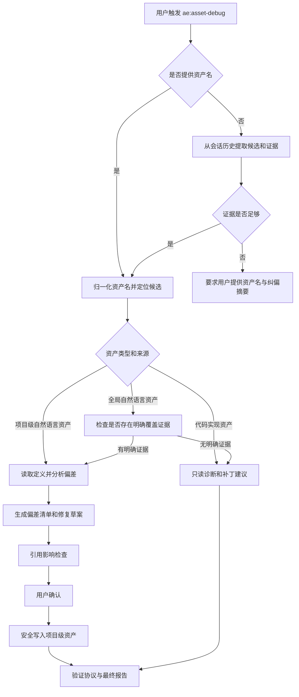

# 资产调试技能实现计划

## 来源与目标

来源需求：`docs/ae/brainstorms/asset-debug-skill-requirements.md`

目标是新增 `ae:asset-debug` 技能，把 opencode 会话中的一次性纠偏转化为可持久化的资产修复流程。首版采用“技能文档 + 现有工具编排 + 公开资产注册链路”的形态，不新增 TypeScript 工具或可执行脚本。

首版通用用户侧能力聚焦技能、代理、命令、规则等自然语言资产：能定位资产、对比标准流程与实际偏航、输出偏差清单，并在安全条件下修复已存在的项目级自然语言资产。全局自然语言资产首版默认只诊断；只有执行时能取得明确覆盖证据，才可创建候选项目级覆盖，且最终报告必须区分“已创建候选覆盖”和“已验证生效”。工具、hook、service、schema 等代码实现资产首版只诊断和给出补丁建议。

## 影响范围

- 使用者：通过 `/ae-asset-debug` 或 `ae:asset-debug` 修复当前项目中导致执行路线偏航的资产定义。
- 维护者：需要同步新增公开技能、命令、帮助目录、TUI 命令和测试，防止资产入口不可见或引用漂移。
- 下游项目：技能说明必须使用通用 opencode 项目语境，不要求目标项目存在本仓库源码结构。
- 本仓库源码维护：新增公开 AE 技能时需要同步 `SKILL`、`AeSkillNameSchema`、`ae-catalog.ts`、命令/help 测试；该分支必须明确标注为插件源码维护语境。
- 安全边界：技能允许读取必要资产定义并写当前工作空间内项目级资产；禁止直接写全局资产、用户主目录、外部插件目录或其他项目。

## 关键决策

- 技能名定为 `ae:asset-debug`，命令名由 `COMMAND` 自动派生为 `/ae-asset-debug`。
- 首版不新增 `TOOL.AE_ASSET_DEBUG`，也不新增 `src/tools/ae-asset-debug.tool.ts`；技能使用现有 read/glob/grep/apply_patch/question/task 等能力编排。
- 自动识别资产必须满足最低证据门槛；缺少实际调用链或用户确认的纠偏对象时，必须补问而不是仅凭触发入口猜测。
- 全局自然语言资产首版默认只输出诊断和人工修复建议；若执行时能取得明确覆盖证据，可创建候选项目级覆盖，但不得在无运行时证据时宣称已生效。
- 全局代码实现资产首版只诊断，不复刻、不覆盖、不写入全局代码。
- 引用影响检查是修复流程的一部分，不是最终审查附加项。
- 本仓库新增公开技能必须验证 frontmatter、catalog、命令生成、help 输出和测试断言的一致性。

## 高层流程

## 资产类型支持矩阵

| 资产类型 | 输入示例 | 首版动作 | 项目级发现/写入候选 | 全局处理 | 覆盖验证要求 |
|------|------|------|------|------|------|
| 技能 | `ae:plan`、`/ae-plan`、`ae-plan` | 项目级文本修复；全局资产默认只诊断，证据充分时可创建候选覆盖 | `.opencode/skills/<name>/SKILL.md`；本仓库源码模式为 `src/assets/skills/<name>/SKILL.md` | 只读全局定义，默认不写；候选覆盖必须标注未验证风险 | 需运行时或配置证据；无证据不得宣称生效 |
| 代理 | `@correctness-reviewer`、`correctness-reviewer` | 项目级文本修复；全局资产默认只诊断，证据充分时可创建候选覆盖 | 项目级 agent 定义路径；本仓库源码模式为 `src/assets/agents/**/<name>.md` | 只读全局定义，默认不写；候选覆盖必须标注未验证风险 | 需 agent 加载证据；无证据不得宣称生效 |
| 命令 | `/ae-review`、`ae-review` | 项目级文本修复；全局资产默认只诊断，证据充分时可创建候选覆盖 | 项目级 command 定义路径；本仓库源码模式检查 catalog 生成和 `src/assets/commands/*.md` 覆盖 | 只读全局定义，默认不写；候选覆盖必须标注未验证风险 | 必须区分命令模板问题与被转发技能问题 |
| 规则 | `.opencode/rules/core/base.md`、规则名 | 项目级文本修复；全局规则默认只诊断 | `.opencode/rules/**/*.md`、`AGENTS.md`、`opencode.json` instructions 引用 | 只读全局规则，必要时建议项目级规则 | 验证规则文件被 instructions 或 AGENTS 链路引用 |
| 工具/hook/service/schema | `ae-review-contract`、`review-selector` | 首版只读诊断 + 补丁建议 | 普通项目中不自动修改代码；只有本仓库源码维护场景且计划显式授权时才纳入代码修改 | 全局代码不写、不复刻 | 不宣称已修复，只给人工迁移或源码模式计划 |

执行阶段若发现某类资产的项目级覆盖优先级不能用当前工具可靠验证，该类型必须降级为只读诊断，或仅创建明确标注“候选覆盖，尚未验证生效”的项目级文件并要求用户人工复现确认。

## 自动识别决策树

- 有明确资产名：归一化后进入候选定位。
- 无资产名但会话中有单一纠偏对象或实际调用链：展示候选和证据摘要，若置信度高可继续，但修改前仍需确认。
- 单一触发入口只能作为候选线索，不能作为自动继续的充分条件；涉及命令转发、技能别名或包装入口时，必须取得实际调用链证据，或由用户明确确认要修入口而非下游执行资产。
- 多候选：列出入口资产、下游执行资产、被用户纠偏对象和证据，要求用户选择。
- 历史不可用或证据不足：要求用户提供资产名、偏航实际行为、纠偏后的期望行为、相关消息片段摘要。
- 纠偏不属于资产问题：停止资产修复，说明这是一次性任务理解偏差或需要其他技能处理。

## 安全写入算法

- 写入范围只允许当前工作空间内项目级资产路径。
- 对所有读写目标先做路径规范化和真实路径解析，确认真实路径位于 workspace 根目录内。
- 拒绝路径穿越、绝对越界路径、符号链接、junction、Windows reparse point 或等价链接导致的越界写入。
- 新建文件时逐级确认父目录在 workspace 内；父目录不存在时先确认目标目录意图。
- 修改已有文件前记录内容哈希或等价基线；写入前重新读取并比对，若变化则停止并要求用户决定。
- 遇到用户或其他代理已有无关修改，不回滚、不覆盖；同文件冲突时只展示冲突和建议。
- 若无法用现有工具可靠确认真实路径、父目录链接状态或写前基线未变化，必须降级为只读诊断，禁止执行写入。
- 输出只使用仓库相对路径；所有读取内容和输出都必须脱敏，包括项目级资产、全局资产、diff、错误片段、会话摘录和引用影响报告；不得回显绝对路径、token、cookie、私钥、个人目录或私有 URL。

## 引用影响检查范围

普通项目模式每次修复至少检查静态引用：

- 同名技能、代理、命令、规则定义是否存在项目级覆盖。
- `opencode.json`、`AGENTS.md`、`.opencode/rules/**/*.md` 中是否引用相关资产或入口。
- 项目文档中是否有调用方式、参数约定或流程说明需要同步。
- 若修改命令或参数约定，检查命令模板、转发目标和用户文档。

普通项目模式还必须报告动态来源检查状态：插件动态注册、TUI 命令、帮助索引、生成目录或运行时注入来源若无法检查，必须在最终报告中列为“未验证动态来源”，不得笼统声称引用影响检查完整。

本仓库源码维护模式仅在当前工作区被明确识别为 `ai-agent-engine` 源码仓库时启用；该分支应作为技能文档附录或条件分支，不作为普通项目用户的必经步骤。每次新增或修改公开 AE 技能至少检查：

- `src/schemas/ae-asset-schema.ts` 的 `SKILL` 与 `AeSkillNameSchema`。
- `src/services/ae-catalog.ts` 的 `PHASE_ONE_ENTRIES`、`description`、`argumentHint` 和排序。
- `src/assets/skills/<skill>/SKILL.md` frontmatter 的 `name`、`description`、`argument-hint`。
- `src/services/command-registration.ts` 是否由 catalog 自动生成基础命令、`-po`、`-pa`，以及是否存在磁盘命令覆盖。
- `src/services/help-catalog-service.ts` 和相关测试是否仍符合帮助输出预期。
- `tests/schemas/ae-asset-schema.test.ts`、`tests/services/command-registration.test.ts`、`tests/services/help-catalog-service.test.ts`、`tests/services/help-catalog-service.integration.test.ts` 是否需要同步断言。
- `src/index.ts`、`src/services/skills-path-service.ts`、`src/services/runtime-asset-manifest.ts` 是否仍通过 `config.skills.paths` 注入 `src/assets/skills`；不要把复制到 `.opencode/skills/` 当作公开技能生效路径。

最终报告必须包含“引用影响检查”小节，列出已检查引用点、受影响项、同步修改项和无需修改理由。

## 实现单元

### 1. 技能文档最小骨架

- [ ] 目标：先创建 `SKILL.md` 最小 frontmatter 和章节骨架，为后续注册和一致性测试提供真实目标。
- [ ] 需求：覆盖 R1。
- [ ] 文件：`src/assets/skills/ae-asset-debug/SKILL.md`。
- [ ] frontmatter 建议：`name: ae:asset-debug`；`description: 修复 opencode 会话中生效资产的执行流程偏差`；`argument-hint: "[资产名|纠偏摘要]"`。
- [ ] 章节骨架：适用场景、非目标、输入解析、资产识别、偏差分析、修复策略、安全边界、引用影响检查、验证协议、源码维护附录、最终报告格式。
- [ ] 验证：文件路径、frontmatter 和章节标题存在；内容暂可在后续单元填充。

### 2. 资产常量与 catalog 注册

- [ ] 目标：让 `ae:asset-debug` 成为公开可发现技能。
- [ ] 需求：覆盖 R1、R11。
- [ ] 文件：`src/schemas/ae-asset-schema.ts`、`src/services/ae-catalog.ts`。
- [ ] 方法：在 `SKILL` 中新增 `ASSET_DEBUG: 'ae:asset-debug'`；将 `SKILL.ASSET_DEBUG` 加入 `AeSkillNameSchema`；确认 `COMMAND.ASSET_DEBUG` 自动派生，不手写命令字面值。
- [ ] catalog：在辅助工具区新增 `PHASE_ONE_ENTRIES` 条目，作为资产/规则维护类辅助技能，放在 `SKILL.SAVE_RULES` 之后、`SKILL.HELP` 之前；保持 `SKILL`、`AeSkillNameSchema`、`PHASE_ONE_ENTRIES` 中相关顺序一致。
- [ ] frontmatter 一致性：catalog 的 `argumentHint` 必须与 `SKILL.md` 的 `argument-hint` 字面一致；`description` 语义一致。
- [ ] 验证：`npm run test -- tests/schemas/ae-asset-schema.test.ts tests/services/command-registration.test.ts tests/services/help-catalog-service.test.ts tests/services/help-catalog-service.integration.test.ts`。

### 3. 技能文档通用流程章节

- [ ] 目标：填充 `SKILL.md` 中面向普通项目用户的默认执行路径。
- [ ] 需求：覆盖 R1-R4、R7-R10、R12-R15。
- [ ] 文件：`src/assets/skills/ae-asset-debug/SKILL.md`。
- [ ] 内容结构：适用场景、非目标、输入解析、资产识别、偏差分析、修复层级、安全边界、引用影响检查、验证协议、最终报告格式。
- [ ] 明确首版不新增工具或脚本，不复刻全局代码资产，不直接写全局资产。
- [ ] 验证：人工阅读技能文档，确认能覆盖传资产名和未传资产名两条路径。

### 4. 资产名归一化与识别章节

- [ ] 目标：让技能能处理常见输入形式，并在不确定时补问。
- [ ] 需求：覆盖 R2、R3。
- [ ] 文件：`src/assets/skills/ae-asset-debug/SKILL.md`。
- [ ] 归一化规则：支持 `ae:foo`、`/ae-foo`、`ae-foo`、`foo`、`@agent-name`、文件路径、规则文件名。
- [ ] 候选输出：资产类型、归一化名称、证据、来源层级、是否可能只是入口包装。
- [ ] 自动识别门槛：必须具备实际调用链或用户确认的纠偏对象；触发入口只能作为候选线索。多个候选时使用 `question` 工具让用户选择。
- [ ] 降级输入模板：要求用户提供资产名、偏航实际行为、期望行为、相关消息片段摘要。
- [ ] 验证：文档内给出示例，覆盖 `/ae-document-review` 转发到 `ae:review domain:document` 这类入口和执行资产分离场景。

### 5. 资产类型支持矩阵与覆盖策略章节

- [ ] 目标：防止技能在覆盖机制未验证时制造假修复。
- [ ] 需求：覆盖 R2、R7-R10、R12。
- [ ] 文件：`src/assets/skills/ae-asset-debug/SKILL.md`。
- [ ] 方法：将计划中的资产类型支持矩阵写入技能文档，作为执行时判定规则。
- [ ] 对项目级自然语言资产：允许用户确认后修改。
- [ ] 对全局自然语言资产：默认只诊断；有明确覆盖证据时可创建候选覆盖，但最终报告必须区分“候选覆盖”和“已验证生效”。
- [ ] 对代码实现资产：只读诊断、补丁建议和人工迁移路径；本仓库源码维护模式必须显式说明才能改代码。
- [ ] 验证：文档明确“创建项目级覆盖”与“覆盖已生效”是不同状态，后者必须有证据。

### 6. 偏差分析与修复层级章节

- [ ] 目标：让输出不仅是“改提示词”，而是能定位定义层和代码层差异。
- [ ] 需求：覆盖 R4-R6、R9、R10。
- [ ] 文件：`src/assets/skills/ae-asset-debug/SKILL.md`。
- [ ] 偏差清单字段：标准预期、实际行为、纠偏证据、影响范围、根因假设、推荐修复层级、证据置信度。
- [ ] 修复层级：技能/agent/command/rule 文本、工具描述、catalog/help/命令引用、service/schema/selector 代码建议、人工决策项。
- [ ] 双重决策规则：先识别运行时权威来源、字段一致性要求和有意双轨差异；无法裁决时不得自动同步代码。
- [ ] 验证：技能文档包含至少一个“SKILL.md 与代码逻辑冲突但不自动裁决”的处理示例。

### 7. 安全写入与脱敏章节

- [ ] 目标：把 R12-R14 转化为技能执行时的硬门禁。
- [ ] 需求：覆盖 R12-R14。
- [ ] 文件：`src/assets/skills/ae-asset-debug/SKILL.md`。
- [ ] 方法：在技能中要求写入前报告目标路径、来源层级、是否项目级、是否已确认真实路径位于 workspace 内。
- [ ] 路径安全：允许使用受控 shell 或平台 API 执行 `realpath`/`lstat`/Windows reparse point 等价检查；若当前环境无法可靠检查目标文件和每一级父目录，必须降级为只读诊断。
- [ ] 并发保护：读取基线后写入前重新检查；发现变化停止。
- [ ] 脱敏输出：所有读取内容和输出，包括项目级资产、全局资产、diff、错误片段和会话摘录，都必须脱敏；疑似凭证出现时停止自动修复并只报告相对路径和脱敏摘要。
- [ ] 验证：文档中明确拒绝 `.env`、私钥、凭证文件、用户主目录敏感文件和全局资产写入请求。

### 8. 引用影响检查章节

- [ ] 目标：满足 R11，防止只改资产本体导致命令/help/catalog/test 漂移。
- [ ] 需求：覆盖 R11。
- [ ] 文件：`src/assets/skills/ae-asset-debug/SKILL.md`。
- [ ] 方法：普通项目模式作为默认必经步骤；本仓库源码维护模式写成条件分支或附录，仅在识别到 `ai-agent-engine` 源码仓库时启用。
- [ ] 普通项目：检查 `.opencode` 资产、`opencode.json`、`AGENTS.md`、规则引用和项目文档。
- [ ] 动态来源：将插件动态注册、TUI 命令、帮助索引、生成目录和运行时注入列为单独检查类别；无法检查时在报告中明确列为未验证。
- [ ] 本仓库源码：检查 `ae-asset-schema.ts`、`ae-catalog.ts`、`command-registration` 派生命令、磁盘命令覆盖、help 输出、测试断言和 `config.skills.paths` 注入链路。
- [ ] 输出格式：最终报告固定包含“已检查引用点、受影响项、同步修改项、无需修改理由”。
- [ ] 验证：技能文档示例中包含参数提示变更需要同步 catalog/help/test 的场景。

### 9. 修复后验证协议章节

- [ ] 目标：区分已自动验证、只能人工验收和未验证风险。
- [ ] 需求：覆盖 R15。
- [ ] 文件：`src/assets/skills/ae-asset-debug/SKILL.md`。
- [ ] 验证协议字段：修复前失败样例、修复后期望行为、相同输入复现实验、可执行命令、人工验收步骤、剩余风险。
- [ ] 普通项目验证：最小复现提示、资产文件 diff、项目级覆盖生效证据。
- [ ] 本仓库源码验证：命令/help/schema 测试、`npm run typecheck`、`npm run test`、`npm run build`。
- [ ] 非确定性说明：LLM 行为验证只能降低风险，不能承诺根除；无法自动验证时必须明确说明。
- [ ] 用户价值验收样例：给定一个项目级 `SKILL.md` 或命令模板偏差，技能应产出偏差清单、修复草案、确认点和验证步骤。

### 10. 注册链路和帮助输出测试

- [ ] 目标：确保新增公开技能能通过命令、TUI 和帮助发现。
- [ ] 需求：覆盖 R1、R11。
- [ ] 文件：`tests/schemas/ae-asset-schema.test.ts`、`tests/services/command-registration.test.ts`、`tests/services/help-catalog-service.test.ts`、`tests/services/help-catalog-service.integration.test.ts`。
- [ ] 使用表驱动或共享测试数据覆盖新增技能注册链路，避免 schema、command、help 测试手工重复导致遗漏。
- [ ] Schema 测试：`AeSkillNameSchema` 接受 `SKILL.ASSET_DEBUG`；`AeCommandNameSchema` 接受 `COMMAND.ASSET_DEBUG`、`${COMMAND.ASSET_DEBUG}${PO_SUFFIX}`、`${COMMAND.ASSET_DEBUG}${PA_SUFFIX}`。
- [ ] 命令测试：`buildCommandConfig()` 生成 `/ae-asset-debug`、`/ae-asset-debug-po`、`/ae-asset-debug-pa`；`createTuiCommands()` 暴露命令和参数提示。
- [ ] 帮助测试：`generateHelpText('asset-debug')` 或等价查询包含 `ae:asset-debug`、`/ae-asset-debug`、`-po`、`-pa`。
- [ ] frontmatter 一致性：测试或现有断言覆盖 `argument-hint` 与 catalog `argumentHint` 字面一致。

### 11. 构建与资产同步验证

- [ ] 目标：确认新增技能能进入运行时资产路径和插件产物。
- [ ] 需求：覆盖 R1、R11、R15。
- [ ] 文件：`src/assets/skills/ae-asset-debug/SKILL.md`、构建产物由脚本生成。
- [ ] 方法：执行完整验证命令；不手动编辑 `.opencode/plugins/`、`.opencode/skills/` 或 dist 产物。
- [ ] 运行时注入：验证 `registerSkillsPath` / `createRuntimeAssetManifest` 对新增 `src/assets/skills/ae-asset-debug/SKILL.md` 的可发现性；明确公开技能通过 `config.skills.paths -> src/assets/skills` 注入，不通过复制到 `.opencode/skills/` 生效。
- [ ] 验证：`npm run typecheck`、`npm run test`、`npm run build`。

## 测试矩阵

| 类别 | 必测或必审场景 |
|------|------|
| 资产注册 | `SKILL.ASSET_DEBUG`、`AeSkillNameSchema`、`COMMAND.ASSET_DEBUG`、`-po`、`-pa` |
| catalog/frontmatter | `description` 语义一致、`argumentHint` 与 `argument-hint` 字面一致、技能排序合理 |
| 命令注册 | `/ae-asset-debug`、`/ae-asset-debug-po`、`/ae-asset-debug-pa` 自动生成，不新增磁盘命令覆盖 |
| 帮助输出 | `/ae-help asset-debug` 能发现技能和命令 |
| 资产识别文档 | 有资产名、无资产名、多候选、历史不可用、入口资产与执行资产分离 |
| 覆盖策略文档 | 项目级文本资产、全局文本资产默认只诊断、候选覆盖未验证提示、全局代码资产只诊断 |
| 安全边界文档 | 工作区外写入、全局写入、敏感文件读取、路径链接、无法可靠检查时只读降级、并发变化、所有输出脱敏 |
| 引用影响文档 | 普通项目引用检查、动态来源未验证报告、本仓库源码条件分支、测试断言同步 |
| 验证协议文档 | 自动验证、人工验收、非确定性模型风险、验证失败处理 |

## 验证命令

- `npm run test -- tests/schemas/ae-asset-schema.test.ts tests/services/command-registration.test.ts tests/services/help-catalog-service.test.ts tests/services/help-catalog-service.integration.test.ts`
- `npm run typecheck`
- `npm run test`
- `npm run build`

## 风险与缓解

- 覆盖机制误判：首版默认全局资产只诊断；候选覆盖必须标注未验证风险，只有取得运行时或配置证据时才可宣称生效。
- 自动识别改错资产：设置最低证据门槛，多候选必须用户确认。
- 本仓库源码结构污染下游技能：技能文档明确普通项目模式和插件源码维护模式，源码路径只在源码模式出现。
- 引用漂移：将引用影响检查写入必经流程，并用 schema、命令、help 测试覆盖本仓库新增技能链路。
- 虚假验证：最终报告区分候选覆盖、已验证生效、自动验证、人工验收和剩余风险，不承诺确定性根除模型偏航。
- 过早工具化：首版不新增工具；若执行阶段发现文本流程无法满足验收，必须回到计划变更或用户授权。

## 推迟事项

- 新增 `ae-asset-debug` TypeScript 工具来结构化扫描资产和引用。
- 自动复刻全局代码实现资产为项目级 tool/script。
- 跨项目资产迁移或全局资产直接修复。
- 可重复运行的会话重放框架。
- 对所有 opencode 资产加载优先级做自动运行时探针验证。

## 交付顺序

1. 创建 `SKILL.md` 最小 frontmatter 与章节骨架。
2. 注册 `SKILL.ASSET_DEBUG` 和 catalog，让入口可发现。
3. 写 `SKILL.md` 的普通项目核心流程：输入识别、资产类型矩阵、偏差分析、修复层级。
4. 补充安全写入、脱敏、并发保护、引用影响检查和验证协议；源码维护模式只作为条件分支。
5. 更新 schema、命令注册、help 输出和 frontmatter 一致性测试，优先使用表驱动断言。
6. 运行目标测试、完整测试、类型检查和构建。

## 下一步

-> /ae-work docs/ae/plans/2026-04-28-002-feat-asset-debug-skill-plan.md
