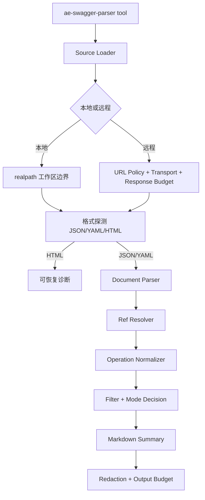

# Swagger 解析技能重构增强计划

## 来源与目标

来源需求：`docs/ae/brainstorms/swagger-parser-skill-requirements.md`

目标是在现有 `ae:swagger-parser` 首版能力上做增强，而不是重写为完整 OpenAPI 平台。新版能力应让用户提供本地或远程 JSON/YAML Swagger/OpenAPI 规格后，获得可导航概览和单接口联调详情；同时对 OpenAPI 3.1、内部 `$ref`、相对文件 `$ref`、大文档导航、诊断和脱敏提供明确的支持或降级边界。

本计划以需求文档的“发布切片”为实施边界：先交付可独立工作的 MVP，再按首版增强推进，P2 能力只记录后续边界，不进入 MVP 的完成条件。

## 现状摘要

- 当前工具入口已存在：`src/tools/ae-swagger-parser.tool.ts`。
- 当前服务链路为：`src/services/swagger-service.ts` 加载来源、`JSON.parse`、解析、筛选、格式化、脱敏。
- 当前只支持 JSON；`src/services/swagger-source-loader.ts` 明确拒绝 `.yaml` / `.yml`。
- 当前解析器支持 Swagger 2.0 和 OpenAPI 3.x 常见结构，但未区分 OpenAPI 3.0 与 3.1。
- 当前 `src/services/swagger-ref-resolver.ts` 只提供简单 JSON Pointer 读取，尚未接入主解析路径，也缺少循环和预算控制。
- 当前远程 URL、安全策略、响应预算和脱敏已有基础实现：`src/services/swagger-remote-policy.ts`、`src/services/swagger-remote-transport.ts`、`src/services/swagger-remote-response-budget.ts`、`src/services/swagger-redaction-service.ts`。
- 当前旧计划 `docs/ae/plans/2026-04-28-001-feature-swagger-parser-skill-plan.md` 作为首版历史参考，不再作为本次增强的范围上限。

## 影响范围

- 使用者：通过 `/ae-swagger-parser` 或 `ae:swagger-parser` 解析接口文档的用户。
- 代理：需要继续通过结构化参数调用工具，不依赖自然语言解析作为唯一入口。
- 维护者：需要维护解析器、loader、resolver、formatter、脱敏、测试 fixture 和技能说明的一致性。
- 安全边界：远程 URL、相对文件 `$ref`、远程 `$ref`、YAML 解析、示例输出和错误诊断都可能引入 SSRF、任意文件读取、资源耗尽或敏感信息泄露风险。

## 关键决策

- 以增强现有首版为主：保留 `src/services/swagger-*.ts` 的分层结构，不做一次性大重写。
- MVP 优先：MVP 只要求 JSON/YAML 主文档、本地/远程安全读取、Swagger 2.0 / OpenAPI 3.0 主流结构、OpenAPI 3.1 版本识别和降级、内部 `$ref` 有限展开、概览和 `method + path` 单接口详情。
- 第三方依赖安全优先：若引入 YAML 或 OpenAPI 解析依赖，不得默认启用外部 file/http resolver；`docs/ae/decisions/swagger-parser-dependency.md` 仍是安全底线。
- 相对文件 `$ref` 可以由自有 resolver 在安全边界内实现；这不等同于允许第三方 resolver 自动读取任意文件。
- 远程 `$ref` 默认降级，不进入 MVP；如后续启用，必须同源或显式授权，并设置总引用数、总字节数、总耗时、重定向和域名预算。
- Swagger UI HTML 页面只做误传诊断，不自动爬取或发现真实 spec URL。
- 保持无状态继续模型：不引入缓存、分页 token 或“继续上一页”状态，通过概览索引和筛选参数继续导航。

## 技术设计

### 内部模型边界

继续使用统一 operation 模型，避免 formatter 直接分支处理 Swagger 2.0 / OpenAPI 3.0 / OpenAPI 3.1。模型需要扩展但不应膨胀为完整规范 AST：

- `specification`: 区分 `swagger2`、`openapi3.0`、`openapi3.1`。
- `sourceType`: 标识 `local` 或 `remote`，用于输出和引用策略。
- `diagnostics`: 记录引用降级、schema 降级、HTML 误传等可恢复信息。
- `schemaFields`: 支持基础类型、数组、枚举、nullable、required、default、example/examples 和有限组合说明。
- `navigationIndex`: 由解析结果或 formatter 生成标签统计、路径前缀分布、展示数量和剩余数量。

### SourceContext 边界

Source Loader 必须向后续 parser 和 resolver 传递稳定的来源上下文，避免各层重复推断路径或运行时根目录：

- `sourceType`: `local` 或 `remote`。
- `content`: 已完成大小预算检查的原始文档内容。
- `format`: `json`、`yaml` 或 `html` 探测结果。
- `realPath`: 仅本地来源存在，必须是入口文件 `realpath` 后路径。
- `documentDir`: 仅本地来源存在，默认作为相对文件 `$ref` 的允许根。
- `workspaceRoot`: 仅用于入口文件安全校验和审计输出，不作为相对 `$ref` 默认读取范围。
- `refBudget`: 引用解析共享预算，包括引用次数、文件数、总字节数、深度和节点数。
- `diagnostics`: 只追加结构化诊断，不在下游拼接未脱敏用户输入。

相对文件 `$ref` 默认只能读取主文档所在目录及其子目录；跨出该目录即使仍在工作区内也必须降级，除非后续新增显式授权根能力。

### 预算默认值

沿用旧计划中的默认预算作为起点，执行阶段如需调整必须记录理由：

| 项目 | 默认值 | 目的 |
|------|--------|------|
| 本地文件大小 | 5 MB | 防止读取超大规格文件 |
| 远程响应体大小 | 5 MB | 防止下载和解析资源耗尽 |
| 远程请求超时 | 10 秒 | 避免挂起 |
| 最大重定向次数 | 3 次 | 降低 SSRF 绕过面 |
| 内部 `$ref` 展开深度 | 4 层 | 避免循环和深层结构刷屏 |
| 默认概览数量 | 30 个接口 | 保持概览可读 |
| 候选建议数量 | 10 个接口 | 无匹配或多匹配时给出导航 |
| 多接口详情数量 | 5 个接口 | 显式 detail 多命中时提供有限请求摘要 |
| 详情输出字符预算 | 12000 字符 | 避免单接口详情过长 |
| 最大 operation 数 | 1000 个 | 防止规范化阶段资源耗尽 |
| 最大 schema 节点数 | 5000 个 | 防止 schema 遍历爆炸 |
| 最大 JSON/YAML 深度 | 80 层 | 防止深层结构消耗解析/遍历资源 |
| 最大 `$ref` 解析次数 | 200 次 | 防止 ref fan-out |
| 最大相对引用文件数 | 20 个 | 防止相对 `$ref` 扫描大量文件 |
| 最大相对引用总字节数 | 10 MB | 防止多文件累积读取过大 |
| 单个相对引用文件大小 | 2 MB | 防止单个引用文件过大 |
| 相对引用解析总耗时 | 5 秒 | 防止引用链耗时不可控 |

### 诊断与脱敏顺序

诊断模型必须先于各功能单元稳定下来。`Diagnostic` 至少包含 `code`、`severity`、`message`、`source` 和可选 `hint`，禁止保存未脱敏的 URL query、header、cookie、example、description 或文件内容片段。

所有用户可见输出和测试持久化输出都必须先脱敏再截断。具体顺序为：解析和规范化只产生结构化数据与安全诊断，summary formatter 生成 Markdown 后立即调用脱敏，随后再执行输出预算和截断提示。formatter 异常、golden output、错误诊断和截断提示都必须断言敏感值不会出现。

## 实现单元

### 1. 需求对齐与公开说明更新

- [ ] 目标：让公开技能说明、工具描述和 catalog 反映新版范围，避免继续声明“首版只支持 JSON”。
- [ ] 需求：R1-R4、R23、发布切片。
- [ ] 依赖：无。
- [ ] 文件：`src/assets/skills/ae-swagger-parser/SKILL.md`、`src/tools/ae-swagger-parser.tool.ts`、`src/services/ae-catalog.ts`。
- [ ] 方法：更新描述为支持 JSON/YAML、远程 JSON/YAML、HTML 误传诊断、无状态导航和安全边界；保持 `argument-hint` 与 `src/services/ae-catalog.ts` 字面一致。
- [ ] 测试场景：catalog 与 SKILL frontmatter 一致；工具描述不再出现“首版不支持 YAML”。
- [ ] 验证：`npm run test -- tests/services/help-catalog-service.test.ts tests/services/help-catalog-service.integration.test.ts`。

### 2. 格式探测与 YAML 主文档解析

- [ ] 目标：让本地和远程主文档支持 JSON、YAML、YML，并识别 HTML 误传。
- [ ] 需求：R1、R2、R3、R23、MVP。
- [ ] 依赖：实现单元 1。
- [ ] 文件：`package.json`、`src/services/swagger-service.ts`、`src/services/swagger-source-loader.ts`、`src/services/swagger-errors.ts`、`tests/services/swagger-source-loader.test.ts`、`tests/tools/ae-swagger-parser.tool.test.ts`、`tests/fixtures/swagger/openapi-3-basic.yaml`、`tests/fixtures/swagger/swagger-2-basic.yml`。
- [ ] 方法：拆为三个顺序子产出执行：先引入并验证 YAML 依赖策略，再实现 `FormatDetectionResult`，最后接入 YAML 主文档解析；HTML 误传只由格式探测层产生诊断，不进入 YAML parser。
- [ ] 依赖决策：选用 `yaml@^2` 作为纯 YAML parser，不引入会自动解析外部 `$ref` 的 OpenAPI resolver；必须使用安全 schema、禁用或严格限制 alias 展开、拒绝自定义 tag 和多文档流，开启重复键检查，并拒绝 `__proto__`、`constructor`、`prototype` 等污染键。YAML 是 MVP 必交付能力；依赖不符合 ESM 或安全配置要求时阻断 MVP，不允许仅记录回退后继续交付。
- [ ] 解析期防护：文件大小限制只作为第一层防护；parser 配置必须在解析中限制 alias/anchor fan-out，解析后再执行深度、节点数和 schema 节点预算。
- [ ] 测试场景：本地 `.yaml` 概览、本地 `.yml` 详情、远程 YAML、`.json` 扩展但 YAML 内容、`.yaml` 扩展但 JSON 内容、YAML 非法缩进、YAML 多文档流、HTML 页面误传、HTML 中敏感内容不回显、alias bomb、custom tag、重复键、prototype pollution 键。
- [ ] 验证：`npm run test -- tests/services/swagger-source-loader.test.ts tests/tools/ae-swagger-parser.tool.test.ts`。

### 3. 统一诊断分类与错误输出

- [ ] 目标：建立可恢复诊断体系，覆盖输入、网络、格式、版本、结构、引用、筛选、安全和预算错误。
- [ ] 需求：R5、R23、R24。
- [ ] 依赖：实现单元 2。
- [ ] 文件：`src/services/swagger-errors.ts`、`src/services/swagger-service.ts`、`tests/tools/ae-swagger-parser.tool.test.ts`。
- [ ] 方法：在 `SwaggerErrorCode` 中补充 YAML 解析失败、HTML 页面误传、多文档 YAML、结构无效、暂不支持、引用降级等分类；`formatSwaggerError()` 输出中文恢复建议，不回显远程响应正文、HTML 正文、绝对敏感路径或未脱敏 URL。
- [ ] 测试场景：每类错误映射到中文提示；网络不可用或远程失败时直接提示用户当前无法读取该远程规格，不展开网络原因排查；HTML 误传提示实际 OpenAPI JSON/YAML 地址示例。
- [ ] 验证：`npm run test -- tests/tools/ae-swagger-parser.tool.test.ts`。

### 4. OpenAPI 3.1 版本识别与降级

- [ ] 目标：区分 OpenAPI 3.0 和 3.1，MVP 阶段只保证常规接口结构可解析，未覆盖 JSON Schema 2020-12 语义明确降级。
- [ ] 需求：R5、R6、R8、MVP。
- [ ] 依赖：实现单元 2、3。
- [ ] 文件：`src/services/swagger-parser-service.ts`、`tests/services/swagger-parser-service.test.ts`、`tests/fixtures/swagger/openapi-3-1-basic.yaml`。
- [ ] 方法：规格识别返回 `openapi3.0` 或 `openapi3.1`；3.1 常规 paths、parameters、requestBody、responses、servers、security 走现有 OpenAPI 3 路径；`if/then/else`、`dependentSchemas`、`unevaluatedProperties`、`$dynamicRef`、boolean schema 等 JSON Schema 2020-12 语义统一标注为暂不展开。
- [ ] 测试场景：3.1 基础概览、3.1 单接口详情、boolean schema 降级、`$dynamicRef` 降级、不支持版本错误。
- [ ] 验证：`npm run test -- tests/services/swagger-parser-service.test.ts`。

### 4a. OpenAPI 3.1 有限字段展示

- [ ] 目标：在首版增强阶段补充 OpenAPI 3.1 常见字段展示，不作为 MVP 阻断项。
- [ ] 需求：R10、发布切片“首版增强”。
- [ ] 依赖：实现单元 4。
- [ ] 文件：`src/services/swagger-parser-service.ts`、`src/services/swagger-summary-service.ts`、`tests/services/swagger-parser-service.test.ts`、`tests/services/swagger-summary-service.test.ts`。
- [ ] 方法：对 `type: ['string', 'null']`、`const`、`examples` 做有限展示；复杂组合和动态引用仍保持诊断降级。
- [ ] 测试场景：`type` 数组、`const`、`examples`、复杂 JSON Schema 仍降级。
- [ ] 验证：`npm run test -- tests/services/swagger-parser-service.test.ts tests/services/swagger-summary-service.test.ts`。

### 5. 内部 `$ref` Resolver 接入

- [ ] 目标：把当前文档内部 `$ref` 有限展开接入 schema、parameters、requestBody 和 responses。
- [ ] 需求：R12、R17、R18、MVP。
- [ ] 依赖：实现单元 4。
- [ ] 文件：`src/services/swagger-ref-resolver.ts`、`src/services/swagger-parser-service.ts`、`tests/services/swagger-ref-resolver.test.ts`、`tests/services/swagger-parser-service.test.ts`、`tests/fixtures/swagger/ref-cycle.json`。
- [ ] 方法：先完成 resolver 纯能力与 `ResolveResult` / `Diagnostic` 输出，再把 resolver 接入 schema、parameters、requestBody 和 responses；实现 RFC6901 `~1`、`~0` 转义；使用 `visitedRefs`、最大深度、最大解析次数和最大节点数防止循环与 fan-out；引用失败写入诊断并保留可读降级，不中断其他接口摘要。
- [ ] 测试场景：`#/components/schemas/User`、`#/definitions/User`、转义 token、引用不存在、循环引用、深度截断、解析次数超限、外部 `$ref` 不触发 fs/fetch。
- [ ] 验证：`npm run test -- tests/services/swagger-ref-resolver.test.ts tests/services/swagger-parser-service.test.ts`。

### 6. 单接口详情字段增强

- [ ] 目标：让详情能覆盖核心联调信息和常见字段元数据。
- [ ] 需求：R7、R8、R11、R17、R18。
- [ ] 依赖：实现单元 4、5。
- [ ] 文件：`src/services/swagger-parser-service.ts`、`src/services/swagger-summary-service.ts`、`tests/services/swagger-parser-service.test.ts`、`tests/services/swagger-summary-service.test.ts`、`tests/fixtures/swagger/golden/swagger-2-detail.md`。
- [ ] 方法：扩展参数位置到 path/query/header/cookie；支持 Swagger 2.0 `formData`、OpenAPI 多 content type、default/error 响应、204 无 body、operation 级 `security: []` 覆盖全局认证；字段展示包括 enum、nullable、required、default、example/examples。
- [ ] 测试场景：cookie 参数、formData、多个 content type、default 响应、204、全局认证、operation 无认证覆盖、enum/default/examples。
- [ ] 验证：`npm run test -- tests/services/swagger-parser-service.test.ts tests/services/swagger-summary-service.test.ts`。

### 7. 大文档无状态导航索引

- [ ] 目标：无缓存情况下仍能让用户从大型文档继续收窄。
- [ ] 需求：R15、R16、R20、R21、R22、R25。
- [ ] 依赖：实现单元 6。
- [ ] 文件：`src/services/swagger-filter-service.ts`、`src/services/swagger-summary-service.ts`、`tests/services/swagger-filter-service.test.ts`、`tests/services/swagger-summary-service.test.ts`、`tests/fixtures/swagger/large-openapi.json`。
- [ ] 方法：概览输出接口总数、已展示数量、剩余数量、标签列表与计数、路径前缀分布、可复制筛选示例；筛选无结果时返回候选建议；`mode:detail` 多命中超过预算不展开。
- [ ] 测试场景：大文档截断、标签统计、路径前缀分布、method 大小写标准化、path 精确未命中候选、tag + keyword + method AND、无匹配候选、`mode:detail` 多命中边界。
- [ ] 验证：`npm run test -- tests/services/swagger-filter-service.test.ts tests/services/swagger-summary-service.test.ts`。

### 8. 全输出脱敏增强

- [ ] 目标：对摘要、示例和诊断进行统一脱敏，同时保留结构可读性。
- [ ] 需求：R8、R17、R18、R19、R24。
- [ ] 依赖：实现单元 3、6。
- [ ] 文件：`src/services/swagger-redaction-service.ts`、`src/services/swagger-summary-service.ts`、`tests/services/swagger-redaction-service.test.ts`、`tests/services/swagger-summary-service.test.ts`。
- [ ] 方法：在最终 Markdown 输出前统一脱敏；覆盖 header、query、cookie、server URL、examples、default、description、request/response 示例和错误诊断；敏感值替换为 `[已脱敏]`，不要整段删除可用结构。
- [ ] 测试场景：Authorization、Cookie、Set-Cookie、X-API-Key、bearer token、password/secret/token 字段、server URL query、description 中密钥、response example 中邮箱/手机号、`$ref` URL query。
- [ ] 验证：`npm run test -- tests/services/swagger-redaction-service.test.ts tests/services/swagger-summary-service.test.ts`。

### 9. 相对文件 `$ref` 安全解析

- [ ] 目标：首版增强支持本地主文档所在目录内的相对文件 `$ref`，或在无法解析时给出明确降级。
- [ ] 需求：R13、发布切片“首版增强”。
- [ ] 依赖：实现单元 5、8。
- [ ] 文件：`src/services/swagger-ref-resolver.ts`、`src/services/swagger-source-loader.ts`、`tests/services/swagger-ref-resolver.test.ts`、`tests/services/swagger-source-loader.test.ts`、`tests/fixtures/swagger/refs/root.yaml`、`tests/fixtures/swagger/refs/schemas/user.yaml`。
- [ ] 方法：仅本地主文档启用相对文件解析；以 `SourceContext.documentDir` 为默认允许根解析相对路径；`realpath` 后必须仍在主文档目录及其子目录内；拒绝隐藏目录、敏感文件名、非 `.json` / `.yaml` / `.yml` 文件和 symlink 逃逸；引用文件共享本地大小、格式、深度、最大文件数、总字节数和总耗时预算；失败只影响该引用。
- [ ] 测试场景：主文档目录内相对 YAML `$ref` 成功、相对 JSON `$ref` 成功、跨出主文档目录失败、工作区内敏感邻居文件失败、隐藏目录失败、敏感文件名失败、symlink 逃逸失败、引用文件不存在、引用文件过大、引用文件非法 YAML、同一文件多次引用去重或预算控制。
- [ ] 验证：`npm run test -- tests/services/swagger-ref-resolver.test.ts tests/services/swagger-source-loader.test.ts`。

### 10. 远程能力回归与 HTML 误传覆盖

- [ ] 目标：确保新增 YAML/诊断不会削弱现有远程 SSRF 和响应预算边界。
- [ ] 需求：R2、R3、R4、R23、R24。
- [ ] 依赖：实现单元 2、3、8。
- [ ] 文件：`src/services/swagger-remote-policy.ts`、`src/services/swagger-remote-transport.ts`、`src/services/swagger-remote-response-budget.ts`、`tests/services/swagger-remote-policy.test.ts`、`tests/services/swagger-remote-transport.test.ts`、`tests/services/swagger-remote-response-budget.test.ts`。
- [ ] 方法：补齐远程 transport 直接测试；远程 transport 必须使用可控制 DNS lookup 与 socket 连接目标的 HTTP/HTTPS 客户端或等价机制，不能只依赖默认 `fetch` 的请求前校验；确认 DNS 解析后校验、最终连接 IP 与已校验 IP 一致、逐跳重定向校验、相对 Location、协议变更拒绝、私网和 metadata 阻断；HTML 误传通过格式探测进入诊断。
- [ ] 测试场景：远程 YAML 200、content-type 与内容不一致、非 2xx、空响应、gzip/br/deflate、解压后过大、慢响应、重定向到私网、DNS rebinding、HTML 200、URL credentials、IPv4-mapped IPv6。
- [ ] 验证：`npm run test -- tests/services/swagger-remote-policy.test.ts tests/services/swagger-remote-transport.test.ts tests/services/swagger-remote-response-budget.test.ts`。

### 11. curl/HTTP 样例和占位值

- [ ] 目标：在单接口详情中提供低成本联调辅助展示，但不自动发起业务请求。
- [ ] 需求：R19、发布切片“首版增强”。
- [ ] 依赖：实现单元 6、8。
- [ ] 文件：`src/services/swagger-summary-service.ts`、`tests/services/swagger-summary-service.test.ts`。
- [ ] 方法：OpenAPI 3.x 基于 `servers`，Swagger 2.0 基于 `schemes` / `host` / `basePath`，再结合 method、path、parameters、requestBody/formData 和 security 生成占位 curl 或 HTTP 请求片段；认证、Cookie、Token 和请求体示例使用占位符；输出中明确“示例不代表请求可直接成功”。
- [ ] 测试场景：Bearer、API key header、query 参数、path 参数、JSON body、formData、无 body、多个 server、Swagger 2.0 host/basePath/schemes、脱敏占位符。
- [ ] 验证：`npm run test -- tests/services/swagger-summary-service.test.ts`。

### 12. 远程 `$ref` 降级策略与防隐式请求测试

- [ ] 目标：把 P2 远程 `$ref` 明确留为降级，不让依赖或 resolver 隐式发起请求。
- [ ] 需求：R14、范围边界。
- [ ] 依赖：实现单元 5、10。
- [ ] 文件：`src/services/swagger-parser-dependency-policy.ts`、`src/services/swagger-ref-resolver.ts`、`tests/services/swagger-parser-dependency-policy.test.ts`、`tests/services/swagger-ref-resolver.test.ts`。
- [ ] 方法：远程 `$ref` 默认输出脱敏后的引用位置和“远程引用默认不展开”诊断；测试 mock fs/fetch/http 确认解析远程 `$ref` 不发起网络请求；依赖策略测试继续断言 external file/http resolver 禁用。
- [ ] 测试场景：远程 `$ref` 带 token query、远程 `$ref` 指向私网、第三方 parser 配置缺失时测试失败、fallback 为内部 JSON Pointer。
- [ ] 验证：`npm run test -- tests/services/swagger-parser-dependency-policy.test.ts tests/services/swagger-ref-resolver.test.ts`。

### 13. MVP 集成验收

- [ ] 目标：证明 MVP 从工具入口到用户输出可独立交付；MVP 只承诺内部 `$ref`，相对文件 `$ref` 在首版增强验收中交付。
- [ ] 需求：MVP、R1-R6、R11-R12、R15-R18、R20-R25。
- [ ] 依赖：实现单元 1-8、10。
- [ ] 文件：`tests/tools/ae-swagger-parser.tool.test.ts`、`tests/fixtures/swagger/golden/openapi-3-overview.md`、`tests/fixtures/swagger/golden/swagger-2-detail.md`、`tests/fixtures/swagger/golden/openapi-yaml-overview.md`。
- [ ] 方法：以工具入口串联本地 JSON、本地 YAML、远程 YAML、OpenAPI 3.1 降级、内部 `$ref`、HTML 误传、大文档概览和脱敏输出；golden output 固化可读性；相对文件 `$ref` 在实现单元 9 单独验收。
- [ ] 测试场景：本地 JSON 概览、本地 YAML 概览、Swagger 2 详情、远程 YAML 概览、OpenAPI 3.1 详情、内部 `$ref` 展开、HTML 误传诊断、大文档导航、敏感 example 脱敏。
- [ ] 验证：`npm run test -- tests/tools/ae-swagger-parser.tool.test.ts`。

### 14. 文档、帮助和旧决策同步

- [ ] 目标：让运行时说明、决策记录和计划边界一致。
- [ ] 需求：全部需求的使用边界。
- [ ] 依赖：实现单元 1-13。
- [ ] 文件：`src/assets/skills/ae-swagger-parser/SKILL.md`、`docs/ae/decisions/swagger-parser-dependency.md`、`docs/ae/decisions/swagger-local-summary-value.md`。
- [ ] 方法：更新依赖决策，明确“禁止第三方外部 resolver 默认读取”不等于“永远禁止自有相对文件 resolver”；保留远程 `$ref` 默认降级；更新本地摘要价值门证据，如 golden output 变化则同步文档。
- [ ] 测试场景：帮助输出、技能说明和实际参数一致；文档不再声称 YAML 不支持。
- [ ] 验证：`npm run test -- tests/services/help-catalog-service.test.ts tests/services/help-catalog-service.integration.test.ts`。

## 测试矩阵

| 类别 | 必测场景 |
|------|----------|
| 本地输入 | JSON、YAML、YML、空路径、不存在、目录、越界、符号链接逃逸、空文件、超大文件、非法 YAML、多文档 YAML、HTML 误传 |
| 远程输入 | JSON 200、YAML 200、content-type 不一致、非 2xx、空响应、超时、过大、压缩炸弹、HTML 200、重定向到私网、DNS rebinding |
| 规格版本 | Swagger 2.0、OpenAPI 3.0、OpenAPI 3.1、缺少 paths、非法版本、不支持版本 |
| `$ref` | 内部引用、RFC6901 转义、循环、缺失、深度超限、相对文件成功、相对文件越界、远程引用默认降级、不隐式 fetch |
| OpenAPI 3.1 | `type` 数组、`const`、`examples`、boolean schema 降级、`$dynamicRef` 降级、复杂验证语义降级 |
| 筛选导航 | method、path、tag、keyword、多条件 AND、无匹配候选、detail 多命中、detail 超预算、大文档标签和路径前缀索引 |
| 输出详情 | path/query/header/cookie、formData、requestBody 多 content type、default/error 响应、204、security 覆盖、enum/default/examples |
| 脱敏 | Authorization、Cookie、API key、token、password、server URL query、description、example/default、response example、错误诊断、`$ref` URL |
| 资产文档 | SKILL frontmatter、catalog、工具描述、帮助输出、决策文档 |

## 验证命令

- `npm run typecheck`
- `npm run test -- tests/services/swagger-source-loader.test.ts tests/services/swagger-parser-service.test.ts tests/services/swagger-ref-resolver.test.ts tests/services/swagger-summary-service.test.ts tests/tools/ae-swagger-parser.tool.test.ts`
- `npm run test`
- `npm run build`

## 风险与缓解

### 威胁模型

- 恶意远程 URL 触发 SSRF：通过 URL policy、DNS/IP 校验、连接绑定、逐跳重定向校验、响应预算和远程 transport 集成测试缓解。
- 恶意本地 spec 通过相对 `$ref` 读取文件：通过 `SourceContext.documentDir` 根限制、`realpath` 校验、敏感路径拒绝、文件类型白名单和相对引用预算缓解。
- 恶意 YAML 触发解析期资源耗尽：通过文件大小、parser 级 alias 限制、安全 schema、多文档拒绝、深度和节点预算缓解。
- 恶意 examples、description、diagnostics 泄露敏感值：通过结构化诊断、最终输出脱敏、脱敏后截断和 golden 敏感值断言缓解。

### 风险清单

- YAML 解析引入资源膨胀：限制单文档、禁用或限制 alias/anchor fan-out、限制深度、节点数、文件大小和解析预算。
- 第三方解析器隐式读取外部引用：依赖策略测试必须断言 external file/http resolver 禁用，并保留内部 resolver 兜底。
- SSRF 绕过：远程主文档和未来远程 `$ref` 都必须经过 URL policy、DNS/IP 校验、连接绑定和逐跳重定向校验。
- 任意文件读取：本地入口校验工作区边界；相对 `$ref` 默认限制在主文档目录及其子目录，拒绝符号链接逃逸、隐藏目录、敏感文件名和非规格文件。
- 输出泄露敏感信息：最终 Markdown、错误诊断、server URL、examples/default/description/request/response 示例统一脱敏，且先脱敏再截断。
- OpenAPI 3.1 范围膨胀：只展示联调摘要相关信息，复杂 JSON Schema 语义降级，不实现完整验证器。
- 大文档不可导航：概览必须包含标签统计、路径前缀分布、展示/剩余数量和可复制筛选示例。

## 推迟事项

- 自动爬取 Swagger UI 页面并发现 spec URL。
- 远程 `$ref` 的跨域自动解析。
- 完整 OpenAPI / JSON Schema 规范验证器。
- 组合 schema 的完整合并算法。
- 跨调用缓存、分页 token 或“继续上一页”。
- 业务鉴权、代理、自定义证书、浏览器 Cookie、SSO。
- SDK、类型定义、测试脚手架、Postman/Insomnia 转换。
- 自动发起业务接口请求。

## 交付顺序

1. 实现单元 1：更新公开说明和依赖策略边界。
2. 实现单元 2：按子产出完成 YAML 依赖策略、格式探测、YAML 主文档解析和 HTML 误传诊断。
3. 实现单元 3：建立统一诊断分类。
4. 实现单元 8：建立全输出脱敏增强，并确保先脱敏再截断。
5. 实现单元 4：完成 OpenAPI 3.1 版本识别与降级。
6. 实现单元 5：先完成内部 `$ref` resolver 纯能力，再接入 parser。
7. 实现单元 6：增强单接口详情字段。
8. 实现单元 7：补齐大文档无状态导航索引。
9. 实现单元 10：补远程能力回归测试和 HTML 误传远程场景。
10. 实现单元 13：完成 MVP 集成验收。
11. 实现单元 4a：补 OpenAPI 3.1 有限字段展示。
12. 实现单元 9：实现相对文件 `$ref` 安全解析。
13. 实现单元 11：增加 curl/HTTP 样例。
14. 实现单元 12：明确远程 `$ref` 默认降级和防隐式请求测试。
15. 实现单元 14：同步文档、决策、全量测试和构建。

## 下一步

-> /ae-work docs/ae/plans/2026-04-29-001-refactor-swagger-parser-enhancement-plan.md
