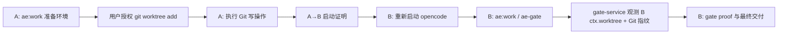

# Worktree 任务启动计划

## 来源与目标

来源需求：`docs/ae/brainstorms/worktree-task-start-requirements.md`。

目标是在正式实现型任务修改项目文件前，把“是否创建独立 worktree 并同步创建分支”变成稳定的 `ae:work` 启动流程，同时保证 Git 写操作授权、AE 产物归属、恢复边界、审查状态和最终门禁不会跨 worktree 错位。

首版交付提示、授权、固定 worktree 目录、当前任务需求/计划迁移、交接 Markdown、归属和证据防错位能力。不批量迁移 `docs/ae/*`，不扩展 `ae:handoff` 的目标 worktree 能力。

## 现状摘要

- `src/assets/skills/ae-work/SKILL.md` 目前只在默认分支场景要求“创建新分支或使用 worktree”，还不是每次正式实现前的通用提示。
- `src/assets/skills/ae-work/references/shipping-workflow.md` 的最终交付模板已有 Git 操作状态和门禁结果分区，但未要求记录 worktree 选择、当前 opencode 工作区归属或结构化授权证据。
- `src/tools/ae-gate.tool.ts` 当前只有 `git_operations`、`user_authorized_git_write`、`review_status` 等粗粒度输入。
- `src/services/gate-service.ts` 已把仅布尔授权视为声明证据并阻断 Git 写操作，但 `containsGitWriteOperation()` 尚未识别 `git worktree`。
- `src/services/recovery-service.ts` 与 `src/services/artifact-store.ts` 通过当前 manifest/repoRoot 读取 `docs/ae/*`，天然适合以当前 `ctx.worktree` 为恢复边界。
- `src/assets/skills/ae-review/references/scope-detection.md` 的 `.opencode/review-state.json` 只记录 `branch`、`lastReviewed`、`lastReviewTime`，无法区分同分支不同 worktree 或不同工作区变更状态。
- `tests/services/gate-service.test.ts` 已覆盖 Git 写操作阻断和仅布尔授权阻断，可作为新增授权证据测试的基础。
- `tests/services/recovery-service.test.ts` 已使用临时 root 和 `createRuntimeAssetManifestFromRoot()`，适合新增当前 worktree 边界测试。

## 影响范围

- 使用者：通过 `ae:work` 或 `/ae-lfg` 进入正式实现阶段的用户。
- LLM 工作流：进入任何项目文件修改前，必须先完成 worktree 决策；创建 worktree 后不得在 A 会话中用 shell workdir 修改 B 中代码、配置、测试或其他项目文件。
- 门禁工具：`ae-gate` 需要能识别 `git worktree` 写操作，并接受可引用的结构化 Git 授权证据。
- 审查流程：新 worktree、新分支、同分支不同 worktree 或无法证明变更状态一致时，审查状态必须保守视为未审查。
- 维护者：需要保持技能文档、参考文档、服务类型和测试用例一致。

## 关键决策

- worktree 提示放在 `ae:work` 阶段 1“准备环境”，在只读定位 / 读取计划之后、任何写文件或 Git 写操作之前执行。
- “正式实现型任务”定义为当前 `ae:work` 流程即将修改项目文件的任务，包括计划执行、S3 轻量修复和 S3 扩展任务；问答、只读审查和纯文档阅读不触发。
- 用户选择项至少包含：创建 worktree、拒绝并继续当前工作区、取消任务；自定义 worktree 名称 / 分支名可通过追问完成，路径仍固定为 `../worktrees/<name>` 直接子目录。
- worktree 本地目录固定为当前项目根目录同级的 `../worktrees/<name>` 直接子目录；`<name>` 从分支名或任务名净化生成，冲突时询问用户，不使用 `-f`、`-B` 或自动清理。
- 创建 worktree 后，当前 opencode 会话仍以 `ctx.worktree` 为准；如果用户要在 B 执行，A 会话只允许迁移当前任务已确定的需求/计划并写入交接 Markdown，不继续代码、配置、测试或其他项目文件修改。
- Git 授权证据必须结构化进入 `ae-gate`，不能只放在 `notes`，也不能依赖 `user_authorized_git_write` 布尔值。
- `git worktree list` 是只读命令；`git worktree add/remove/move/prune/repair/lock/unlock` 按 Git 写操作处理。若解析不到 worktree 子命令且记录为 `git worktree`，首版保守按写操作处理。
- `review_status: passed` 必须有当前工作区内可引用来源；没有来源分类时应保守降级或阻断，不把旧 `.opencode/review-state.json` 或代理声明当作通过证据。
- 不修改 `ae:handoff` 首版能力；后续是否支持目标 worktree 作为增强另行计划。
- A 会话创建 B worktree 后必须执行窄范围启动交接：迁移当前任务已确定的需求/计划产物到 B，写入 B 的交接 Markdown，并产生启动证明摘要；摘要包含创建命令、授权证据、A 的 sessionID、A 的 `ctx.worktree`、目标 B worktree、当前分支/HEAD、已迁移产物、交接 Markdown 路径和下一步提示词。
- Git 授权范围匹配采用保守规则：规范化 Git token 后，授权证据必须覆盖具体写子命令和关键目标参数；宽泛描述、无法解析命令、命令参数与授权摘要不一致时阻断。
- 用户提供的 worktree 路径、分支名和 base ref 在进入 Git 命令前必须校验；执行命令时使用参数数组或等价安全执行方式，禁止拼接 shell 字符串。
- 跨 A/B 的 Git 授权证据必须区分授权发生会话、Git 操作执行 worktree、目标 worktree 和当前 gate worktree；B 中引用 A 的启动证明时，当前 gate worktree 必须匹配目标 B，而不是匹配授权发生的 A。
- A→B 的 `target_worktree` 必须位于 A 项目根目录同级 `../worktrees/<name>` 直接子目录；门禁不接受任意外部路径作为创建目标。
- A→B 启动证明中的 HEAD 用于证明 worktree 创建基点；B 最终 gate 的当前 HEAD 和 dirty 状态由审查证据另行匹配，不要求等于 A 创建时 HEAD。
- 审查通过证据必须绑定当前工作区指纹；仅有当前 worktree 内报告路径不足以证明覆盖当前 HEAD 或 dirty 状态。
- `ae-gate.tool.ts` 只负责工具 schema、snake_case 到服务层 camelCase 的映射和用户友好返回；Git 命令解析、授权证据匹配、当前工作区指纹采集和审查证据可信度判定都放在 `gate-service.ts`。
- 首版复用 `ae-gate` 扩展参数，不新增 `ae-git-auth` 或 `ae-worktree` 工具；原因是首版目标是证据和门禁，不是自动化 worktree 生命周期管理。
- `/ae-lfg` 进入实现阶段时传递默认 worktree 策略，不在 `ae:lfg` 中另建一套提示逻辑；若 `ae:work` 返回 `worktree_decision: transferred`，`ae:lfg` 的 A 会话必须停止主管道，后续审查、浏览器测试和最终功能交付 gate 只能在 B 会话中完成。

## 门禁证据数据流

- 用户授权产生的字段：授权来源、授权内容、覆盖命令范围、授权发生的 sessionID、授权时间或消息引用、拟执行或已执行的最终 Git 参数列表。
- 当前环境观测产生的字段：当前 `ctx.worktree`、当前分支、HEAD、工作区状态摘要、changed files、gate proof 路径。
- A→B 启动证明只证明 A 中的授权和创建基点；B 中最终 gate 必须重新观测 B 的 `ctx.worktree`、branch、HEAD 和 dirty/status。
- `worktree_decision` 记录用户选择，取值为 `created`、`rejected`、`cancelled`、`transferred`、`not_applicable`；拒绝 worktree 不伪造 Git 授权证据。
- 当前工作区最小指纹定义为 `worktreePath + branch + head + statusSummary`；路径比较使用 realpath/规范化绝对路径、统一分隔符，Windows 下大小写归一，无法证明同一物理路径时保守阻断。
- `statusSummary` 首版来自被验证变更集合的 `git status --porcelain` 摘要或等价可比较字符串；默认排除 gate proof、审查报告等运行时证据产物（如 `docs/ae/gates/`、`docs/ae/reviews/`），避免证据文件自身导致指纹漂移。
- Git 命令匹配优先使用结构化参数数组：新增或约定 `git_operation_args: string[][]`；旧 `git_operations: string[]` 仅用于展示和兼容，无法可靠解析为参数数组时保守阻断，不用脆弱 shell 字符串解析放行。
- 授权证据分为 `verified` 与 `declaration_only`；只有能通过用户消息引用、`ctx.history`、工具 `ask` 结果或等价可观测来源验证的授权证据才能放行 Git 写操作，无法验证时重新询问用户或阻断。
- 审查证据同样分为可验证与声明证据；`report_path` 或 `tool_output` 默认不能证明已审查，除非绑定当前会话实际 `ae:review` 结果、可验证审查运行标识和当前工作区指纹。

## 实现单元

### 1. 收敛 `ae:work` 启动流程

- [ ] 目标：让所有正式实现型任务在修改项目文件前完成 worktree 决策。
- [ ] 需求：覆盖 R1、R2、R3、R6、R7、R12、R14、R15；拒绝 worktree 允许继续，取消任务不继续实现。
- [ ] 依赖：无。
- [ ] 文件：`src/assets/skills/ae-work/SKILL.md`、`tests/assets/ae-work-worktree-text.test.ts`。
- [ ] 方法：将阶段 1“准备环境”改为通用 worktree 决策步骤；先判断当前目录是否为 Git 仓库且 `git worktree` 可用，非 Git 项目或不可用时跳过 worktree 询问并记录 `worktree_decision: not_applicable`；普通 `ae:work` 中允许用户选择不创建新 worktree 并直接在当前分支执行，此时最终记录 `worktree_decision: rejected`；`ae:lfg` 调用时采用前置少量询问、后续静默执行策略，在用户未通过参数明确禁用 worktree 时，Git 项目默认创建 worktree 且不再询问是否创建；执行 `git worktree add`、`git branch`、`git switch`、`git checkout` 前必须有覆盖具体命令范围的授权，授权应尽量在前置澄清阶段一次性取得；创建 B 后明确当前会话仍在 A；如果用户选择 B 执行，要求在 B 目录重新启动 opencode。
- [ ] 方法：创建 worktree 的本地目录固定为 `../worktrees/<name>` 直接子目录；创建 B 后迁移当前任务已确定的需求/计划产物到 B，包含 A 中未跟踪的相关 `docs/ae/brainstorms/*-requirements.md` 与 `docs/ae/plans/*-plan.md`；迁移时保留仓库相对路径并创建缺失目录；不迁移 gate/review 运行时产物。
- [ ] 方法：创建 B 后只允许在 B 写入 `docs/ae/handoffs/<timestamp>-worktree-handoff.md` 或等价明确路径，记录当前会话核心上下文，包含用户目标、已确定决策、已迁移产物、待办事项、验证要求、Git/worktree 状态和继续执行约束；A 的终止提示给出可复制继续提示词，要求用户在 B 新会话先读取交接文件、需求文档和计划文档。
- [ ] 方法：拒绝 worktree 时继续询问是否创建/切换当前工作区内的功能分支；如果当前分支是默认分支且用户拒绝切分支，必须二次确认直接修改默认分支的风险，并把该选择记录到最终 Git 操作状态和 gate notes。
- [ ] 方法：当前项目不是 Git 仓库、Git 不可用或 `git worktree` 不支持时，不询问是否创建新 worktree，将 worktree 决策记录为 `not_applicable`，继续强调产物归属仍以当前 `ctx.worktree` 为准。
- [ ] 执行说明：只迁移当前任务已明确关联的需求/计划产物；无法唯一确定时询问用户，不靠最近修改时间批量复制。
- [ ] 测试场景：技能文本包含“每次正式实现型任务”“先判断当前目录是否为 Git 仓库且 `git worktree` 可用”“不创建新 worktree 并直接在当前分支执行”“worktree_decision: rejected”“当前项目不是 Git 仓库”“跳过 worktree 询问”“worktree_decision: not_applicable”“ae:lfg 默认 worktree 策略”“后续尽可能静默执行到结束”“不展示是否创建 worktree 的选择”“重新启动 opencode”“自动迁移当前任务已确定的 AE 需求/计划产物”“未跟踪”“交接 Markdown”“继续提示词”“不得在 A 会话通过 shell 工作目录修改 B 中代码、配置、测试或其他项目文件”的语义。
- [ ] 验证：新增 `tests/assets/ae-work-worktree-text.test.ts` 后运行 `npm run test -- tests/assets/ae-work-worktree-text.test.ts`。

### 2. 定义 worktree 创建输入校验与 A→B 启动证明

- [ ] 目标：避免用户输入被不安全地拼接进 Git 命令，并让 A 中发生的 worktree 创建授权能被 B 会话引用。
- [ ] 需求：覆盖 R3、R4、R6、R7、R12、R13、R14、R15。
- [ ] 依赖：实现单元 1。
- [ ] 文件：`src/assets/skills/ae-work/SKILL.md`、`tests/assets/ae-work-worktree-text.test.ts`。
- [ ] 方法：在 `ae:work` 准备环境中要求校验 worktree 名称、分支名和 base ref；分支名使用 `git check-ref-format --branch` 或等价规则；base ref 拒绝空值、换行和 option-like 输入，并使用 `git rev-parse --verify <base>^{commit}` 或等价方式解析到最终 commit；路径必须解析到当前项目根目录同级 `../worktrees/<name>` 直接子目录，确认不存在危险位置、符号链接绕过或 option-like 路径；执行 Git 命令必须用参数数组或等价安全执行方式，不拼接 shell 字符串；授权前向用户展示校验后的最终参数。
- [ ] 方法：定义 A→B 启动证明摘要模板，至少包含 A 的 sessionID、A 的当前 `ctx.worktree`、目标 B worktree、当前分支、HEAD、拟执行或已执行的 Git 命令、授权来源摘要、授权覆盖范围、创建结果、B 路径、已迁移产物清单、交接 Markdown 路径、在 B 重新启动 opencode 的继续提示词。
- [ ] 方法：启动证明同时给出结构化字段清单或最小 JSON 片段，字段名与 gate 证据契约对齐：`source_session_id`、`operation_worktree`、`target_worktree`、`branch`、`head`、`authorization_source`、`authorization_summary`、`authorization_trust`、`authorized_at_or_message_ref`、`covered_command_args`、`final_command_args`；启动证明额外包含 `created_worktree_path`、`transferred_artifacts`、`handoff_path`、`continue_prompt`。`covered_command_args` 与 `final_command_args` 均为 `string[]` 参数数组，规范化结果由 gate-service 计算，不作为可伪造输入单独信任。
- [ ] 方法：B 中重启后的入口协议必须明确：用户在 B 目录新开 opencode 后先读取交接 Markdown、需求文档和计划文档；B 已有计划文件时运行 `ae:work <B 内计划路径>`；A→B 启动证明不能替代 B 内真实存在的 `plan_path` / `requirements_path`。
- [ ] 执行说明：A→B 启动证明与交接 Markdown 只提供上下文和授权证据来源；B 中最终 gate 仍以 B 的 `ctx.worktree` 为边界。
- [ ] 测试场景：资产文本要求校验 branch/path/base；要求 base ref 解析到 commit；要求安全执行方式；要求启动证明摘要包含 sessionID、source worktree 和 target worktree；要求用户要求迁移但无法唯一确定产物时询问用户；要求交接 Markdown 和继续提示词。
- [ ] 验证：`npm run test -- tests/assets/ae-work-worktree-text.test.ts`。

### 3. 扩展 `ae-gate` 证据类型骨架

- [ ] 目标：先稳定门禁新增证据字段、工具 schema 和服务输入输出契约，避免授权规则和审查规则互相覆盖同一中间状态。
- [ ] 需求：覆盖 R4、R11，并为 R5、R10 提供共享结构。
- [ ] 依赖：实现单元 2。
- [ ] 文件：`src/tools/ae-gate.tool.ts`、`src/services/gate-service.ts`、`tests/tools/ae-gate.tool.test.ts`、`tests/services/gate-service.test.ts`。
- [ ] 方法：新增 `git_authorization_evidence`、`review_evidence`、`worktree_decision`、`git_operation_args` 工具层 snake_case schema，并映射到服务层 `gitAuthorizationEvidence`、`reviewEvidence`、`worktreeDecision`、`gitOperationArgs`。
- [ ] 方法：定义并冻结服务层证据契约（以下合称 `GateEvidenceContract`）：`GitAuthorizationEvidence[]`、`ReviewEvidence` 判别联合、`WorktreeDecision`、`WorktreeFingerprint`；`GateResult.evidence` 增量新增 `gitAuthorizationEvidence`、`reviewEvidence`、`worktreeDecision`、`currentWorktreeFingerprint`，保留 `gitOperations`、`userAuthorizedGitWrite` 等旧字段。
- [ ] 方法：`git_authorization_evidence` 每项至少包含 `authorization_source`、`authorization_summary`、`authorization_trust`（`verified` 或 `declaration_only`）、`covered_command_args`、`source_session_id`、`operation_worktree`、`target_worktree`、`branch`、`head`、`authorized_at_or_message_ref`、`final_command_args`；`covered_command_args` 与 `final_command_args` 均为 `string[]`。字段缺失或 `authorization_trust` 非 `verified` 时先标记为不可靠，后续授权匹配单元负责阻断规则。
- [ ] 方法：`review_evidence` 使用判别联合，并在本单元一次性冻结各 variant 字段：`tool_output` 包含 `review_trust`、`review_run_id_or_message_ref`、`worktree`、`branch`、`head`、`status_summary`、`summary`；`report_path` 包含 `review_trust`、`path`、`review_run_id_or_message_ref`、`worktree`、`branch`、`head`、`status_summary`；`not_run_reason` 包含 `reason`；`declared` 包含 `summary` 和 `review_trust: declaration_only`。本单元只完成结构接收、映射和结果透传，不实现审查通过判定。
- [ ] 方法：在服务层新增当前工作区指纹采集入口，例如 `collectCurrentWorktreeFingerprint(repoRoot)`；服务层通过工具层传入的当前 worktree/repoRoot 字符串和 Git 命令观测，不直接依赖 `ToolContext`。
- [ ] 执行说明：`user_authorized_git_write` 保留为兼容声明证据，输出中标注为 `declaration_only`，不得升级为可放行证据。
- [ ] 执行说明：本单元产出的证据契约为后续单元的冻结输入输出边界；单元 5 和单元 6 只能消费该契约，若必须变更字段，先回到本单元调整测试和文档。
- [ ] 测试场景：新建 `tests/tools/ae-gate.tool.test.ts`，调用 `aeGateTool.execute` 或等价工具执行入口，传入 snake_case 参数，验证映射到服务层 camelCase；旧字段仍可传入；返回 evidence 保留旧字段并增量包含新字段；指纹采集在非 Git 仓库和 Git 仓库下都有明确结果。
- [ ] 验证：`npm run test -- tests/tools/ae-gate.tool.test.ts tests/services/gate-service.test.ts`、`npm run typecheck`。

### 4. 统一 Git 命令解析并识别 `git worktree` 写操作

- [ ] 目标：让 Git 写操作识别和授权匹配共用同一解析结果，避免两套命令解析逻辑漂移。
- [ ] 需求：覆盖 R5，避免 `git worktree add` 漏过授权门禁。
- [ ] 依赖：实现单元 3。
- [ ] 文件：`src/services/gate-service.ts`、`tests/services/gate-service.test.ts`。
- [ ] 方法：在 `gate-service.ts` 中抽出内部解析能力，例如 `normalizeGitCommandArgs()`、`parseGitOperation()`、`isGitWriteOperation()`；优先处理 `git_operation_args` / `final_command_args` 这类 `string[]` 参数数组，旧字符串命令只做兼容展示或保守解析。
- [ ] 方法：专门处理 `worktree` 子命令；`list` 视为只读；`add`、`remove`、`move`、`prune`、`repair`、`lock`、`unlock` 视为写操作；无法识别具体子命令时保守视为写操作。
- [ ] 执行说明：如果旧字符串命令包含路径空格、引号、转义或平台相关语法且无法无歧义解析，授权匹配阶段必须阻断并要求提供结构化参数数组；本单元只保证解析结果可供后续复用。
- [ ] 测试场景：`git worktree add ../x -b feat/x` 识别为写；`git worktree remove ../x` 识别为写；`git worktree list` 不触发 Git 写授权阻断；`git -C . worktree add ../x -b feat/x` 可识别；无法解析的 `git worktree` 保守视为写。
- [ ] 验证：`npm run test -- tests/services/gate-service.test.ts`。

### 5. 扩展 `ae-gate` Git 授权证据匹配

- [ ] 目标：让门禁可以区分 Git 写操作记录、布尔声明和可引用授权证据。
- [ ] 需求：覆盖 R4、R5，并保持现有“仅布尔授权不放行”的安全策略。
- [ ] 依赖：实现单元 3、4。
- [ ] 文件：`src/tools/ae-gate.tool.ts`、`src/services/gate-service.ts`、`tests/services/gate-service.test.ts`、`tests/tools/ae-gate.tool.test.ts`。
- [ ] 方法：实现授权范围匹配规则：复用统一 Git 解析结果；匹配具体写子命令和关键目标参数；`git -C . worktree add` 与授权命令按规范化参数数组比较；宽泛授权文本、参数不一致、无法解析命令、sessionID 缺失、`authorization_trust` 非 `verified`、普通 Git 写操作的执行 worktree 与当前 gate worktree 不一致时阻断。
- [ ] 方法：验证授权来源：优先通过 `authorized_at_or_message_ref`、当前会话历史、工具 `ask` 结果或等价可观测来源确认授权确实来自用户消息；无法验证时 gate 必须重新 ask 用户确认或阻断，不接受 LLM 自行填写的授权摘要。
- [ ] 方法：对于 A 创建 B 后在 B gate 引用启动证明的特殊场景，必须要求证据声明 `operation_worktree=A`、`target_worktree=B`，且当前 gate worktree 匹配 `target_worktree`；A 授权证据只覆盖 A 创建 B，不覆盖 B 后续 `git commit`、`git push`、`git switch` 或 cleanup。
- [ ] 执行说明：保留 `user_authorized_git_write` 作为兼容声明证据，不把它升级为可放行证据；字段描述必须说明它不能替代结构化授权。
- [ ] 测试场景：`git commit` 无证据阻断；仅 `userAuthorizedGitWrite: true` 仍阻断；伪造 `authorization_source` 或不可验证 message ref 时阻断；有可验证结构化授权证据时不因 Git 授权阻断；授权范围未覆盖实际 Git 写命令时阻断；跨 session/worktree/HEAD 复用授权证据时阻断；A→B 启动证明只有在当前 gate worktree 等于 target worktree 且 target 位于 `../worktrees/<name>` 时通过授权匹配；A 证明在 A gate 复用阻断；operation/target worktree 缺失阻断；工具 schema 暴露 snake_case 参数并正确映射到服务输入。
- [ ] 验证：`npm run test -- tests/services/gate-service.test.ts tests/tools/ae-gate.tool.test.ts`、`npm run typecheck`。

### 6. 增加 `ae-gate` 审查来源分类与工作区指纹

- [ ] 目标：避免新 worktree 或同分支不同工作区误复用旧审查状态。
- [ ] 需求：覆盖 R10、R11。
- [ ] 依赖：实现单元 3、5。
- [ ] 文件：`src/tools/ae-gate.tool.ts`、`src/services/gate-service.ts`、`tests/services/gate-service.test.ts`、`tests/tools/ae-gate.tool.test.ts`。
- [ ] 方法：复用实现单元 3 的当前工作区最小指纹；非 Git 仓库或采集失败时 `review_status: passed/failed` 证据不可信并阻断。
- [ ] 方法：为 `review_evidence` 定义兼容矩阵：`passed/failed` 仅接受 `tool_output` 或 `report_path`，且 `review_trust: verified`、来源可验证、指纹匹配；`not_run` 接受 `not_run_reason`；`not_applicable` 可无 review evidence 但必须说明原因；`declared` 只能作为不可靠证据，不能让 `passed/failed` 通过。
- [ ] 方法：按实现单元 3 冻结的 `review_evidence` 字段做匹配判定：`report_path` 和 `tool_output` 的 worktree、branch、HEAD、工具层 `status_summary`（服务层映射为 `statusSummary`）必须匹配当前指纹；路径存在但字段不匹配时不接受。
- [ ] 方法：验证审查来源：`report_path` 或 `tool_output` 必须绑定当前会话实际 `ae:review` 结果、可验证的 `review_run_id_or_message_ref` 和工作区指纹；执行者手写的报告文件或粘贴输出默认视为声明证据。
- [ ] 执行说明：首版不需要实现完整 dirty hash 算法，但至少要求报告证据记录并匹配当前 gate 可观测到的 HEAD 和状态摘要；无法观测或无法匹配时视为未审查。
- [ ] 测试场景：`reviewStatus: passed` 且无来源分类时阻断；伪造 `report_path` 或 `tool_output` 不能让 `passed` 通过；报告路径存在但 HEAD 或状态摘要不匹配时阻断；真实临时 Git 仓库中 HEAD/branch/status 匹配且来源可验证时接受；`reviewStatus: not_run` 携带未运行原因时不产生“伪通过”；`not_applicable` 不被误阻断；工具 schema 正确暴露并映射 `review_evidence`。
- [ ] 验证：`npm run test -- tests/services/gate-service.test.ts tests/tools/ae-gate.tool.test.ts`。

### 7. 更新 `ae-review` 状态文件文档

- [ ] 目标：让审查范围检测文档与门禁审查来源分类一致。
- [ ] 需求：覆盖 R10。
- [ ] 依赖：实现单元 6。
- [ ] 文件：`src/assets/skills/ae-review/references/scope-detection.md`、`src/assets/skills/ae-review/references/synthesis-and-presentation.md`、`tests/assets/ae-review-state-text.test.ts`。
- [ ] 方法：把 `.opencode/review-state.json` 文档格式扩展为包含 worktree 身份、branch、HEAD、工作区状态摘要和审查时间；读取时除分支外还校验 worktree 身份和变更状态；字段缺失、不匹配或无法证明一致时视为首次运行 / 未审查。
- [ ] 测试场景：资产文本包含 worktree 身份、HEAD、状态摘要、不匹配保守降级；不再只说“当前分支名匹配即可复用”。
- [ ] 验证：`npm run test -- tests/assets/ae-review-state-text.test.ts`。

### 8. 补强恢复边界测试

- [ ] 目标：证明恢复只在当前 worktree 查找产物。
- [ ] 需求：覆盖 R8、R9。
- [ ] 依赖：实现单元 1。
- [ ] 文件：`tests/services/recovery-service.test.ts`。
- [ ] 方法：在恢复测试中创建 rootA/rootB，rootA 写入需求或计划，rootB 不写入，使用 rootB manifest 调用恢复时不得返回 rootA 产物；rootB 有自己的计划时只返回 rootB 相对路径。
- [ ] 方法：验证恢复使用当前 manifest/root 推导，不依赖源码仓库布局或 `opencode.json`，符合运行时独立性规范。
- [ ] 测试场景：B 中缺计划不跨 A 恢复；B 中有自己的计划时只恢复 B；仅提供 A→B 启动证明但 B 无计划文件时，不返回 A 的计划路径、不把证明当作计划产物；返回结果不泄露 rootA 绝对路径。
- [ ] 验证：`npm run test -- tests/services/recovery-service.test.ts`。

### 9. 增加资产一致性与 C3 回归测试

- [ ] 目标：防止稳定流程契约只落在 rules 或 catalog/frontmatter 漂移。
- [ ] 需求：覆盖 R12、R13、C3。
- [ ] 依赖：实现单元 1、2、7。
- [ ] 文件：`tests/services/ae-catalog.test.ts`、`tests/assets/ae-work-artifact-text.test.ts`，必要时 `src/services/ae-catalog.ts`。
- [ ] 方法：为 `ae:work` 新增 frontmatter/catalog 一致性测试文件 `tests/services/ae-catalog.test.ts`，避免把非命令注册职责塞进 `tests/services/command-registration.test.ts`。
- [ ] 方法：资产文本测试只断言稳定契约语义，不锁死完整话术；可增加小型文本断言辅助函数按契约组检查短语，降低提示词调整导致的脆弱性。
- [ ] 测试场景：`ae:work` frontmatter `description` 和 `argument-hint` 与 `src/services/ae-catalog.ts` 一致；技能文本包含 R13 交互要求；rules 中有偏好但技能中缺契约时测试失败。
- [ ] 验证：`npm run test -- tests/services/ae-catalog.test.ts tests/assets/ae-work-artifact-text.test.ts tests/assets/ae-work-worktree-text.test.ts`。

### 10. 更新执行与交付说明

- [ ] 目标：让最终交付模板与新门禁字段一致，并验证所有改动可构建。
- [ ] 需求：覆盖 R2、R9、R11 以及交付成功标准。
- [ ] 依赖：实现单元 1-9。
- [ ] 文件：`src/assets/skills/ae-work/references/shipping-workflow.md`、必要时 `src/assets/skills/ae-lfg/SKILL.md` 中调用 `ae-gate` 的参数说明。
- [ ] 方法：最终交付的 Git 操作状态必须记录 worktree 决策、Git 写操作、授权证据引用和当前 opencode 工作区归属；门禁调用说明加入结构化 Git 授权证据和审查来源分类；如果 `ae-lfg` 直接说明最终 gate 参数，也同步避免旧字段描述误导。
- [ ] 方法：交付模板固定显示当前 `ctx.worktree`、`git rev-parse --show-toplevel`、当前分支、HEAD、worktree decision、以及是否与目标执行 worktree 一致。
- [ ] 方法：补充最小 gate 调用示例：无 Git 写操作、普通 Git 写操作有授权证据、A→B 启动证明、`review_status: not_run` 携带原因、`review_status: passed` 携带报告路径和指纹。
- [ ] 方法：A 会话执行 `git worktree add` 成功后，终止状态是“执行已转移 / 等待用户在 B 重启”，不是“功能交付完成”；A 不运行最终 `ae-gate workflow:work checkpoint:final` 或 `ae-gate workflow:lfg checkpoint:final` 来宣称功能交付。
- [ ] 测试场景：文档不再暗示仅 `user_authorized_git_write` 可放行 Git 写操作；交付模板要求区分审查报告路径、未运行原因和仅声明证据；A→B 转移状态不被描述为交付完成。
- [ ] 验证：`npm run test -- tests/assets/ae-work-worktree-text.test.ts tests/assets/ae-work-artifact-text.test.ts`。

### 11. 完成全量验证

- [ ] 目标：验证所有改动可构建，并确认计划中的局部改动已集成。
- [ ] 需求：覆盖交付成功标准。
- [ ] 依赖：实现单元 1-10。
- [ ] 文件：无新增文件，执行验证命令。
- [ ] 方法：按验证矩阵运行全量测试、类型检查和构建；若某个局部单元已经运行过同一测试，最终仍以本单元全量命令为交付证据。
- [ ] 测试场景：全量回归无失败；构建后资产同步可用。
- [ ] 验证：`npm run typecheck`、`npm run test`、`npm run build`。

## 流程与边界情况

- 用户拒绝 worktree：继续当前工作区，最终 Git 操作状态和 `ae-gate notes` 记录“未创建 worktree”。
- 用户选择不创建新 worktree：直接在当前 `ctx.worktree` 和当前分支执行任务，最终记录 `worktree_decision: rejected`。
- 用户通过 `ae:lfg` 进入实现且未显式禁用 worktree：Git 项目默认创建 worktree，不询问是否创建；前置阶段一次性收集必要决策和授权范围，后续尽可能静默执行。
- 当前项目不是 Git 仓库、Git 不可用或 `git worktree` 不支持：不询问是否新建 worktree，直接记录 `worktree_decision: not_applicable` 并继续执行。
- 用户拒绝 worktree 但当前在默认分支：不直接等同于允许修改默认分支；先询问是否在当前工作区创建/切换功能分支，若用户坚持默认分支实现则二次确认并记录风险。
- 用户取消任务：不执行 Git 写操作，不修改文件，不运行最终交付门禁；最终回复说明任务取消且无交付。
- 授权后但命令执行前取消：不执行命令，记录取消；不得把已授权但未执行的 Git 写操作当作完成证据。
- `git worktree add` 成功后取消：不自动删除 B，不自动删除分支；任何 cleanup（`git worktree remove`、`git branch -D`、删除目录等）都视为新的 Git 写操作，必须重新授权。
- 用户接受默认方案：先复述具体 `git worktree add -b <branch> <path> <base>` 命令范围并获取授权，再执行。
- 用户自定义名称 / 分支名：缺少字段、`../worktrees/<name>` 已存在、分支已存在或 Git 命令失败时暂停询问，不自动覆盖、不自动清理。
- `git worktree add -b` 失败或部分成功：先展示可观察状态，再询问用户选择重试、换路径/分支、手动清理或授权清理；不自动使用 `-f`、`-B`、`remove`、`prune` 或删除目录。
- 恶意或异常输入：分支名包含 shell 元字符、换行、非法 ref、`--` 前缀或路径穿越、符号链接、危险位置时拒绝进入 Git 命令。
- 路径校验失败：目标不是当前项目根目录同级 `../worktrees/<name>` 直接子目录，或父目录 realpath、符号链接、junction、Windows reparse point、UNC 路径、drive root 无法证明安全时，拒绝进入 Git 命令并要求用户换名称。
- base ref 异常输入：空值、换行、option-like 输入或无法解析为 commit 时拒绝进入 Git 命令；授权展示和实际执行使用解析后的最终 base 标识。
- 当前已有未提交修改：提示 worktree 不会自动带走 A 中未提交代码变更；创建 B 时会迁移当前任务已确定的未跟踪需求/计划和交接 Markdown。
- A 会话创建 B 后：A 只能说明下一步和记录 Git 操作，不能通过 shell `workdir=B` 修改代码。
- B 中缺少 A 的未跟踪需求 / 计划：说明迁移步骤失败或关联产物未唯一确定；恢复不跨 A 查找，先补齐 B 内关联产物或重新生成。
- 审查状态不可靠：同分支不同 worktree、状态字段缺失、无法证明工作区变更一致时，一律视为未审查。
- 审查报告过期：报告路径存在但 HEAD、branch、worktree 或状态摘要不匹配时，不得视为通过审查。
- 门禁阻断：缺少验证命令、Git 操作记录、授权证据或审查来源时，不得声称交付完成。

## 推迟到后续增强

- A 中原计划写入“执行已转移”标记并退出活跃恢复候选。
- B 中计划副本成为唯一可变执行状态真源的自动化标记与恢复集成。
- 执行阶段需求变更在 B 中生成修订需求 / 计划并建立替代关系。
- 扩展 `ae:handoff` 支持目标 worktree 或目标目录。
- 自动生成更精细的 worktree 名称 / 分支名并处理冲突。
- 完整工作区 dirty hash 或审查状态复用证明机制。

## 验证矩阵

| 验证 | 目的 |
|------|------|
| `npm run test -- tests/services/gate-service.test.ts` | 验证 Git worktree 写操作识别、结构化授权证据、审查来源分类和指纹匹配 |
| `npm run test -- tests/tools/ae-gate.tool.test.ts` | 验证工具 schema 暴露、snake_case 到服务输入映射和结果证据字段兼容 |
| `npm run test -- tests/services/recovery-service.test.ts` | 验证恢复边界仅限当前 worktree |
| `npm run test -- tests/services/ae-catalog.test.ts` | 验证 `ae:work` catalog/frontmatter 不漂移 |
| `npm run test -- tests/assets/ae-work-worktree-text.test.ts` | 验证 `ae:work` worktree 启动、A→B 证明和 Git 安全交互契约 |
| `npm run test -- tests/assets/ae-work-artifact-text.test.ts` | 验证产物迁移边界、R13 交互和 C3 稳定契约 |
| `npm run test -- tests/assets/ae-review-state-text.test.ts` | 验证审查状态文档包含 worktree 指纹和保守降级语义 |
| `npm run typecheck` | 验证新增门禁输入和结果类型安全 |
| `npm run test` | 全量回归 |
| `npm run build` | 验证资产同步和插件构建 |

## 交付标准

- `ae:work` 在正式实现型任务修改文件前总是完成 worktree 决策。
- 不创建新 worktree 可以继续在当前分支执行，并在最终 Git 操作状态中记录 `worktree_decision: rejected`。
- `ae:lfg` 默认不询问是否创建 worktree；除初始少量询问外，后续尽可能静默执行到结束。
- 非 Git 项目跳过 worktree 询问，并在最终 Git 操作状态中记录 `worktree_decision: not_applicable`。
- 创建 worktree、创建分支或切换分支前必须有结构化授权证据。
- `ae-gate` 能识别 `git worktree add/remove/move/prune/repair/lock/unlock` 为 Git 写操作，并不把仅布尔授权当作放行证据。
- 创建 B 后，A 会话不再执行正式代码修改，用户需在 B 中重新启动 opencode。
- 恢复和门禁产物均以当前 `ctx.worktree` 为边界。
- 审查状态没有当前工作区来源证据时保守视为未审查。
- 首版只迁移当前任务已确定的需求/计划和交接 Markdown，不批量迁移 `docs/ae/*` 或自动同步 A/B 执行状态。
