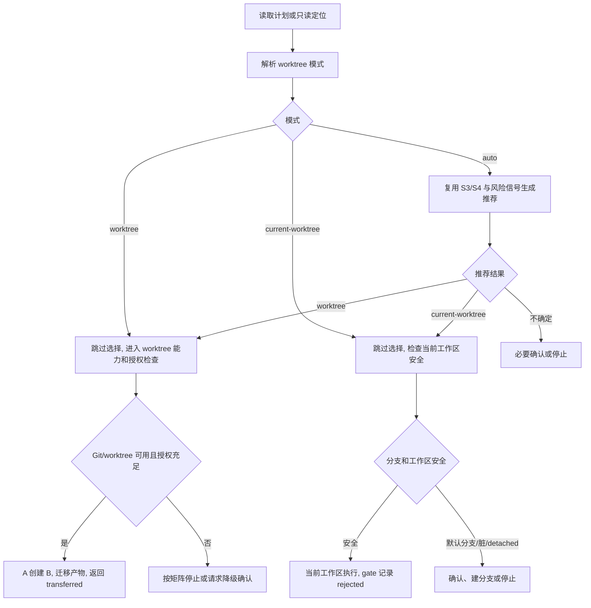

# ae:work 按任务情况推荐并选择 Worktree 计划

## 来源和范围

源需求：`docs/ae/brainstorms/ae-work-contextual-worktree-recommendation-requirements.md`。

本计划实现三种 worktree 选择语义：`worktree`、`current-worktree`、`auto`。核心变化是让 `ae:work` 统一解释模式和推荐依据，`ae:lfg` 与 `ae:task-loop` 只负责透传或默认补齐模式，不再维护独立 worktree 决策规则。

范围内：
- 修改 `ae:work` 准备环境阶段的 worktree 决策文本和模式语义。
- 将 `ae:lfg` 默认策略从“一律创建 worktree”迁移为“默认传入 `auto`”。
- 为 `ae:task-loop` 使用 `ae:work` 时补充默认 `auto`、Phase 0 预授权和禁言期失败策略。
- 同步交付参考、任务路由和资产文本测试。
- 保持现有 Git 授权、A→B 交接、安全路径和最终 gate 规则不弱化。

范围外：
- 不实现新的 TypeScript 参数解析层或 CLI 别名系统。
- 不新增第四种公开 `ask` / `interactive` 模式。
- 不扩展 `worktree_decision` 枚举，除非执行阶段发现 gate 现有取值无法表达本需求。
- 不改变 worktree 目标目录、安全校验、产物迁移和 handoff 文件规则。

规划期决策：
- 本轮公开语义名固定为 `worktree`、`current-worktree`、`auto`。
- `ae:lfg` 最小显式表达采用独立词或短语中的三值语义名，例如 `ae:lfg ... worktree`、`ae:lfg ... current-worktree`、`ae:lfg ... auto`；未识别到三值时默认补齐为 `auto`。
- `ae:task-loop` 当执行技能前缀为 `ae:work` 且未识别到三值时，委派文本必须显式附加“worktree 模式：auto”。若用户已显式写出三值，则按用户值附加。
- 旧 `--no-worktree` 仅作为兼容输入映射到 `current-worktree`；新文档不得再把它作为默认策略中心。
- CLI 参数和别名如 `--worktree-mode=auto` 是否支持，属于后续增强，不阻塞本轮文本资产和调用语义落地。

## 研究结论

需要迁移的真源文件：
- `src/assets/skills/ae-work/SKILL.md`
- `src/assets/skills/ae-work/references/shipping-workflow.md`
- `src/assets/skills/ae-lfg/SKILL.md`
- `src/assets/skills/ae-lfg/references/task-routing.md`
- `src/assets/skills/ae-task-loop/SKILL.md`

需要迁移或新增的测试：
- `tests/assets/ae-work-worktree-text.test.ts`
- `tests/assets/ae-work-artifact-text.test.ts`
- `tests/assets/ae-lfg-gate-text.test.ts`
- 新增 `tests/assets/ae-task-loop-text.test.ts`
- 视执行发现扩展 `tests/services/gate-service.test.ts` 和 `tests/tools/ae-gate.tool.test.ts`

现有关键约束：
- `ae:work` 阶段 0 已有 S3/S4 复杂度分流，可作为 `auto` 推荐依据。
- `ae:lfg` 当前在 `SKILL.md` 和 `task-routing.md` 中写死默认创建 worktree，必须同步删除旧语义。
- `ae:task-loop` Phase 0 后到 Phase 3 前禁止任何用户交互，`auto` 的 Git 授权必须在 Phase 0 解决或在循环体内瓶颈退出。
- `worktree_decision` 当前包含 `created`、`rejected`、`cancelled`、`transferred`、`not_applicable`；本计划默认复用 `rejected` 表示“未创建 worktree 并留在当前工作区”。

## 高层设计

### 决策流

### 模式语义

| 模式 | 默认行为 | 可交互点 | gate 取值 |
|------|----------|----------|-----------|
| `worktree` | 不展示是否创建 worktree，直接尝试 worktree 路径 | Git 写授权、Git/worktree 不可用时的降级确认 | A 会话创建 B 后为 `transferred`；B 会话最终交付记录 `created` |
| `current-worktree` | 不展示是否创建 worktree，留在当前 `ctx.worktree` | 默认分支、脏工作区、detached HEAD、功能分支创建/切换授权 | 当前工作区交付用 `rejected` |
| `auto` | 根据任务复杂度和风险选择默认路径 | 推荐依据不足、Git 写授权不足、安全风险 | A 会话推荐 worktree 并创建 B 后为 `transferred`；B 会话最终交付记录 `created`；推荐当前工作区为 `rejected`；Git 不适用按矩阵记录 |

A/B 两阶段语义：
- A 会话负责创建 B worktree、迁移当前任务需求/计划和写交接文件，完成后只能返回 `worktree_decision: transferred`，不得继续最终功能交付 gate。
- B 会话是实际执行会话。B 中若不再创建新的 worktree，最终功能交付 gate 记录 `worktree_decision: created`，表示本任务已经在独立 worktree 中执行；不得沿用 A 的 `transferred` 作为最终 gate 取值。

### `auto` 推荐规则

不引入加权评分模型，只复用现有 `ae:work` 信号。

推荐 `current-worktree`：
- S3 轻量修复。
- 明确 bug 或单点故障。
- 预计不超过 2 个生产文件。
- 不涉及高风险领域。
- 已在非默认功能分支且工作区状态可接受。

推荐 `worktree`：
- S3 扩展任务或 S4 多步骤实现。
- 跨模块、架构决策、需求模糊或 10+ 文件。
- 涉及认证、授权、数据迁移、外部 API、API 契约。
- 引入新抽象、修改公共配置或运行时资产。
- 需要新增流程或用户可见行为决策。
- 当前工作区存在会污染用户变更的风险。

需要确认或停止：
- 推荐依据不足。
- 当前默认分支、detached HEAD 或 Git 状态读取失败。
- 当前工作区存在未提交变更且无法判断是否属于本任务。
- 需要 Git 写操作但没有覆盖具体命令参数的授权。

### 异常矩阵

| 场景 | `worktree` | `current-worktree` | `auto` |
|------|------------|--------------------|--------|
| 非 Git 仓库 | 停止并说明无法满足显式 worktree，除非用户确认降级 | 可当前目录执行，记录 `not_applicable` 或风险说明 | 降级当前目录，记录 `not_applicable` |
| Git CLI 不可用 | 停止并说明无法满足显式 worktree | 可执行非 Git 修改，但不能做分支安全校验，需说明风险 | 降级或停止，不能静默宣称已做分支安全检查 |
| `git worktree` 不可用 | 停止或请求降级确认 | 可当前 worktree 执行 | 推荐当前工作区或提示降级，记录实际原因 |
| 默认分支 | 可走 worktree 路径 | 需提示创建/切换功能分支或二次确认 | 不得静默当前工作区 |
| 脏工作区 | 优先推荐 worktree | 需确认是否允许叠加到已有变更 | 不得静默当前工作区 |
| detached HEAD | 优先 worktree 或停止 | 需确认或切换分支 | 不得静默当前工作区 |

## 实施单元

### 1. 更新 `ae:work` 三模式和推荐规则

- [x] 修改 `src/assets/skills/ae-work/SKILL.md` 阶段 1 “准备环境”。

目标：让 `ae:work` 统一解释 `worktree`、`current-worktree`、`auto`，并在 `auto` 中输出推荐依据。

需求覆盖：R1-R8、R12。

方法：
- 将旧“每次判断 Git 并询问是否创建 worktree”改为“先解析模式，再执行对应路径”。
- 采用规划期决策的最小显式表达：识别三值语义名；`--no-worktree` 兼容映射为 `current-worktree`。
- 删除 `ae:lfg` 调用时“一律准备创建独立 worktree”的特例。
- 保留取消任务语义，但只作为交互式降级或普通确认时的可用结果，不作为公开第四模式。
- 明确 `current-worktree` 继续在当前 `ctx.worktree`，但默认分支、脏工作区、detached HEAD 仍需安全确认。
- 明确 `auto` 复用 S3/S4 和强制升级停点作为推荐依据。
- 明确推荐依据需要出现在提示文本和最终 gate notes / Git 操作状态中。
- 明确 A 会话创建 B 后记录 `transferred`，B 会话最终交付记录 `created`。
- 同步更新 `tests/assets/ae-work-worktree-text.test.ts` 中与本单元相关的断言。

测试场景：
- 正常路径：`auto` 轻量任务推荐 `current-worktree`；复杂任务推荐 `worktree`。
- 边界情况：推荐依据不足时允许确认或停止。
- 错误路径：显式 `worktree` 但 Git/worktree 不可用时不静默改当前工作区。
- 集成：A→B 成功后仍返回 `transferred` 并停止阶段 2-4。

验证：
- 更新并运行 `npx vitest run tests/assets/ae-work-worktree-text.test.ts`。

### 2. 迁移 `ae:lfg` 为默认透传 `auto`

- [x] 修改 `src/assets/skills/ae-lfg/SKILL.md`。
- [x] 修改 `src/assets/skills/ae-lfg/references/task-routing.md`。

目标：`ae:lfg` 不再默认创建 worktree，只识别显式模式并把未显式情况补齐为 `auto`。

需求覆盖：R9、R10、R10a、R13。

方法：
- 在静默执行原则中把“确认 worktree/Git 写操作授权范围”改成“确认 worktree 模式和 Git 写操作授权范围”。
- 步骤 2 需求探索阶段收集显式 `worktree`、`current-worktree`、`auto` 或默认 `auto`；兼容 `--no-worktree` 并映射为 `current-worktree`。
- 步骤 6 调用 `ae:work` 时明确传递模式：显式值原样传递，未显式时传 `auto`。
- 保留 `transferred` / `cancelled` 停止主管道规则。
- 在 `task-routing.md` S3 轻路径中同步默认 `auto` 与安全边界。
- 同步更新 `tests/assets/ae-lfg-gate-text.test.ts` 中与本单元相关的断言。

测试场景：
- 正常路径：未显式参数时传 `auto`。
- 正常路径：显式三模式原样透传。
- 边界情况：默认分支或脏工作区不因 `ae:lfg auto` 静默跳过确认。
- 回归：不再出现“一律准备创建独立 worktree”或“默认创建独立 worktree”的旧契约。

验证：
- 更新并运行 `npx vitest run tests/assets/ae-lfg-gate-text.test.ts`。

### 3. 补强 `ae:task-loop` 的 `ae:work auto` 和禁言边界

- [x] 修改 `src/assets/skills/ae-task-loop/SKILL.md`。
- [x] 新增 `tests/assets/ae-task-loop-text.test.ts`。

目标：当执行技能为 `ae:work` 且用户未显式声明 worktree 模式时，默认采用 `auto`，并在 Phase 0 解决 Git/worktree 相关不可默认项。

需求覆盖：R11、R13。

方法：
- 在输入解析处说明支持 `ae:work` 前缀时的 worktree 模式注入。
- 在 Phase 0.3 预分析提问中要求扫描执行技能的 worktree 模式、Git 写授权、默认分支和脏工作区风险节点。
- 在 Phase 0.4 中把不可默认项一次性确认，允许可默认项采用 `auto`。
- 若 Phase 0 无法确定 `git worktree add`、分支创建或切换的最终参数数组，则 Phase 1/2 禁言期不得执行对应 Git 写操作，只能瓶颈退出或采用 Phase 0 已确认的无需 Git 写操作降级策略。
- 若 Phase 0 已能确定最终 Git 命令参数，确认清单必须包含命令参数数组、授权消息引用、源 worktree、目标 worktree、branch 和 HEAD，供后续 `ae-gate` 的 `git_authorization_evidence` 使用。
- 在 Phase 1/2 禁言规则中补充：不得因 worktree 选择或 Git 授权向用户提问；授权不足时瓶颈退出或按 Phase 0 已确认策略安全降级。
- 同步新增 `tests/assets/ae-task-loop-text.test.ts`。

测试场景：
- 正常路径：`ae:task-loop ae:work ...` 未显式模式时注入 `auto`。
- 边界情况：Phase 0 未授权 Git 写时，循环体不得请求 `git worktree add` 授权。
- 错误路径：`auto` 推荐 worktree 但授权不足时瓶颈退出或安全降级。

验证：
- 运行 `npx vitest run tests/assets/ae-task-loop-text.test.ts`。

### 4. 同步交付参考和 gate 语义说明

- [x] 修改 `src/assets/skills/ae-work/references/shipping-workflow.md`。
- [x] 修改 `tests/assets/ae-work-artifact-text.test.ts`。
- [x] 记录 gate 测试覆盖判断；若现有断言不足，再扩展 `tests/services/gate-service.test.ts` 和 `tests/tools/ae-gate.tool.test.ts`。

目标：让交付参考中的 `worktree_decision` 与三模式一致，避免 `rejected` 只被理解为“用户拒绝”。

需求覆盖：R5、R7、R8、R13。

方法：
- 将“拒绝 worktree”改为“未创建新 worktree 并留在当前 `ctx.worktree`”。
- 明确 `current-worktree` 和 `auto` 推荐当前工作区时可复用 `worktree_decision: rejected`。
- 明确 A 会话 `transferred` 只表示“已转移到 B”，B 会话最终交付使用 `worktree_decision: created` 表示“在独立 worktree 中执行并交付”。
- 保持 `transferred` / `cancelled` 不允许通过最终功能交付 gate。
- 保持 Git 写操作必须有 `git_operation_args` 和 `git_authorization_evidence`。
- 若 `tests/services/gate-service.test.ts` 已覆盖 `created` 可通过、`transferred/cancelled` 阻断和 Git 授权阻断，不重复新增服务测试；否则补充缺失断言。

测试场景：
- 正常路径：当前工作区交付使用 `rejected` 可通过基础 gate 条件。
- 错误路径：`transferred` / `cancelled` 仍阻断最终 gate。
- 错误路径：Git 写操作缺少授权证据仍阻断。

验证：
- 运行 `npx vitest run tests/assets/ae-work-artifact-text.test.ts tests/services/gate-service.test.ts tests/tools/ae-gate.tool.test.ts`。

### 5. 最终文本契约审计

- [x] 审计 `tests/assets/ae-work-worktree-text.test.ts`。
- [x] 审计 `tests/assets/ae-work-artifact-text.test.ts`。
- [x] 审计 `tests/assets/ae-lfg-gate-text.test.ts`。
- [x] 审计 `tests/assets/ae-task-loop-text.test.ts`。

目标：确认前序单元已让测试锁定新三模式契约，并删除旧默认创建 worktree 断言；本单元只做覆盖审计和必要小修，不作为主要测试修改单元。

方法：
- 确认 `ae-work` 测试断言三模式、推荐依据、`current-worktree` 安全边界和 A→B/B 最终 gate 两阶段语义。
- 确认 `ae-work-artifact` 测试断言 `shipping-workflow.md` 的 `rejected` 新语义、`created` 最终交付语义和 `transferred/cancelled` 阻断。
- 确认 `ae-lfg` 测试断言显式透传、默认 `auto`、不维护独立推荐逻辑。
- 确认 `ae-task-loop` 测试断言 Phase 0 预授权、Phase 1/2 禁言和授权不足处理。
- 使用内容搜索检查 `一律准备创建独立 worktree|默认创建独立 worktree|--no-worktree`；命中时必须确认它们不是默认策略中心，只允许出现在兼容说明或历史迁移上下文中。

验证：
- 运行 `npx vitest run tests/assets/ae-work-worktree-text.test.ts tests/assets/ae-work-artifact-text.test.ts tests/assets/ae-lfg-gate-text.test.ts tests/assets/ae-task-loop-text.test.ts`。
- 运行内容搜索：`一律准备创建独立 worktree|默认创建独立 worktree|--no-worktree`，检查范围为 `src/assets/skills/**/*.md` 和 `src/assets/skills/**/references/*.md`。

### 6. 运行交付验证

- [x] 运行相关测试。
- [x] 运行 `npm run typecheck`。
- [x] 运行 `npm run test`。
- [x] 运行 `npm run build`。

目标：证明资产文本、类型、测试和构建一致。

说明：单项测试用于各实施单元的快速反馈；全量阶段以 `npm run typecheck`、`npm run test`、`npm run build` 作为最终交付证据。

验证：
- `npx vitest run tests/assets/ae-work-worktree-text.test.ts tests/assets/ae-work-artifact-text.test.ts tests/assets/ae-lfg-gate-text.test.ts tests/assets/ae-task-loop-text.test.ts`
- `npx vitest run tests/services/gate-service.test.ts tests/tools/ae-gate.tool.test.ts`
- `npm run typecheck`
- `npm run test`
- `npm run build`

### 7. 更新计划状态

- [x] 将本计划 `status` 从 `drafted` 更新为 `completed`。

目标：仅在实现、审查、验证和最终门禁均完成后更新计划状态。

验证：
- 读取本计划 frontmatter，确认 `status: completed` 只在交付完成后出现。

## 推迟到实现期的事项

- 是否需要扩展 `ae-gate` 的 `worktree_decision` 枚举；默认不扩展，先复用 `rejected` 和 `created` 的两阶段语义。
- 脏工作区检测的具体命令和输出格式；实现期按现有 Git 安全流程选择最小可行方式。
- `ae:task-loop` 子代理委派文本的最终措辞；语义必须包含“worktree 模式：<worktree|current-worktree|auto>”。

## 风险和缓解

- 旧语义残留：通过内容搜索和资产测试同时检查 `一律准备创建独立 worktree`、`默认创建独立 worktree`、`--no-worktree` 旧中心语义是否仍作为默认规则存在。
- `auto` 过度静默：计划要求默认分支、脏工作区、授权不足和证据不足都不能静默继续。
- `task-loop` 死锁：Phase 0 必须预处理不可默认项，Phase 1/2 只能瓶颈退出或执行已授权降级策略。
- gate 语义漂移：不扩展枚举，明确 `rejected` 的当前工作区语义和 `created` 的 B 会话最终交付语义，保留 `transferred/cancelled` 阻断。

## 执行交接

执行时从实施单元 1 开始，优先更新对应单元的测试断言，再更新技能文本。每个单元完成后运行对应的单项测试。公开语义名固定为 `current-worktree`；不要在实现期临时替换为其他公开名。若发现必须改名，先停止并更新需求/计划。
