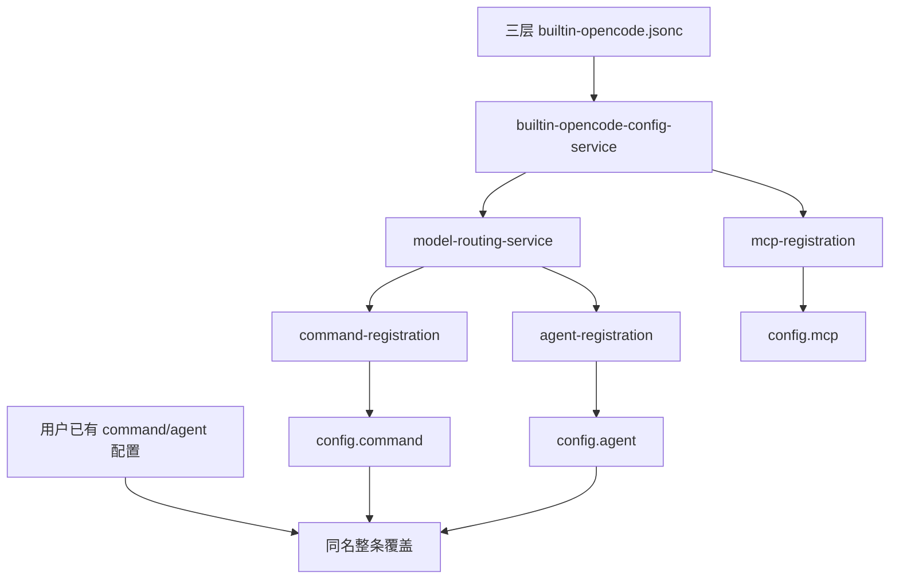

# 模型场景路由配置计划

## 来源与范围

本计划基于 `docs/ae/brainstorms/2026-05-03-model-scenario-routing-requirements.md`。目标是在三层 `builtin-opencode.jsonc` 中新增独立模型场景配置，让 AE 内置命令和代理按 `quick`、`standard`、`deep`、`vision` 场景解析出具体 `model`，同时保持插件级默认不配置任何模型，缺失配置时继续使用 opencode 当前默认模型。

## 研究结论

- `src/services/builtin-opencode-config-service.ts` 已支持三层 `builtin-opencode.jsonc` 读取与普通对象递归合并，且顶层 `mcp` 有专用安全 overlay。模型场景必须作为独立顶层节点接入，不能复用 `mcp` 的项目级限制。
- `src/services/command-registration.ts` 生成的 command 配置可写入 `model` 字段；用户同名命令通过 `mergeBuiltinAndUserCommands` 整条覆盖内置命令。
- `src/services/agent-registration.ts` 生成的 agent 配置可写入 `model` 字段；用户同名 agent 通过 `registerAgents` 整条覆盖内置 agent。
- `tests/index.test.ts` 可覆盖插件入口 config hook；入口接线涉及三层配置、命令、代理和 MCP 时应纳入验证。
- `tests/services/runtime-asset-manifest.test.ts` 与 `tests/services/mcp-registration.integration.test.ts` 已有运行时独立性测试模式，可参考真实 dist/bridge 或临时 dist 动态导入的方式覆盖分发结构。
- 当前 `Config.skills` 只包含 `paths` / `urls`，未发现 per-skill `model` 字段；技能模型场景通过命令入口、代理或子流程间接生效，不规划不存在的技能级模型写入。
- `src/assets/config/builtin-opencode.jsonc` 插件内置配置当前只有 `$schema` 和 `mcp`，本计划不得在插件级预置任何具体模型。
- `src/` 当前没有 `console.warn` 模式，配置阶段也没有 toast/metadata 通道；同名 `{ model }` 误用提示第一阶段采用 `console.warn`，定位为日志层可观察告警，并用 `vi.spyOn(console, 'warn')` 验证。不承诺该告警会稳定展示在普通插件用户 UI 中，也不引入 UI 副作用。

## 关键决策

- 顶层配置键使用 `model_scenarios`。理由：与需求中的“场景”语义一致，避免和 opencode 原生 `model` 或 `models` 概念混淆；TypeScript 内部可用 `modelScenarios` 命名。
- 稳定场景键固定为 `quick`、`standard`、`deep`、`vision`。项目级可以新增低层缺失的稳定场景键，但不能新增任意自定义场景键。
- `model_scenarios` 的值必须是对象，场景值必须是非空字符串；不强制校验 `provider/model` 形式，只在文档中建议该格式，避免阻断 opencode 未来或自定义模型标识。
- 场景缺失解析规则固定为：缺哪个场景就不写入该资产的 `model` 字段，直接继承 opencode 当前默认模型；不从其他场景自动降级或升级。
- 首批资产映射采用高置信最小集合：总是视觉的路径使用 `vision`，核心计划/执行/审查使用 `deep`，帮助和提示词优化使用 `quick`；其余资产默认不声明 `modelScenario`，继续继承 opencode 默认模型。执行时若映射争议较大，优先少映射而非全量分类。R10 中“常规资产默认使用 `standard`”在第一阶段降级为“只有被明确声明为 `standard` 的常规资产才使用 `standard`；未声明资产继续使用 opencode 默认模型”。
- `-po` / `-pa` 派生命令默认使用 `quick`，因为它们的第一步是提示词优化；后续基础命令仍由优化后的提示词触发，不在该包装命令里试图同时表达两个模型。
- 用户同名 command/agent 配置在 opencode 传入插件前已经合并完成，插件侧无法可靠区分项目级和全局级来源。本计划只保证：AE 三层 `model_scenarios` 内部按项目级 > 全局级 > 插件级合并；最终传入插件的用户同名 command/agent 整条优先于 AE 生成资产。这意味着全局同名完整覆盖可能优先于项目级场景配置，属于当前 opencode 配置合并边界内的已知限制，必须在文档中显式说明。仅写 `{ model }` 的同名覆盖属于 opencode 高级完整覆盖路径，不做字段级补齐，也不忽略用户覆盖；最终配置仍按用户整条覆盖输出，同时通过文档和 `console.warn` 提醒其会替换内置 template/prompt。

## 影响面

- 插件用户：可在 `.opencode/builtin-opencode.jsonc` 或 `~/.config/opencode/builtin-opencode.jsonc` 中配置模型场景；未配置时行为不变。
- 插件维护者：新增命令或代理时需要判断是否属于少数高置信模型场景；不应默认把所有新资产升级到 `deep`。
- 视觉能力用户：视觉路径缺少 `vision` 时会得到可操作提示或风险声明，但 AE 不自动检测模型是否真实支持图像输入。
- 现有显式配置用户：已有同名 `config.command[name]` 或 `config.agent[name]` 通过整条覆盖保留，不被场景路由覆盖；仅写 `model` 但不提供完整 command/agent 定义可能导致资产缺字段，需在文档和运行时检测中明确提示。

## 高层技术设计

## 实现单元

### [ ] 1. 扩展模型场景配置模型与校验

目标：让三层 `builtin-opencode.jsonc` 支持独立顶层 `model_scenarios` 节点，并在误配时提供中文错误。

需求：R1、R2、R3、R4、R5、R13。

文件：
- `src/services/builtin-opencode-config-service.ts`
- `src/assets/config/builtin-opencode.schema.json`
- `src/assets/config/builtin-opencode.jsonc`
- `tests/services/builtin-opencode-config-service.test.ts`

方法：
- 在 `BuiltinOpencodeConfig` 中增加可选 `model_scenarios?: unknown`，不要在插件内置 `builtin-opencode.jsonc` 中写入任何具体模型场景。
- 新增稳定场景键常量或类型，包含 `quick`、`standard`、`deep`、`vision`。
- 每一层读取后先校验该层 `model_scenarios`，再参与合并；合并后再校验最终结果。错误信息应包含配置层级、配置路径、字段路径和期望类型，例如 `项目级 builtin-opencode 配置 .opencode/builtin-opencode.jsonc 的 model_scenarios.vision 必须是非空字符串`。
- 保持 `mcp` 的项目级安全 overlay 逻辑不变；`model_scenarios` 走普通对象递归合并，允许项目级新增或覆盖稳定场景键。
- 调整 `mergeConfigObject` 的参数边界：`allowNewMcpEntries` / `projectMcpOverlay` 只能影响顶层 `mcp` 合并，不得泄漏到普通嵌套对象；或为 `model_scenarios` 增加独立合并路径。必须覆盖“全局已有 `deep`、项目级新增 `standard`”不报错的测试。
- 更新 JSON Schema，为 `model_scenarios` 声明四个可选字符串字段，禁止未知场景键；顶层仍允许其他未来字段。

测试场景：
- 三层合并时项目级 `model_scenarios.standard` 覆盖全局，全局补充项目级缺失的 `deep`。
- 插件内置文件没有 `model_scenarios` 时合法，结果不包含模型场景。
- 项目级可以新增低层缺失的 `quick` / `standard` / `deep` / `vision`，且不触发 `mcp` 新增限制。
- `model_scenarios` 为数组、字符串、`null` 时报错。
- 未知场景键、空字符串、非字符串值时报错，且错误信息包含层级、路径和字段路径。
- 全局层 `model_scenarios` 非法、项目层合法覆盖时仍报告全局层错误，避免低优先级误配被静默吞掉。
- 全局已有部分场景、项目级新增其他稳定场景时正常合并，不触发 `mcp` 的项目级新增限制。
- 现有 `mcp` 安全测试仍通过，证明模型场景没有改变 `mcp` 规则。

验证：
- `npx vitest run tests/services/builtin-opencode-config-service.test.ts`

### [ ] 2. 建立模型场景类型契约

目标：建立稳定场景键和资产可选场景声明字段，为后续解析服务和注册接入提供类型契约。

需求：R2、R9、R10、R11。

文件：
- `src/schemas/ae-asset-schema.ts`
- `tests/schemas/ae-asset-schema.test.ts`

方法：
- 在 `src/schemas/ae-asset-schema.ts` 中新增 `MODEL_SCENARIO` 常量和对应 Zod enum，值为 `quick`、`standard`、`deep`、`vision`。
- 在 `AeAssetEntrySchema` 和 `AgentDefinitionSchema` 中增加可选 `modelScenario` 字段。
- 不在本单元修改 `src/index.ts`，也不接入命令或代理注册。

测试场景：
- catalog entry 和 agent definition 可携带合法 `modelScenario`。
- 非法场景值被 Zod schema 拒绝。
- 未声明 `modelScenario` 的资产仍合法。

验证：
- `npx vitest run tests/schemas/ae-asset-schema.test.ts`

### [ ] 3. 新增模型场景解析服务

目标：集中处理场景到模型字符串的解析和缺失默认行为，避免命令和代理注册重复逻辑。

需求：R6、R7、R8。

文件：
- `src/services/model-routing-service.ts`（新增）
- `tests/services/model-routing-service.test.ts`（新增）

方法：
- 在 `model-routing-service.ts` 中提供解析函数：输入 `BuiltinOpencodeConfig` 和目标场景，输出 `string | undefined`。
- 实现场景直取规则：目标场景存在时返回该模型；目标场景缺失时返回 `undefined`，由 opencode 使用当前默认模型。禁止跨场景替代，例如 `{ standard }` 下解析 `quick` 必须返回 `undefined`，`{ deep }` 下解析 `standard` 也必须返回 `undefined`。
- 提供面向命令/代理的 resolver，接收资产定义并返回应写入的模型；没有场景或没有可用模型时返回 `undefined`。
- 提供 `hasVisionScenario(config)` 或等价只读函数，供视觉命令/代理在注册阶段判断是否可以注入“未配置 vision”的提示。

测试场景：
- 四个场景配置完整时按目标场景返回对应模型。
- `quick` 缺失但 `standard` 存在时，`quick` 解析为 `undefined`。
- `standard` 缺失但 `deep` 存在时，`standard` 解析为 `undefined`。
- `deep` 缺失但 `standard` 存在时，`deep` 解析为 `undefined`。
- 只有 `quick` 时，`standard` 和 `deep` 解析为 `undefined`。
- `vision` 缺失时解析为 `undefined`，不回退到文本场景。
- 无任何模型场景时所有解析返回 `undefined`。

验证：
- `npx vitest run tests/services/model-routing-service.test.ts`

### [ ] 4. 标注首批高置信资产场景

目标：只为首批高置信命令和代理声明 `modelScenario`，避免把第一阶段扩大为全资产分类工程。

需求：R9、R10、R11。

文件：
- `src/services/ae-catalog.ts`
- `tests/services/command-registration.test.ts`
- `tests/services/agent-registration.test.ts`

方法：
- 在 `src/services/ae-catalog.ts` 为首批高置信资产声明 `modelScenario`。
- 术语约定：`ae:xxx` 表示技能名或资产名，`ae-xxx` 表示斜杠命令注册名；命令注册相关测试使用 `ae-xxx`。
- 建议首批：
  - `deep`：`ae:plan`、`ae:refactor`、`ae:work`、`ae:merge-branch`、`ae:review`、`adversarial-reviewer`、`api-contract-reviewer`、`architecture-strategist`、`coherence-reviewer`、`correctness-reviewer`、`data-migrations-reviewer`、`feasibility-reviewer`、`maintainability-reviewer`、`performance-reviewer`、`product-lens-reviewer`、`reliability-reviewer`、`security-reviewer`、`standards-reviewer`、`step-granularity-reviewer`、`testing-reviewer`、`repo-research-analyst`、`research-reviewer`、`spec-flow-analyzer`。
  - `quick`：`ae:help`、`ae:prompt-optimize`、`ae-prompt-optimize-auto`、`-po` / `-pa` 派生命令。
  - `vision`：`ae:test-browser`、`figma-design-sync`、`design-iterator`。不要把整个 `ae:frontend-design` 命令静态映射为 `vision`，因为它同时包含纯文本实现路径和视觉验证路径。
- 不给未明确归类资产设置 `standard`，让它们继续继承 opencode 默认模型。

测试场景：
- `ae-plan` / `ae-review` 等高置信复杂命令声明 `deep`。
- `ae-help`、`ae-prompt-optimize-auto`、`-po` / `-pa` 派生命令声明 `quick`。
- `ae-test-browser` 声明 `vision`。
- `ae-frontend-design` 不静态声明 `vision`。
- 未明确归类资产没有被批量声明 `standard`。
- 首批 `deep` 代理清单与本单元方法中的显式列表一致，不能用“主要审查代理”等模糊集合替代。

验证：
- `npx vitest run tests/services/command-registration.test.ts tests/services/agent-registration.test.ts`

### [ ] 5. 接入命令模型路由

目标：让内置命令按场景写入 `model`，不改变用户同名整条覆盖语义。

需求：R9、R10、R11、R12。

文件：
- `src/services/command-registration.ts`
- `tests/services/command-registration.test.ts`

方法：
- 扩展 `LoadedCommand` / command 配置 shape，使内置生成命令可选包含 `model`。
- 将 `buildCommandConfig(commandsDir, options?)` 扩展为接收 options 对象；options 中包含可选 `resolveModelScenario` 和 `hasVisionScenario`，避免新增多个位置参数。
- 生成 catalog 命令和 `-po` / `-pa` 命令时根据 entry 的 `modelScenario` 写入 `model`；customTemplate 包装命令不做模板内容推断，只使用 entry 显式声明。
- 磁盘命令文件覆盖内置 catalog 时不自动写入场景模型，保持本地调试和用户自定义语义清晰。
- 保持 `mergeBuiltinAndUserCommands` 的合并顺序为 builtin 铺底、user 整条覆盖；不在 merge 阶段补字段。
- 不在本单元修改 `src/index.ts` 的三层配置加载边界；入口统一接入放在后续单元，避免共享可变中间状态。

测试场景：
- 配置 `model_scenarios.deep` 后，`ae-plan` / `ae-review` 命令包含对应 `model`。
- 未配置模型场景时，命令对象不包含 `model` 字段。
- `quick` 缺失但 `standard` 存在时，`ae-help` 不写入模型字段。
- 用户同名命令覆盖内置命令时，不继承内置 `model`。
- 磁盘命令文件覆盖 catalog 命令时，不继承 catalog 的模型场景。

验证：
- `npx vitest run tests/services/command-registration.test.ts`

### [ ] 6. 增加命令覆盖告警

目标：补齐命令注册中同名 `{ model }` 误用的日志告警边界。

需求：R5、R12。

文件：
- `src/services/command-registration.ts`
- `tests/services/command-registration.test.ts`

方法：
- 用户同名命令只写 `{ model }` 或缺少关键字段时，最终配置仍保留用户整条覆盖；注册逻辑通过 `console.warn` 输出明确中文告警，说明同名 command 是整条覆盖而不是字段级覆盖，且不会继承内置 template。配置 hook 没有 toast 或 metadata 通道，不新增 UI 副作用；该告警只承诺日志层可观察。

测试场景：
- 用户同名命令只写 `{ model }` 时，最终配置仍保留用户整条覆盖，并通过 `vi.spyOn(console, 'warn')` 验证输出中文告警。

验证：
- `npx vitest run tests/services/command-registration.test.ts`

### [ ] 7. 增加命令视觉状态注入

目标：在命令注册中为 `vision` 缺失状态注入非阻断模板提示，不改变模型路由结果。

需求：R8、R11。

文件：
- `src/services/command-registration.ts`
- `tests/services/command-registration.test.ts`

方法：
- 支持可选的视觉缺失提示注入参数：对总是视觉的命令（如 `ae-test-browser`）在 `vision` 未配置时注入非阻断风险提示；对 `ae-frontend-design` 这类混合路径只注入一个隐藏状态说明，要求其仅在进入视觉验证或截图分析前提示，不在纯文本实现路径提示。
- 该单元只注入文本状态，不解析配置文件、不构造模型 resolver、不调用 toast。

测试场景：
- `vision` 缺失时，`ae-test-browser` 不写入模型字段，模板包含一次非阻断可操作风险提示。
- `vision` 缺失时，`ae-frontend-design` 模板只包含可供视觉验证章节使用的状态说明，不在纯文本路径直接展示提示。
- `ae-test-browser` 模板中 `ae:setup` 仍先于 `ae:test-browser` 和任何浏览器执行语义；`vision` 缺失提示不得替代或前置于 setup 硬门禁。

验证：
- `npx vitest run tests/services/command-registration.test.ts`

### [ ] 8. 接入代理模型路由

目标：让内置代理按场景写入 `model`，不改变用户同名整条覆盖语义。

需求：R9、R10、R11、R12。

文件：
- `src/services/agent-registration.ts`
- `tests/services/agent-registration.test.ts`

方法：
- 扩展 agent config shape，使内置 agent 可选包含 `model`。
- 将 `buildAgentConfig(manifest, options?)` 扩展为接收 options 对象；options 中包含可选 `resolveModelScenario` 和 `hasVisionScenario`，避免新增多个位置参数。
- 读取 agent markdown 后根据 agent definition 的 `modelScenario` 写入 `model`；注册层不重复实现路由规则。
- 保持 `registerAgents` 的合并顺序为 builtin 铺底、user 整条覆盖。
- 如果 mock 或测试 agent 没有 `modelScenario`，不写入 `model`。

测试场景：
- 配置 `model_scenarios.deep` 后，深度审查代理包含对应 `model`。
- 配置 `model_scenarios.vision` 后，`figma-design-sync` / `design-iterator` 包含对应 `model`。
- 未配置模型场景时，agent 对象不包含 `model` 字段。
- 用户同名 agent 覆盖内置 agent 时，不继承内置 `model`。
- agent markdown 的 description / prompt / mode 行为保持不变。

验证：
- `npx vitest run tests/services/agent-registration.test.ts`

### [ ] 9. 增加代理覆盖告警

目标：补齐代理注册中同名 `{ model }` 误用的日志告警边界。

需求：R5、R12。

文件：
- `src/services/agent-registration.ts`
- `tests/services/agent-registration.test.ts`

方法：
- 对同名 agent 覆盖对象做轻量检测：如果仅包含 `model` 或缺少关键字段，最终配置仍保留用户整条覆盖；通过 `console.warn` 输出明确中文告警，说明同名 agent 是整条覆盖而不是字段级覆盖。配置 hook 没有 toast 或 metadata 通道，不新增 UI 副作用；该告警只承诺日志层可观察。

测试场景：
- 用户同名 agent 只写 `{ model }` 时，最终配置仍保留用户整条覆盖，并通过 `vi.spyOn(console, 'warn')` 验证输出中文告警。

验证：
- `npx vitest run tests/services/agent-registration.test.ts`

### [ ] 10. 增加代理视觉状态注入

目标：在代理注册中为 `vision` 缺失状态注入非阻断 prompt 提示，不改变模型路由结果。

需求：R8、R11。

文件：
- `src/services/agent-registration.ts`
- `tests/services/agent-registration.test.ts`

方法：
- 支持可选的视觉缺失提示注入参数：仅对总是视觉的代理（如 `figma-design-sync`、`design-iterator`）在 `vision` 未配置时注入非阻断可操作提示。
- 该单元只注入 prompt 状态，不解析配置文件、不构造模型 resolver、不调用 toast。

测试场景：
- `vision` 缺失时，`figma-design-sync` / `design-iterator` 不写入模型字段，prompt 包含非阻断风险提示。

验证：
- `npx vitest run tests/services/agent-registration.test.ts`

### [ ] 11. 提取入口层 builtin 配置上下文

目标：提供可被入口复用的 builtin 配置上下文构造能力，避免后续接线步骤引入未使用中间变量，并保持运行时独立性。

需求：R3、R4、R7、R12。

文件：
- `src/services/builtin-opencode-config-service.ts`
- `tests/services/builtin-opencode-config-service.test.ts`

方法：
- 在 `src/services/builtin-opencode-config-service.ts` 或相邻服务中提取可复用的入口配置上下文构造函数，内部通过 `resolveBuiltinOpencodeConfigPaths(manifest, hostWorktree)` 和 `loadBuiltinOpencodeConfig` 加载一次完整 builtin 配置。
- 该函数的最小接口为接收 `manifest` 和已经由入口解析出的 `hostWorktree`，返回 `{ paths, config }` 或等价只读上下文；resolver 和 `vision` 状态在后续接线单元基于该上下文构造，不放入本单元。
- `resolveHostWorktree(input)` 仍由 `src/index.ts` 调用，service 层不得依赖或导入入口私有函数；不得用 `manifest.repoRoot` 作为项目级配置根。
- 如果 builtin 配置解析错误，保持现有配置错误传播语义，不在 service 层调用 toast。

测试场景：
- 桥接安装场景下，插件内置配置来自 manifest，项目级配置来自宿主 worktree。
- 可选文件缺失继续自然跳过，插件内置文件缺失仍报错。
- 用 service 级测试模拟桥接文件 + dist 分发结构的 manifest 与宿主 worktree，断言不依赖源码仓库根、`opencode.json` 或当前仓库 `.opencode/` 调试资产；真实入口 dist/bridge 动态导入测试归入后续接线单元。

验证：
- `npx vitest run tests/services/builtin-opencode-config-service.test.ts`

### [ ] 12. 接线 MCP 注册

目标：让 MCP 注册消费入口层已加载配置，避免重复 IO。

需求：R3、R4。

文件：
- `src/index.ts`
- `src/services/mcp-registration.ts`
- `tests/index.test.ts`
- `tests/services/mcp-registration.test.ts`

方法：
- `src/index.ts` 使用单元 11 的配置上下文加载结果，并把已加载配置或其中的 `mcp` 节点传给 MCP 注册。
- MCP 注册改为接收已加载配置或其中的 `mcp` 节点，避免重复读取；保留兼容函数供测试或外部调用时使用。

测试场景：
- `model_scenarios` 存在时 MCP 注册仍只消费 `mcp`。
- 入口测试覆盖 `input.worktree`、`process.cwd()`、隔离 HOME/USERPROFILE 下的全局配置，不依赖源码仓库根。
- 执行 `npm run build` 后，通过 `.opencode/plugins/ae-server.js` 或等价临时 bridge wrapper 导入插件，并在隔离宿主 worktree 下调用 `plugin.server(...).config(...)`，验证入口层不依赖源码 `opencode.json`、源码 `src/assets/` 或调试 `.opencode/` 资产。

验证：
- `npx vitest run tests/index.test.ts tests/services/mcp-registration.test.ts`

### [ ] 13. 接线命令和代理模型路由

目标：让命令和代理注册消费入口层构造的模型 resolver 与视觉状态。

需求：R7、R8、R9、R10、R11、R12。

文件：
- `src/index.ts`
- `tests/index.test.ts`
- `tests/services/command-registration.test.ts`
- `tests/services/agent-registration.test.ts`

方法：
- `src/index.ts` 基于单元 11 的配置上下文构造 `buildModelResolver` 和 `hasVisionScenario` 结果，并通过 options 对象传给命令和代理注册。
- 入口层把 `vision` 是否配置作为布尔参数传给命令/代理注册的视觉提示注入逻辑；prompt 文件本身不直接读取配置文件。

测试场景：
- 三层都未配置模型场景时命令和代理注册均不写入模型字段。
- `vision` 未配置状态从入口传递到总是视觉的命令/代理和混合视觉命令，且不让 prompt 文件直接读取配置文件。
- 入口集成测试覆盖项目级 `model_scenarios.deep` 影响 `ae-plan` / 深度代理，全局配置可补齐项目缺失场景，插件内置默认不预置模型时行为保持当前默认。
- 执行 `npm run build` 后，通过 `.opencode/plugins/ae-server.js` 或等价临时 bridge wrapper 导入插件，并在隔离宿主 worktree 下验证模型路由接线仍以 manifest 定位内置资产、以 host worktree 定位项目级配置。

验证：
- `npx vitest run tests/index.test.ts tests/services/command-registration.test.ts tests/services/agent-registration.test.ts`

### [ ] 14. 处理视觉场景缺失的用户提示边界

目标：在明确需要图像输入或截图理解的路径提示 `vision` 缺失，同时避免纯文本前端实现产生噪音。

需求：R8、R11。

文件：
- `src/assets/skills/ae-test-browser/SKILL.md`
- `src/assets/skills/ae-frontend-design/SKILL.md`
- `src/assets/agents/workflow/figma-design-sync.md`
- `src/assets/agents/workflow/design-iterator.md`
- `scripts/check-vision-prompt-risk.mjs`

方法：
- 在视觉消费路径的提示词中加入约束：当当前任务需要截图、Figma 对齐或视觉验收且系统/命令提示已注入 `vision` 缺失提示时，应提示用户“当前视觉任务未配置 `vision` 场景，可能无法理解图像；可在 `builtin-opencode.jsonc` 中配置，或继续但结果不保证视觉能力”。
- 不要求技能或代理自动检测模型是否支持图像输入；文案只处理配置缺失或能力未知的风险声明。
- 纯文本前端代码修改路径不提示 `vision`，只在实际进入视觉验证或截图分析前提示。
- 所有 `vision` 缺失提示必须是非阻断提示，不得把未配置 `vision` 表述成功能不可用；默认模型仍可继续执行，只是不保证视觉能力。
- 不在非工具层调用 toast；这是提示词行为，不是运行时 UI 副作用。
- 新增 `scripts/check-vision-prompt-risk.mjs`，只做静态文本断言：上述 4 个文件包含 `vision`、`builtin-opencode.jsonc` 和非阻断风险语义，且不包含阻断式“必须配置后才能继续”语义。

测试场景：
- 逐文件验收：`ae-test-browser` 在浏览器验收/截图前提示；`ae-frontend-design` 只在视觉验证章节说明风险，不在纯文本实现路径要求提示；`figma-design-sync` 和 `design-iterator` 在 Figma 对齐或截图分析前提示。
- 批量预检：用 Node 脚本或 `rg` 检查上述 4 个文件包含 `vision`、`builtin-opencode.jsonc` 和“不保证视觉能力”或“可能无法理解图像”等非阻断风险语义，并确认不出现“必须配置后才能继续”等阻断语义。
- 提示词不声称 AE 能自动检测模型视觉能力。
- 不要求执行 `agent-browser`；本计划阶段和文本审查不触发浏览器 setup 门禁。
- 对 `ae-test-browser` 的文案变更必须保留 setup 前置为第一优先级；任何 `vision` 风险提示不得引导用户跳过 `ae:setup`。

验证：
- `node scripts/check-vision-prompt-risk.mjs`
- 文档审查覆盖 `src/assets/skills/ae-test-browser/SKILL.md`、`src/assets/skills/ae-frontend-design/SKILL.md`、`src/assets/agents/workflow/figma-design-sync.md`、`src/assets/agents/workflow/design-iterator.md`。

### [ ] 15. 更新用户配置文档与示例

目标：让用户知道如何配置模型场景、优先级、缺失默认行为和显式覆盖规则。

需求：R1、R2、R3、R4、R5、R6、R7、R8、R12、R13。

文件：
- `docs/model-scenarios.md`（新增主文档）
- `docs/usage-guide.md`
- `docs/builtin-mcp.md`
- `scripts/check-model-scenarios-docs.mjs`

方法：
- 新增 `docs/model-scenarios.md` 作为模型场景配置的唯一主文档。
- 说明配置位置：项目级 `.opencode/builtin-opencode.jsonc`，全局 `~/.config/opencode/builtin-opencode.jsonc`，插件内置层；优先级为项目级 > 全局级 > 插件级。
- 明确插件内置默认不配置任何模型场景；无配置时使用 opencode 当前默认模型。
- 提供 `model_scenarios` 示例，包含 `quick`、`standard`、`deep`、`vision`，但不推荐具体供应商模型作为必选项。
- 说明缺失场景不互相降级或升级，缺哪个场景就使用 opencode 当前默认模型。
- 说明用户提供完整同名 command/agent 配置时，其 `model` 随整条配置覆盖场景路由；这不是字段级覆盖。
- 明确同名 command/agent 是完整覆盖路径；如果只写 `{ model }`，不会继承 AE 内置 template/prompt，普通用户应优先使用 `model_scenarios`。
- 说明全局同名 command/agent 完整覆盖可能优先于项目级 `model_scenarios`，这是 opencode 当前合并边界内的已知限制；需要项目级改回场景路由时，应移除或改写该同名覆盖。
- 新增“如何确认配置生效”小节：说明缺失场景不会报错、声明场景的 AE 内置命令/代理会写入 `model`、同名 command/agent 覆盖会优先生效、仅 `{ model }` 覆盖会在配置阶段产生 warning。
- 新增“当前会消费场景的资产”小节或链接，列出第一阶段已声明 `modelScenario` 的命令/代理清单，并明确未列出的 AE 命令/代理即使配置了场景也会继续使用 opencode 当前默认模型。
- 说明 `mcp` 和 `model_scenarios` 是同一文件的不同顶层节点，`model_scenarios` 不受 `mcp` 项目级新增限制。
- `docs/usage-guide.md` 和 `docs/builtin-mcp.md` 只放短入口和交叉链接，避免重复维护完整规则。
- 新增 `scripts/check-model-scenarios-docs.mjs`，只做静态文本断言：用户文档不把本仓库 `src/assets/`、`.opencode/plugins/` 或 `npm run build` 写成普通下游项目前提，不包含密钥样式占位或供应商强绑定要求，并包含已声明 `modelScenario` 资产清单入口。

测试场景：
- 文档人工检查：不把本仓库 `src/assets/`、`.opencode/plugins/` 或 `npm run build` 写成普通下游项目前提。
- 示例 JSONC 不包含真实密钥或供应商强绑定。

验证：
- `node scripts/check-model-scenarios-docs.mjs`
- 文档审查覆盖 `docs/model-scenarios.md`、`docs/usage-guide.md`、`docs/builtin-mcp.md`。

## 风险与缓解

- 场景映射争议风险：不同维护者可能对某个资产应使用 `standard` 还是 `deep` 有分歧。缓解：首批只映射高置信资产，争议项不声明 `modelScenario`，继续继承 opencode 默认模型。
- 配置误解风险：用户可能以为 `vision` 会自动验证模型图像能力。缓解：文档和视觉路径提示明确 AE 不自动检测视觉能力。
- 运行时独立性风险：新增配置读取若误用源码仓库路径会破坏分发场景。缓解：继续复用 `resolveBuiltinOpencodeConfigPaths(manifest, hostWorktree)`，并覆盖桥接 + dist 场景测试。
- 用户显式配置覆盖风险：若在 merge 阶段补 `model`，可能覆盖用户同名配置。缓解：只在内置资产生成阶段注入模型，保持用户同名整条覆盖。
- R12 验收降级风险：opencode 传入插件的用户同名 command/agent 已合并，插件无法保证项目级场景覆盖全局同名完整覆盖。缓解：计划和用户文档明确该边界，并引导普通用户使用 `model_scenarios` 而不是同名资产覆盖。
- 过度抽象风险：若支持自定义场景键，会扩展为通用路由 DSL。缓解：第一阶段只支持四个稳定场景。

## 验证计划

- `npx vitest run tests/schemas/ae-asset-schema.test.ts tests/services/builtin-opencode-config-service.test.ts tests/services/model-routing-service.test.ts tests/services/command-registration.test.ts tests/services/agent-registration.test.ts tests/services/mcp-registration.test.ts tests/index.test.ts`
- `node scripts/check-vision-prompt-risk.mjs`
- `node scripts/check-model-scenarios-docs.mjs`
- `npm run typecheck`
- 如执行期间改动 `src/index.ts` 或 schema 影响更广，补跑 `npm run test`。
- 对计划和用户文档运行文档审查；若实现 diff 涉及配置、TypeScript、代理资产和提示词，执行代码审查时至少覆盖 correctness、testing、standards、agent-native 和 configuration/architecture 相关风险。

## 推迟到执行时的细节

- `model-routing-service.ts` 的具体导出函数命名可在实现时按最小公共 API 确定。
- 首批资产映射可在执行时根据 catalog 和代理列表微调，但必须遵守“少数高置信优先”的范围边界。
- 如果 opencode 后续增加 skill 级 `model` 字段，本计划不处理；可另开需求扩展技能直连模型配置。
