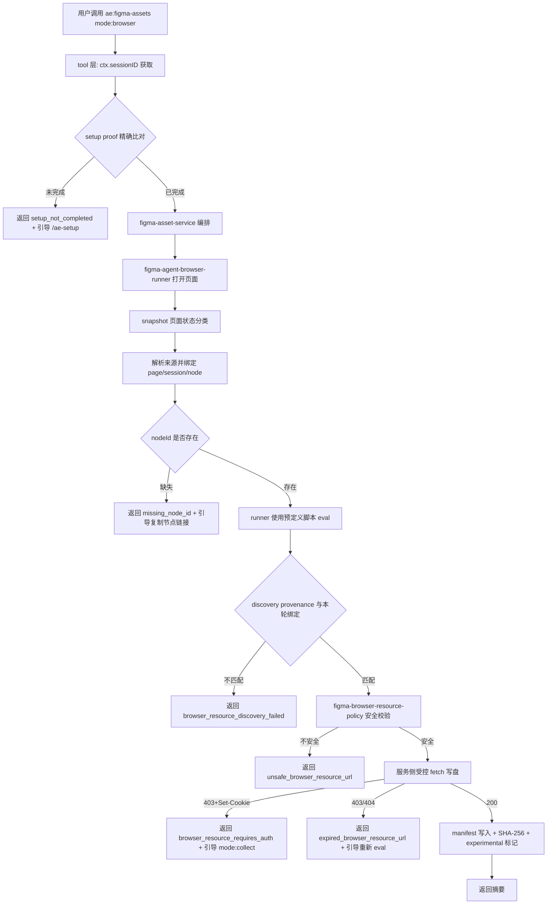

# ae:figma-assets 浏览器授权下载模式实现计划

## 来源与目标

基于 `docs/ae/brainstorms/2026-05-03-figma-assets-browser-login-refactor-requirements.md`，为 `ae:figma-assets` 重新设计素材获取链路：`mode: browser` 为浏览器登录授权主路径，`mode: api`/`mode: collect`/`mode: validate` 为兼容降级路径。用户通过 `agent-browser` 打开 Figma 页面完成登录授权，工具侧受控下载、写盘、校验并输出摘要，无需提供 Figma API token。

本计划针对需求直接设计，代码实现以本计划的单元契约为准；已有文件只作为可替换的落点候选，不作为结构、接口或行为约束前提。

## 关键决策

| 决策 | 依据 | 首版选择 |
| --- | --- | --- |
| browser 默认值 | 需求 R1/R3/R19：能力验证通过后成为默认主路径，用户不应被迫提供 API token | **U0 验证通过时，`mode` 默认值为 `browser`（带 experimental 标记）；U0 验证未通过时默认值为 `api`**。只有 U0 通过后，工具描述才把 `browser` 写为首选推荐路径；U0 未通过时 `browser` 标为实验/不可用 |
| browser 实现分层 | 需求 R4/R5/R6/R8：浏览器自动化 + 受控写盘 + 清理闭环 | **选择 B：工具层完成 setup proof 后由服务层 runner 编排 agent-browser**。LLM 不传入资源 URL；服务层使用预定义脚本执行 eval、生成 discovery provenance、校验 URL 来源与本轮 session/page/node 绑定后受控 fetch 写盘 |
| eval 脚本安全 | 需求 R5：不得读取浏览器敏感态 | **eval 脚本内容在代码层预定义为常量**（`src/services/figma-browser-eval-scripts.ts`），runner 根据脚本 ID 读取常量并通过 `execFile` 传给 `agent-browser eval`。LLM 不自由生成脚本内容，也不直接持有资源 URL 作为可信输入 |
| 缺少 node-id 策略 | 需求 R7：用户显式确认 | **首版要求显式 nodeId 或含 node-id 的 URL**，缺少时返回 `missing_node_id`，错误消息包含"请在已打开的 Figma 页面中右键目标节点 → 复制链接"的引导（R7 偏差：首版不自动获取当前选中节点，但通过错误消息引导用户操作） |
| 下载落盘机制 | 需求待定：`agent-browser download` 本地测试返回 `Download was canceled` | **首版不依赖 `agent-browser download`**；服务层 runner 使用 `agent-browser eval` 在本轮隔离页面上下文获取可观测资源 URL（仅限 S3 预签名 URL 或 CDN 直链），随后服务侧受控 fetch 写盘。关键假设：eval 提取的 CDN/S3 URL 不需要浏览器 cookie 即可直接下载 |
| 降级路径优先级 | 需求 R3/R19/R20 | **browser 失败后优先引导 `collect`（手动导出）**，而非 `api`（需要 token），避免违反 R3"用户不应被迫提供 API token"。`api` 仅作为最终兜底或用户显式选择 |
| 部分成功状态 | 需求 R12/R18 | **首版只支持单节点单导出产物**；任何子资源失败则整体 `failed`，不引入 `partial` |
| 清理失败状态 | 需求 R8 | 素材写盘成功但浏览器 profile 清理失败 → `success` + 高严重 warning；不阻断交付 |
| evidence schema | 需求 R15/R16 | 扩展 `FigmaAssetEvidenceSchema`：新增 `browserAuthStatus`、`downloadSourceType`、`browserSessionIdHash`、`pageUrlHash`、`failureCode`、`savedLocalEvidence`、`evidenceTypes`、`experimental`；保持 `savedLocalEvidence: false` 默认路径 |
| 重定向策略 | 需求 R13 | **首版拒绝自动跟随重定向**（R13 偏差：R13 要求"逐跳校验"，首版更严格地直接拒绝）。若 Figma CDN 资源存在合法 302，需在 U0 验证阶段确认；若 S3 预签名 URL 直接返回 200 则无影响 |
| SVG 首版策略 | 需求 R14 | **首版从 Content-Type allowlist 移除 `image/svg+xml`**，待 SVG 内容安全扫描实现后再开放。减少首版内容注入风险 |
| 浏览器隔离 | 需求 R8 | 首版使用本轮 runId 派生的 `agent-browser --session` 隔离会话，不额外创建或读取用户日常 profile；SKILL.md 明确禁止 `--profile`。流程结束必须执行 `agent-browser close --session <session>`，并清理工作区临时文件与 `.browser-lock` |
| setup proof 精确比对 | setup-gate-rule 硬约束 | **工具层获取 `ctx.sessionID` 并与 `proof.sessionId` 精确比对**，通过后才允许服务层 runner 执行任何 `agent-browser` 命令；`ctx.sessionID` 缺失或不匹配均失败。满足 setup-gate-rule 跨会话隔离要求 |
| 并发 browser 调用 | — | 首版不支持并发 browser 调用；若已有 browser 运行中，返回 `browser_mode_busy`。检测机制：在 `runAssetsDir` 写入 `.browser-lock` 临时文件，运行结束时删除 |

## 影响面

- 插件用户：U0 验证通过时 `mode` 默认值为 `browser`，用户无需显式指定即可走浏览器路径；U0 未通过时默认值为 `api`
- 现有 API/collect/validate 用户：三种模式继续可用；browser 失败降级优先引导 `collect`；工具描述和默认值按 R19 重写
- setup 门禁：`mode: browser` 是新的 `agent-browser` 消费方，必须完成 `ae:setup`
- 技能提示词：`src/assets/skills/ae-figma-assets/SKILL.md` 需新增 browser 流程说明
- manifest schema：`mode` enum 新增 `browser`；`evidence` 新增字段；`source.type` 新增 `browser_page`
- catalog 与帮助：`src/services/ae-catalog.ts` 和工具描述需同步

## 高层技术设计

> **注意**：技能层（SKILL.md）只负责引导用户调用 `mode: browser` 并说明需要完成 `ae:setup`；真正的 `agent-browser` 命令序列由服务层 runner 在 setup proof 通过后执行。这样可以用代码层 `try/finally` 关闭 session、清理锁，并避免把资源 URL 当作普通外部参数信任。

### 成功判定标准（R2 显式声明）

browser 模式的最终成功**仅基于本轮新增产物**：

- 素材文件已写入 `runAssetsDir` 且文件大小 > 0
- manifest 已写入且 `mode: 'browser'`、`status: 'success'`
- SHA-256 checksum 与文件实际内容匹配
- evidence 字段包含 `browserAuthStatus`、`downloadSourceType`

以下**不构成成功判定**：
- 页面打开成功或用户点击过下载按钮
- 浏览器 session 仍然存活
- `agent-browser eval` 返回了 URL（仅表示资源发现成功，不代表下载成功）

### 分层职责

| 层 | 职责 | 不做什么 |
| --- | --- | --- |
| 技能层 (SKILL.md) | 说明 browser 流程、要求先完成 `ae:setup`、提示用户在自动化浏览器完成登录授权 | 不直接执行 `agent-browser` 命令、不写盘、不调 API、不读 cookie/token、不接收或转发资源 URL |
| 工具层 (tool.ts) | schema parse、metadata、setup proof 精确比对（`ctx.sessionID` vs `proof.sessionId`）、调用 service、catch 错误、toast | setup proof 未通过时不调用服务层 browser 路径 |
| 服务层 (figma-browser-mode.ts) | 来源解析、调用 runner、校验 discovery provenance、资源 URL 安全校验、受控 fetch 写盘、manifest 生成 | 不 toast；不信任外部传入的资源 URL |
| runner (figma-agent-browser-runner.ts) | 封装 agent-browser CLI 调用：`open`、`snapshot -i`、预定义脚本 `eval`、`close`、execFile、超时、输出脱敏、`try/finally` 清理 | 不读取 cookie/token/localStorage/sessionStorage/账号标识；不扫描用户下载目录 |

### 页面状态分类（R4）

服务层 runner 通过 `agent-browser snapshot -i` 识别 Figma 页面状态并据此决定后续操作。分类矩阵如下：

> **可靠性说明**：页面状态分类由代码层 runner 读取 snapshot 输出后按规则判断。Figma UI 文案可能变化，分类准确性依赖 U0 收集的典型样本和测试覆盖；无法分类时必须返回 `page_state_unknown`，不得继续下载。

| 页面状态 | 识别特征 | 错误码/后续动作 |
| --- | --- | --- |
| 未登录 | 快照包含登录表单或 `Sign in` 按钮 | 返回 `login_required`，等待用户在浏览器中登录 |
| 登录中/二次验证 | 页面包含 MFA 输入框或组织验证元素 | 返回 `login_in_progress`，继续轮询等待 |
| 无权限 | 页面包含 "Request access" 或 403 提示 | 返回 `access_denied` + "请申请文件访问权限或尝试 mode: collect 手动导出" |
| 文件不存在 | 页面包含 404 提示或 "File not found" | 返回 `file_not_found` + "请确认文件 URL 是否正确" |
| 页面加载失败 | 快照为空或超时无响应 | 返回 `page_load_failed` + "请检查网络连接" |
| 节点不可见 | 页面已加载但目标节点未找到 | 返回 `node_not_visible` + "请确认节点 ID 是否正确" |
| 节点可导出 | 页面正常加载，目标节点可见 | 继续执行 eval 获取资源 URL |
| 下载入口不可自动化 | 页面需要用户交互但无法自动化 | 返回 `download_not_automatable` + "请尝试 mode: collect 手动导出" |
| 无法分类 | 快照内容无法匹配以上任何状态 | 返回 `page_state_unknown` + "无法识别页面状态，请尝试 mode: collect 手动导出" |

页面状态错误码与 manifest `evidence.failureCode` 使用同一套脱敏分类值；工具输出不得包含完整页面 URL、账号、组织名、token、cookie 或 DOM 片段。

## 实现单元

### U0: 能力验证（Spike）

- [ ] 使用 `agent-browser eval` 在真实 Figma 页面中验证资源 URL 提取策略的可行性
- [ ] 验证项（每项独立产出结论）：
  1. Figma 导出资源的 CDN/S3 URL 格式和域名
  2. 这些 URL 是否不需要浏览器 cookie 即可在 Node.js fetch 中直接下载
  3. eval 脚本提取 URL 的可行策略（如拦截 Figma 内部 API 调用或从页面 JS 变量读取）— 产出 eval 策略伪代码
  4. S3 预签名 URL 的有效期是否足够覆盖 LLM 推理延迟
  5. `agent-browser --session` 的隔离效果（是否使用临时 profile、`close` 后是否清理）
- [ ] 若验证失败，首版 `mode: browser` 返回 `browser_mode_not_available` 并引导 collect/api
- [ ] **默认值决策**：U0 验证通过（项 1-3 全部可行）→ 默认值为 `browser`（带 experimental 标记）；任一项失败 → 默认值为 `api`

**依赖**：无（需在计划审批前完成）
**产出**：独立 spike 文档 `docs/ae/spikes/2026-05-03-browser-resource-url-extraction.md`，包含每项验证结论、eval 策略伪代码和默认值决策结果
**验证**：spike 文档中每项验证有明确 pass/fail 结论

### U1: Schema 扩展

- [ ] `src/schemas/figma-asset-schema.ts`：`FigmaAssetModeSchema` 新增 `'browser'`
- [ ] `src/schemas/figma-asset-schema.ts`：`FigmaAssetToolArgsSchema` 不暴露 `browserResourceUrls`；browser 模式的资源发现由服务层 runner 生成，避免外部调用方注入任意 allowlist URL
- [ ] `src/schemas/figma-asset-schema.ts`：`FigmaAssetEvidenceSchema` 新增字段（字段名与用途）：
  - `browserAuthStatus: z.enum(['login_required', 'login_in_progress', 'access_denied', 'file_not_found', 'page_load_failed', 'node_not_visible', 'node_exportable', 'download_not_automatable', 'page_state_unknown', 'page_loaded']).optional().describe('浏览器页面授权状态')` — 覆盖 R4 页面状态分类；`page_loaded` 仅表示页面可访问，不代表素材下载成功
  - `downloadSourceType: z.enum(['cdn_direct', 's3_presigned', 'unknown']).optional().describe('下载资源来源类型')` — 区分 CDN 直链 vs S3 预签名 URL
  - `browserSessionIdHash: z.string().optional().describe('浏览器 session 标识的 SHA-256 哈希前 8 位')` — 脱敏标识，不记录完整 session ID
  - `pageUrlHash: z.string().optional().describe('Figma 页面 URL 的 SHA-256 哈希前 8 位')` — 脱敏页面来源（R15 要求"脱敏页面来源"，不记录完整 URL），仅 browser 模式填充
  - `failureCode: z.string().optional().describe('失败分类错误码')` — 下载阶段失败分类（R15 要求"失败分类"），如 `expired_browser_resource_url`、`browser_resource_requires_auth`、`download_too_large`、`total_download_limit_exceeded`、`invalid_content_type`、`write_failed`、`checksum_mismatch`
  - `discoveryScriptId: z.string().optional().describe('资源发现使用的预定义脚本 ID')` — 仅记录脚本 ID，不记录脚本内容或完整 URL
  - `discoveryCapturedAt: z.string().optional().describe('资源发现时间戳')` — 用于判断资源 URL 是否可能过期
  - `discoveryEventType: z.enum(['page_eval', 'network_observed']).optional().describe('资源发现事件类型')` — 标识 URL 来自页面 eval 或可观测网络事件
  - `savedLocalEvidence: z.boolean().default(false).describe('是否保存了本地调试证据；默认 false')` — R16 默认最小化，不保存截图/HAR/DOM/响应体
  - `evidenceTypes: z.array(z.enum(['screenshot', 'har', 'dom', 'network_response'])).default([]).describe('显式保存的证据类型；默认空数组')` — 仅用户明确开启调试证据时填充
  - `experimental: z.boolean().default(false).describe('是否为实验性模式')` — U0 验证通过但尚未形成稳定闭环时为 `true`，供结构化产物追踪
- [ ] `src/schemas/figma-asset-schema.ts`：`FigmaAssetSourceSchema.type` 新增 `'browser_page'` 枚举值
- [ ] `src/schemas/figma-asset-schema.ts`：manifest `mode` 接受 `'browser'`

**依赖**：U0 结论确认主路径可行
**文件**：`src/schemas/figma-asset-schema.ts`、`tests/schemas/figma-asset-schema.test.ts`
**验证**：`npm run typecheck` + `npx vitest run tests/schemas/figma-asset-schema.test.ts`

### U2: Setup Proof 校验（工具层精确比对）

- [ ] `src/tools/ae-figma-assets.tool.ts`：在 browser 模式分支中，从 `ctx` 获取 `sessionID`（运行时动态注入属性，使用 `as { sessionID?: string }` 类型断言 + 存在性守卫）
- [ ] 调用 `readSetupProof()` 获取 proof 对象，在工具层做精确比对：`proof.sessionId === ctx.sessionID` 且 `proof.completedAt` 不为空
- [ ] 精确比对通过后，将校验结果传入服务层；服务层不再自行校验 proof
- [ ] 精确比对失败时返回 `setup_not_completed` + "请先执行 /ae-setup"
- [ ] `ctx.sessionID` 不存在时返回 `setup_context_unavailable` + "无法确认当前会话已完成 /ae-setup，请重新执行 /ae-setup"，不得凭 proof 文件存在宽松放行

**依赖**：无（依赖已有 `setup-proof-service.ts`）
**文件**：`src/tools/ae-figma-assets.tool.ts`、`tests/tools/ae-figma-assets.tool.test.ts`
**方法**：mock `readSetupProof`、mock `ctx.sessionID`
**测试场景**：
  - 正常：proof 存在且 sessionId 精确匹配 + completedAt 有效 → 通过
  - proof 不存在 → `setup_not_completed` + 引导消息
  - proof 文件损坏（readSetupProof 返回 null）→ `setup_not_completed` + 引导消息
  - proof 存在但 sessionId 不匹配 → `setup_not_completed`（不宽松通过）
  - ctx.sessionID 不存在 → `setup_context_unavailable`，不执行 browser 路径
  - proof 存在但 completedAt 为空 → `setup_not_completed`
**验证**：`npx vitest run tests/tools/ae-figma-assets.tool.test.ts`

### U3: Agent-Browser Runner

- [ ] `src/services/figma-agent-browser-runner.ts`：封装 `agent-browser` CLI 调用，统一使用 `execFile` 和参数数组，禁止 shell 拼接
- [ ] 支持命令：`open`、`snapshot -i`、`eval`、`close`
- [ ] eval 只能接收 `scriptId`，runner 从 `EVAL_SCRIPTS` 读取脚本常量并传入 CLI；非法脚本 ID 返回 `invalid_eval_script_id`
- [ ] runner 生成并返回 `BrowserDiscoveryResult`：
   - `sessionIdHash`
   - `pageUrlHash`
   - `nodeIdHash`
   - `scriptId`
   - `capturedAt`
   - `eventType: 'page_eval' | 'network_observed'`
   - `resourceUrls`（仅在内存中传递给服务层，不写入 manifest 或用户输出）
- [ ] runner 输出脱敏：stdout/stderr 中的完整 URL、query、账号语义文本、token-like 字符串全部替换为哈希或 `<redacted>`
- [ ] browser session 生命周期：服务层通过 `try/finally` 调用 runner，任何失败路径都执行 `close`；close 失败返回 warning

**依赖**：U0、U7 eval 脚本常量
**文件**：`src/services/figma-agent-browser-runner.ts`、`tests/services/figma-agent-browser-runner.test.ts`
**方法**：mock child_process `execFile`
**测试场景**：
  - 使用参数数组调用 `agent-browser`，不经过 shell
  - 非法脚本 ID → `invalid_eval_script_id`
  - eval 脚本内容来自 `EVAL_SCRIPTS` 常量
  - stdout/stderr 脱敏，不包含完整 URL/query/token-like 字符串
  - open 成功、eval 失败时仍调用 close
  - close 失败生成 warning，不泄露 session 原文
**验证**：`npx vitest run tests/services/figma-agent-browser-runner.test.ts`

### U4: 浏览器资源安全策略

- [ ] `src/services/figma-browser-resource-policy.ts`：定义浏览器路径允许的资源 URL 域名 allowlist、协议、端口、大小、Content-Type、扩展名、重定向策略
- [ ] 新增 `isAllowedBrowserResourceUrl(url)` 函数，允许的域名集合（仅限不需要浏览器 cookie 即可公开访问的 CDN/S3 域名）：
   - `cdn.figmausercontent.com`
   - `figma-alpha-api.s3.us-west-2.amazonaws.com`
   - 首版**不包含** `figma.com` / `www.figma.com`（这些域名的资源可能需要浏览器 cookie/认证 header，违反 R5"不得绕过 Figma 权限"约束；若 U0 验证确认存在不需要 cookie 的静态资源 URL，后续版本可追加）
- [ ] 禁止：非 HTTPS、localhost、私网、`file:`、`data:`、`javascript:`、带 userinfo、带端口、尾点 host
- [ ] 重定向策略：首版拒绝自动跟随重定向；若资源 URL 返回 3xx，返回 `download_redirect_not_allowed`
- [ ] 文件大小上限：单文件 `MAX_DOWNLOAD_BYTES = 25MB`；新增单次运行总下载量上限 `MAX_TOTAL_DOWNLOAD_BYTES = 100MB`
- [ ] Content-Type allowlist：`image/png`、`image/jpeg`、`application/pdf`（首版移除 `image/svg+xml` 和 `text/html`，待安全扫描实现后再开放；**PDF 可嵌入 JavaScript，首版接受此风险**，推迟项记录"PDF 安全扫描"；**HTML 可嵌脚本/重定向，首版显式拒绝**）
- [ ] PDF 风险标记：当下载 `application/pdf` 时，manifest warnings 与工具输出必须包含 `pdf_active_content_risk`，提示 PDF 可能包含主动内容，建议仅打开可信来源文件
- [ ] 扩展名与 Content-Type 交叉校验
- [ ] 资源 URL 失败分类：fetch 返回 403/404 时区分两种场景：
   - `expired_browser_resource_url`：URL 曾是有效的 CDN/S3 资源链接但已过期（如 S3 预签名 URL 超时），返回"资源 URL 已过期，请重新执行 eval"
   - `browser_resource_requires_auth`：URL 需要浏览器 cookie/认证才能访问（如 fetch 返回 403 且响应头包含 `Set-Cookie` 或 URL 域名不在 allowlist 中实际触发了认证拦截），返回"资源需要浏览器认证，请尝试 mode: collect 手动导出"

**依赖**：U0 结论
**文件**：`src/services/figma-browser-resource-policy.ts`、`tests/services/figma-browser-resource-policy.test.ts`
**方法**：纯函数表驱动测试
**测试场景**：
  - 正例：允许的 Figma CDN/S3 HTTPS URL → 通过
  - 反例：`figma.com.evil.com`、`localhost`、`192.168.x.x`、`file:`、`data:`、`javascript:`、带端口、带 userinfo → 拒绝
  - 非法 Content-Type → 拒绝
   - Content-Type 与扩展名不匹配 → 拒绝
   - `image/svg+xml` Content-Type → 拒绝（首版策略）
   - `text/html` Content-Type → 拒绝（首版策略）
   - `application/pdf` Content-Type → 允许但生成 `pdf_active_content_risk` warning
   - Content-Type 预检语义：URL 扩展名推断（非 HEAD 请求），避免网络请求时序窗口
**验证**：`npx vitest run tests/services/figma-browser-resource-policy.test.ts`

### U5: Browser Mode 服务

- [ ] `src/services/figma-browser-mode.ts`：实现 `runBrowserMode(args, parsed, workspaceRoot, runId, runAssetsDir)` 编排逻辑
- [ ] run 目录规则：每次 browser 运行必须写入工作区 `.figma/runs/{runId}/assets/`（或项目已有等价 Figma 专用 run 目录），拒绝工作区外路径、符号链接逃逸、用户全局下载目录和非 Figma 专用目录
- [ ] 步骤（每步声明产出物契约）：
    1. 校验 setup proof 已由工具层完成（不再在服务层校验） → 产出：校验已通过（由工具层保证）
    2. 校验 `nodeId` 存在，缺失时返回 `missing_node_id` + 引导消息 → 产出：`nodeId` 值
    3. 创建本轮 `browserSessionId` 与 `.browser-lock`，调用 runner 打开 Figma 页面并轮询 snapshot 页面状态 → 产出：页面状态分类；用户取消登录返回 `login_cancelled`
    4. 页面状态为 `node_exportable` 后，runner 使用预定义脚本执行 eval，生成 `BrowserDiscoveryResult` → 产出：`discovery`
    5. 校验 discovery provenance：`sessionIdHash`、`pageUrlHash`、`nodeIdHash`、`scriptId`、`capturedAt` 必须与本轮输入一致且未超过 U0 确认的有效窗口；不匹配返回 `browser_resource_discovery_failed` → 产出：可信 `urls: string[]`
    6. 对每个 URL 调用 `figma-browser-resource-policy` 安全校验（域名校验 + Content-Type 预检） → 产出：`validatedUrls: string[]`
    7. 受控 fetch 下载字节流：新增 `browserDownloadResource` 函数，实现安全下载（HTTPS only、大小限制、超时、拒绝重定向）并额外增加：
       - Content-Type 校验：fetch 响应头 Content-Type 必须在 U4 定义的 allowlist 内，否则返回 `invalid_content_type`
       - Content-Type 与扩展名交叉校验
       - 单次运行总下载量累计：跟踪已下载字节数，超过 `MAX_TOTAL_DOWNLOAD_BYTES = 100MB` 时返回 `total_download_limit_exceeded`
       → 产出：`downloadedAssets: {filePath, size, sha256}[]`
    8. 文件名净化：使用 `{sourceIdHash前8位}.{format扩展名}` 生成（如 `a1b2c3d4.png`），不信任远端文件名；校验最终写入路径在 `runAssetsDir` 内 → 产出：净化文件名
    9. 写入 `runAssetsDir`，拒绝符号链接逃逸和工作区外路径 → 产出：文件写入确认
    10. 生成 manifest（`mode: 'browser'`、`source.type: 'browser_page'`、`status`、素材数量、文件大小、SHA-256、失败分类、`experimental`、`savedLocalEvidence: false`、discovery 脱敏字段） → 产出：`manifest` 对象
    11. 调用 `writeManifests`，同时写 latest manifest 与 run manifest → 产出：manifest 文件路径
    12. 无论成功或失败，服务层 `finally` 执行 `agent-browser close --session <session>`，清理 `.browser-lock` 和下载临时文件 → 产出：清理结果；清理失败只产生 warning，不记录敏感路径
- [ ] 所有失败场景的输出包含可操作的恢复步骤，**降级优先引导 `collect`（手动导出）而非 `api`（需要 token）**：
    - setup 未完成 → "请先执行 /ae-setup"
    - 无法确认 setup 会话 → "无法确认当前会话已完成 /ae-setup，请重新执行 /ae-setup"
    - 用户取消登录 → "已取消登录，请重新执行 browser 模式或尝试 mode: collect 手动导出"
   - 缺少 nodeId → "请在已打开的 Figma 页面中右键目标节点 → 复制链接"
   - 资源 URL 发现失败 → "请重新执行 eval 或尝试 mode: collect 手动导出"
   - 资源 URL 过期 → "请重新执行 eval"
   - 资源需要认证 → "请尝试 mode: collect 手动导出"
   - 资源不安全/过大/超时 → "请尝试 mode: collect 手动导出"
   - 写盘失败 → "请检查磁盘空间和目录权限"
   - checksum 不匹配 → "请重新执行 eval 或尝试 mode: collect 手动导出"
- [ ] 返回类型：定义 `BrowserModeResult` 接口（与 `ApiModeResult` 平行），包含 `mode: 'browser'`、`status`、`assets`、`manifestPath`、`evidence`

**依赖**：U1、U2（工具层校验通过后传入服务层）、U4
**文件**：`src/services/figma-browser-mode.ts`、`tests/services/figma-browser-mode.test.ts`
**方法**：mock fetch、mock fs、使用临时目录
**测试场景**：
  - 缺少 nodeId → `missing_node_id` + 引导消息
   - runner 未发现任何资源 URL → `browser_resource_discovery_failed`
   - discovery provenance 与本轮 session/page/node 不匹配 → `browser_resource_discovery_failed`
   - 用户取消登录 → `login_cancelled`
  - 资源 URL 不安全 → `unsafe_browser_resource_url`
  - 资源过大 → `download_too_large`
  - 下载超时 → `download_timeout`
  - 资源 URL 过期（fetch 返回 403/404，无 Set-Cookie）→ `expired_browser_resource_url`
  - 资源需要认证（fetch 返回 403 且有 Set-Cookie 或域名拦截）→ `browser_resource_requires_auth`
  - Content-Type 不在 allowlist → `invalid_content_type`
  - Content-Type 与扩展名不匹配 → `content_type_extension_mismatch`
  - 总下载量超过 100MB → `total_download_limit_exceeded`
  - 写入路径逃逸 → 拒绝
  - 写盘失败（磁盘满/权限拒绝）→ `write_failed` + "请检查磁盘空间和目录权限"
  - SHA-256 checksum 不匹配 → `checksum_mismatch` + "请重新执行 eval 或尝试 mode: collect"
   - 正常下载 → run assets 写入 + manifest 生成 + SHA-256 正确
   - 失败也写 failed manifest + 不泄露敏感 URL
   - runner open/eval/fetch 任一阶段失败时仍 close session 并清理 `.browser-lock`
  - validate 能校验 browser 生成的 manifest
  - 每个失败场景的输出包含可操作的恢复步骤，降级优先引导 `collect` 而非 `api`
**验证**：`npx vitest run tests/services/figma-browser-mode.test.ts`

### U6: 模式调度与工具描述重写

- [ ] `src/services/figma-asset-service.ts`：重新设计 `runFigmaAssetTool` 模式调度，`mode === 'browser'` 调用 `runBrowserMode`
- [ ] **默认值**：`mode` 参数默认值根据 U0 结论决定：
  - U0 验证通过 → 默认值 `browser`（工具描述中 browser 为首选推荐路径）
  - U0 验证未通过 → 默认值 `api`
  - 运行时通过常量 `FIGMA_BROWSER_MODE_AVAILABLE` 与 `FIGMA_DEFAULT_MODE` 控制；默认提交状态为 `FIGMA_BROWSER_MODE_AVAILABLE = false`、`FIGMA_DEFAULT_MODE = 'api'`
  - 只有 `docs/ae/spikes/2026-05-03-browser-resource-url-extraction.md` 明确通过 U0 项 1-3，且默认值测试同步更新后，才能把 `FIGMA_BROWSER_MODE_AVAILABLE` 改为 `true` 并把默认值改为 `browser`
- [ ] `src/tools/ae-figma-assets.tool.ts`：**重写工具描述**：browser 模式列为首选推荐路径（需完成 ae:setup），api 模式标为"需要 API Token 的显式凭证兼容路径"，collect/validate 保持不变
- [ ] `src/schemas/figma-asset-schema.ts`：`tokenEnv.describe()` 和 `envFile.describe()` 标记为"仅 api 模式需要"

**依赖**：U5
**文件**：`src/services/figma-asset-service.ts`、`src/tools/ae-figma-assets.tool.ts`、`tests/tools/ae-figma-assets.tool.test.ts`、`tests/services/figma-asset-service.test.ts`
**测试场景**：
  - tool 层 browser setup proof sessionId 精确匹配 → 继续执行
   - tool 层 browser setup proof sessionId 不匹配 → toast + `setup_not_completed`
   - tool 层 browser ctx.sessionID 不存在 → `setup_context_unavailable`
   - `FIGMA_BROWSER_MODE_AVAILABLE = false` → schema 默认值和工具描述不得把 browser 写成默认主路径
   - `FIGMA_BROWSER_MODE_AVAILABLE = true` 且 U0 spike 通过 → schema 默认值为 browser，工具描述 browser 为首选推荐路径
  - tool 层 browser 成功 → output 含模式、素材数量、manifest 相对路径
  - output 不含绝对路径、完整 URL、token
   - browser manifest 能被现有 validate 路径正确校验
   - 输出目录不是 `.figma/runs/{runId}/assets/` 或发生符号链接逃逸 → 拒绝
   - 成功和失败 manifest 均包含 `savedLocalEvidence: false` 与空 `evidenceTypes`
   - `api`/`collect`/`validate` 模式继续可用（R19/R20）
**验证**：`npx vitest run tests/tools/ae-figma-assets.tool.test.ts tests/services/figma-asset-service.test.ts`

### U7: 技能与公开资产同步

- [ ] `src/assets/skills/ae-figma-assets/SKILL.md`：新增 `mode: browser` 流程说明
    - 前置：完成 `ae:setup`
    - 命令归属：SKILL.md 不输出可复制的 `agent-browser` 命令；browser 自动化由 `ae-figma-assets` 工具内部 runner 在 setup proof 通过后执行
    - **eval 脚本安全**：runner 只使用预定义脚本 ID（如 `figma-export-urls`），不自由生成 eval 脚本内容；预定义脚本在 `src/services/figma-browser-eval-scripts.ts` 中以常量定义
   - 预定义脚本清单（首版）：
     - `figma-export-urls`：提取 Figma 导出资源的 CDN/S3 URL（仅访问页面 JS 变量或 DOM 属性，禁止访问 `document.cookie`、`localStorage`、`sessionStorage`、`indexedDB`）
   - 浏览器隔离：说明内部 runner 使用本轮 runId 派生的 `--session`，禁止 `--profile` 复用日常浏览器，并在流程结束关闭 session；不向用户输出可复制的 `agent-browser` 命令
    - 登录等待策略：runner 轮询 `snapshot -i` 间隔 5s、总超时 300s、超时后返回 `login_timeout`；用户取消时返回 `login_cancelled`
   - 失败降级：每个失败场景优先引导 `mode: collect`（手动导出），`api` 仅作为最终兜底
   - 缺少 node-id 时引导"在已打开的 Figma 页面中右键目标节点 → 复制链接"
   - 保留 `api`/`collect`/`validate` 说明，`api` 标为"显式凭证兼容路径"
- [ ] `src/services/figma-browser-eval-scripts.ts`：预定义 eval 脚本常量，导出 `EVAL_SCRIPTS: Record<string, string>` 和 `isValidScriptId(id: string): boolean`
- [ ] `src/services/ae-catalog.ts`：`argumentHint` 新增 `browser` 选项
- [ ] `src/assets/rules/setup-gate-rule.md`：确认 `ae:figma-assets` browser 路径被覆盖
- [ ] `tests/services/figma-browser-eval-scripts.test.ts`：校验脚本 ID 合法性 + 脚本内容不包含 `document.cookie`、`localStorage`、`sessionStorage`、`indexedDB`（代码层强制执行，不仅是提示词约束）
- [ ] `tests/services/figma-browser-setup-gate.integration.test.ts`：确认 browser 路径要求 setup、api/collect/validate 不要求；包含页面状态分类测试场景
- [ ] `tests/services/figma-browser-mode-availability.test.ts`：确认默认值门禁由 `FIGMA_BROWSER_MODE_AVAILABLE` 控制，未通过 U0 时不默认启用 browser

**依赖**：U6
**文件**：`src/assets/skills/ae-figma-assets/SKILL.md`、`src/services/figma-browser-eval-scripts.ts`、`src/services/ae-catalog.ts`、`src/assets/rules/setup-gate-rule.md`、`tests/services/figma-browser-eval-scripts.test.ts`、`tests/services/figma-browser-setup-gate.integration.test.ts`
**验证**：`npx vitest run tests/services/figma-browser-eval-scripts.test.ts tests/services/figma-browser-setup-gate.integration.test.ts` + `npm run typecheck`

## 推迟到实现的已知项

| 项目 | 原因 | 影响需求 | 首版替代 |
| --- | --- | --- | --- |
| 缺少 node-id 时允许当前选中节点 | 需要页面选区识别和节点摘要确认的 UX 定义 | R7 | 返回 `missing_node_id` + 引导用户在已打开页面复制节点链接 |
| 多节点批量导出 | 首版只支持单节点 | R7 | 单节点单导出 |
| `agent-browser download` 命令落盘 | 本地测试返回 `Download was canceled`，不可靠 | R6 | eval 取 URL + 服务侧 fetch |
| 证据保存（截图/HAR/DOM） | R16 默认最小化 | R15/R16 | 首版不支持任何证据保存；调试场景需手动处理并自行脱敏，工具不提供安全通道 |
| 调试证据删除方式字段 | 首版不提供证据保存入口，manifest 中 `evidenceTypes` 必须为空 | R16 | 不写入截图/HAR/DOM/响应体；如后续支持证据保存，必须新增删除方式字段和测试后才允许非空 `evidenceTypes` |
| DNS 私网解析与重绑定防护 | 需要额外安全研究 | R13 | 依赖 HTTPS 域名 allowlist |
| 魔数校验 | 需要额外实现与性能评估 | R14 | 仅做 Content-Type + 扩展名交叉校验 |
| SVG 内容安全扫描 | 需要额外实现 | R14 | 首版从 Content-Type allowlist 移除 `image/svg+xml` |
| HTML 内容安全 | HTML 可嵌脚本/重定向 | R14 | 首版从 Content-Type allowlist 显式拒绝 `text/html` |
| 逐跳重定向校验 | R13 要求"逐跳校验"但首版更严格地拒绝重定向 | R13 | 首版拒绝所有重定向 |
| 归档文件（zip）处理 | Figma 批量导出可能返回 zip | R14 | 首版不支持归档处理 |
| PDF 安全扫描 | PDF 可嵌入 JavaScript | R14 | 首版接受此风险，Content-Type allowlist 保留 `application/pdf` |
| validate 独立拆分 | validate 可从 figma-asset-service 中进一步独立 | R17 | 首版 validate 仍在 figma-asset-service 中编排 |

## 需求偏差声明

| 需求 | 偏差 | 首版处理 |
| --- | --- | --- |
| R1 browser 能力"验证通过后成为默认主路径" | 默认值受 U0 能力门禁控制，未验证前不得启用 browser 默认路径 | 默认提交状态：`FIGMA_BROWSER_MODE_AVAILABLE = false`、`FIGMA_DEFAULT_MODE = 'api'`；U0 项 1-3 通过且测试更新后 → `FIGMA_DEFAULT_MODE = 'browser'` |
| R3 "用户不应被迫提供 API token" | 默认值为 `browser` 时满足 R3；browser 失败降级优先引导 `collect` 而非 `api` | 降级路径：browser → collect → api（仅兜底） |
| R7 缺少 node-id 时"要求用户确认导出当前选中节点、当前页面可见资源或手动指定节点" | 首版不实现"当前选中节点"和"当前页面可见资源"两种确认方式，只支持"手动指定节点"（通过错误消息引导用户复制含 node-id 的链接） | `missing_node_id` + "请在已打开的 Figma 页面中右键目标节点 → 复制链接" |
| R8 浏览器隔离与清理 | 首版使用 `agent-browser --session` 隔离，不额外创建临时 profile | SKILL.md 禁止 `--profile` 复用日常浏览器；流程结束执行 `agent-browser close --session <session>`；服务层清理工作区临时文件和 `.browser-lock` |
| R5 URL 来源真实性 | 资源 URL 来源真实性必须由代码层闭环，不能依赖 LLM 自报 | 不暴露 `browserResourceUrls` 参数；runner 生成 discovery provenance，并在服务层校验 session/page/node/script/capturedAt 绑定后才下载 |
| R9/R10/R11 Trae 边界 | 需求约束属于研究阶段，无实现偏差 | 研究输出只保留脱敏结论和可公开验证的行为假设；交付代码不依赖 Trae |
| R13 逐跳重定向校验 | 首版拒绝所有重定向 | 若 Figma CDN 资源存在合法 302，需 U0 验证确认 |
| R14 SVG 内容安全 | 首版从 Content-Type allowlist 移除 `image/svg+xml` | 待安全扫描实现后再开放 |
| R14 HTML 内容安全 | 首版显式拒绝 `text/html` Content-Type | HTML 可嵌脚本/重定向，不属于素材格式 |
| R14 归档文件处理 | 首版不支持 zip 归档处理 | Figma 批量导出可能返回 zip，首版返回 `unsupported_content_type` |
| R16 证据保存 | 首版不支持任何证据保存（截图/HAR/DOM） | 调试场景需手动处理并自行脱敏，工具不提供安全通道 |
| R17 validate 独立性 | validate 继续作为独立校验能力，无偏差 | browser 模式生成的 manifest 能被现有 validate 路径校验 |
| R20 collect 降级路径 | 保留 collect 作为 browser 失败的首选降级路径 | 降级优先级：browser → collect → api |

## 风险

| 风险 | 缓解 |
| --- | --- |
| `agent-browser eval` 获取资源 URL 的稳定性受 Figma 前端变更影响 | U0 验证阶段确认可行策略；技能层提示词包含降级指引；资源 URL 发现失败时返回 `browser_resource_discovery_failed` + "请重新执行 eval 或尝试 mode: collect" |
| Figma 页面状态识别不可靠 | 使用 `snapshot -i` 获取可交互元素树判断登录/权限状态；无法分类时返回 `page_state_unknown` + 降级提示 |
| S3 预签名 URL 过期 | U0 验证 URL 有效期；fetch 返回 403/404 时区分 `expired_browser_resource_url`（重试 eval）vs `browser_resource_requires_auth`（引导 collect） |
| CDN/S3 URL 需要浏览器 cookie 才能下载 | 首版关键假设：eval 提取的 CDN/S3 URL 不需要 cookie；若 U0 验证此假设失败，browser 模式返回 `browser_resource_requires_auth` 并引导 `mode: collect`，默认值为 `api` |
| eval 脚本安全 | **已通过代码层强制执行**：eval 脚本内容在 `figma-browser-eval-scripts.ts` 中预定义为常量，LLM 只选择脚本 ID；测试校验脚本内容不包含 `document.cookie`/`localStorage`/`sessionStorage`/`indexedDB` |
| runner 调用 agent-browser 的可靠性 | 使用 `execFile`、超时、脱敏和 `try/finally`；任何失败路径关闭 session 并清理锁；无法清理时只输出脱敏 warning |
| setup proof 跨会话隔离 | **已修复**：工具层获取 `ctx.sessionID` 与 `proof.sessionId` 精确比对，满足 setup-gate-rule 硬约束；`ctx.sessionID` 不存在时失败，不宽松放行 |
| 并发 browser 调用争抢 | 首版使用 `.browser-lock` 临时文件检测；已有锁时返回 `browser_mode_busy` |
| PDF 可嵌入 JavaScript | 首版接受此风险，Content-Type allowlist 保留 `application/pdf`；manifest warning 和工具输出标记 `pdf_active_content_risk`；推迟项记录"PDF 安全扫描" |
