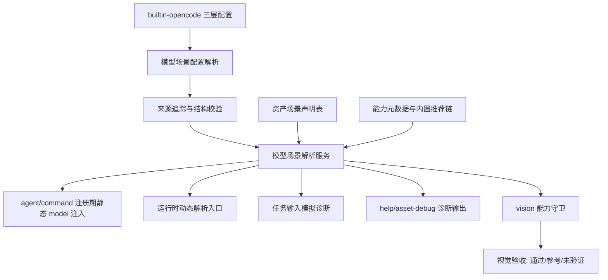

# 模型场景路由实施计划

## 来源与范围

本计划以上游需求文档 `docs/ae/brainstorms/2026-05-03-model-scenario-routing-requirements.md` 为真相来源，覆盖需求 R1-R39、成功标准、范围边界、关键决策和规划阶段待定技术问题。

目标是在 AE 插件中引入任务感知模型场景解析系统：用户通过 `builtin-opencode.jsonc` 配置少量用途场景，AE 内置资产声明场景偏好，注册期和可运行时选择路径解析最终 `model` 字段或诊断性降级。零用户配置时必须保持当前继承 opencode 默认模型的行为。

## 计划深度

深度计划。原因：该变更跨越三层配置合并、资产 catalog、agent/command 注册、诊断工具、视觉验收门禁、fallback/能力元数据和大量测试矩阵，并且涉及用户成本、能力误判和运行时独立性风险。

## 研究摘要

- `src/services/builtin-opencode-config-service.ts` 已支持插件内置、全局、项目级三层 `builtin-opencode.jsonc` 加载，当前仅对顶层 `mcp` 有专用安全合并和校验。
- `src/services/agent-registration.ts` 和 `src/services/command-registration.ts` 都采用“内置配置先生成，用户同名配置后覆盖”的模式，新增模型注入必须避免覆盖用户显式资产级 `model`。
- `src/services/ae-catalog.ts` 与 `src/schemas/ae-asset-schema.ts` 是内置技能、命令和代理的资产真源，路由声明应优先放在 catalog/专用 schema 中，而不是分散写入 Markdown 文案。
- `src/services/help-catalog-service.ts`、`src/tools/ae-help.tool.ts` 和 `src/assets/skills/ae-asset-debug/SKILL.md` 是现有可发现性和诊断入口，适合扩展为模型路由总览和资产查询入口。
- 视觉/浏览器路径已有 `ae:setup` 硬门禁，模型 `vision` 能力守卫必须作为独立门禁叠加，不能替代 setup，也不能让无视觉能力模型通过视觉验收。
- 当前未发现同主题既有计划或 `docs/ae/solutions/` 过往解决方案。

## 利益相关者与影响

- AE 插件用户：获得低配置成本的模型分流能力，且可通过诊断解释最终模型来源。
- 高级配置用户：保留资产级显式模型覆盖、fallback chain、能力约束和内置兜底开关。
- 内置技能/命令/代理维护者：需要为资产维护默认场景和应用状态。
- 视觉验收使用者：视觉结论需要满足 `ae:setup` 与 `vision` 能力双门禁。
- 插件运行时：必须继续支持“桥接文件 + dist”加载，不依赖源码仓库布局。

## 高层技术设计



### 配置节点决策

新增顶层节点建议命名为 `modelScenarios`，避免与 opencode 自身 `model` 字段混淆，也避免复用 `mcp` 的安全 overlay 语义。

建议结构：

```jsonc
{
  "modelScenarios": {
    "quick": {
      "model": "provider/model",
      "fallback": [
        { "model": "provider/alternative", "capabilities": ["text"] }
      ],
      "capabilities": ["text"],
      "params": { "temperature": 0.2 }
    },
    "vision": {
      "model": "provider/vision-model",
      "capabilities": ["vision"]
    }
  },
  "modelRouting": {
    "builtinFallback": { "enabled": false, "allowCrossProvider": false },
    "assetOverridePolicy": "lock-explicit"
  }
}
```

执行时可以调整字段细节，但必须保留这些语义：稳定场景键、用户自定义场景合法、首选模型和 fallback chain、能力要求、参数诊断、内置兜底显式启用、资产覆盖策略。

第一可交付切片聚焦“静态场景解析 + agent/command 注册注入 + 可解释诊断”。动态任务模拟、自动能力升级覆盖显式模型、复杂别名/供应商匹配和完整内置推荐链可以作为保守、可关闭或后续能力落地，避免第一版把模型路由扩展成不可解释的任务分类系统。

### 解析优先级决策

固化以下顺序并写入文档与测试：

1. 项目级资产模型。
2. 项目级场景。
3. 全局资产模型。
4. 全局场景。
5. 插件级资产模型。
6. 插件级场景。
7. 用户允许的内置推荐兜底。
8. 省略 `model` 字段，继承 opencode 当前默认模型。

同一层级内，资产级显式 `model` 高于场景默认值。动态能力升级只能在 `assetOverridePolicy` 允许时覆盖用户显式模型。

资产级 `model` 不能只依赖最终 `config.agent` / `config.command` 后合并结果解释。模型解析服务必须接收并追踪项目级、全局级、插件级中已有 `command` / `agent` 资产级 `model` 来源，按上述矩阵与场景配置一起比较；注册期仍可采用“内置注入后合并用户配置”的实现手段，但诊断和测试必须证明跨层优先级不是偶然由最终对象覆盖产生。

### 可用性与能力证据决策

注册期不得执行真实模型调用或供应商远程探测。证据等级建议为：`static-parseable`、`metadata-known`、`provider-configured`、`runtime-failed`。门禁级视觉验收默认只能使用已知支持 `vision` 的候选；能力未知只能产生非门禁参考。若后续支持“用户显式接受未知视觉风险”，第一版只记录为风险接受和非门禁状态，不自动标记视觉验收通过。

## 实现单元

- [ ] 单元 1：定义模型场景 schema 与配置合并规则。

  目标：让 `builtin-opencode.jsonc` 能声明 `modelScenarios` 和 `modelRouting`，并在三层合并时独立于 `mcp` 校验。

  需求追溯：R1-R8、R13-R16、R28-R33。

  文件：`src/services/builtin-opencode-config-service.ts`、`src/assets/config/builtin-opencode.schema.json`、`src/assets/config/builtin-opencode.jsonc`、可新增 `src/schemas/model-scenario-schema.ts`。

  方法：保留当前 `mcp` 专用规则；为 `modelScenarios` 增加专用结构校验和来源追踪数据，不让普通递归合并吞掉层级来源。插件内置默认配置不预置任何具体模型。

  测试场景：空配置合法；非对象、空模型、非字符串模型、错误 fallback 结构报中文错误；项目级覆盖全局和插件级场景；项目级允许新增/覆盖场景键但不改变 `mcp` 限制；自定义场景键合法但诊断标记为非内置。

  验证：`npx vitest run tests/services/builtin-opencode-config-service.test.ts`。

- [ ] 单元 2：新增模型场景解析服务。

  目标：把配置、资产声明、资产级显式模型、内置兜底、能力要求和覆盖策略解析为可解释的结果。

  需求追溯：R9-R19、R27-R35、R39。

  文件：新增 `src/services/model-scenario-routing-service.ts`、可新增 `src/schemas/model-scenario-routing-schema.ts`、可新增 `tests/services/model-scenario-routing-service.test.ts`。

  方法：返回结构化解析结果，包含最终模型、是否写入 `model`、来源、fallback 尝试记录、能力过滤结果、参数可写入状态、可用性证据等级和降级原因。解析服务要显式建模项目级/全局级/插件级资产模型来源，不能只读最终合并后的用户配置。内置推荐链默认不参与，只有用户显式启用或场景允许时参与。首版只做 trim、空值校验和原始字符串保留；复杂别名/供应商匹配默认关闭。

  测试场景：首选模型命中；首选能力不满足后命中 fallback；用户配置 fallback chain 跨供应商时按声明顺序尝试，且不受内置兜底 `allowCrossProvider` 限制；fallback 全失败后继承默认；内置兜底关闭时不参与；项目级场景覆盖全局资产模型；全局资产模型覆盖插件级场景；能力未知在文本任务可诊断降级，在视觉门禁不能通过；别名/规范化可关闭且不覆盖显式模型。

  验证：`npx vitest run tests/services/model-scenario-routing-service.test.ts`。

- [ ] 单元 3：建立内置资产默认场景声明表。

  目标：产出一张完整、可测试的资产到路由状态映射表，覆盖所有内置命令、代理和可间接路由技能路径，明确直接/间接/默认继承/不适用状态；本单元不负责注册期注入。

  需求追溯：R20-R26、R36-R37。

  文件：`src/services/ae-catalog.ts`、`src/schemas/ae-asset-schema.ts`、可新增 `src/services/asset-model-routing-catalog.ts`。

  方法：先生成资产枚举完整性清单，再为 command/agent 填直接或静态路由声明，最后为 skill 填 `indirect-subflow`、`static-only` 或 `not-applicable` 状态。稳定场景只使用 `quick`、`standard`、`deep`、`vision`。常规资产默认 `standard`，路由/摘要/格式化类用 `quick`，复杂审查/规划/跨文件综合用 `deep`，截图/Figma/视觉判断路径用 `vision`。技能无直接 `model` 落点时不得宣称动态直接生效。

  测试场景：所有 `getPhaseOneEntries()` 命令有路由状态；所有 `getAllAgentDefinitions()` 代理有路由状态；所有内置技能均有 `indirect-subflow`、`static-only`、`not-applicable` 或继承默认状态；复杂审查和规划不落到 `quick`；视觉相关资产引用 `vision`；自定义场景不会影响内置资产。

  验证：新增或扩展 `tests/services/command-registration.test.ts`、`tests/services/agent-registration.test.ts`、`tests/services/asset-model-routing-catalog.test.ts`。

- [ ] 单元 4：接入 agent 与 command 注册期静态模型注入。

  目标：在注册内置 agent/command 时根据场景解析写入 `model`，同时保留用户同名资产覆盖能力。

  需求追溯：R20-R23、R26、R28-R33。

  文件：`src/index.ts`、`src/services/agent-registration.ts`、`src/services/command-registration.ts`、`src/services/runtime-asset-manifest.ts` 如需传递上下文则最小修改。

  方法：优先采用“构建内置配置时注入模型，再合并用户配置”的顺序保护最终用户配置，同时把项目级/全局级/插件级资产模型来源传入单元 2 的解析矩阵，避免跨层优先级只由最终对象覆盖偶然成立。若 opencode command/agent 对 `model` 字段支持不足，计划执行时必须先用类型与现有插件契约确认，并把不支持路径标记为间接应用。

  测试场景：零配置注册结果与当前行为一致；配置 `quick`/`standard`/`deep` 后对应内置 command/agent 写入 `model`；用户同名 command/agent 显式 `model` 不被覆盖；项目级场景覆盖全局资产模型；全局资产模型覆盖插件级场景。

  验证：`npx vitest run tests/services/agent-registration.test.ts tests/services/command-registration.test.ts tests/index.test.ts`。

- [ ] 单元 5A：扩展静态模型路由诊断入口。

  目标：用户能查看有效场景映射、fallback/能力诊断、内置资产路由总览和按资产查询静态解析结果。

  需求追溯：R32-R37。

  文件：`src/services/help-catalog-service.ts`、`src/tools/ae-help.tool.ts`。

  方法：优先在现有帮助/资产调试体系中增加模型路由查询，避免过早新增公开工具。输出必须区分静态默认路由、注册期解析结果、用户覆盖和继承默认模型原因。

  测试场景：总览展示 `quick`/`standard`/`deep`/`vision` 来源层级；按资产查询展示声明场景、应用状态、最终来源和 fallback 记录；未知资产返回可恢复提示；配置错误包含层级、场景键和原因。

  验证：`npx vitest run tests/services/help-catalog-service.test.ts tests/tools/ae-help.tool.test.ts`。

- [ ] 单元 5B：实现任务输入动态模拟与真实运行时入口分界。

  目标：提供按任务输入模拟动态解析结果的诊断能力，并明确哪些路径支持真实运行时动态选择、哪些只支持静态或子流程动态应用。

  需求追溯：R25-R27、R38。

  文件：可新增 `src/services/model-scenario-dynamic-routing-service.ts`；若现有 `ae-help` 参数不足，再新增 `src/tools/ae-model-routing.tool.ts` 并同步 `src/tools/index.ts`、`src/schemas/ae-asset-schema.ts`、`src/services/ae-catalog.ts`。

  方法：首版动态任务输入默认作为诊断模拟，不改变注册期配置。只有当某条执行路径存在明确运行时模型选择入口时，才实现真实动态注入，并在资产路由表中标记为 `direct-dynamic`；否则标记为 `static-only` 或 `indirect-subflow`。不要引入复杂规则引擎；若没有可靠判断来源，`confidence` 字段可省略，避免伪精确。

  测试场景：按任务输入模拟展示场景判断、匹配规则、覆盖策略和最终来源，并明确标记为模拟结果；支持真实动态入口的路径有集成测试证明模型选择直接生效；静态路径测试证明模拟不会改变真实注册配置；用户 `lock-explicit` 策略下动态路由不得覆盖显式模型。

  验证：未新增工具时运行 `npx vitest run tests/services/model-scenario-dynamic-routing-service.test.ts tests/services/help-catalog-service.test.ts`；若新增 `ae-model-routing.tool.ts`，必须新增并运行 `tests/tools/ae-model-routing.tool.test.ts` 及工具注册相关测试。

- [ ] 单元 6A：定义视觉能力守卫判定契约。

  目标：产出可复用的视觉能力守卫判定契约，使截图分析、Figma 视觉核对、视觉设计验收等路径在无可确认 `vision` 模型时不能产出门禁级视觉通过结论。

  需求追溯：R17-R18、R24、R35。

  文件：可新增 `src/services/vision-model-gate-service.ts`、可新增 `tests/services/vision-model-gate-service.test.ts`。

  方法：保持 `ae:setup` 是执行 `agent-browser` 的前置门禁；新增 `vision` 能力判断作为结论门禁。明确区分三类结果：浏览器操作能否执行只由 setup 决定；素材导出或截图收集不强制 vision；视觉验收能否门禁通过必须有已知 vision 能力。未知能力和用户风险接受只能输出非门禁状态。

  测试场景：未 setup 阻断浏览器命令；已 setup 但无 `vision` 模型时视觉验收标记未验证；能力未知时只能参考；已知不支持视觉的模型不被用于门禁；已知支持视觉时允许门禁级结论。

  验证：`npx vitest run tests/services/vision-model-gate-service.test.ts tests/services/agent-browser-setup-gate.integration.test.ts`。

- [ ] 单元 6B：同步视觉相关技能和代理资产文案。

  目标：所有视觉相关技能/代理资产统一引用单元 6A 的视觉结论门禁语义，不把缺少 `vision` 模型误写成整个浏览器或素材导出流程阻断。

  需求追溯：R17-R18、R24。

  文件：`src/assets/skills/ae-test-browser/SKILL.md`、`src/assets/skills/ae-frontend-design/SKILL.md`、`src/assets/agents/workflow/design-iterator.md`、`src/assets/agents/workflow/figma-design-sync.md`。

  方法：可先用文件清单或小脚本定位包含 `agent-browser`、`视觉验收`、`Figma`、`截图`、`setup` 的段落，再人工复核并插入统一门禁说明。不得削弱现有 setup gate。

  测试场景：公开资产仍包含 setup 前置要求；视觉结论文案区分“参考/未验证/门禁通过”；没有出现“已安装即可跳过 setup”的反模式。

  验证：`npx vitest run tests/services/agent-browser-setup-gate.integration.test.ts`。

- [ ] 单元 7：补全文档、示例和可发现性。

  目标：让用户无需读源码即可理解场景键、配置格式、优先级、fallback、能力诊断和零配置行为。

  需求追溯：R2、R31-R39。

  文件：`src/assets/config/builtin-opencode.schema.json`、`src/assets/skills/ae-help/SKILL.md`、`src/assets/skills/ae-asset-debug/SKILL.md`，必要时新增用户侧规则或说明资产。

  方法：本单元作为文档收口，依赖单元 1 的配置 schema、单元 5A/5B 的诊断入口和单元 6A/6B 的视觉守卫契约，不再改变运行时代码接口。文档明确“场景键稳定，具体模型由用户环境决定”；内置推荐链是建议而非硬依赖；未知场景只服务用户自定义资产或后续扩展；静态路由总览不是动态输入最终保证；默认心智模型是用户显式 `model` 优先。

  测试场景：schema 包含用户可发现说明；帮助输出包含模型路由入口；资产调试附录列出模型路由检查项；公开资产不得把本仓库源码布局写成下游项目必须前提。

  验证：`npx vitest run tests/services/help-catalog-service.test.ts tests/services/command-registration.test.ts`。

- [ ] 单元 8：执行集成验证与回归门禁。

  目标：证明新增路由不破坏零配置兼容、运行时独立性、用户覆盖和浏览器 setup gate。

  需求追溯：全部成功标准。

  文件：`tests/index.test.ts`、新增 `tests/services/model-scenario-routing.integration.test.ts` 或 `tests/services/runtime-model-routing.integration.test.ts`。

  方法：增加“仅桥接文件 + dist”配置定位相关断言；确认 `opencode.json` 不是模型路由运行时依赖；确认 `.opencode/rules` 和 `builtin-opencode.jsonc` 仍只是可选用户入口。

  测试场景：零配置注册输出不写入 `model`；三层配置来源可诊断；用户已有 command/agent 覆盖保留；动态模拟不改变真实注册配置；支持真实动态入口的路径有直接生效证明；setup gate 扫描仍通过。

  验证：`npm run typecheck`、`npm run test`、必要时 `npm run build`。

## 推迟到实现时验证的事项

- opencode 1.4.10 对 `Config['command']` 和 agent 配置中 `model` 字段的真实支持方式需要在执行阶段通过类型、文档或最小实验确认；若不支持，相关路径只能标记为间接应用或诊断用途。
- 模型参数如 reasoning、token 预算和 temperature 是否可写入取决于 opencode 配置契约；第一版解析结果必须允许“仅诊断保留”。
- `assetOverridePolicy` 第一版默认只实现 `lock-explicit`；能力升级覆盖显式模型可先输出诊断建议，除非用户在后续版本中显式启用更强策略。
- 内置推荐 fallback chain 的具体模型列表不应在零配置中启用；是否提供列表、放置位置和更新策略可在实现单元 2 中最小化落地。
- 模型能力元数据的首版来源可采用静态表，但必须允许未知和过期状态，不得声称实时准确。

## 风险与缓解

- 用户显式 `model` 被场景路由覆盖：通过资产级来源追踪、注入顺序和优先级矩阵测试缓解。
- 零配置行为改变：内置配置不预置具体模型，内置兜底默认关闭，并用集成测试锁定。
- 诊断无法解释来源：模型配置解析必须保存层级和原始候选记录，不只返回最终合并对象。
- 视觉验收误通过：`vision` 能力守卫独立于 setup gate，并要求门禁级结论使用已知支持视觉的模型。
- 运行时独立性回退：内置配置只能通过 `RuntimeAssetManifest.builtinConfigFile` 定位，不依赖 `opencode.json` 或源码仓库目录。
- 配置安全过度或不足：`modelScenarios` 不复用 `mcp` overlay，但必须校验结构、空值和危险误配；项目级允许新增场景符合需求，同时 `mcp` 限制保持不变。

## 验收矩阵

- R1-R8：配置节点、稳定场景、自定义场景、三层优先级、结构错误和无配置合法性由单元 1 验收。
- R9-R19：fallback、能力要求、内置兜底、默认模型和视觉降级由单元 2 与单元 6 验收。
- R20-R27：资产声明、静态/动态/间接应用状态和动态覆盖策略由单元 3、单元 4、单元 5B 验收。
- R28-R33：用户资产模型覆盖和解析优先级由单元 2、单元 4、单元 5A 验收。
- R34-R39：场景、fallback、资产总览、资产查询、任务模拟和模型规范化诊断由单元 5A、单元 5B 与单元 7 验收。

## 交付检查清单

- 计划执行前先读取本计划和上游需求文档。
- 每个实现单元完成后运行对应 Vitest 子集。
- 涉及运行时注册或配置定位的改动完成后运行 `npm run typecheck` 和 `npm run test`。
- 如修改 `src/` 代码，按仓库规则运行 `graphify update .`。
- 最终交付前运行 `ae-gate` 或等价门禁记录验证、审查、Git 操作状态。
