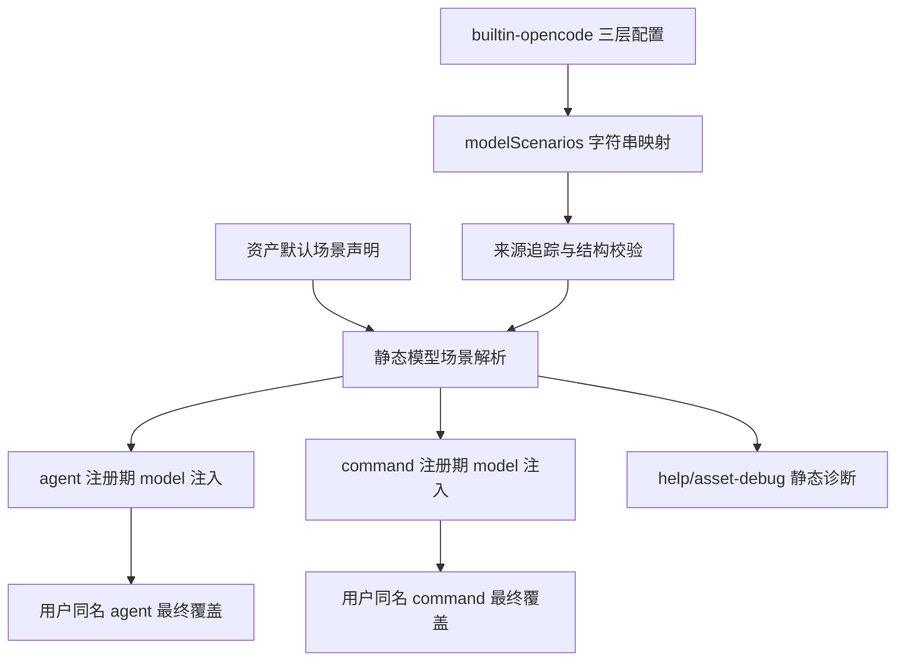

# 模型场景路由实施计划

## 来源与范围

本计划以上游需求文档 `docs/ae/brainstorms/2026-05-03-model-scenario-routing-requirements.md` 为背景来源，并按本次新增约束收敛实施范围：模型配置必须足够精简，首版只支持“场景键 -> model 字符串”的静态映射，不配置 fallback、capabilities、params、内置推荐链、覆盖策略或其他模型参数。

目标是在 AE 插件中引入低成本的模型场景路由：用户通过 `builtin-opencode.jsonc` 为少量稳定场景配置具体 opencode 模型标识，AE 内置 agent/command 声明场景偏好，注册期把场景解析为 `model` 字段。零用户配置时必须保持当前继承 opencode 默认模型的行为。

## 范围裁剪决策

上游需求中的高级模型解析能力保留为后续方向，不进入本轮实现和验收。

本轮包含：

- `modelScenarios` 顶层配置节点。
- 稳定场景键：`quick`、`standard`、`deep`、`vision`。
- 三层配置优先级：项目级高于全局级，全局级高于插件级。
- 配置值只允许非空字符串模型标识。
- 内置资产声明场景偏好，不声明具体模型。
- 根据场景给内置 agent/command 注入 `model`。
- 用户同名 agent/command 的显式配置继续最终覆盖内置配置。
- 静态诊断解释场景、模型字符串、来源层级和继承默认模型原因。

本轮不包含：

- fallback chain。
- capabilities、vision 能力元数据或模型可用性探测。
- params、temperature、token 预算、reasoning 等模型运行参数。
- 内置推荐模型链或跨供应商候选。
- 动态任务输入模拟和动态模型切换。
- `assetOverridePolicy`、`modelRouting` 或其他模型路由策略节点。
- 视觉能力自动验证门禁；`vision` 仅作为独立场景键，由用户绑定支持视觉的模型。

## 计划深度

标准计划。原因：该变更跨配置加载、资产 catalog、agent/command 注册和诊断输出，但配置结构已收敛为字符串映射，不再涉及 fallback、能力元数据、参数写入或动态路由。

## 研究摘要

- `src/services/builtin-opencode-config-service.ts` 已支持插件内置、全局、项目级三层 `builtin-opencode.jsonc` 加载，当前仅对顶层 `mcp` 有专用安全合并和校验。
- `src/services/agent-registration.ts` 从 `getAllAgentDefinitions()` 生成内置 agent，用户同名 `config.agent` 最终覆盖内置 agent；agent 配置形状允许额外字段，可注入 `model`。
- `src/services/command-registration.ts` 生成内置 command 并让用户同名 `config.command` 最终覆盖；opencode SDK 的 command 配置支持 `model` 字段，但本仓库当前命令类型需要同步扩展。
- `src/services/ae-catalog.ts` 是内置技能、命令和代理的 catalog 真源；agent 已有 `stage`，可作为最小场景映射依据，command 需要新增最小场景字段或集中映射函数。
- `src/services/help-catalog-service.ts`、`src/tools/ae-help.tool.ts` 和 `src/assets/skills/ae-asset-debug/SKILL.md` 是现有可发现性和诊断入口，适合扩展为静态模型路由查询入口。
- 当前未发现同主题既有计划或 `docs/ae/solutions/` 过往解决方案。

## 利益相关者与影响

- AE 插件用户：只需配置少量场景到模型字符串的映射，不需要理解所有内置资产名称。
- 高级配置用户：保留通过同名 agent/command 显式 `model` 覆盖内置场景模型的能力。
- 内置资产维护者：需要为 agent/command 维护默认场景映射。
- 插件运行时：必须继续支持“桥接文件 + dist”加载，不依赖源码仓库布局。

## 高层技术设计



### 配置节点决策

新增顶层节点命名为 `modelScenarios`，避免与 opencode 自身 `model` 字段混淆，也避免复用 `mcp` 的安全 overlay 语义。

首版只支持字符串映射：

```jsonc
{
  "modelScenarios": {
    "quick": "provider/fast-model",
    "standard": "provider/default-model",
    "deep": "provider/strong-model",
    "vision": "provider/vision-model"
  }
}
```

配置规则：

- `modelScenarios` 缺失时合法，所有资产继承 opencode 当前默认模型。
- `modelScenarios` 存在时必须是对象。
- 场景值必须是非空字符串；对象、数组、数字、布尔值和空字符串都返回可恢复中文错误。
- 允许用户新增自定义场景键，但 AE 内置资产首版只依赖 `quick`、`standard`、`deep`、`vision`。
- 插件内置默认配置不预置任何具体模型。
- 不接受 `fallback`、`capabilities`、`params` 或其他嵌套参数，避免配置心智负担和隐式能力承诺。

### 解析优先级决策

术语定义：

- 场景模型：`modelScenarios[scenario]` 配置出的模型字符串。
- 资产级显式 `model`：用户在同名 agent/command 配置中直接写入的 `model` 字段。

首版解析分为两个阶段，必须写入文档与测试：

1. AE 内置资产根据三层 `modelScenarios` 解析场景模型。
2. opencode 用户同名 agent/command 配置在注册合并阶段最终覆盖内置配置。

场景模型解析顺序：

1. 项目级场景。
2. 全局场景。
3. 插件级场景。
4. 省略 `model` 字段，继承 opencode 当前默认模型。

首版不解析项目级、全局级或插件级 agent/command 配置文件中的资产级显式 `model` 来源；已有用户同名 agent/command 覆盖来自 opencode 传入的最终 `config`，只作为注册合并阶段的最高优先级覆盖处理。

### 视觉场景边界

`vision` 是独立场景键，但首版不验证模型是否真的支持视觉输入。视觉相关技能/代理仍必须遵守现有 `ae:setup` 前置门禁；模型路由只负责把用户为 `vision` 场景配置的模型字符串注入到可直接应用的 agent/command。公开文档必须提示：用户应把 `vision` 绑定到支持图像输入的模型，AE 首版不做能力探测或门禁级能力证明。

## 实现单元

- [ ] 单元 1：定义极简模型场景 schema 与配置合并规则。

  目标：让 `builtin-opencode.jsonc` 能声明 `modelScenarios` 字符串映射，并在三层合并时独立于 `mcp` 校验。

  需求追溯：R1-R8、R28-R33 中与静态场景和层级优先级相关的部分。

  文件：`src/services/builtin-opencode-config-service.ts`、`src/assets/config/builtin-opencode.schema.json`、`src/assets/config/builtin-opencode.jsonc`、可新增 `src/schemas/model-scenario-schema.ts`。

  方法：保留当前 `mcp` 专用规则；新增 `mergeModelScenariosConfig(low, high)` 或等价逻辑，只对 `modelScenarios` 做字符串 map 合并与来源记录，不复用 `mcp` 的项目级安全 overlay 限制。配置值只允许非空字符串。插件内置默认配置不预置任何具体模型。

  测试场景：空配置合法；`modelScenarios` 非对象报中文错误；场景值为空字符串、非字符串、对象或数组时报中文错误；项目级覆盖全局和插件级场景；项目级新增 `modelScenarios.foo` 合法；项目级新增 `mcp.foo` 仍非法；自定义场景键合法但诊断标记为非内置。

  验证：`npx vitest run tests/services/builtin-opencode-config-service.test.ts`。

- [ ] 单元 2：新增静态模型场景解析服务。

  目标：实现接收资产场景声明输入的通用解析服务，把三层 `modelScenarios` 和资产声明场景解析为可解释的注册期结果。

  需求追溯：R14-R16、R28-R34、R37 中与来源解释和默认模型继承相关的部分。

  文件：新增 `src/services/model-scenario-routing-service.ts`、可新增 `src/schemas/model-scenario-routing-schema.ts`、可新增 `tests/services/model-scenario-routing-service.test.ts`。

  方法：返回结构化解析结果，包含最终模型、是否写入 `model`、来源层级、声明场景、是否继承默认模型和未写入原因。测试中使用 fixture 资产场景声明；真实内置资产声明由单元 3 接入。不做资产级显式 `model` 来源解析、fallback、能力过滤、参数写入、可用性探测或模型字符串规范化。

  测试场景：项目级场景命中后返回模型；全局场景在项目级缺失时命中；插件级场景在项目级和全局级缺失时命中；场景缺失后继承默认；未知自定义场景不影响内置资产；配置了原始模型字符串时按原样透传。

  验证：`npx vitest run tests/services/model-scenario-routing-service.test.ts`。

- [ ] 单元 3：建立内置资产默认场景声明表。

  目标：产出一张完整、可测试的内置 agent/command 到场景的映射表，明确直接应用、继承默认或不适用状态；本单元不负责注册期注入。

  需求追溯：R20-R24、R36-R37 中与静态资产分类相关的部分。

  文件：`src/services/ae-catalog.ts`、`src/schemas/ae-asset-schema.ts`、可新增 `src/services/asset-model-routing-catalog.ts`。

  方法：优先利用 agent 现有 `stage` 建立默认映射：`research` 可偏 `quick` 或 `standard`，`review` 偏 `deep`，`workflow` 按具体资产映射。command 侧新增最小 `modelScenario?: 'quick' | 'standard' | 'deep' | 'vision'` 字段或集中映射函数。`-po` / `-pa` 派生命令继承基础命令场景；磁盘命令若无 frontmatter 场景字段则标记为继承默认或不适用。常规资产默认 `standard`，路由/摘要/格式化类用 `quick`，复杂审查/规划/跨文件综合用 `deep`，截图/Figma/视觉判断路径用 `vision`。技能无直接 `model` 落点时不得宣称直接生效。

  测试场景：所有 `getPhaseOneEntries()` 命令有路由状态；`-po` / `-pa` 派生命令继承基础命令场景或有明确状态；磁盘命令有明确继承默认或不适用状态；所有 `getAllAgentDefinitions()` 代理有路由状态；复杂审查和规划不落到 `quick`；视觉相关资产引用 `vision`；自定义场景不会影响内置资产映射。

  验证：`npx vitest run tests/services/asset-model-routing-catalog.test.ts`。

- [ ] 单元 4：接入 agent 注册期静态模型注入。

  目标：在注册内置 agent 时根据场景解析写入 `model`，同时保留用户同名 agent 覆盖能力。

  需求追溯：R20-R23、R26、R28-R33 中与静态注册和用户覆盖相关的部分。

  文件：`src/index.ts`、`src/services/agent-registration.ts`、`src/services/runtime-asset-manifest.ts` 如需传递上下文则最小修改。

  方法：优先采用“构建内置 agent 配置时注入模型，再合并用户配置”的顺序保护最终用户配置。复用 `AgentConfigShape` 的额外字段能力。诊断中明确用户同名 agent 覆盖来自最终 `config.agent`，不提供三层来源细分。

  测试场景：零配置 agent 注册结果与当前行为一致；配置 `quick`/`standard`/`deep`/`vision` 后对应内置 agent 写入 `model`；用户同名 agent 显式 `model` 不被覆盖；项目级场景覆盖全局和插件级场景；全局场景覆盖插件级场景。

  验证：`npx vitest run tests/services/agent-registration.test.ts`。

- [ ] 单元 5：接入 command 注册期静态模型注入。

  目标：在注册内置 command 时根据场景解析写入 `model`，同时保留用户同名 command 覆盖能力。

  需求追溯：R20-R23、R26、R28-R33 中与静态注册和用户覆盖相关的部分。

  文件：`src/index.ts`、`src/services/command-registration.ts`、`src/services/runtime-asset-manifest.ts` 如需传递上下文则最小修改。

  方法：同步扩展 `LoadedCommand` 或相关返回类型以支持 `model`。基础 catalog 命令按单元 3 的场景注入；`-po` / `-pa` 派生命令按单元 3 决策继承或显式标记；磁盘命令若无场景声明则继承默认或不适用。用户同名 command 最终覆盖内置 command。

  测试场景：零配置 command 注册结果与当前行为一致；配置 `quick`/`standard`/`deep`/`vision` 后对应内置 command 写入 `model`；用户同名 command 显式 `model` 不被覆盖；派生命令和磁盘命令有明确模型注入或继承默认行为。

  验证：`npx vitest run tests/services/command-registration.test.ts`。

- [ ] 单元 6：扩展静态模型路由诊断入口。

  目标：用户能查看有效场景映射、内置资产路由总览和按资产查询静态解析结果。

  需求追溯：R32-R37 中与静态可观察性相关的部分。

  文件：`src/services/help-catalog-service.ts`、`src/tools/ae-help.tool.ts`、`src/assets/skills/ae-asset-debug/SKILL.md`。

  方法：优先在现有帮助/资产调试体系中增加模型路由查询，避免过早新增公开工具。工具侧必须通过执行上下文获得 host worktree，并复用与注册期一致的 `resolveBuiltinOpencodeConfigPaths(manifest, worktree)` 或等价路径解析；若工具上下文无法可靠获得 worktree，首版诊断必须降级为“静态 catalog 默认路由 + 明确说明未加载项目级有效配置”。输出必须区分静态默认路由、注册期解析结果、用户最终覆盖和继承默认模型原因。不输出 fallback 尝试、能力过滤或参数写入状态。

  测试场景：总览展示 `quick`/`standard`/`deep`/`vision` 当前模型和来源层级；按资产查询展示声明场景、应用状态、最终来源和继承默认原因；未知资产返回可恢复提示；配置错误包含层级、场景键和原因。

  验证：`npx vitest run tests/services/help-catalog-service.test.ts tests/tools/ae-help.tool.test.ts`。

- [ ] 单元 7：补充用户可见文档与示例。

  目标：让用户无需读源码即可理解极简配置格式、优先级、零配置行为、用户覆盖和首版不支持的高级能力。

  需求追溯：R2、R31-R39 中与配置说明和静态诊断相关的部分。

  文件：`src/assets/config/builtin-opencode.schema.json`、`src/assets/skills/ae-help/SKILL.md`、`src/assets/skills/ae-asset-debug/SKILL.md`。

  方法：文档主示例只展示 `modelScenarios` 字符串映射。明确“场景键稳定，具体模型由用户环境决定”；未知场景只服务用户自定义资产或后续扩展；`vision` 不做能力探测；fallback/capabilities/params/动态路由不属于首版。

  测试场景：schema 包含用户可发现说明；帮助输出包含模型路由入口；资产调试附录列出模型路由检查项；公开资产不得把本仓库源码布局写成下游项目必须前提。

  验证：`npx vitest run tests/services/help-catalog-service.test.ts tests/tools/ae-help.tool.test.ts`。

- [ ] 单元 8：补充模型路由集成回归与运行时独立性断言。

  目标：证明新增路由不破坏零配置兼容、三层配置解析、用户覆盖和运行时独立性。

  需求追溯：全部本轮成功标准。

  文件：`tests/index.test.ts`、新增 `tests/services/model-scenario-routing.integration.test.ts` 或 `tests/services/runtime-model-routing.integration.test.ts`。

  方法：增加“仅桥接文件 + dist”配置定位相关断言，确认 `opencode.json` 不是模型路由运行时依赖；确认 `.opencode/builtin-opencode.jsonc` 作为可选用户入口参与三层配置；确认用户已有 command/agent 覆盖保留。

  测试场景：零配置注册输出不写入 `model`；项目级场景覆盖全局和插件级场景；全局场景覆盖插件级场景；用户已有 command/agent 覆盖保留；仅桥接文件 + dist 场景不依赖源码仓库布局。

  验证：`npx vitest run tests/index.test.ts tests/services/model-scenario-routing.integration.test.ts`。

## 推迟到后续版本的事项

- fallback chain、内置推荐模型链和跨供应商候选。
- capabilities、模型能力元数据、视觉能力自动验证和可用性证据等级。
- params、temperature、token 预算、reasoning 等模型运行参数写入。
- 动态任务输入模拟、真实运行时动态模型切换和动态能力升级覆盖显式模型。
- 模型字符串规范化、别名和供应商候选匹配。
- 专项 `ae-model-routing` 工具；首版优先复用 help/asset-debug 诊断入口。

## 风险与缓解

- 用户显式 `model` 被场景路由覆盖：通过“内置先注入、用户同名配置最终覆盖”的注册顺序和测试缓解。
- 零配置行为改变：插件内置配置不预置具体模型，并用集成测试锁定。
- 配置心智负担回升：首版 schema 只允许字符串值，拒绝对象参数，文档不展示复杂配置。
- 诊断无法解释来源：模型解析必须保存层级和原始场景记录，不只返回最终合并对象。
- 视觉能力误解：文档明确 `vision` 只表示场景选择，AE 首版不验证模型视觉能力；浏览器能力仍受现有 setup gate 约束。
- 运行时独立性回退：内置配置只能通过 `RuntimeAssetManifest.builtinConfigFile` 定位，不依赖 `opencode.json` 或源码仓库目录。

## 验收矩阵

- R1-R8：配置节点、稳定场景、自定义场景、三层优先级、结构错误和无配置合法性由单元 1 验收。
- R14-R16、R28-R33：来源解释、默认模型继承、用户同名资产覆盖和解析优先级由单元 2、单元 4、单元 5 与单元 8 验收。
- R20-R24、R26：资产声明、静态应用状态和无直接落点限制由单元 3、单元 4 与单元 5 验收。
- R32-R37：场景总览、资产总览和按资产查询静态解析结果由单元 6 与单元 7 验收。
- R9-R13、R17-R19、R25、R27、R35、R38-R39 中涉及 fallback、能力验证、可用性探测、动态路由、覆盖策略、参数和模型规范化的部分不属于本轮验收。

## 交付检查清单

- 计划执行前先读取本计划和上游需求文档，确认本轮仍按极简模型配置范围实施。
- 每个实现单元完成后运行对应 Vitest 子集。
- 涉及运行时注册或配置定位的改动完成后运行 `npm run typecheck` 和 `npm run test`。
- 如修改 `src/` 代码，按仓库规则运行 `graphify update .`。
- 最终交付前运行 `ae-gate` 或等价门禁记录验证、审查、Git 操作状态。
