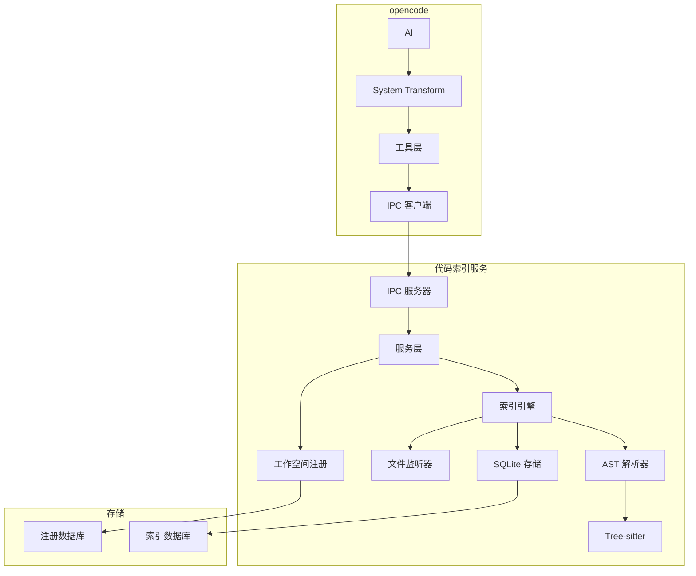
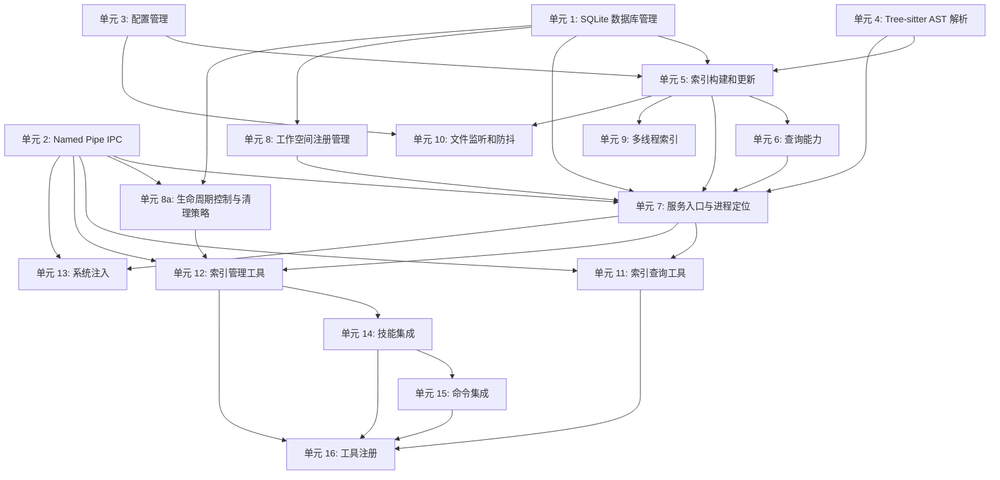

# 项目级代码索引后台服务实现计划

## 概述

实现一个项目级代码索引后台服务，支持多语言 AST 解析、增量更新和可扩展查询能力，通过 Named Pipe + JSON-RPC 2.0 与 opencode 通信。

## 利益相关者

- **AI 用户**：通过系统注入了解索引可用性，使用查询工具快速获取代码信息
- **开发者**：通过命令/技能管理索引服务生命周期
- **插件维护者**：维护服务代码和配置

## 实现单元

### 单元 1：基础设施层 - SQLite 数据库管理

**目标**：实现 SQLite 数据库管理，包括每工作空间索引数据库和全局注册数据库

**需求**：R1, R4e, R4d

**依赖**：无

**文件**：
- `src/services/code-index/db-manager.ts`
- `src/schemas/code-index-schema.ts`

**方法**：
1. 使用 `better-sqlite3` 驱动
2. 启用 WAL 模式提升并发性能
3. 子产出 1a：定义每工作空间索引数据库 Schema（文件表、符号表、引用表、依赖表）和迁移机制
4. 子产出 1b：定义全局注册数据库 Schema、迁移机制和连接接口；注册仓储 CRUD 归 U8 实现
5. 子产出 1c：实现 SQLite 连接、WAL 初始化、写入串行化和 Worker 独立连接策略
6. 索引数据库按工作空间存储在 `.opencode/code-index/index.sqlite`
7. 全局注册数据库存储在 opencode 全局配置路径下
8. 索引表以 `workspace_id + relative_path` 作为文件身份，避免不同工作空间同名相对路径污染
9. `workspace_id` 基于规范化 workspace 根生成：解析 realpath，统一 Windows 大小写/UNC/subst/符号链接策略，并在注册、注销、查询、监听、清理中复用
10. 所有文件路径存储为相对路径，workspace 根路径只允许存在于全局注册数据库
11. 全局注册库和工作空间索引库写入 `schema_compat_domain` 元数据；不同插件分发根可并存，但打开数据库前必须校验协议主版本、schema 版本和兼容域，不兼容时拒绝读写或使用隔离数据库名

**测试场景**：
- 正常路径：创建数据库、插入数据、查询数据
- 边界情况：数据库文件损坏、磁盘空间不足
- 错误路径：数据库锁定、并发写入冲突
- 集成测试：与文件系统交互

**验证**：
- 数据库创建成功
- 数据插入和查询正确
- 迁移机制正常工作
- 多工作空间同名相对路径不会互相污染
- 同一物理工作空间经符号链接、大小写变体、UNC/subst 路径重复注册时保持同一 workspace_id
- 不同插件分发根或 schema 版本不兼容时不会共享读写同一注册库/索引库

**性能指标**：
- 数据库单次主键/索引查询延迟 < 10ms（由性能基准硬门禁覆盖）
- 批量插入吞吐量 > 1000 条/秒（观察性指标，用于容量评估，不阻断交付）

---

### 单元 2：基础设施层 - Named Pipe IPC 通信

**目标**：实现 Named Pipe + JSON-RPC 2.0 IPC 通信

**需求**：R5, R20, R22

**依赖**：无

**文件**：
- `src/services/code-index/ipc-server.ts`
- `src/services/code-index/ipc-client.ts`
- `src/services/code-index/ipc-path.ts`
- `src/schemas/code-index-ipc-schema.ts`

**方法**：
1. 使用 `net` 模块创建 IPC 服务器
2. 实现 JSON-RPC 2.0 协议
3. 定义 RPC 方法（ping、getStatus、query、update 等）
4. 处理客户端断开连接
5. 实现优雅关闭
6. 使用稳定可发现的 Named Pipe 地址（基于用户级路径 + 协议主版本 + 插件分发根指纹的服务名）
7. 定义 IPC 地址和握手元数据格式；锁文件生命周期和写入由 U7 独占负责，U2 只消费已解析的 IPC 地址
8. IPC 握手必须校验协议版本、插件分发根指纹和服务能力集；ping 只能证明进程活跃，不能证明协议兼容
9. 固定服务名同时包含协议主版本和插件分发根指纹；同一协议主版本但不同插件分发根必须使用不同 IPC 地址，协议不兼容时拒绝复用旧服务并返回中文可恢复提示
10. 握手结果必须区分 `starting`、`ready`、`incompatible`；`starting` 只表示进程可连接，不允许客户端复用为可服务状态

**测试场景**：
- 正常路径：客户端连接、发送请求、接收响应
- 边界情况：客户端断开、服务器关闭
- 错误路径：管道已被占用、权限不足
- 集成测试：多客户端并发连接

**验证**：
- IPC 服务器启动成功
- 客户端可以连接并发送请求
- JSON-RPC 2.0 协议正常工作
- 旧服务活性检测和 stale lock 恢复正常
- 不同协议版本或不同插件分发根并存时不会误连旧服务

---

### 单元 3：基础设施层 - 配置管理

**目标**：实现 ae.jsonc 配置管理

**需求**：R13, R14

**依赖**：无

**文件**：
- `src/services/code-index/config-manager.ts`
- `src/schemas/code-index-config-schema.ts`

**方法**：
1. 复用现有 builtin-opencode 配置体系，不新增第二套任意 `ae.jsonc` 搜索逻辑
2. 配置层级：内置配置（源码真源为 `src/assets/config/ae.jsonc`，运行时通过 runtime manifest / 当前模块 URL 定位 dist 内资产）→ 全局 `~/.config/opencode/ae.jsonc` → 当前工作空间 `.opencode/ae.jsonc`
3. 解析代码索引范围配置（.gitignore 标准）
4. 使用 `ignore` 库实现通配符匹配
5. 支持项目级配置热更新
6. 配置文件不存在时使用内置默认配置（排除 node_modules、.git、dist 等）
7. 独立服务按工作空间隔离读取项目级配置，不读取源码仓库调试配置或其他 opencode 全局资产

**测试场景**：
- 正常路径：读取配置、解析通配符、匹配文件
- 边界情况：配置文件不存在、格式错误
- 错误路径：通配符语法错误
- 集成测试：与文件系统交互

**验证**：
- 配置读取正确
- 通配符匹配正确
- 配置热更新正常工作
- 仅 bridge + dist 场景下内置 ae.jsonc 可加载

---

### 单元 4：核心索引层 - Tree-sitter AST 解析

**目标**：实现多语言 AST 解析

**需求**：R2

**依赖**：无

**文件**：
- `src/services/code-index/ast-parser.ts`
- `src/services/code-index/language-registry.ts`
- `src/services/code-index/asset-locator.ts`
- `src/assets/code-index/queries/*.scm`
- `src/assets/code-index/grammars/*`

**方法**：
1. 使用 `web-tree-sitter`（跨平台，无需原生编译）
2. 预加载语言语法包（TypeScript、JavaScript、Python、Java、Go、Rust、Markdown、YAML、JSON）
3. 实现增量解析（`tree.edit()` + `parser.parse(source, tree)`）
4. 使用查询文件（`.scm`）提取语法节点
5. 提取符号定义（函数、类、变量、接口、类型、枚举）
6. 提取引用关系（import、require、函数调用、类继承）
7. 补充 AE 资产语义解析：识别技能、工具、代理、命令引用关系
8. AE 资产语义来源按优先级限定为：资产常量、runtime manifest、frontmatter、命令模板和工具注册；自然语言提及默认不构成依赖关系
9. 明确否定句、历史说明、示例命令和真实声明性引用的判定规则与测试夹具
10. 明确 WASM 语法包和 `.scm` 查询文件由 postbuild 复制到 `dist/src/assets/code-index/`
11. 运行时通过 runtime manifest / 当前模块 URL 定位资产，不依赖源码仓库路径

**测试场景**：
- 正常路径：解析 TypeScript 文件、提取符号和引用
- 边界情况：大文件（>1MB）、语法错误文件
- 错误路径：语言加载失败、解析超时
- 集成测试：多语言解析

**验证**：
- 符号提取正确
- 引用关系提取正确
- 增量解析正常工作
- AE 技能/工具/代理/命令引用关系提取正确
- 自然语言提及、否定句、历史说明和示例命令不会误判为真实依赖
- 仅 bridge + dist 场景下语法包和 `.scm` 查询文件可加载

---

### 单元 5：核心索引层 - 索引构建和更新

**目标**：实现索引构建和增量更新

**需求**：R3, R4b, R4e

**依赖**：单元 1, 单元 3, 单元 4

**文件**：
- `src/services/code-index/index-builder.ts`
- `src/services/code-index/index-updater.ts`

**方法**：
1. 扫描工作空间文件
2. 应用配置过滤（ae.jsonc）
3. 调用 AST 解析器提取符号和引用
4. 存储到 SQLite 数据库
5. 暴露稳定的增量更新 API（供文件监听队列、手动 update 命令和定时一致性检查调用）
6. 当索引与文件不一致时，以文件为准
7. 实现错误处理和恢复（AST 解析失败时记录错误并跳过文件）

**测试场景**：
- 正常路径：构建索引、增量更新
- 边界情况：文件删除、文件移动、符号重命名
- 错误路径：AST 解析失败、数据库写入失败
- 集成测试：与文件系统交互、通过公开更新 API 与文件监听交互

**验证**：
- 索引构建正确
- 增量更新正常工作
- 错误处理和恢复正常

**性能指标**：
- 单文件增量更新 < 5 秒（中等规模项目，约 1000 个文件）
- 全量索引构建时间与文件数量线性相关

---

### 单元 6：核心索引层 - 查询能力

**目标**：实现基础查询能力，并为后续高级查询保留明确扩展点

**需求**：R4

**依赖**：单元 1, 单元 5

**文件**：
- `src/services/code-index/query-engine.ts`

**方法**：
1. 实现基础查询：查找定义（符号 → 文件位置）
2. 实现基础查询：查找引用（符号 → 引用位置列表）
3. 实现基础查询：依赖分析（文件 → 依赖文件列表）
4. 定义查询 API（输入输出格式），所有 query/update/status 请求必须携带 workspace root 或 workspace_id，并在服务端解析/校验为规范化 workspace_id
5. 实现工作空间隔离过滤：所有查询必须按 workspace_id 限定结果集，不允许跨工作空间合并同名符号或同名相对路径
6. 调用链分析和影响范围分析作为 U6b 后续子产出，首轮不实现、不宣称完成

**测试场景**：
- 正常路径：查找定义、查找引用、依赖分析
- 边界情况：符号不存在、循环依赖
- 错误路径：数据库查询失败
- 集成测试：两个已注册工作空间存在同名相对路径和同名符号时，查询结果只返回当前 workspace_id

**验证**：
- 查询结果正确
- 基础定义/引用查询满足 100ms 内响应；依赖分析和后续高级查询按分项指标验收

**性能指标**：
- 符号定义查询 < 100ms
- 引用关系查询 < 100ms
- 依赖分析查询 < 200ms
- 后续 U6b 调用链分析（10 层）< 500ms

---

### 单元 7：服务层 - 服务入口与进程定位

**目标**：实现独立服务进程入口、运行时定位和基础启动编排

**需求**：R5, R6, R20

**依赖**：单元 1, 单元 2, 单元 4, 单元 5, 单元 6, 单元 8

**文件**：
- `src/services/code-index/service-process.ts`
- `src/services/code-index/service-entry.ts`
- `src/services/code-index/service-launcher.ts`
- `src/services/code-index/runtime-paths.ts`
- `src/index.ts`
- `scripts/postbuild.mjs`

**方法**：
1. 实现服务进程入口（可独立运行）
2. 实现自动启动挂载点：`src/index.ts` 仅负责注册/调用启动编排，不承载业务逻辑
3. 实现非阻塞启动：opencode 初始化时触发后台服务启动后立即返回
4. 实现 runtime 路径定位：从 `dist`/当前模块 URL 推断 service entry
5. 扩展 postbuild，确保 service entry、WASM grammar、`.scm` 查询资产可在 `dist` 中被定位
6. 增加仅桥接文件 + dist 场景测试，覆盖 service entry、WASM/SCM 资产定位、`better-sqlite3` 原生 addon 加载、SQLite 初始化/迁移/一次读写；禁止依赖源码仓库路径、`opencode.json` 或 `.opencode/plugins/` 调试桥接作为默认前提
7. `service-launcher.ts` 只做进程发现、runtime 路径解析和 spawn；不得静态 import `service-process.ts`、数据库、AST parser 或 query-engine
8. `service-entry.ts` 是唯一静态 import `service-process.ts` 的入口；测试验证 import `src/index.ts` / 工具注册不会加载 `better-sqlite3`、Tree-sitter grammar 或数据库连接代码

**启动序列**：
1. 原子创建排他锁文件，锁内容记录 PID、IPC 地址、协议主版本、插件分发根指纹、schema 兼容域、启动时间和 `starting` 状态
2. 如果排他锁已存在，先检查 PID 存活和启动宽限期；处于宽限期内的 `starting` 锁必须重试握手，不得替换
3. 如果握手返回 `starting`，第二启动者和普通客户端必须继续等待或返回“服务正在启动”的中文可恢复提示，不得复用为可服务状态
4. 只有握手返回 `ready` 且协议主版本、插件分发根指纹和 schema 兼容域均匹配时，才允许复用旧服务
5. 如果握手返回 `incompatible`，返回中文可恢复提示，不得连接该服务
6. 如果 PID 不存活或超过宽限期仍不可握手，才以原子方式替换 stale lock，再继续启动
7. 启动 IPC 服务器；ready 前除握手/status 外，query/update/register 等 RPC 必须拒绝或排队，并返回 `not_ready` 状态
8. 初始化 SQLite 数据库并校验 schema 兼容域
9. 将锁状态和握手状态原子更新为 `ready`
10. 加载注册的工作空间列表
11. 首轮只为当前工作空间执行手动构建；多工作空间监听和后台自动索引由 U10/U9 后续接入

**测试场景**：
- 正常路径：启动服务、停止服务
- 边界情况：服务已启动、服务崩溃
- 错误路径：Named Pipe 地址被占用、权限不足、starting 锁握手超时
- 集成测试：与 opencode 交互、仅 bridge + dist 场景启动

**验证**：
- 服务启动成功
- opencode 启动触发后台服务且不阻塞
- 仅 bridge + dist 场景下服务入口可定位
- 启动竞争时第二个启动者不会把仍在宽限期内的 starting 锁误判为 stale lock
- IPC 已监听但数据库未 ready 时，第二启动者和查询客户端不会复用半初始化服务

---

### 单元 8：服务层 - 工作空间注册管理

**目标**：实现工作空间注册管理

**需求**：R8, R9

**依赖**：单元 1

**文件**：
- `src/services/code-index/workspace-registry.ts`

**方法**：
1. 实现工作空间注册（通过命令）
2. 实现工作空间注销（通过命令）
3. 实现注册数据查询（查看列表）
4. 实现注册数据修改（修改配置）
5. 注册数据存储在全局 SQLite

**测试场景**：
- 正常路径：注册工作空间、注销工作空间、查询注册列表
- 边界情况：工作空间已注册、工作空间不存在
- 错误路径：数据库写入失败
- 集成测试：与 IPC 交互

**验证**：
- 注册成功
- 注销成功
- 查询结果正确

---

### 单元 8a：服务层 - 生命周期控制与清理策略

**目标**：实现停止确认、优雅关闭、健康检查、崩溃重启和索引清理策略

**需求**：R4b, R4c, R7, R21

**依赖**：单元 1, 单元 2

**文件**：
- `src/services/code-index/service-lifecycle.ts`
- `src/services/code-index/index-cleaner.ts`

**方法**：
1. 实现 stop 确认协议：默认询问用户，显式 `force` 参数才允许立即停止
2. 实现优雅关闭：停止接受新连接、等待当前查询完成（超时 30 秒）、停止监听、关闭数据库、清理锁文件
3. 实现健康检查：IPC ping、Worker 状态、SQLite 可访问性
4. 实现崩溃重启：最多 3 次，间隔 5 秒；失败后记录状态，等待下次 opencode 启动
5. 实现索引清理策略：按时间或大小清理旧索引数据，可配置清理周期
6. `service-lifecycle.ts` 不得静态 import `service-entry.ts` 或 `service-launcher.ts`；由 U7 在服务进程内组合生命周期能力，避免循环依赖

**测试场景**：
- 正常路径：确认后停止服务、清理旧索引
- 边界情况：正在索引时用户选择等待、用户取消停止
- 错误路径：数据库关闭失败、清理失败、重启超过次数

**验证**：
- 停止确认协议正确
- 优雅关闭不会破坏索引数据库
- 健康检查和重启策略可观测
- 清理策略按配置执行

---

### 单元 9：服务层 - 多线程索引

**目标**：实现多线程索引

**需求**：R10, R11

**依赖**：单元 5

**文件**：
- `src/services/code-index/worker-pool.ts`
- `src/services/code-index/index-worker.ts`

**方法**：
1. 使用 `worker_threads` 模块
2. 实现 Worker 池管理
3. 每个工作空间使用独立的 Worker
4. 实现故障隔离（一个工作空间的失败不影响其他）
5. 实现自动重试（最多 3 次）
6. 实现 worker entry 的 runtime 定位和 postbuild 分发，保证仅 bridge + dist 场景下可启动 Worker

**测试场景**：
- 正常路径：多工作空间并行索引
- 边界情况：Worker 崩溃、内存不足
- 错误路径：Worker 启动失败
- 集成测试：与服务进程交互

**验证**：
- 多线程并行索引正常工作
- 故障隔离正常
- 自动重试正常
- 仅 bridge + dist 场景下 worker entry 可定位并启动

---

### 单元 10：服务层 - 文件监听和防抖

**目标**：实现文件监听和防抖

**需求**：R17, R18, R19

**依赖**：单元 3

**文件**：
- `src/services/code-index/file-watcher.ts`
- `src/services/code-index/update-queue.ts`

**方法**：
1. 使用 `chokidar` 监听文件变化
2. 实现 500ms 防抖策略
3. 实现统一更新队列（事件发射器模式，队列消费者调用 U5 公开更新 API）
4. 实现定时一致性检查（每 5 分钟）
5. 处理 `EMFILE` 错误（使用 `graceful-fs`）
6. 通过 EventEmitter 发射文件变化事件，不 import 索引构建模块，由服务编排层连接 U10 与 U5

**测试场景**：
- 正常路径：文件变化触发事件
- 边界情况：大量文件同时变化、文件写入未完成
- 错误路径：文件句柄耗尽
- 集成测试：服务编排层消费事件并调用 U5 更新 API

**验证**：
- 文件监听正常工作
- 防抖策略正常
- 事件发射正常

**性能指标**：
- 防抖延迟 500ms
- 文件变化事件到索引更新触发 < 5 秒

---

### 单元 11：工具层 - 索引查询工具

**目标**：实现索引查询工具

**需求**：R4, R22

**依赖**：单元 2, 单元 7

**文件**：
- `src/tools/code-index-query.tool.ts`

**方法**：
1. 使用 `tool()` 函数定义工具
2. 通过 Zod Schema 定义参数
3. 返回中文错误提示
4. 使用 `ctx.metadata()` 反馈执行状态
5. 通过 IPC 客户端调用后台服务的 query JSON-RPC 方法
6. 不直接 import `query-engine`、数据库管理或服务内部状态
7. 依赖单元 7 仅用于服务发现和兼容握手；查询能力由后台服务侧的 U6 提供，工具层不得直接依赖 U6 模块
8. 工具必须把当前 opencode workspace root 传入 IPC 请求；服务端解析为 workspace_id 后执行查询

**测试场景**：
- 正常路径：查询定义、查询引用
- 边界情况：符号不存在、索引正在更新
- 错误路径：查询失败
- 集成测试：与 AI 交互

**验证**：
- 工具定义正确
- 查询结果正确
- 错误提示友好
- 查询路径只经过 IPC 客户端
- Mock IPC 客户端测试证明工具层不会 import `query-engine`、数据库管理或服务内部状态

---

### 单元 12：工具层 - 索引管理工具

**目标**：实现索引管理工具

**需求**：R9, R12, R16, R20, R21

**依赖**：单元 2, 单元 7, 单元 8a

**文件**：
- `src/tools/code-index-control.tool.ts`

**方法**：
1. 实现 start 命令（启动服务）
2. 实现 stop 命令（停止服务）
3. 实现 status 命令（查询状态）
4. 实现 update 命令（手动更新索引）
5. 实现 register/unregister 命令（注册/注销工作空间）
6. 实现 list 命令（查看注册列表）
7. 实现 query/config/clean/rebuild 命令
8. `config` 命令生成默认 `.opencode/ae.jsonc` 配置片段；覆盖已有配置前必须确认，取消时返回中文可恢复结果
9. stop 默认使用 `ctx.ask()` 确认；用户取消时返回中文可恢复结果；显式 force 参数需清楚说明风险
10. 除 start 需要启动进程外，其他操作通过 IPC 客户端调用后台服务
11. register/unregister/list/stop/clean/rebuild 等能力由后台服务侧 U8/U8a 提供 RPC，工具层不得直接 import U8/U8a 实现
12. 所有管理 RPC 必须携带当前 workspace root 或显式 workspace_id；服务端统一规范化和校验

**测试场景**：
- 正常路径：启动服务、停止服务、查询状态
- 边界情况：服务已启动、服务未启动
- 错误路径：启动失败、停止失败
- 集成测试：与 IPC 交互

**验证**：
- 命令执行正确
- 状态反馈正确
- 错误提示友好
- R16 列出的所有操作均有工具分支覆盖
- config 命令可生成默认配置且不会无确认覆盖已有配置
- Mock IPC 客户端测试证明除 start 外所有管理操作只调用 IPC；import graph 测试禁止工具层依赖服务内部模块

---

### 单元 13：集成层 - 系统注入

**目标**：实现系统注入

**需求**：R15

**依赖**：单元 2, 单元 7

**文件**：
- `src/services/code-index/system-inject.ts`
- `src/services/rules-system-transform-service.ts`
- `src/index.ts`

**方法**：
1. 通过 `experimental.chat.system.transform` hook 注入
2. 注入索引可用性信息
3. 注入查询方法说明
4. 注入更新状态信息
5. 注入索引完整性信息
6. 与现有 `injectBuiltinRulesIntoSystem` 合并：`src/index.ts` 保持单一 system transform hook，按顺序调用内置规则注入和代码索引注入
7. `system-inject.ts` 只提供纯转换函数/服务函数，不在模块 import 时产生副作用
8. 系统注入只能通过 IPC `getStatus`/`status` RPC 获取索引状态；不得 import `query-engine`、数据库管理、workspace registry 或 service-process
9. IPC 不可用时降级注入“索引服务不可用/未启动”的中文提示，不抛出导致 system transform 失败

**测试场景**：
- 正常路径：注入系统提示
- 边界情况：索引不可用、索引正在更新
- 错误路径：注入失败
- 集成测试：与 opencode 交互

**验证**：
- 系统注入正确
- AI 能够理解注入信息
- 不覆盖现有内置规则注入
- IPC 不可用时 system transform 仍可返回内置规则注入后的系统提示

---

### 单元 14：集成层 - 技能集成

**目标**：实现技能集成

**需求**：R16

**依赖**：单元 12

**文件**：
- `src/assets/skills/ae-code-index/SKILL.md`

**方法**：
1. 创建技能目录
2. 编写 SKILL.md 文件
3. 定义技能 frontmatter
4. 编写技能指令
5. 技能覆盖 `start/stop/status/register/unregister/update/query/config/clean/rebuild/list` 位置参数

**测试场景**：
- 正常路径：调用技能
- 边界情况：参数错误
- 错误路径：技能不存在
- 集成测试：与 AI 交互

**验证**：
- 技能定义正确
- 技能调用正确

---

### 单元 15：集成层 - 命令集成

**目标**：实现命令集成

**需求**：R16

**依赖**：单元 14

**文件**：
- `src/assets/commands/ae-code-index.md`

**方法**：
1. 创建命令文件
2. 定义命令模板
3. 命令模板将位置参数透传给 `ae-code-index` 技能

**测试场景**：
- 正常路径：调用命令
- 边界情况：参数错误
- 错误路径：命令不存在
- 集成测试：与 AI 交互

**验证**：
- 命令定义正确
- 命令调用正确

---

### 单元 16：集成层 - 工具注册

**目标**：实现资产常量、技能/命令/工具注册聚合

**需求**：R16

**依赖**：单元 11, 单元 12, 单元 14, 单元 15

**文件**：
- `src/tools/index.ts`
- `src/schemas/ae-asset-schema.ts`
- `src/services/ae-catalog.ts`

**方法**：
1. 首轮 U16-minimal：在 `ae-asset-schema.ts` 添加 `code-index-query` / `code-index-control` 必要 tool name，并在 `tools/index.ts` 注册两个工具，保证 U11/U12 可被 opencode 调用
2. 完整 U16：在 `ae-asset-schema.ts` 中统一添加 skill / command / tool 常量
3. 完整 U16：确认 runtime manifest 能发现新增技能和命令资产
4. 完整 U16：同步 `ae-catalog.ts` / 帮助输出所需条目，避免文件存在但不可发现
5. 完整 U16：增加资产发现一致性校验，扫描技能、命令、工具注册、资产常量和 catalog/help 条目，输出缺失/重复/冲突清单并作为测试断言

**测试场景**：
- 正常路径：工具注册成功
- 边界情况：工具名、命令名、技能名、别名冲突
- 错误路径：注册失败
- 集成测试：与 opencode 交互

**验证**：
- 工具注册正确
- 工具可被 opencode 调用
- 技能、命令、工具均可被 runtime manifest / ae:help 发现
- 内置、项目级和全局命令/技能/工具命名空间冲突时失败而不是覆盖
- 首轮 U16-minimal 只要求两个工具可被 opencode 调用，不要求完整技能、命令、help/catalog 可发现性

---

### 单元 17：测试 - 单元测试

**目标**：执行测试缺口审计并补齐覆盖率

**需求**：所有需求

**依赖**：所有实现单元

**文件**：
- `tests/services/code-index/*.test.ts`
- `tests/tools/*.test.ts`

**方法**：
1. 本单元输入为覆盖率报告和测试缺口清单，不以“遗漏测试”作为隐含状态
2. 使用 Vitest 编写测试
3. Mock 外部依赖
4. 覆盖正常路径、边界情况、错误路径
5. 目标覆盖率：工具层 80%，服务层 90%

**测试场景**：
- 覆盖率缺口补齐
- 跨单元测试命名和夹具整理

**验证**：
- 测试通过
- 覆盖率达标
- 输出测试缺口清单与补齐后的测试文件列表

---

### 单元 18：集成测试

**目标**：编写集成测试

**需求**：所有需求

**依赖**：所有实现单元

**文件**：
- `tests/integration/code-index-flow.integration.test.ts`
- `tests/integration/code-index-recovery.integration.test.ts`
- `tests/integration/code-index-concurrency.integration.test.ts`

**方法**：
1. 测试完整流程（启动服务 → 注册工作空间 → 构建索引 → 查询索引）
2. 测试错误恢复
3. 测试并发场景
4. 首轮只纳入 flow 最小路径；recovery/concurrency 作为后续交付测试

**测试场景**：
- 完整流程测试
- 错误恢复测试
- 并发场景测试

**验证**：
- 集成测试通过

## 高层技术设计



## 依赖关系图



## 需求追溯矩阵

| 需求 | 实现单元 | 说明 |
|------|----------|------|
| R1. SQLite 索引存储 | U1 | 数据库管理、Schema 定义、迁移机制 |
| R2. AST 解析与关系提取 | U4 | Tree-sitter 解析、符号提取、引用关系 |
| R3. 增量更新 | U5, U10 | U5 暴露增量更新 API，U10 队列触发变化文件更新 |
| R4. 查询能力 | U6, U11 | 查询引擎、查询工具 |
| R4b. 错误处理与恢复 | U5, U8a, U9 | 索引错误恢复、服务重启、Worker 重试 |
| R4c. 索引清理策略 | U8a | 服务生命周期中实现定期清理 |
| R4d. 索引版本管理 | U1 | 数据库迁移机制 |
| R4e. 相对路径存储 | U1, U5 | 存储层和构建层均使用相对路径 |
| R5. 独立服务 | U7 | 独立进程入口、可脱离 opencode 运行 |
| R6. 自动启动 | U7 | opencode 启动时自动启动服务 |
| R7. 手动停止 | U8a, U12 | 服务停止逻辑、stop 命令 |
| R8. 工作空间注册 | U8 | 注册、注销、数据持久化 |
| R9. 注册数据管理 | U8, U12 | 注册数据 CRUD、list 命令 |
| R10. 多线程索引 | U9 | Worker Threads 并行索引 |
| R11. 故障隔离 | U9 | Worker 崩溃隔离、自动重试 |
| R12. 手动更新 | U12 | update 命令 |
| R13. ae.jsonc 配置 | U3 | 配置读取、解析 |
| R14. 可配置索引范围 | U3 | .gitignore 标准通配符匹配 |
| R15. 系统注入 | U13 | system transform hook 注入 |
| R16. 技能集成 | U11, U12, U14, U15, U16 | query/config/clean/rebuild/list 等操作、技能、命令、工具注册 |
| R17. 文件监听 + 防抖 | U10 | chokidar 监听、500ms 防抖 |
| R18. 定时一致性检查 | U10 | 每 5 分钟一致性检查 |
| R19. 统一更新队列 | U10 | 事件发射器模式 |
| R20. 非阻塞启动 | U7, U12 | start 命令立即返回 |
| R21. 停止确认 | U8a, U12 | 停止前询问用户 |
| R22. 索引状态反馈 | U6, U11 | 查询时提示更新状态 |

## 风险和缓解

| 风险 | 影响 | 缓解措施 |
|------|------|----------|
| Tree-sitter 原生编译失败 | 高 | 使用 web-tree-sitter（WebAssembly 绑定） |
| Tree-sitter WASM / `.scm` 资产未进入 dist | 高 | 将语法包和查询文件放入 `src/assets/code-index/`，postbuild 复制到 dist，并补充 bridge + dist 测试 |
| better-sqlite3 原生 addon 在 bundle 后加载失败 | 高 | 在构建策略中将原生 addon external 化并复制/声明平台二进制；若不可行则在实现前评估可替代 SQLite 驱动 |
| SQLite WAL 文件无限增长 | 中 | 实现定期 checkpoint |
| Worker Threads 崩溃 | 中 | 实现崩溃检测和自动重启 |
| 文件句柄耗尽 | 中 | 使用 graceful-fs，调整 chokidar 配置 |
| Named Pipe 路径冲突 | 低 | 服务名包含协议主版本和插件分发根指纹，锁文件记录 PID、IPC 地址和兼容性元数据，stale lock 时通过 IPC 验证后恢复 |

## 新增依赖与分发策略

| 依赖 / 资产 | 用途 | 分发策略 |
|-------------|------|----------|
| `better-sqlite3` | SQLite 存储 | 原生 addon 需在实现前验证 Windows/macOS/Linux 构建；bundle 时 external 化并确保运行时可加载 |
| `web-tree-sitter` | WASM AST 解析 | 作为运行时依赖，WASM 初始化路径通过资产定位服务解析 |
| Tree-sitter grammar WASM | 多语言解析 | 放入 `src/assets/code-index/grammars/`，postbuild 复制到 `dist/src/assets/code-index/grammars/` |
| `.scm` 查询文件 | 符号和引用提取 | 放入 `src/assets/code-index/queries/`，postbuild 复制到 `dist/src/assets/code-index/queries/` |
| `ignore` | .gitignore 标准匹配 | 普通运行时依赖 |
| `chokidar` | 文件监听 | 普通运行时依赖 |
| `graceful-fs` | 文件句柄耗尽降级 | 普通运行时依赖 |

## 性能基准策略

性能指标使用可重复基准测试验证：

- 基准项目：约 1000 个文件、10000 条符号记录、50000 条引用记录
- 硬门禁：数据库单次主键/索引查询 < 10ms；热缓存下符号定义/引用查询 < 100ms；单文件变更到索引完成 < 5 秒；start 命令非阻塞返回 < 500ms
- 分层硬门禁：调用链 10 层 < 500ms；若本地环境波动，允许记录硬件信息后重跑一次，仍失败则阻断
- 测量命令：`npx vitest run tests/integration/code-index-performance.test.ts`
- 观察性指标仅限全量索引总耗时和批量插入吞吐量（目标 > 1000 条/秒），不得把数据库查询延迟、符号查询延迟、单文件增量更新或非阻塞启动降级为观察项

## 验证命令

```bash
# 类型检查
npm run typecheck

# 单元测试
npm run test

# 集成测试
npx vitest run tests/integration/code-index-flow.integration.test.ts

# 性能基准测试
npx vitest run tests/integration/code-index-performance.test.ts

# 构建
npm run build
```

## 推荐实现顺序

首个 `/ae-work` 交付边界按“薄切片优先”执行：完成单工作空间、手动注册/构建、基础查询、IPC 查询工具、最小配置闭环、bridge + dist 资产定位验证，以及对应类型检查/单元测试/集成测试。该边界通过审查后，再继续本计划剩余单元（多工作空间 Worker、自动清理、完整性能基准和全部命令/技能注册）；未进入首个边界的单元不得在首轮交付中宣称完成。

### 首轮交付清单

**包含**：
- U1：最小 SQLite schema、迁移、workspace_id + relative_path 存储、schema 兼容域校验
- U2：ping/status/query 所需 IPC 协议、地址解析、握手元数据；锁文件写入不属于 U2
- U3：内置默认配置和当前工作空间 `.opencode/ae.jsonc` 读取
- U4：TypeScript/JavaScript 基础符号与引用解析、WASM/SCM 资产 dist 分发
- U5：手动构建当前工作空间索引，不包含自动监听触发
- U6：定义/引用/文件依赖基础查询，所有查询按 workspace_id 隔离
- U7：最小 service entry/launcher/runtime paths/postbuild 分发、starting/ready 锁、bridge + dist 启动和 SQLite 读写验证
- U8：当前工作空间 register/unregister/list 最小 RPC
- U11：查询工具，只经 IPC 查询当前 workspace root
- U12：start/status/update/register/unregister/list 的最小管理工具分支，config/stop/clean/rebuild 仅在对应后续能力完成后声明可用
- U16-minimal：注册 `code-index-query` / `code-index-control` 两个工具和必要 tool name，不包含技能、命令、help/catalog 完整注册
- 测试：上述路径的类型检查、单元测试、最小 flow 集成测试、工具层 IPC mock/import graph 边界测试

**排除，首轮不得宣称完成**：
- U6b 调用链和影响范围分析
- U8a stop 确认、优雅关闭、健康检查、崩溃重启、索引清理
- U9 多工作空间 Worker 和故障隔离
- U10 自动文件监听、防抖和定时一致性检查
- U13 系统注入
- U14/U15 完整技能与命令集成
- U16 完整资产注册聚合、技能/命令注册和帮助可发现性
- U18 recovery/concurrency 集成测试和完整性能基准

**横切验收规则**：每个实现单元交付时同步编写对应测试；首轮交付总结必须列出“已完成、未完成、不得宣称完成”的能力矩阵。

1. 单元 1：SQLite 数据库管理
2. 单元 2：Named Pipe IPC 通信
3. 单元 3：配置管理
4. 单元 4：Tree-sitter AST 解析
5. 单元 5：索引构建和更新
6. 单元 6：查询能力
7. 单元 8：工作空间注册管理
8. 单元 7：服务入口与进程定位
9. 单元 11：索引查询工具
10. 单元 12：索引管理工具（首轮最小分支）
11. 单元 16-minimal：两个工具的最小注册
12. 首轮测试与审查
13. 单元 10：文件监听和防抖
14. 单元 8a：生命周期控制与清理策略
15. 单元 9：多线程索引
16. 单元 13：系统注入
17. 单元 14：技能集成
18. 单元 15：命令集成
19. 单元 16：资产常量、技能/命令/工具注册聚合
20. 单元 17：单元测试覆盖率补齐
21. 单元 18：集成测试

## 下一步

-> /ae-work

## 附录

### 文件命名规范

- **服务实现**：`src/services/code-index/*.ts`（kebab-case）
- **工具实现**：`src/tools/*.tool.ts`（kebab-case.tool.ts）
- **Schema 定义**：`src/schemas/*.ts`（kebab-case）
- **技能定义**：`src/assets/skills/*/SKILL.md`
- **命令定义**：`src/assets/commands/*.md`
- **测试文件**：`tests/**/*.test.ts` 或 `src/**/*.test.ts`

### 配置降级策略

当 `ae.jsonc` 不存在时：
- 使用默认配置：索引所有文件（排除 `node_modules`、`.git`、`dist` 等常见目录）
- 日志提示：`ae.jsonc 未找到，使用默认索引范围`
- 用户可通过 `/ae-code-index config` 命令生成默认配置文件

### 集成测试命令

```bash
# 运行代码索引最小流程集成测试
npx vitest run tests/integration/code-index-flow.integration.test.ts

# 或运行特定测试文件
npx vitest run tests/services/code-index/
```
