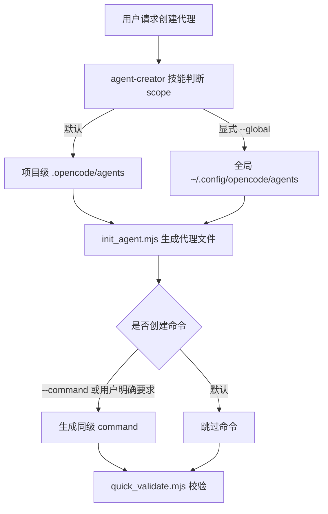

# agent-creator 技能实施计划

## 背景

当前仓库已有 `src/assets/skills/skill-creator/`，用于指导创建技能。用户希望新增一个面向 OpenCode 原生代理的 `agent-creator` 技能，用来创建项目级或全局级代理。该能力应参考 `skill-creator` 的自包含结构，但不能沿用 Claude Skill 打包语义，也不能把本仓库的内置代理注册结构当作普通用户项目的前提。

本计划基于以下输入：

- OpenCode 官方 agents 文档：`https://opencode.ai/docs/zh-cn/agents/`
- OpenCode 官方 commands 文档：`https://opencode.ai/docs/zh-cn/commands/`
- 用户确认的范围：默认项目级，支持显式全局级，脚本使用纯 `.mjs`，只假设用户环境有 Node.js 和 OpenCode，不依赖 `tsx`、`ts-node`、`yaml`、`archiver` 等外部包。
- 仓库现状：`src/assets/agents/` 是 AE 插件内置代理资产目录，`src/services/agent-registration.ts` 负责内置代理注册；这些只属于插件源码维护语境。

## 目标

- 新增 `agent-creator` 技能资产，用于创建 OpenCode 原生代理。
- 注册为正式 AE 技能入口：`ae:agent-creator`，提供 `/ae-agent-creator` 命令，确保用户可发现和可触发。
- 默认创建项目级代理：`.opencode/agents/<name>.md`。
- 仅当用户显式选择全局级时，创建全局代理：`~/.config/opencode/agents/<name>.md`。
- 默认建议代理 `mode: subagent`，除非用户明确需要 `primary` 或 `all`。
- 默认写入显式 `mode`，避免 OpenCode 默认 `all` 带来过宽触发范围。
- 默认不创建同级命令；仅当用户明确要求命令、快捷入口或传入 `--command` 时创建，命令路径与代理 scope 保持一致。
- 脚本只使用 Node.js 内置模块，支持在用户项目中直接运行。
- 保持普通用户代理创建流程与 AE 插件内置代理维护流程清晰分离。

## 非目标

- 不实现 OpenCode 自定义 tool。
- 不修改 `src/services/agent-registration.ts` 的内置代理加载逻辑。
- 不把 `src/assets/agents/` 作为普通用户代理创建路径。
- 不要求用户项目存在本仓库的 `src/`、`dist/`、`.opencode/plugins/` 或 `docs/ae/` 结构。
- 不新增 npm 依赖。
- 不提供 GitHub 远程写操作流程。
- 不在计划阶段实现代码或运行实现验证。

## 关键决策

### 技能形态

- 新增目录：`src/assets/skills/ae-agent-creator/`。
- 技能名使用 `ae:agent-creator`，目录名使用 `ae-agent-creator`。
- 同步更新 `src/schemas/ae-asset-schema.ts`、`src/services/ae-catalog.ts` 和对应测试，使 `/ae-agent-creator` 与 `/ae-help` 可发现该能力。
- 该技能创建的是 OpenCode 用户代理；即使技能本身作为 AE 内置资产注册，脚本也不得默认写入 `src/assets/agents/`。

### 代理路径

- 项目级代理路径：`.opencode/agents/<name>.md`。
- 全局级代理路径：`~/.config/opencode/agents/<name>.md`。
- 默认 scope 为项目级。
- 脚本层使用 `--global` 作为唯一明确的全局级参数。
- 不支持把普通用户代理写入 `src/assets/agents/`；该路径只用于 AE 插件源码维护。

### 代理模板

- 代理文件使用 Markdown frontmatter。
- 必填字段：`description`、`mode`。
- 可选字段：`model`、`temperature`、`top_p`、`tools`、`permission`、`hidden`、`steps`。
- 禁止生成已弃用的 `maxSteps` 字段。
- 默认 `mode: subagent`。
- 仅当 `mode: subagent` 时允许写入 `hidden`。
- 默认正文包含角色、适用场景、工作流、输出要求和边界。

### 命令模板

- 命令创建为可选能力，默认不创建。
- 仅当用户明确要求命令、快捷入口或传入 `--command` 时创建同名命令。
- 项目级命令路径：`.opencode/commands/<name>.md`。
- 全局级命令路径：`~/.config/opencode/commands/<name>.md`。
- 命令 frontmatter 必须使用 OpenCode 原生 `agent: <name>` 绑定目标代理；正文负责传递 `$ARGUMENTS` 和补充任务说明。
- 若 OpenCode 命令规范要求 subagent 命令配置 `subtask`，执行阶段应按官方文档补充该字段，并在验证中覆盖。
- 命令和代理必须同级创建，不允许项目级代理搭配全局命令，或反向搭配。

### 脚本语言

- 使用纯 Node.js ESM：`.mjs`。
- 仅使用 `node:fs/promises`、`node:path`、`node:os`、`node:url` 等内置模块。
- 不使用 Python、TypeScript 运行器或第三方包。
- frontmatter 生成和校验只覆盖本技能需要的简单 key-value、数组和对象片段，不做通用 YAML 解析器。

## 影响范围

### 新增文件

- `src/assets/skills/ae-agent-creator/SKILL.md`
- `src/assets/skills/ae-agent-creator/scripts/init_agent.mjs`
- `src/assets/skills/ae-agent-creator/scripts/quick_validate.mjs`
- `src/assets/skills/ae-agent-creator/references/opencode-agent-conventions.md`
- `src/assets/skills/ae-agent-creator/references/agent-design-patterns.md`
- `src/assets/skills/ae-agent-creator/references/permission-patterns.md`

### 条件性新增或修改文件

- `src/assets/skills/ae-agent-creator/scripts/package_agent.mjs`：默认不新增；只有确认存在压缩分发需求时才另行计划。
- `src/schemas/ae-asset-schema.ts`：新增 `SKILL.AGENT_CREATOR`，并保持技能枚举顺序与常量一致。
- `src/services/ae-catalog.ts`：新增 `/ae-agent-creator` 目录入口，默认不作为 `defaultEntry`。
- `tests/services/ae-catalog.test.ts` 或现有 catalog 测试位置：覆盖新增目录入口。
- `tests/schemas/` 下资产名称 Schema 覆盖位置：覆盖 `ae:agent-creator` 与 `ae-agent-creator`。

## 技术设计

普通用户流程只写入 `.opencode/agents/`、`.opencode/commands/` 或用户主目录下的 OpenCode 配置路径。本仓库内的 `src/assets/agents/` 只作为 AE 插件源码维护参考，不进入默认脚本目标。

## 实现单元

### 1. 注册 `ae:agent-creator` 资产入口

**目标**

让代理创建器成为可发现、可触发的 AE 技能和命令入口。

**文件**

- `src/schemas/ae-asset-schema.ts`
- `src/services/ae-catalog.ts`
- `tests/services/ae-catalog.test.ts` 或现有 catalog 测试位置
- `tests/schemas/` 下资产名称 Schema 覆盖位置

**方法**

- 在 `SKILL` 常量中新增 `AGENT_CREATOR: 'ae:agent-creator'`。
- 确保 `AeSkillNameSchema` 包含 `SKILL.AGENT_CREATOR`，顺序与常量一致。
- 通过 `COMMAND` 派生 `/ae-agent-creator`。
- 在 `PHASE_ONE_ENTRIES` 中新增入口，`skillSlug` 指向 `ae-agent-creator`，`defaultEntry: false`。
- 根据 prompt optimize 变体策略决定是否允许 `-po/-pa`；若无明确排除理由，沿用默认生成变体。

**测试场景**

- `ae:agent-creator` 被资产名称 Schema 接受。
- `ae-agent-creator` 被命令名称 Schema 接受。
- catalog 包含 `ae:agent-creator`，且不覆盖默认入口。
- `/ae-help` 的数据来源能发现该入口。

**验证**

- 运行相关 schema/catalog 测试。
- 运行 `npm run typecheck`。

### 2. 新增 `agent-creator` 主技能说明

**目标**

提供 OpenCode 代理创建工作流入口，让 LLM 能根据用户目标创建合适的代理文件，并在必要时调用脚本初始化和校验。

**文件**

- `src/assets/skills/ae-agent-creator/SKILL.md`

**方法**

- frontmatter 使用 `name: ae:agent-creator` 和中文 `description`。
- 正文说明触发条件：创建新代理、更新代理、设计 subagent/primary agent、创建配套命令。
- 工作流包含：理解用途、选择 scope、选择 mode、初始化文件、编辑代理正文、校验、交付。
- 明确默认项目级，只有用户明确说全局或传入 `--global` 才使用全局路径。
- 明确普通用户代理路径与 AE 内置代理路径的区别。
- 明确命令默认不创建；只有用户明确要求命令、快捷入口或传入 `--command` 时才创建。
- 在需要详细规范时引导读取 `references/opencode-agent-conventions.md`。
- 在需要设计代理行为时引导读取 `references/agent-design-patterns.md`。
- 在涉及工具权限时引导读取 `references/permission-patterns.md`。

**测试场景**

- 正常路径：用户请求“创建代码审查代理”时，流程指向 `.opencode/agents/<name>.md`。
- 全局路径：用户明确“创建全局代理”时，流程指向 `~/.config/opencode/agents/<name>.md`。
- 边界：用户没有指定 `mode` 时默认 `subagent`，并说明可改为 `primary` 或 `all`。
- 错误路径：文档不要求用户修改 `src/assets/agents/` 或本仓库注册服务。

**验证**

- 检索 `src/assets/skills/ae-agent-creator/SKILL.md` 中是否只包含仓库相对路径和官方用户路径。
- 检索是否错误出现 `maxSteps`、`tsx`、`ts-node`、`yaml`、`archiver` 作为运行要求。

### 3. 新增 OpenCode 代理规范参考

**目标**

沉淀 OpenCode agents 官方规范摘要，避免 `SKILL.md` 过长。

**文件**

- `src/assets/skills/ae-agent-creator/references/opencode-agent-conventions.md`

**方法**

- 覆盖项目级和全局级代理路径。
- 覆盖 frontmatter 字段含义：`description`、`mode`、`model`、`temperature`、`top_p`、`tools`、`permission`、`hidden`、`steps`。
- 明确 `maxSteps` 已弃用，不应生成。
- 明确 `hidden` 只适用于 `mode: subagent`。
- 明确 `mode` 的选择规则：`subagent` 用于按需委派，`primary` 用于主会话行为，`all` 用于两者都可用但需谨慎。

**测试场景**

- 正常路径：reference 能指导生成合法代理 frontmatter。
- 边界：reference 不把 `src/assets/agents/` 描述为用户路径。
- 错误路径：reference 不把 OpenCode 默认 `all` 当作推荐默认值。

**验证**

- Markdown 内容检索 `maxSteps` 只能出现在“禁止/弃用”语境中。
- 检索用户路径与源码仓库路径描述是否分流清晰。

### 4. 新增代理设计模式参考

**目标**

提供代理正文和行为边界的设计指导，帮助生成有用而非泛化的代理。

**文件**

- `src/assets/skills/ae-agent-creator/references/agent-design-patterns.md`

**方法**

- 覆盖角色定义、适用场景、不适用场景、输入假设、工作流、输出格式、质量标准。
- 区分 `primary` 与 `subagent` 的提示词差异。
- 给出命名建议：`kebab-case`、语义明确、避免泛化名称。
- 给出正文模板片段，但不生成大量样板代码。
- 强调最小权限和可验证交付。

**测试场景**

- 正常路径：能指导创建专业化 subagent。
- 边界：避免把代理写成“万能助手”。
- 错误路径：避免鼓励代理绕过验证或执行未经授权 Git 操作。

**验证**

- 文档审查确认模式与本仓库 agent 设计边界一致。
- 检索是否包含 Git 远程写操作流程。

### 5. 新增权限模式参考

**目标**

为代理 `tools` 与 `permission` 字段提供安全配置指导。

**文件**

- `src/assets/skills/ae-agent-creator/references/permission-patterns.md`

**方法**

- 说明默认不应放宽权限。
- 给出常见工具权限组合示例：只读研究、代码编辑、测试执行、浏览器验证。
- 对浏览器能力明确要求当前会话先完成 `ae:setup`；setup 失败时停止浏览器流程并记录无法验证，不提供绕过方式。
- 说明敏感操作、Git 写操作、网络写操作应保留用户确认。

**测试场景**

- 正常路径：只读代理使用最小工具集。
- 边界：涉及浏览器操作时提示 setup 前置要求。
- 错误路径：不生成默认允许 destructive Git 操作的权限配置。

**验证**

- 检索是否出现跳过权限确认、跳过 setup 或强推远程分支等风险表述。

### 6. 新增 `init_agent.mjs`

**目标**

提供零外部依赖的代理初始化脚本，创建代理文件和可选同级命令。

**文件**

- `src/assets/skills/ae-agent-creator/scripts/init_agent.mjs`

**方法**

- 支持 CLI：`node scripts/init_agent.mjs <agent-name> [--global] [--description "..."] [--mode subagent|primary|all] [--command] [--project-root <path>]`。
- 名称校验：`^[a-z0-9]+(-[a-z0-9]+)*$`，长度 1-64。
- 默认 `--mode subagent`。
- 默认项目级路径基于 `process.cwd()`；`--project-root` 仅用于测试或用户明确指定项目根，必须用 `path.resolve` 规范化并在写入前输出最终目标路径。
- 对 `--project-root` 指向根目录、空路径、真实用户主目录等高风险目标给出错误或显式警告；不得静默写入非预期位置。
- 全局路径基于 `os.homedir()` 拼接 `.config/opencode/...`。
- 禁止名称包含路径分隔符、`.`、`..`、空格、大写、中文或下划线。
- 目标文件已存在时拒绝覆盖，输出可恢复提示。
- 写入文件必须使用独占创建语义，例如 `fs.writeFile(path, content, { flag: 'wx' })`；拒绝覆盖已存在文件、符号链接或非普通文件。
- 自动创建父目录。
- 输出创建摘要，包含 scope、代理路径、命令路径和后续校验命令。

**测试场景**

- 默认项目级只创建代理。
- `--command` 创建同级命令。
- `--global --command` 创建全局代理和全局命令。
- 非法名称拒绝。
- 目标文件已存在时拒绝覆盖。
- 目标为符号链接或非普通文件时拒绝写入。
- `--mode primary`、`--mode subagent`、`--mode all` 均可生成显式 mode。
- Windows 环境下全局路径通过 `os.homedir()` 解析；验证时不得只设置 `HOME`，必须使用可影响 `os.homedir()` 的隔离方式或重构路径解析以支持测试注入。

**验证**

- 在临时目录运行项目级初始化。
- 使用不会污染真实用户目录的方式验证全局级初始化；Windows 上不得仅依赖 `HOME` 环境变量。
- 使用 `quick_validate.mjs` 校验生成结果。
- 验证 `--command` 生成的命令包含 `agent: <name>` 和 `$ARGUMENTS`。
- 验证非法名称、已存在文件、符号链接目标和高风险 `--project-root` 均失败。

### 7. 新增 `quick_validate.mjs`

**目标**

提供快速校验脚本，检查代理文件和可选命令是否符合本技能约定。

**文件**

- `src/assets/skills/ae-agent-creator/scripts/quick_validate.mjs`

**方法**

- 支持 CLI：`node scripts/quick_validate.mjs <agent-file-or-dir>`。
- 接受单个代理文件，或包含代理文件的目录。
- 校验 frontmatter 存在且包含 `description`、`mode`。
- 校验 `mode` 只能是 `primary`、`subagent` 或 `all`。
- 校验 `hidden` 只在 `subagent` 中使用。
- 校验不包含 `maxSteps`。
- 校验正文非空，并包含基本角色或工作流说明。
- 如存在同名命令，校验命令 frontmatter 包含 `agent: <name>`，正文保留 `$ARGUMENTS`。
- 返回中文摘要，失败时列出可修复问题。

**测试场景**

- 合法 subagent 通过。
- 缺少 `description` 失败。
- 缺少 `mode` 失败。
- `hidden` 搭配 `primary` 失败。
- 出现 `maxSteps` 失败。
- 空正文失败。
- 命令缺少 `agent: <name>` 失败。
- 命令缺少 `$ARGUMENTS` 失败。

**验证**

- 对 `init_agent.mjs` 生成的样例运行校验。
- 对缺少 `description`、缺少 `mode`、`hidden` 搭配 `primary`、出现 `maxSteps`、空正文、命令缺少 `agent`、命令缺少 `$ARGUMENTS` 的错误样例分别运行校验。

## 验证策略

以下命令仅用于本仓库实施阶段验证，不能写入用户侧 `SKILL.md` 作为普通项目必须具备的源码路径。执行阶段完成后，至少运行：

- `npm run typecheck`
- `npm run test`
- `node src/assets/skills/ae-agent-creator/scripts/init_agent.mjs test-agent --project-root <临时目录>`
- `node src/assets/skills/ae-agent-creator/scripts/init_agent.mjs test-command-agent --command --project-root <临时目录>`
- `node src/assets/skills/ae-agent-creator/scripts/quick_validate.mjs <临时目录>/.opencode/agents/test-agent.md`
- 校验生成的 `<临时目录>/.opencode/commands/test-command-agent.md` 包含 `agent: test-command-agent` 和 `$ARGUMENTS`。
- 使用不会污染真实用户目录的方式验证 `--global`；Windows 上不得仅设置 `HOME` 作为隔离依据。

如果新增正式 AE 注册入口，还需补充或更新相关测试：

- `tests/services/ae-catalog.test.ts` 或现有 catalog 覆盖位置。
- `tests/schemas/` 下资产名称 Schema 覆盖位置。

## 风险与缓解

- 风险：把 AE 插件内置代理路径误导为普通用户代理路径。缓解：`SKILL.md` 与 references 中明确分流，脚本默认只写 OpenCode 用户路径。
- 风险：默认 `mode` 过宽导致代理被主会话意外使用。缓解：默认 `subagent` 并显式写入。
- 风险：脚本解析 YAML 过度复杂或不完整。缓解：只生成和校验本技能需要的受限 frontmatter，不做通用 YAML 解析。
- 风险：全局路径测试污染用户真实配置。缓解：执行验证时使用不会污染真实用户目录的隔离方案；Windows 上不得仅依赖 `HOME`。
- 风险：命令与代理 scope 不一致。缓解：脚本统一由同一 scope 推导两个目标路径，不提供单独命令 scope 参数。
- 风险：`--project-root` 写入非预期位置。缓解：规范化路径、输出最终写入目标，并拒绝或警告根目录、主目录等高风险目标。
- 风险：检查后写入存在竞态或符号链接风险。缓解：使用独占创建语义，拒绝已存在文件、符号链接和非普通文件。

## 已决策事项

- 注册为正式 `ae:agent-creator` 技能和 `/ae-agent-creator` 命令入口。
- 默认不创建用户代理的同名命令；仅当用户明确要求或传入 `--command` 时创建。
- 不新增 `package_agent.mjs`，除非用户提出压缩分发需求并重新计划。
