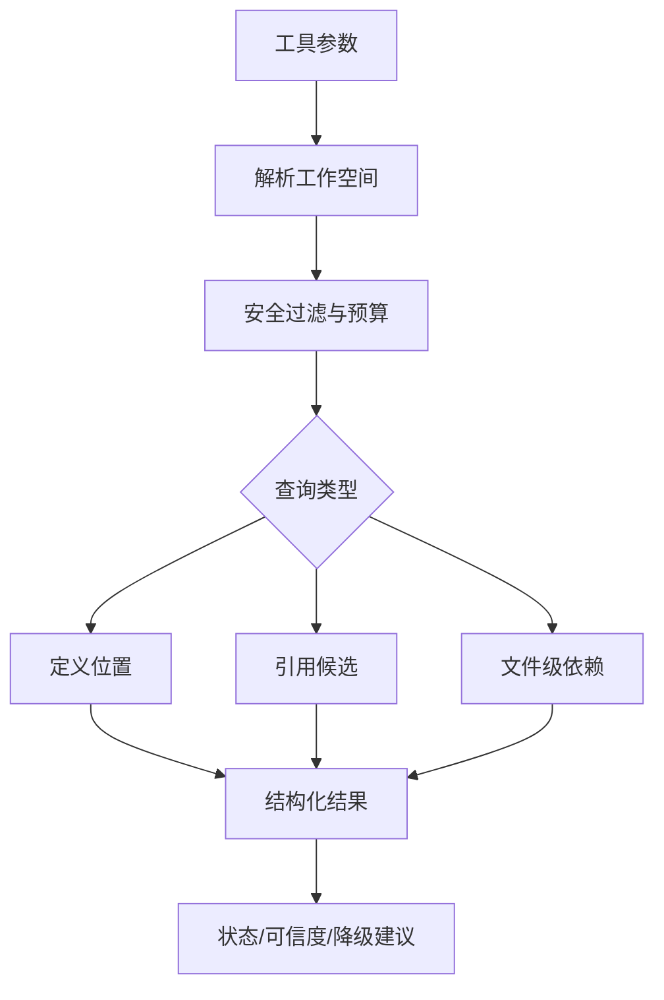

# 代码上下文访问能力实现计划

## 来源与目标

本计划基于 `docs/ae/brainstorms/2026-05-09-code-context-access-requirements.md`。目标是实现首版本地 TypeScript/Node 工作空间的代码上下文访问能力，让 AI 能按需查询定义位置、引用候选和文件级依赖，并在不可用、过期、部分失败或更新中时明确降级。

首版不建设长期后台服务、独立 daemon、HTTP 服务、SQLite、文件监听或全语言 AST 平台。实现应优先采用短生命周期、按需、只读的工具箱形态，复用现有文件搜索、TypeScript 能力和仓库安全边界。

## 范围

### 包含

- 本地工作空间内 `.ts`、`.tsx`、`.js`、`.jsx` 文件的结构化上下文查询。
- 常见非敏感配置文件的文件级依赖识别，例如 `package.json`、`tsconfig*.json`、`vite.config.*`、`vitest.config.*`、`eslint.config.*`。
- 定义位置、引用候选、直接依赖和被依赖候选。
- 查询状态、新鲜度、可信度、覆盖范围、失败原因、建议动作和降级路径。
- 默认安全排除、路径越界拦截、文件大小和扫描数量预算。
- 若后续实现加入缓存或持久化，则必须包含清理入口、异常状态识别和更新中旧结果处理。

### 不包含

- 远程代码库索引。
- 长期后台进程或自动重型预处理。
- 跨语言符号关系、深层调用链和全局影响范围的确定性结论。
- 对所有引用和依赖关系的完整正确性保证。
- 服务化或协议化接口的首版实现。

## 技术策略

首版采用一个公开工具加少量服务函数的方式实现：工具接收查询类型和明确目标，服务层在已校验工作空间内按需收集候选文件、应用安全过滤、执行轻量语言服务或文本级候选匹配，并返回结构化结果。

### 关键决策

- 使用按需查询而非后台索引，满足 R3、R6、R10 和首版范围边界。
- 输出使用仓库相对路径和位置范围，避免绝对路径泄露。
- 对无法证明完整性的结果标记为 `candidate` 或 `needs_review`，不输出伪确定结论。
- 状态模型先服务用户决策，不暴露底层实现细节。
- 只在确有性能需要时加入内存级短生命周期缓存；不在首版默认写入持久数据。
- 首版工具调用必须绑定当前会话、当前用户可访问的工作空间和预算上限；宽范围或超预算查询直接返回缩小范围建议，不静默批量枚举项目结构。
- 工具层必须从 opencode 上下文取得并校验 `workspaceRoot`，服务层只接收显式 `workspaceRoot`、`scope`、`budget` 等纯输入；缺少可信工作空间时返回 `unavailable`，不使用 `process.cwd()` 静默兜底。
- 精确定义/引用查询的目标使用 `{ file, line, column }`；仅符号名查询使用 `{ symbolName }`，只能返回文本或导出候选。
- 若后续引入服务化或协议化接口，必须先补充本地调用方鉴权、当前用户边界、工作空间绑定和跨 Origin 拒绝策略，不得仅依赖本机监听。
- 会话级上下文记忆不得绕过敏感文件排除、秘密值脱敏和缓存清理边界；若记录查询发现，只能记录相对路径、位置和摘要化证据，不保存源码片段、原始行文本、字符串字面量或秘密值。
- 内存缓存若被实现，必须按 workspace realpath、会话、配置指纹和查询参数隔离，使用短 TTL；工作空间切换、会话结束或清理动作必须清空，禁止跨用户、跨工作空间或跨会话复用。

## 影响面

- 插件用户获得新的代码上下文查询工具，失败时仍可使用普通搜索和文件读取。
- 工具注册、资产常量和帮助输出可能需要同步更新。
- 测试需要覆盖工具参数、服务层安全过滤、状态输出、降级路径和 TypeScript/JavaScript 样例工作空间。

## 状态与结果契约

### 查询状态

- `available`: 查询完成，结果可用。
- `partial`: 部分文件、语言或关系失败，结果仍可作为候选使用。
- `unavailable`: 查询无法执行，必须给出原因和降级路径。
- `stale`: 使用的上下文数据可能过期，仅在存在缓存或旧结果时出现。
- `updating`: 仅在后续实现存在准备、刷新或重建过程时出现。

### 通用输出字段

- `status`: 当前状态。
- `query`: 查询类型和目标摘要。
- `results`: 结构化结果列表；不可用时必须为 `[]`。
- `confidence`: `high`、`medium`、`low`。
- `freshness`: `current`、`stale`、`unknown`。
- `generatedAt`: 生成时间。
- `coverage`: 支持范围、排除范围和预算截断说明。
- `warnings`: 非阻断警告。
- `recoveryActions`: 可执行建议，例如刷新、重建、清理后重建、缩小范围、降级到普通搜索。
- `fallback`: 明确说明可继续使用普通搜索和文件读取。
- `reason`: 仅在 `partial`、`unavailable`、`stale` 或 `updating` 时必填。

所有状态都必须返回上述通用字段；不可用状态使用 `results: []`、`confidence: low`、`freshness: unknown`，避免调用方为失败路径维护另一套契约。

### 查询目标输入模型

- 精确位置目标: `{ file, line, column }`，用于 TypeScript LanguageService 定义和引用查询。
- 符号名目标: `{ symbolName }`，用于文本级或导出声明候选查询；结果默认 `confidence: low` 或 `medium`。
- 文件目标: `{ file }`，用于文件级依赖和被依赖候选查询。
- 所有 `file` 输入都必须先转换为 workspace 内 realpath，再通过同一安全过滤；失败时返回 `unavailable` 或排除说明。

## 实现单元

### 1. 资产常量与工具注册

- [ ] 目标: 增加代码上下文查询工具的公开入口。
- [ ] 需求: 覆盖 R1、R3、R13。
- [ ] 依赖: 无。
- [ ] 文件:
  - `src/schemas/ae-asset-schema.ts`
  - `src/schemas/code-context-schema.ts`
  - `src/tools/index.ts`
  - `src/tools/ae-code-context.tool.ts`
- [ ] 方法:
  - 在 `TOOL` 常量中新增工具名，保持资产名称常量化。
  - 新建 `src/schemas/code-context-schema.ts`，集中定义查询类型、目标输入、状态、可信度、新鲜度、结果项和降级结构。
  - 新建工具文件，使用 Zod schema 描述 `queryType`、精确位置/符号名/文件目标、`scope`、`maxResults` 等最小参数。
  - 工具层负责 `ctx.metadata()`、参数校验、从 `ctx` 提取并校验 workspace root、调用服务、捕获错误并返回中文可恢复结果。
  - 工具骨架可以先返回“查询尚未实现”的结构化 `unavailable`，后续查询单元逐步接入。
- [ ] 需遵循的模式:
  - 参考 `src/tools/ae-swagger-parser.tool.ts` 的工具结构。
  - 参考 `src/tools/ae-task-analyzer.tool.ts` 的工作空间解析方式。
- [ ] 测试场景:
  - 正常: 定义查询返回结构化结果。
  - 边界: 缺少目标、空 scope、超大 maxResults。
  - 错误: 非支持查询类型返回中文提示。
  - 集成: 工具注册表包含新工具。
- [ ] 验证:
  - `npx vitest run tests/tools/ae-code-context.tool.test.ts`
  - `npm run typecheck`

### 2. 工作空间解析与安全过滤

- [ ] 目标: 构建安全、只读、预算受限的文件候选集合。
- [ ] 需求: 覆盖 R3、R8、R11、R12、R13。
- [ ] 依赖: 实现单元 1。
- [ ] 文件:
  - `src/services/code-context-security.ts`
  - `src/utils/path-utils.ts`
  - `tests/services/code-context-security.test.ts`
- [ ] 方法:
  - 接收工具层传入的已校验 `workspaceRoot`，不直接依赖 opencode ToolContext 或 `process.cwd()`。
  - 使用 `realpath` 和 `isInsideRoot()` 阻止路径越界与符号链接逃逸。
  - 默认排除 `.git/`、`node_modules/`、`dist/`、`build/`、`.opencode/`、`docs/ae/` 运行产物、`runs/`、`tmp/`、`.env`、`.env.*`、私钥、证书、云凭证和 SSH 配置。
  - 对文件大小、扫描文件数量和返回结果数量设置预算；超出预算返回 `partial` 和缩小范围建议。
  - 路径或文件名命中敏感模式时完全跳过读取；普通源码文件可在大小预算内做内存级秘密扫描，命中后丢弃内容并仅返回“已排除/疑似敏感”的摘要状态。
  - 候选收集和预算裁剪必须发生在 TypeScript LanguageService 初始化前；超出硬上限时直接返回 `partial` 或 `unavailable` 和普通搜索降级路径。
- [ ] 需遵循的模式:
  - 路径安全参考 `src/services/swagger-source-loader.ts`。
  - 相对路径输出参考 `src/utils/path-utils.ts`。
  - 敏感输出脱敏参考 `src/services/swagger-redaction-service.ts`。
- [ ] 测试场景:
  - 正常: 支持扩展名文件被纳入候选。
  - 边界: 大文件、超多文件、符号链接、Windows 路径分隔符。
  - 错误: 路径越界、权限不足、敏感文件命中。
  - 集成: 预算截断后仍返回降级建议。
- [ ] 验证:
  - `npx vitest run tests/services/code-context-security.test.ts`
  - `npm run typecheck`

### 3. 定义位置查询

- [ ] 目标: 为函数、类、变量或导出符号返回定义位置候选。
- [ ] 需求: 覆盖 R1、R2、R3、R13。
- [ ] 依赖: 实现单元 2。
- [ ] 文件:
  - `src/services/code-context-language-service.ts`
  - `tests/services/code-context-service.test.ts`
- [ ] 方法:
  - 对 `{ file, line, column }` 精确位置目标，首选 TypeScript LanguageService 在支持文件内查询定义。
  - 对 `{ symbolName }` 目标，不调用位置型 LanguageService API，仅执行受限文本/导出模式候选匹配。
  - 当语言服务不可用或目标不是明确符号位置时，降级为受限文本/导出模式候选匹配。
  - 返回 `path`、`startLine`、`startColumn`、`endLine`、`endColumn`、`symbolName`、`kind`、`confidence`、`evidence`。
  - `evidence` 只能包含摘要化证据，例如“导出声明候选”“语言服务定义位置”“import 关系候选”；禁止包含原始行文本、源码片段、字符串字面量、环境变量值或错误堆栈。
  - 对文本匹配结果使用候选语义，要求 AI 复核。
- [ ] 需遵循的模式:
  - 不把候选结果包装为确定事实。
  - 不返回源码片段，除非后续明确评估安全边界并加入脱敏。
- [ ] 测试场景:
  - 正常: TypeScript 函数定义、类定义、默认导出。
  - 边界: 重名符号、未导出符号、JS 文件、目标为空。
  - 错误: 语言服务创建失败时降级。
  - 集成: 定义结果路径均为仓库相对路径。
- [ ] 验证:
  - `npx vitest run tests/services/code-context-service.test.ts`
  - `npm run typecheck`

### 4. 引用候选查询

- [ ] 目标: 返回某符号或文件的引用候选，帮助 AI 缩小阅读范围。
- [ ] 需求: 覆盖 R1、R2、R3、R13、R14。
- [ ] 依赖: 实现单元 2、3。
- [ ] 文件:
  - `src/services/code-context-language-service.ts`
  - `tests/services/code-context-service.test.ts`
- [ ] 方法:
  - 对 `{ file, line, column }` 精确位置目标优先使用 TypeScript LanguageService 的引用能力。
  - 对仅给出符号名的查询使用受限文本候选匹配，并降低可信度。
  - 对超预算结果按文件聚合并截断，保留 `truncated` 和继续缩小范围建议。
  - 文本候选结果包含 `matchKind`、`matchedPattern` 和是否位于 import、调用、属性访问、注释或字符串的分类证据；默认排除注释和字符串命中，除非查询显式请求文本搜索。
  - 返回引用位置、引用类型候选、可信度和复核提示。
- [ ] 需遵循的模式:
  - 输出“引用候选”而非“全部引用”。
  - 单个文件失败不得导致整体不可用。
- [ ] 测试场景:
  - 正常: 同文件引用、跨文件 import 引用。
  - 边界: 字符串同名、注释同名、大小写差异、结果过多。
  - 错误: 部分文件读取失败。
  - 集成: 截断结果含 `recoveryActions`。
- [ ] 验证:
  - `npx vitest run tests/services/code-context-service.test.ts`
  - `npm run typecheck`

### 5. 文件级依赖与被依赖候选

- [ ] 目标: 返回指定文件的直接依赖和被依赖候选。
- [ ] 需求: 覆盖 R1、R2、R3、R13、成功标准中的依赖样例。
- [ ] 依赖: 实现单元 2。
- [ ] 文件:
  - `src/services/code-context-dependency-service.ts`
  - `tests/services/code-context-dependency-service.test.ts`
- [ ] 方法:
  - 首版解析静态 `import` 和 CommonJS `require()` 的本地相对依赖；动态 import、复杂别名和循环关系作为低置信候选或未覆盖项说明。
  - 使用 Node 风格扩展名补全解析本地文件；`tsconfig paths/baseUrl` 首版仅支持简单、根内、无通配逃逸的情况，否则返回 `candidate/unsupported` warning。
  - `package.json`、`tsconfig*.json` 等配置文件仅返回文件级关系，不读取敏感配置值。
  - 被依赖候选通过受限扫描 import/require 路径反查，结果标记为候选。
  - 任何由 import、require、dynamic import、tsconfig extends/references/paths 或 package exports 解析出的路径，都必须再次 realpath，并通过同一安全过滤、敏感排除和预算检查；失败时标记目标被排除而不是读取。
- [ ] 需遵循的模式:
  - 常见配置文件范围必须是白名单，不得把 `.env*` 或凭证类配置纳入。
  - 不尝试首版深层调用链或全局影响结论。
- [ ] 测试场景:
  - 正常: 相对 import、路径补全、index 文件解析。
  - 边界: type-only import、动态 import 未覆盖说明、简单别名路径、循环依赖候选说明。
  - 错误: 依赖目标不存在、目标文件被排除。
  - 集成: 被依赖候选结果含可信度和覆盖范围。
- [ ] 验证:
  - `npx vitest run tests/services/code-context-dependency-service.test.ts`
  - `npm run typecheck`

### 6. 首版状态与失败返回契约

- [ ] 目标: 即使首版无持久索引，也为不可用、部分失败和按需中断定义一致处置。
- [ ] 需求: 覆盖 R3、R4、R5、R6、R7、R8、R9、R10。
- [ ] 依赖: 实现单元 2、3、4、5。
- [ ] 文件:
  - `src/services/code-context-status-service.ts`
  - `tests/services/code-context-status-service.test.ts`
- [ ] 方法:
  - 首版按需模式下，状态查询返回能力可用性、支持范围、安全排除、预算上限和当前无持久缓存说明。
  - 查询失败时返回完整通用输出字段，`results: []`，并设置 `reason`、`recoveryActions` 和 `fallback`，不得只抛异常。
  - 首版不实现持久缓存损坏、版本迁移或更新中旧结果读取逻辑；这些只作为 schema 状态和后续不可违反约束保留。
  - 跨重启、闪退或新会话后，首版没有自动继续的重型任务；若后续引入重型准备/刷新，继续前必须重新取得用户确认。
- [ ] 需遵循的模式:
  - 降级是正常结果路径，不视作未捕获异常。
  - 状态文案面向 AI 和用户决策，不泄露绝对路径或秘密值。
- [ ] 测试场景:
  - 正常: 状态查询返回支持范围和无缓存说明。
  - 边界: 上下文数据缺失、权限受限、预算超限和工作空间缺失。
  - 错误: 查询中断或内部错误返回可恢复中文结果。
  - 集成: 所有失败路径都返回通用输出字段和普通搜索降级路径。
- [ ] 验证:
  - `npx vitest run tests/services/code-context-status-service.test.ts`
  - `npm run typecheck`

### 7. 服务编排接入

- [ ] 目标: 将安全过滤、查询模块和状态契约接入一个稳定服务入口。
- [ ] 需求: 覆盖 R1、R2、R3、R4、R5、R8、R11、R13。
- [ ] 依赖: 实现单元 1 至 6。
- [ ] 文件:
  - `src/services/code-context-service.ts`
  - `tests/services/code-context-service.test.ts`
- [ ] 方法:
  - `code-context-service.ts` 仅作为编排层，接收工具层提供的 `workspaceRoot`、查询目标、scope 和预算。
  - 先调用安全过滤和预算裁剪，再按 `queryType` 分派到定义、引用或依赖模块。
  - 对所有模块结果套用统一状态和输出契约。
  - 首版用户控制通过工具参数 `scope`、`maxResults` 和内置硬上限体现；不扩展 `ae.jsonc` schema。
  - 清理动作首版返回“当前无持久上下文数据需要清理”；只有后续引入持久化时才新增真实清理实现。
- [ ] 需遵循的模式:
  - 编排层不直接读取全局配置资产，不依赖当前源码仓库布局。
  - 内置预算上限不可被工具参数突破；非法或超大参数降级为安全上限并写入 `coverage.warnings`。
- [ ] 测试场景:
  - 正常: 三类查询通过编排层返回统一结构。
  - 边界: 超大 `maxResults` 被限制到内置上限。
  - 错误: 缺少可信 workspace root 返回 `unavailable`。
  - 集成: 清理无持久数据时返回可理解结果。
- [ ] 验证:
  - `npx vitest run tests/services/code-context-service.test.ts`
  - `npm run typecheck`

### 8. 文档、帮助与交付验证

- [ ] 目标: 让工具能力、限制和降级语义对 AI 可发现。
- [ ] 需求: 覆盖 R2、R3、R5、R13、R14、R15。
- [ ] 依赖: 实现单元 1 至 7。
- [ ] 文件:
  - `src/tools/ae-code-context.tool.ts`
  - `src/services/ae-catalog.ts`（仅当帮助目录需要显式更新）
  - `tests/tools/ae-help.tool.test.ts`（仅当帮助输出受影响）
- [ ] 方法:
  - 工具描述第一行不超过 50 字，明确适用场景、不适用场景和降级语义。
  - 示例避免暗示结果绝对完整。
  - 若帮助目录列出工具，保持资产名称和描述同步。
- [ ] 需遵循的模式:
  - 面向插件用户的文案不得硬编码本仓库源码路径作为下游项目前提。
  - 错误提示使用中文、可恢复、可执行。
- [ ] 测试场景:
  - 正常: 工具描述和 schema 可被注册。
  - 边界: 帮助输出不把候选能力描述为确定索引能力。
  - 错误: 无。
  - 集成: 全量工具测试仍通过。
- [ ] 验证:
  - `npm run typecheck`
  - `npm run build`
  - `npm run test`

## 安全与隐私要求

- 所有输出路径必须是仓库相对路径。
- 默认不读取或返回 `.env*`、私钥、证书、云凭证、SSH 配置和疑似密钥内容。
- 默认排除依赖目录、构建产物、Git 元数据、插件运行产物和临时目录。
- 错误信息不得暴露绝对路径、秘密值或未脱敏环境信息。
- 持久化不是首版默认能力；若后续加入，只能保存相对路径、位置、状态和摘要化元数据，不保存源码片段或秘密值。
- 服务化或协议化接口不是首版范围；若后续加入，必须默认关闭，启用需用户确认，使用会话级不可猜测 token 或等价机制，绑定当前用户、workspace realpath、会话和允许的 query scope，校验 Origin/Host，限制速率和请求体，审计只记录相对路径、动作、状态和脱敏错误码。

## 降级与异常处理

- 能力不可用: 返回 `unavailable`、原因、普通搜索/读取替代路径。
- 部分文件失败: 返回 `partial`、成功结果、失败摘要和缩小范围建议。
- 结果过多: 截断并返回 `partial`、预算说明和更精确查询建议。
- 语言服务失败: 降级到文本候选匹配，并降低可信度。
- 上下文数据缺失或损坏: 返回刷新、重建、清理后重建、缩小范围或普通搜索中的适用建议。
- 更新中: 返回 `updating`，提供普通搜索降级；如有上一版结果，允许使用旧结果并标记 `stale`；等待只能是有限等待。
- 异常中断: 不使用未完成结果；下次查询要么按需重新计算，要么提示重新准备上下文。
- 后续缓存快照: 若引入缓存或更新中旧结果，每次查询结果必须绑定 `snapshotId`、schema version 和生成批次；更新应在临时区构建后原子替换，查询只能读取单一一致快照。
- 后续持久写入: 若引入持久缓存，必须使用临时目录、manifest、校验和/schema version、提交标记和锁超时处理；缺任一项时判为损坏，只提供清理、重建或普通搜索。

## 测试策略

- 单元测试覆盖安全过滤、路径归一化、秘密文件排除、状态模型、依赖解析和查询结果格式。
- 集成测试使用临时 TypeScript/JavaScript 样例工作空间，覆盖定义、引用候选和文件级依赖三类首版验收样例。
- 错误路径测试覆盖权限失败、语言服务失败、超预算、敏感文件、路径越界和上下文数据不可用；更新中状态仅作为后续缓存/刷新形态的 schema 契约保留。
- 契约测试验证所有结果使用仓库相对路径，且不包含绝对路径和秘密值。
- 契约测试验证 `evidence`、`warnings`、`reason`、`recoveryActions` 等所有字符串字段不包含秘密值、原始源码片段或绝对路径。
- 交付前至少运行相关 Vitest 文件、`npm run typecheck` 和 `npm run build`；若改动触及注册或帮助输出，运行 `npm run test`。

## 推迟到实现时的细节

- TypeScript LanguageService 的具体宿主实现和文件版本策略。
- 是否需要内存级短生命周期缓存；如需要，必须遵守 workspace、会话、配置指纹和查询参数隔离。
- 工具参数命名的最终细节，应以实现时最小可用 schema 为准。
- `ae.jsonc` 配置扩展、持久缓存、更新中旧结果读取和真实清理入口均推迟到出现明确需求后再规划。

## 风险与缓解

- 风险: 语言服务初始化成本高。缓解: 限制 scope、预算截断、文本候选降级。
- 风险: 超大 tsconfig 或 monorepo 在语言服务初始化前耗尽资源。缓解: 初始化前完成候选收集和预算裁剪，并设置文件数、总字节数、耗时和并发硬上限。
- 风险: 引用候选误报。缓解: 输出可信度和复核提示，不声明完整性。
- 风险: 安全过滤遗漏敏感文件。缓解: 默认排除加秘密模式检测，测试覆盖典型凭证文件。
- 风险: 未来缓存引入生命周期复杂度。缓解: 首版默认不持久化；后续缓存必须先实现状态和清理契约。
- 风险: 工具输出过大。缓解: maxResults、按文件聚合、截断说明和缩小范围建议。

## 交付顺序

1. 完成资产常量、共享 schema 与工具注册骨架。
2. 完成工作空间解析、安全过滤和预算控制。
3. 完成定义位置查询。
4. 完成引用候选查询。
5. 完成文件级依赖与被依赖候选。
6. 完成首版状态、不可用和中断恢复语义。
7. 完成服务编排接入。
8. 完成文档、帮助输出和全量验证。

## 完成标准

- 三类首版查询均能在本地 TypeScript/Node 样例工作空间返回结构化候选结果。
- 结果包含仓库相对路径、可复核位置、可信度、新鲜度和覆盖说明。
- 能力不可用、部分失败、超预算和上下文数据不可用都有可执行降级路径；若后续引入更新中状态，也必须提供可执行降级路径。
- 默认安全排除敏感文件和秘密值，测试证明输出不泄露绝对路径或凭证内容。
- 无长期后台服务、自动重型预处理或默认持久化数据。
- 相关测试和类型检查通过。
