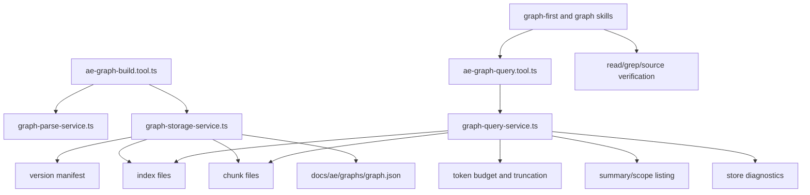

# 图谱维护与使用增强计划

## AI 解析契约
- canonicalKind: plan
- humanEquivalent: true
- stableIdsRequired: true
- implementationUnitsRequired: true
- noImplicitScope: true

## 来源与目标
来源需求文档：`docs/ae/brainstorms/2026-05-12-graph-maintenance-usage-requirements.md`。

目标是在不引入外部数据库、不默认执行高成本语义生成的前提下，提升图谱作为 AI 项目结构入口的可用性。首期 MVP 优先解决已验证痛点：存储格式不可读时缺少恢复诊断、查询默认可能加载完整图谱、scope 不匹配不可解释、输出 token 缺少统一控制、后续技能缺少明确降级矩阵，并提供低成本结构摘要、top-N 和推荐阅读清单。增强层再加入模块层、角色标签和预设查询。深度层保留为可选能力，不在 MVP 中实现完整 AST、符号级调用链或默认 LLM 摘要。

行为保持要求：现有 `ae:graph-build` 和 `ae:graph-query` 的基础入口继续可用；现有 shallow 解析能力继续工作；图谱仍是派生产物，不替代真实源码、Git diff、测试、类型检查或构建。

## 范围

### 包含
- 存储诊断、manifest 校验、损坏分片恢复提示和 schema 不兼容提示。
- scope 可解释查询、可用 scope 列表和 scope 不匹配建议。
- 查询 token 上限、截断字段和继续查询建议。
- 面向小查询的索引/分片按需读取设计和实现路线。
- 构建结果的 scope、version、分片、exclude 和模式原因摘要。
- 图谱优先规则和图谱技能说明的降级条件矩阵。
- MVP 摘要层、top-N、推荐阅读清单、最小上下文包和增强阶段规划。
- 针对存储、查询、构建、规则和技能文档的测试更新。

### 不包含
- 不生成可视化 UI。
- 不一次性实现完整语言 AST、符号级调用链或跨语言语义调用图。
- 不默认调用外部 LLM 为所有文件生成自然语言摘要。
- 不迁移到 SQLite、外部索引库或独立数据库服务。
- 不把图谱结果作为安全、迁移、外部契约或生产可靠性判断的唯一证据。

### 约束
- 面向插件用户的运行时能力只依赖当前工作区、`docs/ae/graphs/` 产物和可选用户配置。
- 公开技能、工具和规则不得把本仓库源码结构写成下游项目通用前提。
- 所有路径检查继续限制在当前 worktree 内，不跟随越界符号链接，不纳入敏感文件。
- 构建写入 `docs/ae/graphs/**` 仍需工具权限确认。
- JSON 分片保持本地文件系统可读、可版本化、可删除重建。

## 需求追溯
| 需求 ID | 计划响应 |
|---------|----------|
| R1 | U9, U10 |
| R2 | U7, U10, U11 |
| R3 | U7, U9, U10 |
| R4 | U1, U3, U7, U10, U11 |
| R5 | U5, U9, U10 |
| R6 | U10 |
| R7 | U1, U6, U11 |
| R8 | U1, U2, U3, U5, U12 |
| R9 | U4, U8, U12 |
| R10 | U2, U3, U4, U5, U8, U12 |
| R11 | U5, U12 |
| R12 | U1, U3, U5, U12 |
| R13 | U7, U8, U10, U11 |
| R14 | U5, U6, U9, U12 |
| R15 | U1 |
| NFR1 | U1, U6, U11 |
| NFR2 | U1, U2, U4, U5, U12 |
| NFR3 | U3, U7, U8, U10, U11 |
| NFR4 | U1, U2, U3, U12 |

## 高层技术设计
现有实现中 `src/services/graph-storage-service.ts` 是存储和分片真源，`src/tools/ae-graph-build.tool.ts` 负责编排构建，`src/tools/ae-graph-query.tool.ts` 负责编排查询。计划保持工具层轻量，但拆出 `src/services/graph-query-service.ts` 或等价查询服务承载查询规划、索引读取、scope 诊断、token 预算、截断和结果塑形，避免继续把查询算法堆到存储服务。存储服务只负责 graph store、manifest、chunk、index 的读写和一致性诊断。

### 关键决策
- D1. MVP 先实现诊断恢复、scope 可解释、token 上限、按需索引和降级矩阵，再实现低成本摘要/top-N/推荐阅读清单 → 理由: 前置能力直接解决当前“图谱不可读”和“大仓库查询效率”风险，也是 MVP 摘要层的基础。
- D2. 保留 JSON 主文件、version 目录和 active version 设计，不引入数据库 → 理由: 当前图谱是本地派生产物，JSON 分片和原子写已匹配运行时独立性和维护成本约束。
- D3. 新增索引文件而不是让所有查询读取完整 active graph → 理由: 现有 `getActiveVersion()` 会加载完整 files/relations，无法满足小查询读取少量分片的要求。
- D4. MVP 只提供可追溯统计、top-N 和阅读建议，不生成角色标签或不可验证职责摘要 → 理由: 角色标签属于增强层，低置信启发式不能伪装成语义事实。
- D5. `depth` 首期保持 `shallow`，新增可选 `layers` 或查询模式表达摘要/模块层 → 理由: 避免破坏现有工具参数，同时为后续 semantic/deep 档保留扩展点。
- D6. 查询服务从存储服务拆出 → 理由: 存储服务保持文件格式和一致性边界，查询服务负责成本控制和业务查询语义，便于测试按需读取与 token 截断。

## 专项设计

### 数据模型
MVP 存储格式在当前 `schemaVersion: 2` 基础上可选择小版本字段或升到新 schema。若升 schema，必须让查询对旧 schema 返回可恢复诊断，构建在授权后可重建派生产物。

新增或扩展的存储概念：
- Store metadata: schema、nextVersionId、versions、可用 scope 列表。
- Version manifest: versionId、schema、scopeRoot、createdAt、gitRef、excludeRules、fileCount、relationCount、chunkIds、indexIds、checksum 或计数校验信息。
- Chunk record: id、fileCount、relationCount、files、relations、可选 checksum。
- Index records: path 到 chunk、sourcePath 到 relation chunk、targetPath 到 relation chunk、directory 到 file chunk、relationType 到 relation chunk、scope summary。
- Query diagnostics: status、problemPath、problemChunkId、recoverBy、availableScopes、nearestScope、canUsePartialData。

MVP 存储契约草案：
- `graph.json` 必需字段：`schemaVersion`、`activeVersionId` 或按 scope 的 active 映射、`versions`、`updatedAt`。
- manifest 必需字段：`schemaVersion`、`indexVersion`、`versionId`、`scopeRoot`、`createdAt`、`fileCount`、`relationCount`、`chunks`、`indexes`、`summary`。
- chunk 命名：`versions/<versionId>/chunks/<kind>-<number>.json`，`kind` 至少包含 `files` 和 `relations`；索引命名为 `versions/<versionId>/indexes/<indexName>.json`。
- `scopeKey` 由规范化 worktree 相对 scope 路径生成；根 scope 使用固定 key，子 scope 不覆盖根 scope active version。
- 校验规则：manifest 计数必须与已声明 chunk 聚合一致；索引只能引用 manifest 声明的 chunk；chunk 缺失或 JSON 损坏时查询不得返回未标注的部分结果。
- v2 兼容矩阵：旧 v2 可完整读取时允许返回基础查询；缺少 manifest/index 时返回 `index_missing` 或 `rebuild_recommended`，而不是报“格式不受支持”；不支持 schema 才返回 `unsupported_schema`。

MVP 索引契约草案：
- `scope-summary.json`：scopeRoot、fileCount、relationCount、directoryCounts、fileTypeCounts、relationTypeCounts、topInDegree、topOutDegree、isolatedCount。
- `path-to-file-chunk.json`：文件路径到 file chunk id。
- `source-to-relation-chunks.json`：sourcePath 到 relation chunk id 列表。
- `target-to-relation-chunks.json`：targetPath 到 relation chunk id 列表。
- `directory-to-file-chunks.json`：directory 到 file chunk id 列表。
- `relation-type-to-chunks.json`：relationType 到 relation chunk id 列表。
- 索引生命周期：每次 `activateVersion` 基于最终 files/relations 原子重建 manifest 和 indexes；增量构建不得复用旧索引局部片段后直接激活。

scope 诊断算法草案：
- 先根据请求 target/directory/file 规范化出 `requestedScope` 和 worktree 相对路径。
- 若无 active scope，返回 `missing_active` 并列出可重建目标。
- 若 requested scope 无 active version，计算可用 scope 与请求路径的最长公共前缀，返回 `availableScopes`、`nearestScope` 和 `rebuildTargetSuggestion`。
- 若 scope 命中但文件未命中，按 exclude 规则、path 索引、目录索引和真实文件存在性区分 `excluded`、`not_indexed`、`outside_scope`、`no_relations`。
- 只有确认文件已索引且关系索引为空时，才允许表达“无直接依赖或上下游关系”。

### 性能设计
- `stats`、`core`、scope 列表和构建摘要优先读取 manifest/index，不加载完整 graph。
- `deps(file)` 通过 source/target 索引定位相关 relation chunk，默认读取不超过 3 个分片；超过时返回原因和截断信息。
- `impact(file)` 使用反向边索引进行分层展开，受 `limit` 和分片读取预算限制。
- `filter(directory)` 使用 directory/path 索引定位文件分片，再按需读取关系分片。
- `health` 和 `pattern` 属于高成本查询，必须有硬上限、截断说明，必要时提示用户收窄 scope 或目录。
- `limit`、`top` 需要服务端 clamp；默认结构化输出不超过 80 条结果项。

### 部署与回滚
- 图谱是派生产物，格式演进失败时回滚代码后可删除或重建 `docs/ae/graphs/**`。
- 构建写入仍走授权；不在查询路径自动删除或覆盖图谱。
- 新 schema 发布后，查询旧 schema 必须提示重建或迁移，不应抛出不可解释错误。

## 影响面
- `src/services/graph-storage-service.ts`：schema、manifest、索引、诊断、chunk 读取和分片校验。
- `src/services/graph-query-service.ts`（新增或等价服务）：查询规划、scope 诊断、索引读取、token 控制、截断和结果塑形。
- `src/tools/ae-graph-build.tool.ts`：构建返回摘要、增量原因、schema 恢复提示、写入索引。
- `src/tools/ae-graph-query.tool.ts`：查询模式输出、scope 诊断、token 控制、按需读取路径。
- `src/services/graph-parse-service.ts`：关系 metadata、角色标签和后续摘要所需的可追溯结构信息。
- `src/assets/rules/graph-first.md`：图谱使用优先级和降级条件矩阵。
- `src/assets/skills/ae-graph-build/SKILL.md`：构建输出、depth/layers 边界和排除规则表述。
- `src/assets/skills/ae-graph-query/SKILL.md`：查询模式、预设意图、截断和诊断说明。
- `tests/services/graph-storage-service.test.ts`：存储、manifest、索引和损坏恢复测试。
- `tests/services/graph-query-service.test.ts`：查询规划、按需读取预算、scope 诊断和截断测试。
- `tests/tools/ae-graph-build.tool.test.ts`：构建结果、scope、增量、安全降级测试。
- `tests/tools/ae-graph-query.tool.test.ts`：查询诊断、按需分片、token 控制和预设查询测试。
- `tests/services/graph-parse-service.test.ts`：metadata、标签和敏感文件边界测试。

## 实现单元

### U1. 阶段门禁与公开 API 边界确认
- [ ] 目标: 在实施开始前固定 MVP、增强层、深度层边界，避免后续单元把 deep 能力提前混入 MVP。
- [ ] 覆盖需求: R4, R7, R15, NFR1, NFR2, NFR3, NFR4
- [ ] 依赖: 无
- [ ] 文件:
  - `docs/ae/plans/2026-05-12-001-deep-graph-maintenance-usage-plan.md`
  - `src/tools/ae-graph-build.tool.ts`
  - `src/tools/ae-graph-query.tool.ts`
  - `src/assets/skills/ae-graph-build/SKILL.md`
  - `src/assets/skills/ae-graph-query/SKILL.md`
- [ ] 方法:
  - MVP 只包含诊断、scope 解释、索引、token 控制、降级矩阵、低成本摘要/top-N/推荐阅读清单。
  - 增强层包含模块层、角色标签、预设查询；深度层只记录 semantic/deep、LLM 摘要缓存、语言服务增强和复杂测试覆盖关系。
  - 保持 `depth=shallow` 默认语义；如新增 `layers` 或查询 mode，必须不触发高成本语义生成。
- [ ] 测试场景: 默认工具参数兼容旧调用；公开文案不承诺 MVP 外能力。
- [ ] 验证: 文档审查 `ae:review domain:document mode:headless docs/ae/plans/2026-05-12-001-deep-graph-maintenance-usage-plan.md`。
- [ ] 回滚信号: 单元之间无法判断某能力属于 MVP、增强层还是深度层。

### U2. 存储诊断与 manifest 校验
- [ ] 目标: 区分不存在、JSON 损坏、schema 不支持、active 缺失、manifest 缺失、chunk 缺失、chunk 格式错误和计数不一致，并返回可恢复诊断。
- [ ] 覆盖需求: R8, R10, NFR2, NFR4
- [ ] 依赖: U1
- [ ] 文件:
  - `src/services/graph-storage-service.ts`
  - `tests/services/graph-storage-service.test.ts`
- [ ] 方法:
  - 增加诊断结果类型：`missing_store`、`invalid_json`、`unsupported_schema`、`missing_active`、`missing_manifest`、`missing_chunk`、`invalid_chunk`、`count_mismatch`、`index_missing`。
  - 将 manifest 读取、chunk 校验和 v2 兼容判断集中到存储服务，避免 `loadActiveGraphChunks()` 静默跳过缺失或坏分片。
  - 查询路径只读，不自动删除或覆盖损坏图谱；写模式遇到旧格式时在授权后重建并说明恢复原因。
- [ ] 测试场景: 完整 active version 可用；graph store 不存在；active/manifest/chunk 缺失；JSON 损坏；schema 不支持；chunk 计数不一致。
- [ ] 验证: `npx vitest run tests/services/graph-storage-service.test.ts`。
- [ ] 回滚信号: 现有正常图谱无法读取，或写模式无法创建新 active version。

### U3. scope 可解释查询与未命中分类
- [ ] 目标: 查询 scope 不匹配或文件未命中时提供可用 scope、推导来源、nearest scope、重建建议和未命中分类。
- [ ] 覆盖需求: R4, R8, R10, R12, NFR3, NFR4
- [ ] 依赖: U2
- [ ] 文件:
  - `src/services/graph-query-service.ts`
  - `src/services/graph-storage-service.ts`
  - `src/tools/ae-graph-query.tool.ts`
  - `tests/services/graph-query-service.test.ts`
  - `tests/tools/ae-graph-query.tool.test.ts`
- [ ] 方法:
  - 在查询服务实现 scope 诊断算法，返回 `requestedScope`、`derivedFrom`、`availableScopes`、`nearestScope`、`rebuildTargetSuggestion`。
  - 文件未命中时区分 `wrong_scope`、`excluded`、`not_indexed`、`outside_scope`、`no_relations`。
  - 只有确认文件已被索引且关系索引为空，才表达“无直接依赖或上下游关系”。
- [ ] 测试场景: 根 scope 和子 scope 并存；显式 scope 覆盖默认推导；scope 不匹配；文件被 exclude；文件存在但未索引。
- [ ] 验证: `npx vitest run tests/services/graph-query-service.test.ts tests/tools/ae-graph-query.tool.test.ts`。
- [ ] 回滚信号: 空结果被误写成无依赖，或路径越界保护失效。

### U4. 索引存储契约与生命周期
- [ ] 目标: 定义并生成 MVP 索引文件，确保按需读取有稳定、可校验的数据来源。
- [ ] 覆盖需求: R9, R10, NFR2
- [ ] 依赖: U2
- [ ] 文件:
  - `src/services/graph-storage-service.ts`
  - `tests/services/graph-storage-service.test.ts`
- [ ] 方法:
  - 写入 `scope-summary`、`path-to-file-chunk`、`source-to-relation-chunks`、`target-to-relation-chunks`、`directory-to-file-chunks`、`relation-type-to-chunks`。
  - `activateVersion` 基于最终 files/relations 原子重建 manifest 和 indexes；增量构建不得复用旧索引片段后直接激活。
  - 校验索引只能引用 manifest 声明的 chunk。
- [ ] 测试场景: 索引计数与 chunk 一致；索引引用缺失 chunk 报诊断；增量后索引不残留旧边。
- [ ] 验证: `npx vitest run tests/services/graph-storage-service.test.ts`。
- [ ] 回滚信号: 索引与 chunk 不一致，或 active version 激活后查询读到旧索引。

### U5. 查询服务、按需读取与 token 控制
- [ ] 目标: 避免小查询加载完整图谱，统一限制输出体积，并为大结果提供截断和继续查询建议。
- [ ] 覆盖需求: R5, R8, R10, R11, R12, R14, NFR2
- [ ] 依赖: U3, U4
- [ ] 文件:
  - `src/services/graph-query-service.ts`
  - `src/tools/ae-graph-query.tool.ts`
  - `tests/services/graph-query-service.test.ts`
  - `tests/tools/ae-graph-query.tool.test.ts`
- [ ] 方法:
  - 查询服务使用索引选择必要 chunk，`stats`、`core`、scope 列表优先读取 summary/index。
  - `deps(file)` 和 `impact(file)` 默认读取不超过 3 个相关分片；超过预算时返回原因、`chunksRead`、`indexesUsed` 和 `nextQuery`。
  - 对 `limit` 和 `top` 做服务端 clamp；默认结构化输出不超过 80 个结果项，并包含 `truncated`、`returnedCount`、`limitApplied`。
- [ ] 测试场景: `stats` 不读取完整 relations；单文件 deps/impact 只读相关分片或解释超预算；极大 limit/top 被 clamp；大图谱输出受限。
- [ ] 验证: `npx vitest run tests/services/graph-query-service.test.ts tests/tools/ae-graph-query.tool.test.ts`。
- [ ] 回滚信号: 查询结果缺边缺点且未标注截断，或分片读取计数无法解释。

### U6. 图谱优先规则和技能降级矩阵
- [ ] 目标: 让后续技能知道何时优先查询图谱、何时必须重建或读取真实文件，避免过期或低置信图谱误导任务。
- [ ] 覆盖需求: R7, R14, NFR1
- [ ] 依赖: U3, U5
- [ ] 文件:
  - `src/assets/rules/graph-first.md`
  - `src/assets/skills/ae-graph-build/SKILL.md`
  - `src/assets/skills/ae-graph-query/SKILL.md`
  - `tests/schemas/asset-schema.test.ts` 或现有资产结构测试文件（若已有）
- [ ] 方法:
  - 增加降级矩阵：图谱不存在、schema 不支持、scope 不匹配、存储损坏、图谱过期、Git diff 未覆盖、低置信关系、安全/迁移/外部契约任务。
  - 更新 graph build/query 技能说明，明确诊断字段、截断字段、scope 建议和图谱不能替代源码/验证。
  - 修正构建技能中“默认排除常见构建产物目录”的表述，使其符合实现：存在时可询问保存排除规则，而非无条件默认跳过。
- [ ] 测试场景: 资产结构有效；文案不泄漏本仓库源码维护前提；帮助/技能说明反映新增诊断和截断语义。
- [ ] 验证: `npm run typecheck`；如有资产测试则运行对应 Vitest。
- [ ] 回滚信号: 用户侧公开文案与工具真实行为不一致。

### U7. 关系证据 metadata 贯通
- [ ] 目标: 关系结果明确来源、行号、置信度、asset metadata 和事实/推断边界。
- [ ] 覆盖需求: R2, R4, R13, NFR3
- [ ] 依赖: U3
- [ ] 文件:
  - `src/services/graph-parse-service.ts`
  - `src/services/graph-query-service.ts`
  - `tests/services/graph-parse-service.test.ts`
  - `tests/services/graph-query-service.test.ts`
- [ ] 方法:
  - 统一暴露 relation metadata 中的 `line`、`raw`、`confidence`、`assetType` 等已有证据字段。
  - 配置引用、测试覆盖关系和推断关系必须带来源类型，不能与 import/require 等事实关系混淆。
  - R3 的结果数量约束落实为：默认返回不超过 10 条直接依赖或上下游关系。
- [ ] 测试场景: import/Markdown/AE asset 关系保留证据；低置信推断不覆盖事实关系；deps/impact 默认关系数受限。
- [ ] 验证: `npx vitest run tests/services/graph-parse-service.test.ts tests/services/graph-query-service.test.ts`。
- [ ] 回滚信号: 查询输出无法说明关系来源，或把推断关系当事实。

### U8. 构建结果解释、增量边界和 scope 隔离
- [ ] 目标: 构建结果解释 full/incremental 原因、scope、active version、分片摘要和排除规则，并确保增量在高风险场景显式全量重建。
- [ ] 覆盖需求: R9, R10, R13, NFR2
- [ ] 依赖: U2, U4
- [ ] 文件:
  - `src/tools/ae-graph-build.tool.ts`
  - `src/services/graph-storage-service.ts`
  - `tests/tools/ae-graph-build.tool.test.ts`
  - `tests/services/graph-storage-service.test.ts`
- [ ] 方法:
  - 扩展构建返回字段：`scopeRoot`、`versionId`、`chunkSummary`、`excludeRules`、`modeReason`、`recoveredFromUnsupportedSchema`。
  - Git diff 无变更时返回当前 active summary，而不仅是“无需更新”。
  - 对新增、删除、重命名、未跟踪文件继续保守 full，并在 `modeReason` 中解释。
  - 确认不同 scope 的 active version、manifest、chunk 目录和索引不会互相覆盖。
- [ ] 测试场景: full 构建返回摘要；Git diff 无变更；非 Git 降级 full；子 scope 与根 scope 并存；授权拒绝不残留 lock/tmp。
- [ ] 验证: `npx vitest run tests/tools/ae-graph-build.tool.test.ts tests/services/graph-storage-service.test.ts`。
- [ ] 回滚信号: 增量后出现旧边残留，或 scope 之间 active version 串扰。

### U9. MVP 摘要层与最小上下文包
- [ ] 目标: 在不做自然语言职责摘要的前提下，提供低 token 的项目结构摘要、top-N、孤立区域和推荐阅读清单。
- [ ] 覆盖需求: R1, R3, R5, R14
- [ ] 依赖: U5, U7
- [ ] 文件:
  - `src/services/graph-query-service.ts`
  - `src/tools/ae-graph-query.tool.ts`
  - `tests/services/graph-query-service.test.ts`
  - `tests/tools/ae-graph-query.tool.test.ts`
- [ ] 方法:
  - 新增或扩展查询模式返回目录概览、主要关系类型、核心文件、孤立文件、建议优先阅读清单。
  - 文件、目录、关键词、变更范围四类输入分别返回最小上下文包。
  - 默认摘要不超过 20 个概览条目；推荐阅读文件不超过 10 个；相关文档不超过 5 个。
  - 摘要字段必须标注来源：统计事实、结构启发式或用户查询参数。
- [ ] 测试场景: 根 scope 返回摘要和阅读清单；小项目/空关系项目/文档项目可用；关键词无匹配；结果包含 `truncated`/`nextQuery`。
- [ ] 验证: `npx vitest run tests/services/graph-query-service.test.ts tests/tools/ae-graph-query.tool.test.ts`。
- [ ] 回滚信号: 摘要输出过大，或把启发式结论写成事实。

### U10. 增强层：模块层、角色标签和预设查询
- [ ] 目标: 提供更高价值的结构理解能力，包括模块聚合、角色标签、预设任务意图和可追溯的重要性评分。
- [ ] 覆盖需求: R1, R2, R3, R4, R5, R6, R13, NFR3
- [ ] 依赖: U9
- [ ] 文件:
  - `src/services/graph-parse-service.ts`
  - `src/services/graph-query-service.ts`
  - `src/tools/ae-graph-query.tool.ts`
  - `tests/services/graph-parse-service.test.ts`
  - `tests/services/graph-query-service.test.ts`
  - `tests/tools/ae-graph-query.tool.test.ts`
- [ ] 方法:
  - 根据路径、扩展名、文件名、入边/出边、邻近 README 或配置文件提取结构角色标签：entry、test、config、document、tool、asset、core、isolated。
  - 增加模块层聚合：目录节点统计文件数、关系数、入边/出边、核心文件和跨模块关系。
  - 预设查询意图映射到底层模式：接手项目、修改前影响评估、找入口、找测试、找配置、找文档、审查风险区、理解某目录。
  - 重要性评分仅基于可解释指标，不声称业务重要性。
- [ ] 测试场景: 常见文件得到角色标签；无 README/无入边降级；低置信标签不覆盖事实；预设查询受 token 控制。
- [ ] 验证: `npx vitest run tests/services/graph-parse-service.test.ts tests/services/graph-query-service.test.ts tests/tools/ae-graph-query.tool.test.ts`。
- [ ] 回滚信号: 标签误导后续任务，或预设查询绕过路径/scope 安全检查。

### U11. depth/layers 扩展边界与公开资产同步
- [ ] 目标: 明确 shallow、summary、module、semantic、deep 等能力边界，并同步工具描述、技能说明和帮助信息。
- [ ] 覆盖需求: R2, R4, R7, R13, NFR1, NFR3
- [ ] 依赖: U6, U10
- [ ] 文件:
  - `src/tools/ae-graph-build.tool.ts`
  - `src/tools/ae-graph-query.tool.ts`
  - `src/assets/skills/ae-graph-build/SKILL.md`
  - `src/assets/skills/ae-graph-query/SKILL.md`
  - `src/services/ae-catalog.ts`
  - `src/schemas/ae-asset-schema.ts`（仅当新增资产名或枚举需要时）
  - `tests/tools/ae-graph-build.tool.test.ts`
  - `tests/tools/ae-graph-query.tool.test.ts`
- [ ] 方法:
  - 保持 `depth=shallow` 向后兼容；摘要/模块层优先使用查询 mode 或 `layers`，避免把 `depth` 扩成高成本语义生成开关。
  - 公开描述中清楚标注 semantic/deep 是后续或可选高成本能力，默认不调用外部 LLM。
  - 帮助信息与技能说明保持一致，列出诊断、截断、scope 和降级行为。
- [ ] 测试场景: 默认 shallow 构建行为不变；未传新参数兼容旧行为；不支持 layer/depth 返回中文可恢复提示。
- [ ] 验证: `npm run typecheck`；`npx vitest run tests/tools/ae-graph-build.tool.test.ts tests/tools/ae-graph-query.tool.test.ts`。
- [ ] 回滚信号: 旧调用方式失败，或默认构建开始执行高成本语义生成。

### U12. 回归测试与大图谱夹具
- [ ] 目标: 用自动化测试覆盖构建、查询、诊断、按需读取、token 控制、scope 和安全边界，防止后续重构破坏图谱可靠性。
- [ ] 覆盖需求: R8, R9, R10, R11, R12, R14, NFR2, NFR4
- [ ] 依赖: U2, U3, U4, U5, U8, U9
- [ ] 文件:
  - `tests/services/graph-storage-service.test.ts`
  - `tests/services/graph-query-service.test.ts`
  - `tests/tools/ae-graph-build.tool.test.ts`
  - `tests/tools/ae-graph-query.tool.test.ts`
  - `tests/services/graph-parse-service.test.ts`
- [ ] 方法:
  - 扩展现有临时仓库测试模式，生成多 chunk 图谱夹具。
  - 对分片读取计数使用测试可观察字段或存储服务 instrumentation，而不是依赖内部实现细节。
  - 增加损坏 manifest、缺失 chunk、chunk 格式错误、scope 不匹配、极大 limit/top 的测试。
  - 增加 `docs/ae/graphs/**` 不被递归纳入图谱、敏感文件不被纳入、拒绝授权不残留 lock/tmp 的测试。
- [ ] 测试场景: 全量构建、增量构建、查询摘要、查询依赖、scope 列表、大图谱多 chunk、空图谱、非 Git 项目、越界路径、授权拒绝。
- [ ] 验证: `npx vitest run tests/services/graph-storage-service.test.ts tests/services/graph-query-service.test.ts tests/tools/ae-graph-build.tool.test.ts tests/tools/ae-graph-query.tool.test.ts tests/services/graph-parse-service.test.ts`；`npm run typecheck`。
- [ ] 回滚信号: 测试夹具过慢或依赖真实仓库状态，导致单测不稳定。

## 风险与应对
| 风险 | 影响 | 应对措施 |
|------|------|----------|
| schema 演进破坏旧图谱读取 | 用户查询失败或误判图谱损坏 | 查询旧 schema 返回重建/迁移建议；构建只在授权后重建派生产物 |
| 按需索引实现复杂度过高 | MVP 延误或引入不一致 | 先实现 manifest/summary 和 path/source/target 基础索引，再扩展目录和关系类型索引 |
| 分片损坏被部分读取 | AI 基于缺边缺点做错误判断 | 读取前校验 manifest 和 chunk，损坏时停止返回部分图谱 |
| token 控制截断隐藏关键关系 | 影响范围分析不完整 | 返回 `truncated`、`nextQuery`、`totalAvailable` 或等价说明，要求继续查询 |
| 角色标签和重要性评分误导 | 低置信启发式被当事实 | 标签必须标注来源和置信度；自然语言职责摘要缺失时返回空值 |
| 公开文案泄漏本仓库维护前提 | 违反运行时独立性 | 审查 `src/assets/**` 文案，只描述通用工作区和图谱产物 |

## 待定问题

### 推迟到执行
- Q1. [影响 U4] MVP 采用 `versions/<versionId>/indexes/<indexName>.json` 多索引文件契约；执行时只允许调整单个索引文件内部字段，不重新改为单个总 `index.json`，除非先更新本计划。
- Q2. [影响 U9] 关键词输入的最小上下文包先匹配路径/文件名/metadata，是否扩展到内容摘要需等增强层消费者明确后决定。
- Q3. [影响 U11] 如果新增 `layers` 参数导致工具参数过多，执行时可改为新增查询 mode，但必须保持旧参数兼容。

## 等价性检查
- implementationUnitsCount: 12
- tracedRequirementsCount: 19
- decisionsCount: 6
- risksCount: 6
