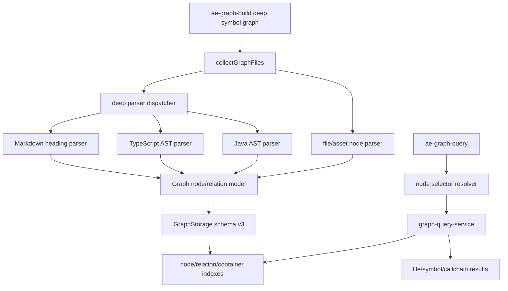

# 深度图谱符号与调用链计划

## AI 解析契约
- canonicalKind: plan
- humanEquivalent: true
- stableIdsRequired: true
- implementationUnitsRequired: true
- noImplicitScope: true

## 来源与目标
来源需求文档：`docs/ae/brainstorms/2026-05-12-graph-maintenance-usage-requirements.md`。用户追加目标：图谱需要支持“大节点/小节点”层级；Markdown 文件大节点下包含多级标题小节点；Java 代码大节点以类为核心，小节点包含类内部方法和属性；关系必须能表达“大节点 A 的小节点 x 引用了大节点 B 的小节点 y”，也能查询两个大节点之间的聚合关系；同时需要 AST 深层解析，提供函数、类、方法等调用链。

这不是纯重构：它包含用户可见能力扩展。用户已明确“不需要兼容原始代码，可以按最终需求为目标彻底重构”。本计划以最终 deep/symbol 图谱能力为目标，允许替换旧 shallow 文件关系模型、旧 schema、旧索引和旧查询契约；只保留通用工作区安全边界、派生产物可删除重建、诊断可恢复和可验证交付要求。

行为变更要求：`ae:graph-build` 和 `ae:graph-query` 可以改为以 deep/symbol 图谱为唯一主模型；旧 `depth=shallow`、v2 图谱和旧文件级输出结构可被删除或改为明确错误提示。图谱仍写入当前工作区 `docs/ae/graphs/`，仍是可删除重建的派生产物；图谱结果不得替代真实源码阅读、Git diff、测试、类型检查或构建。

与来源需求关系：来源需求中的项目结构摘要、最小上下文包、预设高层查询、多 scope 管理和图谱优先使用体验仍是本计划的承接目标；本计划用 deep/symbol 模型替换底层 shallow 实现，但不得删除这些用户可见入口。若某项来源需求不能在 deep/symbol 首期完整实现，必须在查询结果中以降级或后续增强说明表达，而不是静默省略。

阶段化交付边界：用户追加目标允许破坏旧 shallow/v2 契约并迁移到 deep/symbol 最终模型，但不等于把所有深度能力一次性作为首个可用结果交付。执行顺序必须先交付可恢复诊断、高层查询、最小上下文包和 scope 诊断的 MVP，再增强 v3 大/小节点模型、Markdown/TS/JS/Java 结构节点，最后按 U0 结果启用 TS/JS 调用链和 Java 条件调用链。任何阶段都不得把尚未实现的符号层能力伪装成成功结果；缺失能力必须通过 `downgraded`、`nextActions` 和能力矩阵表达。

## 范围

### 包含
- 解析器选型和打包可行性的前置决策门，先证明首期语言解析路线可运行，再执行破坏式迁移。
- 图谱数据模型从单一文件节点扩展为大节点和小节点的层级模型。
- Markdown 标题小节点提取和标题层级 `contains` 关系。
- TypeScript/JavaScript AST 解析，提取类、接口、函数、方法、属性和可解析调用关系。
- Java AST 深层解析方案和实现路径，首期硬承诺提取类、内部类、方法和字段；调用关系在解析器 spike 通过后作为条件性交付，否则降级为结构节点和 unresolved 候选。
- 符号级关系类型、证据 metadata、置信度和降级语义。
- schema、manifest、chunk、index 和诊断的彻底重构。
- 查询工具支持符号寻址、符号依赖、调用链和大节点聚合关系。
- 图谱预览页对大节点优先展示、小节点按需展开的边界决策。
- 项目结构摘要、最小上下文包、预设高层查询和多 scope 诊断在 deep/symbol 模型上的适配。
- 相关测试、技能文案和工具描述更新。

### 不包含
- 不默认对所有语言一次性实现完整 AST；首期硬承诺 Markdown、TypeScript/JavaScript 和 Java 结构节点，TS/JS 调用链为首期硬承诺，Java 调用链为解析器 spike 通过后的条件性交付；其他语言显式降级为不支持或仅文件占位节点。
- 不引入外部数据库、后台服务或要求目标项目运行语言服务器。
- 不默认调用外部 LLM 生成符号摘要。
- 不把不完整或低置信调用关系伪装成精确事实。
- 不在首个实现单元中重做图谱 UI；预览页只做不阻塞数据能力的最小兼容。

### 约束
- 面向插件用户的运行时能力只依赖当前工作区、`docs/ae/graphs/` 产物、插件打包依赖和可选用户配置。
- 新增解析依赖必须跨平台可安装，优先纯 JS；若存在 native 或大体积依赖风险，必须作为单独决策记录并提供降级。
- 所有路径检查继续限制在当前 worktree 内，不跟随越界符号链接，不纳入敏感文件。
- 构建写入 `docs/ae/graphs/**` 仍需工具权限确认。
- deep 解析必须有性能预算和降级 warning，不能让单个语法错误文件阻断整次构建。

## 需求追溯
| 需求 ID | 计划响应 |
|---------|----------|
| R1 项目结构摘要 | U7, U13 |
| R2 文件/目录提示信息 | U1, U7, U13 |
| R3 最小上下文包 | U7, U13 |
| R4 关系类型、来源和置信度 | U1, U3, U5, U6, U7 |
| R5 分层结果与按需展开 | U7, U9, U10, U13 |
| R6 预设高层查询模式 | U7, U13 |
| R7 图谱优先使用与降级条件 | U7, U8, U12, U13 |
| R8 存储不可用、过期或分片缺失诊断 | U1, U7, U8, U10, U13 |
| R9 增量更新与高风险全量降级 | U11, U14 |
| R10 多 scope 管理与诊断 | U1, U7, U13 |
| R11 按需分片读取与查询预算 | U7, U10 |
| R12 manifest、索引和异常诊断 | U1, U10, U13 |
| R13 详细度档位 | U8, U12 |
| R14 输出 token 体积控制 | U7, U10, U13 |
| R15 阶段化路线图 | U0-U14 分阶段执行 |
| A1 用户大节点/小节点层级 | U1, U2, U3, U5, U7 |
| A2 Markdown 多级标题小节点 | U3, U12 |
| A3 Java 类、方法、属性结构节点 | U0, U5, U12, U14 |
| A4 小节点间引用关系 | U1, U2, U4, U5, U6, U7 |
| A5 两个大节点之间关系查询 | U7, U8 |
| A6 AST 深层解析 | U0, U2, U4, U5, U6, U12 |
| A7a TS/JS 函数、类、方法调用链（首期硬承诺） | U4, U6, U7, U14 |
| A7b Java 方法调用链（U0 通过后的条件承诺） | U0, U6, U12, U14 |
| A8 允许破坏旧 shallow/v2 契约并迁移到 deep/symbol 主模型 | U0, U1, U2, U8, U12 |
| NFR1 运行时独立性 | U0, U2, U8, U9 |
| NFR2 路径与敏感文件安全 | U2, U6, U12 |
| NFR3 事实、推断和置信度区分 | U1, U3, U5, U7 |
| NFR4 schema 破坏式迁移和可恢复诊断 | U1, U6, U8, U12 |

## 高层技术设计
当前 `src/services/graph-storage-service.ts` 的节点模型只有文件粒度，`GraphRelation.sourcePath/targetPath` 也是文件路径或资产虚拟路径。新设计直接引入统一图节点和图边作为唯一主模型：大节点和小节点都由稳定 `nodeId` 寻址；文件、Markdown 文件、所有语言的 `class`/`interface`/`enum` 节点和 Java 内部类是默认大节点，Markdown 标题默认是文件大节点下的小节点，只有查询聚合时可临时作为聚合视图，不作为持久大节点类型。符号级查询使用 `path#selector` 或显式 `node` 参数解析到 `nodeId`。旧 `sourcePath/targetPath` 只在迁移期需要时作为输出派生字段保留，不再作为内部主键。

### 关键决策
- D1. 以 deep/symbol 图谱作为唯一目标模型，允许移除旧 shallow 解析和 v2 schema；但必须先通过 U0 解析器决策门 → 理由: 用户明确不需要兼容原始代码，保留双模型会增加复杂度并削弱最终调用链能力；先验证解析器可交付性可避免默认构建迁移到不可运行状态。
- D2. 采用统一节点模型而不是单独维护 `files` 与 `symbols` 两套孤立图 → 理由: 调用链、包含关系和文件聚合关系需要跨粒度遍历；统一模型能让查询算法复用。
- D3. 文件路径只作为文件节点的可读 selector，内部关系统一使用 `nodeId` → 理由: 大节点和小节点需要统一寻址，继续以路径字符串作为关系主键会阻碍跨粒度查询。
- D4. Markdown 标题小节点通过轻量行解析实现，不依赖 Markdown AST 库 → 理由: 标题结构需求明确，行解析足够可靠且低成本。
- D5. TypeScript/JavaScript 首期固定为运行时可打包解析方案：优先 TypeScript compiler API 并将 `typescript` 调整为 runtime dependency；若 spike 发现包体积或打包失败，则改用 U0 记录的轻量 parser → 理由: 运行时静态引用 devDependency 会破坏插件分发，必须在实施前收敛。
- D6. Java 首期硬承诺结构节点；Java 调用链是 U0 解析器 spike 通过后的条件性交付，否则只输出结构节点、同文件候选和明确降级 warning → 理由: Java 解析器选型直接影响跨平台安装、包体积和精度，不能让核心验收依赖未验证解析器。
- D7. deep 图谱 schema 破坏式升级到 v3，v2 图谱只返回可恢复重建诊断；迁移文案必须逐项列出破坏点和重建命令建议 → 理由: 小节点、容器索引和调用链索引需要显式 schema 契约，继续读取 v2 会让查询语义分叉。
- D8. 调用关系 metadata 必须记录解析来源、行号、置信度和是否跨文件解析成功 → 理由: 图谱结果必须区分 AST 事实、解析候选和 unresolved 外部引用。
- D9. 内部 `nodeId` 禁止包含行号；行号只作为 selector 消歧 metadata 和展示字段 → 理由: 行号会随编辑抖动，不能满足 `stableIdsRequired`，也会破坏增量调用边稳定性。
- D10. `unresolved` 和 `candidateTargets` 不是默认可遍历关系，只能作为 observation/diagnostic 存储；只有唯一解析的关系才能进入默认 relation index → 理由: 调用链和大节点聚合必须避免把候选边当成事实。
- D11. deep-only 迁移分为 `legacy-active`、`deep-ready`、`deep-only` 三态；U0 未通过时不得公开承诺 deep-only → 理由: 避免工具参数、文案和运行能力出现中间态矛盾。

### 迁移状态机契约
| 状态 | 进入条件 | build 行为 | query 行为 | 公开文案 | 禁止事项 |
|------|----------|------------|------------|----------|----------|
| `legacy-active` | U0 未完成或任一首期硬承诺 parser/smoke 未通过 | 保持旧行为或显式实验 deep；不得默认 deep-only | v2/shallow 仍按当前能力处理；deep 不可用必须返回降级 | 不得宣称 deep/symbol 是唯一主模型 | 禁止删除旧 shallow 主流程；禁止让 `shallow` 变成默认阻断 |
| `deep-ready` | U0 决策产物记录 TS/JS parser、Java structure parser、许可证、bundle、bridge+dist smoke 均通过 | 可构建 v3 deep/symbol；默认切换需受工具发布门禁控制 | v3 查询可用；v2 返回可恢复诊断 | 可说明 deep/symbol 即将成为主模型，并列出迁移路径 | 禁止清理 v2 产物；禁止把 Java 调用链写成硬承诺 |
| `deep-only` | U1-U8 的 v3 storage、查询、scope 诊断、迁移提示、U11 增量删除一致性或 full rebuild 降级门禁通过 | 默认 v3；`shallow` 返回迁移提示；U11 未完成时 incremental 强制降级 full rebuild | v2 active 返回 `legacy_blocked`；支持 nearestV3/重建建议 | 公开文案说明 deep/symbol 是唯一主模型 | 查询路径禁止写入、删除或修复图谱 |

状态来源必须是可机器检查的决策产物和代码常量组合：U0 写入 `docs/ae/decisions/graph-parser-spike.md` 或等价 JSON fixture，包含 `tsJsParser`、`javaStructureParser`、`javaCallchainParser`、`licenseStatus`、`bundleStatus`、`bridgeDistSmokeStatus`、`finalState`。工具测试必须断言：`finalState` 不是 `deep-ready` 或 `deep-only` 时，不得默认 deep-only；U0 失败时回退 `legacy-active`。

### v3 存储与诊断最小契约
`graph.json` 顶层和 active manifest 至少包含：`schemaVersion: 3`、`graphKind: 'symbol-callchain'`、`selectorVersion`、`scopeRoot`、`createdAt`、`activeVersion`、`availableVersions`、`nodeCount`、`relationCount`、`observationCount`、`symbolCount`、`symbolRelationCount`、`chunkLayout`、`indexes`、`warningsSummary`、`capabilities`、`excludeRules`。`capabilities` 至少区分 `fileGraph`、`markdownHeadings`、`tsJsSymbols`、`tsJsCallchain`、`javaStructure`、`javaCallchain`。

`recoverBy` 枚举至少包含：`rebuild_deep_graph`、`activate_nearest_v3`、`rebuild_missing_manifest`、`rebuild_missing_chunk`、`rebuild_missing_index`、`narrow_scope`、`fix_selector`、`rerun_full_build`、`read_source_file`。诊断必须包含 `activeVersion`、`detectedSchema`、`expectedSchema`、`graphKind`、`blockedQuery`、`recoverBy`、`availableVersions`、`nearestV3`、`scopeRoot`、`availableScopes`、`nearestScope`、`queryCost` 和 `truncation`，缺失时返回可恢复错误而非空结果。

### 大节点与小节点不变量
`GraphNode` 必须显式包含 `nodeRole: aggregate | member`、`aggregateRootId`、`parentId`、`containerId`。文件节点、Markdown 文件节点、类、接口、枚举和 Java 内部类默认 `nodeRole=aggregate`；Markdown heading、方法、字段、属性默认 `nodeRole=member`。顶层函数默认聚合到文件大节点，除非后续明确提升为 aggregate。`aggregateRootId` 指向默认聚合根；`parentId` 指直接 `contains` 父节点；`containerId` 指语义容器。聚合查询只能使用 `nodeRole=aggregate` 节点作为大节点边界，避免各模块隐式判断。

### 查询遍历与状态矩阵
| 查询语义 | 默认关系 | 默认排除 | 置信度门槛 |
|----------|----------|----------|------------|
| `deps` | `import`, `require`, `include`, `link`, `ae_ref`, `references`, `type_ref`, `extends`, `implements` | `contains`, `defines`, observation | resolved 或显式允许 heuristic |
| `impact` | `deps` 的反向集合 | observation、candidate、unresolved | resolved 或显式允许 heuristic |
| `path` | `calls`, `references`, `type_ref`, `extends`, `implements`, `link` | 默认排除 `contains`, `defines` | resolved |
| `callchain` | `calls` | `contains`, `defines`, `references`, `type_ref`, observation | `confidence=ast` 且 resolved |
| `aggregate` | resolved 小节点关系的聚合计数 | observation、candidate、unresolved | resolved |
| `core` | resolved 入/出边统计 | observation、candidate、unresolved | resolved |
| `stats` | 计数和 warning 汇总 | 无遍历 | 不适用 |
| `pattern` | cycle/long 仅遍历 resolved 图边 | observation、candidate、unresolved | resolved |

查询状态必须统一输出 `summary`、`primaryResult`、`diagnostics`、`nextActions`。`empty` 必须区分真实无关系、scope 不匹配、语言不支持、图谱过期和 unresolved；`multiple_candidates` 必须返回稳定排序候选；`legacy_blocked` 必须说明旧 schema/旧参数和迁移动作；`truncated` 必须说明已返回数量、截断范围和继续查询方式；`downgraded` 必须说明缺失能力和可信边界。

`nextActions` 使用统一动作类型：`rebuild_graph`、`activate_nearest_v3`、`narrow_scope`、`choose_candidate`、`retry_with_selector`、`switch_to_aggregate`、`inspect_warning`、`read_source_file`。每个动作包含 `label`、`reason`、`commandExample`、`safeToAutoRun`、`blocksResult`。

### 接口迁移表
| 参数/模式 | v3 语义 | 默认值 | 非法组合或迁移提示 |
|-----------|---------|--------|--------------------|
| `mode=deps` | 文件/大节点/符号直接依赖，按 `granularity` 输出 | `granularity=file` | selector 多候选返回 `multiple_candidates` |
| `mode=impact` | 反向依赖与影响范围 | `granularity=file` | scope mismatch 返回 `nearestScope`，不得返回空成功 |
| `mode=health` | schema、manifest、chunk、index、scope 和 warning 健康诊断 | 不适用 | v2 active 返回 `legacy_blocked` |
| `mode=filter` | 按 `node_type`、`symbol_kind`、目录和 relation 过滤 | `granularity=mixed` | 缺索引返回 `rebuild_missing_index` |
| `mode=path` | 符号级或大节点聚合最短路径 | `relation_scope=direct` | `relation_scope=callchain` 只遍历 resolved calls |
| `mode=core` | 文件级或符号级核心节点 | `granularity=file` | 默认不计入 candidate/unresolved |
| `mode=stats` | v3 统计、能力矩阵、warning 和查询预算摘要 | 不适用 | v2 返回重建建议 |
| `mode=pattern` | cycle/long/all 模式分析 | `granularity=file` | 默认排除 observation |
| `file`/`target` | 支持 `path#selector` | 无 | `invalid_selector` 返回合法 selector 示例 |
| `scope`/`directory` | 限定 scope 与目录 | 当前 worktree 或 active scope | mismatch 返回可选 scope 与 recoverBy |
| `granularity` | `file | symbol | mixed` | `file` | `symbol` 需要 selector 或可解析候选 |
| `relation_scope` | `direct | callchain | aggregate` | `direct` | `callchain` 不允许遍历 unresolved |

工具入参沿用 snake_case，内部服务字段使用 camelCase；接口迁移文案必须明确该命名边界。

## 专项设计

### 数据模型
新增或扩展类型建议：
- `GraphNodeType`: `file | directory | asset | symbol | heading`。
- `GraphSymbolKind`: `class | interface | enum | function | method | constructor | field | property | heading`。
- `GraphNode`: `id`、`nodeType`、`nodeRole`、`aggregateRootId`、`path`、`name`、`kind`、`language`、`containerId`、`parentId`、`lineStart`、`lineEnd`、`signature`、`metadata`。`contains` 关系是持久层级事实，`parentId` 是直接 `contains` 父节点的冗余索引字段，`containerId` 是语义容器，`aggregateRootId` 是所属大节点；文件大节点的三者为空或指向自身，方法节点的 `parentId` 是 class，`aggregateRootId` 是 class 或文件大节点。
- `GraphRelationType`: 保留现有 `import | require | include | link | ae_ref | directory | external`，新增 `contains | defines | calls | references | extends | implements | overrides | type_ref`。
- `GraphRelation`: 内部主键使用非空 `sourceId/targetId`；`sourcePath/targetPath` 如仍输出，只能作为从节点派生出的展示字段。
- `GraphObservation`: 记录 `unresolved`、`candidateTargets`、原始文本和解析 warning；不进入默认 path/core/aggregate 遍历索引。unresolved/candidateTargets 只能进入 `GraphObservation`，不能以 `targetId=null` 的半合法 `GraphRelation` 存储。
- `GraphParseDepth`: 固定为 `deep` 或删除该维度；manifest 直接声明 `graphKind: 'symbol-callchain'`。

小节点寻址规则：
- 文件级：`src/a.ts`。
- Markdown 标题 selector：`README.md#heading:<slug>`；内部 `nodeId` 使用 `path + parentHeadingPath + slug + contentShortHash`，`occurrenceIndex` 只作为 selector 多候选消歧和展示字段，行号只记录在 metadata。
- TypeScript 函数 selector：`src/a.ts#function:createUser`；内部 `nodeId` 使用 `path + language + containerChain + kind + name + signatureHash`。
- TypeScript 类方法 selector：`src/a.ts#class:UserService/method:create()`；内部 `nodeId` 使用 `path + language + classQualifiedName + method + signatureHash`。
- Java 类大节点 selector：`src/UserService.java#class:UserService`；内部 `nodeId` 使用 `path + package + qualifiedClassName`。
- Java 方法 selector：`src/UserService.java#class:UserService/method:saveUser(String)`；内部 `nodeId` 使用 `path + package + qualifiedClassName + method + signatureHash`。
- 重载或同名标题用签名、容器链、父标题路径、内容短 hash 和 occurrenceIndex 消歧；行号变化不得改变内部 `nodeId`。
- selector 规范化版本写入 `selectorVersion`，统一记录路径分隔符、大小写策略、Markdown slug 算法、signatureHash 输入和 qualifiedName 格式。
- Markdown slug 算法首期固定为小写、trim、连续空白折叠为 `-`、常见标点移除、保留 Unicode 字符、URL fragment 先 decode 后匹配；同名 slug 以 `occurrenceIndex` 消歧。显式 HTML anchor 优先级高于自动标题 slug；当显式 anchor 与标题 slug 冲突时返回多候选或冲突诊断，不猜测命中。

### 接口设计
`ae-graph-build`：
- 迁移期保留 `depth` 参数并临时接受 `deep | shallow`；`deep-only` 状态下未传时默认 `deep`，传入 `shallow` 在 execute 中返回中文可恢复迁移提示，而不是让 schema 提前拒绝。
- deep 模式返回 `parseDepth`、`languagesParsed`、`languagesDowngraded`、`symbolCount`、`symbolRelationCount`、`warnings`、`elapsedMs`。
- 单文件 deep 解析失败不阻断整次构建，除非存储写入、路径安全或权限确认失败。
- v3 内仍保留能力档位：`file`/`summary`/`symbol`/`deep-callchain` 或等价配置。破坏旧 v2/shallow schema 不等于取消低成本 v3 file+summary 入口；当 deep parser 不可用时，工具必须返回 v3 文件/摘要层或明确降级，而不是伪造符号层成功。

`ae-graph-query`：
- 保留现有 `file`、`target` 参数，允许带 `#selector` 的符号寻址。
- 新增可选 `granularity: file | symbol | mixed`，默认 `file`。
- 新增可选 `relation_scope: direct | callchain | aggregate` 或等价查询模式，用于区分直接依赖、调用链和大节点聚合关系。
- `deps` 查询符号时返回 `dependencies`、`dependents`，并包含所在大节点。
- `path` 查询符号时返回符号级最短路径；查询文件/类大节点时返回聚合关系和支撑的小节点边。
- `filter` 支持 `node_type`、`symbol_kind`。
- `stats`、`deps`、`path` 等模式按最终 symbol graph 输出重新定义；旧文件级输出结构可以不兼容。
- 旧调用迁移契约：`depth=shallow`、v2 图谱、旧文件级输出结构均不兼容；工具必须返回“请重建 deep/symbol 图谱或改用大节点聚合查询”的中文提示，并列出受影响参数。
- 接口迁移表必须覆盖现有 `mode`、`file`、`target`、`scope`、`directory`、`pattern_type`、`relation_type`、`granularity`、`relation_scope` 的 v3 语义、默认值、废弃提示和非法组合错误。
- 保留来源需求的高层预设入口：`overview`/`core` 类摘要、影响评估、找入口、找测试、找配置、找文档、审查风险区、理解某目录和最小上下文包；若底层仍通过现有 `mode` 表达，必须在工具文案中给出清晰映射。
- 查询结果状态矩阵必须覆盖 `success`、`empty`、`multiple_candidates`、`invalid_selector`、`legacy_blocked`、`truncated`、`downgraded`，并统一输出 `summary`、`primaryResult`、`diagnostics`、`nextActions`。
- 默认结构化输出不超过 80 条结果项；大结果必须提供 continuation cursor/path 或等价继续查询字段。最小上下文包默认不超过 10 个推荐阅读文件、10 条直接依赖或上下游关系、5 个相关文档，并标注可延迟读取项。

### 性能设计
- deep 模式默认只解析支持语言；不支持语言只生成文件占位节点并记录 unsupported warning。
- 单文件超过既有 `MAX_FILE_BYTES` 或 deep 解析预算时，记录 warning 并只保留文件占位节点。
- 首期性能预算必须可测试：单文件解析超过预算记录 `budget_exceeded` warning；小范围查询默认读取分片数不超过 3 个，超过时说明原因；默认返回项不超过 80；候选列表默认稳定返回前 20 个，超过时 `truncated=true` 并要求更具体 selector。
- 增量构建对变更文件重新解析该文件全部小节点，并删除该文件旧小节点和相关边；跨文件调用解析依赖 export/import 映射时，再将引用方加入重算集合。
- 新增索引：`node-to-chunk`、`container-to-children`、`source-node-to-relation-chunks`、`target-node-to-relation-chunks`、`node-type-to-chunks`、`symbol-kind-to-chunks`。
- 新增 selector 索引：`path-to-node-ids`、`selector-to-node-ids`、`qualified-name-to-node-ids`、`container-kind-name-to-node-ids`；selector 多候选时返回候选列表，不全量扫描节点分片。
- 新增调用链邻接索引：`source-node-relation-type-confidence-to-relation-chunks`，至少为 `calls`、`references`、`type_ref` 提供按 relation type、confidence、resolution 裁剪的读取路径。
- v3 storage contract 必须定义 manifest 字段全集、`nodes/`、`relations/`、`observations/`、`indexes/` 分片目录结构、每类索引 value 形态、chunk 引用校验规则、active version 切换规则和 `recoverBy` 诊断枚举。
- 默认查询仍限制结果项和分片读取预算；符号级大结果按大节点分组截断。

### 部署与回滚
- deep 图谱是派生产物，回滚代码后可删除 `docs/ae/graphs/**` 并按当前代码重新构建。
- 查询路径不得自动清理旧 schema 或损坏图谱；只返回诊断和重建建议。
- schema v3 上线后，v2 图谱不再提供查询兼容；任何查询遇到 v2 都返回“当前图谱 schema 已过期，请重建 deep/symbol 图谱”。
- v2/v3 诊断必须结构化包含 `activeVersion`、`detectedSchema`、`expectedSchema`、`graphKind`、`blockedQuery`、`recoverBy`、`availableVersions`、`nearestV3` 和是否需要 rebuild 或重新 activate。
- 多 scope 存储必须隔离 manifest、active version、分片目录和索引；scope mismatch 诊断必须返回 `scopeRoot`、`availableScopes`、`nearestScope`、排除规则摘要和恢复建议。

### 迁移提示流程
- 检测到 v2/shallow 或旧参数时，先返回阻断原因和受影响参数。
- 若存在 `nearestV3`，提示用户切换 active version 或重建损坏索引；若不存在，提示运行 deep/symbol 构建。
- 若是旧参数非法，给出 v3 替代参数和大节点聚合查询示例。
- 成功恢复后提示重试原查询；若原查询依赖旧文件级输出结构，提示改用 `granularity=file` 或 `relation_scope=aggregate`。

### 预览页信息架构
- 首屏展示 `schemaVersion`、`graphKind`、scope、active version、节点/符号/关系统计和 warning 摘要。
- 主体按文件/类大节点分组展示；选中大节点后显示小节点计数、主要 relation 类型和可复制的 `ae-graph-query` 示例。
- 首期固定为“大节点图 + 小节点计数 + 查询命令引导”，不实现 Cytoscape compound node 展开。
- v2、损坏 manifest 或 scope mismatch 进入单一恢复态，不混入正常图谱区域。
- warning 按 `parser_unavailable`、`syntax_error`、`unsupported_language`、`budget_exceeded`、`unresolved_reference`、`legacy_schema` 分组；每条包含 severity、affectedPath/node、capabilityImpact、resultTrust、recommendedAction。
- 预览页必须包含解释层：当前图谱类型、什么是大节点/小节点、哪些语言支持调用链、哪些仅结构节点、聚合关系如何由小节点边支撑，以及 AST/heuristic/unresolved/downgraded 可信度含义。小屏优先显示 summary、warnings 和查询命令，图区域可降级为列表；warning severity 和 trust 不得只靠颜色表达。

### 破坏式清理授权
- 查询路径禁止删除、清理、修复或自动 activate 图谱，只返回诊断和 `nextActions`。
- 构建路径如需删除 `docs/ae/graphs/**` 下旧 version 或损坏派生产物，必须先输出 dry-run：scope、activeVersion、detectedSchema、将删除的 version 目录、未知文件列表、是否包含非 AE 图谱文件。
- destructive cleanup 必须通过 `ctx.ask` 单独授权，授权范围只覆盖 dry-run 列出的派生产物；用户未授权时保留旧产物并写入新 version 或返回可恢复提示。
- 回滚说明只能建议删除可重建派生产物，不得把删除作为查询失败时的自动动作。

### 迁移破坏点
- `depth=shallow` 不再构建 shallow 图谱，传入时返回迁移提示。
- v2 图谱不再查询，必须删除或重建为 v3 deep/symbol 图谱。
- 旧 `sourcePath/targetPath` 不再作为关系主键，只作为展示派生字段。
- 旧文件级 `deps/path/stats` 输出结构不再承诺兼容，替换为大节点聚合输出。
- 旧 shallow 预览页不再兼容，打开 v2/shallow 图谱时只展示重建提示。

## 实现单元

### U0. 解析器选型与打包决策门
- [ ] 目标: 在破坏式迁移前验证 TypeScript/JavaScript 和 Java 解析器的运行时依赖、许可证、跨平台安装和 postbuild 打包可行性。
- [ ] 覆盖需求: R3, R6, R7, R8, NFR1
- [ ] 行为变更要求: U0 未通过前不得删除旧 shallow 主流程或把 deep/symbol 设为默认构建结果。
- [ ] 依赖: 无
- [ ] 文件:
  - `package.json`
  - `package-lock.json`
  - `scripts/postbuild.mjs`
  - `docs/ae/decisions/graph-parser-spike.md`
  - `tests/services/graph-ast-parse-service.test.ts`
  - `tests/integration/graph-runtime-dist-smoke.test.ts`
- [ ] 方法:
  - 对 TypeScript compiler API 做最小 spike，确认可作为 runtime dependency 被 bundle 使用；若不可行，记录替代 parser。
  - 对 Java 解析器做最小 spike，确认至少能提取 package、class、method、field；调用解析只在 spike 可稳定定位 target 时进入首期。
  - 记录新增依赖许可证、包体积影响和是否包含 native 安装步骤。
  - 建立决策产物或测试注释，明确 TS/JS 调用链、Java 结构节点和 Java 调用链各自交付边界。
  - 构建后在临时目录仅保留 `dist` 和桥接文件，实际调用最小 TS/JS 与 Java fixture 解析，证明脱离源码仓库和 devDependency 后仍可运行。
  - 对包含 WASM、grammar、JAR、native binary、postinstall 或 runtime assets 的 parser 候选，必须设计 postbuild 复制/外部化策略；无法设计则拒绝该 parser。
- [ ] 需遵循的模式:
  - 不把 devDependency 静态引用进运行时代码。
  - 不引入需要目标项目运行语言服务器的方案。
- [ ] 测试场景:
  - 正常路径: parser spike fixture 可在 Vitest 中提取最小符号。
  - 边界情况: Java parser 只支持结构节点时计划自动降级 Java 调用链。
  - 错误路径: parser 无法打包时阻断 U1 及后续 deep/symbol 实施并保留旧行为。
  - 集成场景: `npm run build` 后桥接文件 + dist smoke test 可解析最小 fixture。
- [ ] 验证:
  - `npx vitest run tests/services/graph-ast-parse-service.test.ts`
  - `npx vitest run tests/integration/graph-runtime-dist-smoke.test.ts`
  - `npm run build`
- [ ] 运行时独立验证:
  - 构建后在临时目录仅保留 `dist/`、`.opencode/plugins/ae-server.js` 或等价桥接入口，运行最小 graph parser smoke test。
  - 生产依赖 smoke test 覆盖 runtime parser 是否可加载；禁止运行时代码动态依赖 devDependency-only 模块。
  - smoke runner 固定为仓库脚本或测试辅助：创建临时目录，复制 `dist/` 与桥接文件，安装或复用 production dependencies，调用插件注册入口触发最小 `ae-graph-build`/parser fixture；不得从源码仓库 `src/`、`opencode.json` 或 devDependency-only 模块解析资源。
- [ ] 回滚信号: 任一首期硬承诺语言无法在打包后运行，或新增依赖违反跨平台安装约束。

### U1. 数据模型与 schema v3 破坏式迁移边界
- [ ] 目标: 定义支持大节点、小节点、包含关系和符号级边的统一图模型，并明确 v2 到 v3 的破坏式迁移诊断。
- [ ] 覆盖需求: R1, R4, R8, R12, NFR3, NFR4
- [ ] 行为变更要求: v2 shallow 图谱和旧文件级输出结构不再作为兼容目标；本单元只让存储层具备 v3 写入和诊断能力，默认构建切换放到 U2/U8 并受迁移状态机约束。
- [ ] 依赖: U0
- [ ] 文件:
  - `src/services/graph-storage-service.ts`
  - `tests/services/graph-storage-service.test.ts`
- [ ] 方法:
  - 重写节点、关系和 summary 类型，统一使用 `id`、`nodeType`、`sourceId`、`targetId` 等字段作为主模型。
  - 定义 schema v3 manifest 字段：`parseDepth`、`nodeCount`、`symbolCount`、`symbolRelationCount`、新增索引清单。
  - 定义 v3 storage contract：manifest 字段全集、nodes/relations/observations/indexes 分片目录、索引 value 形态、chunk 引用校验、active version 切换和 `recoverBy` 枚举。
  - 明确 `graph.json` 顶层 store schema 升级顺序：查询路径遇到 v2 只读返回诊断；构建写入 v3 前先生成新 version 并原子切换 active；不得在查询路径清理旧存储；可写清理仅限用户授权构建并写入成功后的派生产物替换。
  - 定义 scope 维度的 manifest、active version、分片目录和索引隔离规则，避免不同 scope 互相覆盖。
  - `diagnoseActiveVersion` 增加 v2/v3 能力判断，任何 v2 查询都返回重建 deep/symbol 图谱的可恢复诊断。
- [ ] 需遵循的模式:
  - 存储仍使用原子写、version 目录、manifest、chunk、indexes。
  - 查询旧 schema 不自动删除图谱，只提示用户重建。
- [ ] 测试场景:
  - 正常路径: v3 图谱可写入、激活、诊断通过。
  - 边界情况: v2 图谱返回明确重建建议。
  - 错误路径: v3 manifest 缺新增索引返回 `index_missing`。
  - 集成场景: storage fixture 可写入 v3 节点、关系、observation 和索引并通过诊断。
- [ ] 验证:
  - `npx vitest run tests/services/graph-storage-service.test.ts`
  - `npm run typecheck`
- [ ] 回滚信号: v3 `stats`、`deps`、`path` 无法表达文件/符号混合查询，或 v2/v3 诊断无法区分。

### U2. deep 解析编排与解析器接口
- [ ] 目标: 用 deep 解析编排替换 shallow 主流程，引入语言分发、解析预算和降级 warning。
- [ ] 覆盖需求: R6, R8, R9, NFR1, NFR2
- [ ] 行为变更要求: 未传 `depth` 时也构建 deep/symbol 图谱；旧正则浅层关系只可作为文件节点和外部边的辅助解析，不再是主输出。
- [ ] 依赖: U1
- [ ] 文件:
  - `src/services/graph-parse-service.ts`
  - `src/services/graph-ast-parse-service.ts`
  - `src/tools/ae-graph-build.tool.ts`
  - `tests/services/graph-parse-service.test.ts`
  - `tests/services/graph-ast-parse-service.test.ts`
  - `tests/tools/ae-graph-build.tool.test.ts`
- [ ] 方法:
  - 新增解析器接口：输入文件内容、语言、路径，输出节点、关系、warnings。
  - 用新编排函数替换 `parseFileRelations` 的主职责，先生成文件节点，再按语言生成 deep 节点和关系。
  - 解析器加载失败、语法错误、超预算和不支持语言均保留文件占位节点，并写入 warnings。
  - 按 U0 决策接入已验证 parser；若 U0 未通过，保持旧行为并停止 deep/symbol 默认化。
- [ ] 需遵循的模式:
  - 继续使用 worktree 路径安全检查和敏感文件排除。
  - 工具返回中文可恢复提示，不抛未捕获异常。
- [ ] 测试场景:
  - 正常路径: 默认构建调用语言解析器并生成文件、符号和关系。
  - 边界情况: 不支持语言只保留文件占位节点。
  - 错误路径: 语法错误文件产生 warning 而不阻断构建。
  - 集成场景: `ae-graph-build depth=deep` 返回 symbol 统计。
- [ ] 验证:
  - `npx vitest run tests/services/graph-parse-service.test.ts tests/services/graph-ast-parse-service.test.ts tests/tools/ae-graph-build.tool.test.ts`
  - `npm run typecheck`
- [ ] 回滚信号: 单文件 deep 解析失败导致整次构建失败，或默认构建无法输出可查询图谱。

### U3. Markdown 标题小节点解析
- [ ] 目标: 为 Markdown 文件生成多级标题小节点和标题层级 `contains` 关系，并保留现有 Markdown 链接解析。
- [ ] 覆盖需求: R1, R2, R4, NFR3
- [ ] 行为变更要求: Markdown `link` 和 AE 资产引用按 v3 节点关系重建；无标题文档仍作为文件节点。
- [ ] 依赖: U2
- [ ] 文件:
  - `src/services/graph-ast-parse-service.ts`
  - `src/services/graph-parse-service.ts`
  - `tests/services/graph-ast-parse-service.test.ts`
- [ ] 方法:
  - 逐行识别 ATX 标题 `#` 到 `######` 和 Setext 标题，跳过 fenced code block 内的伪标题。
  - 生成 `heading` 节点，记录 heading level、文本、slug、lineStart、lineEnd。
  - 用标题栈生成文件到 h1、h1 到 h2、h2 到 h3 的 `contains` 关系。
  - Markdown 链接包含 `#anchor` 时，按 slug 匹配目标文档标题节点；无法解析时保留文件级链接并在 metadata 标注 unresolved anchor。
  - HTML anchor 只识别显式 `<a id="...">` 或 `<a name="...">`，不解析任意 HTML 结构。
- [ ] 需遵循的模式:
  - 不引入 Markdown AST 依赖，保持低成本。
  - 同名标题通过 slug 加 occurrenceIndex 去重；行号只作为展示和诊断字段。
- [ ] 测试场景:
  - 正常路径: 多级标题生成层级节点。
  - 边界情况: 同名标题、Setext 标题、HTML anchor、代码块内 `#`、空标题。
  - 错误路径: 链接到不存在 anchor 标注 unresolved。
  - 集成场景: 文档 A 标题链接到文档 B 标题形成小节点关系。
- [ ] 验证:
  - `npx vitest run tests/services/graph-ast-parse-service.test.ts tests/services/graph-parse-service.test.ts`
- [ ] 回滚信号: Markdown 普通文件级链接被破坏，或标题关系造成大规模误报。

### U4. TypeScript/JavaScript 符号节点解析
- [ ] 目标: 提取 TypeScript/JavaScript 类、接口、函数、方法、属性等符号节点，并为可解析结构生成 `contains`、`defines`、`extends`、`implements`、`type_ref` 关系。
- [ ] 覆盖需求: R1, R4, R6, R7, NFR3
- [ ] 行为变更要求: import/require/external 关系按 v3 节点关系重建；AST 提取失败时只保留文件占位节点和 warning。
- [ ] 依赖: U2
- [ ] 文件:
  - `src/services/graph-ast-parse-service.ts`
  - `package.json`
  - `package-lock.json`
  - `tests/services/graph-ast-parse-service.test.ts`
- [ ] 方法:
  - 提取顶层 function、class、interface、enum、class method、constructor、property；记录签名和行号范围。
  - 根据 U0 决策调整 `typescript` 依赖归属或接入替代 parser。
  - 为 default export、匿名 default class/function 生成稳定 selector 和展示名。
  - 将 TS/JS class、interface、enum 节点标记为可聚合大节点，method/property 节点作为其小节点。
  - 解析依赖新增必须最小化，并验证 `npm run build` postbuild 可打包。
- [ ] 需遵循的模式:
  - 不为不支持语言伪造符号节点。
  - AST 事实使用 `confidence: 'ast'`；启发式补全使用 `confidence: 'heuristic'`。
- [ ] 测试场景:
  - 正常路径: TS 类/函数/方法/属性被提取。
  - 边界情况: 重载方法、匿名类、default export、interface method。
  - 错误路径: 语法错误降级 warning。
  - 集成场景: deep 构建统计 symbol count。
- [ ] 验证:
  - `npx vitest run tests/services/graph-ast-parse-service.test.ts`
  - `npm run typecheck`
  - `npm run build`
- [ ] 回滚信号: TS/JS 解析依赖无法跨平台安装或打包，或符号节点缺失导致 TS/JS 调用链不可实现。

### U5. Java 结构符号节点解析
- [ ] 目标: 按 U0 决策提取 Java package、class、内部类、method、constructor、field 等结构符号节点。
- [ ] 覆盖需求: R1, R3, R4, R6, NFR3
- [ ] 行为变更要求: Java 调用链不是本单元硬承诺；无法解析调用时必须在 warning 中说明只提供结构节点。
- [ ] 依赖: U2
- [ ] 文件:
  - `src/services/graph-ast-parse-service.ts`
  - `package.json`
  - `package-lock.json`
  - `tests/services/graph-ast-parse-service.test.ts`
- [ ] 方法:
  - 提取 package、class/interface/enum、内部类、method、constructor、field、enum constant；记录签名和行号范围。
  - 为 Java 类节点标记大节点属性，为方法和字段标记小节点属性。
  - 对匿名类和无法稳定命名的局部结构生成候选节点或 warning，不纳入默认高置信查询。
  - 明确 Java parser 降级输出，不把结构节点误报为调用关系。
- [ ] 需遵循的模式:
  - Java 解析器必须符合 U0 的跨平台和打包结论。
  - AST 事实使用 `confidence: 'ast'`；启发式补全使用 `confidence: 'heuristic'`。
- [ ] 测试场景:
  - 正常路径: Java 类/方法/字段被提取。
  - 边界情况: 重载方法、内部类、匿名类、interface method。
  - 错误路径: Java 语法错误降级 warning。
  - 集成场景: deep 构建统计 Java symbol count。
- [ ] 验证:
  - `npx vitest run tests/services/graph-ast-parse-service.test.ts`
  - `npm run typecheck`
- [ ] 回滚信号: Java 结构解析误报高于可接受范围，或 parser 无法打包。

### U6. 符号级调用与引用关系提取
- [ ] 目标: 在支持语言内提取小节点到小节点的 `calls`、`references`、`type_ref` 等关系，形成可查询调用链基础。
- [ ] 覆盖需求: R4, R6, R7, R9, NFR2, NFR3
- [ ] 行为变更要求: 无法解析到目标符号时保留 unresolved metadata，不伪造旧文件级 import/link 兼容关系。
- [ ] 依赖: U4, U5
- [ ] 文件:
  - `src/services/graph-ast-parse-service.ts`
  - `src/services/graph-storage-service.ts`
  - `tests/services/graph-ast-parse-service.test.ts`
  - `tests/services/graph-storage-service.test.ts`
- [ ] 方法:
  - 先解析 TypeScript/JavaScript 同文件调用：当前方法/函数体内调用本类方法、同文件函数或字段引用。
  - 再利用 import/export 进行 TS/JS 跨文件候选解析；不能确定唯一目标时标注 `unresolved` 或 `candidateTargets`。
  - Java 调用关系仅在 U0 判定可稳定解析时启用；否则只记录 unresolved 候选和降级 warning。
  - 关系 metadata 包含 line、raw、confidence、parser、resolution、sourceSymbolKind、targetSymbolKind。
  - `unresolved` 和 `candidateTargets` 只能写入 `GraphObservation`，不能写入 `GraphRelation`；默认 source/target relation index、path、core 或 aggregate supporting relations 只接收非空 sourceId/targetId 的 resolved relation。
  - 增量重建删除变更文件旧符号节点及其入/出边，再重新插入该文件结果。
- [ ] 需遵循的模式:
  - 不把候选关系计入高置信 core 统计，除非查询显式包含 heuristic。
  - 调用链默认只使用 `confidence=ast` 或已解析关系。
  - 默认 path/core/aggregate 查询不得遍历 candidate/unresolved observation。
- [ ] 测试场景:
  - 正常路径: 方法 A 调用方法 B 生成 `calls`。
  - 边界情况: 链式调用、重载、静态方法、字段访问、跨文件 import 调用。
  - 错误路径: 目标无法解析时不误连到错误符号。
  - 错误路径: candidateTargets 不出现在默认调用链、core 统计和大节点 supportingSymbolRelations 中。
  - 集成场景: 修改一个文件后旧调用边被删除并替换。
- [ ] 验证:
  - `npx vitest run tests/services/graph-ast-parse-service.test.ts tests/services/graph-storage-service.test.ts`
- [ ] 回滚信号: 大量 unresolved 被展示为确定调用，或增量后残留旧符号边。

### U7. 符号查询、调用链和大节点聚合关系
- [ ] 目标: 让查询工具能消费符号节点，查询小节点依赖、跨小节点调用链、两个大节点之间由哪些小节点关系支撑，并保留来源需求中的高层查询入口。
- [ ] 覆盖需求: R1, R4, R5, R7, R10, R11, R12, NFR3
- [ ] 行为变更要求: 不带符号选择器时按大节点聚合输出；旧文件级查询输出结构可以被替换。
- [ ] 依赖: U6, U10 的查询必需索引契约或等价前置实现
- [ ] 文件:
  - `src/services/graph-query-service.ts`
  - `src/tools/ae-graph-query.tool.ts`
  - `tests/services/graph-query-service.test.ts`
  - `tests/tools/ae-graph-query.tool.test.ts`
- [ ] 方法:
  - 增加 node selector 解析，将 `file#selector` 映射到 `nodeId`，多候选时返回候选列表而非猜测。
  - `deps` 支持 `granularity=symbol`，返回符号依赖和所在大节点。
  - `path` 支持符号级调用链，默认排除 `contains` 造成的无意义捷径，必要时提供 `include_contains`。
  - 定义默认可遍历关系集合：调用链只遍历已解析 `calls`，必要时显式包含 `references`、`type_ref`；默认排除 `contains`、`defines` 和 observation。
  - 大节点聚合关系查询返回 `sourceNode`、`targetNode`、`relationCounts`、`supportingSymbolRelations`、截断字段。
  - `core` 可按文件级或符号级分别计算入度。
  - 在 deep/symbol 数据上恢复项目结构摘要、建议优先阅读入口、影响评估、找入口、找测试、找配置、找文档、审查风险区、理解某目录和最小上下文包的查询映射。
  - 每种查询状态输出 `summary`、`primaryResult`、`diagnostics`、`nextActions`，多候选返回 displaySelector、kind、container、line range。
  - 多候选按 path、container、kind、signature/displaySelector、lineStart 稳定排序；超过候选上限时返回 `truncated=true` 和更具体 selector 建议。
  - v2/v3 诊断输出包含 active 版本、schema、graphKind、blockedQuery 和 recoverBy，区分 v2 active、v3 inactive、v3 损坏。
  - scope mismatch 诊断必须在本单元可用，返回 scopeRoot、availableScopes、nearestScope 和 recoverBy，禁止把 scope mismatch 返回为成功空结果。
- [ ] 需遵循的模式:
  - 小范围查询优先用索引读取，不默认加载完整 v3 图谱。
  - 输出继续包含 `queryCost`、`truncation` 和诊断。
- [ ] 测试场景:
  - 正常路径: 查询 `ClassA.method` 到 `ClassB.method` 的调用链。
  - 边界情况: selector 多候选、符号不存在、v2 图谱查询任意模式。
  - 错误路径: 路径越界或 selector 无效返回中文可恢复提示。
  - 集成场景: 查询两个类大节点之间的聚合关系及支撑小节点边。
  - 集成场景: 预设高层查询返回最小上下文包和建议阅读入口。
  - 集成场景: scope mismatch 返回 nearestScope、availableScopes 和 recoverBy。
- [ ] 验证:
  - `npx vitest run tests/services/graph-query-service.test.ts tests/tools/ae-graph-query.tool.test.ts`
  - `npm run typecheck`
- [ ] 回滚信号: 大节点聚合查询无法表达文件/类关系，或符号链路查询加载过多分片且无截断说明。

### U8. 构建工具与迁移错误行为重构
- [ ] 目标: 更新公开工具参数、迁移错误行为和旧调用阻断提示，使任何破坏式行为上线时都有可理解恢复路径。
- [ ] 覆盖需求: R5, R8, NFR1, NFR4
- [ ] 行为变更要求: 工具错误提示不把本仓库源码结构写成下游项目通用前提；公开文案明确 deep/symbol 是唯一主模型，旧 shallow/v2 需重建。
- [ ] 依赖: U7, U11 或 U11 前的 full rebuild 降级门禁
- [ ] 文件:
  - `src/tools/ae-graph-build.tool.ts`
  - `src/tools/ae-graph-query.tool.ts`
  - `src/assets/skills/ae-graph-build/SKILL.md`
  - `src/assets/skills/ae-graph-query/SKILL.md`
  - `tests/tools/ae-graph-build.tool.test.ts`
  - `tests/tools/ae-graph-query.tool.test.ts`
- [ ] 方法:
  - `depth` 参数文案改为 deep-only；传入 `shallow` 时返回迁移提示。
  - 工具执行层实现迁移提示流程：v2/shallow、旧参数、v3 inactive、v3 损坏分别返回不同 recoverBy。
  - 增加接口迁移表和测试矩阵，覆盖旧参数在 v3 下的保留、废弃和非法组合错误。
  - `legacy-active` 或 U0 未通过时不得公开承诺 deep-only；`deep-only` 状态才启用 shallow 阻断提示。
- [ ] 需遵循的模式:
  - 面向插件用户文案保持通用工作区语义。
  - 不提供 GitHub 远程写操作流程。
- [ ] 测试场景:
  - 正常路径: `depth=deep` 参数 schema 可接受。
  - 边界情况: `depth=shallow` 返回迁移提示。
  - 错误路径: deep 不可用时工具返回 warnings 而非承诺完整调用链。
  - 集成场景: 工具参数和迁移错误行为一致。
  - 集成场景: activeVersion=v2、availableVersions 含 v3、nearestV3 可用时，查询返回 `legacy_blocked` 且 nextActions 指向 activate nearestV3 或 rebuild。
- [ ] 验证:
  - `npx vitest run tests/tools/ae-graph-build.tool.test.ts tests/tools/ae-graph-query.tool.test.ts`
  - `npm run typecheck`
- [ ] 回滚信号: 破坏式行为上线但旧调用无法得到明确 recoverBy，或 legacy/deep 状态切换错误。

### U12. 技能文案、catalog 和能力矩阵
- [ ] 目标: 更新技能文案、catalog/help、语言能力矩阵和接口迁移表，使公开说明与工具行为一致。
- [ ] 覆盖需求: R5, R8, R10, R11, NFR1, NFR4
- [ ] 行为变更要求: 公开文案按语言列出 `supported`、`downgraded`、`structure-only`，避免把 Java 调用链误导为硬承诺。
- [ ] 依赖: U8
- [ ] 文件:
  - `src/services/ae-catalog.ts`
  - `src/assets/skills/ae-graph-build/SKILL.md`
  - `src/assets/skills/ae-graph-query/SKILL.md`
  - `tests/tools/ae-graph-build.tool.test.ts`
  - `tests/tools/ae-graph-query.tool.test.ts`
- [ ] 方法:
  - `ae-graph-build` 描述改为默认构建 deep/symbol 图谱，说明语言支持、成本和降级语义。
  - `ae-graph-query` 描述移除“不提供符号级调用链”的限制，改为说明查询基于 v3 deep/symbol 图谱。
  - 更新 `src/services/ae-catalog.ts` 中命令 argumentHint/help，避免继续推荐 `depth:shallow`，或明确展示 shallow 迁移提示。
  - 公开语言能力矩阵：TS/JS 调用链为硬承诺，Java 结构节点为硬承诺，Java 调用链仅在 U0 通过时显示 supported，否则显示 downgraded/structure-only。
  - 文案保留项目结构摘要、最小上下文包和预设查询入口。
- [ ] 需遵循的模式:
  - 面向插件用户文案保持通用工作区语义。
  - 不提供 GitHub 远程写操作流程。
- [ ] 测试场景:
  - 正常路径: help/skill 文案与工具参数一致。
  - 边界情况: Java 调用链未启用时文案显示 structure-only。
  - 错误路径: catalog 不再推荐不可用参数。
  - 集成场景: catalog argumentHint 不再推荐 shallow，或明确展示 shallow 迁移提示。
- [ ] 验证:
  - `npx vitest run tests/tools/ae-graph-build.tool.test.ts tests/tools/ae-graph-query.tool.test.ts`
  - `npm run typecheck`
- [ ] 回滚信号: 公开文案承诺未实现语言，或工具参数与技能文案不一致。

### U9. 预览页 v3 降级展示
- [ ] 目标: 让离线预览页识别 v3 deep/symbol 图谱并以大节点优先展示，旧 shallow/v2 图谱只提示重建。
- [ ] 覆盖需求: R9, NFR1
- [ ] 行为变更要求: 预览页不是首期小节点完整可视化承诺；小节点细节可提示通过 `ae-graph-query` 查询。
- [ ] 依赖: U12
- [ ] 文件:
  - `src/assets/skills/ae-graph-build/references/graph-preview.html`
  - `tests/tools/ae-graph-build.tool.test.ts`
- [ ] 方法:
  - 读取 v3 manifest 时显示 `nodeCount`、`symbolCount`、`symbolRelationCount`、scope 和 warning 摘要。
  - 默认展示文件、类等大节点；首期不实现 compound 展开，只显示小节点计数和查询命令引导。
  - 读取 v2/shallow 图谱时显示“请重建 deep/symbol 图谱”，不尝试兼容渲染。
- [ ] 需遵循的模式:
  - 预览页保持离线静态资源，不引入远程依赖。
  - 预览页不得要求项目存在本仓库源码结构。
- [ ] 测试场景:
  - 正常路径: v3 图谱预览页显示 symbol 统计。
  - 边界情况: v2 图谱显示重建提示。
  - 错误路径: manifest 损坏显示诊断。
  - 集成场景: postbuild 复制预览资源。
- [ ] 验证:
  - `npx vitest run tests/tools/ae-graph-build.tool.test.ts`
  - `npm run build`
- [ ] 回滚信号: v3 图谱预览页打不开，或旧图谱被误渲染为有效结果。

### U10. 性能预算与分片索引
- [ ] 目标: 控制 deep 图谱节点膨胀后的构建耗时、存储体积和查询读取成本。
- [ ] 覆盖需求: R9, NFR1
- [ ] 行为变更要求: 性能预算以默认 deep/symbol 构建和查询为准，不再优化旧 shallow 路径。
- [ ] 依赖: U6, U7
- [ ] 文件:
  - `src/services/graph-storage-service.ts`
  - `src/services/graph-query-service.ts`
  - `src/tools/ae-graph-build.tool.ts`
  - `tests/services/graph-storage-service.test.ts`
  - `tests/services/graph-query-service.test.ts`
- [ ] 方法:
  - 调整分片策略，避免同一容器的小节点被无意义切散；至少建立 container 到 children 的索引。
  - 查询符号链路时使用 source/target node relation index，超过预算返回截断和继续查询建议。
  - 建立 selector 相关索引，避免 selector 查询全量扫描节点分片。
  - 建立 relation type + confidence/resolution 邻接索引，确保调用链查询无需读取节点全部关系后再过滤。
  - selector 索引保存 `canonicalSelector`、`displaySelector`、`nodeId`、`selectorVersion`，诊断检测 key 指向不存在节点或跨版本不兼容。
  - 输出 deep 构建统计和降级统计，便于用户判断是否需要收窄 scope。
- [ ] 需遵循的模式:
  - 索引每次 activate 基于最终数据原子重建。
  - 不在查询路径写入或修复图谱。
- [ ] 测试场景:
  - 正常路径: 小范围 symbol deps 读取受限分片。
  - 边界情况: 单文件大量方法时仍可按 container 查询。
  - 错误路径: 索引引用缺失 chunk 返回诊断。
  - 集成场景: 大图 symbol deps 查询不会默认全量加载。
- [ ] 验证:
  - `npx vitest run tests/services/graph-storage-service.test.ts tests/services/graph-query-service.test.ts`
  - `npm run typecheck`
- [ ] 回滚信号: deep 图谱导致查询默认全量加载，或 selector 查询必须扫描全部节点分片。

### U11. 增量更新与删除一致性
- [ ] 目标: 保证 deep/symbol 增量构建时变更文件、删除文件和跨文件候选关系不会残留旧符号或旧边。
- [ ] 覆盖需求: R9, NFR4
- [ ] 行为变更要求: 增量以 v3 deep/symbol 主模型为准，不维护旧 shallow 增量路径。
- [ ] 依赖: U6, U10
- [ ] 文件:
  - `src/services/graph-storage-service.ts`
  - `src/services/graph-query-service.ts`
  - `src/tools/ae-graph-build.tool.ts`
  - `tests/services/graph-storage-service.test.ts`
  - `tests/services/graph-query-service.test.ts`
- [ ] 方法:
  - 修改文件时删除该文件节点、小节点和入/出边，再插入新解析结果。
  - 删除或修改文件前先快照受影响节点的入边、importers、selector 命中方、Markdown link 来源和候选引用方，再执行删除和重算。
  - 删除文件时同步删除文件节点、小节点、selector 索引项和相关关系。
  - Git 可确认重命名时迁移路径或触发全量重建；新增、删除、重命名等结构性变更无法证明增量安全时显式降级全量。
  - 跨文件解析依赖 export/import、Markdown anchor、Java package/class reference 或候选映射时，将引用方加入重算集合。
  - 增量完成后重建 active version 的索引并校验 chunk 引用一致性。
- [ ] 需遵循的模式:
  - 索引每次 activate 基于最终数据原子重建。
  - 不在查询路径写入或修复图谱。
- [ ] 测试场景:
  - 正常路径: 修改方法名后旧方法和旧调用边消失。
  - 边界情况: 删除被多个文件 import/link/reference 的文件后所有引用方重新解析。
  - 错误路径: 索引引用缺失 chunk 返回诊断。
  - 集成场景: deep 增量结果与全量重建一致。
  - 集成场景: Git rename 或结构性变更无法证明安全时降级 full rebuild。
- [ ] 验证:
  - `npx vitest run tests/services/graph-storage-service.test.ts tests/services/graph-query-service.test.ts`
  - `npm run typecheck`
- [ ] 回滚信号: 增量结果与全量重建不一致，或删除文件后仍能查询到旧符号。

### U13. 来源需求高层体验适配
- [ ] 目标: 在 deep/symbol 主模型上恢复来源需求中的项目结构摘要、最小上下文包、预设查询、多 scope 诊断和图谱优先使用体验。
- [ ] 覆盖需求: R10, R11, R12, R9, NFR4
- [ ] 行为变更要求: 这些高层能力不恢复旧 shallow schema，只消费 v3 deep/symbol 数据或返回明确降级。
- [ ] 依赖: U7, U10, U12
- [ ] 文件:
  - `src/services/graph-query-service.ts`
  - `src/tools/ae-graph-query.tool.ts`
  - `src/assets/skills/ae-graph-query/SKILL.md`
  - `tests/services/graph-query-service.test.ts`
  - `tests/tools/ae-graph-query.tool.test.ts`
- [ ] 方法:
  - 基于 v3 大节点、核心度、relation 类型和 warning 汇总生成项目结构摘要与建议阅读入口。
  - 文件或目录节点输出 `module`、`roleTags`、`referenceHeat`、`summarySource`、`responsibilitySummary`；职责摘要缺失时返回空值或 `downgraded`，不得伪造自然语言摘要。
  - 为文件、目录、关键词、变更范围四类输入返回最小上下文包：核心大节点、支撑小节点关系、相关测试/配置/文档候选、可延迟读取项和排除说明；默认数量上限遵循接口设计。
  - 恢复预设查询：接手项目、修改前影响评估、找入口、找测试、找配置、找文档、审查风险区、理解某目录；每个预设返回结构化字段，而不是底层模式文本拼接。
  - 多 scope 诊断返回 scopeRoot、availableScopes、nearestScope、active version、文件数、关系数、分片摘要和排除规则摘要。
  - 当图谱构建时间早于关键文件修改、当前 Git diff 未覆盖目标、置信度低、schema 不支持、scope 不匹配或存储损坏时，返回读取真实文件或重建图谱的降级建议。
- [ ] 需遵循的模式:
  - 结构摘要必须标明来源是图谱快照，不能替代源码阅读和验证。
  - 不要求目标项目存在固定脚本或目录。
- [ ] 测试场景:
  - 正常路径: overview 返回核心入口、关系类型分布和建议阅读清单。
  - 正常路径: 文件/目录提示包含 roleTags、referenceHeat、summarySource 和摘要降级标记。
  - 正常路径: 最小上下文包覆盖文件、目录、关键词、变更范围四类输入并遵守默认上限。
  - 边界情况: scope mismatch 返回 nearestScope 和 recoverBy。
  - 边界情况: 图谱早于关键文件修改或 Git diff 未覆盖时返回重建或读取真实文件建议。
  - 错误路径: 缺少测试/配置候选时返回空结果与建议而非伪造。
  - 集成场景: 最小上下文包引用大节点和支撑小节点边。
- [ ] 验证:
  - `npx vitest run tests/services/graph-query-service.test.ts tests/tools/ae-graph-query.tool.test.ts`
  - `npm run typecheck`
- [ ] 回滚信号: deep/symbol 迁移后原有接手项目和影响评估入口不可用，或 scope 诊断无法解释当前 active 图谱。

### U14. 端到端验证与回归门禁
- [ ] 目标: 用代表性 fixture 覆盖 deep、Markdown、TypeScript、Java、schema 破坏式迁移诊断、调用链和公开工具输出。
- [ ] 覆盖需求: R2, R3, R6, R7, R8, R9, NFR2, NFR4
- [ ] 行为变更要求: 现有 graph 测试按 v3 deep/symbol 语义重写；新增测试不依赖本仓库以外的固定项目结构。
- [ ] 依赖: U0, U1, U2, U3, U4, U5, U6, U7, U8, U9, U10, U11, U12, U13
- [ ] 文件:
  - `tests/services/graph-ast-parse-service.test.ts`
  - `tests/services/graph-parse-service.test.ts`
  - `tests/services/graph-storage-service.test.ts`
  - `tests/services/graph-query-service.test.ts`
  - `tests/tools/ae-graph-build.tool.test.ts`
  - `tests/tools/ae-graph-query.tool.test.ts`
- [ ] 方法:
  - 新增临时 fixture 项目：Markdown 标题链接、TS 类方法调用、Java 结构节点；Java 调用链只在 U0 判定可交付时纳入必测。
  - 验证默认构建产生符号节点和 TS/JS 调用边。
  - 验证 v2 图谱任意查询返回可恢复重建诊断，v3 图谱大节点和小节点查询可用。
  - 验证工具输出包含 `parseDepth`、`queryCost`、`truncation`、warnings 和 relation metadata。
- [ ] 需遵循的模式:
  - 使用 Vitest，测试文件位于 `tests/`。
  - Mock 外部依赖或使用纯本地临时目录 fixture。
- [ ] 测试场景:
  - 正常路径: TS/JS 构建 deep 后查询跨类或跨文件方法调用链。
  - 正常路径: Java 构建 deep 后可查询类、方法和字段结构节点；Java 调用链仅当 U0 判定可交付时纳入必测。
  - 正常路径: overview 和最小上下文包查询可用。
  - 边界情况: 同名方法、Markdown 同名标题、Java 重载方法。
  - 错误路径: 语法错误、缺失 parser、损坏 manifest。
  - 集成场景: 全量 graph 相关测试和类型检查通过。
- [ ] 验证:
  - `npx vitest run tests/services/graph-ast-parse-service.test.ts tests/services/graph-parse-service.test.ts tests/services/graph-storage-service.test.ts tests/services/graph-query-service.test.ts tests/tools/ae-graph-build.tool.test.ts tests/tools/ae-graph-query.tool.test.ts`
  - `npm run typecheck`
  - `npm run build`
- [ ] 运行时独立验证:
  - 构建后在临时目录只保留桥接文件和 `dist`，执行最小 `ae-graph-build`/`ae-graph-query` 路径。
  - 验证运行时不读取源码仓库 `opencode.json`、`src/assets` 或 devDependency-only 模块。
- [ ] 回滚信号: deep 输出无诊断、调用链不可查询、或构建后插件无法打包。

## 风险与应对
| 风险 | 影响 | 应对措施 |
|------|------|----------|
| Java AST 解析器选型不稳定 | deep 能力无法跨平台交付 | U0 先做 parser spike，优先纯 JS；不可行时 U5 只交付结构节点并标记调用解析为后续增强 |
| schema v3 破坏旧图谱 | 用户查询失败或误判无关系 | U1 定义 v2/v3 破坏式迁移诊断；任何 v2 查询都返回重建建议 |
| 符号节点膨胀 | 查询变慢、预览页卡顿 | U10 增加 container 索引、分片预算和按需查询；U9 预览页默认大节点 |
| 调用关系误报 | AI 基于错误调用链修改代码 | metadata 强制记录 confidence/resolution；默认调用链只使用已解析关系 |
| 运行时依赖体积增加 | 插件安装和打包变慢 | U0/U2/U4 明确依赖归属，新增依赖必须通过 build 验证 |
| 增量更新残留旧符号 | 查询出现不存在的方法或字段 | U11 对变更文件删除旧小节点和相关边后重建 |
| Markdown anchor 规则与用户预期不一致 | 标题链接解析缺失或误连 | U3 明确支持 ATX、Setext 和显式 HTML anchor；重复 slug 用 occurrenceIndex 消歧 |

## 待定问题

### 执行前需解决
- Q1. Java AST 解析器最终选型：是否存在满足纯 JS、跨平台、可打包、许可证可接受的解析器；如果没有，是否接受首期 Java 只做结构节点，调用解析延后。
- Q2. TypeScript compiler API 是否可以作为运行时依赖进入插件包；如果不可以，需要选择更轻量 parser 或动态可选策略。

## 等价性检查
- implementationUnitsCount: 15
- tracedRequirementsCount: 18
- decisionsCount: 11
- risksCount: 7
