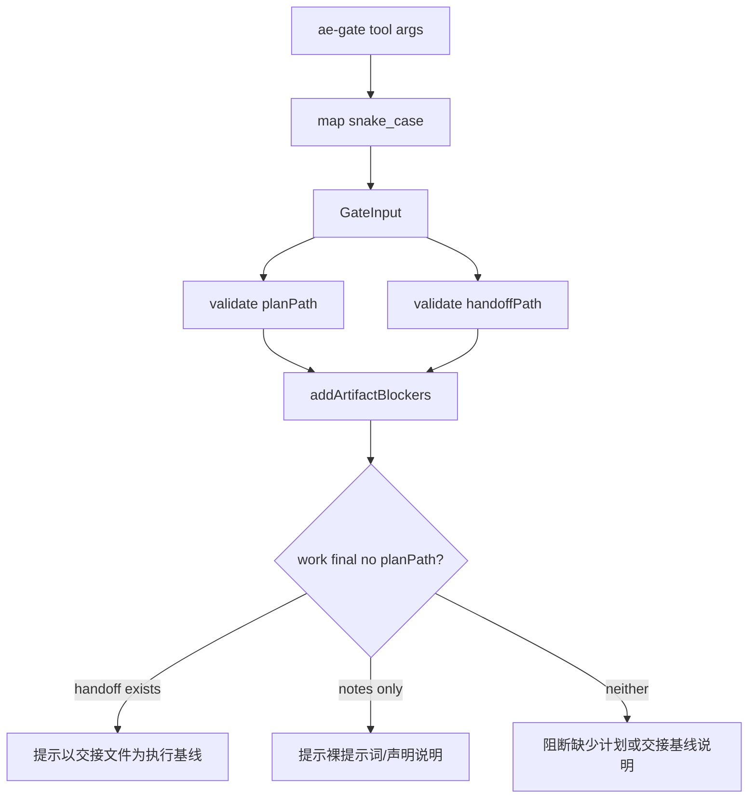

# 重构 ae:work 最终门禁的交接基线语义

## AI 解析契约
- canonicalKind: plan
- humanEquivalent: true
- stableIdsRequired: true
- implementationUnitsRequired: true
- noImplicitScope: true

## 来源与目标
来源：用户要求使用 `ae:refactor` 深度分析如何修复 `gate-service.ts:1129-1134` 把无 `plan_path` 统归“无需计划”的问题。

已验证证据：
- `src/services/gate-service.ts:71-92` 的 `GateInput` 只有 `planPath`、`notes`、`worktreeDecision` 等字段，没有结构化表达“B worktree 续执行以交接文件为执行基线”。
- `src/services/gate-service.ts:1129-1134` 在 `workflow=work`、`checkpoint=final` 且无 `planPath` 时统一提示“简单裸提示词或 notes 说明无需计划”，并在无 notes 时阻断为“说明任务为何无需计划”。
- `tests/services/gate-service.test.ts:176-196` 现有测试只覆盖“裸提示词小任务无计划但有说明可通过”，未覆盖 A→B 续执行无 `plan_path` 但有交接文件的场景。
- `src/tools/ae-gate.tool.ts:250-331` 的工具参数没有 `handoff_path`、`execution_baseline` 或等价字段，LLM 只能通过 `notes` 弱表达交接基线。

目标：在保持现有门禁外部行为兼容的前提下，让 `ae-gate workflow:work checkpoint:final` 能区分三类无 `plan_path` 场景：裸提示词轻量任务、A→B 续执行以交接文件为执行基线、真正缺少必要计划/基线证据。

非目标：
- 不修改 `ae-worktree-handoff` 交接文件生成器的 Markdown 结构。
- 不放宽 LFG 在 `before_work`、`before_review`、`final` 阶段对计划路径的硬门禁。
- 不把 `notes` 作为可验证交接证据；`notes` 只能继续作为声明型补充说明。
- 不改变审查证据、Git 授权证据、验证命令证据的既有严格性。

外部行为保持要求：
- 既有 `plan_path` 输入继续按当前规则校验。
- 既有裸提示词小任务通过 `notes` 说明后仍可通过最终门禁。
- 既有 `ae-gate` 调用方不传新增字段时不发生类型破坏或运行时异常。
- 新增字段只增强 A→B 续执行语义，不改变普通当前工作区交付的 `worktree_decision: rejected` 语义。

## 范围

### 包含
- 为 `GateInput` 和 `ae-gate` 工具参数增加结构化交接基线证据字段。
- 在门禁结果中记录交接基线证据来源，避免把 A→B 续执行误写成“无需计划”。
- 重构 `addArtifactBlockers` 中 `work/final` 无 `planPath` 的分支，使文案按场景分流。
- 补充服务层和工具层测试，覆盖裸提示词、A→B 续执行、有无交接文件、无任何基线证据等路径。

### 不包含
- 不执行真实 worktree 创建或 Git 写操作。
- 不新增审查报告生成能力。
- 不修复已知的审查 evidence verified 门禁体验问题。
- 不改变计划、需求、设计文件在交接文件中的可选上下文规则。

### 约束
- 面向插件用户的门禁文案必须使用通用工作流证据，不得写死本仓库专用路径以外的业务前提。
- 新增交接路径字段必须使用仓库相对路径，并限制在当前 worktree 内。
- 交接文件证明只能证明“执行基线存在”，不能证明功能已经交付完成。

## 需求追溯
| 需求 ID | 计划响应 |
|---------|----------|
| R1 区分无计划的不同原因，避免把 A→B 续执行误判为无需计划 | U1, U2, U3 |
| R2 保持既有裸提示词轻量任务通过路径 | U2, U4 |
| R3 为交接文件提供可验证结构化证据，而不是只靠 notes | U1, U2, U4 |
| R4 覆盖工具参数映射和服务层门禁行为 | U3, U4 |

## 高层技术设计

### 关键决策
- D1. 新增 `handoffPath?: string` 作为最小结构化证据字段 → 理由: 当前问题只需要证明 A→B 续执行的交接文件存在；引入完整 `executionBaseline` 联合类型会增加工具参数和服务返回结构复杂度。
- D2. 不把 `worktreeDecision: created` 单独作为 A→B 续执行证据 → 理由: `created` 也可能表示普通独立 worktree 执行完成，不能证明交接文件存在。
- D3. `planPath` 优先级高于 `handoffPath` → 理由: 有真实计划文档时仍按计划文档校验，不应因交接文件存在而掩盖计划路径无效。
- D4. `handoffPath` 只在 `workflow=work` 且 `checkpoint=final` 无 `planPath` 时参与放行文案分流 → 理由: LFG 和执行前门禁仍应保持计划阶段约束。

建议数据流：

## 专项设计

### 数据模型
- `GateInput` 增加 `handoffPath?: string`。
- `GateResult.evidence` 增加 `handoffPath?: string` 与 `handoffExists?: boolean`。
- `GateResult.evidenceSources` 可复用 `plan` 来源，也可新增 `handoff` 来源字段。推荐新增 `handoff: GateEvidenceSource`，避免把交接文件错误归类到计划证据。
- `ae-gate` 工具参数增加 `handoff_path`，描述为“B worktree 续执行交接文件路径，使用仓库相对路径，仅用于证明无 plan_path 时的执行基线”。

### 接口设计
- `handoff_path` 可选，不影响既有调用。
- 当传入 `handoff_path` 时必须用 `validateArtifactPath` 校验位于当前 worktree 内并真实存在。
- 路径格式建议限制为 `docs/ae/handoffs/*.md`，但第一阶段可只校验仓库内存在，避免过早绑定文件名格式；若要更严格，应同步交接生成器输出路径契约和测试。

## 实现单元

### U1. 增加交接基线证据字段
- [ ] 目标: 让门禁服务和工具能结构化接收 A→B 续执行交接文件路径。
- [ ] 覆盖需求: R1, R3, R4
- [ ] 行为保持要求: 未传 `handoff_path` 时既有 `ae-gate` 行为不变；已传 `plan_path` 时仍以计划路径校验为准。
- [ ] 依赖: 无
- [ ] 文件:
  - `src/services/gate-service.ts`
  - `src/tools/ae-gate.tool.ts`
  - `tests/tools/ae-gate.tool.test.ts`
- [ ] 方法:
  - 在 `GateInput` 增加 `handoffPath?: string`。
  - 在 `GateResult.evidence` 增加 `handoffPath?: string`、`handoffExists?: boolean`。
  - 在 `GateResult.evidenceSources` 增加 `handoff: GateEvidenceSource`，初始值由 `getArtifactSource` 类似逻辑计算。
  - 在 `ae-gate` 参数中增加 `handoff_path` 并映射到服务层 `handoffPath`。
- [ ] 需遵循的模式:
  - 复用 `requirementsPath`、`planPath` 的 snake_case 到 camelCase 映射模式。
  - 复用 `validateArtifactPath` 的工作区内路径校验。
- [ ] 测试场景:
  - 正常路径: 工具传入 `handoff_path` 后，结果 evidence 包含 `handoffPath` 和 `handoffExists: true`。
  - 边界情况: 不传 `handoff_path` 时 evidence 不包含交接字段或来源为 `not_provided`。
  - 错误路径: 传入工作区外路径时阻断并提示交接路径无效。
  - 集成场景: 工具层 snake_case 映射服务层 camelCase。
- [ ] 验证:
  - `npx vitest run tests/tools/ae-gate.tool.test.ts tests/services/gate-service.test.ts`
  - `npm run typecheck`
- [ ] 回滚信号: 现有不传 `handoff_path` 的 gate 测试出现行为变化。

### U2. 重构 work/final 无 planPath 分流逻辑
- [ ] 目标: 避免把所有无 `planPath` 场景统一解释为“无需计划”。
- [ ] 覆盖需求: R1, R2, R3
- [ ] 行为保持要求: `tests/services/gate-service.test.ts` 中“裸提示词在说明后通过最终门禁”的测试继续通过。
- [ ] 依赖: U1
- [ ] 文件:
  - `src/services/gate-service.ts`
  - `tests/services/gate-service.test.ts`
- [ ] 方法:
  - 将 `addArtifactBlockers` 中 `work/final && !planPath` 分支拆成 helper，例如 `addWorkFinalBaselineWarnings`。
  - 若 `handoffPath` 校验通过：加入 warning，说明“本次 ae:work 未提供计划路径；已使用交接文件作为 B worktree 续执行基线”。不得出现“无需计划”。
  - 若无 `handoffPath` 且有 `notes`：保留裸提示词说明路径，但将文案改为“未提供计划或交接基线路径；仅适用于简单裸提示词或 notes 已说明执行基线”。
  - 若无 `handoffPath` 且无 `notes`：阻断文案改为“缺少计划路径或交接基线说明”，next step 同时给出 `plan_path`、`handoff_path`、`notes` 三种补证方式。
- [ ] 需遵循的模式:
  - 不用字符串解析 `notes` 判断是否 A→B；只有结构化 `handoffPath` 才算可观察交接基线证据。
  - warning 可承认 `validation_commands` 仍是声明证据，不改变现有验证证据规则。
- [ ] 测试场景:
  - 正常路径: `work/final` 无 `planPath` 但有存在的 `handoffPath`、验证命令、审查未运行原因、Git 空数组、`worktreeDecision: created` 时通过，warning 不包含“无需计划”。
  - 正常路径: 裸提示词无 `planPath` 有 `notes` 仍通过。
  - 错误路径: 无 `planPath`、无 `handoffPath`、无 `notes` 阻断，missing evidence 指向“计划路径、交接文件路径或执行基线说明”。
  - 边界情况: 有 `planPath` 但计划不存在时仍阻断，不因 `handoffPath` 放行。
- [ ] 验证:
  - `npx vitest run tests/services/gate-service.test.ts`
  - `npm run typecheck`
- [ ] 回滚信号: 门禁开始允许没有计划、没有交接文件、没有说明的 `work/final` 通过。

### U3. 补齐 A→B 续执行门禁文本契约测试
- [ ] 目标: 用资产文本测试约束技能文案和门禁字段一致，防止未来再次把交接续执行写成“无需计划”。
- [ ] 覆盖需求: R1, R3, R4
- [ ] 行为保持要求: 不改变技能说明中“交接文件是唯一必需输入，需求/计划/设计为可选上下文”的既有语义。
- [ ] 依赖: U1, U2
- [ ] 文件:
  - `tests/assets/ae-work-artifact-text.test.ts`
  - `src/assets/skills/ae-work/references/shipping-workflow.md`
  - `src/assets/commands/ae-work-continue.md`
- [ ] 方法:
  - 在 `shipping-workflow.md` 的最终门禁说明中补充：B 续执行无 `plan_path` 时应传 `handoff_path` 或在 notes 中说明执行基线；不得写成“任务无需计划”。
  - 在资产测试中加入 `handoff_path`、`交接文件作为 B worktree 续执行基线`、`不得写成无需计划` 等断言。
- [ ] 需遵循的模式:
  - 面向插件用户文案必须描述通用证据，不引入本仓库源码结构。
- [ ] 测试场景:
  - 正常路径: 文案包含 `handoff_path` 和交接基线说明。
  - 错误路径: 文案不包含“B 续执行无需计划”这类误导表达。
  - 集成场景: `/ae-work-continue` 与 shipping workflow 对唯一必需输入语义一致。
- [ ] 验证:
  - `npx vitest run tests/assets/ae-work-artifact-text.test.ts`
- [ ] 回滚信号: 资产文案再次把 A→B 续执行缺计划描述为无需计划。

### U4. 完整回归与门禁验证
- [ ] 目标: 确认重构不改变现有普通门禁路径，并新增 A→B 续执行路径的可验证证据。
- [ ] 覆盖需求: R2, R4
- [ ] 行为保持要求: 不提交、不推送、不执行 destructive Git 操作。
- [ ] 依赖: U1, U2, U3
- [ ] 文件:
  - `tests/services/gate-service.test.ts`
  - `tests/tools/ae-gate.tool.test.ts`
  - `tests/assets/ae-work-artifact-text.test.ts`
- [ ] 方法:
  - 运行目标测试和类型检查。
  - 如涉及工具参数 schema 变化，确认 `ae-help` 或工具注册测试未受影响；必要时补跑相关命令注册测试。
  - 最终调用 `ae-gate workflow:work checkpoint:final`，记录无 Git 写操作或授权证据。
- [ ] 需遵循的模式:
  - 验证失败先修复，不用文字承诺替代。
- [ ] 测试场景:
  - 正常路径: 所有新增与既有测试通过。
  - 边界情况: final gate warnings 可接受但无 blockers。
  - 错误路径: 无证据路径仍阻断。
  - 集成场景: 工具层执行结果 JSON 包含新增 evidence 字段。
- [ ] 验证:
  - `npx vitest run tests/services/gate-service.test.ts tests/tools/ae-gate.tool.test.ts tests/assets/ae-work-artifact-text.test.ts`
  - `npm run typecheck`
- [ ] 回滚信号: `ae-gate` 最终门禁无法通过或出现新增字段未映射导致的 TypeScript 错误。

## 风险与应对
| 风险 | 影响 | 应对措施 |
|------|------|----------|
| 新增 `handoff_path` 被误认为功能完成证明 | A 会话可能错误放行最终功能交付 | 文案明确交接文件只证明执行基线，功能完成仍依赖验证、审查和 worktree 决策 |
| `worktreeDecision: created` 与 A→B 续执行语义混淆 | 普通独立 worktree 执行可能被误判为交接续执行 | 不用 `created` 单独判断，必须有 `handoffPath` |
| 过度严格限制 `handoff_path` 路径格式 | 旧交接文件或用户自定义路径无法使用 | 第一阶段只校验工作区内真实存在；如需收紧，另开计划 |
| 门禁 evidenceSources 新增字段影响测试快照 | 现有断言失败 | 只更新直接断言结构；避免不必要快照式全量比较 |

## 待定问题

### 执行前需解决
- Q1. 是否接受新增 `handoff_path` 作为公开工具参数名称？推荐接受，因为它最小且与现有 `requirements_path`、`plan_path` 命名一致。

### 推迟到执行
- Q2. 是否进一步把 `handoff_path` 限制为 `docs/ae/handoffs/<timestamp>-worktree-handoff.md`？建议执行时先不限制，避免扩大兼容性风险。

## 等价性检查
- implementationUnitsCount: 4
- tracedRequirementsCount: 4
- decisionsCount: 4
- risksCount: 4
