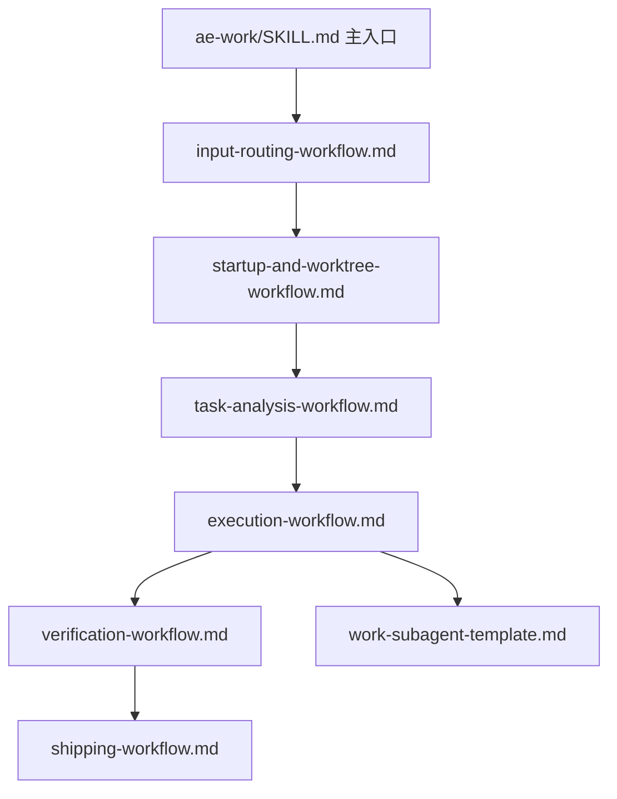

# ae:work 内部子流程文件拆分计划

## AI 解析契约
- canonicalKind: plan
- humanEquivalent: true
- stableIdsRequired: true
- implementationUnitsRequired: true
- noImplicitScope: true

## 来源与目标
本计划基于当前会话中已确认的目标：重构 `ae:work` 的执行提示词结构，不新增内部子技能或命令，而是把过长的阶段细节拆分为 `ae-work/references/` 下的内部子流程文件。

目标：
- 保持 `ae:work` 作为唯一公开工作执行入口。
- 保持 `/ae-work`、`ae:lfg`、`ae:task-loop` 的现有命令和技能注册语义不变。
- 支持 `/ae-lfg ae:work`、`ae:lfg ae:work`、`ae:task-loop ae:work`、`/ae-task-loop ae:work` 这类用法归一化为当前工作区执行，不询问 worktree，不创建 worktree。
- 降低 `src/assets/skills/ae-work/SKILL.md` 的流程密度，减少模型漏读门禁、误询问 worktree 或跳过验证/交付门禁的风险。

非目标：
- 不新增 `ae:work-*` 内部技能。
- 不新增对应命令。
- 不修改 `SKILL.WORK`、`COMMAND.WORK`、catalog、模型路由或工具实现。
- 不改变 `ae:work` 的对外功能边界和最终交付门禁要求。

## 范围

### 包含
- 重写 `src/assets/skills/ae-work/SKILL.md` 为主编排器，保留输入契约、硬门禁、阶段顺序和引用关系。
- 新增或重组 `src/assets/skills/ae-work/references/` 下的内部子流程文件。
- 保留现有 `shipping-workflow.md` 和 `work-subagent-template.md` 的职责，并按需最小更新其交叉引用。
- 在 `ae:work` 主入口中明确调用来源策略和委派前缀归一化规则。
- 对照 `ae:lfg` 与 `ae:task-loop` 的现有 current-worktree 复用契约检查一致性。

### 不包含
- 新增技能名、命令名、代理、工具或 TypeScript 注册逻辑。
- 实现代码执行能力变更。
- 改造 `ae-task-analyzer`、`ae-gate` 或审查工具。
- 修改浏览器测试或 `agent-browser` setup 流程。

### 约束
- 所有新增文件路径必须位于 `src/assets/skills/ae-work/references/`。
- `src/assets/skills/ae-work/SKILL.md` 的 frontmatter、`<input_document> #$ARGUMENTS </input_document>` 和公开入口语义必须保持。
- `ae:lfg` / `ae:task-loop` 来源下必须固定当前工作区执行，禁止询问 worktree，禁止创建 worktree，禁止把缺省模式补齐或透传为 `auto`。
- `ae-gate workflow:work checkpoint:final` 的最终门禁要求必须在主入口和交付流程中都可见。

## 需求追溯
| 需求 ID | 计划响应 |
|---------|----------|
| R1 保持 `ae:work` 唯一公开入口，不创建内部子技能或命令 | U1, U2, U9 |
| R2 将长流程拆为 references 内部子流程文件 | U2, U3, U4, U5, U6, U7, U8 |
| R3 支持 `ae:lfg` / `ae:task-loop` 复用 `ae:work` 时固定当前工作区执行 | U2, U3, U4, U9 |
| R4 支持 `/ae-lfg ae:work`、`ae:lfg ae:work`、`ae:task-loop ae:work`、`/ae-task-loop ae:work` 归一化 | U2, U3, U9 |
| R5 保留 worktree、Git 授权、验证、审查和最终 gate 硬门禁 | U4, U6, U7, U8, U9 |
| R6 不修改 TypeScript 注册、catalog、模型路由 | U1, U9 |

## 高层技术设计
采用“主入口编排 + references 阶段契约”的文档重构方式。`SKILL.md` 不再承载所有细节，而是保留稳定阶段图和不可移出的硬规则；各 reference 文件按阶段定义输入、输出、阻断条件和执行细节。

### 关键决策
- D1. 使用 references 文件而不是内部子技能 → 理由: 避免新增技能/命令注册、帮助列表和模型路由维护成本，同时防止用户直接调用内部阶段绕过主流程。
- D2. `SKILL.md` 保留硬门禁摘要 → 理由: references 需要由模型主动读取，关键规则不能只存在于被引用文件中。
- D3. 将调用来源策略放在输入分流阶段优先处理 → 理由: `ae:lfg` / `ae:task-loop` 的 current-worktree 策略必须先于单独 `ae:work` 的 worktree 询问规则生效。
- D4. 将验证和交付拆开 → 理由: `ae:task-loop` 更适合复用执行/验证循环，而不是完整交付模板。

## 实现单元

### U1. 固定资产边界与现状基线
- [ ] 目标: 确认本次只改 `ae-work` 技能 Markdown 资产和 references 文件，不触碰注册真源。
- [ ] 覆盖需求: R1, R6
- [ ] 依赖: 无
- [ ] 文件:
  - `src/assets/skills/ae-work/SKILL.md`
  - `src/assets/skills/ae-work/references/shipping-workflow.md`
  - `src/assets/skills/ae-work/references/work-subagent-template.md`
  - `src/schemas/ae-asset-schema.ts`
  - `src/services/ae-catalog.ts`
  - `src/services/asset-model-routing-catalog.ts`
- [ ] 方法:
  - 读取现有 `ae-work` 主文件和 reference 文件，标注待迁移段落边界。
  - 只读确认 `SKILL.WORK`、`COMMAND.WORK`、catalog 和模型路由不需要修改。
  - 记录现有 `ae:lfg`、`ae:task-loop` 对 `ae:work` 的 current-worktree 约束位置，作为后续等价检查基线。
  - 产出迁移边界清单：原段落到目标 reference 的映射、不可迁出的硬门禁、`ae:lfg` / `ae:task-loop` 约束来源、TS 注册文件只读确认结果。
- [ ] 需遵循的模式:
  - OpenCode 原生 Skill 结构规则：技能目录下 `SKILL.md` 为入口，`references/` 存放辅助流程。
  - 面向插件用户能力不得泄漏源码仓库维护假设。
- [ ] 测试场景:
  - 正常路径: 能列出所有待拆分段落及目标 reference 文件。
  - 边界情况: 发现某段包含硬门禁时，不完全迁出，需在主入口保留摘要。
  - 错误路径: 如果发现需要改注册 TS 才能完成目标，停止并重新评估方案。
  - 集成场景: 对照 `ae:lfg`、`ae:task-loop` 文档确认复用约束仍可映射到 `ae:work`。
- [ ] 验证:
  - 手动检查 `git diff -- src/schemas/ae-asset-schema.ts src/services/ae-catalog.ts src/services/asset-model-routing-catalog.ts` 无变更。

### U2. 将 `SKILL.md` 改为主编排器
- [ ] 目标: 缩短 `ae-work/SKILL.md`，保留输入契约、阶段顺序、硬门禁和每个 reference 的读取要求。
- [ ] 覆盖需求: R1, R2, R3, R4
- [ ] 依赖: U1
- [ ] 文件:
  - `src/assets/skills/ae-work/SKILL.md`
- [ ] 方法:
  - 保留 frontmatter、简介、`<input_document> #$ARGUMENTS </input_document>`。
  - 增加阶段总览，明确按顺序读取 references：输入分流、启动与 worktree、任务分析、执行、验证、交付。
  - 在主文件保留不可移出的硬规则：调用方是 `ae:lfg` 或 `ae:task-loop` 时固定当前工作区；最终正式交付必须通过 `ae-gate workflow:work checkpoint:final`。
  - 明确内部子流程文件不是独立技能，不提供命令，不能绕过主入口。
- [ ] 需遵循的模式:
  - 现有 `shipping-workflow.md` 的延迟加载模式。
  - Markdown 引用使用 `@./references/<file>.md` 或稳定相对路径，不使用绝对路径。
- [ ] 测试场景:
  - 正常路径: 单独 `/ae-work` 仍能从主入口进入完整流程。
  - 边界情况: `ae:lfg` / `ae:task-loop` 来源下不会走单独 `ae:work` 的 worktree 询问分支。
  - 错误路径: 如果任一 reference 未读到，主文件仍有硬门禁摘要阻止直接交付。
  - 集成场景: 主入口能指向所有新 reference 文件和既有 `shipping-workflow.md`。
- [ ] 验证:
  - 搜索确认 `name: ae:work`、`argument-hint`、`#$ARGUMENTS`、`ae-gate workflow:work checkpoint:final` 仍存在。

### U3. 新增输入分流子流程
- [ ] 目标: 把输入类型识别、委派前缀归一化和任务大小初判集中到独立 reference 文件中。
- [ ] 覆盖需求: R2, R3, R4
- [ ] 依赖: U2
- [ ] 文件:
  - `src/assets/skills/ae-work/references/input-routing-workflow.md`
- [ ] 方法:
  - `input-routing-workflow.md` 定义输入类型：worktree handoff、计划路径、裸提示词、上游编排器委派。
  - 明确支持并归一化 `/ae-lfg ae:work`、`ae:lfg ae:work`、`ae:task-loop ae:work`、`/ae-task-loop ae:work`。
  - 输出 `work_intent`，至少包含 `origin`、`input_type`、`delegated_skill`、`worktree_policy`、`interaction_policy`、`routing_decision`。
- [ ] 需遵循的模式:
  - 现有 `ae-work/SKILL.md` 阶段 0 和阶段 1 步骤 2 的语义保持。
  - `ae:lfg` 和 `ae:task-loop` 的 current-worktree 约束优先于单独 `ae:work` 询问规则。
- [ ] 测试场景:
  - 正常路径: 计划路径输入进入计划执行分支。
  - 边界情况: `/ae-lfg ae:work` 被识别为 `origin=ae:lfg`、`delegated_skill=ae:work`、`worktree_policy=current-worktree`。
  - 错误路径: B worktree handoff 路径缺失或目标 worktree 不匹配时停止，不回到 A worktree 写文件。
  - 集成场景: `ae:task-loop ae:work` 在禁言期不会触发 worktree 询问。
- [ ] 验证:
  - Grep 关键短语：`/ae-lfg ae:work`、`ae:lfg ae:work`、`ae:task-loop ae:work`、`/ae-task-loop ae:work`、`work_intent`、`worktree_policy`。

### U4. 新增启动与 worktree 子流程
- [ ] 目标: 把 Git 状态检查、worktree 模式解析、风险确认、A→B 创建和 B 续执行规则集中到独立 reference 文件中。
- [ ] 覆盖需求: R2, R3, R5
- [ ] 依赖: U3
- [ ] 文件:
  - `src/assets/skills/ae-work/references/startup-and-worktree-workflow.md`
- [ ] 方法:
  - 消费 U3 的 `work_intent`，输出 `work_context` 中的 `worktree_mode`、`worktree_decision`、branch、HEAD、Git 状态和授权证据。
  - 迁移 Git 状态检查、worktree 模式解析、用户确认、A→B 创建和 B 续执行规则。
  - 来源为 `ae:lfg` 或 `ae:task-loop` 时，固定 `worktree_policy: current-worktree`，记录 `worktree_decision: rejected`，禁止询问 worktree，禁止创建 worktree，禁止补齐或透传 `auto`。
- [ ] 需遵循的模式:
  - A 会话创建 B worktree 后只允许迁移执行基线产物和写入规范 handoff 文件，不进入实现。
  - B worktree 续执行只读取已确定执行基线，不重新审查、深化或转换需求/计划。
- [ ] 测试场景:
  - 正常路径: 单独 `/ae-work` 在未显式传入 worktree 模式时仍按任务大小询问。
  - 边界情况: `ae:lfg` 来源固定当前工作区并记录 `worktree_decision: rejected`。
  - 错误路径: B worktree handoff 路径缺失或目标 worktree 不匹配时停止，不回到 A worktree 写文件。
  - 集成场景: `ae:task-loop ae:work` 在禁言期不会触发 worktree 询问。
- [ ] 验证:
  - Grep 关键短语：`不得询问 worktree 模式`、`不得创建 worktree`、`不得把未传值补齐为 auto`、`worktree_decision: rejected`、`worktree_decision: transferred`。

### U5. 新增任务分析子流程
- [ ] 目标: 把 `ae-task-analyzer` 调用、手动降级、待办构建和执行策略选择集中到独立 reference 文件中。
- [ ] 覆盖需求: R2
- [ ] 依赖: U4
- [ ] 文件:
  - `src/assets/skills/ae-work/references/task-analysis-workflow.md`
- [ ] 方法:
  - `task-analysis-workflow.md` 迁移 `ae-task-analyzer` 调用、手动降级、todo 构建和执行策略选择规则。
  - 输出 `todo_units`、`conflict_matrix`、`parallel_groups`、执行策略和需要主代理执行的验证命令候选。
- [ ] 需遵循的模式:
  - 文件范围、状态、迁移、配置、公共契约、测试夹具或共享中间产物存在冲突时降级串行。
- [ ] 测试场景:
  - 正常路径: 计划文档输入调用 `ae-task-analyzer mode:plan`。
  - 边界情况: 简单任务跳过完整任务列表时仍生成最小单任务 `todo_units`。
  - 错误路径: 工具不可用或返回警告时手动拆分并记录降级原因。
  - 集成场景: 输出可被执行子流程直接消费。
- [ ] 验证:
  - Grep 确认 `ae-task-analyzer`、`todo_units`、`conflict_matrix`、`parallel_groups`、`is_parallel_safe` 等关键约束仍存在。

### U6. 新增执行子流程并连接子代理模板
- [ ] 目标: 把阶段 2 执行循环、串行/并行调度、失败处理、测试发现和进度跟踪集中到独立 reference 文件中。
- [ ] 覆盖需求: R2, R5
- [ ] 依赖: U5
- [ ] 文件:
  - `src/assets/skills/ae-work/references/execution-workflow.md`
  - `src/assets/skills/ae-work/references/work-subagent-template.md`
- [ ] 方法:
  - `execution-workflow.md` 迁移阶段 2 执行前清单、串行/并行执行、失败处理、测试发现和进度跟踪规则。
  - 保留 `work-subagent-template.md` 作为并行子代理模板，只在执行流程中引用。
  - 输出执行状态、失败处理结果和需要验证阶段核验的变更证据要求。
- [ ] 需遵循的模式:
  - 子代理自报不作为真实修改证据，主代理必须独立核验 Git diff/status。
  - 子代理不得暂存、提交、运行全量测试、启动服务或占用共享资源。
- [ ] 测试场景:
  - 正常路径: 简单任务生成最小单任务 `todo_units` 并内联执行。
  - 边界情况: 并行组有文件冲突时降级串行。
  - 错误路径: 子代理返回 `failed` 或 `partial` 后先核验真实 diff，再决定重试。
  - 集成场景: 执行完成后验证阶段能提供 `validation_commands` 给 shipping 和上游 `ae:lfg` gate。
- [ ] 验证:
  - Grep 确认 `work-subagent-template.md`、`执行前验证`、`parallel_groups`、`conflicts_found`、`Git diff/status` 等关键约束仍存在。

### U7. 新增验证子流程
- [ ] 目标: 把主代理真实 diff/status 核验、越权修改检查、统一验证命令和验证结果产出集中到独立 reference 文件中。
- [ ] 覆盖需求: R2, R5
- [ ] 依赖: U6
- [ ] 文件:
  - `src/assets/skills/ae-work/references/verification-workflow.md`
- [ ] 方法:
  - 描述主代理必须独立运行 Git diff/status 检查真实修改文件，不只依赖子代理自报。
  - 检查真实修改文件与允许文件、任务边界和共享资源约束是否一致。
  - 运行统一验证命令，输出 `verification_result` 和实际 `validation_commands`。
  - 为 `shipping-workflow.md` 和上游 `ae:lfg` before_review/final gate 提供可消费证据。
- [ ] 需遵循的模式:
  - 验证结果只能基于可观察命令输出、工具输出或文件状态。
  - 发现越权或污染修改时停止并请求用户决策，不得自动覆盖或回滚。
- [ ] 测试场景:
  - 正常路径: 执行完成后产出 `verification_result` 和 `validation_commands`。
  - 边界情况: 无安全子代理验证命令时，由主代理执行统一验证。
  - 错误路径: 发现越权文件修改时停止，不进入 shipping。
  - 集成场景: `ae:lfg` 可使用验证结果调用 before_review 和 final gate。
- [ ] 验证:
  - Grep 确认 `verification_result`、`validation_commands`、`真实修改文件`、`Git diff/status`、`越权` 等关键约束存在。

### U8. 收敛交付流程与最终门禁契约
- [ ] 目标: 保持 `shipping-workflow.md` 的正式交付职责，同时与新增验证阶段对齐。
- [ ] 覆盖需求: R2, R5
- [ ] 依赖: U7
- [ ] 文件:
  - `src/assets/skills/ae-work/references/shipping-workflow.md`
- [ ] 方法:
  - 保留 `shipping-workflow.md` 中代码审查、最终验证、`ae-gate`、最终模板和提交授权规则。
  - 更新文本，使其明确消费 `verification_result` 和实际运行的 `validation_commands`。
  - 确认 `transferred` / `cancelled` 只作为提前终止状态，不进入最终功能交付 gate。
  - 避免在多个 reference 中复制完整 gate 参数清单；主入口保留摘要，shipping 保留完整清单。
- [ ] 需遵循的模式:
  - 正式代码交付必须有审查状态和最终 gate 证明。
  - Git 写操作证据必须包含结构化命令参数和授权证据，不能只依赖用户口头声明。
- [ ] 测试场景:
  - 正常路径: 验证与审查通过后进入最终 gate。
  - 边界情况: 无代码变更时不得宣称正式实现完成。
  - 错误路径: `ae-gate` 返回 block 时停止补齐，不输出完成。
  - 集成场景: B worktree 最终交付使用 `worktree_decision: created`，A 会话转移使用 `transferred` 并提前停止。
- [ ] 验证:
  - Grep 确认 `ae-gate workflow:work checkpoint:final`、`review_evidence`、`git_authorization_evidence`、`transferred`、`cancelled` 仍存在。

### U9. 一致性检查、资产测试与构建验证
- [ ] 目标: 验证拆分后资产结构、注册语义和上游复用契约未回归。
- [ ] 覆盖需求: R1, R3, R4, R5, R6
- [ ] 依赖: U8
- [ ] 文件:
  - `src/assets/skills/ae-work/SKILL.md`
  - `src/assets/skills/ae-work/references/*.md`
  - `src/assets/skills/ae-lfg/SKILL.md`
  - `src/assets/skills/ae-task-loop/SKILL.md`
  - `tests/assets/asset-health.test.ts`
  - `tests/assets/ae-work-artifact-text.test.ts`
  - `tests/services/ae-catalog.test.ts`
- [ ] 方法:
  - 检查 `ae:work` 主入口、`ae:lfg`、`ae:task-loop` 对 current-worktree 约束表述一致。
  - 确认没有新增技能、命令或模型路由配置。
  - 运行资产健康和 catalog 测试，确保 `ae:work` 注册仍指向原 `SKILL.md`。
  - 运行并按需更新 `ae-work-artifact-text` 文本契约测试；如果关键契约迁移到新 reference 文件，只扩展测试读取范围和断言目标，不放松 current-worktree、最终 gate、Git 授权、A→B 交接等硬约束。
  - 运行类型检查和构建，确保 assets 能复制到 dist。
  - `tests/assets/*.test.ts` 和 `tests/services/*.test.ts` 是验证目标；除非契约迁移导致断言范围必须同步，否则不修改测试文件。
- [ ] 需遵循的模式:
  - 只验证事实，不用文字承诺替代测试结果。
  - 若测试失败，先修复拆分造成的问题，不扩大重构范围。
- [ ] 测试场景:
  - 正常路径: 资产测试、catalog 测试、typecheck、build 通过。
  - 边界情况: 只改 Markdown 时 TypeScript 注册测试仍应通过。
  - 错误路径: 若 asset health 检测到断链引用，修复引用路径。
  - 集成场景: build 后 `dist/src/assets/skills/ae-work/references/` 包含新增子流程文件。
- [ ] 验证:
  - `npx vitest run tests/assets/asset-health.test.ts tests/assets/ae-work-artifact-text.test.ts tests/services/ae-catalog.test.ts`
  - `npm run typecheck`
  - `npm run build`

## 风险与应对
| 风险 | 影响 | 应对措施 |
|------|------|----------|
| 主入口过度瘦身导致模型跳过 reference | 漏执行 worktree 或 gate 硬门禁 | `SKILL.md` 保留阶段顺序和不可移出的硬规则摘要 |
| current-worktree 约束分散不一致 | `ae:lfg` 或 `ae:task-loop` 误触发 worktree 询问 | 在输入分流和启动流程集中定义来源优先策略，并在主入口保留摘要 |
| A→B worktree 交接语义被误改 | A 会话误继续实现或最终 gate 状态错误 | 迁移时保持 `transferred` 早停、B 会话 `created` 最终交付的原语义 |
| 最终 gate 参数口径重复 | 审查证据、Git 授权证据或 worktree decision 遗漏 | 主入口只保留最小 gate 契约，完整参数清单集中在 `shipping-workflow.md` |
| 误新增内部技能或命令 | 污染帮助列表、命令变体和模型路由 | 范围限定在 `ae-work/SKILL.md` 与 `ae-work/references/*.md`，验证 TS 注册文件无变更 |

## 待定问题

### 推迟到执行
- Q1. `ae-work/SKILL.md` 最终保留多少原文摘要，需要在实际编辑时以避免重复和保持硬门禁可见为准。
- Q2. 新 reference 文件命名可在执行时按实际迁移粒度微调，但不得引入内部技能目录。

## 等价性检查
- implementationUnitsCount: 9
- tracedRequirementsCount: 6
- decisionsCount: 4
- risksCount: 5
