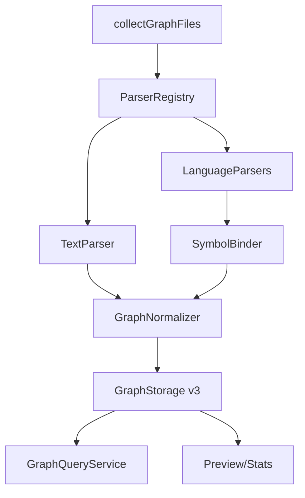

# 知识图谱解析重构计划

## AI 解析契约
- canonicalKind: plan
- humanEquivalent: true
- stableIdsRequired: true
- implementationUnitsRequired: true
- noImplicitScope: true

## 来源与目标
来源为 `docs/ae/brainstorms/2026-05-14-graph-parser-rewrite-requirements.md`。本计划将现有文件级浅层正则图谱重构为通用代码与文本结构图谱，删除 AE 提示词资产引用解析，支持文件节点、内部语义节点、跨文件节点关系、置信度降级和节点级查询。

外部行为保持要求：保留 `ae:graph-build` 写入当前工作区 `docs/ae/graphs/` 的本地版本化图谱能力，保留 `ae:graph-query` 的可恢复诊断、scope、截断和查询成本表达。允许破坏性升级图谱 schema、构建流程和查询接口；旧图谱数据不迁移，只提示重建。

## 范围

### 包含
- 删除 `ae_ref` 关系、`asset` 文件类型和 AE 技能/命令/工具/代理 token 解析。
- 定义图谱 schema v3，支持文件节点、内部节点、外部依赖节点、候选/未解析关系目标和混合路径关系。
- 前置完成解析器依赖选型、公开查询契约和运行时资源分发验证，避免在语言实现阶段临场决定关键架构。
- 引入解析器注册表，将文件收集、文本链接解析、语言解析、符号绑定、关系归一化分层。
- 覆盖 TypeScript/JavaScript、Java、Python、Go、Markdown 的最小验收矩阵。
- 重构存储索引和查询服务，支持文件视图、文件内部结构、节点依赖/影响、混合路径查询。
- 更新工具描述、技能说明、图谱优先规则、预览页和测试。

### 不包含
- 兼容旧 schema 或迁移旧图谱数据。
- 保留 AE 资产专项图谱或开关。
- 对注释和自然语言文本推断确定调用关系。
- 运行时代码执行、编译器完整类型检查、LSP 后台服务或跨进程动态调用追踪。
- 让所有语言达到同等符号解析精度。

### 约束
- 所有计划和后续实现路径使用仓库相对路径。
- 面向插件用户的运行时代码不得依赖本源码仓库布局、`.opencode/` 调试资产或 `AGENTS.md`。
- 支持 Windows x64、Linux x64、macOS x64、macOS arm64；必选语言样例不得因解析器不可用被跳过。
- 新增解析器依赖必须记录许可证、分发形态、跨平台安装风险、资源定位方式和失败降级语义。
- 性能目标为 1,000 个可解析文本/代码文件全量构建 60 秒内，典型查询 5 秒内；无法满足时必须输出耗时、文件数、节点数、关系数、失败数、跳过数、截断和搜索成本。

## 需求追溯
| 需求 ID | 计划响应 |
|---------|----------|
| R1 | U2, U10, U11 |
| R2 | U5, U9 |
| R3 | U3, U4, U5, U6, U7, U8 |
| R4 | U4, U5, U6, U7, U8, U11 |
| R5 | U3, U4, U5, U6, U7, U8, U9 |
| R6 | U3, U11 |
| R7 | U3, U9 |
| R8 | U4, U6, U7, U8, U9 |
| R9 | U4, U6, U8, U9 |
| R10 | U4, U5, U7, U8, U9 |
| R11 | U3, U4, U5, U6, U7, U8, U9 |
| R12 | U1, U4, U11 |
| R13 | U1, U6, U11 |
| R14 | U1, U7, U11 |
| R15 | U1, U8, U11 |
| R16 | U5, U11 |
| R17 | U3, U9, U11 |
| R18 | U9, U11 |
| R19 | U9, U11 |
| R20 | U9, U11 |
| R21 | U9, U11 |
| R22 | U3, U9, U11 |
| R23 | U2, U3, U9 |
| R24 | U1, U3, U4, U6, U7, U8, U11 |
| R25 | U1, U3, U4, U5, U6, U7, U8, U11 |
| NFR1 | U2, U11 |
| NFR2 | U3, U9, U11 |
| NFR3 | U3, U9, U11 |
| NFR4 | U1, U3, U10, U11 |

## 高层技术设计
现有实现以 `src/services/graph-parse-service.ts` 的单函数正则扫描为中心，输出 `GraphFileNode.relativePath` 与 `GraphRelation.sourcePath/targetPath`。新实现改为四层管线：文件收集层只负责安全枚举；解析层按语言产生声明、引用和本地证据；绑定层把引用解析为 `resolved`、`candidate` 或 `unresolved`；存储查询层只面对统一图谱模型。

### 关键决策
- D1. 采用 schema v3 破坏性升级 → 理由: 旧 schema 以路径字符串为主键，无法表达内部节点、位置范围、置信度和混合路径。
- D2. 彻底删除 AE 资产解析代码与类型 → 理由: 需求明确不保留 `ae_ref`、`asset` 或等价语义，保留开关会继续污染通用图谱边界。
- D3. 采用解析器注册表和统一中间模型 → 理由: 必选语言解析深度不同，但存储、查询和展示必须共享节点、关系、证据和降级语义。
- D4. TypeScript/JavaScript 第一优先使用 TypeScript compiler API，必要时补充轻量 AST 遍历 → 理由: 项目已使用 TypeScript，API 跨平台且能解析 JS/TS 模块、声明和常见调用表达式。
- D5. Java、Python、Go 解析器选型必须在语言实现前完成，并冻结许可证、平台覆盖、资源分发和最小 API 证据 → 理由: 解析器 API 会影响 schema、绑定、测试和打包，不能在实现阶段临场决定。
- D6. 置信度不是 metadata 附属字段，而是关系一等字段 → 理由: 查询、路径和审查都必须能过滤或标注候选/未解析关系。
- D7. 增量构建在 schema v3 第一版可保守降级为全量或文件影响重算 → 理由: 跨文件节点绑定需要全局符号索引，错误复用旧关系风险高于全量重算成本。
- D8. `ae-graph-query` 最小公开契约在存储索引实现前冻结为文件入口、节点入口和路径入口三类访问模式 → 理由: 索引设计必须服务确定的数据访问模式，不能等查询实现阶段再决定。

## 专项设计

### 数据模型
图谱 v3 的核心模型应在 `src/services/graph-storage-service.ts` 或拆分后的 schema 文件中集中定义，并避免继续用 `GraphFileNode` 表达所有节点。

- `GraphNode`: `id`、`kind`、`label`、`filePath?`、`language?`、`nodePath?`、`range?`、`parentId?`、`parser`、`status?`。
- `GraphNode.kind`: `file | directory | symbol | external | unresolved`。
- `GraphSymbolKind`: `module | package | class | interface | enum | function | method | constructor | field | variable | struct | type | section`。
- `GraphRelation`: `id`、`sourceId`、`targetId`、`type`、`confidence`、`range?`、`parser`、`evidence?`、`reason?`。
- `GraphRelation.type`: `contains | import | require | include | link | export | call | construct | extends | implements | type_reference | field_reference | variable_reference | directory | external_reference`。
- `GraphConfidence`: `resolved | candidate | unresolved`。`candidate`、`unresolved` 是关系置信度，不是节点类型；未能绑定到确定内部或外部节点时，可创建 `unresolved` 目标节点承载候选或未解析关系的目标证据。

节点 ID 规则：文件节点使用 `file:<repo-relative-path>`；内部节点使用 `symbol:<repo-relative-path>#<stable-symbol-path>`；外部依赖使用 `external:<ecosystem>:<specifier>`；未解析目标使用 `unresolved:<source-node-id>#<relation-type>#<stable-local-index>`。`stable-symbol-path` 由声明类型、名称、父链、签名或参数形态、源码范围证据组成，同级序号只能作为最后消歧；稳定性目标至少保证同一文件内容重复构建 ID 不变，并在局部编辑导致 ID 漂移风险时输出诊断。

跨语言 resolved 绑定边界：只有同仓库、静态 import/include/link 可定位、目标符号唯一、无重载歧义、无动态分派、无运行时反射或构建系统上下文依赖时，才能标记为 `resolved`。Java 重载/classpath 不明、Python 动态导入或属性调用、Go 接口动态分派等情况必须标记为 `candidate` 或 `unresolved` 并记录原因。

查询最小公开契约：`ae-graph-query` 保留 `deps`、`impact`、`path`、`stats`、`health`、`filter`、`core`、`pattern` 模式，并新增可选 `node` 参数或等价节点入口；`file` 与 `node` 均可作为 `deps`/`impact` 起点，`path` 支持 `file`/`node` 到 `target`/`target_node` 的混合路径。执行时可调整参数命名，但不得改变这三类访问模式和返回 `nodes`、`relations`、`confidence`、`range`、`parser`、`reason`、`truncation`、`queryCost` 的基本结构。

### 性能设计
- 构建阶段先生成每个文件的声明索引，再解析引用和绑定，避免每个引用重复扫描全仓库。
- 存储索引至少包含 `node-id-to-chunk`、`file-to-node-chunks`、`source-node-to-relation-chunks`、`target-node-to-relation-chunks`、`relation-type-to-chunks`、`scope-summary`。
- 查询默认使用索引读取必要分片；超过分片预算时返回截断和搜索成本，不静默全量加载。
- 构建输出必须记录 `elapsedMs`、`filesParsed`、`nodes`、`relations`、`failedFiles`、`skippedFiles`、`parserStats`。
- 性能基准使用合成 1,000 文件 fixture，至少覆盖 TS/JS、Java、Python、Go、Markdown 五类文件；单文件超过既定大小上限时跳过并记录原因；单文件解析和单解析器总耗时需要有超时或预算保护；CI 可使用宽松阈值，发布前保留 60 秒全量构建和 5 秒典型查询目标的强基准记录。

### 部署与回滚
- v3 激活后遇到旧 `schemaVersion: 2` 时返回 `unsupported_schema` 或等价诊断，提示重新执行 `ae-graph-build`，不尝试迁移。
- 写入 v3 前不得破坏旧 `graph.json` 文件本身；旧 schema 只读诊断应可返回重建建议。若 v3 构建失败，不激活新版本，不删除旧 active 指针或旧分片证据。
- 回滚方案是恢复到变更前代码后继续读取旧 v2 图谱，或由用户明确删除并重建 `docs/ae/graphs/` 产物；本计划不要求 v3 代码迁移旧数据，但也不得在失败路径主动清空旧证据。

## 实现单元

### U1. 解析器依赖选型、查询契约和运行时分发 spike
- [ ] 目标: 在 schema 和语言实现前冻结解析器依赖、公开查询访问模式和打包资源定位方案。
- [ ] 覆盖需求: R12, R13, R14, R15, R24, R25, NFR4
- [ ] 行为保持要求: spike 只产出决策和最小验证，不实现完整解析能力。
- [ ] 依赖: 无
- [ ] 文件:
  - `package.json`
  - `package-lock.json`
  - `scripts/postbuild.mjs`
  - `src/services/runtime-asset-manifest.ts`
  - `tests/services/graph-parse-service.test.ts`
- [ ] 方法:
  - 为 TS/JS、Java、Python、Go 记录候选解析器、许可证、运行时/开发时依赖归属、WASM/native/纯 JS 分发形态、Windows x64/Linux x64/macOS x64/macOS arm64 支持情况。
  - 用最小样例验证候选解析器可安装、可加载、可解析，并记录失败降级语义。
  - 验证打包后 `dist` 与桥接文件场景下 WASM、native sidecar 或 grammar 资源可定位；必要时规划 `scripts/postbuild.mjs` 复制规则或选择无需 sidecar 的依赖。
  - 冻结 `ae-graph-query` 的文件入口、节点入口和路径入口访问模式，确认 U3 索引必须支持这些访问模式。
- [ ] 需遵循的模式:
  - 不要求用户项目安装 Java、Python 或 Go 工具链；不得依赖本源码仓库布局定位解析器资源。
- [ ] 测试场景:
  - 正常路径: 每个候选解析器能解析一个最小文件并返回声明或语法树。
  - 边界情况: 打包后路径不在源码仓库时仍能加载解析器资源。
  - 错误路径: 解析器资源缺失时返回结构化不可用诊断。
  - 集成场景: 查询契约样例能映射到 U3 计划索引。
- [ ] 验证:
  - `npx vitest run tests/services/graph-parse-service.test.ts`
  - `npm run build`
- [ ] 回滚信号: 任一必选语言没有可接受解析器或资源无法在 `dist` 场景加载。

### U2. 删除 AE 资产引用解析
- [ ] 目标: 移除 AE 技能、命令、工具、代理 token 解析和 `ae_ref`/`asset` 语义。
- [ ] 覆盖需求: R1, R23, NFR1
- [ ] 行为保持要求: 常规 Markdown 链接和源码导入解析能力不能因删除 AE 分支而丢失。
- [ ] 依赖: 无
- [ ] 文件:
  - `src/services/graph-parse-service.ts`
  - `src/services/graph-storage-service.ts`
  - `tests/services/graph-parse-service.test.ts`
- [ ] 方法:
  - 删除 `AGENT`、`COMMAND`、`SKILL`、`TOOL` 的图谱解析用途导入。
  - 删除 `KNOWN_*`、`matchKnownAsset`、`addAssetReference` 和所有 `ae_ref` 正则扫描分支。
  - 仅删除 AE 资产解析逻辑与测试预期；旧类型中的 `asset`/`ae_ref` 由 U3 的 v3 类型替换统一移除。
- [ ] 需遵循的模式:
  - 保持安全路径处理和敏感文件排除逻辑，不顺手重构无关排除规则。
- [ ] 测试场景:
  - 正常路径: Markdown 中出现 `ae:work`、`/ae-work`、工具名和代理名时不产生资产节点或 `ae_ref`。
  - 边界情况: AE token 出现在代码块、普通段落和命令说明中均不解析为关系。
  - 错误路径: 删除类型后旧测试中断应改为新预期，而不是保留兼容分支。
  - 集成场景: 对 `src/assets/skills/**/*.md` 构建样例不生成任何 AE 资产关系。
- [ ] 验证:
  - `npx vitest run tests/services/graph-parse-service.test.ts`
- [ ] 回滚信号: 删除后常规链接或 import 测试失败。

### U3. 建立 schema v3、解析器契约和存储索引
- [ ] 目标: 定义统一节点、关系、位置、证据、置信度、解析器诊断和 v3 存储格式。
- [ ] 覆盖需求: R5, R6, R7, R11, R17, R22, R23, R24, R25, NFR2, NFR3, NFR4
- [ ] 行为保持要求: `docs/ae/graphs/graph.json` 仍是本地 JSON 版本化入口，manifest、分片和索引仍可诊断。
- [ ] 依赖: U1, U2
- [ ] 文件:
  - `src/services/graph-storage-service.ts`
  - `src/services/graph-parse-service.ts`
  - `tests/services/graph-storage-service.test.ts`
  - `tests/tools/ae-graph-build.tool.test.ts`
- [ ] 方法:
  - 将 `schemaVersion` 升级为 3，并新增节点分片、关系分片和索引文件。
  - 引入 `GraphParserResult` 中间结果，包含 `nodes`、`relations`、`diagnostics`、`parserStats`。
  - 旧 schema 诊断返回不兼容并提示重建。
  - 设计 `ParserRegistry` 接口和 `src/services/graph/parsers/` 目录结构，解析器只注册能力，不直接写存储。
  - 根据 U1 冻结的查询访问模式建立节点和关系索引，避免后续查询被迫全量加载。
- [ ] 需遵循的模式:
  - 继续使用原有原子写入、锁文件、manifest 诊断和分片预算思路。
  - 不把解析器资源定位写死到源码仓库路径。
- [ ] 测试场景:
  - 正常路径: v3 写入后能读取 summary、节点索引和关系索引。
  - 边界情况: 同一文件同名嵌套函数生成不同稳定 ID，重复构建 ID 不变。
  - 错误路径: v2 图谱返回不兼容诊断而不是崩溃。
  - 集成场景: 构建工具返回节点数、关系数、parserStats、耗时和 warning。
- [ ] 验证:
  - `npx vitest run tests/services/graph-storage-service.test.ts tests/tools/ae-graph-build.tool.test.ts`
- [ ] 回滚信号: 图谱构建后 `ae-graph-query stats` 无法读取 active version。

### U4. 实现 TypeScript/JavaScript 解析器
- [ ] 目标: 解析 TS/JS 文件级 import/export、声明节点、命名导入调用、默认导入构造或调用。
- [ ] 覆盖需求: R3, R4, R5, R8, R9, R10, R11, R12, R24, R25
- [ ] 行为保持要求: 现有 TS import、require、省略扩展名和 index 解析场景继续可用，但误报应减少。
- [ ] 依赖: U1, U3
- [ ] 文件:
  - `src/services/graph/parsers/typescript-parser.ts`
  - `src/services/graph/parsers/javascript-parser.ts`
  - `src/services/graph-parse-service.ts`
  - `tests/services/graph-parse-service.test.ts`
- [ ] 方法:
  - 使用 U1 确认的 TypeScript compiler API 或等价依赖，基于 AST 而非行级正则解析 JS/TS。
  - 产生文件节点、`contains` 节点、`import`/`require`/`export` 文件关系和常见 `call`/`construct` 节点关系。
  - 动态属性调用、计算属性和无法绑定符号输出 `candidate` 或 `unresolved`，附原因。
- [ ] 需遵循的模式:
  - TypeScript 依赖应作为运行时依赖还是解析器依赖在实现时明确；不得只在开发依赖中引用运行时代码。
- [ ] 测试场景:
  - 正常路径: 命名导入函数调用解析到目标函数节点。
  - 边界情况: 同名函数、类方法和嵌套函数 ID 不冲突。
  - 错误路径: 语法错误文件产生降级诊断，其他文件继续解析。
  - 集成场景: TS 与 JS 样例均输出文件关系、内部节点、至少一个 `call` 或 `construct`。
- [ ] 验证:
  - `npx vitest run tests/services/graph-parse-service.test.ts`
  - `npm run typecheck`
- [ ] 回滚信号: 新依赖导致插件运行时无法在构建后加载。

### U5. 实现 Markdown、文本与配置引用解析器
- [ ] 目标: 保留并增强 Markdown 本地链接、引用式链接、根路径链接、常见文本路径引用、保守配置文件引用和外部 URL 标记，避免解析自然语言 AE token。
- [ ] 覆盖需求: R2, R3, R5, R10, R11, R16
- [ ] 行为保持要求: 既有 Markdown 相对路径、根路径和引用式链接测试继续通过。
- [ ] 依赖: U3
- [ ] 文件:
  - `src/services/graph/parsers/text-parser.ts`
  - `src/services/graph/parsers/config-parser.ts`
  - `src/services/graph-parse-service.ts`
  - `tests/services/graph-parse-service.test.ts`
- [ ] 方法:
  - 将 Markdown 解析从通用行扫描中分离为文本解析器。
  - 为标题生成可选 `section` 节点，文档链接关系挂到文件节点或最近章节节点。
  - 对 JSON、JSONC、YAML、TOML、XML 中明确字符串路径做保守解析，只将可解析到工作区内文件的相对路径标记为内部关系，其他路径保持外部或未解析。
  - 外部 URL 使用外部节点或 `external_reference`，不作为内部文件关系。
- [ ] 需遵循的模式:
  - 代码块中的内容默认不作为 Markdown 链接之外的代码关系解析。
- [ ] 测试场景:
  - 正常路径: 文档到文档、文档到代码文件、本地锚点链接、配置文件到本地文件引用。
  - 边界情况: 引用式链接大小写、带 query/hash 的链接。
  - 错误路径: 缺失目标文件返回 `unresolved` 或外部/候选关系并带原因。
  - 集成场景: AE 技能名和命令名只作为普通文本存在。
- [ ] 验证:
  - `npx vitest run tests/services/graph-parse-service.test.ts`
- [ ] 回滚信号: 文档链接查询结果明显少于旧实现且无诊断原因。

### U6. 实现 Java 解析器
- [ ] 目标: 覆盖 Java package/import、类/接口/枚举、方法/构造器/字段、直接方法调用、继承、实现和构造调用。
- [ ] 覆盖需求: R3, R5, R8, R9, R11, R13, R24, R25
- [ ] 行为保持要求: Java import 至少继续作为文件或外部依赖可见。
- [ ] 依赖: U1, U3
- [ ] 文件:
  - `src/services/graph/parsers/java-parser.ts`
  - `src/services/graph-parse-service.ts`
  - `tests/services/graph-parse-service.test.ts`
- [ ] 方法:
  - 使用 U1 确认的 Java 解析器依赖和资源加载方式。
  - 构建 package/class/method 符号索引，解析同仓库直接调用 `A.a()` 到 `B.b()`。
  - 仅在同仓库、静态 import、唯一目标符号、无重载歧义时输出 resolved；对无法绑定的重载、泛型、classpath 外类型或动态反射调用降级为候选或未解析。
- [ ] 需遵循的模式:
  - 不要求运行 `javac` 或依赖用户项目构建系统。
- [ ] 测试场景:
  - 正常路径: `A.a()` 调用 `B.b()` 解析为 resolved `call`。
  - 边界情况: 类继承、接口实现、构造器和字段节点。
  - 错误路径: 语法不完整文件返回文件级诊断。
  - 集成场景: 多文件 package 下的 import 与类型关系同时存在。
- [ ] 验证:
  - `npx vitest run tests/services/graph-parse-service.test.ts`
  - `npm run typecheck`
- [ ] 回滚信号: 必选 Java 样例只能返回外部关系，无法生成内部节点或调用关系。

### U7. 实现 Python 解析器
- [ ] 目标: 覆盖 Python import/from-import、模块函数、类、方法、直接函数调用和类构造调用。
- [ ] 覆盖需求: R3, R5, R8, R10, R11, R14, R24, R25
- [ ] 行为保持要求: Python import 不再仅靠宽松正则误判；可解析同仓库模块时优先内部关系。
- [ ] 依赖: U1, U3
- [ ] 文件:
  - `src/services/graph/parsers/python-parser.ts`
  - `src/services/graph-parse-service.ts`
  - `tests/services/graph-parse-service.test.ts`
- [ ] 方法:
  - 使用 U1 确认的 Python 解析器依赖和资源加载方式。
  - 解析 `from module import func` 后的直接 `func()` 调用，绑定到目标函数节点。
  - 动态属性、猴子补丁、反射和运行时导入降级为候选或未解析。
- [ ] 需遵循的模式:
  - 不运行用户 Python 代码。
- [ ] 测试场景:
  - 正常路径: `from util import run` 后 `run()` 解析到跨文件函数。
  - 边界情况: 类方法、构造调用、相对 import。
  - 错误路径: 动态 `getattr(obj, name)()` 产生候选或未解析原因。
  - 集成场景: Python 样例输出文件关系、内部节点和降级结果。
- [ ] 验证:
  - `npx vitest run tests/services/graph-parse-service.test.ts`
  - `npm run typecheck`
- [ ] 回滚信号: 动态语言不确定调用被错误标记为 resolved。

### U8. 实现 Go 解析器
- [ ] 目标: 覆盖 Go package/import、函数、方法、结构体、跨包函数调用和同包方法调用。
- [ ] 覆盖需求: R3, R5, R8, R9, R10, R11, R15, R24, R25
- [ ] 行为保持要求: Go import 至少继续作为文件或外部依赖可见。
- [ ] 依赖: U1, U3
- [ ] 文件:
  - `src/services/graph/parsers/go-parser.ts`
  - `src/services/graph-parse-service.ts`
  - `tests/services/graph-parse-service.test.ts`
- [ ] 方法:
  - 使用 U1 确认的 Go 解析器依赖和资源加载方式；不要求用户安装 Go toolchain。
  - 基于 package 名、函数名、接收者类型和 import specifier 建立符号绑定。
  - 接口动态分派、嵌入字段和无法解析 selector 降级为候选或未解析。
- [ ] 需遵循的模式:
  - 不运行 `go list`、`go test` 或用户项目构建命令作为图谱构建前提。
- [ ] 测试场景:
  - 正常路径: 跨包函数调用和同包方法调用。
  - 边界情况: 结构体方法、指针接收者、别名 import。
  - 错误路径: 接口动态分派返回候选或未解析原因。
  - 集成场景: Go 样例输出文件关系、内部节点和调用关系。
- [ ] 验证:
  - `npx vitest run tests/services/graph-parse-service.test.ts`
  - `npm run typecheck`
- [ ] 回滚信号: 必选 Go 样例无内部节点或跨文件调用关系。

### U9. 重构查询服务和工具接口
- [ ] 目标: 支持文件级视图、文件内部结构、节点依赖/影响、混合路径和证据输出。
- [ ] 覆盖需求: R2, R7, R17, R18, R19, R20, R21, R22, R23, NFR2, NFR3
- [ ] 行为保持要求: 旧 `stats`、`health`、`filter`、`core` 语义能以 v3 结果表达；旧模式若参数不足应返回中文可恢复错误。
- [ ] 依赖: U1, U3；多语言真实结果验收依赖 U4-U8
- [ ] 文件:
  - `src/services/graph-query-service.ts`
  - `src/tools/ae-graph-query.tool.ts`
  - `tests/tools/ae-graph-query.tool.test.ts`
- [ ] 方法:
  - 新增或扩展查询参数 `node`、`view` 或等价字段，支持文件路径和节点 ID 两类入口。
  - `deps`/`impact` 支持文件和节点输入；`path` 支持文件到文件、文件到节点、节点到文件、节点到节点。
  - 查询结果返回 `nodes`、`relations`、`confidence`、`range`、`parser`、`reason`、`truncation`、`queryCost`。
  - 旧图谱 schema 返回重建诊断。
- [ ] 需遵循的模式:
  - 工具描述必须面向通用项目，不硬编码本仓库命令作为用户项目要求。
- [ ] 测试场景:
  - 正常路径: 输入文件返回依赖和被依赖文件；输入节点返回调用和被调用节点。
  - 边界情况: 混合路径包含候选关系时明确标注。
  - 错误路径: 节点 ID 不存在、scope 不匹配、索引缺失返回诊断。
  - 集成场景: 查询 Java `A.a()` 到 `B.b()` 的节点路径。
- [ ] 验证:
  - `npx vitest run tests/tools/ae-graph-query.tool.test.ts`
  - `npm run typecheck`
- [ ] 回滚信号: 查询为了返回完整结果频繁全量加载大图且不报告成本。

### U10. 更新公开资产、规则和预览页
- [ ] 目标: 让技能说明、工具描述、图谱优先规则和预览页反映新能力与限制。
- [ ] 覆盖需求: R1, R23, R24, NFR4
- [ ] 行为保持要求: 公开文案不得把 AE 插件源码仓库布局当成下游项目通用前提。
- [ ] 依赖: U3, U9
- [ ] 文件:
  - `src/tools/ae-graph-build.tool.ts`
  - `src/tools/ae-graph-query.tool.ts`
  - `src/assets/skills/ae-graph-build/SKILL.md`
  - `src/assets/skills/ae-graph-query/SKILL.md`
  - `src/assets/rules/graph-first.md`
  - `src/assets/skills/ae-graph-build/references/graph-preview.html`
- [ ] 方法:
  - 删除 `depth=shallow` 和 AE 资产引用相关描述，改为说明文件/节点/关系/置信度能力。
  - 说明图谱仍不是运行时动态依赖、完整类型检查或符号级全精度调用链。
  - 预览页支持文件节点和内部节点分组展示，候选/未解析关系视觉区分。
  - 若 U1 选择的解析器需要 sidecar 资源，同步更新构建产物复制和运行时定位说明。
- [ ] 需遵循的模式:
  - OpenCode 原生 Skill frontmatter 只保留支持字段；若修改 `argument-hint`，确认它属于 AE catalog 语义。
- [ ] 测试场景:
  - 正常路径: 帮助/技能文本不再声明浅层正则或 AE 资产引用解析。
  - 边界情况: 规则文档仍提醒图谱不替代读取源码和验证。
  - 错误路径: 旧 schema 诊断文案指导用户重建。
  - 集成场景: 构建后预览页资源仍复制到 `docs/ae/graphs/`。
- [ ] 验证:
  - `npm run typecheck`
  - `npm run build`
- [ ] 回滚信号: 面向用户文案出现本仓库源码维护路径作为普通项目要求。

### U11. 补充测试矩阵、跨平台验证和性能基准
- [ ] 目标: 用跨语言集成矩阵、打包 smoke test、跨平台证据和性能基准证明整体能力；各语言基础解析单元测试必须在 U4-U8 内完成。
- [ ] 覆盖需求: R1-R25, NFR1-NFR4
- [ ] 行为保持要求: 测试不依赖本机特殊工具链或网络。
- [ ] 依赖: U1-U10
- [ ] 文件:
  - `tests/services/graph-parse-service.test.ts`
  - `tests/services/graph-storage-service.test.ts`
  - `tests/tools/ae-graph-build.tool.test.ts`
  - `tests/tools/ae-graph-query.tool.test.ts`
  - `package.json`
  - `package-lock.json`
- [ ] 方法:
  - 汇总 TS、JS、Java、Python、Go、Markdown 的最小 fixture，补充跨语言集成查询，不重复替代 U4-U8 的基础解析测试。
  - 增加旧 schema 不兼容诊断测试。
  - 增加 1,000 文件合成基准测试或可控性能测试，断言输出性能统计和截断信息；不把机器耗时作为唯一硬断言。
  - 在 CI 或文档中记录 Windows x64、Linux x64、macOS x64、macOS arm64 的安装、加载、最小解析 smoke test 证据；无法由 CI 覆盖的平台必须记录人工验证命令和结果格式。
- [ ] 需遵循的模式:
  - Vitest 测试描述使用中文；Mock 外部依赖，不要求真实跨平台 runner 在单元测试中全部存在。
- [ ] 测试场景:
  - 正常路径: 必选语言样例全部生成预期节点和关系。
  - 边界情况: 同名、重载、嵌套、动态调用、缺失目标、语法错误和超大文件。
  - 错误路径: 解析器不可用、schema 不支持、chunk/index 缺失返回可恢复诊断。
  - 集成场景: 构建后查询文件视图、节点视图、节点影响和混合路径。
- [ ] 验证:
  - `npm run typecheck`
  - `npm run test`
  - `npm run build`
- [ ] 回滚信号: 必选语言测试需要跳过才能通过，或构建不再能复制运行时资产。

## 风险与应对
| 风险 | 影响 | 应对措施 |
|------|------|----------|
| 多语言解析器依赖跨平台分发失败 | 必选平台无法安装或运行 | U1 先做依赖 spike；优先纯 JS/WASM/预构建方案；必选语言测试不得因解析器不可用跳过 |
| 节点 ID 规则不稳定 | 查询、增量和影响分析不可信 | 在 U3 先定义稳定 ID 契约，并用重复构建测试锁定 |
| 动态语言关系被误标为确定 | 误导用户做影响分析 | 将 `confidence` 设为一等字段，动态绑定默认候选或未解析 |
| v3 索引复杂度导致查询变慢 | 无法满足典型查询 5 秒目标 | 按节点和关系端点建立索引，超过预算返回截断和成本 |
| 增量构建复用旧绑定产生脏关系 | 查询结果混合新旧符号 | 第一版保守全量或影响重算，后续再优化增量 |
| 公开文案泄漏源码仓库假设 | 下游项目误以为需要本仓库结构 | U10 专门审查工具描述、技能和规则边界 |

## 待定问题

### 推迟到执行
- Q1. `ae-graph-query` 节点入口参数的最终命名；访问模式和返回结构已在计划中冻结，执行时只允许调整命名细节。
- Q2. 预览页节点展示的具体布局和样式；执行时以现有离线 Cytoscape 资源可维护性为准。

## 等价性检查
- implementationUnitsCount: 11
- tracedRequirementsCount: 29
- decisionsCount: 8
- risksCount: 6
