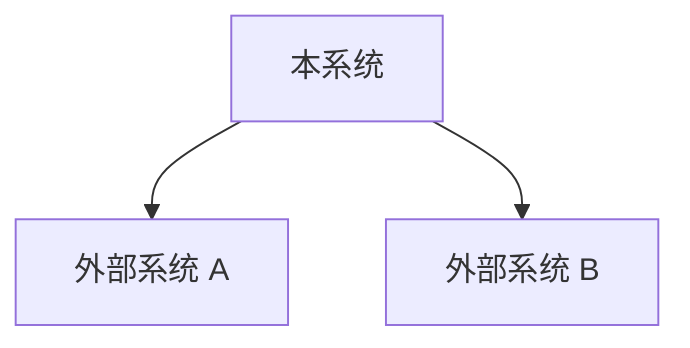

# 架构设计维度契约模板

**触发条件：** prd 标注涉及结构调整/新模块，或风险维度命中"结构性变更"
**产出文件：** `architecture/architecture.md`（始终拆分为独立子文件，不内联，位于 architecture 子目录中）
**产出方：** `@architecture-designer` 子代理
**可还原性目标：** 任意 AI 据此理解模块职责和依赖关系，不破坏边界

## 契约元素（MVCE）

architecture 维度的最小可验证契约元素集，标注 `[核心]` 或 `[可选]`：

- `[核心]` **模块边界表**：模块名、职责、对外接口、依赖模块
- `[核心]` **依赖方向声明**：允许的依赖方向，禁止的循环依赖
- `[核心]` **分层规则**：如 Controller → Service → Repository → Model
- `[核心]` **数据流描述**：主要数据流路径（从输入到输出）
- `[可选]` **技术选型理由表**：决策点、选项、选择、理由
- `[核心]` **错误传播链**：错误从产生层到用户可见层的传播路径和转换规则
- `[可选]` **跨层状态同步机制**：多层级状态的同步机制
- `[核心]` **负向设计空间**：禁止的架构模式

轻量级任务可省略 `[可选]` 元素。

## 契约内容

```markdown
## 架构设计

### 系统上下文图
（优先使用 Mermaid `graph` 或 `flowchart` 绘制系统与外部系统的边界和交互；Mermaid 无法表达的复杂注释场景可使用 ASCII 制图作为降级方案）



### 模块边界

| 模块名 | 职责 | 对外接口 | 依赖模块 |
|--------|------|---------|---------|
| [模块名] | [职责描述] | [接口列表] | [依赖列表] |

### 依赖方向
（允许的依赖方向，禁止的循环依赖）

### 分层规则
（如：Controller → Service → Repository → Model）

### 数据流
（优先使用 Mermaid `flowchart` 或 `sequenceDiagram` 绘制主要数据流路径：从输入到输出；Mermaid 无法表达的复杂注释场景可使用 ASCII 制图作为降级方案）

### 部署拓扑
（优先使用 Mermaid `graph` 绘制服务部署关系和网络拓扑；Mermaid 无法表达的复杂注释场景可使用 ASCII 制图作为降级方案）

### 技术选型理由

| 决策点 | 选项 | 选择 | 理由 |
|--------|------|------|------|
| [决策点] | [选项列表] | [选择] | [理由] |

**第三方依赖审查要求：**

引入的每个第三方依赖必须标注以下信息，禁止引入长期不活跃或 stars 数量较少的小众依赖：

| 依赖名 | 版本 | 最近发布 | Stars 量级 | 社区活跃度 | 采用理由 |
|--------|------|---------|-----------|-----------|---------|
| [依赖名] | [版本] | [日期] | [量级] | [活跃/稳定/维护中] | [理由] |

判定标准：
- **禁止引入**：最近一年无更新或 stars < 100 的依赖
- **谨慎引入**：stars 100-1000 或最近半年无更新，需在采用理由中说明必要性
- **优先选择**：stars > 1000 且最近三个月有更新的依赖
- **兜底**：未落入以上分类的依赖默认按谨慎引入处理，需在采用理由中说明必要性
- **豁免**：项目已有依赖的版本升级不在此审查范围内，但新增依赖必须经过审查

### 架构决策记录（ADR）
（关键架构决策，与 overview 的 ADR 对齐或补充）

### 错误传播链

定义错误从产生层到用户可见层的传播路径和转换规则：

| 错误来源 | 错误类型 | 传播路径 | 转换规则 | 用户可见形式 |
|---------|---------|---------|---------|------------|
| Repository | EntityNotFound | Repository → Service → Controller → UI | 转换为 404 NOT_FOUND | "资源不存在"提示 |
| Service | ValidationFailed | Service → Controller → UI | 转换为 400 INVALID_INPUT | 表单字段错误标注 |
| External API | Timeout | External → Adapter → Service → Controller → UI | 转换为 503 SERVICE_UNAVAILABLE | 重试按钮 + 错误提示 |

### 跨层状态同步机制

定义多层级状态（前端 state + 后端 session + 数据库）的同步机制：

| 状态类型 | 前端持有 | 后端持有 | 数据库持久化 | 同步触发 | 冲突解决 |
|---------|---------|---------|------------|---------|---------|
| 用户会话 | session token | session 元数据 | session 记录 | 登录/登出/过期 | 以后端为准 |
| 表单草稿 | local state | - | draft 记录 | 自动保存（30s）| 以最新版本为准 |
| 实时数据 | cache | cache | source of truth | 轮询/WebSocket | 以数据库为准 |
```

## 负向设计空间

architecture 维度的禁止模式：

- **禁止循环依赖**：模块间依赖必须形成有向无环图（DAG）
- **禁止跨层直接调用**：Controller 不得直接调用 Repository，必须经过 Service 层
- **禁止未捕获异常传播**：所有层必须捕获并转换异常，不得向调用方抛出原始异常
- **禁止隐式状态同步**：跨层状态同步必须显式声明同步机制，不得依赖隐式副作用
- **禁止上帝模块**：单个模块不得承担超过 3 个不相关职责
- **禁止引入小众依赖**：禁止引入最近一年无更新或 stars < 100 的第三方依赖
