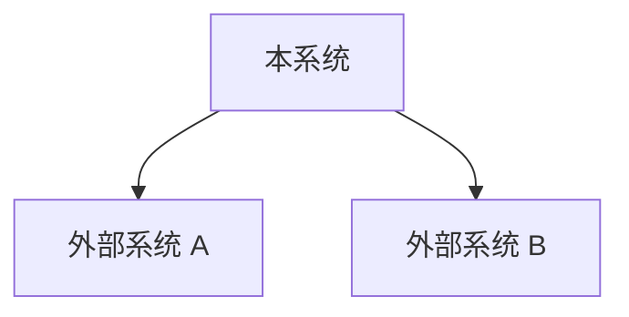

# 架构设计维度契约模板

**触发条件：** prd 标注涉及结构调整/新模块，或风险维度命中"结构性变更"
**产出文件：** `architecture/` 子目录下多个文件（索引 + 按关注点分组）
**产出方：** `@architecture-designer` 子代理
**可还原性目标：** 任意 AI 据此理解模块职责和依赖关系，不破坏边界

## 两阶段产出

### 阶段 1：索引层（1 次调用，≤ 300 行）

产出 `architecture/01-architecture.md`，含共享契约和分组方案：

```markdown
---
type: design-shard
status: active
section: "architecture"
parent: "design.md"
module: "architecture"
layer: index
heading_chain: "设计契约 > 架构设计"
---

## 架构设计

### 系统上下文图

（优先使用 Mermaid `graph` 绘制系统与外部系统的边界和交互）



### 技术选型理由

| 决策点 | 选项 | 选择 | 理由 |
|--------|------|------|------|
| [决策点] | [选项列表] | [选择] | [理由] |

**第三方依赖审查要求：**

| 依赖名 | 版本 | 最近发布 | Stars 量级 | 社区活跃度 | 采用理由 |
|--------|------|---------|-----------|-----------|---------|
| [依赖名] | [版本] | [日期] | [量级] | [活跃/稳定] | [理由] |

判定标准：
- **禁止引入**：最近一年无更新或 stars < 100
- **谨慎引入**：stars 100-1000 或最近半年无更新
- **优先选择**：stars > 1000 且最近三个月有更新
- **豁免**：项目已有依赖的版本升级不在此审查范围内

### 部署拓扑

（优先使用 Mermaid `graph` 绘制服务部署关系）

### 架构决策记录（ADR）

（关键架构决策，与 overview 的 ADR 对齐或补充）

### file-plan

（按关注点分组的文件生成计划）

### 负向设计空间

- **禁止循环依赖**：模块间依赖必须形成 DAG
- **禁止跨层直接调用**：Controller 不得直接调用 Repository
- **禁止未捕获异常传播**：所有层必须捕获并转换异常
- **禁止隐式状态同步**：跨层状态同步必须显式声明
- **禁止上帝模块**：单个模块不得承担超过 3 个不相关职责
- **禁止引入小众依赖**：禁止引入最近一年无更新或 stars < 100 的第三方依赖
```

### 阶段 2：分组实体层（按关注点分组，串行生成 + 即时校验）

#### module-boundary.md（模块边界 + 依赖方向 + 接口签名，≤ 300 行）

文件名格式：`NN-module-boundary.md`（NN 为序号，从 02 开始）。

```markdown
---
type: design-shard
status: active
section: "architecture-module-boundary"
parent: "01-architecture.md"
module: "architecture"
layer: entity-group
heading_chain: "设计契约 > 架构设计 > 模块边界"
---

## 模块边界

### 模块清单

| 模块名 | 职责 | 对外接口 | 依赖模块 |
|--------|------|---------|---------|
| [模块名] | [职责描述] | [接口列表] | [依赖列表] |

### 依赖方向

（允许的依赖方向，禁止的循环依赖）

### 分层规则

（如：Controller → Service → Repository → Model）

### 接口签名（伪代码）

```typescript
// UserService
interface UserService {
  createUser(input: CreateUserInput): Promise<User>
  findById(id: string): Promise<User | null>
  update(id: string, input: UpdateUserInput): Promise<User>
}

// ResourceRepository
interface ResourceRepository {
  save(resource: Resource): Promise<Resource>
  findById(id: string): Promise<Resource | null>
  list(query: ListQuery): Promise<{ data: Resource[], total: number }>
}
```
```

#### data-flow.md（数据流 + 错误传播链 + 跨层状态同步，≤ 300 行）

文件名格式：`NN-data-flow.md`（NN 为序号）。

```markdown
---
type: design-shard
status: active
section: "architecture-data-flow"
parent: "01-architecture.md"
module: "architecture"
layer: entity-group
heading_chain: "设计契约 > 架构设计 > 数据流"
---

## 数据流

（优先使用 Mermaid `flowchart` 或 `sequenceDiagram` 绘制主要数据流路径）

### 错误传播链

| 错误来源 | 错误类型 | 传播路径 | 转换规则 | 用户可见形式 |
|---------|---------|---------|---------|------------|
| Repository | EntityNotFound | Repository → Service → Controller → UI | 转换为 404 | "资源不存在"提示 |
| Service | ValidationFailed | Service → Controller → UI | 转换为 400 | 表单字段错误标注 |

### 跨层状态同步机制

| 状态类型 | 前端持有 | 后端持有 | 数据库持久化 | 同步触发 | 冲突解决 |
|---------|---------|---------|------------|---------|---------|
| 用户会话 | session token | session 元数据 | session 记录 | 登录/登出/过期 | 以后端为准 |
```

## 契约元素（MVCE）

- `[核心]` **模块边界表**：模块名、职责、对外接口、依赖模块
- `[核心]` **依赖方向声明**：允许的依赖方向，禁止的循环依赖
- `[核心]` **分层规则**：如 Controller → Service → Repository → Model
- `[核心]` **接口签名**：关键模块的 TypeScript interface 伪代码
- `[核心]` **数据流描述**：主要数据流路径（从输入到输出）
- `[可选]` **技术选型理由表**：决策点、选项、选择、理由
- `[核心]` **错误传播链**：错误从产生层到用户可见层的传播路径和转换规则
- `[可选]` **跨层状态同步机制**：多层级状态的同步机制
- `[核心]` **负向设计空间**：禁止的架构模式

轻量级任务可省略 `[可选]` 元素。
