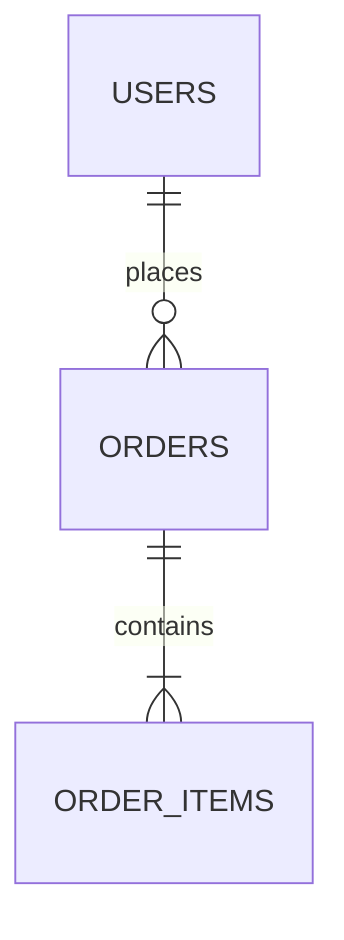

# 数据库设计维度契约模板

**触发条件：** prd 标注涉及数据层/持久化，或风险维度命中"数据持久化"
**产出文件：** `database/` 子目录下多个文件（索引 + 按表域分组）
**产出方：** `@database-designer` 子代理
**可还原性目标：** 任意 AI 据此生成一致性的 schema 和迁移脚本

## 两阶段产出

### 阶段 1：索引层（1 次调用，≤ 300 行）

产出 `database/01-database.md`，含共享契约和分组方案：

```markdown
---
type: design-shard
status: active
section: "database"
parent: "design.md"
module: "database"
layer: index
heading_chain: "设计契约 > 数据库设计"
---

## 数据库设计

### ER 模型

（优先使用 Mermaid `erDiagram` 绘制实体关系图）



### 表清单

| 表 ID | 表名 | 功能域 | 文件 | 描述 |
|-------|------|--------|------|------|
| T-users | users | core | 02-tables-core.md | 用户表 |
| T-resources | resources | core | 02-tables-core.md | 资源表 |
| T-audit-log | audit_log | aux | 03-tables-aux.md | 审计日志表 |

### 关系与外键

| 源表.字段 | 目标表.字段 | 级联规则 |
|-----------|------------|---------|
| orders.user_id | users.id | ON DELETE CASCADE |

### 范式决策

- 范式级别：[3NF / BCNF / 反范式]
- 反范式理由：[如适用]

### 迁移策略

- 初始迁移：[schema 创建]
- 数据迁移：[如适用]
- 回滚策略：[down 迁移]

### 数据生命周期

- 保留策略：[TTL / 归档 / 永久]
- 归档规则：[如适用]
- 清理策略：[如适用]

### 分库分表规则

（如适用：分片键、分片策略、跨分片查询处理）

### 敏感字段标注

| 表.字段 | 敏感级别 | 保护措施 |
|---------|---------|---------|
| users.email | PII | 加密存储 |
| users.password_hash | 凭证 | bcrypt + salt |

### file-plan

（按功能域分组的文件生成计划）

### 负向设计空间

- **禁止无索引的外键**：所有外键必须创建索引
- **禁止无约束的必填字段**：NOT NULL 字段必须有应用层校验
- **禁止明文存储敏感数据**：密码、密钥、Token 必须加密或哈希存储
- **禁止无回滚的迁移**：所有迁移脚本必须包含 up 和 down
- **禁止跨库 join**：分库后不得跨库 join
- **禁止无分页的列表查询**：列表查询必须包含分页参数
```

### 阶段 2：分组实体层（每表域 1 次调用，串行生成 + 即时校验）

#### tables-<domain>.md（按功能域分组的表文件，每组 ≤ 300 行）

文件名格式：`NN-tables-<domain>.md`（NN 为序号，从 02 开始）。每文件含该域所有表的完整 DDL：

```markdown
---
type: design-shard
status: active
section: "database-tables-core"
parent: "01-database.md"
module: "database"
layer: entity-group
heading_chain: "设计契约 > 数据库设计 > 核心域表"
---

## 核心域表

### T-users: users

```sql
CREATE TABLE users (
  id UUID PRIMARY KEY DEFAULT gen_random_uuid(),
  email VARCHAR(255) NOT NULL UNIQUE,
  password_hash VARCHAR(255) NOT NULL,
  name VARCHAR(100) NOT NULL,
  role VARCHAR(50) NOT NULL DEFAULT 'user',
  created_at TIMESTAMP NOT NULL DEFAULT NOW(),
  updated_at TIMESTAMP NOT NULL DEFAULT NOW()
);

CREATE INDEX idx_users_email ON users(email);
CREATE INDEX idx_users_role ON users(role);
```

### T-resources: resources

```sql
CREATE TABLE resources (
  id UUID PRIMARY KEY DEFAULT gen_random_uuid(),
  name VARCHAR(100) NOT NULL,
  type VARCHAR(10) NOT NULL CHECK (type IN ('A', 'B', 'C')),
  created_by UUID NOT NULL REFERENCES users(id) ON DELETE CASCADE,
  created_at TIMESTAMP NOT NULL DEFAULT NOW(),
  updated_at TIMESTAMP NOT NULL DEFAULT NOW()
);

CREATE INDEX idx_resources_created_by ON resources(created_by);
CREATE INDEX idx_resources_type ON resources(type);
```

### 种子数据

```sql
INSERT INTO users (email, password_hash, name, role) VALUES
  ('admin@example.com', '$2b$10$...', '管理员', 'admin');
```
```

## 契约元素（MVCE）

- `[核心]` **ER 模型**：实体关系图（Mermaid `erDiagram`）
- `[核心]` **表结构**：每张表（含稳定 ID `T-XXX`）的完整 DDL（CREATE TABLE + 索引 + 约束）
- `[核心]` **关系与外键表**：源表.字段 → 目标表.字段，级联规则
- `[可选]` **范式决策**：范式级别和反范式理由
- `[核心]` **迁移策略**：初始迁移、数据迁移、回滚策略
- `[可选]` **种子数据**：必需的初始数据（INSERT 语句）
- `[核心]` **敏感字段标注**：表.字段、敏感级别、保护措施
- `[核心]` **负向设计空间**：禁止的数据库模式

轻量级任务可省略 `[可选]` 元素。
