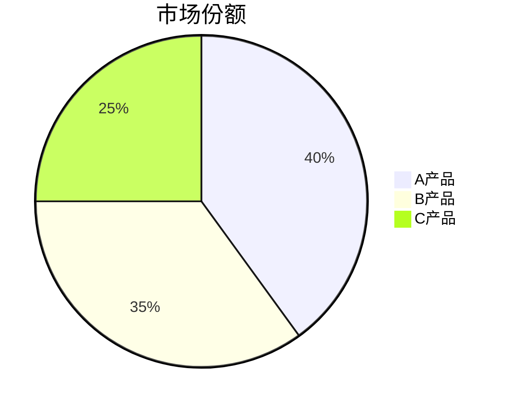

# ae:pptx-from-outline — 大纲转 PPTX

将确认后的幻灯片大纲（Markdown 文件）转换为 PowerPoint 演示文稿。底层调用 `ae-pptx` 工具，遵循两阶段预览确认流程。

大纲是内容真源，本技能禁止镀金——不扩展、不补充、不虚构任何大纲中未明确出现的内容。

## 适用场景

- 用户已通过 `ae:slides-outline` 产出确认的大纲文件，需要生成 PPTX 格式演示文稿
- 用户自行编写了符合大纲格式的 Markdown 文件，需要转为 PPTX
- 用户需要对已有大纲微调布局或图表样式后生成 PPTX

## 不适用场景

- 生成或修改大纲内容（使用 `ae:slides-outline`）
- 生成 HTML 幻灯片（使用 `ae:slides-forge`）
- 将 HTML 文件转为 PPTX（使用 `ae:html-to-pptx`）
- 直接创建/编辑 PPTX 但无大纲参考（使用 `ae:pptx`，它支持自由创建、编辑和兼容模式布局）

## 执行流程

### 1. 读取大纲

读取 `$ARGUMENTS` 中指定的大纲文件路径。文件必须是已确认的 Markdown 大纲。

如果参数不是文件路径或文件不存在，向用户说明并终止流程。

### 2. 解析大纲结构

逐页解析大纲中的以下信息：

- **页编号与标题**：从 Markdown 结构中提取每页幻灯片的编号、标题和正文内容。支持以下标题格式变体：`## 第 1 页：标题`、`## Slide 1: Title`、`## 1. 标题`，以及其他以二级标题开头且包含页码信息的格式
- **布局提示词**：识别大纲中的 `[layout: <描述>]` 标记，作为该页的布局设计依据
  - 如果大纲包含布局提示词，遵循提示词设计该页元素布局
  - 如果大纲不含布局提示词，根据内容类型自动推断最合适的布局
- **图表描述**：识别大纲中的 mermaid 代码块或图表描述段落，映射为 `ae-pptx` 的 chart 元素
- **线框/流程描述**：识别大纲中的 ASCII 线框图或结构描述，映射为 shape + text 元素组合
- **表格内容**：识别大纲中的 Markdown 表格，映射为 `ae-pptx` 的 table 元素

### 3. 布局映射

#### 自动布局推断规则（大纲无 `[layout:]` 提示词时）

| 内容类型 | 默认布局 | 说明 |
|----------|----------|------|
| 仅标题 + 副标题 | title | 居中标题，适合封面/章节页 |
| 标题 + 项目符号列表 | content | 标题在顶部，列表在下方 |
| 标题 + 表格 | content | 标题在顶部，表格居中 |
| 标题 + 图表描述 | content | 标题在顶部，图表居中 |
| 标题 + 图片 + 文字 | left-right | 左文右图或左图右文 |
| 标题 + 多段图文 | bento | 不对称网格布局 |
| 纯结尾/致谢页 | section | 居中简短内容 |

#### 支持的布局提示词

大纲中每页标题行前或正文开头可添加 `[layout: <描述>]`，支持的描述：

- `[layout: title]` — 封面/标题页：大标题居中
- `[layout: section]` — 章节分隔页：居中标题 + 可选副标题
- `[layout: content]` — 内容页：标题在顶部，正文在下方
- `[layout: left-right]` — 左右分栏：左文字右视觉元素
- `[layout: right-left]` — 右左分栏：右文字左视觉元素
- `[layout: two-column]` — 双栏等宽对比
- `[layout: bento]` — 不对称网格
- `[layout: image-focus]` — 图片为主，文字辅助
- `[layout: quote]` — 引语页：大字引语 + 署名
- `[layout: blank]` — 空白页：仅背景 + 可选小标题

### 4. 图表与线框映射

#### mermaid 代码块映射

| mermaid 类型 | PPTX 元素 | 说明 |
|--------------|-----------|------|
| `pie` | chart (pie/doughnut) | 提取数据点映射为饼图 |
| `bar` / `gantt` | chart (bar) | 提取类别与数值映射为柱状图 |
| `line` / `sequenceDiagram` | chart (line) | 提取序列映射为折线图 |
| `graph TD/LR` | shape + text 组合 | 流程图映射为形状连线组合 |
| `mindmap` | shape + text 组合 | 思维导图映射为嵌套形状布局 |

映射规则：
- 提取 mermaid 代码块中的数据点（标签、数值、节点关系）
- 选择最接近的 PPTX chart 类型渲染数据型图表
- 流程/关系型图表使用 shape 元素组合渲染（矩形、椭圆、箭头连线）
- 无法精确映射时降级为 text 元素展示图表描述文字，不跳过该页内容

#### ASCII 线框映射

识别用字符绘制的线框图（如 `+---+`、`|` 等构成的布局框），映射为 shape + table 组合：
- 线框中的框 → rect/roundRect shape
- 线框中的文字 → shape 内 text 元素
- 线框中的箭头线 → line shape
- 线框中的网格结构 → table 元素

无法精确映射时降级为 text 元素展示原文。

同一页包含多种特殊内容（图表 + 线框 + 表格）时，按以下优先级映射：表格 > 图表 > 线框。优先级高的内容占据主要布局区域，其余内容缩小或降级为 text 展示。

### 5. 预览确认（阶段一）

在调用 `ae-pptx` 工具前，向用户展示即将生成的内容结构：

- 每页列出：页码 | 布局类型 | 元素清单（类型、位置、关键内容摘要）
- 图表页标注：数据来源（mermaid 代码块 / 表格）→ 映射的 chart 类型
- 线框页标注：原始描述 → 映射的 shape 组合
- 总页数 + 演示文稿标题

直接向用户请求确认（确认 / 需要修改 / 取消）。

如果用户需要修改，根据修改意见调整布局或映射方案后再次预览，直到用户确认。

### 6. 执行生成（阶段二）

用户确认后，调用 `ae-pptx` 工具的 `create` 操作，将大纲逐页转换为 `slides` 数组。超过 10 页时，先用 `create` 生成前 3 页，再用 `append-slides` 分批追加后续页面，每批 3 页，避免单次调用参数过大导致 JSON 解析错误。分批粒度根据实际验证：3 页/批在 CJK 内容场景下稳定可用；8 页/批或更大 payload 会触发 JSON 解析失败。

- 每页幻灯片使用 `elements` 元素化绘制模式
- 根据布局提示词或自动推断结果设计每页元素的位置、尺寸和样式
- 大纲正文内容逐字映射到 text 元素的 text/textRuns，不增减文字
- **CJK 字体映射**：中文、日文、韩文等 CJK 字符必须使用 CJK 兼容字体（如 `Microsoft YaHei`、`SimHei`、`Noto Sans CJK`），不得使用 Helvetica、Courier 等不含 CJK 字形的西方字体，否则渲染为空白或黑框
- **统一字体策略**：页面标题和正文统一使用 CJK 兼容字体（如 `Microsoft YaHei`），英文/代码辅助文本可搭配西方字体（如 `Courier New`），但同一页内 CJK 文本不得混入不含 CJK 字形的字体
- 表格映射为 table 元素，保留原始行列数据
- 图表映射为 chart 元素，提取原始数据点
- 流程/线框映射为 shape + text 组合
- 如果 `ae-pptx` 工具调用失败，将错误信息完整返回给用户，不静默重试

### 6.1 内容质量规范

调用 `ae-pptx` 工具生成元素时，必须遵守以下内容质量硬约束。违反任何一条即为交付失败。

#### 字体大小标准

| 元素角色 | 最小字号（磅） | 建议字号范围 | 说明 |
|----------|---------------|-------------|------|
| 页面标题 | 24 | 28-36 | 每页最醒目文字，不得小于 24pt |
| 正文段落 | 14 | 16-20 | 主要阅读内容，不得小于 14pt |
| 列表项 | 12 | 14-18 | 项目符号或编号列表，不得小于 12pt |
| 表格正文 | 10 | 12-14 | 表格单元格内容，不得小于 10pt |
| 辅助标注 | 8 | 10-12 | 脚注、来源说明、坐标轴标签等，不得小于 8pt |
| 图表数据标签 | 8 | 10-12 | 图表内数字/类别文字，不得小于 8pt |

- 标题与正文字号差必须 ≥ 8pt，确保层级可区分
- 同一角色元素在同一演示文稿中字号保持一致，不得逐页随意变化
- 大纲中无字号要求时，按建议字号范围的中值选取

#### 颜色对比度硬约束

- **前景色（文字/图标）与背景色对比度不得低于 WCAG AA 标准**：正文文字最低 4.5:1，大标题最低 3:1
- **禁止前景色与背景色相似**：两者色差必须足够大，确保在任何显示环境下文字清晰可读
  - 深色背景（如 #050505、#111111、#1A1A1A）上必须使用高对比前景色（如 #FFFFFF、#EAEAEA、#F0F0F0）
  - 浅色背景（如 #FFFFFF、#F5F5F5、#FAFAFA）上必须使用深色前景色（如 #111111、#1A1A1A、#333333）
  - 禁止在深色背景上使用深色文字（如 #333333 on #111111），禁止在浅色背景上使用浅色文字（如 #CCCCCC on #FFFFFF）
- **强调色不得同时作为前景色和背景色**：强调色仅用于标签、边框、图标等小面积装饰元素，不得作为大面积背景或正文文字颜色
- **同一演示文稿中背景色系锁定**：所有页面使用同一背景色系（全深色或全浅色），不得中途翻转导致对比度规则失效
- 若大纲指定了风格色系（如 Dark Tech），必须在该色系内遵守对比度规则；大纲未指定时，默认选择深色背景 + 高对比前景色方案

#### 布局合理性规范

- **元素间距统一**：相邻元素间距至少 0.15 英寸（约 10pt），标题与正文间距至少 0.25 英寸（约 18pt）
- **内容不溢出**：所有文字必须在元素边界内完整显示，不得裁剪或溢出；文字过长时缩小字号（不低于最小字号）或拆分为多个元素
- **层级分明**：每页最多 3 层字号层级（标题 > 正文 > 辅助），不得出现 4 层以上字号混用
- **对齐一致**：同一页内同角色元素对齐方式保持一致（标题统一居中或统一左对齐，正文统一对齐方式）
- **空白区域充裕**：每页至少保留 10% 的空白区域，不得将内容填满整页；页面边距至少 0.5 英寸（约 36pt）
- **元素位置不重叠**：任何两个可见元素不得在同一坐标区域重叠，除非是刻意叠层设计（如背景色块 + 前景文字）
- **表格与图表尺寸合理**：表格宽度不超过页面宽度 90%，图表尺寸适配内容量，不得出现过小或过大导致阅读困难

### 7. 交付

生成完成后，提供：
- PPTX 文件路径（`ae/documents/pptx/` 目录下）
- 总页数摘要
- 布局方案概述（每页布局类型）
- 图表映射说明（哪些 mermaid/ASCII 映射为哪些 PPTX 元素类型）
- 颜色对比度校验声明：每页前景色与背景色对比度是否满足 WCAG AA 标准

## 大纲格式约定

输入大纲应遵循以下 Markdown 格式（与 `ae:slides-outline` 产出一致）：

```markdown
# 幻灯片大纲：主题标题

## 第 1 页：封面标题
[layout: title]
内容文案...

## 第 2 页：章节标题
[layout: content]
- 要点一
- 要点二

## 第 3 页：数据展示
[layout: content]



## 第 4 页：流程说明
[layout: left-right]

+----------+     +----------+
|  步骤 1  | --> |  步骤 2  |
+----------+     +----------+

## 第 N 页：结束页
[layout: section]
感谢观看
```

每页以 `## 第 X 页：标题` 开头，可选 `[layout: 描述]`，后续为正文内容。

## 边界

- 大纲是内容真源，禁止镀金：不增减文字、不虚构数据、不补充大纲未出现的要点
- 预览确认前不得调用 `ae-pptx` 工具
- 不生成 HTML 幻灯片，不调用 `ae:web-forge`
- 图表/线框映射无法精确还原时降级为 text 展示，不跳过内容
- 本技能只产出 PPTX 文件，不修改大纲文件
- 如大纲未经确认，提示用户先使用 `ae:slides-outline` 完成确认
- **颜色对比度硬约束**：任何前景色与背景色对比度不得低于 WCAG AA 标准；违反此约束即为交付失败，不得以大纲未指定为由跳过
- **CJK 字体硬约束**：所有 CJK 字符必须使用 CJK 兼容字体渲染，使用不含 CJK 字形的西方字体导致文字不可见即为交付失败
- **分批生成硬约束**：超过 10 页的 PPTX 必须分批生成（create 3 页 + append-slides 每批 3 页），不分批导致 JSON 解析失败即为流程错误

## 输出要求

- 产出为 PPTX 文件，路径在 `ae/documents/pptx/` 目录下
- 交付时提供：文件路径 + 页数摘要 + 布局方案概述 + 图表映射说明

## 验证方式

- PPTX 文件是否成功生成且可打开
- 每页内容是否与大纲原文一致（文字不增减）
- 布局是否遵循大纲中的 `[layout:]` 提示词（如有）或自动推断结果
- 图表/线框是否合理映射（mermaid → chart，ASCII → shape 组合）
